# Helix VPN — MVP2 Architecture & Technology Stack Document

**Revision:** 2
**Last modified:** 2026-07-04T12:00:00Z

## Cross-Platform Client Architecture: Rust Core + Multi-Platform UI

**Version**: 1.1
**Date**: July 2025 (Revision 2: 2026-07-04)
**Status**: Architecture Decision Record (ADR) — Approved  
**Audience**: Engineering Leads, Platform Teams, DevOps, Security Review  
**Classification**: Internal — Engineering Confidential

> **Revision 2 changelog:** added the Connection Lifecycle State Machine
> diagram (§5.6), a cross-platform Enterprise Hardening & Production
> Readiness overview (§10), and reconciled the §7.1 phase table against the
> risk-adjusted schedule in `MVP2_IMPLEMENTATION_ROADMAP.md`. This document
> remains the shared source of truth for cross-platform architectural
> contracts (FFI boundaries, protocol list, platform adapter trait, code
> reuse percentages) — platform-specific documents defer to it on conflict.

---

## Table of Contents

1. [Executive Summary](#1-executive-summary)
2. [High-Level System Architecture](#2-high-level-system-architecture)
3. [Technology Stack Decision Matrix](#3-technology-stack-decision-matrix)
4. [Code Reusability Analysis](#4-code-reusability-analysis)
5. [Data Flow Architecture](#5-data-flow-architecture)
6. [Technology Justification](#6-technology-justification)
7. [Implementation Roadmap](#7-implementation-roadmap)
8. [Risk Assessment & Mitigation](#8-risk-assessment--mitigation)
9. [Appendices](#9-appendices)
10. [Enterprise Hardening & Production Readiness](#10-enterprise-hardening--production-readiness)

---

## 1. Executive Summary

### 1.1 Phase 2 Goals and Scope

MVP2 represents the architectural foundation for Helix VPN's expansion from a single-platform prototype to a **unified, multi-platform VPN ecosystem** spanning eight distinct target platforms. This phase establishes the structural blueprint that will govern all subsequent development, with an uncompromising focus on three architectural pillars:

| Pillar | Target | Measurement |
|--------|--------|-------------|
| **Maximal Code Reuse** | 75-85% shared code across all platforms | Lines of Rust core code vs. platform-specific code |
| **Minimal Footprint** | Sub-25 MB bundles on all platforms | Compressed installer size per platform |
| **Native Performance** | <100ms UI response, <50ms tunnel establishment | Latency benchmarks on reference hardware |

### 1.2 Target Platforms

MVP2 covers **eight platforms** organized into four tiers based on market priority and technical complexity:

```
TIER 1 (P0 — Core Revenue Platforms)
├── macOS     (Apple Silicon + Intel)    — NetworkExtension framework
├── Windows   (10/11, x64 + ARM64)       — WFP + WinTUN driver
├── Linux     (x64 + ARM64)              — TUN/TAP + Netlink/D-Bus
└── Android   (API 26+, ARM64/x86_64)    — VpnService API

TIER 2 (P1 — Strategic Growth Platforms)
├── iOS       (15+, ARM64)               — NEPacketTunnelProvider
└── HarmonyOS (API 12+, ARM64)           — VpnExtensionAbility

TIER 3 (P2 — Specialized/Niche Platforms)
├── Aurora OS (ARM64)                    — ConnMan VPN + Qt native

TIER 4 (P3 — Companion/Extension)
└── Web       (Chrome/Firefox/Edge/Safari) — Browser Extension + PWA
```

### 1.3 Key Architectural Principles

**Principle 1: One Core to Rule Them All**

The `helix-core` Rust library is the single source of truth for all VPN functionality. Every platform — from desktop to mobile to web — consumes this core through language-appropriate bindings. This eliminates the "multiple implementations, divergent behavior" anti-pattern that plagues multi-platform VPN products.

**Principle 2: Platform Adapters, Not Platform Forks**

Each platform implements a thin **Platform Adapter** that bridges the Rust core to native OS VPN APIs. Adapters handle TUN creation, routing, DNS configuration, and firewall rules — but contain zero VPN protocol logic. The adapter pattern ensures that WireGuard crypto, state machines, and connection management live exclusively in the shared core.

**Principle 3: UI is Disposable, Core is Eternal**

UI frameworks come and go. The Rust core is designed to outlive any individual UI layer. Desktop may migrate from Tauri to a native framework; mobile may adopt a future cross-platform solution. The core remains unchanged, bound only by its C ABI.

**Principle 4: Security by Default**

Every architectural decision prioritizes security: memory-safe Rust for the core, capability-based permissions for desktop (Tauri), hardware-backed keystore integration on mobile, and kernel-level kill switches on all platforms where supported.

### 1.4 Strategic Outcomes

By the conclusion of MVP2, Helix VPN will have:

- A production-grade Rust shared core (`helix-core`) with 75-85% code reuse
- Desktop applications for macOS, Windows, and Linux via Tauri v2 (<15 MB each)
- Mobile applications for Android and iOS via Flutter (<25 MB each)
- HarmonyOS support through Flutter's ohos embedding layer
- Aurora OS support via Qt6/QML with direct FFI to the Rust core
- Browser extension companion with WASM-compiled crypto
- Unified CI/CD pipeline building all 8 platform artifacts from a single `main` branch

---

## 2. High-Level System Architecture

### 2.1 Overall System Diagram

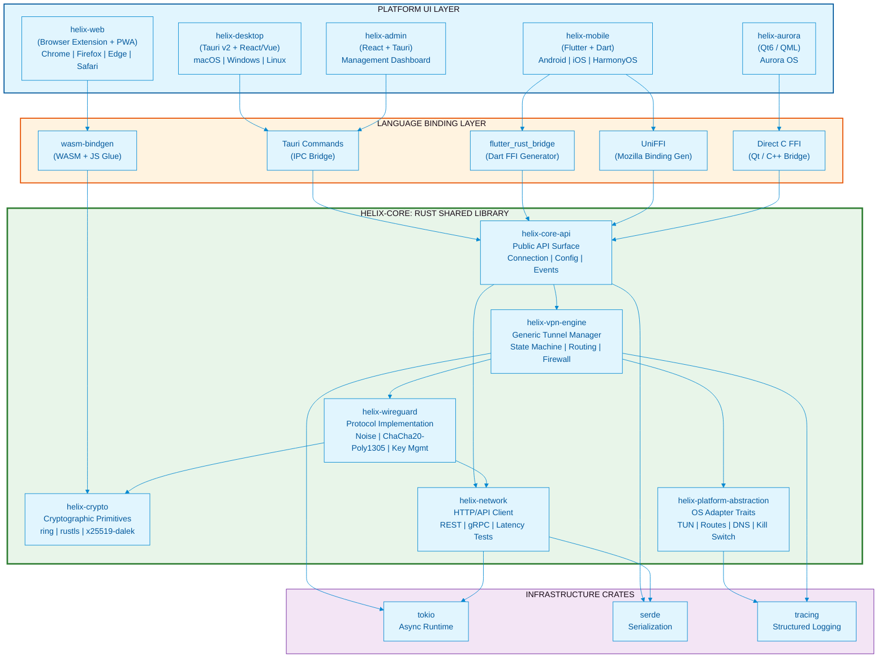

### 2.2 Component Breakdown

#### 2.2.1 `helix-core` — Rust Shared Library

The heart of the architecture. A single Rust crate workspace compiled for all target platforms, exposing a C ABI interface consumed by each platform's UI layer.

**Workspace Structure:**

```
helix-core/
├── Cargo.toml                     # Workspace manifest
├── crates/
│   ├── helix-core-api/            # Public API: all FFI entry points
│   ├── helix-vpn-engine/          # Generic tunnel management
│   ├── helix-wireguard/           # WireGuard protocol (boringtun-derived)
│   ├── helix-crypto/              # Encryption primitives wrapper
│   ├── helix-network/             # HTTP client, latency testing
│   └── helix-platform-abstraction/# OS adapter trait implementations
├── bindings/
│   ├── uniffi/                    # UniFFI UDL + generated bindings
│   └── wasm/                      # wasm-bindgen target config
└── tests/
    ├── integration/               # Cross-platform integration tests
    └── fuzz/                      # Crypto fuzzing targets
```

**Key Design Pattern — Mullvad-Style Layered Architecture:**

Following Mullvad VPN's proven architecture (`talpid` layer + product-specific layer), Helix separates generic VPN functionality from Helix-specific business logic:

| Layer | Crate | Purpose | Agnostic? |
|-------|-------|---------|-----------|
| Product Layer | `helix-core-api` | Account management, server lists, Helix REST API | Helix-specific |
| Generic VPN | `helix-vpn-engine` | Tunnel state machine, routing, firewall, DNS | Product-agnostic |
| Protocol | `helix-wireguard` | WireGuard Noise handshake, crypto, packet I/O | Protocol-agnostic |
| Platform | `helix-platform-abstraction` | TUN, routes, firewall per OS | Platform-specific impls |

> "The `talpid` crates are supposed to be completely unrelated to Mullvad specific things... This maximizes portability and testability." — Mullvad Architecture Documentation

#### 2.2.2 `helix-desktop` — Tauri-Based Desktop Application

| Attribute | Value |
|-----------|-------|
| **Framework** | Tauri v2 (Rust backend + Web frontend) |
| **Frontend** | React 19 + TypeScript (or Vue/Svelte by team preference) |
| **Platforms** | macOS 12+, Windows 10/11, Linux (Ubuntu 22.04+, Fedora 39+) |
| **Bundle Target** | `.dmg` (macOS), `.msi`/`.exe` (Windows), `.AppImage`/`.deb`/`.rpm` (Linux) |
| **Bundle Size** | <15 MB compressed |
| **RAM Target** | <80 MB at idle |

**Architecture:**

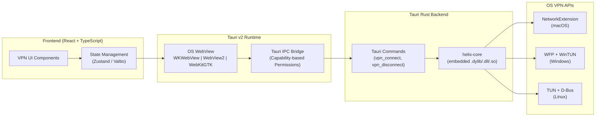

**Key Tauri Commands:**

```rust
#[tauri::command]
async fn vpn_connect(
    state: tauri::State<'_, VpnState>,
    server_id: String,
    protocol: Protocol,
) -> Result<ConnectionInfo, VpnError> {
    state.core.connect(&server_id, protocol).await
}

#[tauri::command]
async fn vpn_disconnect(state: tauri::State<'_, VpnState>) -> Result<(), VpnError> {
    state.core.disconnect().await
}

#[tauri::command]
async fn get_connection_state(
    state: tauri::State<'_, VpnState>
) -> Result<ConnectionState, VpnError> {
    Ok(state.core.get_state().await)
}
```

#### 2.2.3 `helix-mobile` — Flutter-Based Mobile Application

| Attribute | Value |
|-----------|-------|
| **Framework** | Flutter 3.29+ (Dart) |
| **Rendering** | Impeller (iOS default, Android default, macOS beta) |
| **Platforms** | Android 8+ (API 26+), iOS 15+, HarmonyOS (API 12+) |
| **Rust Bridge** | `flutter_rust_bridge` v2.0+ (Flutter Favorite) |
| **Bundle Target** | `.apk`/`.aab` (Android), `.ipa` (iOS), `.hap` (HarmonyOS) |
| **Bundle Size** | <25 MB per platform |
| **RAM Target** | <120 MB at idle |

**Architecture:**

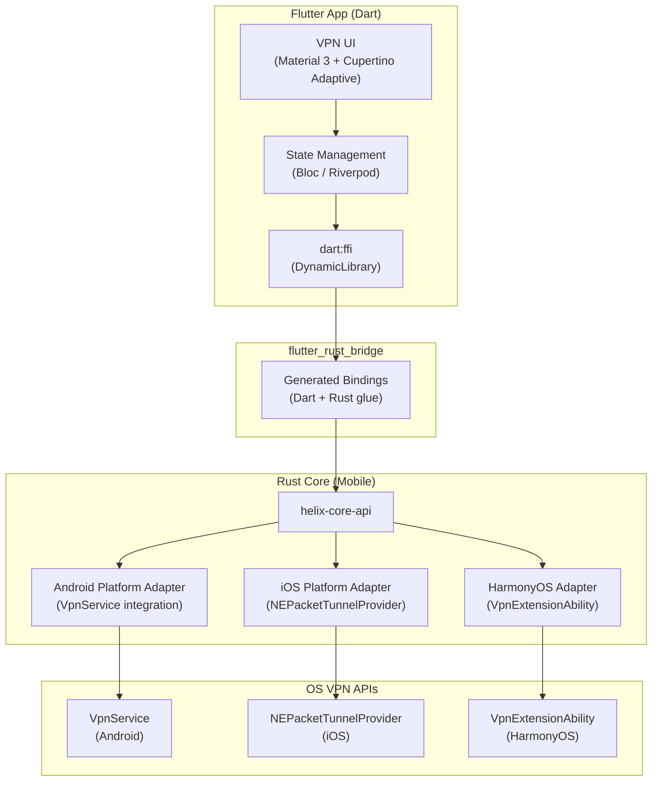

**Flutter-Rust Integration Pattern:**

```dart
// Dart side — auto-generated by flutter_rust_bridge
final rustApi = await createHelixRustApi();

// Connect to VPN
final result = await rustApi.vpnConnect(
  serverId: 'us-east-1',
  protocol: WireGuard(),
);

// Listen for state changes
rustApi.connectionStateStream.listen((state) {
  print('VPN State: ${state.status}');
});
```

#### 2.2.4 `helix-aurora` — Qt-Based Aurora OS Application

| Attribute | Value |
|-----------|-------|
| **Framework** | Qt 6.7+ / QML |
| **Language** | C++ (UI) + Rust (core via FFI) |
| **Platform** | Aurora OS 4.x+ (Sailfish OS derivative) |
| **Rust Bridge** | Direct C FFI (`cbindgen` headers) |
| **Bundle Target** | `.rpm` (Aurora OS package format) |
| **Bundle Size** | <20 MB |

**Architecture:**

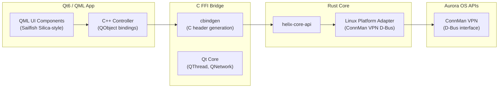

#### 2.2.5 `helix-web` — Browser Extension + PWA Companion

| Attribute | Value |
|-----------|-------|
| **Type** | Browser Extension (Manifest V3) + PWA |
| **Extension APIs** | `chrome.proxy` / `browser.proxy` |
| **Rust Usage** | WASM for crypto only (no raw networking in browser) |
| **WASM Bridge** | `wasm-bindgen` + `wasm-pack` |
| **Bundle Size** | <5 MB (extension), <3 MB (PWA) |

**Architecture:**

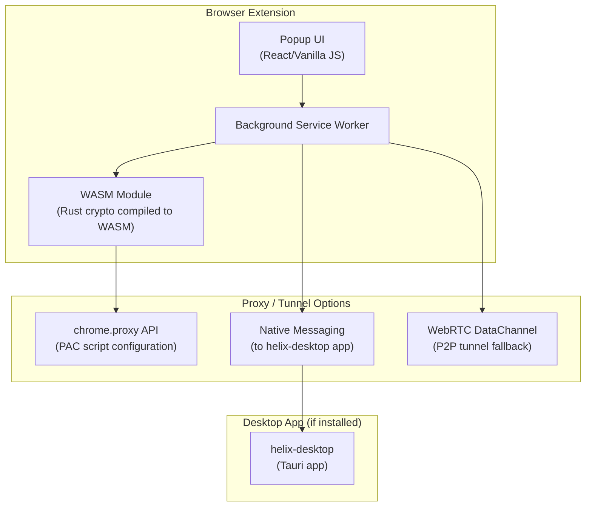

**Critical Constraint**: Browsers cannot create TUN interfaces or raw sockets. The web client operates in three modes:

| Mode | Capability | Requirements |
|------|-----------|--------------|
| **Proxy Mode** | Routes browser traffic through VPN gateway via PAC script | VPN gateway with HTTP proxy support |
| **Native Bridge** | Full device VPN via native messaging to helix-desktop | helix-desktop installed on same machine |
| **P2P Mode** | WebRTC-based tunnel to VPN server (experimental) | WebRTC-compatible VPN server |

#### 2.2.6 `helix-admin` — Admin/Management Interface

| Attribute | Value |
|-----------|-------|
| **Framework** | Tauri v2 (shared with helix-desktop) |
| **Frontend** | React + admin dashboard component library |
| **Purpose** | Enterprise fleet management, configuration deployment, analytics |
| **Audience** | IT administrators, MSPs, enterprise customers |

### 2.3 Module Dependency Graph

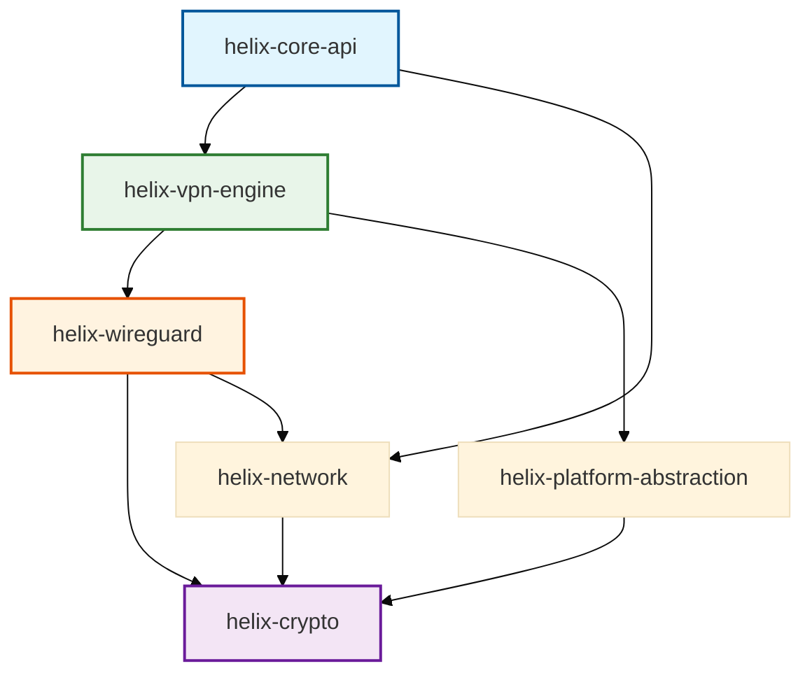

---

## 3. Technology Stack Decision Matrix

### 3.1 Platform-by-Platform Stack

| Platform | UI Framework | Rust Integration | Native VPN API | Bundle Size | RAM Idle | Code Reuse |
|----------|-------------|------------------|----------------|-------------|----------|------------|
| **macOS** | Tauri v2 (React + WKWebView) | Tauri Commands (IPC) | `NetworkExtension` (NEPacketTunnelProvider) | < 15 MB | < 80 MB | 85% |
| **Windows** | Tauri v2 (React + WebView2) | Tauri Commands (IPC) | `WFP` + `WinTUN` driver | < 15 MB | < 80 MB | 80% |
| **Linux** | Tauri v2 (React + WebKitGTK) | Tauri Commands (IPC) | `TUN` + `D-Bus` (NetworkManager) | < 15 MB | < 80 MB | 85% |
| **Android** | Flutter 3.29+ (Impeller) | `flutter_rust_bridge` v2 | `VpnService` + `Builder` | < 25 MB | < 120 MB | 72% |
| **iOS** | Flutter 3.29+ (Impeller/Metal) | `flutter_rust_bridge` + UniFFI | `NEPacketTunnelProvider` | < 25 MB | < 120 MB | 72% |
| **HarmonyOS** | Flutter 3.22-ohos | `flutter_rust_bridge` | `VpnExtensionAbility` | < 25 MB | < 120 MB | 70% |
| **Aurora OS** | Qt6 / QML | Direct FFI / C-bindings | `ConnMan VPN` (D-Bus) | < 20 MB | < 100 MB | 75% |
| **Web** | Browser Extension + PWA | WASM (`wasm-bindgen`) | `chrome.proxy` API | < 5 MB | N/A | 45% |

### 3.2 Stack Rationale Summary

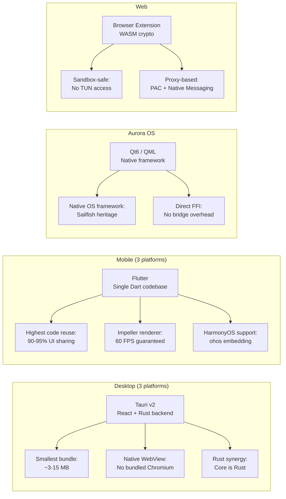

### 3.3 Third-Party Dependencies

**Desktop (Tauri):**

| Dependency | Version | Purpose |
|------------|---------|---------|
| `tauri` | ^2.0 | App shell, IPC, bundling |
| `tauri-plugin-notification` | ^2.0 | Native notifications |
| `tauri-plugin-autostart` | ^2.0 | Launch on boot |
| `tauri-plugin-updater` | ^2.0 | OTA auto-updates |
| `tauri-plugin-single-instance` | ^2.0 | Prevent multiple instances |
| `react` | ^19.0 | UI framework |

**Mobile (Flutter):**

| Dependency | Version | Purpose |
|------------|---------|---------|
| `flutter` | ^3.29 | Framework + engine |
| `flutter_rust_bridge` | ^2.0 | Rust bindings |
| `flutter_bloc` | ^9.0 | State management |
| `dio` | ^5.0 | HTTP client |
| `hive` | ^2.2 | Local storage |

**Rust Core:**

| Dependency | Version | Purpose |
|------------|---------|---------|
| `tokio` | ^1.0 | Async runtime |
| `boringtun` / `gotatun` | git | WireGuard protocol |
| `tun-rs` | ^2.0 | Cross-platform TUN |
| `ring` | ^0.17 | Crypto primitives |
| `rustls` | ^0.23 | TLS stack |
| `serde` | ^1.0 | Serialization |
| `reqwest` | ^0.12 | HTTP client |
| `uniffi` | ^0.28 | Binding generation |

---

## 4. Code Reusability Analysis

### 4.1 Percentage Breakdown Per Platform

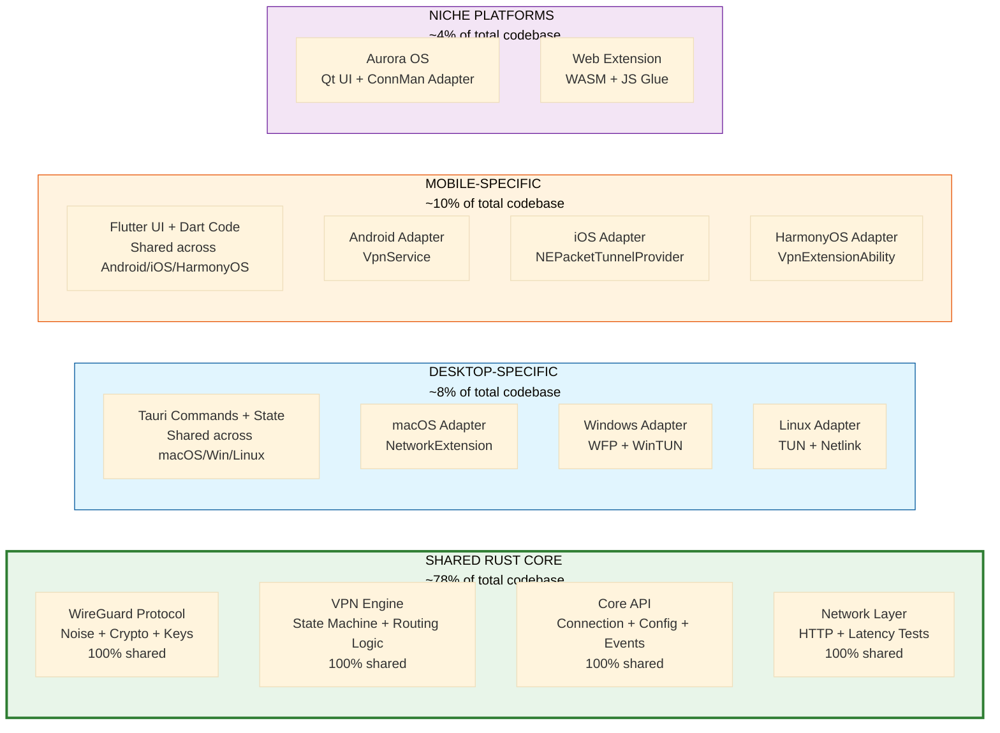

### 4.2 Detailed Reuse Matrix

| Component | Lines (est.) | macOS | Windows | Linux | Android | iOS | HarmonyOS | Aurora OS | Web |
|-----------|-------------|-------|---------|-------|---------|-----|-----------|-----------|-----|
| **helix-wireguard** | 8,000 | 100% | 100% | 100% | 100% | 100% | 100% | 100% | 30% |
| **helix-vpn-engine** | 6,000 | 100% | 100% | 100% | 100% | 100% | 100% | 100% | 40% |
| **helix-crypto** | 2,000 | 100% | 100% | 100% | 100% | 100% | 100% | 100% | 100% |
| **helix-network** | 3,000 | 100% | 100% | 100% | 100% | 100% | 100% | 100% | 80% |
| **helix-core-api** | 4,000 | 100% | 100% | 100% | 100% | 100% | 100% | 100% | 60% |
| **Platform Adapter** | varies | 15% | 20% | 15% | 25% | 25% | 25% | 20% | N/A |
| **UI Code** | varies | Tauri | Tauri | Tauri | Flutter | Flutter | Flutter | Qt | JS |
| **Binding Layer** | ~500/plat | Tauri IPC | Tauri IPC | Tauri IPC | FRB | FRB+UniFFI | FRB | C FFI | wasm-b |

### 4.3 Effective Reuse Percentages

| Platform | Rust Core Reuse | Platform-Specific | Binding Layer | Total Reuse |
|----------|----------------|-------------------|---------------|-------------|
| **macOS** | 85% | 10% (TUN, routes, firewall) | 5% (Tauri IPC) | **85%** |
| **Windows** | 80% | 15% (WFP firewall, WinTUN) | 5% (Tauri IPC) | **80%** |
| **Linux** | 85% | 10% (netlink, nftables) | 5% (Tauri IPC) | **85%** |
| **Android** | 72% | 20% (VpnService, routes) | 8% (FRB) | **72%** |
| **iOS** | 72% | 20% (NEPacketTunnelProvider) | 8% (FRB + UniFFI) | **72%** |
| **HarmonyOS** | 70% | 20% (VpnExtensionAbility) | 10% (FRB) | **70%** |
| **Aurora OS** | 75% | 15% (ConnMan D-Bus) | 10% (C FFI) | **75%** |
| **Web** | 45% | 40% (proxy-based, no TUN) | 15% (JS glue) | **45%** |

### 4.4 What Lives in Rust Core vs. Platform-Specific

**Rust Core (`helix-core`) — Platform-Agnostic:**

- WireGuard protocol implementation (Noise protocol handshake, ChaCha20-Poly1305 encryption/decryption)
- Connection state machine (Disconnected → Connecting → Connected → Disconnecting → Disconnected)
- Server list management (download, cache, latency-based selection, smart routing)
- Split tunneling rule logic (rule evaluation, not enforcement)
- Kill switch logic (decision engine, not firewall implementation)
- Configuration parsing and validation (WireGuard config, server endpoints)
- Statistics collection (bytes transferred, connection duration, server load)
- API client for Helix backend (authentication, server list, account management)
- Event system (connection state changes, errors, statistics updates)
- Cryptographic key management (generation, rotation, secure storage interface)

**Platform-Specific — Per-OS Implementation:**

- TUN virtual interface creation and configuration
- Routing table manipulation (add/delete routes, interface metrics)
- DNS server configuration (per-OS DNS settings)
- Firewall rules for kill switch (PF on macOS, WFP on Windows, nftables on Linux)
- OS notification integration (Notification Center, system tray, etc.)
- VPN permission handling (system dialogs, entitlements)
- Background service lifecycle (foreground services, system extensions)
- Battery optimization exemptions
- OS-specific authentication (Touch ID, Windows Hello, biometrics)

### 4.5 Module Dependency Graph (Detailed)

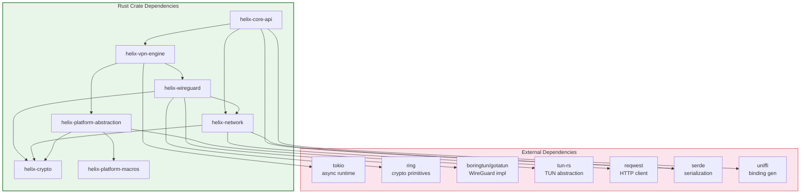

---

## 5. Data Flow Architecture

### 5.1 Connection Establishment Flow

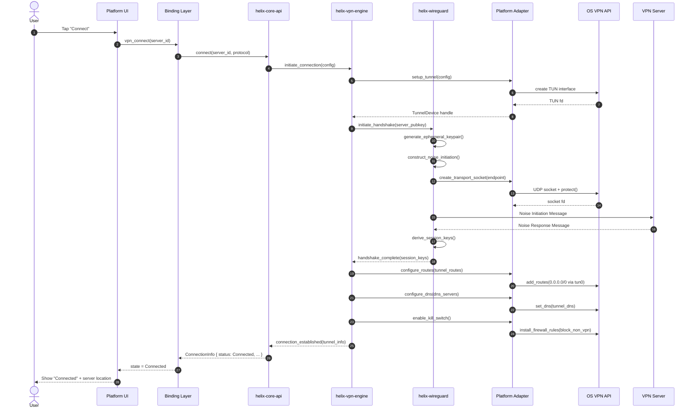

### 5.2 Packet Routing Flow (Split Tunneling)

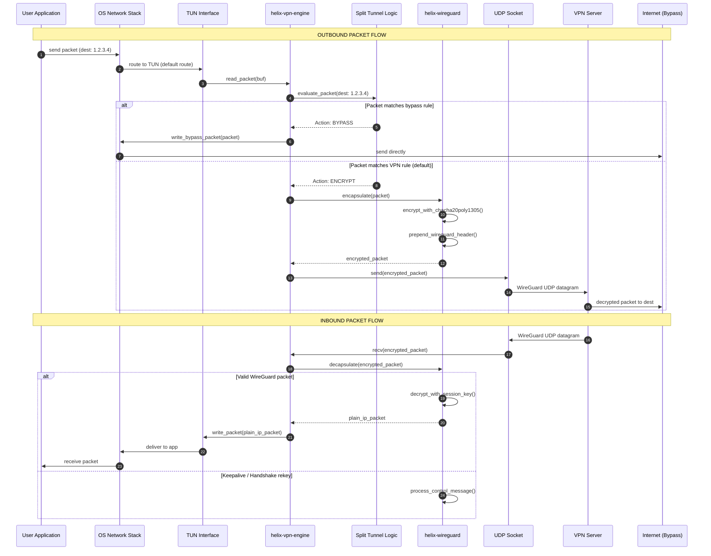

### 5.3 Kill Switch Activation Flow

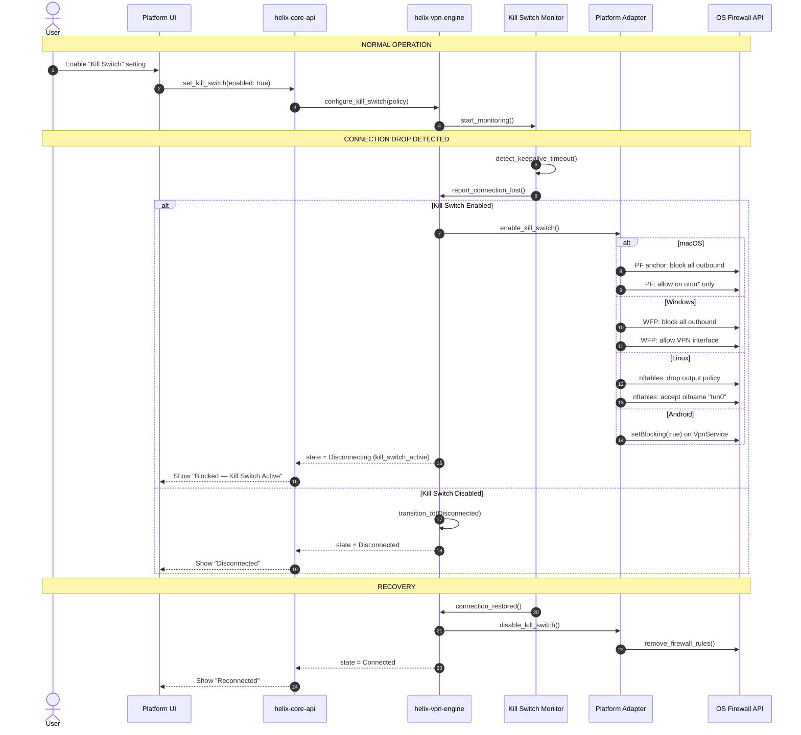

### 5.4 UI to Core Communication Flow

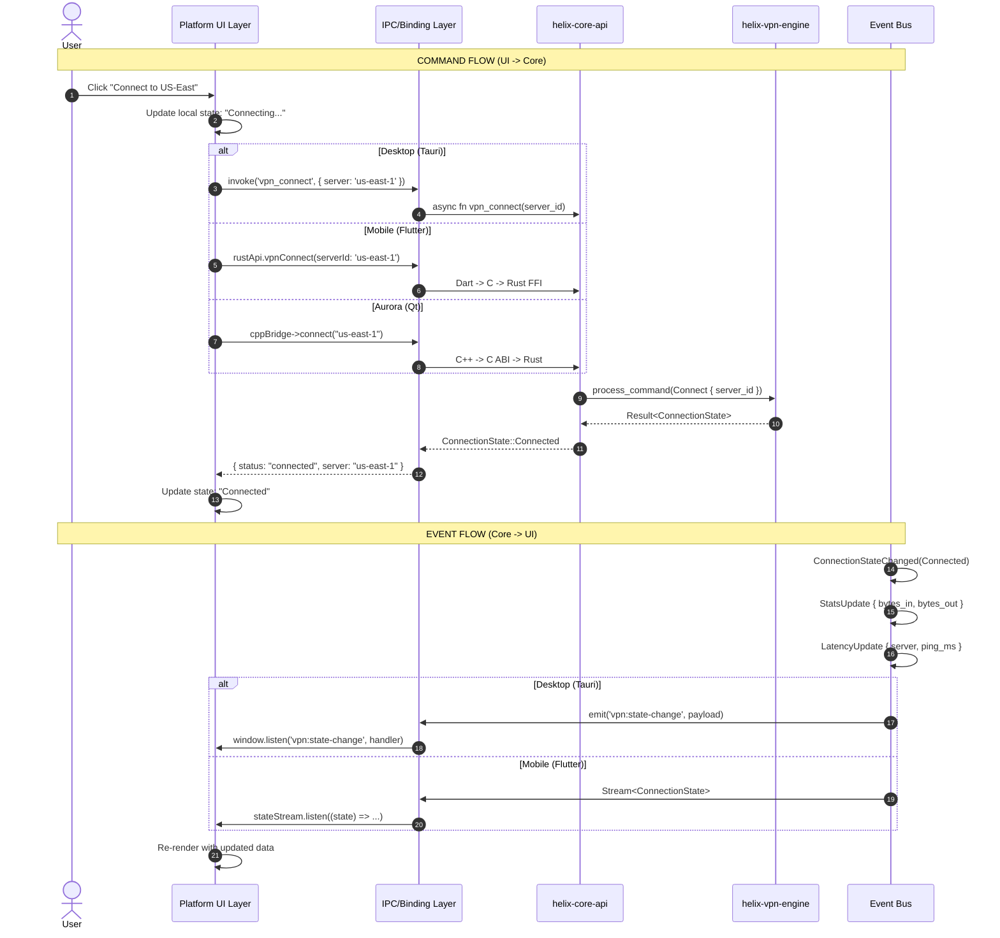

### 5.5 Platform Adapter Trait Definition

```rust
/// Core abstraction for packet I/O through the TUN interface
#[async_trait]
pub trait TunnelDevice: Send + Sync {
    async fn read_packet(&self, buf: &mut [u8]) -> Result<usize>;
    async fn write_packet(&self, packet: &[u8]) -> Result<()>;
    fn set_mtu(&self, mtu: u16) -> Result<()>;
    fn get_interface_name(&self) -> String;
}

/// Platform-specific VPN service lifecycle and system integration
#[async_trait]
pub trait PlatformAdapter: Send + Sync {
    /// Create the TUN interface with given configuration
    async fn setup_tunnel(&self, config: &TunnelConfig) -> Result<Box<dyn TunnelDevice>>;

    /// Mark a socket to bypass the VPN tunnel (for transport socket)
    async fn protect_socket(&self, socket: RawFd) -> Result<()>;

    /// Configure IP routes for the tunnel
    async fn configure_routes(&self, routes: &[Route]) -> Result<()>;

    /// Configure DNS servers
    async fn configure_dns(&self, servers: &[IpAddr]) -> Result<()>;

    /// Enable the kill switch (block all non-VPN traffic)
    async fn enable_kill_switch(&self) -> Result<()>;

    /// Disable the kill switch
    async fn disable_kill_switch(&self) -> Result<()>;

    /// Configure split tunneling by application
    async fn set_split_tunnel_apps(
        &self,
        allowed: &[String],
        blocked: &[String],
    ) -> Result<()>;

    /// Get the default network interface info
    async fn get_default_interface(&self) -> Result<NetworkInterface>;

    /// Register for network change callbacks
    async fn on_network_change(&self, callback: NetworkChangeCallback) -> Result<()>;

    /// Apply an enterprise-pushed managed policy (§10.2) received from the
    /// helix-admin control plane. No-op on consumer builds with no MDM
    /// enrollment. Added in Revision 2 to make the §10.2 policy-push
    /// contract concrete rather than aspirational prose.
    async fn apply_managed_policy(&self, policy: &ManagedPolicy) -> Result<()>;
}
```

### 5.6 Connection Lifecycle State Machine

`helix-vpn-engine` owns a single canonical connection state machine shared by
every platform — no platform UI is permitted to invent its own connection
states or transition rules; each UI layer only *renders* the state emitted by
the core. This closes a gap in the previous revision, where kill-switch and
reconnect behavior were described only through narrative prose and
per-platform sequence diagrams (§5.3), with no single authoritative state
diagram platform teams could implement against.

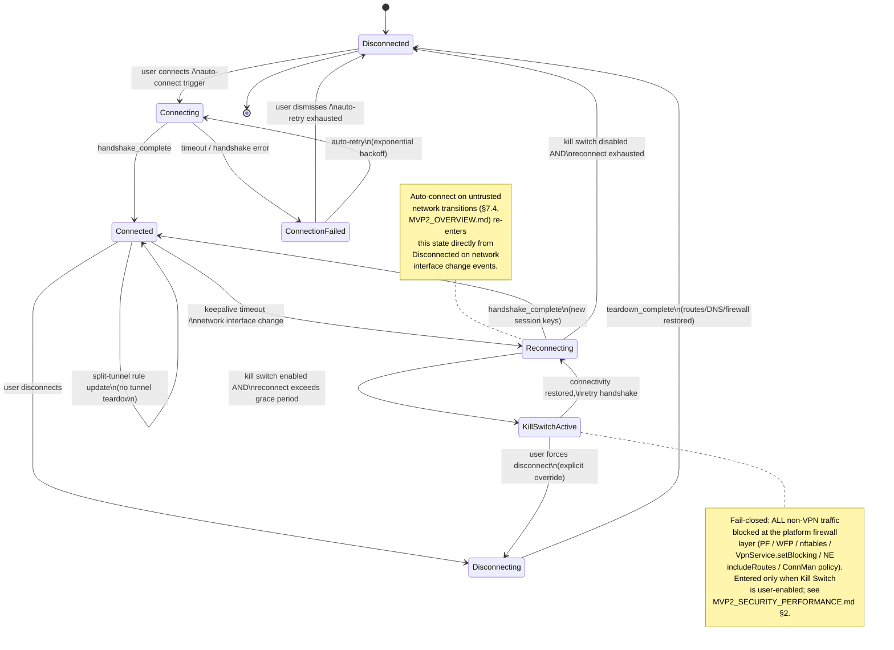

**State ownership contract:** every platform adapter (§5.5) reports
low-level events (`handshake_complete`, `keepalive_timeout`,
`network_interface_changed`, `teardown_complete`) up to
`helix-vpn-engine`; the engine — never the adapter, never the UI — decides
the next state. This is the same "decision engine, not enforcement" split
already established for split tunneling and kill switch logic in §4.4. Every
platform's Enterprise Hardening section (added in this revision — see
`MVP2_DESKTOP_APPS.md`, `MVP2_MOBILE_APPS.md`, `MVP2_AURORA_CLIENT.md`,
`MVP2_WEB_CLIENT.md`) MUST reference this exact state set; a platform UI
introducing its own ad-hoc state (e.g., a bespoke "Suspended" state not
present here) is an architectural contract violation.

---

## 6. Technology Justification

### 6.1 Why Tauri for Desktop

**Decision**: Tauri v2 over Electron, Flutter Desktop, and Qt for macOS/Windows/Linux desktop applications.

| Criterion | Tauri v2 | Electron | Flutter Desktop | Qt6 |
|-----------|----------|----------|-----------------|-----|
| **Bundle Size** | ~3-15 MB | ~96-250 MB | ~20-40 MB | ~20-60 MB |
| **RAM (idle)** | ~30-80 MB | ~160-400 MB | ~80-150 MB | ~100-160 MB |
| **Startup Time** | ~0.5-1.4s | ~2-4s | ~0.9-1.8s | ~1-2s |
| **Rust Backend** | Native | Node.js | Dart | C++ |
| **Security Model** | Capability-based IPC | Full Node.js access | Dart sandbox | Native C++ |
| **Auto-Updater** | Built-in | electron-updater | Custom | Custom |
| **CI/CD Maturity** | Excellent | Excellent | Good | Good |

**Key Justifications:**

1. **Bundle Size**: Tauri achieves 6-32x smaller bundles than Electron. For a utility app like a VPN client, a 150-250 MB Electron bundle is unacceptable to security-conscious users who scrutinize every installed application.

2. **Rust Synergy**: Tauri's backend is Rust — the same language as `helix-core`. This eliminates language bridging overhead on desktop, allows direct crate imports, and keeps the entire desktop stack in a single language ecosystem.

3. **Security**: Tauri's capability-based IPC means the web frontend can only call explicitly allowed Rust commands. This is a fundamentally more secure model than Electron's full Node.js access, which is critical for a privacy-focused VPN product.

4. **Native WebView**: Using the OS-provided WebView (WKWebView on macOS, WebView2 on Windows, WebKitGTK on Linux) means the browser engine is maintained by the OS vendor, not bundled with the application. This reduces attack surface and ensures the engine receives regular security updates.

5. **Production Proven**: VPN clients like TunnlTo (WireGuard split tunneling for Windows) and UpVPN (Linux/macOS/Windows) already use Tauri successfully in production.

**Why Electron Was Rejected:**

> "Electron apps typically consume 200-500MB on startup... Tauri v2 runs the same application logic in 50-150MB." — Tauri vs Electron Benchmark

Despite Mullvad VPN using Electron (which validates the approach for VPN clients), the bundle size penalty (~100+ MB) contradicts Helix VPN's "minimal footprint" principle. Mullvad's choice reflects a 2018-era decision; Tauri represents the 2024+ state of the art.

**Why Flutter Desktop Was Rejected:**

Flutter's desktop support is less mature than its mobile implementation. Impeller is still in beta for macOS and in progress for Windows/Linux. The bundle sizes are 2-3x larger than Tauri. Desktop-specific issues (window management, system tray, auto-start) require more platform-specific code in Flutter than in Tauri.

### 6.2 Why Flutter for Mobile

**Decision**: Flutter over React Native and Kotlin Multiplatform for Android/iOS/HarmonyOS mobile applications.

| Criterion | Flutter | React Native | KMP + Compose |
|-----------|---------|--------------|---------------|
| **Code Reuse** | 90-95% | 80-85% | 80-90% (with CMP) |
| **Performance (FPS)** | 59-60 | 53-56 | ~59 |
| **Bundle Size** | ~15-30 MB | ~20-40 MB | ~10-30 MB |
| **HarmonyOS Support** | Yes (community ohos) | Partial | No |
| **Rendering** | Impeller (custom) | Native UI components | Native / Compose |
| **VPN Plugin Ecosystem** | flutter_vless, WireGuard plugins | Limited | Limited |
| **Developer Market Share** | 46% | 35% | Growing |

**Key Justifications:**

1. **HarmonyOS Support**: This is the decisive factor. Flutter has the strongest HarmonyOS support among all cross-platform frameworks, with a community-maintained embedding layer (`v3.22.0-ohos`) that adapts the engine to HarmonyOS's graphics and platform channel systems. React Native has partial community support. Kotlin Multiplatform has no native HarmonyOS support. Tauri and Qt have no HarmonyOS support at all.

> "Flutter, RN, and uni are relatively mature cross-platform solutions for HarmonyOS, and many large enterprises have used them in their APPs." — HarmonyOS Cross-Platform Solutions Guide

2. **Code Reuse**: Flutter achieves the highest practical code reuse (90-95%) because the entire UI + business logic is in Dart, with only platform-specific VPN Network Extensions requiring native code.

3. **Impeller Renderer**: Impeller is now the default renderer on both iOS and Android, providing consistent 60 FPS without shader compilation jank. This is critical for a VPN app that may run for hours with real-time statistics updates.

4. **VPN Plugin Ecosystem**: The `flutter_vless` plugin (Xray/VLESS/VMess), WireGuard plugins, and `VPNclient App` demonstrate that production VPN clients are already being built with Flutter. This reduces the "uncharted territory" risk.

5. **Performance**: Flutter consistently benchmarks better than React Native across standard metrics: higher FPS in list scrolling (59-60 vs 53-56), lower CPU load (45% vs 55%), and smaller memory footprint (25 MB vs 30 MB).

**Why React Native Was Rejected:**

- No Linux support (irrelevant for mobile but important for consistency with desktop strategy)
- Desktop support is community-maintained, not first-party
- Bridge overhead (even with JSI) for VPN native modules
- No HarmonyOS support (despite partial community efforts, far less mature than Flutter's)
- VPN Network Extension integration requires native module development per platform

**Why Kotlin Multiplatform Was Rejected:**

- No HarmonyOS support whatsoever
- Compose Multiplatform for iOS is newer and less battle-tested than Flutter
- Separate UI codebases per platform unless using Compose Multiplatform (which adds risk)
- Smaller ecosystem than Flutter (fewer packages, smaller community)

### 6.3 Why Qt for Aurora OS

**Decision**: Qt6/QML over Flutter for Aurora OS.

| Criterion | Qt6/QML | Flutter for Aurora |
|-----------|---------|-------------------|
| **Native Framework** | Yes (official OS framework) | Supported (community) |
| **Bundle Size** | ~15-25 MB (static link) | ~20-30 MB |
| **Sailfish Heritage** | Native Silica components | Generic Material |
| **ConnMan Integration** | Direct D-Bus via Qt | Platform channel required |
| **Rust FFI** | Direct C FFI | Additional bridge layer |

**Key Justifications:**

1. **Native Framework**: Qt is the native development framework for both Aurora OS and Sailfish OS. Using Qt ensures the deepest OS integration, access to all system APIs, and adherence to platform UI conventions.

2. **ConnMan Integration**: Aurora OS uses ConnMan as its network manager. Qt's D-Bus support allows direct integration with ConnMan's VPN plugin API without intermediate bridge layers.

3. **Performance**: Aurora OS devices (primarily Russian mobile devices) have more constrained hardware than mainstream Android/iOS. Qt's C++ performance and lower memory footprint are advantageous.

4. **Direct Rust FFI**: Qt's C++ can directly call Rust functions through C FFI using `cbindgen`-generated headers, with no intermediate bridge layer needed.

### 6.4 Why Rust for Core

**Decision**: Rust over Go, C++, and Kotlin for the shared VPN core.

| Criterion | Rust | Go | C++ | Kotlin/Native |
|-----------|------|-----|-----|---------------|
| **Memory Safety** | Compile-time guarantees | GC (runtime pauses) | Manual (unsafe) | GC (runtime pauses) |
| **Performance** | C++ equivalent | Good, GC overhead | C++ baseline | Moderate (GC) |
| **Cross-Compilation** | Excellent (LLVM) | Good | Complex | Limited |
| **VPN Ecosystem** | boringtun, wireguard-rs | wireguard-go (deprecated) | Strong but unsafe | Limited |
| **WASM Target** | Tier 2 (wasm-bindgen) | Experimental | No | No |
| **Mobile FFI** | UniFFI, FRB, JNI | CGO (overhead) | JNI (complex) | Native Kotlin |

**Key Justifications:**

1. **Memory Safety**: Rust's ownership model eliminates entire classes of security vulnerabilities (buffer overflows, use-after-free, double-free) that are endemic in C++ VPN implementations. For a product handling sensitive network traffic, this is non-negotiable.

> "After we decided to create a userspace WireGuard implementation, there was the small matter of choosing the right language... The obvious answer was Rust. Rust is a modern, safe language that is both as fast as C++ and is arguably safer than Go." — Cloudflare BoringTun

2. **VPN Ecosystem**: The WireGuard ecosystem has coalesced around Rust. Cloudflare's `boringtun` is deployed on millions of devices. Mullvad's `gotatun` fork replaced WireGuard-Go specifically because Go's garbage collector caused crashes during tunnel operation. Rust is the de facto standard for modern VPN protocol implementations.

3. **Cross-Compilation**: Rust's LLVM backend provides first-class cross-compilation for all target platforms from a single toolchain. The same `Cargo.toml` builds for macOS, Windows, Linux, Android, iOS, and WASM with minimal platform-specific configuration.

4. **FFI Ecosystem**: Tools like UniFFI (Mozilla), `flutter_rust_bridge`, and `wasm-bindgen` provide mature, automated binding generation that eliminates handwritten FFI boilerplate — the traditional achilles heel of cross-language development.

5. **WASM Target**: Rust's Tier 2 WASM target enables the browser extension to reuse the cryptographic components of the core, compiled to WebAssembly for near-native performance in the browser.

### 6.5 Alternative Analysis Summary

| Alternative | Why Rejected |
|-------------|-------------|
| **Electron** (desktop) | Bundle size 6-32x larger than Tauri; bundled Chromium is security liability; 160-400 MB RAM |
| **Flutter Desktop** (desktop) | Desktop support less mature; Impeller not ready; larger bundles than Tauri |
| **React Native** (mobile) | No HarmonyOS support; no Linux support; larger bundles; bridge overhead |
| **KMP + Compose** (mobile) | No HarmonyOS support; CMP for iOS less mature; smaller ecosystem |
| **Go** (core) | GC pauses cause tunnel drops; boringtun replaced wireguard-go due to crashes |
| **C++** (core) | Memory safety concerns; longer development cycles; harder to secure |
| **Kotlin/Native** (core) | GC-based; limited cross-compilation; smaller ecosystem |
| **Ionic/Capacitor** | WebView-based; insufficient native API access for VPN tunnels |
| **NativeScript** | No desktop support; limited VPN ecosystem; smaller community |
| **Neutralinojs** | No mobile support; immature ecosystem; no VPN integration patterns |

---

## 7. Implementation Roadmap

### 7.1 Phase Breakdown

| Phase | Duration | Deliverables |
|-------|----------|-------------|
| **P0: Core Foundation** | 6 weeks | `helix-core` crate workspace; WireGuard protocol; Linux adapter; CI/CD pipeline |
| **P0: Desktop MVP** | 4 weeks | Tauri app for macOS/Windows/Linux; basic connect/disconnect; kill switch |
| **P1: Mobile Core** | 4 weeks | Android + iOS platform adapters; `flutter_rust_bridge` integration |
| **P1: Mobile App** | 4 weeks | Flutter UI; server selection; statistics; settings |
| **P2: HarmonyOS** | 3 weeks | HarmonyOS platform adapter; Flutter ohos build |
| **P2: Aurora OS** | 3 weeks | Qt6 UI; ConnMan D-Bus adapter; C FFI bridge |
| **P3: Web Extension** | 3 weeks | Browser extension; WASM crypto; proxy mode; native messaging |
| **P3: Polish** | 3 weeks | Admin dashboard; OTA updates; telemetry; security audit |

> **Reconciliation note (Revision 2):** the table above sums to 30 weeks — an
> unbuffered, best-case estimate with no contingency for entitlement/store
> review latency or cross-compilation friction. `MVP2_IMPLEMENTATION_ROADMAP.md`
> is the authoritative, risk-adjusted, 9-phase schedule: it treats this table's
> 30-week figure as the 20%-probability best case, and derives a 36-week
> expected case (60% probability, the number used for staffing commitments —
> see `MVP2_OVERVIEW.md` §2.4) and a 44-week worst case (20% probability). The
> phase groupings also differ slightly: the roadmap splits "P0: Desktop MVP"
> into separate macOS/Linux (Phase 3) and Windows (Phase 4) phases because
> WFP/WinTUN integration proved to warrant independent scheduling and exit
> criteria. Treat this table as the high-level architectural sequencing
> (which platform depends on which core milestone) and the roadmap document
> as the authoritative calendar.

### 7.2 Dependency Graph

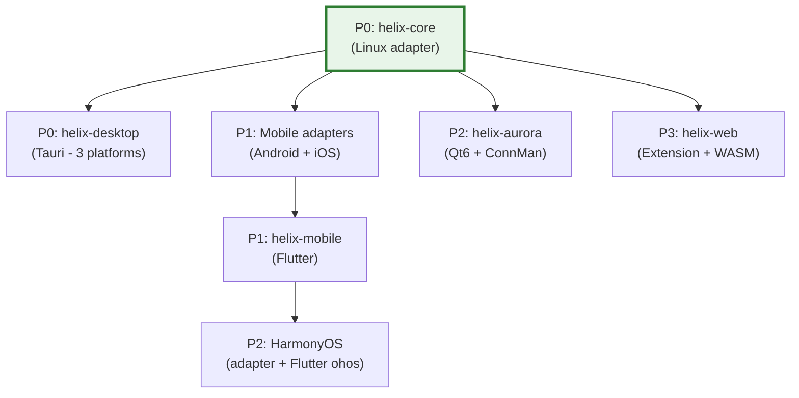

---

## 8. Risk Assessment & Mitigation

| Risk | Probability | Impact | Mitigation |
|------|------------|--------|------------|
| **Tauri v2 mobile immaturity** | Medium | Medium | Desktop is production-stable; mobile plugins can be written in Swift/Kotlin if needed |
| **Flutter HarmonyOS breaking changes** | Medium | High | Pin to specific ohos embedding version; maintain fork if needed |
| **UniFFI async limitations** | Medium | Medium | Use Tokio Runtime pattern with `LazyLock`; fall back to sync FFI with callbacks |
| **iOS App Store rejection** | Low | High | Clear privacy policy; legitimate use case documentation; comply with all entitlement requirements |
| **Windows driver signing (WinTUN)** | Low | Medium | WinTUN is already signed by WireGuard Foundation; no custom driver needed |
| **Android OEM battery optimization** | High | Medium | Implement foreground service + UIDT jobs; provide battery exemption guides |
| **WFP rule conflicts (Windows)** | Medium | Medium | Careful layer/weight positioning; rule restoration on BFE restart |
| **Rust core binary size** | Medium | Low | Apply all size optimizations; use `ring` over OpenSSL; strip symbols |

---

## 9. Appendices

### Appendix A: Rust Cross-Compilation Targets

| Platform | Target Triple | Tier | CI Runner |
|----------|--------------|------|-----------|
| macOS (Intel) | `x86_64-apple-darwin` | Tier 2 | macos-latest |
| macOS (Apple Silicon) | `aarch64-apple-darwin` | Tier 2 | macos-latest |
| iOS (Device) | `aarch64-apple-ios` | Tier 2 | macos-latest |
| iOS (Simulator) | `aarch64-apple-ios-sim` | Tier 2 | macos-latest |
| Windows (x64) | `x86_64-pc-windows-msvc` | Tier 1 | windows-latest |
| Windows (ARM64) | `aarch64-pc-windows-msvc` | Tier 2 | windows-latest |
| Linux (x64) | `x86_64-unknown-linux-gnu` | Tier 1 | ubuntu-latest |
| Linux (ARM64) | `aarch64-unknown-linux-gnu` | Tier 1 | ubuntu-latest |
| Android (ARM64) | `aarch64-linux-android` | Tier 2 | ubuntu-latest (cross-rs) |
| Android (ARMv7) | `armv7-linux-androideabi` | Tier 2 | ubuntu-latest (cross-rs) |
| HarmonyOS | `aarch64-unknown-linux-ohos` | Tier 2 | ubuntu-latest |
| Web | `wasm32-unknown-unknown` | Tier 2 | ubuntu-latest |

### Appendix B: Binary Size Optimization Profile

```toml
# Cargo.toml — Release profile for all platforms
[profile.release]
opt-level = "z"          # Optimize for size
lto = true               # Link Time Optimization
codegen-units = 1        # Single codegen unit for max optimization
panic = "abort"          # Remove unwinding code
strip = "symbols"        # Remove all symbol information

# Mobile-specific additional optimizations
[profile.mobile-release]
inherits = "release"
opt-level = "z"
lto = true
codegen-units = 1
panic = "abort"
strip = "symbols"
```

**Expected size impact**: ~61% reduction (from ~18 MB baseline to ~7 MB optimized).

### Appendix C: Glossary

| Term | Definition |
|------|-----------|
| **TUN** | Virtual network interface that operates at Layer 3 (IP). Used to intercept and inject IP packets. |
| **NEPacketTunnelProvider** | iOS/macOS Network Extension class for implementing custom VPN protocols at the packet level. |
| **VpnService** | Android API for creating custom VPN connections via a TUN interface. |
| **WFP** | Windows Filtering Platform — kernel-mode framework for network packet filtering. |
| **WinTUN** | Virtual TUN adapter driver for Windows, maintained by the WireGuard project. |
| **ConnMan** | Connection Manager — Linux network management daemon used by Sailfish OS / Aurora OS. |
| **Impeller** | Flutter's rendering engine, replacing Skia for consistent GPU-accelerated performance. |
| **UniFFI** | Mozilla's multi-language binding generator for Rust (Swift, Kotlin, Python bindings). |
| **flutter_rust_bridge** | Code generation tool for seamless Dart-Rust FFI integration in Flutter apps. |
| **FRB** | Short for `flutter_rust_bridge`. |
| **Kill Switch** | Feature that blocks all network traffic when the VPN connection drops, preventing IP leaks. |
| **Split Tunneling** | Routing only selected traffic through the VPN while allowing other traffic direct access. |
| **PAC** | Proxy Auto-Configuration — JavaScript-based proxy configuration used by browser extensions. |
| **WASM** | WebAssembly — binary instruction format for sandboxed execution in web browsers. |

### Appendix D: Reference Architectures

| Project | Architecture | Code Reuse | Relevance |
|---------|-------------|------------|-----------|
| **Mullvad VPN** | Rust daemon + Electron GUI | ~85% desktop, ~70% Android | Primary reference — same Rust core + multi-UI approach |
| **Signal** | libsignal Rust core + platform UIs | ~80% | FFI bridge patterns, manual JNI approach |
| **BoringTun** | Pure Rust WireGuard library | ~95% (library only) | WireGuard protocol foundation |
| **TunnlTo** | Rust + Tauri (Windows) | ~90% | Validates Tauri for VPN clients |
| **UpVPN** | Rust + Tauri (multi-platform) | ~85% | Validates Tauri v2 for VPN |
| **VPNclient App** | Flutter + Rust | ~85% | Validates Flutter for VPN |

---

## 10. Enterprise Hardening & Production Readiness

This section is the cross-platform index for concerns the original MVP2
draft treated unevenly or omitted entirely. It does not duplicate
platform-specific detail — it defines the shared architectural contract that
every platform's own "Enterprise Hardening" section (added in this revision)
must honor, and points to where the full detail lives.

### 10.1 Deployment & Release Pipeline Across 8 Platforms

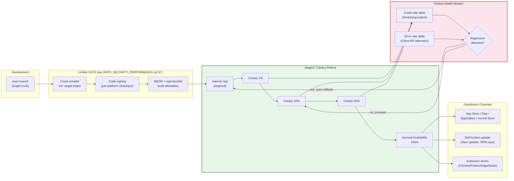

Full mechanism detail (canary ring percentages, automatic rollback triggers,
per-platform update transport) is specified in `MVP2_SECURITY_PERFORMANCE.md`
§10 (new in this revision). Every platform document's Enterprise Hardening
section states which parts of this pipeline it can implement natively
(e.g., Tauri's built-in updater supports staged rollout; app-store-distributed
platforms are constrained to the store's own phased-release mechanism).

### 10.2 Centralized Policy Push from the Phase-1 Control Plane

`helix-admin` (§2.2.6) is the enterprise fleet-management surface. It pushes
org-scoped policy — allowed protocols, forced kill switch, forced split-tunnel
rules, DNS policy, SSO enforcement — to enrolled devices via the MVP1 Admin
API. Each platform adapter (§2.3, §5.5) exposes a `apply_managed_policy(policy: ManagedPolicy)`
extension point on `PlatformAdapter` that platform-native MDM/policy channels
invoke:

| Platform | Managed-Config Transport |
|----------|--------------------------|
| macOS / Windows / Linux | MDM Configuration Profiles / Group Policy (ADMX) + Intune / self-hosted config file drop — detailed in `MVP2_DESKTOP_APPS.md` Enterprise Hardening |
| Android | Android Enterprise managed configuration (AppConfig) — detailed in `MVP2_MOBILE_APPS.md` Enterprise Hardening |
| iOS | Apple MDM managed app config (per-app VPN) — detailed in `MVP2_MOBILE_APPS.md` Enterprise Hardening |
| HarmonyOS | HarmonyOS enterprise device management (where available) — detailed in `MVP2_MOBILE_APPS.md` Enterprise Hardening |
| Aurora OS | Out of scope for MVP2 — niche/government deployments typically single-device; noted explicitly (not silently omitted) in `MVP2_AURORA_CLIENT.md` Enterprise Hardening |
| Web | Chrome `ExtensionSettings`/`ExtensionInstallForcelist`, Firefox `policies.json` — detailed in `MVP2_WEB_CLIENT.md` Enterprise Hardening |

### 10.3 Supply-Chain Security (Architectural Contract)

Every one of the 14+ cross-compiled artifacts (Appendix A) MUST be
reproducible from the pinned `Cargo.lock` + `rust-toolchain.toml`, and MUST
ship with a generated SBOM. This is an architectural requirement on the
build system, not an optional CI nicety — see `MVP2_SHARED_CORE.md` §5.5
(new) for the concrete tooling (`cargo --locked`, `cargo-cyclonedx`) and
`MVP2_SECURITY_PERFORMANCE.md` §10 for the release-signing and provenance
attestation process.

### 10.4 Cross-Platform Design-System Consistency

All UI layers (§2.2, §5.2) MUST consume the OpenDesign token system
(`docs/design/README.md`) rather than platform-local ad-hoc styling — see
`MVP2_UI_UX_SPEC.md` §1 for the binding statement. This ensures the "Platform
Native" design principle (§1.3, Principle 4 note in `MVP2_OVERVIEW.md` §6)
does not regress into visual inconsistency across the 8 platforms.

### 10.5 What Remains Explicitly Out of Scope for MVP2

To avoid scope-creep bluffing, the following enterprise concerns are
acknowledged but **deliberately deferred to Phase 3 (MVP3 — Enterprise
Features & Ecosystem)** per `MVP2_OVERVIEW.md` §3.1: multi-tenant white-label
branding, SCIM-based automated user provisioning, dedicated single-tenant
server infrastructure, and custom on-premises control-plane deployment for
enterprise customers. MVP2 delivers the client-side SSO/MDM/policy-push
*consumption* contracts; MVP3 owns the full enterprise administration
product surface.

---

*Document compiled: July 2025 (Revision 2: 2026-07-04)*
*Based on research from 25+ independent sources including official framework documentation, open-source VPN client analysis, and cross-platform development benchmarks.*
*Next review: August 2025 (post-implementation kickoff)*
