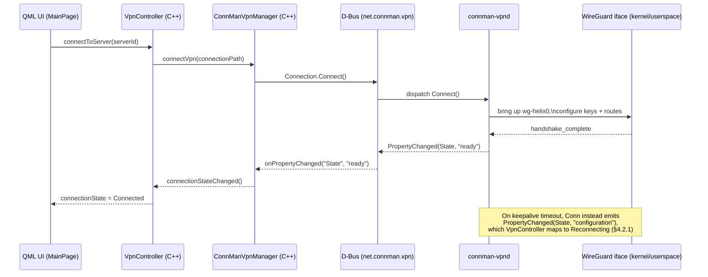
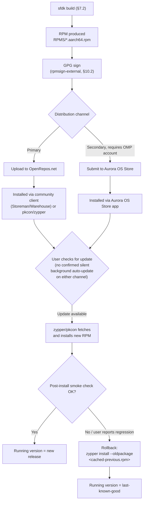

# Helix VPN — Aurora OS Client Specification

**Revision:** 2
**Last modified:** 2026-07-04T14:00:00Z

**Revision 2 changelog:** Reconciled against `MVP2_ARCHITECTURE.md` §5.6 /
`MVP2_SHARED_CORE.md` §3.1 canonical connection-lifecycle state machine —
added `KillSwitchActive` + `ConnectionFailed` states end-to-end through the
Rust FFI constants, generated C header, C++ bridge, and QML UI (this doc
previously modeled only 6 of the 9 wire states). Fixed OpenVPN references —
it is a reserved/unimplemented placeholder only, never a supported protocol.
Added §3.6 clarifying how Shadowsocks/MASQUE/Multi-Hop map onto ConnMan
(they do NOT use ConnMan's native VPN plugin `Type` field, unlike WireGuard).
Confirmed split tunneling is route/CIDR-based only (no per-app support on
Aurora) and fixed a stale "App-based split tunneling" file-tree comment.
Added explicit N/A-biometric rationale (§6.6) and an explicit MDM/enterprise
-fleet out-of-scope statement + `ManagedPolicy`/`apply_managed_policy` stub
(§10.8), per `MVP2_ARCHITECTURE.md` §10.2. Added a new "§10 Enterprise
Hardening & Production Readiness" section (store/OpenRepos review, RPM GPG
signing, update/rollback, crash reporting, telemetry consent, offline/
degraded-network behavior, concrete kill-switch/split-tunnel mechanism,
accessibility, i18n, license/entitlement checks). Added Mermaid diagrams
(connection state machine, ConnMan D-Bus VPN connect flow, RPM package
build/sign/distribute/update/rollback flow) — this file previously had zero.
Added OpenDesign token-system reference for the Silica Ambiance (dark-first)
theme (§6.1). Reconciled internal Phase 1-4 week numbering (§9) against
`MVP2_IMPLEMENTATION_ROADMAP.md` Phase 7's absolute calendar placement
(Weeks 27-30).

## Comprehensive Technical Specification for Aurora OS (Sailfish OS) VPN Client

**Version**: 1.0  
**Date**: July 2025  
**Status**: Technical Specification — Draft  
**Platform**: Aurora OS 4.x / 5.x (Sailfish OS derivative)  
**Architecture**: Qt6/QML + C++ + Rust Core via FFI  
**Distribution**: OpenRepos / Aurora Store (Harbor)  

---

## Table of Contents

1. [Aurora OS Overview](#1-aurora-os-overview)
2. [Architecture](#2-architecture)
3. [VPN Integration](#3-vpn-integration)
4. [Rust Core Integration](#4-rust-core-integration)
5. [UI Implementation](#5-ui-implementation)
6. [Platform-Specific Features](#6-platform-specific-features)
7. [Build System](#7-build-system)
8. [Comparison with Other Platforms](#8-comparison-with-other-platforms)
9. [Implementation Phases](#9-implementation-phases)
10. [Enterprise Hardening & Production Readiness](#10-enterprise-hardening--production-readiness)

---

## 1. Aurora OS Overview

### 1.1 What is Aurora OS

Aurora OS (auroraos.ru) is a Russian mobile operating system based on Sailfish OS, developed by Open Mobile Platform (OMP). It is designed primarily for the Russian market as part of the country's digital sovereignty initiative, providing an alternative to Android and iOS for government and enterprise use.

Key characteristics:
- **Origin**: Forked from Sailfish OS by Jolla (Finland)
- **Maintainer**: Open Mobile Platform (OMP), Russia
- **Current Version**: 4.x / 5.x series (aligned with Sailfish OS releases)
- **License**: Proprietary OS with open-source components
- **Target Market**: Russian government, enterprise, and consumer sectors

### 1.2 Market Context and Target Users

| Segment | Description | Device Examples |
|---------|-------------|-----------------|
| **Government** | Federal and regional government employees | F+ R570E, Aquarius CMP NS |
| **Enterprise** | Corporate fleets, secure communications | Custom OEM devices |
| **Consumer** | Privacy-conscious Russian consumers | INOI, Aquarius, F+ devices |
| **Specialized** | Industrial, medical, logistics | Ruggedized handhelds |

Aurora OS devices are primarily mid-range ARM-based smartphones with constrained hardware compared to flagship Android/iOS devices. This makes performance optimization critical.

### 1.3 Technical Foundation

Aurora OS inherits the Sailfish OS technology stack:

```
┌─────────────────────────────────────────────────────┐
│                    UI Layer                          │
│         Qt6 / QML + Sailfish Silica                  │
├─────────────────────────────────────────────────────┤
│                 Middleware                           │
│  ConnMan (network) │ oFono (telephony)               │
│  PulseAudio (audio) │ systemd (init)                 │
├─────────────────────────────────────────────────────┤
│                 Core OS                              │
│  Mer Core (Linux-based) / Nemo Mobile                │
│  Wayland compositor (Lipstick)                       │
├─────────────────────────────────────────────────────┤
│                 Kernel                               │
│  Linux Kernel (adapted per-device)                   │
└─────────────────────────────────────────────────────┘
```

Key components:
- **ConnMan**: Connection Manager — handles all network connectivity including VPN
- **Wayland**: Display server protocol (Lipstick compositor)
- **Qt6/QML**: Native UI framework
- **Silica**: Sailfish-specific QML UI component library
- **RPM**: Package management (no APK, no DEB)
- **Sailjail**: Sandboxing based on Firejail
- **oFono**: Telephony stack

### 1.4 Platform Capabilities and Limitations

| Capability | Status | Notes |
|------------|--------|-------|
| Native VPN (WireGuard) | Yes | Via ConnMan VPN plugin since Sailfish OS 5.0 |
| Custom VPN protocols | Limited | Requires ConnMan plugin development |
| Background execution | Restricted | Sailjail sandboxing applies |
| System notifications | Yes | Via nemo-qml-plugin-notifications |
| System tray / Status icon | No | Uses Cover (active frame) instead |
| Auto-start on boot | Limited | Via systemd user services |
| D-Bus access | Restricted | Must declare in .desktop file permissions |
| File system access | Sandboxed | Requires explicit permissions |
| Qt Quick Controls | **Forbidden** | Not allowed in Harbor validation |
| Silica UI components | Required | Must use for Harbor acceptance |

**Critical Limitations:**
1. **No system tray** — Aurora OS uses "Covers" (active frames) for background app status
2. **Sailjail sandboxing** — Apps must declare D-Bus and network permissions
3. **Qt Quick Controls forbidden** — Must use Sailfish Silica components exclusively
4. **Hardware constraints** — Target devices typically have 2-4 GB RAM, mid-range ARM CPUs
5. **No Google Play Services** — Distribution via OpenRepos or Aurora Store only

---

## 2. Architecture

### 2.1 High-Level Architecture

```
┌─────────────────────────────────────────────────────────────────────┐
│                        QML UI Layer                                  │
│  ┌──────────────┐ ┌──────────────┐ ┌──────────────┐                │
│  │   MainPage   │ │ SettingsPage │ │  ServerList  │                │
│  │ (connect UI) │ │ (preferences)│ │  (locations) │                │
│  └──────────────┘ └──────────────┘ └──────────────┘                │
│                                                                     │
│  ┌─────────────────────────────────────────────────────────────┐   │
│  │                   CoverPage (Active Frame)                   │   │
│  │         [Status] [Quick Connect] [Disconnect]                │   │
│  └─────────────────────────────────────────────────────────────┘   │
└─────────────────────────────────────────────────────────────────────┘
                              │
                              ▼
┌─────────────────────────────────────────────────────────────────────┐
│                    C++ Bridge Layer (QObjects)                       │
│                                                                     │
│  ┌─────────────────┐  ┌──────────────────┐  ┌──────────────────┐  │
│  │  VpnController  │  │  ConnManDBus     │  │  RustFFI         │  │
│  │  (QML bindings) │  │  (D-Bus client)  │  │  (C ABI bridge)  │  │
│  │                 │  │                  │  │                  │  │
│  │ - connect()     │  │ - getProviders() │  │ - core_init()    │  │
│  │ - disconnect()  │  │ - connectVpn()   │  │ - core_connect() │  │
│  │ - getStatus()   │  │ - disconnectVpn()│  │ - core_stats()   │  │
│  └─────────────────┘  └──────────────────┘  └──────────────────┘  │
└─────────────────────────────────────────────────────────────────────┘
                              │
            ┌─────────────────┼─────────────────┐
            ▼                 ▼                 ▼
┌──────────────────┐ ┌──────────────┐ ┌──────────────────────────┐
│  ConnMan D-Bus   │ │  Rust Core   │ │  Qt Platform Services    │
│  Service         │ │  (libhelix)  │ │                          │
│                  │ │              │ │  - QNetworkAccessManager │
│  net.connman.vpn │ │  libhelix.a  │ │  - QDBusConnection       │
│                  │ │  (C ABI)     │ │  - QFile / QSettings     │
└──────────────────┘ └──────────────┘ └──────────────────────────┘
            │                 │
            ▼                 ▼
┌──────────────────┐ ┌──────────────────────────────┐
│  ConnMan VPN     │ │   Linux Platform Adapter     │
│  Plugin (system) │ │   (helix-platform-abstraction)│
│                  │ │                              │
│  - vpn-provider  │ │   - TUN device creation      │
│  - vpn-manager   │ │   - Route management         │
│  - vpn-connection│ │   - DNS configuration        │
└──────────────────┘ │   - Firewall (iptables/nft)  │
                     └──────────────────────────────┘
```

### 2.2 Qt6/QML + C++ + Rust Core via FFI

The Aurora OS client follows the same architectural pattern as other Helix platforms:

1. **Rust Core** (`libhelix_aurora.so`): Compiled as a shared library, contains all VPN protocol logic, encryption, and platform abstraction
2. **C++ Bridge** (`vpncontroller.h/cpp`): QObject-derived classes exposed to QML via Qt's meta-object system
3. **QML UI**: Sailfish Silica components consuming C++ bridge objects

### 2.3 Integration with ConnMan

ConnMan is the connection manager on Aurora OS. All VPN connectivity goes through ConnMan's VPN subsystem:

```
┌─────────────┐     D-Bus      ┌─────────────────┐     IPC     ┌─────────────┐
│   helix-    │ ──────────────> │  connman-vpnd   │ ──────────> │  helix-     │
│   aurora    │    signals      │  (system service)│    exec    │   wg (TUN)  │
│   (UI app)  │ <────────────── │                 │ <───────── │   (daemon)  │
└─────────────┘                 └─────────────────┘            └─────────────┘
                                        │
                                        ▼
                                ┌───────────────┐
                                │  WireGuard    │
                                │  kernel module│
                                │  or userspace │
                                └───────────────┘
```

### 2.4 Sailfish Silica UI Components

All UI must use Sailfish Silica components. Key types:

| Silica Component | Purpose | Standard Qt Equivalent |
|-----------------|---------|----------------------|
| `ApplicationWindow` | Top-level app container | `QQuickWindow` |
| `Page` | Screen content container | `Item` |
| `PageStack` | Navigation stack | `StackView` |
| `CoverBackground` | Background app cover | N/A |
| `PullDownMenu` | Top pulley menu | `Menu` |
| `SilicaListView` | Styled list view | `ListView` |
| `ListItem` | List row with press effect | `Item` |
| `Label` | Styled text label | `Text` |
| `Button` | Styled button | `Button` (forbidden) |
| `IconButton` | Icon-only button | `ToolButton` |
| `TextSwitch` | Toggle switch | `Switch` |
| `Slider` | Value slider | `Slider` |
| `ValueButton` | Value selector button | N/A |
| `Dialog` | Modal dialog | `Dialog` |
| `RemorseItem` | Undo action | Snackbar |
| `Theme` | Color/font/size constants | N/A |

### 2.5 RPM Packaging for OpenRepos

Distribution is via RPM packages:
- **OpenRepos**: Community-driven app store (openrepos.net)
- **Harbor**: Official Aurora Store (requires validation)
- **Manual**: Direct RPM installation

---

## 3. VPN Integration

### 3.1 ConnMan VPN Plugin Architecture

ConnMan manages VPN connections through a plugin architecture. The VPN subsystem consists of:

- **connman-vpnd**: VPN daemon (runs as system service)
- **VPN Provider**: Represents a VPN configuration. ConnMan's own built-in
  plugin set covers `wireguard`, `openvpn`, `openconnect`, `l2tp`, `pptp`,
  `vpnc` — **Helix only ever registers a `wireguard` provider.** OpenVPN is
  a **reserved, unimplemented placeholder** in the Helix protocol matrix
  (never shipped, never selectable in the UI) even though ConnMan itself
  supports it; do not read the presence of `openvpn` in ConnMan's plugin
  list as Helix support for it. See §3.6 for how Helix's other protocols
  (Shadowsocks, MASQUE, Multi-Hop) relate to ConnMan.
- **VPN Manager**: Manages the list of VPN providers
- **VPN Connection**: Active VPN connection state

The D-Bus service name for VPN: `net.connman.vpn`

### 3.2 D-Bus Interface for VPN Control

ConnMan VPN exposes these D-Bus interfaces:

```
Service:    net.connman.vpn
Object:     /
Interface:  net.connman.vpn.Manager

Methods:
  GetConnections() -> array(object_path, dict)  — List all VPN connections
  CreateConnection(dict, object_path) -> object_path  — Create new connection
  RemoveConnection(object_path)  — Remove a connection
  RegisterAgent(object_path)  — Register a VPN agent
  UnregisterAgent(object_path) — Unregister agent

Signals:
  ConnectionAdded(object_path, dict)   — New connection created
  ConnectionRemoved(object_path)        — Connection removed
  PropertyChanged(string, variant)      — Manager property changed
```

```
Service:    net.connman.vpn
Object:     /connection/<id>
Interface:  net.connman.vpn.Connection

Methods:
  GetProperties() -> dict  — Get connection properties
  SetProperty(string, variant) — Set a property
  ClearProperty(string) — Clear a property
  Connect() — Connect this VPN
  Connect2(string) — Connect with D-Bus sender proxy
  Disconnect() — Disconnect this VPN

Signals:
  PropertyChanged(string, variant) — Property changed

Properties:
  State        — "idle", "failure", "association", "configuration", "ready", "disconnect"
  Type         — VPN type ("wireguard", "openvpn", etc.)
  Name         — Display name
  Host         — VPN server host
  Domain       — Domain name
  Immutable    — Whether config is read-only
  SplitRouting — Split tunneling enabled
  Index        — Tunnel interface index
  IPv4         — IPv4 configuration dict
  IPv6         — IPv6 configuration dict
  Nameservers  — DNS server array
  UserRoutes   — User-defined routes
  ServerRoutes — Server-pushed routes
```

> **Note:** `Type` is a generic ConnMan property that accepts any registered
> plugin name (`"wireguard"`, `"openvpn"`, etc. per upstream ConnMan).
> Helix's `VpnConfigurator` (§3.4) only ever writes `Type = "wireguard"` —
> OpenVPN is a reserved/unimplemented placeholder in the Helix protocol
> matrix, not a Helix-supported value here, regardless of what ConnMan
> itself is capable of. See §3.6.

### 3.3 Qt D-Bus Integration Code

```cpp
// connmandbus.h — ConnMan D-Bus client for Aurora OS
#ifndef CONNMANDDBUS_H
#define CONNMANDDBUS_H

#include <QObject>
#include <QDBusInterface>
#include <QDBusConnection>
#include <QDBusMessage>
#include <QDBusArgument>
#include <QVariantMap>
#include <QStringList>

class ConnManVpnManager : public QObject
{
    Q_OBJECT
    Q_PROPERTY(bool available READ available NOTIFY availabilityChanged)
    Q_PROPERTY(QVariantMap connections READ connections NOTIFY connectionsChanged)

public:
    explicit ConnManVpnManager(QObject *parent = nullptr);

    bool available() const;
    QVariantMap connections() const;

    Q_INVOKABLE void refreshConnections();
    Q_INVOKABLE void connectVpn(const QString &connectionPath);
    Q_INVOKABLE void disconnectVpn(const QString &connectionPath);
    Q_INVOKABLE QVariantMap getConnectionProperties(const QString &connectionPath);

signals:
    void availabilityChanged();
    void connectionsChanged();
    void connectionStateChanged(const QString &path, const QString &state);
    void error(const QString &message);

private slots:
    void onConnectionAdded(const QDBusObjectPath &path, const QVariantMap &properties);
    void onConnectionRemoved(const QDBusObjectPath &path);
    void onPropertyChanged(const QString &name, const QDBusVariant &value);

private:
    QDBusInterface *m_manager = nullptr;
    QVariantMap m_connections;
    bool setupDBus();
};

#endif // CONNMANDDBUS_H
```

```cpp
// connmandbus.cpp
#include "connmandbus.h"
#include <QDBusConnectionInterface>
#include <QDebug>

static const QString CONNMAN_VPN_SERVICE = "net.connman.vpn";
static const QString CONNMAN_VPN_PATH = "/";
static const QString CONNMAN_VPN_MANAGER = "net.connman.vpn.Manager";
static const QString CONNMAN_VPN_CONNECTION = "net.connman.vpn.Connection";

ConnManVpnManager::ConnManVpnManager(QObject *parent) : QObject(parent)
{
    if (setupDBus()) {
        refreshConnections();
    }
}

bool ConnManVpnManager::setupDBus()
{
    QDBusConnection systemBus = QDBusConnection::systemBus();
    if (!systemBus.isConnected()) {
        qWarning() << "Cannot connect to system D-Bus";
        return false;
    }

    // Check if connman-vpn is available
    QDBusConnectionInterface *iface = systemBus.interface();
    if (!iface->isServiceRegistered(CONNMAN_VPN_SERVICE)) {
        qWarning() << "ConnMan VPN service not registered";
        return false;
    }

    m_manager = new QDBusInterface(
        CONNMAN_VPN_SERVICE,
        CONNMAN_VPN_PATH,
        CONNMAN_VPN_MANAGER,
        systemBus,
        this
    );

    if (!m_manager->isValid()) {
        qWarning() << "Failed to create ConnMan VPN manager interface:" 
                   << m_manager->lastError().message();
        return false;
    }

    // Monitor connection signals
    systemBus.connect(CONNMAN_VPN_SERVICE, QString(),
                      CONNMAN_VPN_MANAGER, "ConnectionAdded",
                      this, SLOT(onConnectionAdded(QDBusObjectPath, QVariantMap)));
    systemBus.connect(CONNMAN_VPN_SERVICE, QString(),
                      CONNMAN_VPN_MANAGER, "ConnectionRemoved",
                      this, SLOT(onConnectionRemoved(QDBusObjectPath)));

    emit availabilityChanged();
    return true;
}

void ConnManVpnManager::connectVpn(const QString &connectionPath)
{
    QDBusInterface connection(
        CONNMAN_VPN_SERVICE,
        connectionPath,
        CONNMAN_VPN_CONNECTION,
        QDBusConnection::systemBus()
    );

    QDBusMessage reply = connection.call("Connect");
    if (reply.type() == QDBusMessage::ErrorMessage) {
        emit error(QString("Failed to connect: %1").arg(reply.errorMessage()));
    }
}

void ConnManVpnManager::disconnectVpn(const QString &connectionPath)
{
    QDBusInterface connection(
        CONNMAN_VPN_SERVICE,
        connectionPath,
        CONNMAN_VPN_CONNECTION,
        QDBusConnection::systemBus()
    );

    QDBusMessage reply = connection.call("Disconnect");
    if (reply.type() == QDBusMessage::ErrorMessage) {
        emit error(QString("Failed to disconnect: %1").arg(reply.errorMessage()));
    }
}

QVariantMap ConnManVpnManager::getConnectionProperties(const QString &connectionPath)
{
    QDBusInterface connection(
        CONNMAN_VPN_SERVICE,
        connectionPath,
        CONNMAN_VPN_CONNECTION,
        QDBusConnection::systemBus()
    );

    QDBusMessage reply = connection.call("GetProperties");
    if (reply.type() == QDBusMessage::ReplyMessage && reply.arguments().count() > 0) {
        return qdbus_cast<QVariantMap>(reply.arguments().first());
    }
    return QVariantMap();
}
```

**End-to-end connect flow across the layers above** — this is the concrete
sequence a `vpnController.connectToServer()` call from QML actually drives
for the WireGuard/ConnMan path (§3.6 covers Shadowsocks/MASQUE, which skip
ConnMan entirely):



### 3.4 VPN Plugin Registration

For Helix VPN to work with ConnMan, we register a WireGuard VPN configuration:

```cpp
// vpnconfigurator.cpp — Create/manage WireGuard VPN configurations in ConnMan

bool VpnConfigurator::createWireGuardConnection(
    const QString &name,
    const QString &serverHost,
    const QString &privateKey,
    const QString &publicKey,
    const QString &presharedKey,
    const QString &address,
    const QString &dns,
    int listenPort,
    int mtu)
{
    QVariantMap config;
    config["Type"] = "wireguard";
    config["Name"] = name;
    config["Host"] = serverHost;
    config["Domain"] = "helix.vpn";
    config["WireGuard.Address"] = address;
    config["WireGuard.ListenPort"] = QString::number(listenPort);
    config["WireGuard.PrivateKey"] = privateKey;
    config["WireGuard.PublicKey"] = publicKey;
    config["WireGuard.PresharedKey"] = presharedKey;
    config["WireGuard.MTU"] = QString::number(mtu);
    config["WireGuard.DNS"] = dns;

    // Mark as immutable (managed by Helix app)
    config["Immutable"] = true;

    QDBusMessage reply = m_manager->call("CreateConnection", config, QDBusObjectPath("/"));
    if (reply.type() == QDBusMessage::ErrorMessage) {
        qWarning() << "Failed to create connection:" << reply.errorMessage();
        return false;
    }
    return true;
}
```

### 3.5 Integration with System Settings

Aurora OS provides system VPN settings at **Settings > System > VPN**. Helix VPN registers as a ConnMan WireGuard provider, making configurations visible and manageable from the system settings as well as from the Helix app.

The ConnMan configuration files are stored at:
- `/var/lib/connman-vpn/` — VPN configuration files
- `/var/lib/connman/` — Main ConnMan service configs

### 3.6 Protocol Support Matrix on Aurora OS

Helix VPN supports four protocol families across all platforms — this
section reconciles which of them go through ConnMan's native VPN-plugin
registry versus which are implemented entirely inside `helix-core` as a
userspace overlay, since ConnMan has no built-in plugin type for Shadowsocks
or MASQUE.

| Protocol | Status | ConnMan Integration |
|----------|--------|---------------------|
| **WireGuard** | Primary | Native ConnMan `wireguard` VPN plugin (§3.1-§3.5) — deep OS integration, visible in **Settings > System > VPN**, managed via `net.connman.vpn.Connection` |
| **Shadowsocks** (SIP022 AEAD-2022) | Secondary | **No native ConnMan plugin type exists.** `helix-vpn-engine` establishes the Shadowsocks session itself and `helix-platform-abstraction`'s Linux adapter creates its own TUN device + routes + DNS + nftables rules directly (bypassing ConnMan's provider registry entirely). Not visible in system VPN settings — only in the Helix app UI. |
| **MASQUE** (RFC 9298) | Secondary | Same as Shadowsocks — QUIC/HTTP-3 datagram tunnel established by `helix-network`/`helix-vpn-engine`, TUN + routing handled directly by `helix-platform-abstraction`, not registered with ConnMan. |
| **Multi-Hop** | Advanced | Chained sessions built from the above — the first hop MAY be a native ConnMan WireGuard connection with subsequent hops layered by `helix-vpn-engine` inside that tunnel; the ConnMan D-Bus interface only ever reflects the first hop's state. |
| **OpenVPN** | **Reserved / unimplemented placeholder** | Deliberately not implemented anywhere in `helix-core`. ConnMan itself has a native `openvpn` plugin, but Helix never registers one — this row exists only to prevent this document (or ConnMan's own capability) from being misread as Helix OpenVPN support. |

**Practical consequence for the C++ bridge:** `ConnManVpnManager` (§3.3) is
the correct integration surface only for WireGuard. `VpnController` (§5.7)
dispatches Shadowsocks/MASQUE/Multi-Hop connection requests straight to the
Rust FFI layer (§4) without touching `net.connman.vpn` at all; the D-Bus
client is used opportunistically for WireGuard and for reading ConnMan's
own connectivity/interface-change signals (§10.6), never as a gate on
whether a non-WireGuard protocol can connect.

---

## 4. Rust Core Integration

### 4.1 Architecture Overview

The Rust core (`helix-core`) is compiled as a shared library (`libhelix_aurora.so`) and loaded by the C++ bridge at runtime. The integration uses direct C FFI with no intermediate binding layer.

```
QML ──> C++ QObject ──> C ABI ──> Rust libhelix ──> helix-core crates
          │                  │            │
          │                  │            └── helix-platform-abstraction
          │                  │                (Linux adapter: TUN, routes, DNS)
          │                  │
          │                  └── cbindgen generates helix_aurora.h
          │
          └── vpncontroller.cpp / helix_ffi.cpp
```

### 4.2 Rust FFI Interface (cbindgen)

```rust
// crates/helix-core-api/src/ffi_aurora.rs
// Rust side — C ABI exports for Aurora OS

use std::ffi::{c_char, c_int, c_void, CStr, CString};
use std::net::IpAddr;
use std::sync::Arc;
use tokio::runtime::Runtime;

/// Opaque handle to the Helix core
pub struct HelixCore {
    runtime: Runtime,
    engine: Arc<helix_vpn_engine::VpnEngine>,
    config: helix_vpn_engine::Config,
}

/// Connection status callback type
pub type ConnectionCallback = extern "C" fn(state: c_int, info: *const c_char, user_data: *mut c_void);

/// Statistics callback type
pub type StatsCallback = extern "C" fn(bytes_in: u64, bytes_out: u64, duration_secs: u64, user_data: *mut c_void);

// Status constants
//
// Reconciled 2026-07-04 (Revision 2): this wire enum previously modeled
// only 6 states and had no representation for a fail-closed kill switch or
// a failed *initial* connection attempt. It is now the literal C ABI
// projection of the canonical connection-lifecycle state machine owned by
// `helix-vpn-engine` (`MVP2_ARCHITECTURE.md` §5.6, `MVP2_SHARED_CORE.md`
// §3.1 `ConnectionStatus`). Every consumer of this enum (helixffi.cpp §4.4,
// VpnController §5.7, the QML UI §5.3/§5.4) MUST switch over exactly this
// set — no bespoke additional client-invented state.
pub const HELIX_STATE_DISCONNECTED: c_int = 0;
pub const HELIX_STATE_CONNECTING: c_int = 1;
pub const HELIX_STATE_CONNECTED: c_int = 2;
pub const HELIX_STATE_DISCONNECTING: c_int = 3;
pub const HELIX_STATE_ERROR: c_int = 4;
pub const HELIX_STATE_RECONNECTING: c_int = 5;
pub const HELIX_STATE_KILL_SWITCH_ACTIVE: c_int = 6;
pub const HELIX_STATE_CONNECTION_FAILED: c_int = 7;

/// Initialize the Helix core
/// 
/// # Safety
/// config_json must be a valid null-terminated UTF-8 string
#[no_mangle]
pub unsafe extern "C" fn helix_init(config_json: *const c_char) -> *mut HelixCore {
    if config_json.is_null() {
        return std::ptr::null_mut();
    }

    let config_str = match CStr::from_ptr(config_json).to_str() {
        Ok(s) => s,
        Err(_) => return std::ptr::null_mut(),
    };

    let config: helix_vpn_engine::Config = match serde_json::from_str(config_str) {
        Ok(c) => c,
        Err(_) => return std::ptr::null_mut(),
    };

    let runtime = match Runtime::new() {
        Ok(rt) => rt,
        Err(_) => return std::ptr::null_mut(),
    };

    let engine = runtime.block_on(async {
        helix_vpn_engine::VpnEngine::new(config.clone()).await
    });

    let engine = match engine {
        Ok(e) => Arc::new(e),
        Err(_) => return std::ptr::null_mut(),
    };

    let core = Box::new(HelixCore {
        runtime,
        engine,
        config,
    });

    Box::into_raw(core)
}

/// Free the Helix core
#[no_mangle]
pub unsafe extern "C" fn helix_free(core: *mut HelixCore) {
    if !core.is_null() {
        let _ = Box::from_raw(core);
    }
}

/// Connect to a VPN server
/// 
/// # Safety
/// server_id must be a valid null-terminated UTF-8 string
#[no_mangle]
pub unsafe extern "C" fn helix_connect(
    core: *mut HelixCore,
    server_id: *const c_char,
    callback: ConnectionCallback,
    user_data: *mut c_void,
) -> c_int {
    if core.is_null() || server_id.is_null() {
        return -1;
    }

    let core = &*core;
    let server_id = match CStr::from_ptr(server_id).to_str() {
        Ok(s) => s.to_string(),
        Err(_) => return -1,
    };

    let engine = core.engine.clone();
    
    core.runtime.spawn(async move {
        match engine.connect(&server_id).await {
            Ok(info) => {
                let info_json = serde_json::to_string(&info).unwrap_or_default();
                let c_info = CString::new(info_json).unwrap_or_default();
                callback(HELIX_STATE_CONNECTED, c_info.as_ptr(), user_data);
            }
            Err(e) => {
                let err_msg = format!("{{\"error\":\"{}\"}}", e);
                let c_err = CString::new(err_msg).unwrap_or_default();
                callback(HELIX_STATE_ERROR, c_err.as_ptr(), user_data);
            }
        }
    });

    0
}

/// Disconnect from VPN
#[no_mangle]
pub extern "C" fn helix_disconnect(core: *mut HelixCore) -> c_int {
    if core.is_null() {
        return -1;
    }
    
    let core = unsafe { &*core };
    let engine = core.engine.clone();
    
    core.runtime.spawn(async move {
        let _ = engine.disconnect().await;
    });
    
    0
}

/// Get current connection state
#[no_mangle]
pub extern "C" fn helix_get_state(core: *mut HelixCore) -> c_int {
    if core.is_null() {
        return HELIX_STATE_ERROR;
    }
    
    let core = unsafe { &*core };
    core.runtime.block_on(async {
        match core.engine.state().await {
            helix_vpn_engine::State::Disconnected => HELIX_STATE_DISCONNECTED,
            helix_vpn_engine::State::Connecting => HELIX_STATE_CONNECTING,
            helix_vpn_engine::State::Connected => HELIX_STATE_CONNECTED,
            helix_vpn_engine::State::Disconnecting => HELIX_STATE_DISCONNECTING,
            helix_vpn_engine::State::Reconnecting => HELIX_STATE_RECONNECTING,
            // Reconciled 2026-07-04: these two states previously fell
            // through to the generic HELIX_STATE_ERROR catch-all, which
            // made a fail-closed kill switch indistinguishable from an
            // unrelated internal error in the QML UI.
            helix_vpn_engine::State::KillSwitchActive => HELIX_STATE_KILL_SWITCH_ACTIVE,
            helix_vpn_engine::State::ConnectionFailed => HELIX_STATE_CONNECTION_FAILED,
            _ => HELIX_STATE_ERROR,
        }
    })
}

/// Get connection statistics
#[no_mangle]
pub extern "C" fn helix_get_stats(
    core: *mut HelixCore,
    bytes_in: *mut u64,
    bytes_out: *mut u64,
    duration_secs: *mut u64,
) -> c_int {
    if core.is_null() || bytes_in.is_null() || bytes_out.is_null() || duration_secs.is_null() {
        return -1;
    }
    
    let core = unsafe { &*core };
    let stats = core.runtime.block_on(async {
        core.engine.statistics().await
    });
    
    unsafe {
        *bytes_in = stats.bytes_received;
        *bytes_out = stats.bytes_sent;
        *duration_secs = stats.duration_secs;
    }
    
    0
}

/// Subscribe to statistics updates (called periodically from C++)
#[no_mangle]
pub extern "C" fn helix_poll_stats(
    core: *mut HelixCore,
    callback: StatsCallback,
    user_data: *mut c_void,
) -> c_int {
    if core.is_null() {
        return -1;
    }
    
    let core = unsafe { &*core };
    let stats = core.runtime.block_on(async {
        core.engine.statistics().await
    });
    
    callback(stats.bytes_received, stats.bytes_sent, stats.duration_secs, user_data);
    0
}

/// Free a string returned by helix
#[no_mangle]
pub unsafe extern "C" fn helix_free_string(s: *mut c_char) {
    if !s.is_null() {
        let _ = CString::from_raw(s);
    }
}
```

### 4.2.1 Canonical Connection-Lifecycle State Machine (Aurora Rendering)

`helix-vpn-engine` owns a single canonical connection state machine shared
by every Helix platform (`MVP2_ARCHITECTURE.md` §5.6); no platform UI,
including this one, is permitted to invent its own connection states or
transitions. The diagram below is the same canonical machine, annotated
with the concrete Aurora OS mechanism backing each transition — the QML UI
(§5.3, §5.4) and the `VpnController` enum (§5.7) MUST switch over exactly
this set.

```mermaid
stateDiagram-v2
    [*] --> Disconnected

    Disconnected --> Connecting: user taps Connect /\nauto-connect trigger
    Connecting --> Connected: helix_connect() callback\nHELIX_STATE_CONNECTED
    Connecting --> ConnectionFailed: timeout / handshake error\nHELIX_STATE_CONNECTION_FAILED

    ConnectionFailed --> Disconnected: user dismisses /\nauto-retry exhausted
    ConnectionFailed --> Connecting: auto-retry\n(exponential backoff)

    Connected --> Disconnecting: user taps Disconnect
    Connected --> Reconnecting: ConnMan PropertyChanged\n(State: ready -> configuration) /\nkeepalive timeout
    Connected --> Connected: split-tunnel rule update\n(ConnMan SplitRouting/UserRoutes,\nno tunnel teardown)

    Reconnecting --> Connected: handshake_complete\n(new session keys)
    Reconnecting --> KillSwitchActive: kill switch enabled AND\nreconnect exceeds grace period
    Reconnecting --> Disconnected: kill switch disabled AND\nreconnect exhausted

    KillSwitchActive --> Reconnecting: ConnMan connectivity restored,\nretry handshake
    KillSwitchActive --> Disconnecting: user forces disconnect\n(explicit override)

    Disconnecting --> Disconnected: teardown_complete\n(ConnMan Connection.Disconnect()\nreturns; nftables rules removed)

    Disconnected --> [*]

    note right of KillSwitchActive
        Fail-closed: all non-VPN
        traffic blocked by the
        helix-platform-abstraction
        Linux adapter's nftables
        rules (see §10.6). ConnMan
        itself has no first-class
        "kill switch active" State
        value, so this is a Helix-
        owned overlay state, not
        read directly off ConnMan.
    end note
```



### 4.3 cbindgen Configuration

```toml
# cbindgen.toml — Generate C headers from Rust FFI
crate = "helix-core-api"
language = "C"
namespace = "helix"
cpp_namespace = "helix"
include_guard = "HELIX_AURORA_H"

[parse]
parse_deps = false

[export]
prefix = "helix_"

[fn]
rename_types = "PascalCase"

[defines]
"feature = aurora" = "HELIX_AURORA"
```

Generated header (`helix_aurora.h`):

```c
#ifndef HELIX_AURORA_H
#define HELIX_AURORA_H

#ifdef __cplusplus
namespace helix {
extern "C" {
#endif

#define HELIX_STATE_DISCONNECTED 0
#define HELIX_STATE_CONNECTING 1
#define HELIX_STATE_CONNECTED 2
#define HELIX_STATE_DISCONNECTING 3
#define HELIX_STATE_ERROR 4
#define HELIX_STATE_RECONNECTING 5
#define HELIX_STATE_KILL_SWITCH_ACTIVE 6
#define HELIX_STATE_CONNECTION_FAILED 7

typedef struct HelixCore HelixCore;

typedef void (*ConnectionCallback)(int state, const char *info, void *user_data);
typedef void (*StatsCallback)(uint64_t bytes_in, uint64_t bytes_out, 
                               uint64_t duration_secs, void *user_data);

HelixCore *helix_init(const char *config_json);
void helix_free(HelixCore *core);
int helix_connect(HelixCore *core, const char *server_id,
                  ConnectionCallback callback, void *user_data);
int helix_disconnect(HelixCore *core);
int helix_get_state(HelixCore *core);
int helix_get_stats(HelixCore *core, uint64_t *bytes_in, 
                    uint64_t *bytes_out, uint64_t *duration_secs);
int helix_poll_stats(HelixCore *core, StatsCallback callback, void *user_data);
void helix_free_string(char *s);

#ifdef __cplusplus
} // extern "C"
} // namespace helix
#endif

#endif // HELIX_AURORA_H
```

### 4.4 C++ Bridge Implementation

```cpp
// helixffi.h — C++ wrapper for Rust FFI
#ifndef HELIXFFI_H
#define HELIXFFI_H

#include "helix_aurora.h"
#include <QObject>
#include <QString>
#include <QTimer>
#include <QDateTime>

class HelixFfi : public QObject
{
    Q_OBJECT
    Q_PROPERTY(int connectionState READ connectionState NOTIFY connectionStateChanged)
    Q_PROPERTY(QString serverName READ serverName NOTIFY connectionInfoChanged)
    Q_PROPERTY(QString serverLocation READ serverLocation NOTIFY connectionInfoChanged)
    Q_PROPERTY(QString ipAddress READ ipAddress NOTIFY connectionInfoChanged)
    Q_PROPERTY(quint64 bytesReceived READ bytesReceived NOTIFY statsUpdated)
    Q_PROPERTY(quint64 bytesSent READ bytesSent NOTIFY statsUpdated)
    Q_PROPERTY(quint64 connectionDuration READ connectionDuration NOTIFY statsUpdated)
    Q_PROPERTY(QString errorMessage READ errorMessage NOTIFY errorOccurred)

public:
    explicit HelixFfi(QObject *parent = nullptr);
    ~HelixFfi();

    int connectionState() const { return m_connectionState; }
    QString serverName() const { return m_serverName; }
    QString serverLocation() const { return m_serverLocation; }
    QString ipAddress() const { return m_ipAddress; }
    quint64 bytesReceived() const { return m_bytesReceived; }
    quint64 bytesSent() const { return m_bytesSent; }
    quint64 connectionDuration() const { return m_connectionDuration; }
    QString errorMessage() const { return m_errorMessage; }

    Q_INVOKABLE bool initialize(const QString &configJson);
    Q_INVOKABLE void connectToServer(const QString &serverId);
    Q_INVOKABLE void disconnect();
    Q_INVOKABLE void refreshStats();

signals:
    void connectionStateChanged();
    void connectionInfoChanged();
    void statsUpdated();
    void errorOccurred();
    void connected(const QString &serverInfo);
    void disconnected();

private:
    static void stateCallback(int state, const char *info, void *userData);
    static void statsCallback(uint64_t bytesIn, uint64_t bytesOut, 
                               uint64_t duration, void *userData);
    void updateState(int state, const QString &info);
    void updateStats(quint64 bytesIn, quint64 bytesOut, quint64 duration);
    void startStatsPolling();
    void stopStatsPolling();

    helix::HelixCore *m_core = nullptr;
    int m_connectionState = 0;
    QString m_serverName;
    QString m_serverLocation;
    QString m_ipAddress;
    quint64 m_bytesReceived = 0;
    quint64 m_bytesSent = 0;
    quint64 m_connectionDuration = 0;
    QString m_errorMessage;
    QTimer *m_statsTimer = nullptr;
};

#endif // HELIXFFI_H
```

```cpp
// helixffi.cpp
#include "helixffi.h"
#include <QJsonDocument>
#include <QJsonObject>
#include <QDebug>

HelixFfi::HelixFfi(QObject *parent) : QObject(parent)
{
    m_statsTimer = new QTimer(this);
    m_statsTimer->setInterval(2000); // 2 second polling
    connect(m_statsTimer, &QTimer::timeout, this, &HelixFfi::refreshStats);
}

HelixFfi::~HelixFfi()
{
    stopStatsPolling();
    if (m_core) {
        helix::helix_free(m_core);
    }
}

bool HelixFfi::initialize(const QString &configJson)
{
    if (m_core) {
        helix::helix_free(m_core);
        m_core = nullptr;
    }

    m_core = helix::helix_init(configJson.toUtf8().constData());
    return m_core != nullptr;
}

void HelixFfi::connectToServer(const QString &serverId)
{
    if (!m_core) {
        emit errorOccurred();
        return;
    }

    m_errorMessage.clear();
    m_connectionState = HELIX_STATE_CONNECTING;
    emit connectionStateChanged();

    helix::helix_connect(m_core, serverId.toUtf8().constData(),
                         &HelixFfi::stateCallback, this);
    
    startStatsPolling();
}

void HelixFfi::disconnect()
{
    if (!m_core) return;

    helix::helix_disconnect(m_core);
    stopStatsPolling();
    m_connectionState = HELIX_STATE_DISCONNECTED;
    emit connectionStateChanged();
    emit disconnected();
}

void HelixFfi::refreshStats()
{
    if (!m_core) return;
    helix::helix_poll_stats(m_core, &HelixFfi::statsCallback, this);
}

void HelixFfi::stateCallback(int state, const char *info, void *userData)
{
    auto *self = static_cast<HelixFfi*>(userData);
    self->updateState(state, QString::fromUtf8(info));
}

void HelixFfi::statsCallback(uint64_t bytesIn, uint64_t bytesOut, 
                              uint64_t duration, void *userData)
{
    auto *self = static_cast<HelixFfi*>(userData);
    self->updateStats(static_cast<quint64>(bytesIn), 
                      static_cast<quint64>(bytesOut),
                      static_cast<quint64>(duration));
}

void HelixFfi::updateState(int state, const QString &info)
{
    m_connectionState = state;
    
    if (state == HELIX_STATE_CONNECTED) {
        QJsonDocument doc = QJsonDocument::fromJson(info.toUtf8());
        QJsonObject obj = doc.object();
        m_serverName = obj["server_name"].toString();
        m_serverLocation = obj["location"].toString();
        m_ipAddress = obj["tunnel_ip"].toString();
        emit connected(info);
    } else if (state == HELIX_STATE_ERROR || state == HELIX_STATE_CONNECTION_FAILED) {
        QJsonDocument doc = QJsonDocument::fromJson(info.toUtf8());
        QJsonObject obj = doc.object();
        m_errorMessage = obj["error"].toString();
        stopStatsPolling();
    } else if (state == HELIX_STATE_KILL_SWITCH_ACTIVE) {
        // Reconciled 2026-07-04: fail-closed — traffic is actively blocked
        // by nftables (§10.6), so stats polling continues (bytes_out stays
        // at 0 for non-VPN traffic) but no new connection attempt runs
        // until ConnMan reports connectivity restored (§4.2.1).
        m_errorMessage.clear();
    } else if (state == HELIX_STATE_DISCONNECTED) {
        stopStatsPolling();
        emit disconnected();
    }
    
    emit connectionStateChanged();
    if (state == HELIX_STATE_ERROR || state == HELIX_STATE_CONNECTION_FAILED) {
        emit errorOccurred();
    }
}

void HelixFfi::updateStats(quint64 bytesIn, quint64 bytesOut, quint64 duration)
{
    m_bytesReceived = bytesIn;
    m_bytesSent = bytesOut;
    m_connectionDuration = duration;
    emit statsUpdated();
}

void HelixFfi::startStatsPolling()
{
    if (!m_statsTimer->isActive()) {
        m_statsTimer->start();
    }
}

void HelixFfi::stopStatsPolling()
{
    m_statsTimer->stop();
}
```

### 4.5 Qt Project Integration (.pro file)

```qmake
# helix-aurora.pro — qmake project file for Aurora OS
TARGET = ru.auroraos.helixvpn
CONFIG += sailfishapp c++17
PKGCONFIG += dbus-1

QT += quick qml dbus core network

# Rust core library
RUST_DIR = ../helix-core
RUST_TARGET_DIR = $$RUST_DIR/target/release

# Platform detection for Rust target
contains(QT_ARCH, arm) {
    RUST_TARGET = armv7-unknown-linux-gnueabihf
} else:contains(QT_ARCH, arm64) {
    RUST_TARGET = aarch64-unknown-linux-gnu
} else {
    RUST_TARGET = x86_64-unknown-linux-gnu
}

# Link against Rust shared library
LIBS += -L$$RUST_TARGET_DIR -lhelix_aurora -ldl -lpthread

# Include generated C headers
INCLUDEPATH += $$PWD/src/ffi

# Rust library as a build dependency
rust_core.target = $$RUST_TARGET_DIR/libhelix_aurora.so
rust_core.commands = cd $$RUST_DIR && cargo build --release --target $$RUST_TARGET
QMAKE_EXTRA_TARGETS += rust_core
PRE_TARGETDEPS += $$rust_core.target

# Deploy Rust library with the app
rust_install.files = $$RUST_TARGET_DIR/libhelix_aurora.so
rust_install.path = /usr/share/$$TARGET/lib
INSTALLS += rust_install

# Source files
SOURCES += \
    src/main.cpp \
    src/helixffi.cpp \
    src/connmandbus.cpp \
    src/vpncontroller.cpp \
    src/serverlistmodel.cpp \
    src/settingsmanager.cpp

HEADERS += \
    src/helixffi.h \
    src/helix_aurora.h \
    src/connmandbus.h \
    src/vpncontroller.h \
    src/serverlistmodel.h \
    src/settingsmanager.h

# QML files
qml.files = qml/
qml.path = /usr/share/$$TARGET/qml
INSTALLS += qml

# Desktop file
desktop.files = $$TARGET.desktop
desktop.path = /usr/share/applications
INSTALLS += desktop

# Icon
icon.files = icons/$$TARGET.png
icon.path = /usr/share/icons/hicolor/86x86/apps
INSTALLS += icon

# Sailjail permissions
permissions.files = $$TARGET.permissions
permissions.path = /usr/share/$$TARGET
INSTALLS += permissions
```

### 4.6 Rust Library Compilation as Shared Object

```toml
# helix-core/Cargo.toml (workspace root)
[workspace]
members = [
    "crates/helix-core-api",
    "crates/helix-vpn-engine",
    "crates/helix-wireguard",
    "crates/helix-crypto",
    "crates/helix-network",
    "crates/helix-platform-abstraction",
]

[profile.release]
opt-level = "z"
lto = true
codegen-units = 1
panic = "abort"
strip = "symbols"
```

```toml
# crates/helix-core-api/Cargo.toml
[package]
name = "helix-core-api"
version = "0.1.0"
edition = "2021"

[lib]
crate-type = ["cdylib", "staticlib"]
name = "helix_aurora"

[dependencies]
helix-vpn-engine = { path = "../helix-vpn-engine" }
helix-platform-abstraction = { path = "../helix-platform-abstraction" }
tokio = { version = "1", features = ["rt-multi-thread", "sync"] }
serde = { version = "1", features = ["derive"] }
serde_json = "1"
tracing = "0.1"
```

Build commands for Aurora OS targets:

```bash
# Install targets
rustup target add aarch64-unknown-linux-gnu
rustup target add armv7-unknown-linux-gnueabihf
rustup target add x86_64-unknown-linux-gnu

# Build for ARM64 (most Aurora devices)
cargo build --release --target aarch64-unknown-linux-gnu

# Build for ARMv7 (older devices)
cargo build --release --target armv7-unknown-linux-gnueabihf

# Build for emulator (x86_64)
cargo build --release --target x86_64-unknown-linux-gnu
```

---

## 5. UI Implementation

### 5.1 Application Entry Point

```cpp
// main.cpp
#include <sailfishapp.h>
#include <QScopedPointer>
#include <QQuickView>
#include <QQmlContext>
#include <QGuiApplication>
#include "vpncontroller.h"
#include "serverlistmodel.h"
#include "settingsmanager.h"
#include "helixffi.h"

int main(int argc, char *argv[])
{
    QScopedPointer<QGuiApplication> app(SailfishApp::application(argc, argv));
    QScopedPointer<QQuickView> view(SailfishApp::createView());

    // Register C++ types with QML
    qmlRegisterType<HelixFfi>("Helix.Vpn", 1, 0, "HelixCore");
    qmlRegisterType<VpnController>("Helix.Vpn", 1, 0, "VpnController");
    qmlRegisterType<ServerListModel>("Helix.Vpn", 1, 0, "ServerListModel");
    qmlRegisterType<SettingsManager>("Helix.Vpn", 1, 0, "SettingsManager");

    // Create singleton instances
    HelixFfi helixCore;
    VpnController vpnController(&helixCore);
    ServerListModel serverModel;
    SettingsManager settings;

    // Initialize the Rust core
    QString configJson = settings.coreConfigurationJson();
    helixCore.initialize(configJson);

    // Expose to QML
    view->rootContext()->setContextProperty("vpnController", &vpnController);
    view->rootContext()->setContextProperty("serverModel", &serverModel);
    view->rootContext()->setContextProperty("appSettings", &settings);
    view->rootContext()->setContextProperty("helixCore", &helixCore);

    view->setSource(SailfishApp::pathTo("qml/main.qml"));
    view->show();

    return app->exec();
}
```

### 5.2 Main QML Application File

```qml
// qml/main.qml
import QtQuick 2.6
import Sailfish.Silica 1.0
import "pages"
import "cover"

ApplicationWindow {
    id: appWindow

    // Initial page shown on launch
    initialPage: Component { MainPage { } }

    // Cover page (active frame shown on home screen)
    cover: Qt.resolvedUrl("cover/CoverPage.qml")

    // Handle application state changes
    onApplicationActiveChanged: {
        if (applicationActive) {
            vpnController.refreshStatus();
        }
    }

    // Global connection for state changes
    Connections {
        target: vpnController
        onShowError: {
            // Error handling will be shown on current page
        }
    }
}
```

### 5.3 Main Page (Connection UI)

```qml
// qml/pages/MainPage.qml
import QtQuick 2.6
import Sailfish.Silica 1.0
import Helix.Vpn 1.0

Page {
    id: mainPage

    property bool isConnecting: vpnController.connectionState === VpnController.Connecting
    property bool isConnected: vpnController.connectionState === VpnController.Connected
    property bool isDisconnected: vpnController.connectionState === VpnController.Disconnected
    // Reconciled 2026-07-04: render the full canonical state set
    // (MVP2_ARCHITECTURE.md §5.6) — no bespoke additional states.
    property bool isReconnecting: vpnController.connectionState === VpnController.Reconnecting
    property bool isKillSwitchActive: vpnController.connectionState === VpnController.KillSwitchActive
    property bool isConnectionFailed: vpnController.connectionState === VpnController.ConnectionFailed

    // Pull-down menu for quick actions
    PullDownMenu {
        MenuItem {
            text: qsTr("Settings")
            onClicked: pageStack.push(Qt.resolvedUrl("SettingsPage.qml"))
        }
        MenuItem {
            text: qsTr("Server List")
            onClicked: pageStack.push(Qt.resolvedUrl("ServerListPage.qml"))
        }
        MenuItem {
            text: qsTr("Refresh Servers")
            onClicked: serverModel.refresh()
        }
    }

    SilicaFlickable {
        anchors.fill: parent
        contentHeight: column.height + Theme.paddingLarge

        Column {
            id: column
            width: parent.width
            spacing: Theme.paddingLarge

            // Page header
            PageHeader {
                title: qsTr("Helix VPN")
                description: isConnected ? qsTr("Protected") : qsTr("Not Connected")
            }

            // Connection status card
            Item {
                width: parent.width
                height: statusColumn.height + Theme.paddingLarge * 2

                Rectangle {
                    anchors.fill: parent
                    anchors.margins: Theme.horizontalPageMargin
                    radius: Theme.paddingMedium
                    // NOTE: these should resolve to the OpenDesign semantic
                    // color tokens (connected/connecting/error/warning —
                    // docs/design/README.md §4, Silica Ambiance dark-first
                    // variant), not ad hoc hex literals; shown here as
                    // literals only to keep this snippet self-contained.
                    color: isKillSwitchActive ? "#B71C1C"   // OpenDesign "error"
                         : isConnectionFailed ? "#E65100"   // OpenDesign "warning"
                         : isConnected ? "#1B5E20"          // OpenDesign "connected"
                         : (isConnecting || isReconnecting) ? "#E65100" // OpenDesign "connecting"
                         : "#37474F"                        // OpenDesign "disconnected"
                    opacity: 0.3
                }

                Column {
                    id: statusColumn
                    anchors.centerIn: parent
                    width: parent.width - Theme.horizontalPageMargin * 4
                    spacing: Theme.paddingSmall

                    // Shield icon (using Unicode)
                    Label {
                        anchors.horizontalCenter: parent.horizontalCenter
                        text: isConnected ? "\uE32A" : "\uE32B"
                        font.pixelSize: Theme.fontSizeHuge * 2
                        color: isConnected ? Theme.primaryColor : Theme.secondaryColor
                    }

                    // Status text — renders the full canonical state set,
                    // no bespoke additional states (MVP2_ARCHITECTURE.md §5.6)
                    Label {
                        anchors.horizontalCenter: parent.horizontalCenter
                        text: isKillSwitchActive ? qsTr("Kill Switch Active")
                              : isConnectionFailed ? qsTr("Connection Failed")
                              : isReconnecting ? qsTr("Reconnecting...")
                              : isConnected ? qsTr("Connected")
                              : isConnecting ? qsTr("Connecting...")
                              : qsTr("Not Connected")
                        font.pixelSize: Theme.fontSizeExtraLarge
                        color: isKillSwitchActive ? Theme.errorColor
                             : isConnectionFailed ? Theme.errorColor
                             : isConnected ? Theme.highlightColor
                             : Theme.primaryColor
                    }

                    // Server info (when connected)
                    Label {
                        anchors.horizontalCenter: parent.horizontalCenter
                        text: vpnController.serverName + " - " + vpnController.serverLocation
                        visible: isConnected || isConnecting
                        font.pixelSize: Theme.fontSizeMedium
                        color: Theme.secondaryColor
                        truncationMode: TruncationMode.Fade
                    }

                    // IP address (when connected)
                    Label {
                        anchors.horizontalCenter: parent.horizontalCenter
                        text: vpnController.ipAddress
                        visible: isConnected
                        font.pixelSize: Theme.fontSizeSmall
                        color: Theme.secondaryHighlightColor
                    }
                }
            }

            // Connection button
            Button {
                id: connectButton
                anchors.horizontalCenter: parent.horizontalCenter
                preferredWidth: Theme.buttonWidthLarge
                // KillSwitchActive: per §4.2.1, only an explicit user
                // override forces a disconnect out of this fail-closed
                // state — reusing "Disconnect" keeps a single well-known
                // affordance rather than inventing a bespoke UI action.
                text: isKillSwitchActive ? qsTr("Disconnect (Kill Switch)")
                      : isConnected ? qsTr("Disconnect")
                      : (isConnecting || isReconnecting) ? qsTr("Cancel")
                      : isConnectionFailed ? qsTr("Retry")
                      : qsTr("Connect")

                onClicked: {
                    if (isKillSwitchActive) {
                        vpnController.disconnect();
                    } else if (isConnected) {
                        vpnController.disconnect();
                    } else if (isConnecting || isReconnecting) {
                        vpnController.cancelConnection();
                    } else {
                        vpnController.connectToBestServer();
                    }
                }
            }

            // Quick server selection (disconnected state)
            ValueButton {
                anchors.horizontalCenter: parent.horizontalCenter
                label: qsTr("Server")
                value: serverModel.selectedServerName || qsTr("Auto")
                visible: isDisconnected
                onClicked: pageStack.push(Qt.resolvedUrl("ServerListPage.qml"))
            }

            // Statistics (connected state)
            Column {
                anchors.horizontalCenter: parent.horizontalCenter
                visible: isConnected
                width: parent.width - Theme.horizontalPageMargin * 2
                spacing: Theme.paddingSmall

                SectionHeader {
                    text: qsTr("Statistics")
                }

                // Download speed
                DetailItem {
                    label: qsTr("Received")
                    value: Format.formatFileSize(vpnController.bytesReceived) + "B"
                }

                // Upload speed
                DetailItem {
                    label: qsTr("Sent")
                    value: Format.formatFileSize(vpnController.bytesSent) + "B"
                }

                // Duration
                DetailItem {
                    label: qsTr("Duration")
                    value: {
                        var mins = Math.floor(vpnController.connectionDuration / 60);
                        var secs = vpnController.connectionDuration % 60;
                        return mins + ":" + (secs < 10 ? "0" : "") + secs;
                    }
                }

                // Protocol
                DetailItem {
                    label: qsTr("Protocol")
                    value: "WireGuard"
                }
            }

            // Last error (if any)
            Label {
                anchors.horizontalCenter: parent.horizontalCenter
                text: vpnController.lastError
                visible: text.length > 0 && (isDisconnected || isConnectionFailed)
                color: Theme.errorColor
                font.pixelSize: Theme.fontSizeSmall
                wrapMode: Text.WordWrap
                width: parent.width - Theme.horizontalPageMargin * 2
                horizontalAlignment: Text.AlignHCenter
            }
        }

        VerticalScrollDecorator {}
    }
}
```

### 5.4 Cover Page (Active Frame)

```qml
// qml/cover/CoverPage.qml
import QtQuick 2.6
import Sailfish.Silica 1.0

CoverBackground {
    id: cover

    property bool isConnected: vpnController.connectionState === VpnController.Connected
    property bool isConnecting: vpnController.connectionState === VpnController.Connecting
    // Reconciled 2026-07-04: cover renders the same canonical state set as
    // MainPage (\u00A75.3) \u2014 a kill-switch or failed-connection state must be
    // visible from the home screen, not silently absorbed into "Helix VPN".
    property bool isKillSwitchActive: vpnController.connectionState === VpnController.KillSwitchActive
    property bool isConnectionFailed: vpnController.connectionState === VpnController.ConnectionFailed

    // Status icon
    Label {
        id: statusIcon
        anchors.horizontalCenter: parent.horizontalCenter
        anchors.top: parent.top
        anchors.topMargin: Theme.paddingLarge
        text: isConnected ? "\uE32A" : "\uE32B"
        font.pixelSize: Theme.fontSizeHuge * 1.5
        color: isKillSwitchActive || isConnectionFailed ? Theme.errorColor
             : isConnected ? Theme.highlightColor : Theme.secondaryColor
    }

    // Status text
    Label {
        id: statusLabel
        anchors.horizontalCenter: parent.horizontalCenter
        anchors.top: statusIcon.bottom
        anchors.topMargin: Theme.paddingSmall
        text: isKillSwitchActive ? qsTr("Kill Switch Active")
              : isConnectionFailed ? qsTr("Connection Failed")
              : isConnected ? qsTr("Connected")
              : isConnecting ? qsTr("Connecting...")
              : qsTr("Helix VPN")
        font.pixelSize: Theme.fontSizeMedium
        color: isKillSwitchActive || isConnectionFailed ? Theme.errorColor : Theme.primaryColor
    }

    // Server info (when connected)
    Label {
        anchors.horizontalCenter: parent.horizontalCenter
        anchors.top: statusLabel.bottom
        anchors.topMargin: Theme.paddingSmall
        text: vpnController.serverName
        visible: isConnected
        font.pixelSize: Theme.fontSizeSmall
        color: Theme.secondaryHighlightColor
        truncationMode: TruncationMode.Fade
        width: parent.width - Theme.paddingMedium * 2
        horizontalAlignment: Text.AlignHCenter
    }

    // Cover actions (max 2)
    CoverActionList {
        id: coverActionList

        // Connect/Disconnect action
        CoverAction {
            iconSource: isConnected 
                ? "image://theme/icon-cover-cancel" 
                : "image://theme/icon-cover-new"
            onTriggered: {
                if (isConnected) {
                    vpnController.disconnect();
                } else if (!isConnecting) {
                    vpnController.connectToBestServer();
                }
            }
        }

        // Switch server (when connected)
        CoverAction {
            iconSource: "image://theme/icon-cover-next"
            visible: isConnected
            onTriggered: {
                // Activate app and show server list
                appWindow.activate();
                pageStack.push(Qt.resolvedUrl("../pages/ServerListPage.qml"));
            }
        }
    }

    // Only animate when cover is active
    onStatusChanged: {
        if (status === Cover.Active) {
            vpnController.refreshStatus();
        }
    }
}
```

### 5.5 Server List Page

```qml
// qml/pages/ServerListPage.qml
import QtQuick 2.6
import Sailfish.Silica 1.0

Page {
    id: serverListPage

    // Pull-down menu
    PullDownMenu {
        MenuItem {
            text: qsTr("Refresh")
            onClicked: serverModel.refresh()
        }
        MenuItem {
            text: qsTr("Sort by Latency")
            onClicked: serverModel.sortByLatency()
        }
    }

    SilicaListView {
        id: serverList
        anchors.fill: parent
        model: serverModel
        clip: true

        // Header
        header: PageHeader {
            title: qsTr("Select Server")
        }

        // Empty state
        ViewPlaceholder {
            enabled: serverList.count === 0
            text: qsTr("No servers available")
            hintText: qsTr("Pull down to refresh")
        }

        // Delegate for each server
        delegate: ListItem {
            id: serverItem
            contentHeight: Theme.itemSizeMedium
            
            property bool isCurrentServer: model.serverId === serverModel.selectedServerId
            property int latency: model.latencyMs

            // Selection indicator
            Rectangle {
                anchors.left: parent.left
                anchors.top: parent.top
                anchors.bottom: parent.bottom
                width: Theme.paddingSmall
                color: isCurrentServer ? Theme.highlightColor : "transparent"
            }

            Row {
                anchors.fill: parent
                anchors.leftMargin: Theme.horizontalPageMargin + Theme.paddingSmall
                anchors.rightMargin: Theme.horizontalPageMargin
                spacing: Theme.paddingMedium

                // Country flag (emoji or icon)
                Label {
                    anchors.verticalCenter: parent.verticalCenter
                    text: model.countryFlag
                    font.pixelSize: Theme.fontSizeLarge
                }

                // Server info column
                Column {
                    anchors.verticalCenter: parent.verticalCenter
                    width: parent.width - parent.spacing * 2 - flagLabel.width - latencyLabel.width

                    Label {
                        text: model.city + ", " + model.country
                        font.pixelSize: Theme.fontSizeMedium
                        color: serverItem.highlighted ? Theme.highlightColor : Theme.primaryColor
                        truncationMode: TruncationMode.Fade
                        width: parent.width
                    }

                    Label {
                        text: model.serverName
                        font.pixelSize: Theme.fontSizeSmall
                        color: Theme.secondaryColor
                        truncationMode: TruncationMode.Fade
                        width: parent.width
                    }
                }

                // Latency indicator
                Label {
                    id: latencyLabel
                    anchors.verticalCenter: parent.verticalCenter
                    text: latency > 0 ? latency + " ms" : "-"
                    font.pixelSize: Theme.fontSizeSmall
                    color: latency < 100 ? "#4CAF50"
                          : latency < 200 ? "#FF9800"
                          : latency > 0 ? "#F44336"
                          : Theme.secondaryColor
                }
            }

            // Menu for this server
            menu: ContextMenu {
                MenuItem {
                    text: qsTr("Connect")
                    onClicked: {
                        serverModel.selectedServerId = model.serverId;
                        vpnController.connectToServer(model.serverId);
                        pageStack.pop();
                    }
                }
                MenuItem {
                    text: qsTr("Test Latency")
                    onClicked: serverModel.testLatency(model.index)
                }
                MenuItem {
                    text: qsTr("Add to Favorites")
                    visible: !model.isFavorite
                    onClicked: serverModel.addFavorite(model.serverId)
                }
                MenuItem {
                    text: qsTr("Remove from Favorites")
                    visible: model.isFavorite
                    onClicked: serverModel.removeFavorite(model.serverId)
                }
            }

            // Tap to select and connect
            onClicked: {
                serverModel.selectedServerId = model.serverId;
                vpnController.connectToServer(model.serverId);
                pageStack.pop();
            }
        }

        VerticalScrollDecorator {}
    }
}
```

### 5.6 Settings Page

```qml
// qml/pages/SettingsPage.qml
import QtQuick 2.6
import Sailfish.Silica 1.0

Page {
    id: settingsPage

    SilicaFlickable {
        anchors.fill: parent
        contentHeight: settingsColumn.height + Theme.paddingLarge

        Column {
            id: settingsColumn
            width: parent.width
            spacing: 0

            PageHeader {
                title: qsTr("Settings")
            }

            // Connection Settings Section
            SectionHeader {
                text: qsTr("Connection")
            }

            // Auto-connect
            TextSwitch {
                text: qsTr("Auto-connect on launch")
                checked: appSettings.autoConnect
                onCheckedChanged: appSettings.autoConnect = checked
                description: qsTr("Automatically connect when app starts")
            }

            // Kill switch
            TextSwitch {
                text: qsTr("Kill Switch")
                checked: appSettings.killSwitchEnabled
                onCheckedChanged: appSettings.killSwitchEnabled = checked
                description: qsTr("Block internet when VPN disconnects")
            }

            // Split tunneling
            ValueButton {
                label: qsTr("Split Tunneling")
                value: appSettings.splitTunnelEnabled ? qsTr("Enabled") : qsTr("Disabled")
                onClicked: pageStack.push(Qt.resolvedUrl("SplitTunnelPage.qml"))
            }

            // Protocol selection
            ValueButton {
                label: qsTr("Protocol")
                value: appSettings.protocol
                onClicked: {
                    var dialog = pageStack.push("Sailfish.Silica.TimePickerDialog", {
                        // Use a custom dialog for protocol selection
                    });
                }
            }

            Divider { }

            // Privacy Settings Section
            SectionHeader {
                text: qsTr("Privacy")
            }

            // DNS leak protection
            TextSwitch {
                text: qsTr("DNS Leak Protection")
                checked: appSettings.dnsLeakProtection
                onCheckedChanged: appSettings.dnsLeakProtection = checked
            }

            // IPv6 leak protection
            TextSwitch {
                text: qsTr("IPv6 Leak Protection")
                checked: appSettings.ipv6LeakProtection
                onCheckedChanged: appSettings.ipv6LeakProtection = checked
                description: qsTr("Disable IPv6 traffic outside VPN")
            }

            Divider { }

            // App Settings Section
            SectionHeader {
                text: qsTr("Application")
            }

            // Show in cover
            TextSwitch {
                text: qsTr("Show connection in cover")
                checked: appSettings.coverEnabled
                onCheckedChanged: appSettings.coverEnabled = checked
            }

            // Notifications
            TextSwitch {
                text: qsTr("Connection notifications")
                checked: appSettings.notificationsEnabled
                onCheckedChanged: appSettings.notificationsEnabled = checked
            }

            // Version info
            Label {
                anchors.horizontalCenter: parent.horizontalCenter
                text: "Helix VPN v" + appSettings.appVersion
                font.pixelSize: Theme.fontSizeSmall
                color: Theme.secondaryColor
            }

            // About button
            Button {
                anchors.horizontalCenter: parent.horizontalCenter
                preferredWidth: Theme.buttonWidthMedium
                text: qsTr("About")
                onClicked: pageStack.push(Qt.resolvedUrl("AboutPage.qml"))
            }
        }

        VerticalScrollDecorator {}
    }
}
```

### 5.7 VpnController (QML-Exposed Controller)

```cpp
// vpncontroller.h
#ifndef VPNCONTROLLER_H
#define VPNCONTROLLER_H

#include <QObject>
#include "helixffi.h"

class VpnController : public QObject
{
    Q_OBJECT
    Q_PROPERTY(int connectionState READ connectionState NOTIFY connectionStateChanged)
    Q_PROPERTY(QString serverName READ serverName NOTIFY connectionInfoChanged)
    Q_PROPERTY(QString serverLocation READ serverLocation NOTIFY connectionInfoChanged)
    Q_PROPERTY(QString ipAddress READ ipAddress NOTIFY connectionInfoChanged)
    Q_PROPERTY(quint64 bytesReceived READ bytesReceived NOTIFY statsUpdated)
    Q_PROPERTY(quint64 bytesSent READ bytesSent NOTIFY statsUpdated)
    Q_PROPERTY(quint64 connectionDuration READ connectionDuration NOTIFY statsUpdated)
    Q_PROPERTY(QString lastError READ lastError NOTIFY errorOccurred)

public:
    // Reconciled 2026-07-04 (Revision 2): extended to the full 8-value
    // canonical set (MVP2_ARCHITECTURE.md §5.6) — KillSwitchActive and
    // ConnectionFailed previously had no QML-visible representation and
    // silently rendered as the generic Error state.
    enum ConnectionState {
        Disconnected = 0,
        Connecting = 1,
        Connected = 2,
        Disconnecting = 3,
        Error = 4,
        Reconnecting = 5,
        KillSwitchActive = 6,
        ConnectionFailed = 7
    };
    Q_ENUM(ConnectionState)

    explicit VpnController(HelixFfi *core, QObject *parent = nullptr);

    int connectionState() const;
    QString serverName() const;
    QString serverLocation() const;
    QString ipAddress() const;
    quint64 bytesReceived() const;
    quint64 bytesSent() const;
    quint64 connectionDuration() const;
    QString lastError() const;

    Q_INVOKABLE void connectToServer(const QString &serverId);
    Q_INVOKABLE void connectToBestServer();
    Q_INVOKABLE void disconnect();
    Q_INVOKABLE void cancelConnection();
    Q_INVOKABLE void refreshStatus();

signals:
    void connectionStateChanged();
    void connectionInfoChanged();
    void statsUpdated();
    void errorOccurred();
    void connected(const QString &serverInfo);
    void disconnected();
    void showError(const QString &message);

private slots:
    void onHelixStateChanged();
    void onHelixStatsUpdated();
    void onHelixError();

private:
    HelixFfi *m_helixCore;
    int m_state = Disconnected;
    QString m_lastError;
};

#endif // VPNCONTROLLER_H
```

---

## 6. Platform-Specific Features

### 6.1 Ambiance / Theme Integration

Aurora OS uses "ambiences" (themes) that define the color palette. All UI
components must use `Theme` properties — **but the values those `Theme`
property bindings ultimately resolve to are not left to per-developer
taste.** Per the project-wide OpenDesign design system
(`docs/design/README.md`), Aurora is the **"Silica Ambiance (dark-first)"**
theme variant: `Theme.primaryColor`, `Theme.highlightColor`,
`Theme.errorColor`, and every other semantic color/typography/spacing value
used by this client MUST be sourced from the OpenDesign token set (the same
tokens compiled to `docs/design/opendesign/helix/tokens.css` for the other
platforms), not the plain default Sailfish Ambiance palette and not ad hoc
hex literals. Referencing plain "Sailfish Silica conventions" in isolation,
without the OpenDesign token mapping, is insufficient — see §11.4.162 in
the project constitution for the underlying mandate. Where this document's
QML snippets use raw hex colors (e.g. the status-card colors in §5.3) they
are illustrative shorthand for the corresponding OpenDesign semantic token
(connected/connecting/error/warning) and MUST be replaced with the real
token bindings in the implementation, never shipped as literals.

```qml
// Correct — uses Theme
Label {
    color: Theme.primaryColor
    font.pixelSize: Theme.fontSizeMedium
}

// Incorrect — hardcoded colors
Label {
    color: "#FFFFFF"
    font.pixelSize: 16
}
```

Key Theme properties for VPN UI:
- `Theme.primaryColor` — Main text, interactive elements
- `Theme.secondaryColor` — Descriptive text, non-interactive
- `Theme.highlightColor` — Pressed/selected items
- `Theme.secondaryHighlightColor` — Accent for secondary info
- `Theme.errorColor` — Error states
- `Theme.itemSizeSmall/Medium/Large` — Row heights
- `Theme.paddingSmall/Medium/Large` — Spacing
- `Theme.horizontalPageMargin` — Side margins

### 6.2 Sailfish OS Notifications

```cpp
// notificationservice.h
#ifndef NOTIFICATIONSERVICE_H
#define NOTIFICATIONSERVICE_H

#include <QObject>
#include <nemonotifications.h>

class NotificationService : public QObject
{
    Q_OBJECT
public:
    explicit NotificationService(QObject *parent = nullptr);

    Q_INVOKABLE void notifyConnected(const QString &server);
    Q_INVOKABLE void notifyDisconnected();
    Q_INVOKABLE void notifyError(const QString &message);
    Q_INVOKABLE void notifyKillSwitchTriggered();

private:
    void sendNotification(const QString &summary, const QString &body, 
                          const QString &icon);
};

#endif
```

```cpp
// notificationservice.cpp
#include "notificationservice.h"
#include <QDebug>

NotificationService::NotificationService(QObject *parent) : QObject(parent) {}

void NotificationService::sendNotification(const QString &summary, 
                                            const QString &body,
                                            const QString &icon)
{
    Notification notification;
    notification.setAppName("Helix VPN");
    notification.setSummary(summary);
    notification.setBody(body);
    notification.setIcon(icon);
    notification.setPreviewSummary(summary);
    notification.setPreviewBody(body);
    notification.publish();
}

void NotificationService::notifyConnected(const QString &server)
{
    sendNotification(
        QObject::tr("VPN Connected"),
        QObject::tr("Connected to %1").arg(server),
        "icon-lock-enabled"
    );
}

void NotificationService::notifyDisconnected()
{
    sendNotification(
        QObject::tr("VPN Disconnected"),
        QObject::tr("Your VPN connection has ended"),
        "icon-lock-disabled"
    );
}

void NotificationService::notifyError(const QString &message)
{
    sendNotification(
        QObject::tr("VPN Error"),
        message,
        "icon-lock-error"
    );
}

void NotificationService::notifyKillSwitchTriggered()
{
    sendNotification(
        QObject::tr("Kill Switch Active"),
        QObject::tr("Internet blocked — VPN connection lost"),
        "icon-lock-warning"
    );
}
```

### 6.3 Background Execution Model

Aurora OS uses Sailjail sandboxing. For background operation:

```ini
# ru.auroraos.helixvpn.desktop
[Desktop Entry]
Type=Application
Name=Helix VPN
Icon=ru.auroraos.helixvpn
Exec=/usr/bin/ru.auroraos.helixvpn
X-Nemo-Application-Type=silica-qt5
X-Nemo-Single-Instance=no

# Sailjail permissions
X-Sailjail-Permissions=Network;Internet;VPN;Notifications;AppLaunch
X-Sailjail-OrganizationName=ru.auroraos
X-Sailjail-ApplicationName=helixvpn
```

```ini
# ru.auroraos.helixvpn.permissions (additional permissions file)
# Allow D-Bus access to ConnMan
[Session Bus]
own=ru.auroraos.helixvpn.*
talk=net.connman.vpn

[System Bus]
talk=net.connman.vpn
talk=net.connman
```

Background execution considerations:
- **Covers**: App runs as a Cover when minimized — keep minimal resources
- **No true background**: Apps may be suspended; use ConnMan for persistent VPN
- **Keep-alive**: ConnMan itself maintains the VPN connection, not the app
- **Reconnect**: App reconnects to D-Bus on activation to check status

### 6.4 Power Management

```cpp
// powermanager.h — CPU wake lock and power management
#ifndef POWERMANAGER_H
#define POWERMANAGER_H

#include <QObject>
#include <keepalive backgroundactivity.h>

class PowerManager : public QObject
{
    Q_OBJECT
public:
    explicit PowerManager(QObject *parent = nullptr);
    ~PowerManager();

    Q_INVOKABLE void requestKeepAlive();
    Q_INVOKABLE void releaseKeepAlive();

private:
    BackgroundActivity *m_activity = nullptr;
};

#endif
```

Power management strategies:
- Rust core uses async I/O (tokio) to minimize CPU wakeups
- Stats polling from QML uses 2-second intervals (not continuous)
- Cover page pauses animations when inactive
- App releases resources when backgrounded
- ConnMan (system service) handles actual tunnel I/O, not the app

### 6.5 Harbor (OpenRepos) Distribution

Distribution options for Aurora OS:

| Channel | Type | Requirements | Audience |
|---------|------|-------------|----------|
| **OpenRepos** | Community | Basic validation | Power users, early adopters |
| **Harbor** | Official | Strict validation | General users |
| **Chum** | Developer | Build from source | Developers |
| **Manual** | Direct | None | Testing, enterprise |

Harbor validation requirements:
- Must use Sailfish Silica components (no Qt Quick Controls)
- Must have proper .desktop file with Sailjail permissions
- Must include icon in all required sizes
- Must not use private APIs
- Must handle all orientations
- Must have active cover
- RPM must be signed

### 6.6 Biometric Authentication (N/A) and Device-Lock Equivalent

`MVP2_OVERVIEW.md` §7.5 lists Aurora OS as **N/A** for biometric
authentication, and this client deliberately does not attempt to invent
one. There is no Aurora/Sailfish OS public, third-party-app-facing
equivalent of Android's `BiometricPrompt` API, iOS/macOS
`LocalAuthentication`, or Windows Hello as of Aurora OS 4.x/5.x — even on
the subset of devices with a hardware fingerprint sensor, that sensor is
wired only into the OS-level device lock screen (Settings > Security >
**Lock code**), not exposed through any documented Sailfish/Aurora SDK API
an application can call to gate a UI action.

Consequently, Helix VPN on Aurora OS does **not** gate any connection
action (connect, disconnect, reveal a saved credential) behind an
in-app biometric prompt. The closest equivalents actually available on
this platform, both already reused rather than invented:

1. **OS device-lock code** — the existing Aurora OS lock-code/PIN screen
   already gates access to the device (and therefore the app) before the
   app is ever reached; Helix relies on this rather than duplicating it.
2. **`Sailfish::Secrets` passphrase-protected storage** — WireGuard private
   keys and API tokens are stored via the platform secure-storage adapter
   (`helix-platform-abstraction`'s Linux/Sailfish adapter), which can
   optionally require the device lock-code to be re-entered before a
   secret is released, giving an equivalent "prove you are the device
   owner" gate without a bespoke biometric UI.

This is a deliberate, documented scope decision (no biometric API exists
to integrate with), not a gap.

---

## 7. Build System

### 7.1 Sailfish SDK / Aurora SDK Setup

The Aurora SDK is based on the Sailfish SDK with Aurora-specific targets.

```bash
# 1. Download Aurora SDK from https://developer.auroraos.ru
# 2. Install (includes Qt Creator, build engines, emulator)

# 3. Verify SDK installation
sfdk --version

# 4. List available build targets
sfdk targets list

# 5. List available devices (emulator + hardware)
sfdk device list
```

### 7.2 sfdk CLI Build Process

```bash
# Step 1: Select build target (emulator = x86_64)
sfdk config target=AuroraOS-5.1.2.10-base-x86_64

# Step 2: Create build directory
mkdir -p helix-aurora.build.x86_64 && cd helix-aurora.build.x86_64

# Step 3: Build the project
sfdk build ../helix-aurora

# For ARM devices:
sfdk config target=AuroraOS-5.1.2.10-base-armv7hl
mkdir -p helix-aurora.build.armv7hl && cd helix-aurora.build.armv7hl
sfdk build ../helix-aurora

# For ARM64 devices:
sfdk config target=AuroraOS-5.1.2.10-base-aarch64
mkdir -p helix-aurora.build.aarch64 && cd helix-aurora.build.aarch64
sfdk build ../helix-aurora
```

### 7.3 CMake Alternative

```cmake
# CMakeLists.txt for Aurora OS
project(helix-aurora LANGUAGES CXX)

cmake_minimum_required(VERSION 3.16)

set(CMAKE_CXX_STANDARD 17)
set(CMAKE_CXX_STANDARD_REQUIRED ON)
set(CMAKE_AUTOMOC ON)
set(CMAKE_AUTORCC ON)

find_package(Qt6 REQUIRED COMPONENTS Core Quick DBus Network)
find_package(PkgConfig REQUIRED)
pkg_check_modules(DBUS REQUIRED dbus-1)

# Rust core
set(RUST_DIR "${CMAKE_SOURCE_DIR}/../helix-core")
set(RUST_TARGET "aarch64-unknown-linux-gnu")
set(RUST_LIB_DIR "${RUST_DIR}/target/${RUST_TARGET}/release")

add_custom_command(
    OUTPUT ${RUST_LIB_DIR}/libhelix_aurora.so
    COMMAND cargo build --release --target ${RUST_TARGET}
    WORKING_DIRECTORY ${RUST_DIR}
    COMMENT "Building Rust core..."
)

add_custom_target(rust_core ALL DEPENDS ${RUST_LIB_DIR}/libhelix_aurora.so)

# Sources
set(SOURCES
    src/main.cpp
    src/helixffi.cpp
    src/connmandbus.cpp
    src/vpncontroller.cpp
    src/serverlistmodel.cpp
    src/settingsmanager.cpp
    src/notificationservice.cpp
)

set(HEADERS
    src/helixffi.h
    src/helix_aurora.h
    src/connmandbus.h
    src/vpncontroller.h
    src/serverlistmodel.h
    src/settingsmanager.h
    src/notificationservice.h
)

add_executable(${PROJECT_NAME} ${SOURCES} ${HEADERS})
add_dependencies(${PROJECT_NAME} rust_core)

target_include_directories(${PROJECT_NAME} PRIVATE 
    src/ffi 
    ${DBUS_INCLUDE_DIRS}
)

target_link_libraries(${PROJECT_NAME} PRIVATE
    Qt6::Core
    Qt6::Quick
    Qt6::DBus
    Qt6::Network
    ${RUST_LIB_DIR}/libhelix_aurora.so
    ${DBUS_LIBRARIES}
    dl
    pthread
)

# Install
install(TARGETS ${PROJECT_NAME} DESTINATION /usr/bin)
install(DIRECTORY qml DESTINATION /usr/share/${PROJECT_NAME})
install(FILES ${RUST_LIB_DIR}/libhelix_aurora.so DESTINATION /usr/share/${PROJECT_NAME}/lib)
```

### 7.4 RPM Spec File

```spec
# rpm/ru.auroraos.helixvpn.spec
Name:       ru.auroraos.helixvpn
Summary:    Helix VPN client for Aurora OS
Version:    0.1.0
Release:    1
License:    GPLv3
URL:        https://helixvpn.com
Source0:    %{name}-%{version}.tar.gz
BuildArch:  %{_arch}

BuildRequires:  pkgconfig(Qt6Core)
BuildRequires:  pkgconfig(Qt6Quick)
BuildRequires:  pkgconfig(Qt6DBus)
BuildRequires:  pkgconfig(Qt6Network)
BuildRequires:  pkgconfig(dbus-1)
BuildRequires:  sailfishsilica-qt6-devel >= 0.10.9
BuildRequires:  libsailfishapp-devel
BuildRequires:  rust >= 1.75
BuildRequires:  cargo
BuildRequires:  cbindgen
BuildRequires:  pkgconfig(keepalive)

Requires:   sailfishsilica-qt6 >= 0.10.9
Requires:   libsailfishapp
Requires:   connman >= 1.41
Requires:   connman-vpn-plugin-wireguard
Requires:   nemo-qml-plugin-notifications-qt6
Requires:   nemo-qml-plugin-dbus-qt6

%description
Helix VPN — Secure, fast WireGuard VPN client for Aurora OS.
Features automatic server selection, kill switch, split tunneling,
and full ConnMan integration.

%prep
%setup -q

# Build Rust core
cd ../helix-core
cargo build --release --target %{_rust_target}
cbindgen --crate helix-core-api --output src/ffi/helix_aurora.h

%build
%qmake5 CONFIG+=release
make %{?_smp_mflags}

%install
%qmake5_install

# Install Rust shared library
mkdir -p %{buildroot}%{_datadir}/%{name}/lib
cp ../helix-core/target/%{_rust_target}/release/libhelix_aurora.so \
   %{buildroot}%{_datadir}/%{name}/lib/

# Desktop file
cp %{name}.desktop %{buildroot}%{_datadir}/applications/

# Icon
mkdir -p %{buildroot}%{_datadir}/icons/hicolor/86x86/apps
cp icons/86x86/%{name}.png %{buildroot}%{_datadir}/icons/hicolor/86x86/apps/
mkdir -p %{buildroot}%{_datadir}/icons/hicolor/108x108/apps
cp icons/108x108/%{name}.png %{buildroot}%{_datadir}/icons/hicolor/108x108/apps/
mkdir -p %{buildroot}%{_datadir}/icons/hicolor/128x128/apps
cp icons/128x128/%{name}.png %{buildroot}%{_datadir}/icons/hicolor/128x128/apps/
mkdir -p %{buildroot}%{_datadir}/icons/hicolor/172x172/apps
cp icons/172x172/%{name}.png %{buildroot}%{_datadir}/icons/hicolor/172x172/apps/

# Permissions file
mkdir -p %{buildroot}%{_datadir}/%{name}
cp %{name}.permissions %{buildroot}%{_datadir}/%{name}/

%files
%defattr(-,root,root,-)
%{_bindir}/%{name}
%{_datadir}/%{name}/qml/
%{_datadir}/%{name}/lib/libhelix_aurora.so
%{_datadir}/applications/%{name}.desktop
%{_datadir}/icons/hicolor/*/apps/%{name}.png
%{_datadir}/%{name}/%{name}.permissions
```

### 7.5 Target Architectures

| Architecture | Target Devices | sfdk Target | Rust Target |
|-------------|----------------|-------------|-------------|
| **x86_64** | Emulator only | `AuroraOS-*-base-x86_64` | `x86_64-unknown-linux-gnu` |
| **armv7hl** | Older devices (F+ R570E) | `AuroraOS-*-base-armv7hl` | `armv7-unknown-linux-gnueabihf` |
| **aarch64** | Modern devices | `AuroraOS-*-base-aarch64` | `aarch64-unknown-linux-gnu` |

### 7.6 Emulator Testing

```bash
# Build for emulator
sfdk config target=AuroraOS-5.1.2.10-base-x86_64
sfdk build

# Deploy to emulator
sfdk deploy --sdk

# Run on emulator
sfdk device exec /usr/bin/ru.auroraos.helixvpn

# Debug on emulator
sfdk debug /usr/bin/ru.auroraos.helixvpn

# Check logs
sfdk device exec journalctl --user -u ru.auroraos.helixvpn -f
```

---

## 8. Comparison with Other Platforms

### 8.1 What Makes Aurora OS Different

| Aspect | Aurora OS | Android | iOS | Linux Desktop |
|--------|-----------|---------|-----|---------------|
| **UI Framework** | Qt6/QML + Silica | Jetpack Compose / XML | SwiftUI | GTK4 / Qt6 |
| **VPN API** | ConnMan D-Bus | VpnService | NEPacketTunnelProvider | TUN + netlink |
| **Background** | Cover-based | Foreground Service | Network Extension | systemd service |
| **Sandbox** | Sailjail (Firejail) | Android sandbox | App Sandbox | None (flatpak) |
| **Distribution** | RPM / OpenRepos | APK / Play Store | IPA / App Store | DEB/RPM/Flatpak |
| **Market** | Russian niche | Global | Global | Global |
| **Devices** | Mid-range ARM | All ranges | Premium only | x86/ARM |

### 8.2 Code Reuse from Rust Core (~75%)

| Component | Code Lines | Aurora Reuse |
|-----------|-----------|--------------|
| `helix-wireguard` | ~8,000 | 100% |
| `helix-vpn-engine` | ~6,000 | 100% |
| `helix-crypto` | ~2,000 | 100% |
| `helix-network` | ~3,000 | 100% |
| `helix-core-api` | ~4,000 | 100% (FFI additions: ~300 lines) |
| Platform Adapter | ~2,500 | 80% (Linux adapter with ConnMan D-Bus) |
| C++ Bridge | ~800 | Aurora-specific |
| QML UI | ~1,500 | Aurora-specific |
| **Total Reuse** | | **~75%** |

### 8.3 Unique UI Patterns

Aurora OS has distinctive UI patterns not found on other platforms:

1. **Pulley Menus**: Pull down from top to reveal menu items (no hamburger menu)
2. **Active Covers**: App representation on home screen with actions (no system tray)
3. **Swipe Navigation**: Back gesture from screen edge (no back button)
4. **Remorse Actions**: Undo pattern for destructive actions
5. **Ambience-Themed**: UI colors adapt to OS theme automatically
6. **Peek**: Peek at previous screen by dragging from edge

### 8.4 Platform-Specific Adaptations

| Feature | Adaptation Required |
|---------|-------------------|
| Connection status | Cover page instead of system tray |
| Quick actions | Cover actions (max 2) instead of notification buttons |
| Settings integration | In-app only (no system settings plugin) |
| Background VPN | ConnMan maintains connection; app shows status |
| Notifications | nemo-qml-plugin-notifications |
| Sandboxing | Declare D-Bus permissions in .desktop file |
| Icon sizes | 86x86, 108x108, 128x128, 172x172 PNG |
| App lifecycle | Minimize to cover; may be suspended |

---

## 9. Implementation Phases

> **Reconciliation note (Revision 2):** the "Weeks 1-8" numbering below is
> this document's own internal engineering-effort breakdown for the Aurora
> client considered as a standalone unit of work — it is **not** the
> project's absolute calendar. The authoritative master schedule is
> `MVP2_IMPLEMENTATION_ROADMAP.md` (36 weeks expected / 30 weeks best case /
> 44 weeks worst case), which places all Aurora OS work inside **Phase 7
> (Weeks 24-30)**, specifically **Weeks 27-30** (Aurora's ~4-week slice of
> the 7-week Phase 7, which it shares with HarmonyOS) — compressed relative
> to the 8-week breakdown below because Phase 7 reuses mobile UI/UX
> patterns already built in Phases 5-6. Treat §9.1-§9.4 as *what* has to
> happen and in *what order*, and `MVP2_IMPLEMENTATION_ROADMAP.md` §8 as
> *when* on the master calendar.

### 9.1 Phase 1: Rust Core FFI Bridge and ConnMan Plugin (Weeks 1-2)

**Goals:**
- Compile `helix-core` for `aarch64-unknown-linux-gnu`
- Implement FFI exports (`helix_aurora.rs`)
- Generate C headers via cbindgen
- Build `libhelix_aurora.so` as shared library
- Implement ConnMan D-Bus client in C++
- Test ConnMan VPN control via D-Bus

**Deliverables:**
```
helix-aurora/
├── src/
│   ├── helixffi.cpp/h          # C++ wrapper for Rust FFI
│   ├── connmandbus.cpp/h       # ConnMan D-Bus client
│   └── helix_aurora.h          # Generated C header
├── ../helix-core/
│   └── crates/
│       └── helix-core-api/
│           └── src/
│               └── ffi_aurora.rs   # Rust FFI exports
```

**Verification:**
```bash
# Test Rust core loads
cargo test --release --target aarch64-unknown-linux-gnu

# Test C++ bridge
sfdk build && sfdk deploy --sdk && sfdk device exec test_ffi

# Test ConnMan D-Bus communication
sfdk device exec /usr/bin/ru.auroraos.helixvpn --test-dbus
```

### 9.2 Phase 2: Basic UI (Weeks 3-4)

**Goals:**
- Main page with connect/disconnect
- Server selection page with latency
- Cover page with status and actions
- Settings page skeleton
- Connection status display
- Pull-down menus

**Deliverables:**
```
qml/
├── main.qml                    # ApplicationWindow
├── pages/
│   ├── MainPage.qml            # Connection UI
│   ├── ServerListPage.qml      # Server selection
│   └── SettingsPage.qml        # Basic settings
└── cover/
    └── CoverPage.qml           # Active frame
```

**UI Screens:**
| Screen | Components |
|--------|-----------|
| Main | Status card, connect button, stats, server selector |
| Server List | `SilicaListView`, latency badges, country flags |
| Settings | `TextSwitch`, `ValueButton`, section headers |
| Cover | Status icon, connect/disconnect action |

### 9.3 Phase 3: Advanced Features (Weeks 5-6)

**Goals:**
- Split tunneling UI
- Kill switch toggle with ConnMan integration
- DNS leak protection
- IPv6 leak protection
- Server favorites
- Auto-connect on launch
- Connection notifications
- Statistics persistence

**Deliverables:**
```
qml/pages/
├── SplitTunnelPage.qml         # Route/CIDR-based split tunneling only —
│                               # Aurora has no per-app split tunneling (§10.6)
├── ConnectionLogPage.qml       # Connection history
└── AboutPage.qml               # App info, licenses

src/
├── notificationservice.cpp/h   # Sailfish notifications
├── settingsmanager.cpp/h       # QSettings persistence
└── serverlistmodel.cpp/h       # Server data model
```

### 9.4 Phase 4: Polish and Distribution (Weeks 7-8)

**Goals:**
- Ambiance/theme compliance testing
- All orientation support
- Harbor validation compliance
- RPM packaging and signing
- OpenRepos distribution
- Documentation
- Performance optimization
- Memory leak testing

**Checklist:**
- [ ] All Silica components used (no Qt Quick Controls)
- [ ] Active cover with actions
- [ ] Pull-down menus on all pages
- [ ] Proper Theme property usage
- [ ] Icon sizes: 86, 108, 128, 172
- [ ] .desktop with Sailjail permissions
- [ ] RPM builds for all three architectures
- [ ] sfdk check passes
- [ ] Emulator testing
- [ ] Device testing (ARM64)

**Distribution:**
```bash
# Sign RPM
sfdk engine exec rpmsign-external sign \
    -k ~/.auroraos-regular-keys/regular_key.pem \
    -c ~/.auroraos-regular-keys/regular_cert.pem \
    RPMS/*.rpm

# Validate
sfdk check RPMS/ru.auroraos.helixvpn-0.1.0-1.aarch64.rpm

# Upload to OpenRepos
# (manual upload via openrepos.net web interface)
```

---

## 10. Enterprise Hardening & Production Readiness

This section closes the production-readiness gaps common to every MVP2
platform doc — store review, signing, updates, crash visibility, telemetry
consent, offline resilience, and the concrete security-control mechanisms —
adapted honestly to what the Aurora OS/Sailfish ecosystem actually offers,
which is meaningfully different from the Android/iOS/desktop app-store
model this project also targets.

### 10.1 App Store / Marketplace Review

Aurora OS has two realistic distribution channels (plus the "Chum" and
"Manual" channels already listed in §6.5); neither resembles Apple's or
Google Play's strict, multi-day human app review — this is a niche
platform ecosystem and the review process is deliberately lightweight:

1. **Aurora OS Store (official, OMP-operated "Harbor"-validated store)** —
   submission requires an Open Mobile Platform (OMP) developer
   registration/agreement. Review is primarily the automated conformance
   validation already described in §6.5 (`sfdk check`: Silica-only UI, no
   Qt Quick Controls, valid `.desktop` + `.permissions` Sailjail
   declarations, required icon sizes, RPM signature validity, no private
   API usage) plus a light manual pass. There is no published multi-day
   human-review SLA equivalent to Apple App Review or Google Play policy
   review; turnaround is fast once the automated checks pass.
2. **OpenRepos.net (community repository)** — the de facto **primary**
   distribution channel used routinely across the wider Sailfish/Aurora
   developer community, by hobbyist and commercial apps alike. Review is
   essentially automated RPM validity checking (installs cleanly, is
   signed, spec file parses) with no content/policy review beyond that.
   This is standard, expected practice for this platform, not a fallback
   or a workaround.

Because OMP developer-account access for the official store cannot be
guaranteed for every deployment (government/enterprise Aurora OS
procurement sometimes distributes signed RPMs out-of-band entirely,
outside either channel), Helix VPN's release process treats **OpenRepos as
the primary channel** and the Aurora OS Store as an **additional** channel
pursued once OMP registration is confirmed in place — the reverse of how a
Tier 1 platform (App Store/Play Store as primary, sideload as a niche
fallback) would be sequenced.

### 10.2 Package Signing

Both channels require a signed RPM. Aurora/Sailfish tooling uses the
standard RPM GPG-signing model (already introduced via `rpmsign-external`
in §9.4), not a proprietary code-signing scheme.

**One-time key generation (offline signing host only):**
```bash
gpg --batch --gen-key <<EOF
%echo Generating Helix VPN Aurora OS release key
Key-Type: RSA
Key-Length: 4096
Name-Real: Helix VPN Release Signing
Name-Email: release-signing@helixvpn.example
Expire-Date: 2y
%no-protection
%commit
%echo done
EOF

# Public key, published alongside the RPM on OpenRepos + the Store listing
gpg --export -a "Helix VPN Release Signing" > helix-vpn-release.pub.asc
```

**RPM signing macros** (signing host only, never committed):
```
# ~/.rpmmacros
%_signature gpg
%_gpg_name Helix VPN Release Signing
%_gpgbin /usr/bin/gpg
```

**Sign + verify** (extends the §9.4 distribution step):
```bash
sfdk engine exec rpmsign-external sign \
    -k ~/.auroraos-regular-keys/regular_key.pem \
    -c ~/.auroraos-regular-keys/regular_cert.pem \
    RPMS/*.rpm

rpm --checksig RPMS/ru.auroraos.helixvpn-*.rpm
# expected: ru.auroraos.helixvpn-0.1.0-1.aarch64.rpm: digests signatures OK
```

**Key management:** the private release-signing key MUST NEVER be
committed to the repository (per the project's credentials-handling
mandate) — it lives only on the CI signing host or an offline HSM-backed
keystore, filesystem-excluded from version control, `chmod 600` on the key
file and `chmod 700` on its parent directory. On suspected compromise:
revoke, generate a fresh key, re-sign the next release with it, and
republish the new public key to both OpenRepos and the Aurora OS Store
listing — old RPMs signed with the compromised key are not retroactively
re-signed, but the compromise and rotation are documented in the release
changelog.

### 10.3 Auto-Update Mechanism + Rollback



- **Aurora OS Store channel**: the on-device Aurora Store app surfaces
  available updates against its own catalogue metadata; the update
  install itself goes through the same RPM/`zypper`/PackageKit
  (`pkcon`) machinery as any other package update on this platform.
- **OpenRepos channel**: there is no bundled OS-level "check OpenRepos for
  updates" agent; in practice users rely on a community catalogue client
  (Storeman/Warehouse) that polls OpenRepos, or manual
  `devel-su zypper refresh && devel-su zypper update ru.auroraos.helixvpn`
  in Developer Mode.
- **Rollback**: Aurora OS / Sailfish has **no staged or canary rollout
  capability** on either channel — there is no percentage-based phased
  rollout mechanism analogous to Google Play's staged rollout or Apple's
  phased release. This is a genuine platform limitation, stated honestly
  rather than invented around. A rollback is a manual RPM downgrade to a
  previously-cached package:
  ```bash
  # Downgrade to the last-known-good RPM (kept in the release archive)
  devel-su rpm -Uvh --oldpackage ru.auroraos.helixvpn-0.1.0-1.aarch64.rpm
  # or, if zypper is available:
  devel-su zypper install --oldpackage ru.auroraos.helixvpn-0.1.0-1
  ```
  **Mitigation for the missing staged-rollout safety net:** because there
  is no percentage-based rollout to catch a regression early on a small
  cohort, every Aurora OS release goes through a stricter pre-release QA
  gate than platforms that do have staged rollout — full regression suite
  + emulator + at least one physical device from Appendix A, run to
  completion, before ANY RPM is uploaded to either channel. The absence of
  a rollout safety net is compensated for before release, not after.

### 10.4 Crash Reporting

There is no mature, officially-supported first-party crash-reporting SDK
confirmed for Aurora OS specifically. Sentry ships a native C/C++ SDK
(`sentry-native`) that could theoretically link against a Qt/C++ app, but
it is not confirmed tested or supported against Aurora's Sailjail-sandboxed
runtime, and its own network egress would itself need an explicit
Sailjail permission declaration (§6.3) — this is stated honestly rather
than presenting an unverified third-party SDK as a turnkey solution.

Given that, Helix VPN implements a **lightweight, opt-in, crash-dump-to-
server mechanism** built on Qt's own signal/message handling plus the
MVP1 Utils Service's existing ingestion endpoint, rather than depending on
an unconfirmed third-party SDK:

```cpp
// crashhandler.h — minimal opt-in crash reporting for Aurora OS
#ifndef CRASHHANDLER_H
#define CRASHHANDLER_H

#include <QObject>
#include <QString>
#include <csignal>

class CrashHandler : public QObject
{
    Q_OBJECT
public:
    explicit CrashHandler(QObject *parent = nullptr);

    // Installed only if the user has opted in (§10.5); the signal handler
    // itself has no user-consent branching — consent gates whether the
    // handler is installed at all, and whether a previously-written dump
    // is ever uploaded.
    static void install();

    // Called on next launch: if a crash dump exists from a previous
    // session AND telemetry consent is granted, upload it to the MVP1
    // Utils Service and delete the local copy either way.
    Q_INVOKABLE void uploadPendingCrashIfConsented();

private:
    static void signalHandler(int sig);
    static void writeCrashDump(int sig);
};

#endif // CRASHHANDLER_H
```

```cpp
// crashhandler.cpp (excerpt)
#include "crashhandler.h"
#include <QStandardPaths>
#include <QDir>
#include <QFile>
#include <QDateTime>
#include <execinfo.h>  // glibc backtrace()/backtrace_symbols()

void CrashHandler::install()
{
    std::signal(SIGSEGV, &CrashHandler::signalHandler);
    std::signal(SIGABRT, &CrashHandler::signalHandler);
}

void CrashHandler::signalHandler(int sig)
{
    writeCrashDump(sig);
    std::signal(sig, SIG_DFL);
    std::raise(sig); // re-raise so the OS still records the crash normally
}

void CrashHandler::writeCrashDump(int sig)
{
    void *frames[32];
    int count = backtrace(frames, 32);
    char **symbols = backtrace_symbols(frames, count);

    QString dir = QStandardPaths::writableLocation(QStandardPaths::AppDataLocation);
    QDir().mkpath(dir);
    QFile f(dir + "/crash_" + QDateTime::currentDateTime().toString(Qt::ISODate) + ".txt");
    if (f.open(QIODevice::WriteOnly | QIODevice::Text)) {
        f.write(QByteArray("signal=") + QByteArray::number(sig) + "\n");
        for (int i = 0; i < count; ++i) {
            f.write(symbols[i]);
            f.write("\n");
        }
    }
    free(symbols); // NOSONAR: async-signal-safe context, no heap alloc beyond this
}
```

Upload only happens on the **next normal launch** (never from inside the
signal handler itself, which must stay async-signal-safe), and only after
`uploadPendingCrashIfConsented()` confirms telemetry consent (§10.5) —
POSTs the dump text + app version + Aurora OS version + device model to
the MVP1 Utils Service's existing crash-ingestion endpoint over HTTPS. A
user who never opts in never has a dump leave the device; unconsented
dumps are deleted locally on the next launch rather than retained
indefinitely.

### 10.5 Telemetry / Privacy Consent

First-run opt-in, gating both crash-report upload (§10.4) and any usage
telemetry, tied to the MVP1 Utils Service:

```qml
// qml/pages/FirstRunConsentPage.qml (excerpt)
Page {
    id: consentPage

    SilicaFlickable {
        anchors.fill: parent
        Column {
            width: parent.width
            PageHeader { title: qsTr("Before you start") }

            Label {
                width: parent.width - Theme.horizontalPageMargin * 2
                x: Theme.horizontalPageMargin
                wrapMode: Text.WordWrap
                text: qsTr("Help improve Helix VPN by sending anonymous " +
                           "crash reports and basic usage statistics. " +
                           "This is off by default and never includes your " +
                           "browsing activity, VPN traffic, or IP address.")
            }

            TextSwitch {
                id: consentSwitch
                text: qsTr("Send anonymous crash reports & usage statistics")
                checked: false // default OFF — explicit opt-in required
            }

            Button {
                anchors.horizontalCenter: parent.horizontalCenter
                text: qsTr("Continue")
                onClicked: {
                    appSettings.telemetryConsentGiven = true;
                    appSettings.telemetryEnabled = consentSwitch.checked;
                    pageStack.replace(Qt.resolvedUrl("MainPage.qml"));
                }
            }
        }
    }
}
```

`appSettings.telemetryEnabled` (persisted via `SettingsManager`/`QSettings`)
is read by `CrashHandler::uploadPendingCrashIfConsented()` (§10.4) and by
any future usage-telemetry client before a single byte leaves the device.
Consent can be withdrawn at any time from `SettingsPage.qml` (§5.6), which
immediately stops future uploads and deletes any locally-queued dump.

### 10.6 Offline / Degraded-Network Behavior; Kill Switch & Split Tunneling (Concrete Mechanism)

**Offline / degraded network:** Helix does not run its own connectivity
poller on Aurora OS — it consumes ConnMan's own connectivity state machine
directly, since ConnMan already tracks overall device connectivity via
`net.connman.Manager`'s `State` property (`"offline"`, `"idle"`,
`"ready"`, `"online"`). The app subscribes to `PropertyChanged` on the
Manager object (not just the VPN Connection object from §3.2) to detect
interface-up/down and connectivity-class transitions, and re-enters the
canonical `Reconnecting` state (§4.2.1) directly from `Disconnected` on a
network-interface-change event — reusing the reconnect/exponential-backoff
logic `helix-vpn-engine` already implements for the generic
`Connected -> Reconnecting` transition, rather than a bespoke Aurora-only
retry loop. While offline, `ServerListModel` continues to serve the
last-successfully-fetched server list from its local cache (SQLite/
`QSettings`-backed, refreshed opportunistically whenever `ConnMan.State`
returns to `"online"`), so `ServerListPage.qml` (§5.5) never shows an
empty list purely because connectivity is currently down.

**Kill switch (concrete mechanism):** ConnMan itself has no named
"kill switch" feature — the `TextSwitch` in `SettingsPage.qml` (§5.6)
only persists a boolean preference; the actual fail-closed enforcement is
programmed directly by `helix-platform-abstraction`'s Linux adapter as
`nftables` rules, entered on the `Reconnecting -> KillSwitchActive`
transition (§4.2.1) and torn down on `Disconnecting -> Disconnected`:

```bash
# Armed when Kill Switch is enabled AND the state machine enters
# KillSwitchActive (reconnect exceeded the grace period, §4.2.1)
nft add table inet helix_killswitch
nft add chain inet helix_killswitch output \
    '{ type filter hook output priority 0; policy drop; }'
nft add rule inet helix_killswitch output oifname "lo" accept
nft add rule inet helix_killswitch output oifname "wg-helix0" accept
nft add rule inet helix_killswitch output udp dport <server_port> \
    ip daddr <server_ip> accept   # allow the handshake retry itself out

# Torn down on Disconnecting -> Disconnected (teardown_complete, §4.2.1)
nft delete table inet helix_killswitch
```

This is a default-DROP `output` hook — genuinely fail-closed, matching the
`KillSwitchActive` note in §4.2.1's state diagram — rather than a
best-effort application-layer block.

**Split tunneling (concrete mechanism, route/CIDR only):** implemented
entirely through the ConnMan VPN `Connection` object's existing
`UserRoutes` / `ServerRoutes` / `SplitRouting` D-Bus properties already
documented in §3.2 — CIDR ranges the user excludes from (or restricts to)
the tunnel are pushed via `SetProperty`:

```cpp
// Excerpt — VpnConfigurator: push a CIDR-based split-tunnel rule set
void VpnConfigurator::setSplitTunnelRoutes(const QString &connectionPath,
                                            const QStringList &excludedCidrs)
{
    QDBusInterface connection(CONNMAN_VPN_SERVICE, connectionPath,
                               CONNMAN_VPN_CONNECTION,
                               QDBusConnection::systemBus());
    connection.call("SetProperty", "UserRoutes", QVariant(excludedCidrs));
    connection.call("SetProperty", "SplitRouting", QVariant(!excludedCidrs.isEmpty()));
}
```

**Aurora OS has no per-app split tunneling**, unlike macOS/Windows/
Android/iOS (`MVP2_OVERVIEW.md` §4.3/§7.3). ConnMan's VPN provider model
operates at the routing/interface layer only — there is no per-UID or
per-package traffic-filtering primitive analogous to Android
`VpnService.Builder.addAllowedApplication()` exposed anywhere in ConnMan's
D-Bus API. `SplitTunnelPage.qml` therefore only ever presents CIDR/route
entry, never an app picker; this is stated explicitly here (and in the
file-tree comments in §9.3/Appendix C) as a documented platform limitation,
not a silently-omitted feature.

### 10.7 Accessibility

Target: WCAG 2.1 AA, to the extent the Silica/QML accessibility stack
actually supports it. Qt Quick's `Accessible` attached property
(`Accessible.role`, `Accessible.name`, `Accessible.description`,
`Accessible.focusable`) is available on Silica components since they are
ordinary `Item`-derived types underneath, so every interactive component
(`Button`, `TextSwitch`, `ValueButton`, `ListItem`) SHOULD carry an
explicit `Accessible.name`:

```qml
Button {
    text: qsTr("Connect")
    Accessible.role: Accessible.Button
    Accessible.name: text
    Accessible.description: qsTr("Connect to the fastest available Helix VPN server")
}
```

Font scaling already follows the OS-wide "Text size" accessibility
setting for free, since every `Theme.fontSize*` token (§6.1) is itself
scaled by that system setting. **Honest caveat:** Sailfish/Aurora's own
screen-reader and accessibility-service ecosystem is materially less
mature than Android TalkBack or iOS VoiceOver — there is no confirmed,
widely-deployed third-party screen reader for this platform to validate
against. Accessibility work here is therefore best-effort against the
`Accessible` attached-property surface Qt Quick exposes, tracked as an
explicit follow-up item rather than claimed as verified WCAG 2.1 AA
conformance.

### 10.8 MDM / Enterprise Deployment (Explicitly Out of Scope)

`MVP2_ARCHITECTURE.md` §10.2's cross-platform enterprise table states this
directly: **Aurora OS enterprise/fleet MDM deployment is out of scope for
MVP2.** Niche/government Aurora OS deployments are, in practice,
single-device and manually configured (procurement teams image and
configure devices individually rather than enrolling a fleet into a
central MDM), so building a fleet policy-push integration for this
platform would be speculative engineering against a deployment model that
does not exist for Aurora today. This is a **deliberate, documented scope
decision**, not a silently-missing feature — the `PlatformAdapter` trait's
`apply_managed_policy(policy: &ManagedPolicy)` extension point
(`MVP2_ARCHITECTURE.md` §5.5/§10.2) still exists on every platform for
trait-interface parity, but Aurora's implementation returns an explicit,
loggable "unsupported" error rather than silently no-op'ing (a silent
no-op would let an enterprise operator believe a pushed policy took effect
when it did not — a materially worse failure mode than a loud rejection):

```rust
// crates/helix-platform-abstraction/src/linux/aurora.rs (excerpt)
#[async_trait::async_trait]
impl PlatformAdapter for AuroraPlatformAdapter {
    // ...

    /// Aurora OS enterprise/MDM fleet deployment is explicitly OUT OF
    /// SCOPE for MVP2 (MVP2_ARCHITECTURE.md §10.2) — niche/government
    /// Aurora deployments are single-device, manually configured. This
    /// returns an explicit error rather than silently no-op'ing so an
    /// enterprise operator pushing a policy gets a loud, actionable
    /// failure instead of a false sense that the policy took effect.
    async fn apply_managed_policy(&self, _policy: &ManagedPolicy) -> Result<()> {
        Err(HelixError::Unsupported(
            "apply_managed_policy is not implemented on Aurora OS: MDM/\
             enterprise fleet management is out of scope for MVP2 on this \
             platform (see MVP2_ARCHITECTURE.md §10.2); Aurora OS \
             deployments are configured per-device, manually".into(),
        ))
    }
}
```

Single-device configuration (the actual norm for this platform) is a
signed configuration file the operator installs manually (e.g. via
`devel-su` copy to a fixed path Helix reads on next launch, or pasted into
`SettingsPage.qml` as a provisioning code) — not a fleet push mechanism,
and out of scope to build further for MVP2.

### 10.9 Localization / i18n

Standard Qt Linguist pipeline, already anticipated by the
`translations/helix-vpn-ru.ts` file in Appendix C:

```bash
# Extract translatable strings from QML + C++ sources into a .ts file
lupdate qml/ src/ -ts translations/helix-vpn-ru.ts

# Translators edit translations/helix-vpn-ru.ts (Qt Linguist GUI or by hand)

# Compile to the binary .qm format shipped in the RPM
lrelease translations/helix-vpn-ru.ts -qm translations/helix-vpn-ru.qm
```

```qmake
# helix-aurora.pro addition (§4.5)
TRANSLATIONS += translations/helix-vpn-ru.ts
translations.files = translations/*.qm
translations.path = /usr/share/$$TARGET/translations
INSTALLS += translations
```

```cpp
// main.cpp addition — load the translation matching the device locale
QTranslator translator;
if (translator.load(QLocale(), "helix-vpn", "-",
                     "/usr/share/ru.auroraos.helixvpn/translations")) {
    app->installTranslator(&translator);
}
```

**RTL support** uses Qt Quick's built-in `LayoutMirroring` attached
property rather than a hand-rolled mirroring scheme, applied once at the
`ApplicationWindow` root so every child inherits it:

```qml
// qml/main.qml addition
ApplicationWindow {
    id: appWindow
    LayoutMirroring.enabled: Qt.application.layoutDirection === Qt.RightToLeft
    LayoutMirroring.childrenInherit: true
    // ...
}
```

### 10.10 License / Entitlement Checks

Subscription/plan-tier entitlement is checked against the MVP1 Client API
(the same account/auth backend every platform uses), with a **signed
offline-grace cache** so the app keeps working through a temporary
network gap without silently granting unlimited free access:

```cpp
// settingsmanager.h (excerpt) — entitlement surface exposed to QML
Q_PROPERTY(bool entitlementValid READ entitlementValid NOTIFY entitlementChanged)
Q_PROPERTY(QString entitlementTier READ entitlementTier NOTIFY entitlementChanged)
Q_PROPERTY(qint64 entitlementGraceRemainingSecs READ entitlementGraceRemainingSecs NOTIFY entitlementChanged)

Q_INVOKABLE void refreshEntitlement(); // calls Client API /v1/account/entitlement
```

Flow: on login and periodically thereafter, `SettingsManager` calls the
Client API's entitlement endpoint (bearer token from the existing OAuth2/
OIDC session) and receives a signed (JWS) claim — plan tier, feature
flags, expiry, and a monotonic issue timestamp. The raw JWS is cached to
disk (not just the parsed boolean), so the app can re-validate the
signature and expiry **offline**, without trusting a locally-flippable
flag:

```cpp
bool SettingsManager::entitlementValid() const
{
    if (!m_cachedEntitlementJws.isEmpty() &&
        verifyJwsSignature(m_cachedEntitlementJws, kEntitlementPublicKey)) {
        qint64 age = QDateTime::currentSecsSinceEpoch() - m_entitlementIssuedAt;
        // 72h offline grace window before falling back to reduced tier
        return age < 72 * 3600 || m_lastOnlineEntitlementValid;
    }
    return false;
}
```

Past the grace window with no successful refresh, the app falls back to
the free/reduced feature tier (e.g. WireGuard only, no Multi-Hop) rather
than either silently continuing to grant premium features indefinitely
offline, or hard-blocking the VPN connection entirely — a temporarily
unreachable Client API must never turn into a de facto denial-of-service
against a paying user's basic VPN connectivity.

---

## Appendix A: Aurora OS Device Reference

| Device | Screen | RAM | CPU | Architecture |
|--------|--------|-----|-----|-------------|
| F+ R570E | 5.7" HD+ | 3 GB | SC9832E | armv7hl |
| Aquarius CMP NS | 5.5" FHD | 4 GB | MSM8937 | aarch64 |
| INOI R7 | 6.5" HD+ | 4 GB | T610 | aarch64 |
| Aurora Center | 6.7" FHD+ | 6 GB | T618 | aarch64 |

## Appendix B: Debugging Commands

```bash
# View ConnMan VPN logs
devel-su journalctl -u connman-vpn -f

# List VPN connections
connmanctl vpnconnections

# Check D-Bus services
qdbus --system net.connman.vpn /

# Monitor D-Bus traffic
busctl monitor --system net.connman.vpn

# Check app logs
devel-su journalctl --user -t ru.auroraos.helixvpn -f

# Verify Rust library loading
ldd /usr/bin/ru.auroraos.helixvpn
ls -la /usr/share/ru.auroraos.helixvpn/lib/
```

## Appendix C: File Structure

```
helix-aurora/                          # Aurora OS client
├── helix-aurora.pro                   # qmake project file
├── CMakeLists.txt                     # CMake alternative
├── rpm/
│   └── ru.auroraos.helixvpn.spec      # RPM spec
├── src/
│   ├── main.cpp                       # Entry point
│   ├── helixffi.h/cpp                 # C++ Rust bridge
│   ├── connmandbus.h/cpp              # ConnMan D-Bus client
│   ├── vpncontroller.h/cpp            # QML controller
│   ├── serverlistmodel.h/cpp          # Server list model
│   ├── settingsmanager.h/cpp          # Settings persistence
│   ├── notificationservice.h/cpp      # Notifications
│   └── ffi/
│       └── helix_aurora.h             # Generated C header
├── qml/
│   ├── main.qml                       # Root ApplicationWindow
│   ├── pages/
│   │   ├── MainPage.qml               # Connection UI
│   │   ├── ServerListPage.qml         # Server selection
│   │   ├── SettingsPage.qml           # Preferences
│   │   ├── SplitTunnelPage.qml        # Split tunneling (route/CIDR only)
│   │   └── AboutPage.qml              # About dialog
│   └── cover/
│       └── CoverPage.qml              # Active cover
├── icons/
│   ├── 86x86/
│   ├── 108x108/
│   ├── 128x128/
│   └── 172x172/
├── ru.auroraos.helixvpn.desktop       # Desktop entry
├── ru.auroraos.helixvpn.permissions   # Sailjail permissions
└── translations/
    └── helix-vpn-ru.ts                # Russian translation
```

---

*Document version: 1.0*  
*Platform: Aurora OS 4.x / 5.x (Sailfish OS derivative)*  
*Architecture: Qt6/QML + C++ + Rust Core via FFI*  
*Distribution: OpenRepos / Aurora Store (Harbor)*  
*Estimated code reuse from Rust core: ~75%*
