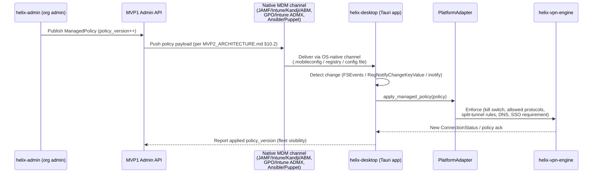
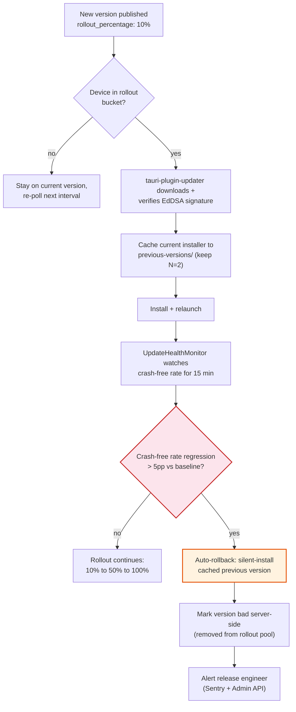

# MVP2 Desktop VPN Client Applications — Technical Specification

**Revision:** 3
**Last modified:** 2026-07-04T16:30:00Z

> **Revision 3 changelog:** annotated §5.7's "Flat UI Colors" theme palette,
> which hardcoded an independently-invented accent/background scheme never
> reconciled against the canonical, already-built OpenDesign token system
> (`docs/research/CROSS_CUTTING_GAP_ANALYSIS.md` §1.2 finding #1).

> **Revision 2 changelog:** added `## 8. Enterprise Hardening & Production
> Readiness` (code-signing/notarization/driver-trust summary, MDM/managed-
> policy push wired to `PlatformAdapter::apply_managed_policy`, signed
> auto-update rollout + rollback, crash reporting, telemetry consent,
> offline/degraded-network behavior, accessibility, i18n, multi-account
> profile isolation, enterprise SSO, and license/entitlement offline-grace
> caching), with two new Mermaid diagrams (this file previously had zero).
> Reconciled against `MVP2_ARCHITECTURE.md` and `MVP2_SHARED_CORE.md`:
> corrected the "Target Protocol" row below (OpenVPN is a reserved,
> unimplemented `ProtocolType::OpenVPN` placeholder only, not a shipped
> fallback — see §1.1); expanded §5.4's connection-state table to the full
> 7-state canonical lifecycle (`MVP2_ARCHITECTURE.md` §5.6) instead of an
> ad-hoc 5-state subset; corrected §7.4's auto-update mechanism table so
> `tauri-plugin-updater` (already an Appendix A dependency) is identified
> as the MVP2-shipped mechanism, with Sparkle/WinSparkle (§2.6/§3.8) noted
> as an optional native-updater supplement rather than the primary path;
> and added a reconciliation note under the three per-OS phase-duration
> tables (§2.8/§3.10/§4.11) cross-referencing the authoritative schedule
> in `MVP2_IMPLEMENTATION_ROADMAP.md`.

## Document Information

| Field | Value |
|-------|-------|
| **Version** | MVP2-1.0 |
| **Date** | July 2025 (Revision 2: 2026-07-04) |
| **Status** | Draft for Implementation |
| **Scope** | macOS, Windows, Linux desktop clients |
| **Framework** | Tauri v2 (Rust + WebView) |
| **Target Protocol** | WireGuard (primary); Shadowsocks SIP022 AEAD-2022 + MASQUE (RFC 9298 CONNECT-UDP/HTTP3) secondary; Multi-Hop (chained WireGuard) advanced. **OpenVPN is a reserved, unimplemented placeholder only** — `ProtocolType::OpenVPN` (`MVP2_SHARED_CORE.md` §3.1) is an enum variant backed by an empty `openvpn = []` Cargo feature flag with no `helix-openvpn` crate; selecting it returns `HelixError::UnsupportedProtocol` in MVP2. Not shipped, not a fallback. |

---

## Table of Contents

1. [Desktop Client Overview](#1-desktop-client-overview)
2. [macOS Client](#2-macos-client)
3. [Windows Client](#3-windows-client)
4. [Linux Client](#4-linux-client)
5. [UI/UX Design for Desktop](#5-uiux-design-for-desktop)
6. [Desktop-Specific Features](#6-desktop-specific-features)
7. [Build & Distribution](#7-build--distribution)
8. [Enterprise Hardening & Production Readiness](#8-enterprise-hardening--production-readiness)

---

## 1. Desktop Client Overview

### 1.1 Unified Desktop Strategy

The MVP2 desktop strategy leverages **Tauri v2** as the unified framework for all three desktop platforms (macOS, Windows, Linux). Tauri v2 was selected based on its unique combination of characteristics critical for a VPN client:

| Selection Criteria | Tauri v2 Score | Rationale |
|---|---|---|
| **Bundle Size** | 10/10 | ~3-15 MB vs Electron's ~96-250 MB |
| **RAM Efficiency** | 10/10 | ~30-80 MB idle vs Electron's ~160-400 MB |
| **Rust Backend Synergy** | 10/10 | Native Rust integration for WireGuard/BoringTun |
| **Security Model** | 9/10 | Capability-based IPC, minimal attack surface |
| **Cross-Platform** | 8/10 | macOS/Windows/Linux from single codebase |
| **Ecosystem Maturity** | 8/10 | ~107K GitHub stars, production-ready since Oct 2024 |
| **Auto-Update** | 9/10 | Built-in signed updater with EdDSA verification |

### 1.2 Architecture Overview

```
+----------------------------------------------------------+
|                    UI Layer (Web Frontend)                |
|  React/Vue/Svelte — Connection UI, Server List, Settings  |
|  Shared CSS/JS across all desktop platforms               |
+----------------------------------------------------------+
                        |
              Tauri IPC Bridge (JSON-RPC)
                        |
+----------------------------------------------------------+
|                   Rust Core (Tauri Backend)               |
|  ┌─────────────┐ ┌─────────────┐ ┌─────────────────────┐ |
|  │   VPN Core  │ │ Kill Switch │ │   Config Manager    │ |
|  │  (libvpn)   │ │   Engine    │ │                     │ |
|  └──────┬──────┘ └──────┬──────┘ └─────────────────────┘ |
|         │               │                                 |
|  ┌──────┴──────┐ ┌──────┴──────┐ ┌─────────────────────┐ |
|  │  WireGuard  │ │  Firewall   │ │   Platform Adapters │ |
|  │  (boringtun)│ │   Manager   │ │                     │ |
|  └─────────────┘ └─────────────┘ └─────────────────────┘ |
+----------------------------------------------------------+
                        |
              Platform Abstraction Layer
                        |
+----------------------------------------------------------+
|              Platform-Specific VPN Integration            |
|  macOS: NEPacketTunnelProvider  |  NetworkExtension      |
|  Windows: WireGuardNT.sys       |  WFP Callouts          |
|  Linux: TUN Device              |  netlink/nftables      |
+----------------------------------------------------------+
```

### 1.3 System Requirements per OS

| Platform | Minimum OS | Architecture | RAM | Disk | Network |
|----------|-----------|--------------|-----|------|---------|
| **macOS** | macOS 12 Monterey (x86_64, Apple Silicon) | Universal Binary | 4 GB | 50 MB | Ethernet/WiFi |
| **Windows** | Windows 10 1903+ (x64, ARM64) | x86_64, ARM64 | 4 GB | 50 MB | Ethernet/WiFi |
| **Linux** | Ubuntu 22.04 / Fedora 38 / Debian 12 | x86_64, ARM64 | 4 GB | 50 MB | Ethernet/WiFi |

### 1.4 Platform-Specific Variations

While the Tauri framework provides a unified codebase, each platform requires platform-specific adaptations in three layers:

1. **VPN Engine Layer**: OS-native tunnel implementation
   - macOS: NetworkExtension NEPacketTunnelProvider
   - Windows: WireGuardNT kernel driver + WFP
   - Linux: TUN device via CAP_NET_ADMIN

2. **Privilege Layer**: Platform-specific privilege escalation
   - macOS: SMJobBless privileged helper tool
   - Windows: Windows Service (Local System)
   - Linux: polkit + CAP_NET_ADMIN capabilities

3. **Integration Layer**: System tray, auto-start, notifications
   - macOS: MenuBarExtra via Tauri tray API
   - Windows: NotifyIcon via Tauri tray API
   - Linux: AppIndicator/StatusNotifierItem via Tauri tray API

### 1.5 Code Organization

```
desktop/
├── src/                          # Shared Rust backend
│   ├── main.rs                   # Tauri application entry
│   ├── lib.rs                    # Core library exports
│   ├── commands/                 # Tauri IPC command handlers
│   │   ├── connection.rs         # connect/disconnect/status
│   │   ├── config.rs             # settings management
│   │   ├── servers.rs            # server list & latency
│   │   └── system.rs             # platform info, logs
│   ├── vpn_core/                 # VPN protocol implementation
│   │   ├── mod.rs                # Core traits & types
│   │   ├── wireguard.rs          # WireGuard protocol logic
│   │   ├── tunnel.rs             # Generic tunnel interface
│   │   ├── config.rs             # VPN configuration types
│   │   └── crypto.rs             # Cryptographic operations
│   ├── kill_switch/              # Kill switch per OS
│   │   ├── mod.rs                # Kill switch trait
│   │   ├── macos.rs              # PF firewall implementation
│   │   ├── windows.rs            # WFP implementation
│   │   └── linux.rs              # nftables implementation
│   └── platform/                 # Platform adapters
│       ├── mod.rs                # Platform trait definitions
│       ├── macos.rs              # macOS-specific code
│       ├── windows.rs            # Windows-specific code
│       └── linux.rs              # Linux-specific code
├── src-tauri/gen/apple/          # macOS Xcode project
├── src-tauri/gen/android/        # Android project (future)
├── frontend/                     # Shared web frontend
│   ├── src/
│   │   ├── components/           # React/Vue components
│   │   ├── views/                # Main, Settings, Servers
│   │   ├── stores/               # State management
│   │   └── utils/                # Shared utilities
│   └── assets/                   # Icons, images, fonts
├── bundle/                       # Packaging assets
│   ├── macos/                    # Info.plist, entitlements
│   ├── windows/                  # WiX sources, manifests
│   └── linux/                    # .desktop, systemd units
└── Cargo.toml                    # Rust workspace manifest
```

---

## 2. macOS Client

### 2.1 Architecture: Tauri + Rust Core + Swift Helper

The macOS client follows a three-tier architecture combining Tauri's web frontend with a Rust backend that delegates platform-specific VPN operations to a Swift-based NetworkExtension:

```
+----------------------------------------------+
| Tauri App (Rust + WebView)                    |
| - Menu bar extra                              |
| - Main window (React/Vue)                     |
| - Settings/preferences                        |
| - IPC command handlers                        |
+----------------------------------------------+
                 | Tauri Commands
                 v
+----------------------------------------------+
| Rust Backend Core                             |
| - VPN state machine                           |
| - Configuration management                    |
| - Kill switch logic (coordination)            |
| - Swift FFI bridge (via C ABI)                |
+----------------------------------------------+
                 | FFI (C ABI)
                 v
+----------------------------------------------+
| Swift Helper (XPC)                            |
| - NetworkExtension management                 |
| - NEPacketTunnelProvider lifecycle            |
| - System configuration                        |
+----------------------------------------------+
                 | XPC / System
                 v
+----------------------------------------------+
| NetworkExtension (NEPacketTunnelProvider)     |
| - PacketTunnel.appex bundle                   |
| - Virtual utun interface                      |
| - Packet flow I/O                             |
+----------------------------------------------+
```

### 2.2 NetworkExtension Integration (NEPacketTunnelProvider)

The macOS VPN tunnel is implemented as a `NEPacketTunnelProvider` app extension. Apple's NetworkExtension framework is the **only supported API** for VPN apps on macOS:

> "Network Extension is the supported API to build a VPN app. It works seamlessly with other networking and system components. Building a VPN app with anything else is highly discouraged."
> — Apple Developer Documentation

#### PacketTunnelProvider Implementation

```swift
// PacketTunnelProvider.swift
import NetworkExtension
import os.log

class PacketTunnelProvider: NEPacketTunnelProvider {
    private let logger = OSLog(subsystem: "com.helixvpn.macos", category: "tunnel")
    private var wgDevice: WireGuardDevice?
    
    override func startTunnel(
        options: [String: NSObject]?,
        completionHandler: @escaping (Error?) -> Void
    ) {
        os_log("Starting tunnel", log: logger, type: .info)
        
        // Load configuration from providerConfiguration
        guard let config = self.protocolConfiguration as? NETunnelProviderProtocol,
              let providerConfig = config.providerConfiguration else {
            completionHandler(NEVPNError(.configurationInvalid))
            return
        }
        
        // Configure tunnel network settings
        let networkSettings = NEPacketTunnelNetworkSettings(tunnelRemoteAddress: config.serverAddress!)
        
        // IPv4 configuration
        let ipv4Settings = NEIPv4Settings(
            addresses: [providerConfig["tunnelAddress"] as! String],
            subnetMasks: ["255.255.255.0"]
        )
        ipv4Settings.includedRoutes = [NEIPv4Route.default()]
        networkSettings.ipv4Settings = ipv4Settings
        
        // DNS configuration
        let dnsServers = providerConfig["dnsServers"] as? [String] ?? ["1.1.1.1", "8.8.8.8"]
        networkSettings.dnsSettings = NEDNSSettings(servers: dnsServers)
        
        // MTU
        networkSettings.mtu = NSNumber(value: providerConfig["mtu"] as? Int ?? 1420)
        
        // Apply settings
        setTunnelNetworkSettings(networkSettings) { [weak self] error in
            guard error == nil else {
                os_log("Failed to set tunnel settings: %{public}@", log: self?.logger ?? .default, type: .error, error!.localizedDescription)
                completionHandler(error)
                return
            }
            
            // Start WireGuard in the extension
            self?.startWireGuard(config: providerConfig, completion: completionHandler)
        }
    }
    
    private func startWireGuard(config: [String: Any], completion: @escaping (Error?) -> Void) {
        // Initialize BoringTun/WireGuard device
        // Route packets between packetFlow and WireGuard
        
        // Start packet processing loop
        DispatchQueue.global(qos: .utility).async { [weak self] in
            self?.processPackets()
        }
        
        completion(nil)
    }
    
    private func processPackets() {
        let packetFlow = self.packetFlow
        
        // Read packets from the virtual interface
        packetFlow.readPacketObjects { [weak self] packets in
            for packet in packets {
                // Encrypt and send via WireGuard
                self?.wgDevice?.handlePacket(packet)
            }
            // Continue reading
            self?.processPackets()
        }
    }
    
    override func stopTunnel(
        with reason: NEProviderStopReason,
        completionHandler: @escaping () -> Void
    ) {
        os_log("Stopping tunnel, reason: %d", log: logger, type: .info, reason.rawValue)
        
        // Clean up WireGuard device
        wgDevice?.shutdown()
        wgDevice = nil
        
        completionHandler()
    }
    
    override func handleAppMessage(_ messageData: Data, completionHandler: ((Data?) -> Void)?) {
        // Handle IPC messages from the main app
        if let message = try? JSONSerialization.jsonObject(with: messageData) as? [String: Any],
           let action = message["action"] as? String {
            switch action {
            case "getStatus":
                let status: [String: Any] = [
                    "connected": wgDevice != nil,
                    "interface": "utun",
                    "bytesIn": wgDevice?.bytesReceived ?? 0,
                    "bytesOut": wgDevice?.bytesSent ?? 0
                ]
                let responseData = try? JSONSerialization.data(withJSONObject: status)
                completionHandler?(responseData)
            default:
                completionHandler?(nil)
            }
        }
    }
}
```

#### App Extension Bundle Structure

```
HelixVPN.app/
  Contents/
    Info.plist                          # Main app Info.plist
    MacOS/
      helixvpn                          # Tauri binary
    Resources/
      ...
    PlugIns/
      PacketTunnel.appex/               # Network Extension bundle
        Contents/
          Info.plist
          MacOS/
            PacketTunnel                # Extension binary
```

The extension `Info.plist` must declare:

```xml
<key>NSExtension</key>
<dict>
    <key>NSExtensionPointIdentifier</key>
    <string>com.apple.networkextension.packet-tunnel</string>
    <key>NSExtensionPrincipalClass</key>
    <string>HelixVPN.PacketTunnelProvider</string>
</dict>
```

### 2.3 Menu Bar Extra (System Tray) Implementation

Tauri v2 provides native system tray support via the `tray-icon` crate. On macOS, this renders as a `NSStatusItem` in the menu bar:

```rust
// src/platform/macos/tray.rs
use tauri::{
    tray::{TrayIconBuilder, TrayIconEvent},
    menu::{Menu, MenuItem, PredefinedMenuItem},
    Manager, Runtime,
};

pub fn setup_tray<R: Runtime>(app: &tauri::AppHandle<R>) -> Result<(), Box<dyn std::error::Error>> {
    // Create menu items
    let connect_i = MenuItem::with_id(app, "connect", "Connect", true, None::<&str>)?;
    let disconnect_i = MenuItem::with_id(app, "disconnect", "Disconnect", false, None::<&str>)?;
    let separator = PredefinedMenuItem::separator(app)?;
    let status_i = MenuItem::with_id(app, "status", "Status: Disconnected", false, None::<&str>)?;
    let servers_i = MenuItem::with_id(app, "servers", "Select Server...", true, None::<&str>)?;
    let settings_i = MenuItem::with_id(app, "settings", "Preferences...", true, None::<&str>)?;
    let quit_i = MenuItem::with_id(app, "quit", "Quit HelixVPN", true, None::<&str>)?;

    let menu = Menu::with_items(app, &[
        &status_i,
        &separator,
        &connect_i,
        &disconnect_i,
        &separator,
        &servers_i,
        &settings_i,
        &separator,
        &quit_i,
    ])?;

    // Build tray icon with template icon for dark mode support
    let tray = TrayIconBuilder::with_id("helix-tray")
        .icon(app.default_window_icon().unwrap().clone())
        .icon_as_template(true)  // macOS template icon for dark mode
        .menu(&menu)
        .on_menu_event(|app, event| match event.id.as_ref() {
            "connect" => {
                let _ = app.emit("vpn-connect", ());
            }
            "disconnect" => {
                let _ = app.emit("vpn-disconnect", ());
            }
            "servers" => {
                if let Some(window) = app.get_webview_window("main") {
                    let _ = window.show();
                    let _ = window.set_focus();
                    let _ = window.eval("window.location.hash = '/servers'");
                }
            }
            "settings" => {
                if let Some(window) = app.get_webview_window("main") {
                    let _ = window.show();
                    let _ = window.set_focus();
                    let _ = window.eval("window.location.hash = '/settings'");
                }
            }
            "quit" => {
                app.exit(0);
            }
            _ => {}
        })
        .on_tray_icon_event(|tray, event| {
            if let TrayIconEvent::Click { button: tauri::tray::MouseButton::Left, .. } = event {
                // Show main window on left-click
                let app = tray.app_handle();
                if let Some(window) = app.get_webview_window("main") {
                    let _ = window.show();
                    let _ = window.set_focus();
                }
            }
        })
        .build(app)?;

    // Store tray handle for later updates
    app.manage(TrayState { tray });

    Ok(())
}

// State wrapper for runtime tray updates
pub struct TrayState<R: Runtime> {
    pub tray: tauri::tray::TrayIcon<R>,
}

pub fn update_tray_status<R: Runtime>(
    app: &tauri::AppHandle<R>,
    connected: bool,
    server: &str,
) {
    if let Some(tray_state) = app.try_state::<TrayState<R>>() {
        let icon_path = if connected {
            "icons/tray-connected.png"
        } else {
            "icons/tray-disconnected.png"
        };
        // Update icon and tooltip
        let _ = tray_state.tray.set_tooltip(
            &format!("HelixVPN - {} ({})",
                if connected { "Connected" } else { "Disconnected" },
                server
            )
        );
    }
}
```

### 2.4 Code Signing and Notarization Process

macOS VPN apps require proper code signing and notarization for distribution outside the App Store:

#### Required Certificates

| Certificate | Purpose | Source |
|-------------|---------|--------|
| Developer ID Application | Sign .app bundle | Apple Developer ($99/yr) |
| Developer ID Installer | Sign .pkg installer | Apple Developer |
| Mac Development | Development builds | Apple Developer |

#### Required Entitlements

```xml
<!-- entitlements.plist — macOS app entitlements -->
<?xml version="1.0" encoding="UTF-8"?>
<!DOCTYPE plist PUBLIC "-//Apple//DTD PLIST 1.0//EN" "http://www.apple.com/DTDs/PropertyList-1.0.dtd">
<plist version="1.0">
<dict>
    <!-- Network Extension capability -->
    <key>com.apple.developer.networking.networkextension</key>
    <array>
        <string>packet-tunnel-provider</string>
    </array>
    
    <!-- VPN API access -->
    <key>com.apple.developer.networking.vpn.api</key>
    <array>
        <string>allow-vpn</string>
    </array>
    
    <!-- App groups for main app/extension communication -->
    <key>com.apple.security.application-groups</key>
    <array>
        <string>group.com.helixvpn.macos</string>
    </array>
    
    <!-- Outgoing network connections -->
    <key>com.apple.security.network.client</key>
    <true/>
    
    <!-- Hardened runtime (required for notarization) -->
    <key>com.apple.security.cs.allow-jit</key>
    <true/>
    <key>com.apple.security.cs.allow-unsigned-executable-memory</key>
    <true/>
    <key>com.apple.security.cs.disable-library-validation</key>
    <true/>
</dict>
</plist>
```

#### Signing Script

```bash
#!/bin/bash
# sign-macos.sh — macOS code signing and notarization pipeline

set -e

APP_NAME="HelixVPN"
BUNDLE_ID="com.helixvpn.macos"
DEVELOPER_ID="Developer ID Application: HelixVPN Inc (TEAM_ID)"
INSTALLER_ID="Developer ID Installer: HelixVPN Inc (TEAM_ID)"
APPLE_ID="build@helixvpn.com"
APP_SPECIFIC_PASSWORD="@keychain:altool-password"
TEAM_ID="XXXXXXXXXX"

echo "=== Step 1: Build universal binary ==="
cargo build --target x86_64-apple-darwin --release
cargo build --target aarch64-apple-darwin --release

lipo -create -o target/universal-apple-darwin/release/${APP_NAME} \
    target/x86_64-apple-darwin/release/${APP_NAME} \
    target/aarch64-apple-darwin/release/${APP_NAME}

echo "=== Step 2: Sign main app ==="
codesign --sign "${DEVELOPER_ID}" \
    --force \
    --timestamp \
    --options runtime \
    --entitlements bundle/macos/entitlements.plist \
    --identifier "${BUNDLE_ID}" \
    "src-tauri/target/universal-apple-darwin/release/bundle/macos/${APP_NAME}.app"

echo "=== Step 3: Sign Network Extension ==="
codesign --sign "${DEVELOPER_ID}" \
    --force \
    --timestamp \
    --options runtime \
    --entitlements bundle/macos/extension-entitlements.plist \
    "${APP_NAME}.app/Contents/PlugIns/PacketTunnel.appex"

echo "=== Step 4: Verify signatures ==="
codesign --verify --deep --strict --verbose=2 "${APP_NAME}.app"

echo "=== Step 5: Create DMG ==="
tauri bundle --bundles dmg

echo "=== Step 6: Notarize ==="
xcrun notarytool submit "${APP_NAME}.dmg" \
    --apple-id "${APPLE_ID}" \
    --password "${APP_SPECIFIC_PASSWORD}" \
    --team-id "${TEAM_ID}" \
    --wait

echo "=== Step 7: Staple ==="
xcrun stapler staple "${APP_NAME}.dmg"

echo "=== Done ==="
```

### 2.5 Privileged Helper Tool (SMJobBless)

For system-level operations (firewall rules, interface management), macOS requires a privileged helper tool using the `SMJobBless` pattern:

```
User App (user privileges)
    |
    | XPC Connection
    v
Privileged Helper (/Library/PrivilegedHelperTools/com.helixvpn.helper)
    |
    | root privileges
    v
System Operations (pfctl, networksetup)
```

#### Security Requirements

- Both app and helper must be code-signed with the **same Developer ID**
- Helper's `Info.plist` must list `SMAuthorizedClients` with the app's signing certificate
- App must validate helper's code signature before communicating
- Helper should validate client certificate

#### Helper Tool Info.plist

```xml
<?xml version="1.0" encoding="UTF-8"?>
<!DOCTYPE plist PUBLIC "-//Apple//DTD PLIST 1.0//EN" "http://www.apple.com/DTDs/PropertyList-1.0.dtd">
<plist version="1.0">
<dict>
    <key>Label</key>
    <string>com.helixvpn.helper</string>
    <key>MachServices</key>
    <dict>
        <key>com.helixvpn.helper</key>
        <true/>
    </dict>
    <key>SMAuthorizedClients</key>
    <array>
        <string>identifier "com.helixvpn.macos" and anchor apple generic and certificate leaf[subject.CN] = "Developer ID Application: HelixVPN Inc"</string>
    </array>
</dict>
</plist>
```

#### Rust FFI Bridge (Client Side)

```rust
// src/platform/macos/privileged_helper.rs
use std::ffi::{c_char, c_int, CStr, CString};
use libc;

// C ABI interface to Swift helper
#[link(name = "HelixVPNHelper", kind = "framework")]
extern "C" {
    fn helper_install() -> c_int;
    fn helper_remove() -> c_int;
    fn helper_apply_firewall_rules(rules_json: *const c_char) -> c_int;
    fn helper_remove_firewall_rules() -> c_int;
    fn helper_enable_killswitch(tunnel_interface: *const c_char) -> c_int;
    fn helper_disable_killswitch() -> c_int;
}

pub struct PrivilegedHelper;

impl PrivilegedHelper {
    pub fn install() -> Result<(), String> {
        unsafe {
            match helper_install() {
                0 => Ok(()),
                err => Err(format!("Failed to install helper: {}", err)),
            }
        }
    }

    pub fn enable_killswitch(tunnel_interface: &str) -> Result<(), String> {
        let iface_c = CString::new(tunnel_interface).map_err(|e| e.to_string())?;
        unsafe {
            match helper_enable_killswitch(iface_c.as_ptr()) {
                0 => Ok(()),
                err => Err(format!("Failed to enable killswitch: {}", err)),
            }
        }
    }

    pub fn disable_killswitch() -> Result<(), String> {
        unsafe {
            match helper_disable_killswitch() {
                0 => Ok(()),
                err => Err(format!("Failed to disable killswitch: {}", err)),
            }
        }
    }
}
```

### 2.6 Sparkle Framework for Auto-Updates

> **Reconciliation note (Revision 2):** per `MVP2_ARCHITECTURE.md` §3.3,
> `tauri-plugin-updater` (§7.4, §8.3) is the mechanism MVP2 actually ships
> for auto-updates; Sparkle below is an optional native-updater supplement
> some teams wire up later for OS-native delta-update UX, not the shipped
> default.

Sparkle is the standard macOS auto-updater, supporting delta updates and EdDSA signature verification:

```xml
<!-- Info.plist — Sparkle configuration -->
<key>SUFeedURL</key>
<string>https://updates.helixvpn.com/macos/appcast.xml</string>
<key>SUPublicEDKey</key>
<string>YOUR_ED25519_PUBLIC_KEY_BASE64</string>
<key>SUEnableAutomaticChecks</key>
<true/>
<key>SUScheduledCheckInterval</key>
<integer>86400</integer>  <!-- Check every 24 hours -->
<key>SUAllowsAutomaticUpdates</key>
<true/>
```

#### Appcast XML Format

```xml
<?xml version="1.0" encoding="utf-8"?>
<rss version="2.0" xmlns:sparkle="http://www.andymatuschak.org/xml-namespaces/sparkle"
     xmlns:dc="http://purl.org/dc/elements/1.1/">
  <channel>
    <title>HelixVPN for macOS Changelog</title>
    <link>https://updates.helixvpn.com/macos/appcast.xml</link>
    <description>Most recent changes with links to updates.</description>
    <language>en</language>
    <item>
      <title>Version 1.0.0</title>
      <sparkle:version>100</sparkle:version>
      <sparkle:shortVersionString>1.0.0</sparkle:shortVersionString>
      <sparkle:minimumSystemVersion>12.0</sparkle:minimumSystemVersion>
      <description><![CDATA[
        <h2>HelixVPN 1.0.0</h2>
        <ul>
          <li>Initial release</li>
          <li>WireGuard protocol support</li>
          <li>Kill switch and split tunneling</li>
        </ul>
      ]]></description>
      <pubDate>Mon, 01 Jul 2025 12:00:00 +0000</pubDate>
      <enclosure url="https://updates.helixvpn.com/macos/HelixVPN-1.0.0.zip"
                 sparkle:edSignature="BASE64_SIGNATURE"
                 length="5242880"
                 type="application/octet-stream"
                 sparkle:os="macos"/>
    </item>
  </channel>
</rss>
```

### 2.7 Sandboxing Considerations

For MVP2, the recommended distribution approach is **outside the Mac App Store** (standalone DMG with Sparkle). This avoids App Store sandboxing limitations:

| Aspect | App Store (Sandboxed) | Standalone (Recommended) |
|--------|----------------------|--------------------------|
| NetworkExtension | Limited | Full access |
| Run before login | No | Yes (via helper tool) |
| Auto-updates | App Store only | Sparkle (delta updates) |
| Keychain access | User keychain only | System keychain possible |
| File system | Restricted | Full access |
| SMJobBless helper | Not allowed | Allowed |

### 2.8 macOS Implementation Phases

| Phase | Duration | Milestones |
|-------|----------|------------|
| **Phase 1: Foundation** | 2 weeks | Tauri project setup, Swift bridge, basic window |
| **Phase 2: Tunnel** | 3 weeks | NEPacketTunnelProvider, WireGuard integration, packet I/O |
| **Phase 3: Kill Switch** | 1 week | PF firewall rules, SMJobBless helper |
| **Phase 4: System Tray** | 1 week | Menu bar extra, status icons, context menu |
| **Phase 5: Polish** | 2 weeks | Sparkle updater, code signing, notarization, DMG |

---

## 3. Windows Client

### 3.1 Architecture: Tauri + Rust Core + Windows Services

The Windows client uses a service-based architecture inspired by WireGuard for Windows, separating the UI process from privileged tunnel management:

```
+----------------------------------------------+
| Tauri App (User Session)                      |
| - System tray (NotifyIcon)                    |
| - Main window (WebView2)                      |
| - Runs with administrator token               |
+----------------------------------------------+
                 | Named Pipe IPC
                 v
+----------------------------------------------+
| Manager Service (Local System)                |
| - Installed via MSI                           |
| - Manages tunnel services                     |
| - Handles UI spawning                         |
| - Removes all privileges except needed        |
+----------------------------------------------+
                 | Service Control
                 v
+----------------------------------------------+
| Tunnel Service$HelixVPN (Local System)        |
| - One service per tunnel                      |
| - Manages WireGuardNT.sys                     |
| - Handles packet I/O                          |
+----------------------------------------------+
                 | NDIS IOCTLs
                 v
+----------------------------------------------+
| WireGuardNT.sys (Kernel Driver)               |
| - High-performance kernel WireGuard           |
| - ~892 Mbit/s throughput                      |
+----------------------------------------------+
```

### 3.2 WFP (Windows Filtering Platform) Integration

WFP is the primary mechanism for kill switch and traffic filtering on Windows:

```rust
// src/kill_switch/windows.rs
use windows_sys::Win32::NetworkManagement::WindowsFilteringPlatform::*;
use std::ptr;
use std::ffi::c_void;

pub struct WfpKillSwitch {
    engine_handle: HANDLE,
    session_key: GUID,
}

impl WfpKillSwitch {
    pub fn new() -> Result<Self, Box<dyn std::error::Error>> {
        unsafe {
            // Open WFP engine handle
            let mut engine_handle: HANDLE = 0;
            let session = FWPM_SESSION0 {
                displayData: FWPM_DISPLAY_DATA0 {
                    name: windows::core::w!("HelixVPN Session").as_ptr() as *mut _,
                    description: ptr::null_mut(),
                },
                staticKey: GUID::zeroed(),
                txnWaitTimeoutInMSec: 10000,
                // Transaction is persistent (survives reboot)
                txnWaitTimeoutInMSec: 0,
            };

            let status = FwpmEngineOpen0(
                ptr::null(),
                RPC_C_AUTHN_WINNT,
                ptr::null(),
                &session,
                &mut engine_handle,
            );

            if status != ERROR_SUCCESS {
                return Err(format!("FwpmEngineOpen0 failed: 0x{:08X}", status).into());
            }

            Ok(Self {
                engine_handle,
                session_key: session.staticKey,
            })
        }
    }

    /// Enable kill switch: block all outbound except VPN tunnel
    pub fn enable(&self, tunnel_interface_alias: &str) -> Result<(), Box<dyn std::error::Error>> {
        unsafe {
            let wide_alias: Vec<u16> = tunnel_interface_alias.encode_utf16().chain(Some(0)).collect();

            // 1. Add provider (container for our rules)
            let provider_key = HELIX_PROVIDER_GUID;
            let provider = FWPM_PROVIDER0 {
                providerKey: provider_key,
                displayData: FWPM_DISPLAY_DATA0 {
                    name: windows::core::w!("HelixVPN").as_ptr() as *mut _,
                    description: windows::core::w!("HelixVPN Kill Switch Provider").as_ptr() as *mut _,
                },
                flags: 0,
                providerData: FWP_BYTE_BLOB::default(),
                serviceName: ptr::null_mut(),
            };

            let status = FwpmProviderAdd0(self.engine_handle, &provider, ptr::null());
            if status != ERROR_SUCCESS && status != FWP_E_ALREADY_EXISTS {
                return Err(format!("FwpmProviderAdd0 failed: 0x{:08X}", status).into());
            }

            // 2. Block all outbound traffic (low weight)
            let block_all_filter = FWPM_FILTER0 {
                filterKey: GUID::zeroed(),
                displayData: FWPM_DISPLAY_DATA0 {
                    name: windows::core::w!("HelixVPN Block All Outbound").as_ptr() as *mut _,
                    description: ptr::null_mut(),
                },
                flags: FWPM_FILTER_FLAG_PERSISTENT,  // Survive reboot
                providerKey: &provider_key,
                layerKey: FWPM_LAYER_ALE_AUTH_CONNECT_V4,
                subLayerKey: FWPM_SUBLAYER_UNIVERSAL,
                weight: FWP_VALUE0 {
                    r#type: FWP_UINT8,
                    Anonymous: FWP_VALUE0_0 { uint8: 0 },  // Low weight
                },
                numFilterConditions: 0,
                filterCondition: ptr::null_mut(),
                action: FWPM_ACTION0 {
                    r#type: FWP_ACTION_BLOCK,
                    Anonymous: FWPM_ACTION0_0 { filterType: 0 },
                },
                // ...
                ..Default::default()
            };

            let mut filter_id: u64 = 0;
            let status = FwpmFilterAdd0(
                self.engine_handle,
                &block_all_filter,
                ptr::null(),
                &mut filter_id,
            );

            if status != ERROR_SUCCESS {
                return Err(format!("FwpmFilterAdd0 failed: 0x{:08X}", status).into());
            }

            // 3. Allow traffic on VPN tunnel interface (high weight)
            // 4. Allow traffic to VPN server endpoint
            // 5. Allow DHCP/DNS

            Ok(())
        }
    }

    /// Disable kill switch: remove all filters
    pub fn disable(&self) -> Result<(), Box<dyn std::error::Error>> {
        unsafe {
            // Remove all filters by provider key
            let status = FwpmFilterDeleteByProviderKey0(
                self.engine_handle,
                &HELIX_PROVIDER_GUID,
            );

            if status != ERROR_SUCCESS && status != FWP_E_FILTER_NOT_FOUND {
                return Err(format!("Failed to remove filters: 0x{:08X}", status).into());
            }

            // Remove provider
            let _ = FwpmProviderDeleteByKey0(self.engine_handle, &HELIX_PROVIDER_GUID);

            Ok(())
        }
    }
}

// Cleanup on drop
impl Drop for WfpKillSwitch {
    fn drop(&mut self) {
        unsafe {
            let _ = self.disable();
            FwpmEngineClose0(self.engine_handle);
        }
    }
}
```

### 3.3 WireGuardNT Kernel Driver

WireGuardNT provides the highest-performance WireGuard implementation on Windows. It operates as a kernel driver communicating via NDIS:

| Implementation | Upload | Download | Recommendation |
|---------------|--------|----------|----------------|
| WireGuardNT (kernel) | **892 Mbit/s** | **892 Mbit/s** | **Primary choice** |
| WireSock VPN Client | 879 Mbit/s | 892 Mbit/s | Alternative |
| WinTun (userspace) | 288 Mbit/s | 325 Mbit/s | Legacy fallback |

**Driver-signing note (added Revision 2 — see §8.1):** HelixVPN does not
recompile or re-sign `wireguard.dll` / the `WireGuardNT.sys` kernel
driver. The upstream `wireguard-nt` releases published by the WireGuard
Foundation are already Microsoft attestation-signed for kernel-mode
loading; the build pipeline vendors the exact upstream-released binary,
pinned by SHA-256 and verified in CI (§7.1) before bundling, rather than
building it from source. Re-signing it would invalidate the upstream
signature and require HelixVPN to obtain its own EV/attestation
driver-signing certificate and Windows Hardware Dev Center submission — a
materially heavier process than the app/installer EV code-signing already
covered in §3.9, and one this project deliberately avoids by redistributing
the upstream binary as-is.

#### Rust Integration

```rust
// src/platform/windows/wireguard_nt.rs
use std::ffi::{c_void, OsStr};
use std::os::windows::ffi::OsStrExt;
use windows_sys::Win32::Foundation::*;
use windows_sys::Win32::System::IO::*;

/// WireGuardNT adapter configuration
pub struct WireGuardNtAdapter {
    adapter_handle: HANDLE,
    interface_alias: String,
}

impl WireGuardNtAdapter {
    /// Create a new WireGuard adapter
    pub fn create(interface_alias: &str) -> Result<Self, Box<dyn std::error::Error>> {
        // Load wireguard.dll (shipped with the app)
        let dll_path = get_wireguard_dll_path()?;
        let dll = unsafe { LoadLibraryW(dll_path.as_ptr()) };
        if dll.is_null() {
            return Err("Failed to load wireguard.dll".into());
        }

        // Get WintunCreateAdapter function
        let create_adapter: unsafe extern "system" fn(
            name: *const u16,
            tunnel_type: *const u16,
            requested_guid: *const GUID,
        ) -> HANDLE = unsafe {
            std::mem::transmute(GetProcAddress(dll, b"WintunCreateAdapter\0".as_ptr() as *const i8))
        };

        let alias_wide: Vec<u16> = OsStr::new(interface_alias)
            .encode_wide()
            .chain(Some(0))
            .collect();
        let tunnel_type: Vec<u16> = OsStr::new("HelixVPN")
            .encode_wide()
            .chain(Some(0))
            .collect();

        let handle = unsafe {
            create_adapter(alias_wide.as_ptr(), tunnel_type.as_ptr(), ptr::null())
        };

        if handle.is_null() {
            return Err("Failed to create WireGuard adapter".into());
        }

        Ok(Self {
            adapter_handle: handle,
            interface_alias: interface_alias.to_string(),
        })
    }

    /// Configure WireGuard peers and allowed IPs
    pub fn configure(&self, config: &WireGuardConfig) -> Result<(), Box<dyn std::error::Error>> {
        // Convert config to WireGuardNT configuration format
        let private_key = base64_decode(&config.private_key)?;
        let peer_public_key = base64_decode(&config.peer_public_key)?;
        let preshared_key = config.preshared_key.as_ref()
            .map(|k| base64_decode(k))
            .transpose()?;

        // Set private key
        self.set_private_key(&private_key)?;

        // Set peer
        self.set_peer(&WireGuardPeer {
            public_key: peer_public_key,
            preshared_key,
            endpoint: config.endpoint.clone(),
            persistent_keepalive: config.persistent_keepalive,
            allowed_ips: config.allowed_ips.clone(),
        })?;

        // Set interface addresses
        self.set_addresses(&config.addresses)?;

        // Set DNS
        if let Some(ref dns) = config.dns {
            self.set_dns(dns)?;
        }

        // Set MTU
        self.set_mtu(config.mtu.unwrap_or(1420))?;

        Ok(())
    }

    /// Start the adapter (brings interface up)
    pub fn up(&self) -> Result<(), Box<dyn std::error::Error>> {
        // Set interface status to "up" via adapter IOCTL
        self.set_adapter_state(true)
    }

    /// Stop the adapter
    pub fn down(&self) -> Result<(), Box<dyn std::error::Error>> {
        self.set_adapter_state(false)
    }

    fn set_private_key(&self, key: &[u8]) -> Result<(), Box<dyn std::error::Error>> {
        // WireGuardNT_WMI_CONFIGURE_ADAPTER ioctl
        // ...
        Ok(())
    }

    fn set_adapter_state(&self, up: bool) -> Result<(), Box<dyn std::error::Error>> {
        // Use netsh or direct NDIS call
        let state = if up { "connected" } else { "disconnected" };
        let output = std::process::Command::new("netsh")
            .args(&["interface", "set", "interface", &self.interface_alias, state])
            .output()?;

        if !output.status.success() {
            return Err(String::from_utf8_lossy(&output.stderr).into());
        }
        Ok(())
    }
}

impl Drop for WireGuardNtAdapter {
    fn drop(&mut self) {
        let _ = self.down();
        unsafe {
            CloseHandle(self.adapter_handle);
        }
    }
}
```

### 3.4 Windows Service Architecture

The Windows client uses a dual-service architecture for security:

```rust
// src/platform/windows/service.rs
use windows_service::{
    service::{ServiceAccess, ServiceErrorControl, ServiceInfo, ServiceStartType, ServiceType},
    service_manager::{ServiceManager, ServiceManagerAccess},
};

const MANAGER_SERVICE_NAME: &str = "HelixVPNManager";
const TUNNEL_SERVICE_PREFIX: &str = "HelixVPNTunnel$";

/// Install the manager service (run during MSI installation)
pub fn install_manager_service() -> Result<(), Box<dyn std::error::Error>> {
    let manager = ServiceManager::local_computer(
        None::<&str>,
        ServiceManagerAccess::CREATE_SERVICE,
    )?;

    let service_info = ServiceInfo {
        name: MANAGER_SERVICE_NAME.into(),
        display_name: "HelixVPN Manager".into(),
        service_type: ServiceType::OWN_PROCESS,
        start_type: ServiceStartType::Auto,
        error_control: ServiceErrorControl::Normal,
        executable_path: get_manager_service_exe_path()?,
        launch_arguments: vec!["--manager".into()],
        dependencies: vec![],
        account_name: Some("LocalSystem".into()),
        account_password: None,
    };

    let service = manager.create_service(
        &service_info,
        ServiceAccess::START | ServiceAccess::STOP,
    )?;

    // Set service description
    service.set_description("Manages HelixVPN tunnel services and UI process")?;

    Ok(())
}

/// Create a per-tunnel service
pub fn create_tunnel_service(
    config_name: &str,
    config_path: &std::path::Path,
) -> Result<(), Box<dyn std::error::Error>> {
    let manager = ServiceManager::local_computer(
        None::<&str>,
        ServiceManagerAccess::CREATE_SERVICE,
    )?;

    let service_name = format!("{}{}", TUNNEL_SERVICE_PREFIX, config_name);

    let service_info = ServiceInfo {
        name: service_name.clone().into(),
        display_name: format!("HelixVPN Tunnel ({})", config_name).into(),
        service_type: ServiceType::OWN_PROCESS,
        start_type: ServiceStartType::Demand,  // Started on demand
        error_control: ServiceErrorControl::Normal,
        executable_path: get_tunnel_service_exe_path()?,
        launch_arguments: vec![config_path.to_string_lossy().into_owned()],
        dependencies: vec![],  // Could depend on manager
        account_name: Some("LocalSystem".into()),
        account_password: None,
    };

    let service = manager.create_service(&service_info, ServiceAccess::all())?;

    // Start the service
    service.start(&[] as &[std::ffi::OsString])?;

    Ok(())
}
```

### 3.5 System Tray Integration

```rust
// System tray uses Tauri's built-in tray API (same as macOS)
// with Windows-specific additions for balloon notifications

use tauri::tray::TrayIconEvent;
use tauri::menu::{Menu, MenuItem};

pub fn setup_windows_tray<R: Runtime>(app: &tauri::AppHandle<R>) -> Result<(), Box<dyn std::error::Error>> {
    // Windows-specific: use .ico format for tray icons
    let menu = Menu::with_items(app, &[
        &MenuItem::with_id(app, "connect", "Connect", true, None::<&str>)?,
        &MenuItem::with_id(app, "disconnect", "Disconnect", false, None::<&str>)?,
        &PredefinedMenuItem::separator(app)?,
        &MenuItem::with_id(app, "status", "Disconnected", false, None::<&str>)?,
        &PredefinedMenuItem::separator(app)?,
        &MenuItem::with_id(app, "servers", "Select Server...", true, None::<&str>)?,
        &MenuItem::with_id(app, "settings", "Preferences...", true, None::<&str>)?,
        &PredefinedMenuItem::separator(app)?,
        &MenuItem::with_id(app, "quit", "Exit", true, None::<&str>)?,
    ])?;

    let tray = TrayIconBuilder::with_id("helix-tray")
        .icon(load_windows_icon("icons/tray-disconnected.ico")?)
        .tooltip("HelixVPN - Disconnected")
        .menu(&menu)
        .on_tray_icon_event(|tray, event| {
            match event {
                TrayIconEvent::Click { button, button_state, .. } => {
                    // Left-click: show/hide main window
                    // Right-click: show context menu (handled by menu)
                }
                TrayIconEvent::DoubleClick { .. } => {
                    // Double-click: toggle connection
                }
                _ => {}
            }
        })
        .build(app)?;

    Ok(())
}
```

### 3.6 UAC / Privilege Handling

The Windows client requires Administrator privileges for:
- Installing/removing the WireGuardNT driver
- Managing WFP firewall rules
- Creating/modifying network adapters
- Controlling Windows services

**Approach**: The Tauri app requests elevation via a manifest:

```xml
<!-- manifest.xml — UAC execution level -->
<?xml version="1.0" encoding="UTF-8" standalone="yes"?>
<assembly xmlns="urn:schemas-microsoft-com:asm.v1" manifestVersion="1.0">
  <trustInfo xmlns="urn:schemas-microsoft-com:asm.v2">
    <security>
      <requestedPrivileges>
        <requestedExecutionLevel level="requireAdministrator" uiAccess="false"/>
      </requestedPrivileges>
    </security>
  </trustInfo>
  <compatibility xmlns="urn:schemas-microsoft-com:compatibility.v1">
    <application>
      <!-- Windows 10 -->
      <supportedOS Id="{8e0f7a12-bfb3-4fe8-b9a5-48fd50a15a9a}"/>
    </application>
  </compatibility>
</assembly>
```

### 3.7 MSI Installer with WiX Toolset

```xml
<!-- installer.wxs — WiX Toolset installer definition -->
<?xml version="1.0" encoding="UTF-8"?>
<Wix xmlns="http://wixtoolset.org/schemas/v4/wxs"
     xmlns:ui="http://wixtoolset.org/schemas/v4/wxs/ui">
  <Package Name="HelixVPN" Language="1033" Version="1.0.0.0"
           Manufacturer="HelixVPN Inc" InstallerVersion="500"
           Compressed="yes" InstallScope="perMachine">

    <MajorUpgrade DowngradeErrorMessage="A newer version is already installed." />
    <MediaTemplate EmbedCab="yes" />

    <!-- Features -->
    <Feature Id="ProductFeature" Title="HelixVPN" Level="1">
      <ComponentGroupRef Id="ProductComponents" />
      <ComponentGroupRef Id="WireGuardDriver" />
      <ComponentGroupRef Id="ManagerService" />
      <ComponentRef Id="ApplicationShortcut" />
    </Feature>

    <!-- UI -->
    <ui:WixUI Id="WixUI_InstallDir" />
    <Property Id="WIXUI_INSTALLDIR" Value="INSTALLFOLDER" />

    <!-- Directories -->
    <StandardDirectory Id="ProgramFiles64Folder">
      <Directory Id="INSTALLFOLDER" Name="HelixVPN">
        <Component Id="MainApp" Guid="PUT-GUID-HERE">
          <File Id="HelixVPN.exe" Source="target\release\HelixVPN.exe" KeyPath="yes"/>
        </Component>
        <!-- WireGuardNT driver -->
        <Directory Id="DRIVERS" Name="Drivers">
          <Component Id="WireGuardDriver" Guid="PUT-GUID-HERE">
            <File Id="wireguard.sys" Source="drivers\wireguardnt\wireguard.sys" />
            <File Id="wireguard.dll" Source="drivers\wireguardnt\wireguard.dll" />
          </Component>
        </Directory>
      </Directory>
    </StandardDirectory>

    <!-- Manager Service Installation -->
    <ComponentGroup Id="ManagerService" Directory="INSTALLFOLDER">
      <Component Id="ManagerServiceInstall" Guid="PUT-GUID-HERE">
        <File Id="HelixVPNManager.exe" Source="target\release\HelixVPNManager.exe" />
        <ServiceInstall
          Id="HelixVPNManagerService"
          Type="ownProcess"
          Vital="yes"
          Name="HelixVPNManager"
          DisplayName="HelixVPN Manager"
          Description="Manages HelixVPN tunnels"
          Start="auto"
          Account="LocalSystem"
          ErrorControl="normal"
          Arguments="--manager" />
        <ServiceControl Id="StartManagerService"
                        Start="install"
                        Stop="both"
                        Remove="uninstall"
                        Name="HelixVPNManager"
                        Wait="yes" />
      </Component>
    </ComponentGroup>

    <!-- Desktop Shortcut -->
    <StandardDirectory Id="ProgramMenuFolder">
      <Component Id="ApplicationShortcut" Guid="PUT-GUID-HERE">
        <Shortcut Id="ApplicationStartMenuShortcut"
                  Name="HelixVPN"
                  Description="HelixVPN Client"
                  Target="[INSTALLFOLDER]HelixVPN.exe"
                  WorkingDirectory="INSTALLFOLDER"
                  Icon="HelixVPN.exe" />
        <RemoveFolder Id="ApplicationProgramsFolder" On="uninstall" />
        <RegistryValue Root="HKCU" Key="Software\HelixVPN" Name="installed"
                       Type="integer" Value="1" KeyPath="yes" />
      </Component>
    </StandardDirectory>

    <!-- Windows Defender SmartScreen -->
    <Property Id="ARPCOMMENTS">HelixVPN - Secure VPN Client</Property>
    <Property Id="ARPURLINFOABOUT">https://helixvpn.com</Property>
  </Package>
</Wix>
```

### 3.8 WinSparkle for Auto-Updates

> **Reconciliation note (Revision 2):** as in §2.6, `tauri-plugin-updater`
> (§7.4, §8.3) is the MVP2-shipped mechanism; WinSparkle below is an
> optional native-updater supplement, not the shipped default.

WinSparkle provides the Windows equivalent of Sparkle, using the same appcast XML format:

```cpp
// WinSparkle integration (C wrapper called from Rust)
#include <winsparkle.h>

extern "C" void winsparkle_init() {
    win_sparkle_set_appcast_url("https://updates.helixvpn.com/windows/appcast.xml");
    win_sparkle_set_app_version("1.0.0");
    win_sparkle_set_automatic_check_for_updates(1);
    win_sparkle_set_update_check_interval(24 * 3600);  // Daily
    win_sparkle_init();
}

extern "C" void winsparkle_cleanup() {
    win_sparkle_cleanup();
}

extern "C" void winsparkle_check_update() {
    win_sparkle_check_update_with_ui();
}
```

```rust
// src/platform/windows/updater.rs
#[link(name = "WinSparkle", kind = "dylib")]
extern "C" {
    fn winsparkle_init();
    fn winsparkle_cleanup();
    fn winsparkle_check_update();
}

pub struct WinUpdater;

impl WinUpdater {
    pub fn initialize() {
        unsafe { winsparkle_init(); }
    }

    pub fn check_for_updates() {
        unsafe { winsparkle_check_update(); }
    }

    pub fn shutdown() {
        unsafe { winsparkle_cleanup(); }
    }
}
```

### 3.9 Windows Defender SmartScreen Considerations

Windows Defender SmartScreen may flag the installer as unrecognized:

| Strategy | Description | Timeline |
|----------|-------------|----------|
| **EV Code Signing** | Extended Validation certificate from DigiCert/Sectigo | Immediate trust |
| **Standard Code Signing** | Regular OV certificate | Trust builds over time |
| **Microsoft Store** | Distribute via Microsoft Store | Bypasses SmartScreen |
| **Reputation Building** | Enough installs build reputation | Weeks to months |

**Recommendation**: Use an EV code signing certificate for immediate SmartScreen bypass.

### 3.10 Windows Implementation Phases

| Phase | Duration | Milestones |
|-------|----------|------------|
| **Phase 1: Foundation** | 2 weeks | Tauri setup, WebView2, window management |
| **Phase 2: Tunnel** | 3 weeks | WireGuardNT integration, adapter management |
| **Phase 3: WFP Kill Switch** | 2 weeks | WFP filter management, persistent rules |
| **Phase 4: Service Architecture** | 2 weeks | Manager service, tunnel service, IPC |
| **Phase 5: Installer** | 1 week | WiX MSI, driver installation, code signing |
| **Phase 6: Polish** | 1 week | WinSparkle, tray polish, SmartScreen |

---

## 4. Linux Client

### 4.1 Architecture: Tauri + Rust Core + systemd Daemon

The Linux client uses a daemon-based architecture with D-Bus IPC, following established Linux VPN patterns (Mullvad, ProtonVPN):

```
+----------------------------------------------+
| Tauri App (User Session)                      |
| - System tray (AppIndicator)                  |
| - Main window (WebKitGTK)                     |
| - D-Bus client                                |
+----------------------------------------------+
                 | D-Bus
                 v
+----------------------------------------------+
| helixvpn-daemon (systemd service)             |
| - D-Bus service (org.helixvpn.Daemon)         |
| - WireGuard protocol (boringtun)              |
| - Kill switch (nftables/iptables)             |
| - NetworkManager integration                  |
| - polkit authorization                        |
+----------------------------------------------+
                 | System Calls
                 v
+----------------------------------------------+
| Linux Kernel                                  |
| - TUN device                                  |
| - netlink (rtnetlink)                         |
| - nftables / iptables                         |
| - WireGuard kernel module (kernel 5.6+)       |
| - systemd-resolved (DNS)                      |
+----------------------------------------------+
```

### 4.2 TUN Device Management (CAP_NET_ADMIN)

Linux VPN tunnels use the TUN/TAP virtual network interface. The Rust backend manages TUN devices using the `tun` crate:

```rust
// src/platform/linux/tun_device.rs
use tun::{self, Configuration, Device};
use std::net::Ipv4Addr;

pub struct LinuxTunDevice {
    device: Box<dyn Device>,
    name: String,
}

impl LinuxTunDevice {
    /// Create a new TUN device
    pub fn create(name: &str, mtu: i32) -> Result<Self, Box<dyn std::error::Error>> {
        let mut config = Configuration::default();
        config
            .name(name)
            .mtu(mtu)
            .address(Ipv4Addr::new(10, 0, 0, 2))
            .netmask(Ipv4Addr::new(255, 255, 255, 0))
            .up();

        #[cfg(target_os = "linux")]
        config.platform(|config| {
            config.packet_information(false);
            config.ensure_root_privileges(true);
        });

        let device = tun::create(&config)?;

        Ok(Self {
            name: name.to_string(),
            device,
        })
    }

    /// Get the file descriptor for async I/O
    pub fn as_raw_fd(&self) -> RawFd {
        self.device.as_raw_fd()
    }

    /// Read a packet from the TUN device
    pub async fn read_packet(&mut self, buf: &mut [u8]) -> Result<usize, std::io::Error> {
        // Use async-read via tokio
        let fd = self.as_raw_fd();
        let mut file = unsafe { tokio::fs::File::from_raw_fd(fd) };
        file.read(buf).await
    }

    /// Write a packet to the TUN device
    pub async fn write_packet(&mut self, packet: &[u8]) -> Result<usize, std::io::Error> {
        let fd = self.as_raw_fd();
        let mut file = unsafe { tokio::fs::File::from_raw_fd(fd) };
        file.write(packet).await
    }

    /// Bring the interface up with routing
    pub fn configure_routing(&self, routes: &[Route]) -> Result<(), Box<dyn std::error::Error>> {
        // Add routes using ip route command
        for route in routes {
            let output = std::process::Command::new("ip")
                .args(&[
                    "route", "add",
                    &route.destination.to_string(),
                    "dev", &self.name,
                ])
                .output()?;

            if !output.status.success() {
                eprintln!("Warning: failed to add route: {}",
                    String::from_utf8_lossy(&output.stderr));
            }
        }

        // Set default route through tunnel
        let output = std::process::Command::new("ip")
            .args(&["route", "add", "default", "dev", &self.name, "metric", "1"])
            .output()?;

        if !output.status.success() {
            // Route may already exist, log and continue
        }

        Ok(())
    }
}

impl Drop for LinuxTunDevice {
    fn drop(&mut self) {
        // Clean up routes
        let _ = std::process::Command::new("ip")
            .args(&["route", "del", "default", "dev", &self.name])
            .output();

        // Interface is automatically removed when device is closed
    }
}
```

#### Capability Setup (No Root Required)

```bash
# Post-install script for .deb/.rpm packages
# Grant CAP_NET_ADMIN capability so the binary can create TUN without root
setcap cap_net_admin,cap_net_raw+eip /usr/bin/helixvpn-daemon
```

### 4.3 NetworkManager D-Bus Integration

The daemon integrates with NetworkManager via D-Bus for proper network state awareness:

```rust
// src/platform/linux/networkmanager.rs
use zbus::{Connection, proxy};

#[proxy(
    interface = "org.freedesktop.NetworkManager",
    default_service = "org.freedesktop.NetworkManager",
    default_path = "/org/freedesktop/NetworkManager"
)]
trait NetworkManager {
    /// Get the overall networking state
    fn state(&self) -> zbus::Result<u32>;

    /// Activate a connection
    fn activate_connection(
        &self,
        connection: &zbus::zvariant::ObjectPath,
        device: &zbus::zvariant::ObjectPath,
        specific_object: &zbus::zvariant::ObjectPath,
    ) -> zbus::Result<zbus::zvariant::ObjectPath>;

    /// Deactivate a connection
    fn deactivate_connection(
        &self,
        active_connection: &zbus::zvariant::ObjectPath,
    ) -> zbus::Result<()>;

    /// Check if networking is enabled
    #[zbus(property)]
    fn networking_enabled(&self) -> zbus::Result<bool>;

    /// Devices property
    #[zbus(property)]
    fn devices(&self) -> zbus::Result<Vec<zbus::zvariant::ObjectPath>>;
}

pub struct NetworkManagerClient {
    connection: Connection,
}

impl NetworkManagerClient {
    pub async fn new() -> Result<Self, Box<dyn std::error::Error>> {
        let connection = Connection::system().await?;
        Ok(Self { connection })
    }

    /// Notify NetworkManager that a VPN connection is active
    pub async fn register_vpn_connection(
        &self,
        interface_name: &str,
        server_ip: &str,
    ) -> Result<(), Box<dyn std::error::Error>> {
        let proxy = NetworkManagerProxy::new(&self.connection).await?;

        // Check if NetworkManager is available
        let state = proxy.state().await?;
        if state < 20 {  // NM_STATE_ASLEEP = 10
            return Err("NetworkManager is not active".into());
        }

        // Signal that we're managing this interface
        // NetworkManager will respect our configuration
        Ok(())
    }

    /// Get the active primary connection type
    pub async fn get_primary_connection_type(&self) -> Result<String, Box<dyn std::error::Error>> {
        let proxy = NetworkManagerProxy::new(&self.connection).await?;

        // Check if on WiFi, Ethernet, etc.
        // This is used for "auto-connect on untrusted networks" feature
        let devices = proxy.devices().await?;

        for device_path in devices {
            let device_proxy = zbus::Proxy::new(
                &self.connection,
                "org.freedesktop.NetworkManager",
                &device_path,
                "org.freedesktop.NetworkManager.Device",
            ).await?;

            let device_type: u32 = device_proxy.get_property("DeviceType").await?;
            if device_type == 2 {  // NM_DEVICE_TYPE_WIFI = 2
                let active_access_point: zbus::zvariant::ObjectPath =
                    device_proxy.get_property("ActiveAccessPoint").await?;
                if !active_access_point.as_str().is_empty() {
                    return Ok("wifi".to_string());
                }
            } else if device_type == 1 {  // NM_DEVICE_TYPE_ETHERNET = 1
                return Ok("ethernet".to_string());
            }
        }

        Ok("unknown".to_string())
    }
}
```

### 4.4 systemd Service Setup

```ini
; /etc/systemd/system/helixvpn-daemon.service
[Unit]
Description=HelixVPN Daemon
Documentation=https://docs.helixvpn.com
After=network-online.target dbus.service
Wants=network-online.target

[Service]
Type=dbus
BusName=org.helixvpn.Daemon
ExecStart=/usr/bin/helixvpn-daemon
ExecReload=/bin/kill -HUP $MAINPID
Restart=on-failure
RestartSec=5

# Security hardening
NoNewPrivileges=false
ProtectSystem=strict
ProtectHome=true
ReadWritePaths=/var/run/helixvpn /var/lib/helixvpn
CapabilityBoundingSet=CAP_NET_ADMIN CAP_NET_RAW
AmbientCapabilities=CAP_NET_ADMIN CAP_NET_RAW

# Resource limits
LimitNOFILE=65536
MemoryMax=256M
TasksMax=50

[Install]
WantedBy=multi-user.target
```

#### D-Bus Service Activation

```xml
<!-- /usr/share/dbus-1/system-services/org.helixvpn.Daemon.service -->
<!DOCTYPE busconfig PUBLIC "-//freedesktop//DTD D-BUS Bus Configuration 1.0//EN"
  "http://www.freedesktop.org/standards/dbus/1.0/busconfig.dtd">
<busconfig>
  <servicehelper>
    <service name="org.helixvpn.Daemon">
      <user>root</user>
      <exec>/usr/bin/helixvpn-daemon</exec>
    </service>
  </servicehelper>
</busconfig>
```

#### D-Bus Policy

```xml
<!-- /etc/dbus-1/system.d/org.helixvpn.Daemon.conf -->
<!DOCTYPE busconfig PUBLIC "-//freedesktop//DTD D-BUS Bus Configuration 1.0//EN"
  "http://www.freedesktop.org/standards/dbus/1.0/busconfig.dtd">
<busconfig>
  <policy user="root">
    <own name="org.helixvpn.Daemon"/>
    <allow own="org.helixvpn.Daemon"/>
    <allow send_destination="org.helixvpn.Daemon"/>
    <allow receive_sender="org.helixvpn.Daemon"/>
  </policy>

  <policy context="default">
    <allow send_destination="org.helixvpn.Daemon"/>
    <allow receive_sender="org.helixvpn.Daemon"/>
  </policy>
</busconfig>
```

### 4.5 System Tray (AppIndicator / StatusNotifierItem)

```rust
// src/platform/linux/tray.rs
use tauri::{
    tray::{TrayIconBuilder, TrayIconEvent},
    menu::{Menu, MenuItem, PredefinedMenuItem},
    Manager, Runtime,
};

pub fn setup_linux_tray<R: Runtime>(app: &tauri::AppHandle<R>) -> Result<(), Box<dyn std::error::Error>> {
    // On Linux, Tauri uses libappindicator3 or StatusNotifierItem
    // depending on the desktop environment
    let menu = Menu::with_items(app, &[
        &MenuItem::with_id(app, "connect", "Connect", true, None::<&str>)?,
        &MenuItem::with_id(app, "disconnect", "Disconnect", false, None::<&str>)?,
        &PredefinedMenuItem::separator(app)?,
        &MenuItem::with_id(app, "status", "Disconnected", false, None::<&str>)?,
        &PredefinedMenuItem::separator(app)?,
        &MenuItem::with_id(app, "servers", "Select Server...", true, None::<&str>)?,
        &MenuItem::with_id(app, "settings", "Preferences", true, None::<&str>)?,
        &PredefinedMenuItem::separator(app)?,
        &MenuItem::with_id(app, "quit", "Quit", true, None::<&str>)?,
    ])?;

    // Use PNG icons for Linux (scalable)
    // GNOME requires AppIndicator extension for tray icons
    let tray = TrayIconBuilder::with_id("helix-tray")
        .icon(app.default_window_icon().unwrap().clone())
        .tooltip("HelixVPN - Disconnected")
        .menu(&menu)
        .build(app)?;

    Ok(())
}
```

**GNOME Note**: GNOME 40+ requires the **AppIndicator and KStatusNotifierItem Support** extension for tray icons. The app should detect GNOME and guide users to install it.

### 4.6 Packaging: DEB, RPM, AUR, Flatpak, Snap

#### DEB Package (Debian/Ubuntu)

```bash
#!/bin/bash
# build-deb.sh

VERSION="1.0.0"
ARCH="amd64"
PKGDIR="helixvpn-${VERSION}-${ARCH}"

mkdir -p ${PKGDIR}/DEBIAN
mkdir -p ${PKGDIR}/usr/bin
mkdir -p ${PKGDIR}/usr/share/applications
mkdir -p ${PKGDIR}/usr/share/icons/hicolor/256x256/apps
mkdir -p ${PKGDIR}/lib/systemd/system
mkdir -p ${PKGDIR}/usr/share/dbus-1/system.d
mkdir -p ${PKGDIR}/usr/share/polkit-1/actions
mkdir -p ${PKGDIR}/usr/share/polkit-1/rules.d
mkdir -p ${PKGDIR}/etc/helixvpn

# Control file
cat > ${PKGDIR}/DEBIAN/control << EOF
Package: helixvpn
Version: ${VERSION}
Section: net
Priority: optional
Architecture: ${ARCH}
Depends: libgtk-3-0, libwebkit2gtk-4.1-0, libappindicator3-1, dbus, systemd, wireguard-tools
Recommends: appindicator3-ubuntu | gir1.2-appindicator3-0.1
Maintainer: HelixVPN Team <team@helixvpn.com>
Description: HelixVPN - Secure VPN Client
 High-performance VPN client with WireGuard support,
 kill switch, and split tunneling.
EOF

# Post-install: set capabilities, start service
cat > ${PKGDIR}/DEBIAN/postinst << 'EOF'
#!/bin/bash
setcap cap_net_admin,cap_net_raw+eip /usr/bin/helixvpn-daemon 2>/dev/null || true
systemctl daemon-reload
systemctl enable helixvpn-daemon
systemctl start helixvpn-daemon
update-desktop-database /usr/share/applications || true
EOF
chmod 755 ${PKGDIR}/DEBIAN/postinst

# Prerm: stop service
cat > ${PKGDIR}/DEBIAN/prerm << 'EOF'
#!/bin/bash
systemctl stop helixvpn-daemon || true
systemctl disable helixvpn-daemon || true
EOF
chmod 755 ${PKGDIR}/DEBIAN/prerm

# Build package
dpkg-deb --build ${PKGDIR}
```

#### RPM Package (Fedora/openSUSE)

```spec
# helixvpn.spec
Name:           helixvpn
Version:        1.0.0
Release:        1%{?dist}
Summary:        HelixVPN - Secure VPN Client
License:        GPL-3.0
URL:            https://helixvpn.com
Source0:        helixvpn-%{version}.tar.gz

BuildRequires:  cargo, nodejs, openssl-devel, gtk3-devel, webkit2gtk3-devel
Requires:       gtk3, webkit2gtk3, libappindicator-gtk3, dbus, systemd, wireguard-tools

%description
High-performance VPN client with WireGuard support, kill switch, and split tunneling.

%prep
%setup -q

%build
cargo build --release
cd frontend && npm install && npm run build

%install
install -Dm755 target/release/helixvpn %{buildroot}%{_bindir}/helixvpn
install -Dm755 target/release/helixvpn-daemon %{buildroot}%{_bindir}/helixvpn-daemon
install -Dm644 bundle/linux/helixvpn.desktop %{buildroot}%{_datadir}/applications/helixvpn.desktop
install -Dm644 assets/icon-256.png %{buildroot}%{_datadir}/icons/hicolor/256x256/apps/helixvpn.png
install -Dm644 bundle/linux/helixvpn-daemon.service %{buildroot}%{_unitdir}/helixvpn-daemon.service
install -Dm644 bundle/linux/org.helixvpn.Daemon.conf %{buildroot}%{_datadir}/dbus-1/system.d/org.helixvpn.Daemon.conf
install -Dm644 bundle/linux/org.helixvpn.policy %{buildroot}%{_datadir}/polkit-1/actions/org.helixvpn.policy

%post
setcap cap_net_admin,cap_net_raw+eip %{_bindir}/helixvpn-daemon 2>/dev/null || true
%systemd_post helixvpn-daemon.service

%preun
%systemd_preun helixvpn-daemon.service

%postun
%systemd_postun_with_restart helixvpn-daemon.service

%files
%{_bindir}/helixvpn
%{_bindir}/helixvpn-daemon
%{_datadir}/applications/helixvpn.desktop
%{_datadir}/icons/hicolor/256x256/apps/helixvpn.png
%{_unitdir}/helixvpn-daemon.service
%{_datadir}/dbus-1/system.d/org.helixvpn.Daemon.conf
%{_datadir}/polkit-1/actions/org.helixvpn.policy

%changelog
* Mon Jul 01 2025 HelixVPN Team <team@helixvpn.com> - 1.0.0-1
- Initial release
```

#### Flatpak

```yaml
# com.helixvpn.Desktop.yaml
app-id: com.helixvpn.Desktop
runtime: org.gnome.Platform
runtime-version: '46'
sdk: org.gnome.Sdk
sdk-extensions:
  - org.freedesktop.Sdk.Extension.rust-stable
command: helixvpn
finish-args:
  - --socket=wayland
  - --socket=fallback-x11
  - --share=ipc
  - --share=network
  - --device=dri
  - --talk-name=org.kde.StatusNotifierWatcher
  - --system-talk-name=org.freedesktop.NetworkManager
  - --filesystem=xdg-run/dbus
  # Note: Flatpak sandboxing prevents direct TUN access
  # Requires host WireGuard or a companion daemon
modules:
  - name: helixvpn
    buildsystem: simple
    build-options:
      append-path: /usr/lib/sdk/rust-stable/bin
    build-commands:
      - cargo --offline fetch --manifest-path Cargo.toml --verbose
      - cargo --offline build --release --verbose
      - install -Dm755 target/release/helixvpn /app/bin/helixvpn
      - install -Dm644 bundle/linux/com.helixvpn.Desktop.desktop /app/share/applications/
      - install -Dm644 assets/icon-256.png /app/share/icons/hicolor/256x256/apps/com.helixvpn.Desktop.png
    sources:
      - type: archive
        url: https://github.com/helixvpn/desktop/releases/download/v1.0.0/helixvpn-v1.0.0.tar.gz
        sha256: ...
      - generated-sources.json  # Cargo dependencies
```

**Flatpak Note**: Due to sandboxing, the Flatpak version requires the `helixvpn-daemon` to run outside the sandbox (installed via DEB/RPM) or uses `--device=all` for TUN access.

#### AUR (Arch Linux)

```bash
# PKGBUILD
pkgname=helixvpn
pkgver=1.0.0
pkgrel=1
pkgdesc="HelixVPN - Secure VPN Client"
arch=('x86_64')
url="https://helixvpn.com"
license=('GPL3')
depends=('gtk3' 'webkit2gtk' 'libappindicator-gtk3' 'dbus' 'systemd' 'wireguard-tools')
makedepends=('cargo' 'nodejs' 'npm')
source=("$pkgname-$pkgver.tar.gz::https://github.com/helixvpn/desktop/archive/v$pkgver.tar.gz")
sha256sums=('SKIP')

build() {
    cd "$pkgname-$pkgver"
    export RUSTUP_TOOLCHAIN=stable
    cargo build --release --locked
    cd frontend && npm ci && npm run build
}

package() {
    cd "$pkgname-$pkgver"
    install -Dm755 "target/release/helixvpn" "$pkgdir/usr/bin/helixvpn"
    install -Dm755 "target/release/helixvpn-daemon" "$pkgdir/usr/bin/helixvpn-daemon"
    install -Dm644 "bundle/linux/helixvpn.desktop" "$pkgdir/usr/share/applications/helixvpn.desktop"
    install -Dm644 "assets/icon-256.png" "$pkgdir/usr/share/icons/hicolor/256x256/apps/helixvpn.png"
    install -Dm644 "bundle/linux/helixvpn-daemon.service" "$pkgdir/usr/lib/systemd/system/helixvpn-daemon.service"
    
    # Set capabilities
    mkdir -p "$pkgdir/usr/share/libalpm/hooks"
    install -Dm644 "bundle/linux/helixvpn-caps.hook" "$pkgdir/usr/share/libalpm/hooks/helixvpn-caps.hook"
}
```

### 4.7 polkit for Privilege Escalation

polkit handles authorization for VPN operations:

```xml
<!-- /usr/share/polkit-1/actions/org.helixvpn.policy -->
<?xml version="1.0" encoding="UTF-8"?>
<!DOCTYPE policyconfig PUBLIC "-//freedesktop//DTD PolicyKit Policy Configuration 1.0//EN"
  "http://www.freedesktop.org/standards/PolicyKit/1/policyconfig.dtd">
<policyconfig>
  <vendor>HelixVPN</vendor>
  <vendor_url>https://helixvpn.com</vendor_url>
  
  <action id="org.helixvpn.connect">
    <description>Connect to VPN</description>
    <message>Authentication is required to connect to the VPN</message>
    <defaults>
      <allow_any>auth_admin</allow_any>
      <allow_inactive>auth_admin</allow_inactive>
      <allow_active>yes</allow_active>
    </defaults>
  </action>

  <action id="org.helixvpn.disconnect">
    <description>Disconnect from VPN</description>
    <message>Authentication is required to disconnect from the VPN</message>
    <defaults>
      <allow_any>yes</allow_any>
      <allow_inactive>yes</allow_inactive>
      <allow_active>yes</allow_active>
    </defaults>
  </action>

  <action id="org.helixvpn.manage-killswitch">
    <description>Manage kill switch</description>
    <message>Authentication is required to manage the kill switch</message>
    <defaults>
      <allow_any>auth_admin</allow_any>
      <allow_inactive>auth_admin</allow_inactive>
      <allow_active>auth_admin_keep</allow_active>
    </defaults>
  </action>
</policyconfig>
```

### 4.8 Desktop Entry and MIME Type Registration

```ini
# /usr/share/applications/helixvpn.desktop
[Desktop Entry]
Name=HelixVPN
Comment=Secure VPN Client
Exec=/usr/bin/helixvpn %U
Icon=helixvpn
Type=Application
Categories=Network;Security;VPN;
StartupNotify=true
StartupWMClass=HelixVPN
Terminal=false
MimeType=application/x-wireguard-config;

# Actions
Actions=Connect;Disconnect;

[Desktop Action Connect]
Name=Connect
Exec=/usr/bin/helixvpn --connect

[Desktop Action Disconnect]
Name=Disconnect
Exec=/usr/bin/helixvpn --disconnect
```

```xml
<!-- /usr/share/mime/packages/helixvpn.xml -->
<?xml version="1.0" encoding="UTF-8"?>
<mime-info xmlns="http://www.freedesktop.org/standards/shared-mime-info">
  <mime-type type="application/x-wireguard-config">
    <comment>WireGuard Configuration</comment>
    <comment xml:lang="en">WireGuard VPN Configuration</comment>
    <glob pattern="*.conf"/>
    <glob pattern="*.wg"/>
    <icon name="helixvpn"/>
  </mime-type>
</mime-info>
```

### 4.9 Distro-Specific Considerations

| Distro | Package Format | Key Considerations |
|--------|---------------|-------------------|
| **Ubuntu 22.04+** | DEB | `libappindicator3-1` available; systemd-resolved default; NetworkManager default |
| **Ubuntu 24.04+** | DEB | nftables default; `iptables` deprecated but available |
| **Fedora 38+** | RPM | nftables default; firewalld may conflict with our rules |
| **Debian 12** | DEB | Similar to Ubuntu; older NetworkManager version |
| **Arch Linux** | AUR | Rolling release; latest kernel always; community-driven |
| **openSUSE** | RPM | firewalld default; YaST integration possible |
| ** elementary OS** | DEB | Pantheon desktop; AppIndicator required |

#### firewalld Conflict Resolution (Fedora)

```bash
# On Fedora, firewalld may conflict with nftables rules
# Add a custom firewalld zone for the VPN

firewall-cmd --permanent --new-zone=helixvpn
firewall-cmd --permanent --zone=helixvpn --add-interface=wg0
firewall-cmd --permanent --zone=helixvpn --set-target=ACCEPT
firewall-cmd --reload
```

### 4.10 Linux Kill Switch (nftables)

```rust
// src/kill_switch/linux.rs
pub struct NftablesKillSwitch {
    table_name: String,
    chain_name: String,
}

impl NftablesKillSwitch {
    pub fn new() -> Self {
        Self {
            table_name: "helixvpn".to_string(),
            chain_name: "killswitch".to_string(),
        }
    }

    /// Enable kill switch using nftables
    pub fn enable(&self, tunnel_interface: &str, vpn_endpoint: &str) -> Result<(), Box<dyn std::error::Error>> {
        // Check if nftables is available, fall back to iptables
        if !self.nftables_available() {
            return self.enable_iptables(tunnel_interface, vpn_endpoint);
        }

        let script = format!(r#"#!/usr/sbin/nft -f
flush table inet {}
table inet {} {{
    chain {} {{
        type filter hook output priority 0; policy drop;
        
        # Allow loopback
        oifname "lo" accept
        
        # Allow established/related connections
        ct state established,related accept
        
        # Allow VPN tunnel interface
        oifname "{}" accept
        
        # Allow VPN endpoint (for reconnection)
        ip daddr {} accept
        
        # Allow DHCP
        udp dport {{ 67, 68 }} accept
        
        # Allow DNS (only to VPN DNS)
        udp dport 53 ip daddr {} accept
        
        # Drop everything else
        counter drop
    }}
}}"#, self.table_name, self.table_name, self.chain_name, tunnel_interface, vpn_endpoint, vpn_endpoint);

        self.apply_nft_script(&script)
    }

    /// Disable kill switch
    pub fn disable(&self) -> Result<(), Box<dyn std::error::Error>> {
        let script = format!("flush table inet {}\n", self.table_name);
        self.apply_nft_script(&script)
    }

    fn nftables_available(&self) -> bool {
        std::process::Command::new("nft")
            .arg("--version")
            .output()
            .map(|o| o.status.success())
            .unwrap_or(false)
    }

    fn apply_nft_script(&self, script: &str) -> Result<(), Box<dyn std::error::Error>> {
        let output = std::process::Command::new("nft")
            .arg("-f")
            .arg("-")
            .stdin(std::process::Stdio::piped())
            .stdout(std::process::Stdio::piped())
            .stderr(std::process::Stdio::piped())
            .spawn()?
            .stdin
            .as_mut()
            .unwrap()
            .write_all(script.as_bytes())?;

        Ok(())
    }

    /// Fallback to iptables for older systems
    fn enable_iptables(&self, tunnel_interface: &str, _vpn_endpoint: &str) -> Result<(), Box<dyn std::error::Error>> {
        let commands = vec![
            vec!["iptables", "-P", "OUTPUT", "DROP"],
            vec!["iptables", "-A", "OUTPUT", "-o", "lo", "-j", "ACCEPT"],
            vec!["iptables", "-A", "OUTPUT", "-o", tunnel_interface, "-j", "ACCEPT"],
            vec!["iptables", "-A", "OUTPUT", "-m", "state", "--state", "ESTABLISHED,RELATED", "-j", "ACCEPT"],
        ];

        for cmd in commands {
            let output = std::process::Command::new(cmd[0])
                .args(&cmd[1..])
                .output()?;
            if !output.status.success() {
                eprintln!("iptables warning: {}", String::from_utf8_lossy(&output.stderr));
            }
        }

        Ok(())
    }
}
```

### 4.11 Linux Implementation Phases

| Phase | Duration | Milestones |
|-------|----------|------------|
| **Phase 1: Foundation** | 1 week | Tauri setup, WebKitGTK, basic window |
| **Phase 2: Daemon** | 2 weeks | D-Bus service, systemd integration, WireGuard |
| **Phase 3: Kill Switch** | 1 week | nftables/iptables, persistent rules |
| **Phase 4: Packaging** | 2 weeks | DEB, RPM, AUR PKGBUILD, desktop integration |
| **Phase 5: System Tray** | 1 week | AppIndicator, notifications, MIME types |
| **Phase 6: Polishing** | 1 week | polkit rules, firewalld compatibility, docs |

**Reconciliation note (Revision 2 — timeline cross-check):** the three
per-OS phase tables above (§2.8 macOS: 9 weeks solo; §3.10 Windows: 11
weeks solo; §4.11 Linux: 8 weeks solo) are engineering-effort sizing
estimates for each platform built in isolation, not independent calendar
schedules to be summed. The authoritative, resourced schedule is
`MVP2_IMPLEMENTATION_ROADMAP.md` §4 (Phase 3: macOS + Linux in parallel,
Weeks 6-14, 2 desktop developers + 1 UI/UX designer — each developer's
9-week/8-week solo estimate above fits inside that shared 9-week window)
and §5 (Phase 4: Windows, Weeks 12-18, 1 Windows specialist + the
already-built shared Rust core and UI patterns from Phase 3 — the 7
calendar weeks compress the 11-week solo estimate via ~80% code reuse
from macOS/Linux, per `MVP2_ARCHITECTURE.md` §4.1). Total desktop-track
duration across all three OSes is bounded by the roadmap's 36-week
(expected, 60% probability) / 30-week (best case) / 44-week (worst case)
program-level schedule, not by summing the per-OS tables above.

---

## 5. UI/UX Design for Desktop

### 5.1 Design System Overview

The desktop UI follows a consistent design system across all platforms, adapted to each OS's conventions:

```
Design Principles:
1. CLARITY — Connection status must be instantly readable
2. EFFICIENCY — Common actions in 1-2 clicks
3. TRUST — Security indicators are prominent
4. ACCESSIBILITY — WCAG 2.1 AA compliance
5. CONSISTENCY — Same UI patterns across platforms
```

### 5.2 Main Window Layout

```
+----------------------------------------------------------+
|  [=]  HelixVPN                              [_] [□] [×]  |
+----------------------------------------------------------+
|                                                          |
|  +----------------------------------------------------+  |
|  |                                                    |  |
|  |              [ Shield Icon / Connection ]           |  |
|  |                                                    |  |
|  |              Disconnected                          |  |
|  |                                                    |  |
|  |           [    CONNECT    ]                        |  |
|  |                                                    |  |
|  +----------------------------------------------------+  |
|                                                          |
|  Server: [ United States - New York  ▼]                  |
|  Protocol: [ WireGuard  ▼]                               |
|                                                          |
|  Connection Info:                                        |
|  ┌────────────────────────────────────────────────────┐  |
|  │  IP: 10.0.0.2          Duration: 00:00:00         │  |
|  │  Download: 0 MB          Upload: 0 MB               │  |
|  │  Ping: -- ms             Protocol: --               │  |
|  └────────────────────────────────────────────────────┘  |
|                                                          |
|  [⚙ Settings]  [📊 Logs]  [ℹ About]                     |
+----------------------------------------------------------+
```

#### Connected State

```
+----------------------------------------------------------+
|  [=]  HelixVPN                              [_] [□] [×]  |
+----------------------------------------------------------+
|                                                          |
|  +----------------------------------------------------+  |
|  |                                                    |  |
|  |              [ 🛡️ GREEN Shield - Connected ]       |  |
|  |                                                    |  |
|  |              Connected to New York                 |  |
|  |              192.168.50.10                         |  |
|  |                                                    |  |
|  |           [   DISCONNECT   ]                       |  |
|  |                                                    |  |
|  +----------------------------------------------------+  |
|                                                          |
|  Server: [ ● United States - New York  ▼]                |
|  Protocol: [ WireGuard  ▼]                               |
|                                                          |
|  Connection Info:                                        |
|  ┌────────────────────────────────────────────────────┐  |
|  │  IP: 10.0.0.2          Duration: 02:34:18         │  |
|  │  Download: 1.2 GB      Upload: 340 MB              │  |
|  │  Ping: 28 ms           Protocol: WireGuard         │  |
|  └────────────────────────────────────────────────────┘  |
|                                                          |
|  [⚙ Settings]  [📊 Logs]  [ℹ About]                     |
+----------------------------------------------------------+
```

### 5.3 System Tray Menu Design

```
Left-click: Toggle main window visibility
Right-click: Open context menu

Menu (Disconnected):
┌──────────────────────────┐
│  HelixVPN v1.0.0         │
│  ──────────────────────  │
│  Status: Disconnected    │
│  ──────────────────────  │
│  [🟢] Connect            │
│  ──────────────────────  │
│  Select Server...        │
│  Preferences...          │
│  ──────────────────────  │
│  Quit                    │
└──────────────────────────┘

Menu (Connected):
┌──────────────────────────┐
│  HelixVPN v1.0.0         │
│  ──────────────────────  │
│  ● Connected             │
│    New York (28ms)       │
│    1.2 GB ↓ 340 MB ↑     │
│  ──────────────────────  │
│  [🔴] Disconnect         │
│  ──────────────────────  │
│  Select Server...        │
│  Preferences...          │
│  ──────────────────────  │
│  Quit                    │
└──────────────────────────┘
```

### 5.4 Color-Coded Connection States

**Reconciliation note (Revision 2):** the previous revision of this table
rendered only 5 of the connection-lifecycle states and omitted
`KillSwitchActive`, `Disconnecting`, and `ConnectionFailed` — a real gap,
since `KillSwitchActive` in particular is the one state where the UI MUST
make an active security enforcement (not a transient error) unmistakable
to the user. The table below is now the full 7-state set owned by
`helix-vpn-engine` (`MVP2_ARCHITECTURE.md` §5.6, `MVP2_SHARED_CORE.md`
§3.1 `ConnectionStatus`); the desktop UI renders exactly these states and
MUST NOT invent an additional one (e.g. a bespoke "Suspended"/"Paused"
state not in this set).

| State | Color | Icon | Tray | Description |
|-------|-------|------|------|-------------|
| **Disconnected** | Red `#E74C3C` | Shield with X | 🔴 Red icon | No VPN connection |
| **Connecting** | Amber `#F39C12` | Shield with spinner | 🟡 Amber icon + animation | Handshake in progress |
| **Connected** | Green `#27AE60` | Shield with check | 🟢 Green icon | Secure tunnel active |
| **Reconnecting** | Blue `#3498DB` | Shield with spinner | 🔵 Blue icon + animation | Handshake/keepalive lost, re-establishing |
| **KillSwitchActive** | Deep red `#922B21` | Shield with lock | 🔴 Red icon + lock badge | Reconnect exceeded grace period; all non-VPN traffic actively blocked (§6.3) |
| **Disconnecting** | Amber `#F39C12` | Shield with spinner (reverse) | 🟡 Amber icon + animation | Tearing down routes/DNS/firewall |
| **ConnectionFailed** | Red `#C0392B` | Shield with ! | 🔴 Red icon + badge | Initial connection attempt failed (timeout/handshake error), prior to ever reaching Connected |

The wire-format `ConnectionStatus` enum also carries generic `Error` /
`Unknown` fallback variants for genuinely unclassifiable FFI conditions
(`MVP2_SHARED_CORE.md` §3.1). These are **not** part of the connection
lifecycle above; if one is ever surfaced to the UI it renders using the
`ConnectionFailed` treatment rather than inventing a new color/state.

### 5.5 Keyboard Shortcuts

| Shortcut | Action | Platform |
|----------|--------|----------|
| `Ctrl/Cmd + Shift + C` | Connect/Disconnect | All |
| `Ctrl/Cmd + Shift + S` | Show main window | All |
| `Ctrl/Cmd + ,` | Open preferences | All |
| `Ctrl/Cmd + Q` | Quit application | All |
| `Ctrl/Cmd + Shift + L` | Open logs | All |
| `Esc` | Close current window/dialog | All |
| `Ctrl/Cmd + 1` | Quick connect (last server) | All |
| `Ctrl/Cmd + 2` | Quick connect (fastest server) | All |

### 5.6 Multi-Monitor Considerations

- **Main window**: Opens on the monitor where the tray icon was clicked
- **Notifications**: Appear on the primary monitor
- **Settings window**: Opens centered on the same monitor as the main window
- **Tray icon position**: Detected per-monitor on Windows; top-right on macOS

```rust
// src/platform/window_manager.rs
pub fn show_window_on_tray_monitor<R: Runtime>(
    app: &tauri::AppHandle<R>,
    window_label: &str,
) {
    if let Some(window) = app.get_webview_window(window_label) {
        // Get tray position and determine monitor
        #[cfg(target_os = "windows")]
        {
            use tauri::Monitor;
            if let Ok(cursor_pos) = get_cursor_position() {
                if let Some(monitor) = app.monitor_from_point(cursor_pos.x, cursor_pos.y) {
                    let pos = calculate_window_position(&monitor);
                    let _ = window.set_position(pos);
                }
            }
        }

        let _ = window.show();
        let _ = window.set_focus();
    }
}
```

### 5.7 Dark/Light Theme Support

**Reconciliation note (Revision 3):** the `--accent`/`--accent-hover`
"Flat UI Colors" values below predate the canonical, already-built
OpenDesign token system and were never reconciled against it — this is
the "five different primary brand colors" gap named in
`docs/research/CROSS_CUTTING_GAP_ANALYSIS.md` §1.2 finding #1. **The
canonical brand primary is teal `#00897B`**, defined once in
`docs/design/tokens/color.json` (`primary.500`) and compiled to
`docs/design/opendesign/helix/tokens.css` (`--hx-primary-500`);
implementers MUST import that stylesheet (or the platform-appropriate
generated equivalent) rather than hand-maintaining a parallel
`--accent`/`--bg-primary`/`--status-*` palette that shares neither the
brand hex nor the `--hx-*` naming convention used elsewhere in the
project. The block below is left as a structural reference for *which*
CSS custom properties this Tauri app needs (background/text/border/
status-state tiers) — only the concrete hex values are superseded.
Tauri automatically respects the OS theme. CSS media queries handle dark mode:

```css
/* styles.css — Dark/Light theme support (see reconciliation note above:
   hex values are illustrative/legacy; source real values from
   docs/design/opendesign/helix/tokens.css) */
:root {
  --bg-primary: #ffffff;
  --bg-secondary: #f5f6fa;
  --text-primary: #2d3436;
  --text-secondary: #636e72;
  --accent: #27ae60;
  --accent-hover: #2ecc71;
  --danger: #e74c3c;
  --warning: #f39c12;
  --border: #dfe6e9;
  --card-bg: #ffffff;
  --status-connected: #27ae60;
  --status-disconnected: #e74c3c;
  --status-connecting: #f39c12;
}

@media (prefers-color-scheme: dark) {
  :root {
    --bg-primary: #1a1a2e;
    --bg-secondary: #16213e;
    --text-primary: #e0e0e0;
    --text-secondary: #a0a0a0;
    --accent: #4ade80;
    --accent-hover: #22c55e;
    --border: #2d3748;
    --card-bg: #1f2937;
    --status-connected: #4ade80;
    --status-disconnected: #f87171;
    --status-connecting: #fbbf24;
  }
}

/* macOS-specific: Vibrancy effect */
@supports (-webkit-backdrop-filter: blur(10px)) {
  .app-container {
    background: rgba(var(--bg-primary-rgb), 0.8);
    backdrop-filter: blur(10px);
  }
}
```

---

## 6. Desktop-Specific Features

### 6.1 Launch at System Startup

#### macOS

```rust
// src/platform/macos/startup.rs
use std::process::Command;

pub fn set_launch_at_login(enable: bool) -> Result<(), Box<dyn std::error::Error>> {
    let bundle_id = "com.helixvpn.macos";

    if enable {
        // Use SMAppService (macOS 13+) or legacy SMLoginItemSetEnabled
        Command::new("osascript")
            .args(&[
                "-e",
                &format!(
                    "tell application \"System Events\" to make login item at end with properties {{name:\"HelixVPN\", path:\"/Applications/HelixVPN.app\", hidden:false}}"
                ),
            ])
            .output()?;
    } else {
        Command::new("osascript")
            .args(&[
                "-e",
                "tell application \"System Events\" to delete login item \"HelixVPN\"",
            ])
            .output()?;
    }

    Ok(())
}
```

#### Windows

```rust
// src/platform/windows/startup.rs
use winreg::{enums::*, RegKey};

const REG_PATH: &str = r"Software\Microsoft\Windows\CurrentVersion\Run";

pub fn set_launch_at_startup(enable: bool) -> Result<(), Box<dyn std::error::Error>> {
    let hkcu = RegKey::predef(HKEY_CURRENT_USER);
    let (key, _) = hkcu.create_subkey(REG_PATH)?;

    if enable {
        let app_path = std::env::current_exe()?;
        key.set_value("HelixVPN", &app_path.to_string_lossy().to_string())?;
    } else {
        key.delete_value("HelixVPN")?;
    }

    Ok(())
}
```

#### Linux

```rust
// src/platform/linux/startup.rs
use std::fs;
use std::path::PathBuf;

pub fn set_launch_at_startup(enable: bool) -> Result<(), Box<dyn std::error::Error>> {
    let autostart_dir = dirs::config_dir()
        .ok_or("Cannot find config directory")?
        .join("autostart");

    fs::create_dir_all(&autostart_dir)?;

    let desktop_file = autostart_dir.join("helixvpn.desktop");

    if enable {
        let content = r#"[Desktop Entry]
Type=Application
Name=HelixVPN
Exec=/usr/bin/helixvpn --hidden
Icon=helixvpn
Comment=HelixVPN auto-start
X-GNOME-Autostart-enabled=true
"#;
        fs::write(&desktop_file, content)?;
    } else {
        let _ = fs::remove_file(&desktop_file);
    }

    Ok(())
}
```

### 6.2 Auto-Connect on Untrusted Networks

```rust
// src/features/auto_connect.rs
use crate::platform::{get_current_network_info, NetworkType, NetworkTrust};

pub struct AutoConnectManager {
    trusted_networks: Vec<String>,  // WiFi SSIDs
    auto_connect_enabled: bool,
    trusted_only: bool,
}

impl AutoConnectManager {
    pub async fn check_and_connect(&self) -> Result<(), Box<dyn std::error::Error>> {
        if !self.auto_connect_enabled {
            return Ok(());
        }

        let network = get_current_network_info().await?;

        let should_connect = match network.trust_level {
            NetworkTrust::Trusted => false,  // Already on trusted network
            NetworkTrust::Untrusted => true, // Always connect on untrusted
            NetworkTrust::Unknown => self.trusted_only == false,
        };

        if should_connect {
            // Check if already connected
            let status = get_vpn_status().await?;
            if !status.connected {
                connect_to_fastest_server().await?;
            }
        }

        Ok(())
    }

    pub fn add_trusted_network(&mut self, ssid: &str) {
        if !self.trusted_networks.contains(&ssid.to_string()) {
            self.trusted_networks.push(ssid.to_string());
        }
    }
}

// Platform-specific network detection
#[cfg(target_os = "macos")]
pub async fn get_current_network_info() -> Result<NetworkInfo, Box<dyn std::error::Error>> {
    // Use CoreWLAN framework via FFI
    let output = std::process::Command::new("/System/Library/PrivateFrameworks/Apple80211.framework/Versions/Current/Resources/airport")
        .arg("-I")
        .output()?;

    let stdout = String::from_utf8_lossy(&output.stdout);
    let ssid = stdout.lines()
        .find(|l| l.contains(" SSID: "))
        .and_then(|l| l.split(": ").nth(1))
        .map(|s| s.to_string());

    Ok(NetworkInfo {
        network_type: NetworkType::WiFi,
        ssid,
        trust_level: NetworkTrust::Unknown,
    })
}

#[cfg(target_os = "windows")]
pub async fn get_current_network_info() -> Result<NetworkInfo, Box<dyn std::error::Error>> {
    // Use Windows Networking API
    // netsh wlan show interfaces
    let output = std::process::Command::new("netsh")
        .args(&["wlan", "show", "interfaces"])
        .output()?;

    let stdout = String::from_utf8_lossy(&output.stdout);
    // Parse SSID from output
    // ...

    Ok(NetworkInfo {
        network_type: NetworkType::WiFi,
        ssid: None,
        trust_level: NetworkTrust::Unknown,
    })
}

#[cfg(target_os = "linux")]
pub async fn get_current_network_info() -> Result<NetworkInfo, Box<dyn std::error::Error>> {
    // Use NetworkManager D-Bus or iw/iwconfig
    let output = std::process::Command::new("iwgetid")
        .args(&["-r"])
        .output()?;

    let ssid = if output.status.success() {
        Some(String::from_utf8_lossy(&output.stdout).trim().to_string())
    } else {
        None
    };

    Ok(NetworkInfo {
        network_type: NetworkType::WiFi,
        ssid,
        trust_level: NetworkTrust::Unknown,
    })
}
```

### 6.3 Kill Switch Implementation per OS

The kill switch is a critical security feature that blocks all internet traffic if the VPN connection drops. Each OS requires a different implementation:

| OS | Mechanism | Boot Protection | Persistent |
|----|-----------|-----------------|------------|
| **macOS** | PF firewall anchors | Best-effort | Yes (rules persist) |
| **Windows** | WFP filters | **Full** | Yes (persistent filters) |
| **Linux** | nftables/iptables | Best-effort | Yes (if daemon restarts) |

```rust
// src/kill_switch/mod.rs — Unified kill switch trait
pub trait KillSwitch: Send + Sync {
    /// Enable the kill switch for a specific tunnel interface
    fn enable(&self, tunnel_interface: &str, vpn_endpoint: &str) -> Result<(), Box<dyn std::error::Error>>;

    /// Disable the kill switch
    fn disable(&self) -> Result<(), Box<dyn std::error::Error>>;

    /// Check if kill switch is currently active
    fn is_enabled(&self) -> Result<bool, Box<dyn std::error::Error>>;
}

// Factory function for platform-specific kill switch
pub fn create_kill_switch() -> Box<dyn KillSwitch> {
    #[cfg(target_os = "macos")]
    return Box::new(macos::PfKillSwitch::new());

    #[cfg(target_os = "windows")]
    return Box::new(windows::WfpKillSwitch::new());

    #[cfg(target_os = "linux")]
    return Box::new(linux::NftablesKillSwitch::new());
}
```

### 6.4 Split Tunneling (Per-App Routing)

Split tunneling allows specific applications to bypass the VPN tunnel:

| OS | Mechanism | Granularity |
|----|-----------|-------------|
| **macOS** | NetworkExtension `excludedRoutes` | IP/subnet-based |
| **Windows** | WFP callout drivers | Process + IP-based |
| **Linux** | cgroup-bpf + policy routing | Process + IP-based |

```rust
// src/features/split_tunnel.rs
pub struct SplitTunnelConfig {
    /// Apps that should use the VPN tunnel (empty = all apps)
    pub included_apps: Vec<String>,
    /// Apps that should bypass the VPN tunnel
    pub excluded_apps: Vec<String>,
    /// IP ranges that should use the VPN
    pub included_routes: Vec<IpNetwork>,
    /// IP ranges that should bypass the VPN
    pub excluded_routes: Vec<IpNetwork>,
}

impl SplitTunnelConfig {
    /// Apply split tunneling configuration
    pub async fn apply(&self) -> Result<(), Box<dyn std::error::Error>> {
        // Platform-specific implementation
        #[cfg(target_os = "windows")]
        self.apply_windows().await?;

        #[cfg(target_os = "linux")]
        self.apply_linux().await?;

        #[cfg(target_os = "macos")]
        self.apply_macos().await?;

        Ok(())
    }

    #[cfg(target_os = "linux")]
    async fn apply_linux(&self) -> Result<(), Box<dyn std::error::Error>> {
        // Use cgroup-bpf for per-app routing
        for app in &self.excluded_apps {
            // Create cgroup for the app
            let cgroup_path = format!("/sys/fs/cgroup/helixvpn/{}");
            std::fs::create_dir_all(&cgroup_path)?;

            // Use BPF to mark packets from this cgroup
            // Apply routing rule to bypass VPN for marked packets
        }

        // Add excluded routes
        for route in &self.excluded_routes {
            std::process::Command::new("ip")
                .args(&["route", "add", &route.to_string(), "table", "main"])
                .output()?;
        }

        Ok(())
    }
}
```

### 6.5 Connection Stats and Logging

```rust
// src/features/stats.rs
use std::sync::atomic::{AtomicU64, Ordering};
use std::time::{Duration, Instant};

pub struct ConnectionStats {
    pub connected_since: Option<Instant>,
    pub bytes_received: AtomicU64,
    pub bytes_sent: AtomicU64,
    pub packets_received: AtomicU64,
    pub packets_sent: AtomicU64,
    pub peak_download_speed: AtomicU64,
    pub peak_upload_speed: AtomicU64,
    pub current_ping_ms: AtomicU64,
}

impl ConnectionStats {
    pub fn new() -> Self {
        Self {
            connected_since: None,
            bytes_received: AtomicU64::new(0),
            bytes_sent: AtomicU64::new(0),
            packets_received: AtomicU64::new(0),
            packets_sent: AtomicU64::new(0),
            peak_download_speed: AtomicU64::new(0),
            peak_upload_speed: AtomicU64::new(0),
            current_ping_ms: AtomicU64::new(0),
        }
    }

    pub fn duration(&self) -> Option<Duration> {
        self.connected_since.map(|t| t.elapsed())
    }

    pub fn formatted_duration(&self) -> String {
        match self.duration() {
            Some(d) => {
                let secs = d.as_secs();
                let hours = secs / 3600;
                let mins = (secs % 3600) / 60;
                let secs = secs % 60;
                format!("{:02}:{:02}:{:02}", hours, mins, secs)
            }
            None => "00:00:00".to_string(),
        }
    }

    pub fn format_bytes(bytes: u64) -> String {
        const UNITS: &[&str] = &["B", "KB", "MB", "GB", "TB"];
        let mut size = bytes as f64;
        let mut unit_idx = 0;
        while size >= 1024.0 && unit_idx < UNITS.len() - 1 {
            size /= 1024.0;
            unit_idx += 1;
        }
        format!("{:.1} {}", size, UNITS[unit_idx])
    }
}
```

#### Log Management

```rust
// src/features/logging.rs
use tracing::{info, warn, error, debug};
use tracing_subscriber::{layer::SubscriberExt, util::SubscriberInitExt};

pub fn setup_logging(log_level: &str, log_file: Option<&std::path::Path>) {
    let level_filter = match log_level {
        "trace" => tracing::Level::TRACE,
        "debug" => tracing::Level::DEBUG,
        "info" => tracing::Level::INFO,
        "warn" => tracing::Level::WARN,
        "error" => tracing::Level::ERROR,
        _ => tracing::Level::INFO,
    };

    let fmt_layer = tracing_subscriber::fmt::layer()
        .with_target(false)
        .with_thread_ids(true)
        .with_level(true);

    let subscriber = tracing_subscriber::registry()
        .with(fmt_layer)
        .with(tracing_subscriber::filter::LevelFilter::from_level(level_filter));

    if let Some(path) = log_file {
        let file_appender = tracing_appender::rolling::daily(
            path.parent().unwrap_or(std::path::Path::new(".")),
            path.file_name().unwrap_or_default(),
        );
        let file_layer = tracing_subscriber::fmt::layer()
            .with_writer(file_appender)
            .with_ansi(false);

        subscriber.with(file_layer).init();
    } else {
        subscriber.init();
    }
}
```

### 6.6 Import/Export Configuration

```rust
// src/features/config_import_export.rs
use serde::{Serialize, Deserialize};
use std::fs;

#[derive(Serialize, Deserialize)]
pub struct ExportedConfig {
    pub version: String,
    pub settings: AppSettings,
    pub servers: Vec<ServerConfig>,
    pub credentials: Option<Credentials>,  // Encrypted
}

impl ExportedConfig {
    /// Export all settings to a JSON file
    pub fn export(&self, path: &std::path::Path) -> Result<(), Box<dyn std::error::Error>> {
        let json = serde_json::to_string_pretty(self)?;
        fs::write(path, json)?;
        Ok(())
    }

    /// Import settings from a JSON file
    pub fn import(path: &std::path::Path) -> Result<Self, Box<dyn std::error::Error>> {
        let json = fs::read_to_string(path)?;
        let config: Self = serde_json::from_str(&json)?;
        Ok(config)
    }

    /// Import WireGuard configuration (.conf file)
    pub fn from_wireguard_conf(content: &str) -> Result<Vec<ServerConfig>, Box<dyn std::error::Error>> {
        let mut configs = Vec::new();
        let mut current = ServerConfig::default();

        for line in content.lines() {
            let line = line.trim();
            if line.is_empty() || line.starts_with('#') {
                continue;
            }

            if line.starts_with('[') && line.ends_with(']') {
                // New section
                if line == "[Peer]" && !current.name.is_empty() {
                    configs.push(current.clone());
                }
            } else if let Some((key, value)) = line.split_once('=') {
                match (key.trim(), value.trim()) {
                    ("PrivateKey", _) => current.private_key = value.to_string(),
                    ("Address", addr) => current.address = addr.parse()?,
                    ("DNS", dns) => current.dns = dns.split(',').map(|s| s.trim().to_string()).collect(),
                    ("PublicKey", _) => current.peer_public_key = value.to_string(),
                    ("PresharedKey", _) => current.preshared_key = Some(value.to_string()),
                    ("Endpoint", ep) => current.endpoint = ep.to_string(),
                    ("AllowedIPs", ips) => current.allowed_ips = ips.split(',').map(|s| s.trim().to_string()).collect(),
                    ("PersistentKeepalive", n) => current.persistent_keepalive = n.parse().ok(),
                    _ => {}
                }
            }
        }

        if !current.name.is_empty() {
            configs.push(current);
        }

        Ok(configs)
    }
}
```

---

## 7. Build & Distribution

### 7.1 Per-OS Build Pipeline

```yaml
# .github/workflows/build-desktop.yml
name: Build Desktop Clients

on:
  push:
    tags: ['v*']
  workflow_dispatch:

jobs:
  # macOS Build
  build-macos:
    runs-on: macos-14  # Apple Silicon runner
    steps:
      - uses: actions/checkout@v4
      
      - name: Setup Rust
        uses: dtolnay/rust-action@stable
        with:
          targets: x86_64-apple-darwin,aarch64-apple-darwin
      
      - name: Setup Node
        uses: actions/setup-node@v4
        with:
          node-version: '20'
      
      - name: Install dependencies
        run: |
          npm install
          cargo fetch
      
      - name: Build universal binary
        run: |
          cargo build --target x86_64-apple-darwin --release
          cargo build --target aarch64-apple-darwin --release
          lipo -create -o target/release/helixvpn \
            target/x86_64-apple-darwin/release/helixvpn \
            target/aarch64-apple-darwin/release/helixvpn
      
      - name: Build frontend
        run: cd frontend && npm run build
      
      - name: Build Tauri app
        run: npx tauri build --target universal-apple-darwin
      
      - name: Sign and notarize
        env:
          APPLE_ID: ${{ secrets.APPLE_ID }}
          APPLE_PASSWORD: ${{ secrets.APPLE_PASSWORD }}
          TEAM_ID: ${{ secrets.TEAM_ID }}
          CERTIFICATE: ${{ secrets.MACOS_CERTIFICATE }}
          CERTIFICATE_PASSWORD: ${{ secrets.MACOS_CERTIFICATE_PASSWORD }}
        run: |
          echo "$CERTIFICATE" | base64 -d > certificate.p12
          ./scripts/sign-macos.sh
      
      - name: Upload artifact
        uses: actions/upload-artifact@v4
        with:
          name: macos-release
          path: src-tauri/target/release/bundle/dmg/*.dmg

  # Windows Build
  build-windows:
    runs-on: windows-latest
    steps:
      - uses: actions/checkout@v4
      
      - name: Setup Rust
        uses: dtolnay/rust-action@stable
      
      - name: Setup Node
        uses: actions/setup-node@v4
        with:
          node-version: '20'
      
      - name: Install WiX
        run: dotnet tool install --global wix
      
      - name: Build
        run: |
          npm install
          cargo build --release
          cd frontend && npm run build && cd ..
          npx tauri build
      
      - name: Sign binaries
        env:
          CERTIFICATE: ${{ secrets.WINDOWS_CERTIFICATE }}
          CERTIFICATE_PASSWORD: ${{ secrets.WINDOWS_CERTIFICATE_PASSWORD }}
        run: |
          echo "$env:CERTIFICATE" | openssl base64 -d -out certificate.pfx
          & "C:\Program Files (x86)\Windows Kits\10\bin\10.0.22621.0\x64\signtool.exe" sign `
            /f certificate.pfx /p "$env:CERTIFICATE_PASSWORD" `
            /fd sha256 /tr http://timestamp.digicert.com /td sha256 `
            src-tauri\target\release\bundle\msi\*.msi
      
      - name: Upload artifact
        uses: actions/upload-artifact@v4
        with:
          name: windows-release
          path: src-tauri/target/release/bundle/msi/*.msi

  # Linux Build
  build-linux:
    runs-on: ubuntu-22.04
    strategy:
      matrix:
        target: [deb, rpm]
    steps:
      - uses: actions/checkout@v4
      
      - name: Setup Rust
        uses: dtolnay/rust-action@stable
      
      - name: Setup Node
        uses: actions/setup-node@v4
        with:
          node-version: '20'
      
      - name: Install dependencies
        run: |
          sudo apt-get update
          sudo apt-get install -y libgtk-3-dev libwebkit2gtk-4.1-dev libappindicator3-dev
      
      - name: Build
        run: |
          npm install
          cargo build --release
          cd frontend && npm run build && cd ..
          npx tauri build --bundles ${{ matrix.target }}
      
      - name: Upload artifact
        uses: actions/upload-artifact@v4
        with:
          name: linux-${{ matrix.target }}
          path: src-tauri/target/release/bundle/${{ matrix.target }}/*
```

### 7.2 Code Signing Certificates

| Platform | Certificate Type | Provider | Cost | Setup Time |
|----------|-----------------|----------|------|------------|
| **macOS** | Developer ID (Apple) | Apple Developer | $99/yr | 1-3 days |
| **Windows** | EV Code Signing | DigiCert/Sectigo | $300-700/yr | 3-7 days |
| **Linux** | GPG Key | Self-generated | Free | Immediate |

### 7.3 Installer Creation Summary

| OS | Format | Tool | Size |
|----|--------|------|------|
| **macOS** | .dmg | Tauri built-in | ~8-12 MB |
| **Windows** | .msi | WiX Toolset | ~10-15 MB |
| **Linux** | .deb | dpkg-deb | ~8-12 MB |
| **Linux** | .rpm | rpmbuild | ~8-12 MB |
| **Linux** | Flatpak | flatpak-builder | ~15-20 MB |
| **Linux** | AppImage | appimage-builder | ~15-20 MB |

### 7.4 Update Mechanism

**Reconciliation note (Revision 2):** the previous revision of this table
labeled Sparkle/WinSparkle as the primary per-OS mechanism and the Tauri
updater as a "fallback." Per the canonical cross-platform dependency list
(`MVP2_ARCHITECTURE.md` §3.3) `tauri-plugin-updater` — already declared in
this document's own `Cargo.toml` and `tauri.conf.json` (Appendix A, and
the JSON snippet below) — is the mechanism MVP2 actually ships across all
three desktop OSes. The table is corrected below; §2.6 (Sparkle) and §3.8
(WinSparkle) remain documented as an **optional native-updater supplement**
a platform team may additionally wire up later for OS-native delta-update
UX, not as the shipped default. See §8.3 for the staged-rollout + rollback
extension this mechanism needed and previously lacked.

| Platform | Primary mechanism (MVP2-shipped) | Check Interval | Optional native supplement |
|----------|-----------------------------------|----------------|------------------------------|
| **macOS** | `tauri-plugin-updater` (signed manifest, below) | Daily | Sparkle (§2.6), if delta-update UX is prioritized post-MVP2 |
| **Windows** | `tauri-plugin-updater` | Daily | WinSparkle (§3.8), same caveat |
| **Linux** | `tauri-plugin-updater` (AppImage/generic installs) | Daily | APT/DNF repo (package-manager-driven updates for repo installs) |

#### Tauri Built-in Updater (Canonical Mechanism)

```json
// tauri.conf.json — Updater configuration
{
  "plugins": {
    "updater": {
      "active": true,
      "endpoints": [
        "https://updates.helixvpn.com/{{target}}/{{current_version}}"
      ],
      "pubkey": "dW50cnVzdGVkIGNvbW1lbnQ6IG1pbmlzaWduIHB1YmxpYyBrZXk6IEUyQjUzRDRCMjRERDMxRjEKUldRbUtCRlFSRmJkaVJyeGlPYW5CRm5MOXVkNEE2MjVZdnRqMHBWdUtOZEM1NWZSTlFtSTZtQlEK",
      "windows": {
        "installMode": "basicUi"
      }
    }
  }
}
```

#### Update Server Response Format

```json
{
  "version": "1.1.0",
  "notes": "New features and bug fixes",
  "pub_date": "2025-08-01T12:00:00Z",
  "signature": "BASE64_EDDSA_SIGNATURE",
  "url": "https://releases.helixvpn.com/v1.1.0/HelixVPN-v1.1.0-x86_64.dmg",
  "platforms": {
    "darwin-x86_64": {
      "signature": "...",
      "url": "https://releases.helixvpn.com/v1.1.0/HelixVPN-v1.1.0-x86_64.dmg"
    },
    "darwin-aarch64": {
      "signature": "...",
      "url": "https://releases.helixvpn.com/v1.1.0/HelixVPN-v1.1.0-aarch64.dmg"
    },
    "windows-x86_64": {
      "signature": "...",
      "url": "https://releases.helixvpn.com/v1.1.0/HelixVPN-v1.1.0-x86_64.msi"
    },
    "linux-x86_64": {
      "signature": "...",
      "url": "https://releases.helixvpn.com/v1.1.0/helixvpn_1.1.0_amd64.deb"
    }
  }
}
```

### 7.5 Release Channels

| Channel | Audience | Update Frequency | QA Process |
|---------|----------|-----------------|------------|
| **Stable** | All users | Monthly | Full regression testing |
| **Beta** | Early adopters | Bi-weekly | Smoke + core feature testing |
| **Nightly** | Developers, testers | Daily | Automated tests only |

```rust
// src/features/release_channel.rs
pub enum ReleaseChannel {
    Stable,
    Beta,
    Nightly,
}

impl ReleaseChannel {
    pub fn as_str(&self) -> &'static str {
        match self {
            ReleaseChannel::Stable => "stable",
            ReleaseChannel::Beta => "beta",
            ReleaseChannel::Nightly => "nightly",
        }
    }

    pub fn update_endpoint(&self) -> String {
        format!("https://updates.helixvpn.com/{}/", self.as_str())
    }
}
```

---

## 8. Enterprise Hardening & Production Readiness

This section closes eleven production-readiness gaps identified in an
enterprise-hardening review of the original MVP2 desktop draft (§1-§7):
supply-chain trust for the Linux packaging channel, enterprise bulk
deployment, update rollback, crash reporting, telemetry consent, offline
behavior, accessibility, localization, multi-account isolation, SSO, and
entitlement verification. Where §2/§3/§4/§7 already specify a concern in
depth (macOS notarization, Windows EV/SmartScreen, the update-manifest
format) this section cross-references rather than duplicating and focuses
on what was net-new. It is the desktop-specific detail layer for
`MVP2_ARCHITECTURE.md` §10 (the cross-platform index for these same
concerns) — read that section first for the shared architectural contract
every platform document honors.

### 8.1 Code-Signing, Notarization & Driver Trust — Cross-Platform Summary

| OS | Mechanism | Status |
|----|-----------|--------|
| **macOS** | Developer ID Application cert + hardened-runtime entitlements + `notarytool submit --wait` + `stapler staple` | Fully specified in §2.4 — no changes needed |
| **Windows** | EV/OV code-signing cert (app + installer + services) for immediate SmartScreen trust | Fully specified in §3.2/§3.9 — see the driver-signing note added to §3.3 |
| **Linux** | GPG-signed APT/DNF repository metadata + AppImage signing | **Net-new — added below** |

**Linux — GPG-Signed Package Repositories + AppImage Signing.** No signing
mechanism for the `.deb`/`.rpm` repository metadata or the AppImage bundle
was previously specified in §4.6 — an unsigned repo or AppImage served
over an unauthenticated mirror is undetectable tampering, the same class
of gap notarization closes on macOS and EV signing closes on Windows.

```bash
#!/bin/bash
# sign-linux-repo.sh — GPG-sign the APT/DNF repo metadata + the AppImage
set -euo pipefail

GPG_KEY_ID="${HELIXVPN_GPG_KEY_ID:?set to the release-signing key fingerprint}"

# --- APT (Debian/Ubuntu) repository signing ---
# Repo layout: repo/dists/stable/{Release,Release.gpg,InRelease}
cd repo
apt-ftparchive release dists/stable > dists/stable/Release
gpg --default-key "$GPG_KEY_ID" -abs -o dists/stable/Release.gpg dists/stable/Release
gpg --default-key "$GPG_KEY_ID" --clearsign -o dists/stable/InRelease dists/stable/Release
gpg --export "$GPG_KEY_ID" > helixvpn-archive-keyring.gpg
# Client install instructions reference this keyring (no apt-key, deprecated):
#   echo "deb [signed-by=/usr/share/keyrings/helixvpn-archive-keyring.gpg] \
#     https://apt.helixvpn.com stable main" | sudo tee /etc/apt/sources.list.d/helixvpn.list

# --- RPM (Fedora/openSUSE) package + repo signing ---
rpm --define "_gpg_name $GPG_KEY_ID" --addsign dist/rpm/*.rpm
createrepo_c --update dist/rpm/
gpg --detach-sign --armor dist/rpm/repodata/repomd.xml
gpg --export -a "$GPG_KEY_ID" > dist/rpm/RPM-GPG-KEY-helixvpn

# --- AppImage signing ---
# appimagetool embeds a signature block validated by tools that support
# AppImage's zsync + GPG detached-signature convention.
./appimagetool --sign --sign-key "$GPG_KEY_ID" \
  HelixVPN.AppDir HelixVPN-x86_64.AppImage
gpg --detach-sign --armor HelixVPN-x86_64.AppImage
# Verification (documented for users / config-management, e.g. Ansible §8.2):
#   gpg --verify HelixVPN-x86_64.AppImage.asc HelixVPN-x86_64.AppImage
```

| Channel | Signing mechanism | Trust anchor distributed via |
|---|---|---|
| APT repo | `Release`/`InRelease` GPG-signed metadata | `helixvpn-archive-keyring.gpg` shipped in the package + website + keyserver |
| DNF/RPM repo | `repomd.xml` detached GPG sig + per-package `rpm --addsign` | `RPM-GPG-KEY-helixvpn`, referenced by the `.repo` file's `gpgkey=` |
| AppImage | `appimagetool --sign` + detached `.asc` | Same GPG key; fingerprint published on the website + release notes |
| Flatpak / Snap | Store-level signing (Flathub / Snap Store own the signing keys) | N/A — the store handles it |

### 8.2 MDM / Enterprise Bulk Deployment & Managed-Policy Push

`helix-admin` pushes org-scoped policy — allowed protocols, forced kill
switch, forced split-tunnel rules, forced DNS, SSO enforcement — to
enrolled devices via the MVP1 Admin API (`MVP2_ARCHITECTURE.md` §10.2).
Every desktop platform adapter exposes the same extension point:

```rust
// helix-platform-abstraction — PlatformAdapter trait excerpt
// (MVP2_ARCHITECTURE.md §5.5, MVP2_SHARED_CORE.md §3.1 ManagedPolicy)
#[async_trait::async_trait]
pub trait PlatformAdapter: Send + Sync {
    // ... existing methods: tunnel, routes, DNS, kill switch ...

    /// Applies org-scoped policy pushed from `helix-admin` via the MVP1
    /// Admin API. Invoked by each OS's native MDM/policy-watch channel below.
    async fn apply_managed_policy(&self, policy: &ManagedPolicy) -> Result<()>;
}
```

#### macOS — Configuration Profiles (`.mobileconfig`)

Pushed via Apple Business Manager (ABM), JAMF, Intune, or Kandji:

```xml
<!-- HelixVPN-Enterprise.mobileconfig — pushed via JAMF/Intune/Kandji/ABM -->
<?xml version="1.0" encoding="UTF-8"?>
<!DOCTYPE plist PUBLIC "-//Apple//DTD PLIST 1.0//EN" "http://www.apple.com/DTDs/PropertyList-1.0.dtd">
<plist version="1.0">
<dict>
  <key>PayloadContent</key>
  <array>
    <!-- Payload 1: native VPN payload (OS-level VPN toggle) -->
    <dict>
      <key>PayloadType</key><string>com.apple.vpn.managed</string>
      <key>VPNType</key><string>VPN</string>
      <key>VPNSubType</key><string>com.helixvpn.macos</string>
    </dict>
    <!-- Payload 2: managed app configuration consumed by helix-desktop -->
    <dict>
      <key>PayloadType</key><string>com.apple.app.managed</string>
      <key>Identifier</key><string>com.helixvpn.macos</string>
      <key>ManagedAppConfiguration</key>
      <dict>
        <key>organization_id</key><string>$ORG_ID</string>
        <key>allowed_protocols</key><array><string>WireGuard</string><string>Masque</string></array>
        <key>force_kill_switch</key><true/>
        <key>forced_dns_servers</key><array><string>10.10.0.1</string></array>
        <key>require_sso_login</key><true/>
        <key>policy_version</key><integer>7</integer>
      </dict>
    </dict>
  </array>
  <key>PayloadIdentifier</key><string>com.helixvpn.macos.enterprise</string>
  <key>PayloadType</key><string>Configuration</string>
  <key>PayloadVersion</key><integer>1</integer>
</dict>
</plist>
```

```rust
// src/platform/macos/managed_policy.rs
use core_foundation::preferences::CFPreferencesCopyAppValue;

/// JAMF/Intune/Kandji/ABM all write through the same MDM
/// managed-preferences mechanism — read via CFPreferences, not a
/// vendor-specific API.
pub fn read_managed_policy() -> Option<ManagedPolicy> {
    let raw = CFPreferencesCopyAppValue(
        "ManagedAppConfiguration".into(),
        "com.helixvpn.macos".into(),
    )?;
    serde_json::from_value(cf_dict_to_json(raw)).ok()
}

pub async fn watch_and_apply(adapter: &dyn PlatformAdapter) {
    // FSEventStream on /Library/Managed Preferences/ — an MDM re-push
    // triggers a file write, which re-triggers this watch loop.
    loop {
        if let Some(policy) = read_managed_policy() {
            let _ = adapter.apply_managed_policy(&policy).await;
        }
        tokio::time::sleep(std::time::Duration::from_secs(300)).await;
    }
}
```

#### Windows — Group Policy ADMX + Microsoft Intune

```xml
<!-- HelixVPN.admx — imported into the Central Store or PolicyDefinitions -->
<policyDefinitions revision="1.0" schemaVersion="1.0">
  <policyNamespaces>
    <target prefix="helixvpn" namespace="HelixVPN.Policies" />
  </policyNamespaces>
  <resources minRequiredRevision="1.0" />
  <categories>
    <category name="HelixVPN" displayName="$(string.HelixVPN)" />
  </categories>
  <policies>
    <policy name="ForceKillSwitch" class="Machine" displayName="$(string.ForceKillSwitch)"
            explainText="$(string.ForceKillSwitch_Help)" key="SOFTWARE\Policies\HelixVPN"
            valueName="ForceKillSwitch">
      <parentCategory ref="HelixVPN" />
      <supportedOn ref="SUPPORTED_HelixVPN_1_0" />
      <enabledValue><decimal value="1" /></enabledValue>
      <disabledValue><decimal value="0" /></disabledValue>
    </policy>
    <policy name="AllowedProtocols" class="Machine" displayName="$(string.AllowedProtocols)"
            explainText="$(string.AllowedProtocols_Help)" key="SOFTWARE\Policies\HelixVPN"
            presentation="$(presentation.AllowedProtocols)">
      <parentCategory ref="HelixVPN" />
      <supportedOn ref="SUPPORTED_HelixVPN_1_0" />
      <elements>
        <text id="AllowedProtocolsCSV" valueName="AllowedProtocolsCSV" required="true" />
      </elements>
    </policy>
    <!-- ForcedDnsServersCSV, RequireSsoLogin, PolicyVersion follow the same pattern -->
  </policies>
</policyDefinitions>
```

Intune ingests this same ADMX directly as an "Administrative Templates"
configuration profile (supported since 2020), or the equivalent Settings
Catalog entries for organizations without on-prem AD.

```rust
// src/platform/windows/managed_policy.rs
use windows_sys::Win32::System::Registry::*;

pub fn read_managed_policy() -> Option<ManagedPolicy> {
    // HKLM\SOFTWARE\Policies\HelixVPN — GPO and Intune both write to the
    // same Policies hive; user-level overrides are intentionally NOT
    // honored (machine policy always wins for VPN enforcement).
    let hklm = open_key(HKEY_LOCAL_MACHINE, r"SOFTWARE\Policies\HelixVPN")?;
    Some(ManagedPolicy {
        organization_id: read_string(&hklm, "OrganizationId")?,
        force_kill_switch: read_dword(&hklm, "ForceKillSwitch").unwrap_or(0) != 0,
        allowed_protocols: parse_protocols_csv(&read_string(&hklm, "AllowedProtocolsCSV")?),
        forced_dns_servers: split_csv(&read_string(&hklm, "ForcedDnsServersCSV").unwrap_or_default()),
        require_sso_login: read_dword(&hklm, "RequireSsoLogin").unwrap_or(0) != 0,
        policy_version: read_dword(&hklm, "PolicyVersion").unwrap_or(0) as u64,
        force_split_tunnel_rules: None, // read from a sibling key, omitted for brevity
    })
}

pub async fn watch_and_apply(adapter: &dyn PlatformAdapter) {
    // RegNotifyChangeKeyValue blocks until a GPO refresh (gpupdate) or an
    // Intune sync rewrites the key — event-driven, not polled.
    loop {
        wait_for_registry_change(HKEY_LOCAL_MACHINE, r"SOFTWARE\Policies\HelixVPN").await;
        if let Some(policy) = read_managed_policy() {
            let _ = adapter.apply_managed_policy(&policy).await;
        }
    }
}
```

#### Linux — Config File Drop + Ansible/Puppet Fleet Management

```json
// /etc/helixvpn/managed-policy.json — root:root 0644, dropped by the
// enterprise package post-install hook (§4.6) or a config-management run
{
  "organization_id": "org_8f2a1c",
  "allowed_protocols": ["WireGuard", "Masque"],
  "force_kill_switch": true,
  "forced_dns_servers": ["10.10.0.1"],
  "require_sso_login": true,
  "policy_version": 7
}
```

```yaml
# ansible/roles/helixvpn/tasks/main.yml — enterprise Linux fleet rollout
- name: Deploy HelixVPN managed policy
  ansible.builtin.template:
    src: managed-policy.json.j2
    dest: /etc/helixvpn/managed-policy.json
    owner: root
    group: root
    mode: "0644"
  notify: reload helixvpn-daemon policy

handlers:
  - name: reload helixvpn-daemon policy
    ansible.builtin.systemd:
      name: helixvpn-daemon
      state: reloaded   # SIGHUP-triggered re-read, not a full restart
```

```rust
// src/platform/linux/managed_policy.rs
pub async fn watch_and_apply(adapter: &dyn PlatformAdapter) {
    // inotify watch on /etc/helixvpn/managed-policy.json; a SIGHUP from
    // `systemctl reload` (the Ansible handler above) also triggers an
    // immediate re-read, independent of the inotify path.
    let mut watcher = inotify_watch("/etc/helixvpn/managed-policy.json")?;
    loop {
        watcher.next_event().await;
        if let Ok(text) = std::fs::read_to_string("/etc/helixvpn/managed-policy.json") {
            if let Ok(policy) = serde_json::from_str::<ManagedPolicy>(&text) {
                let _ = adapter.apply_managed_policy(&policy).await;
            }
        }
    }
}
```



### 8.3 Auto-Update: Signed Manifests, Staged Rollout & Rollback

Per §7.4's corrected table, `tauri-plugin-updater` is the MVP2-shipped
update mechanism. Its signed-manifest format was already specified in
§7.4; staged/canary rollout percentage and an explicit rollback path were
not, and are added here.

```json
{
  "version": "1.1.0",
  "rollout_percentage": 10,
  "pub_date": "2026-07-04T12:00:00Z",
  "signature": "BASE64_EDDSA_SIGNATURE",
  "url": "https://releases.helixvpn.com/v1.1.0/HelixVPN-v1.1.0-x86_64.dmg",
  "min_rollback_safe_version": "1.0.3"
}
```

```rust
// Update server: bucket by a stable per-device hash, not a fresh random
// draw per poll, so a device consistently lands in the same rollout ring.
fn is_in_rollout(device_id: &str, rollout_percentage: u8) -> bool {
    let hash = crc32fast::hash(device_id.as_bytes());
    (hash % 100) < rollout_percentage as u32
}
```

Rollback (net-new): the Tauri updater is one-directional by default, so
rollback is implemented client-side by caching the previous installer and
re-invoking a silent install of it when a post-update health check
regresses.

```rust
// src/features/update_rollback.rs
pub struct UpdateHealthMonitor {
    /// Crash-free session rate in the N minutes immediately after an
    /// update, sourced from the Sentry release-health API (§8.4).
    baseline_crash_free_rate: f64,
    post_update_window: std::time::Duration, // e.g. 15 minutes
}

impl UpdateHealthMonitor {
    /// Called once per app start, only when this run is the first launch
    /// after an update (compares the stored `last_seen_version` to the
    /// current one).
    pub async fn check_and_maybe_rollback(&self) -> Result<(), Box<dyn std::error::Error>> {
        let current_rate = fetch_crash_free_rate(self.post_update_window).await?;
        let regression = self.baseline_crash_free_rate - current_rate;

        // >5 percentage-point crash-free-rate drop in the post-update
        // window is treated as a bad rollout.
        if regression > 0.05 {
            rollback_to_last_known_good().await?;
        }
        Ok(())
    }
}

/// Every successful update moves the PREVIOUS installer into a small
/// rolling cache (keeps N=2) instead of deleting it immediately.
/// macOS:   ~/Library/Application Support/HelixVPN/previous-versions/
/// Windows: %LOCALAPPDATA%\HelixVPN\previous-versions\
/// Linux:   ~/.local/share/helixvpn/previous-versions/
async fn rollback_to_last_known_good() -> Result<(), Box<dyn std::error::Error>> {
    let cached = find_newest_cached_installer()?;
    verify_signature(&cached)?; // same EdDSA pubkey check as forward updates
    silent_install(&cached).await?; // platform-native silent-install flag
    mark_version_as_bad(current_version()); // server-side: pulls it out of rollout
    Ok(())
}
```



### 8.4 Crash Reporting

A privacy-scrubbed crash reporter wired for both the Rust core (panic
hook, including the `helix-core-api` FFI boundary) and the Tauri/React
frontend, with symbol upload added to the CI pipeline already shown in
§7.1.

```rust
// src/main.rs — crash reporting init (Tauri backend + embedded helix-core)
fn init_crash_reporting() -> sentry::ClientInitGuard {
    sentry::init((
        std::env::var("HELIXVPN_SENTRY_DSN").unwrap_or_default(),
        sentry::ClientOptions {
            release: sentry::release_name!(),
            environment: Some(build_channel().as_str().into()), // stable/beta/nightly, §7.5
            before_send: Some(std::sync::Arc::new(scrub_pii)),
            attach_stacktrace: true,
            ..Default::default()
        },
    ))
}

/// Privacy scrub: no server private keys, no full home-directory paths, no
/// raw IP payload bodies — only category + redacted path segments.
fn scrub_pii(mut event: sentry::protocol::Event<'static>) -> Option<sentry::protocol::Event<'static>> {
    for exception in event.exception.iter_mut().flat_map(|v| v.values.iter_mut()) {
        if let Some(stacktrace) = &mut exception.stacktrace {
            for frame in &mut stacktrace.frames {
                if let Some(filename) = &frame.filename {
                    frame.filename = Some(redact_home_dir(filename));
                }
            }
        }
    }
    event.user = None; // never attach account/email — device-scoped only
    Some(event)
}

fn main() {
    let _guard = init_crash_reporting();
    // helix-core-api's FFI boundary additionally wraps every entry point
    // in std::panic::catch_unwind so a Rust panic in the embedded core
    // never unwinds across the C ABI into undefined behavior — Sentry's
    // panic hook captures the event before catch_unwind converts it into
    // an Err returned to the Tauri command layer.
    tauri::Builder::default().run(tauri::generate_context!()).expect("error while running tauri application");
}
```

```typescript
// frontend/src/main.tsx
import * as Sentry from "@sentry/react";

Sentry.init({
  dsn: import.meta.env.VITE_SENTRY_DSN,
  environment: import.meta.env.VITE_BUILD_CHANNEL, // stable/beta/nightly
  tracesSampleRate: 0.1,
  beforeSend(event) {
    delete event.user; // device-scoped only, never account-linked (§8.5)
    return event;
  },
});
```

```yaml
      # macOS job (extends §7.1) — after "Build universal binary"
      - name: Upload dSYMs to Sentry
        run: |
          sentry-cli debug-files upload --org helixvpn --project helix-desktop \
            src-tauri/target/*/release/deps/*.dSYM

      # Windows job (extends §7.1) — after "Build"
      - name: Upload PDBs to Sentry
        run: |
          sentry-cli debug-files upload --org helixvpn --project helix-desktop `
            src-tauri/target/release/*.pdb
```

### 8.5 Telemetry / Privacy Consent Flow

```typescript
// frontend/src/views/FirstRunConsent.tsx (simplified)
interface ConsentChoices {
  crashReports: boolean;
  usageAnalytics: boolean;
  performanceMetrics: boolean;
}

// Default: everything OFF until the user explicitly opts in (GDPR Art. 6/7
// lawful-basis-by-consent, not legitimate-interest — a VPN client handles
// sensitive network-activity-adjacent data).
const DEFAULT_CONSENT: ConsentChoices = {
  crashReports: false,
  usageAnalytics: false,
  performanceMetrics: false,
};

async function submitConsent(choices: ConsentChoices) {
  await invoke("save_consent_preferences", { choices });
  // Mirrors to the MVP1 Utils Service feature-flag/telemetry endpoint so
  // server-side telemetry emission respects the same choice (defense in
  // depth: client-side gating AND server-side enforcement).
  await fetch(`${CLIENT_API_BASE}/v1/telemetry/consent`, {
    method: "POST",
    headers: { Authorization: `Bearer ${authToken}` },
    body: JSON.stringify(choices),
  });
}
```

```rust
// src/commands/consent.rs — Tauri command; gates telemetry init entirely
#[tauri::command]
pub async fn save_consent_preferences(choices: ConsentChoices, state: tauri::State<'_, AppState>) -> Result<(), String> {
    state.settings.write().await.consent = choices.clone();
    persist_settings(&state).await.map_err(|e| e.to_string())?;

    if !choices.crash_reports {
        if let Some(client) = sentry::Hub::current().client() {
            client.close(Some(std::time::Duration::from_secs(1)));
        }
    }
    Ok(())
}
```

GDPR alignment: (a) consent is opt-in and per-category — never an
all-or-nothing bundled checkbox; (b) a "Change your choice" entry lives
permanently in Settings → Privacy, not only at first run; (c) withdrawing
consent takes effect immediately for new events, but does not retroactively
delete already-sent events — deletion/export data-subject requests are
handled by the MVP1 Utils Service's existing endpoint, out of scope for
the desktop client itself; (d) the consent record (choices + timestamp) is
stored locally and mirrored server-side as the audit trail proving consent
was actually asked.

### 8.6 Offline / Degraded-Network Behavior

```rust
// src/features/offline_mode.rs

/// Explicit app-level readiness state shown at launch — distinct from the
/// core connection-lifecycle state machine (`MVP2_ARCHITECTURE.md` §5.6,
/// rendered per §5.4 above), which only starts once the user attempts to
/// connect. This is the state BEFORE that: can the app even reach the
/// Client API?
pub enum AppReadinessState {
    Online,
    /// Client API unreachable; serving the cached server list + cached
    /// auth. The user can still attempt Connect against the last-used
    /// server (dials WireGuard directly; does not require a fresh Client
    /// API call).
    OfflineDegraded { cache_age: std::time::Duration },
    /// The cached auth token's grace window has also expired — Connect is
    /// blocked until the Client API becomes reachable again.
    OfflineBlocked,
}

pub struct OfflineModeManager {
    cached_server_list: Option<(Vec<ServerConfig>, std::time::SystemTime)>,
    cached_auth_token: Option<CachedToken>,
}

impl OfflineModeManager {
    pub async fn resolve_readiness(&self) -> AppReadinessState {
        match fetch_server_list_with_timeout(std::time::Duration::from_secs(5)).await {
            Ok(fresh) => { self.persist_cache(&fresh).await; AppReadinessState::Online }
            Err(_) => match &self.cached_auth_token {
                // Grace period: the last-known access token remains usable
                // for 72h past its stated expiry SOLELY to permit
                // reconnecting to an already-known server while the Client
                // API recovers — never to permit a first-time login or a
                // plan/entitlement change (§8.11 handles the entitlement
                // side honestly).
                Some(token) if token.age() < std::time::Duration::from_secs(72 * 3600) => {
                    AppReadinessState::OfflineDegraded { cache_age: self.cache_age() }
                }
                _ => AppReadinessState::OfflineBlocked,
            },
        }
    }
}

/// Reconnect/backoff for the Client API (distinct from the tunnel-level
/// Reconnecting state in §5.4/§5.6, which retries the WireGuard handshake,
/// not the REST API): exponential backoff, base 2s, x2 factor, capped at
/// 60s, +/-20% jitter to avoid a thundering herd on Client API recovery.
pub async fn client_api_retry_loop() {
    let mut delay = std::time::Duration::from_secs(2);
    loop {
        if fetch_server_list_with_timeout(std::time::Duration::from_secs(5)).await.is_ok() {
            return;
        }
        let jitter = delay.mul_f64(1.0 + (rand::random::<f64>() - 0.5) * 0.4);
        tokio::time::sleep(jitter).await;
        delay = (delay * 2).min(std::time::Duration::from_secs(60));
    }
}
```

| State | UI treatment |
|---|---|
| `Online` | Normal UI, live server list + latency |
| `OfflineDegraded` | Banner: "Showing servers from {cache_age} ago — reconnecting…"; Connect still enabled against the last-used server |
| `OfflineBlocked` | Banner: "Sign-in required — can't reach HelixVPN"; Connect disabled; a Retry button forces an immediate `client_api_retry_loop` tick |

### 8.7 Accessibility (WCAG 2.1 AA)

Tauri renders via an OS WebView, not a native widget tree, so accessibility
tree exposure is delegated to that WebView's own bridge — semantic
HTML/ARIA is the required input on every platform, not optional polish:

| OS | WebView | Accessibility bridge | Screen reader tested |
|---|---|---|---|
| macOS | WKWebView | Projects the DOM accessibility tree onto the native macOS Accessibility API (`NSAccessibility`) automatically | VoiceOver |
| Windows | WebView2 (Chromium) | Exposes the DOM via UI Automation (UIA) through Chromium's built-in accessibility tree | NVDA (+ Narrator smoke check) |
| Linux | WebKitGTK | Exposes the DOM via AT-SPI2 (the GNOME/GTK accessibility bus) | Orca |

Concrete requirements: every interactive control (Connect button, server
dropdown, tray-triggered window) uses a real semantic element (`<button>`,
`<select>`) — never a `<div onClick>` — because all three bridges above
derive their tree from DOM semantics, not custom Tauri code. An
`aria-live="polite"` region announces connection-status changes without
requiring the user to refocus:

```typescript
// frontend/src/components/ConnectionStatus.tsx
<div role="status" aria-live="polite" aria-atomic="true">
  {state === "Connected" ? `Connected to ${serverName}` : state}
</div>
```

Full keyboard navigation: every element reachable via `Tab`/`Shift+Tab`
with a visible focus ring (`:focus-visible`) using the OpenDesign focus
token; Connect/Disconnect is additionally bound to the `Ctrl/Cmd+Shift+C`
shortcut already listed in §5.5. Focus order matches visual/DOM order
top-to-bottom (Status → Server picker → Protocol picker → Connect button →
Settings/Logs/About), verified by an automated `axe-core` CI check plus a
manual tab-order walkthrough. Color is never the sole signal: §5.4's
color-coded states table also carries an icon + text label (WCAG 1.4.1).
Screen-reader test plan: each release candidate is walked once with
VoiceOver (macOS), once with NVDA (Windows), once with Orca (Linux)
through the Connect → Server-switch → Settings → Disconnect journey;
findings are tracked as normal Issues.md entries, not a separate silo.

### 8.8 Localization / i18n

```typescript
// frontend/src/i18n/index.ts
import i18next from "i18next";
import { initReactI18next } from "react-i18next";

i18next.use(initReactI18next).init({
  fallbackLng: "en",
  supportedLngs: ["en", "es", "de", "fr", "pt-BR", "ja", "zh-Hans", "ar"],
  ns: ["common", "settings", "errors"],
  interpolation: { escapeValue: false },
});

// RTL layout: `ar` (Arabic) flips the app shell's logical-property CSS
// (`margin-inline-start`, not a hardcoded `margin-left`) via `dir="rtl"`
// set on <html> from the resolved i18next language, per OpenDesign's
// logical-properties convention (`docs/design/README.md`).
document.documentElement.dir = i18next.dir();
```

```yaml
      - name: Check for missing translation keys
        run: npx i18next-parser --fail-on-warnings && npx i18n-missing-keys frontend/src/i18n/locales/
```

Initial launch language list (8 languages): English (`en`, default),
Spanish (`es`), German (`de`), French (`fr`), Brazilian Portuguese
(`pt-BR`), Japanese (`ja`), Simplified Chinese (`zh-Hans`), Arabic (`ar`,
the RTL validation target). Additional languages land post-MVP2 per
translator-pipeline throughput, tracked as normal Issues.md `Feature`
items — not a blocker for the initial release.

### 8.9 Multi-Account / Profile Switching

Desktop-side session/keychain isolation only; the quick-switch UI
affordance itself is specified in `MVP2_UI_UX_SPEC.md`.

```rust
// src/features/profiles.rs
/// One isolated profile per Helix account signed into this desktop install
/// (e.g. a personal account + a team/enterprise account side by side).
/// Each profile gets its OWN settings store, OWN OS-keychain entry, and
/// OWN connection history — never shared state, so switching profiles
/// cannot leak one account's servers/keys/logs into another's UI.
pub struct ProfileManager {
    active_profile_id: String,
    profiles_dir: std::path::PathBuf, // e.g. ~/.config/helixvpn/profiles/<id>/
}

impl ProfileManager {
    /// Keychain entry naming is namespaced per profile so the OS-native
    /// secret store never mixes credentials across profiles:
    ///   macOS:   Keychain service="com.helixvpn.macos", account="<profile_id>"
    ///   Windows: Credential Manager target="HelixVPN:<profile_id>"
    ///   Linux:   Secret Service item, attribute profile_id="<profile_id>"
    pub fn keychain_account_for(&self, profile_id: &str) -> String {
        format!("helixvpn:{profile_id}")
    }

    pub async fn switch_active(&mut self, profile_id: &str) -> Result<(), Box<dyn std::error::Error>> {
        // 1. Tear down any active tunnel under the OLD profile first —
        //    never let two profiles' tunnels race on the same TUN device
        //    / kill-switch firewall anchor.
        disconnect_active_tunnel().await?;
        self.active_profile_id = profile_id.to_string();
        // 2. Settings store, server-list cache, and stats/logging (§6.5)
        //    all re-point at profiles_dir/<profile_id>/ — no shared file.
        reload_settings_for_profile(profile_id).await?;
        Ok(())
    }
}
```

```toml
# Appendix A addition
keyring = "3.0"  # macOS Keychain / Windows Credential Manager / Linux Secret Service
```

Using the `keyring` crate (a cross-platform Keychain/Credential
Manager/Secret Service wrapper) avoids reinventing per-OS secret storage
for each profile.

### 8.10 Enterprise SSO

```rust
// src/features/sso.rs
use tauri_plugin_shell::ShellExt;

/// Org-configured SSO MUST open the SYSTEM browser, never an embedded
/// webview — an embedded webview cannot be trusted by the IdP (no way for
/// the user to verify the URL bar, TLS cert, or password-manager
/// integration), and several IdPs (Okta, Azure AD, Google Workspace)
/// explicitly block WebView-embedded OAuth flows for exactly this reason.
#[tauri::command]
pub async fn start_sso_login(app: tauri::AppHandle, organization_domain: String) -> Result<(), String> {
    // 1. Ask the MVP1 Authentication Service (already OAuth2/OIDC-capable)
    //    for this org's IdP authorize URL + a PKCE code_verifier/challenge.
    let auth_url = fetch_sso_authorize_url(&organization_domain).await.map_err(|e| e.to_string())?;
    // 2. Open in the system default browser.
    app.shell().open(auth_url, None).map_err(|e| e.to_string())?;
    Ok(())
}
```

```rust
// src-tauri deep-link callback — "deep-link": { "schemes": ["helixvpn"] }
// in tauri.conf.json, registered on all 3 OSes.
tauri::Builder::default()
    .plugin(tauri_plugin_deep_link::init())
    .setup(|app| {
        app.deep_link().on_open_url(move |event| {
            // helixvpn://sso-callback?code=...&state=...
            for url in event.urls() {
                if url.path() == "/sso-callback" {
                    let _ = complete_sso_exchange(url); // -> MVP1 Auth Service token exchange
                }
            }
        });
        Ok(())
    });
```

Per-OS deep-link registration: macOS `CFBundleURLTypes` in `Info.plist`;
Windows a `HKEY_CLASSES_ROOT\helixvpn` protocol registry entry written at
install time (WiX `<RegistryKey>` in §3.7's MSI); Linux an
`x-scheme-handler/helixvpn` MIME association added to the same `.desktop`
file that already registers config-file MIME types in §4.8. Token exchange
completes against the existing MVP1 Authentication Service's OAuth2/OIDC
token endpoint — no new backend surface, only a new client-side entry
point (system-browser + deep-link instead of a username/password form).

### 8.11 License / Entitlement Verification with Offline-Grace Cache

```rust
// src/features/entitlement.rs
use serde::{Deserialize, Serialize};

#[derive(Serialize, Deserialize, Clone)]
pub struct SignedEntitlement {
    pub plan_tier: String,           // "free" | "personal" | "team" | "enterprise"
    pub features_allowed: Vec<String>,
    pub checked_at: std::time::SystemTime,
    /// Ed25519 signature over the fields above, issued by the Client API
    /// so a locally cached entitlement cannot be tampered with to silently
    /// unlock a higher tier or fake continued validity forever.
    pub signature: Vec<u8>,
}

impl SignedEntitlement {
    /// A brief Client API outage MUST NOT silently disable protection for
    /// an already-paying user: a cached, signature-verified entitlement
    /// remains valid for a bounded grace window even if the API cannot be
    /// reached to re-verify it.
    const OFFLINE_GRACE: std::time::Duration = std::time::Duration::from_secs(7 * 24 * 3600);

    pub fn is_usable(&self, now: std::time::SystemTime) -> Result<bool, &'static str> {
        if !verify_ed25519(&self.signable_bytes(), &self.signature) {
            return Err("tampered entitlement cache — rejecting, not silently degrading");
        }
        Ok(now.duration_since(self.checked_at).unwrap_or_default() < Self::OFFLINE_GRACE)
    }
}

/// Verify against the Client API when reachable (authoritative); fall back
/// to the signed cache only when unreachable; NEVER fall back to an
/// unsigned/plaintext "just trust local state" path.
pub async fn check_entitlement_before_connect() -> Result<SignedEntitlement, String> {
    match fetch_entitlement_from_client_api().await {
        Ok(fresh) => { persist_signed_cache(&fresh).await; Ok(fresh) }
        Err(_) => {
            let cached = load_signed_cache().await.ok_or("no cached entitlement, and API unreachable")?;
            match cached.is_usable(std::time::SystemTime::now()) {
                Ok(true) => Ok(cached),
                Ok(false) => Err("entitlement grace period expired — reconnect to the internet to re-verify".into()),
                Err(tamper_reason) => Err(tamper_reason.into()),
            }
        }
    }
}
```

Honest boundary: the 7-day grace window trades a small window of "still
connectable on an expired-but-recently-valid plan" against the failure
mode it closes — a one-hour Client API outage disconnecting every paying
customer's VPN protection simultaneously. Tamper detection (the signature
check) fails closed, not open: a tampered cache is rejected outright,
never treated as "probably fine" (per the project's no-guessing
discipline).

---

## Appendix A: Dependencies

### Core Rust Dependencies (Cargo.toml)

```toml
[package]
name = "helixvpn-desktop"
version = "1.0.0"
edition = "2021"
rust-version = "1.78"

[dependencies]
# Tauri
tauri = { version = "2.0", features = ["tray-icon", "notification"] }
tauri-plugin-updater = "2.0"
tauri-plugin-notification = "2.0"
tauri-plugin-store = "2.0"
tauri-plugin-autostart = "2.0"

# WireGuard
boringtun = "0.6"

# Networking
tokio = { version = "1", features = ["full"] }
serde = { version = "1.0", features = ["derive"] }
serde_json = "1.0"

# Crypto
base64 = "0.22"
ring = "0.17"
x25519-dalek = "2.0"

# Logging
tracing = "0.1"
tracing-subscriber = { version = "0.3", features = ["env-filter"] }
tracing-appender = "0.2"

# Platform-specific
[target.'cfg(target_os = "macos")'.dependencies]
objc2 = "0.5"
core-foundation = "0.10"

[target.'cfg(target_os = "windows")'.dependencies]
windows = { version = "0.58", features = ["Win32_NetworkManagement_WindowsFilteringPlatform"] }
windows-service = "0.7"
winreg = "0.52"

[target.'cfg(target_os = "linux")'.dependencies]
zbus = "4.0"
tun = "0.7"

[dev-dependencies]
tokio-test = "0.4"
mockall = "0.12"
```

### Frontend Dependencies (package.json)

```json
{
  "name": "helixvpn-frontend",
  "version": "1.0.0",
  "dependencies": {
    "react": "^18.3.0",
    "react-dom": "^18.3.0",
    "@tauri-apps/api": "^2.0.0",
    "@tauri-apps/plugin-updater": "^2.0.0",
    "@tauri-apps/plugin-notification": "^2.0.0",
    "@tauri-apps/plugin-store": "^2.0.0",
    "react-router-dom": "^6.24.0",
    "zustand": "^4.5.0",
    "lucide-react": "^0.400.0"
  },
  "devDependencies": {
    "vite": "^5.3.0",
    "@vitejs/plugin-react": "^4.3.0",
    "typescript": "^5.5.0",
    "tailwindcss": "^3.4.0"
  }
}
```

## Appendix B: Glossary

| Term | Definition |
|------|------------|
| **WFP** | Windows Filtering Platform — kernel-mode network filtering API |
| **NEPacketTunnelProvider** | macOS/iOS NetworkExtension for custom VPN protocols |
| **TUN** | Virtual network interface operating at Layer 3 (IP) |
| **WireGuardNT** | High-performance kernel-mode WireGuard driver for Windows |
| **BoringTun** | Cloudflare's userspace WireGuard implementation in Rust |
| **SMJobBless** | macOS API for installing privileged helper tools |
| **polkit** | Linux PolicyKit framework for privilege escalation |
| **D-Bus** | Linux inter-process communication system |
| **nftables** | Modern Linux firewall framework (successor to iptables) |
| **PKCS#11** | Cryptographic token interface standard |

---

*This specification was generated as part of the MVP2 planning process. Implementation details should be validated against the latest versions of Tauri, platform SDKs, and third-party dependencies.*
