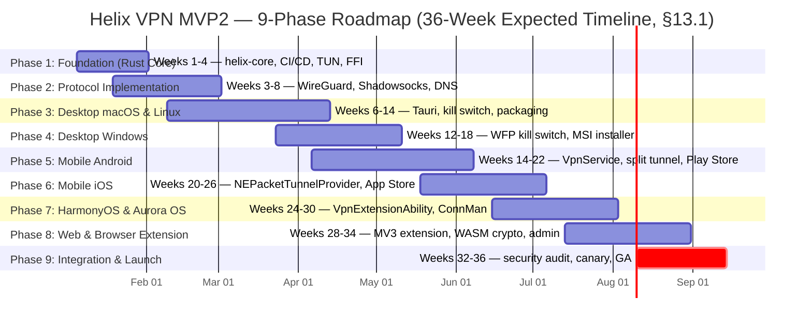

# Helix VPN — MVP2 Implementation Roadmap

**Revision:** 2
**Last modified:** 2026-07-04T14:00:00Z

**Revision 2 changelog:** Hardening pass — added per-phase Test Plan cross-references
(citing `MVP2_SECURITY_PERFORMANCE.md` §8 Testing Strategy and `MVP2_OVERVIEW.md` §9
SC-xx success criteria IDs) to every phase's Exit Criteria; added the four
previously-absent cross-cutting production-readiness milestones (staged/canary
rollout rehearsal, MDM/managed-policy validation, consent-gated crash/telemetry
pipeline, reproducible-build + SBOM generation) with owners and exit criteria across
Phase 1 (foundational tooling) and Phase 9 (validation + go-live execution); added
`apply_managed_policy()` to the `PlatformAdapter` trait and per-platform managed-policy
hook tasks in Phases 3/4/5/6/8; reconciled the connection-lifecycle state machine in
Phase 1 Week 2 to the canonical `MVP2_ARCHITECTURE.md` §5.6 state set; corrected two
"build a design system from scratch" tasks (Phase 3 Week 11, Phase 5 Week 14) to
instead consume the existing OpenDesign token system; added a Mermaid `gantt` phase
timeline to §1. No phase week-numbers or §13 Risk-Adjusted Timeline figures were
changed — those remain the corpus-wide anchor.

## Cross-Platform Development Plan: 36-Week Phased Delivery

**Version**: 1.0  
**Date**: 2026-01-21  
**Status**: Approved for Implementation  
**Derived From**: `MVP2_ARCHITECTURE.md`, `MVP2_SHARED_CORE.md`  
**Audience**: Engineering Leads, Product Management, DevOps, QA, Executive Stakeholders  
**Classification**: Internal — Engineering Confidential

---

## Table of Contents

1. [Roadmap Overview](#1-roadmap-overview)
2. [Phase 1: Foundation — Rust Core Library (Weeks 1-4)](#2-phase-1-foundation--rust-core-library-weeks-1-4)
3. [Phase 2: Protocol Implementation (Weeks 3-8)](#3-phase-2-protocol-implementation-weeks-3-8)
4. [Phase 3: Desktop Clients — macOS & Linux (Weeks 6-14)](#4-phase-3-desktop-clients--macos--linux-weeks-6-14)
5. [Phase 4: Desktop Client — Windows (Weeks 12-18)](#5-phase-4-desktop-client--windows-weeks-12-18)
6. [Phase 5: Mobile — Android (Weeks 14-22)](#6-phase-5-mobile--android-weeks-14-22)
7. [Phase 6: Mobile — iOS (Weeks 20-26)](#7-phase-6-mobile--ios-weeks-20-26)
8. [Phase 7: HarmonyOS & Aurora OS (Weeks 24-30)](#8-phase-7-harmonyos--aurora-os-weeks-24-30)
9. [Phase 8: Web & Browser Extension (Weeks 28-34)](#9-phase-8-web--browser-extension-weeks-28-34)
10. [Phase 9: Integration & Launch (Weeks 32-36)](#10-phase-9-integration--launch-weeks-32-36)
11. [Team Structure Recommendations](#11-team-structure-recommendations)
12. [Milestone Summary](#12-milestone-summary)
13. [Risk-Adjusted Timeline](#13-risk-adjusted-timeline)
14. [Appendices](#14-appendices)

---

## 1. Roadmap Overview

### 1.1 Executive Summary

This roadmap translates the MVP2 architecture and shared core specifications into a concrete, phased execution plan spanning **36 weeks (9 months)** of active development. The plan delivers Helix VPN across **eight target platforms** organized into four priority tiers, with explicit dependency management, resource allocation, and exit criteria for each phase.

The roadmap is designed with **strategic phase overlap** to maximize parallel development and minimize calendar time. The shared Rust core (`helix-core`) serves as the critical path foundation — all other phases branch from its completion.

### 1.2 Total Timeline Summary

```
WEEK:  1  2  3  4  5  6  7  8  9  10 11 12 13 14 15 16 17 18 19 20 21 22 23 24 25 26 27 28 29 30 31 32 33 34 35 36
       |--PHASE 1--|
       |-----PHASE 2-----|
                |--------PHASE 3--------|
                            |-----PHASE 4-----|
                                     |--------PHASE 5--------|
                                              |-----PHASE 6-----|
                                                       |-----PHASE 7-----|
                                                                |-----PHASE 8-----|
                                                                             |--PHASE 9-|
```

**Total Duration**: 36 weeks  
**Parallel Workstreams**: 2-3 at peak (Weeks 14-28)  
**Critical Path**: Phase 1 → Phase 2 → Phase 3 → Phase 5 → Phase 6 → Phase 9  
**Buffer Weeks**: 2 weeks (Weeks 35-36 serve as contingency)

### 1.3 Phase Dependency Graph

```
                         ┌─────────────────────────────────────────────────────────────┐
                         │                    DEPENDENCY GRAPH                         │
                         └─────────────────────────────────────────────────────────────┘

 Phase 1: Foundation ──────┬──► Phase 3: Desktop macOS/Linux ──────┐
 (Weeks 1-4)               │    (Weeks 6-14)                       │
                           │                                       │
                           ├──► Phase 2: Protocols ────────────────┤
                           │    (Weeks 3-8)                        │
                           │                                       │
                           │         └─────────────────────────────┼──► Phase 4: Windows
                           │                                       │    (Weeks 12-18)
                           │         ┌─────────────────────────────┤
                           │         │                             │
                           │         ▼                             │
                           │    Phase 5: Android ──────────────────┤
                           │    (Weeks 14-22)                      │
                           │         │                             │
                           │         ▼                             │
                           │    Phase 6: iOS ──────────────────────┤
                           │    (Weeks 20-26)                      │
                           │         │                             │
                           │         ▼                             │
                           │    Phase 7: HarmonyOS/Aurora ─────────┤
                           │    (Weeks 24-30)                      │
                           │         │                             │
                           │         ▼                             │
                           │    Phase 8: Web/Browser ──────────────┤
                           │    (Weeks 28-34)                      │
                           │         │                             │
                           │         ▼                             │
                           └────► Phase 9: Integration & Launch ◄──┘
                                     (Weeks 32-36)
```

**Key Dependency Rules:**
- Phases 3-8 all depend on Phase 1 (core library) completing at least the API surface
- Phase 2 (protocols) must complete WireGuard before Phase 3 desktop integration testing
- Phase 4 (Windows) can begin UI work before Phase 3 completes, but needs Phase 3 UI patterns
- Phase 5 (Android) and Phase 6 (iOS) share the Flutter mobile codebase — iOS trails Android by 6 weeks
- Phase 7 (HarmonyOS/Aurora) leverages mobile patterns from Phase 5-6
- Phase 8 (Web) has the loosest coupling — primarily depends on core crypto WASM builds
- Phase 9 (Integration) requires at least one client from each tier to be feature-complete

### 1.4 Platform Delivery Order

```
Priority Tier    Platform          Target Week   Entry Criteria
─────────────────────────────────────────────────────────────────────────
Tier 1 (P0)      macOS             Week 10       Desktop Alpha milestone
Tier 1 (P0)      Linux             Week 12       Desktop Alpha milestone
Tier 1 (P0)      Windows           Week 16       Desktop Beta milestone
Tier 1 (P0)      Android           Week 20       Mobile Alpha milestone
Tier 2 (P1)      iOS               Week 24       Mobile Beta milestone
Tier 2 (P1)      HarmonyOS         Week 28       Extended Platforms milestone
Tier 3 (P2)      Aurora OS         Week 28       Extended Platforms milestone
Tier 4 (P3)      Web/Browser       Week 32       Web Complete milestone
─────────────────────────────────────────────────────────────────────────
All Platforms    Production        Week 36       Launch Ready milestone
```

### 1.5 Code Reuse Targets by Phase

| Phase | Code Being Written | Estimated Reuse % | Lines of Code (est.) |
|-------|-------------------|-------------------|---------------------|
| Phase 1 | Core library, abstractions | 100% (foundation) | 8,000 |
| Phase 2 | WireGuard, Shadowsocks, DNS | 100% (foundation) | 6,000 |
| Phase 3 | macOS/Linux desktop UI + adapters | 85% core reuse | 4,000 |
| Phase 4 | Windows desktop UI + adapters | 80% core reuse | 3,500 |
| Phase 5 | Android mobile UI + adapters | 72% core reuse | 5,000 |
| Phase 6 | iOS mobile UI + adapters | 72% core reuse | 3,000 |
| Phase 7 | HarmonyOS/Aurora adaptations | 70-75% core reuse | 4,500 |
| Phase 8 | Browser extension, WASM, admin | 45% core reuse | 5,000 |
| Phase 9 | Integration, testing, docs | N/A | 3,000 |
| **TOTAL** | | **~78% weighted avg** | **~42,000** |

### 1.6 Phase Timeline (Mermaid Gantt)

The ASCII summary in §1.2 and the dependency graph in §1.3 are the normative
week-range source; the chart below is a rendering of the same 9 phases against
the 36-week **expected** timeline (§13.1) for tooling that renders Mermaid.
Dates are illustrative placeholders anchored to a nominal "Week 1 = Monday"
project start — only the **week ranges** (identical to each phase's own
heading) are authoritative, not the calendar dates themselves, which are
fixed at project kickoff.



---

## 2. Phase 1: Foundation — Rust Core Library (Weeks 1-4)

### 2.1 Phase Overview

| Attribute | Value |
|-----------|-------|
| **Duration** | 4 weeks |
| **Team** | 2 Rust Core Engineers + 1 DevOps |
| **Depends On** | None (first phase) |
| **Blocks** | All subsequent phases |
| **Goal** | Production-grade Rust core library with CI/CD, basic TUN, and extensible abstractions |

### 2.2 Week-by-Week Breakdown

#### Week 1: Project Structure & CI/CD Pipeline

**Tasks:**
- [ ] Initialize Git repository with branch protection rules (`main`, `develop`, `release/*`)
- [ ] Create Cargo workspace structure per architecture spec:
  ```
  helix-core/
  ├── Cargo.toml                     # Workspace manifest
  ├── crates/
  │   ├── helix-core-api/            # Public FFI API surface
  │   ├── helix-vpn-engine/          # Generic tunnel management
  │   ├── helix-wireguard/           # WireGuard protocol (placeholder)
  │   ├── helix-crypto/              # Encryption primitives wrapper
  │   ├── helix-network/             # HTTP client, latency testing
  │   └── helix-platform-abstraction/# OS adapter trait definitions
  ├── bindings/
  │   ├── uniffi/                    # UniFFI UDL definitions
  │   └── wasm/                      # WASM target config
  ├── tests/
  │   ├── integration/               # Cross-platform integration tests
  │   └── fuzz/                      # Crypto fuzzing targets
  └── .github/workflows/             # CI/CD pipeline definitions
  ```
- [ ] Set up GitHub Actions CI pipeline with matrix builds:
    - Linux x64 (Tier 1) — `ubuntu-latest`
    - Linux ARM64 (Tier 1) — `ubuntu-latest` + cross
    - macOS x64 + ARM64 (Tier 2) — `macos-latest`
    - Windows x64 (Tier 1) — `windows-latest`
    - WASM (Tier 2) — `ubuntu-latest` + wasm-pack
  - CI stages: `fmt` → `clippy` → `test` → `build` → `doc`
- [ ] Configure cross-compilation toolchain (`cross-rs`, `cargo-ndk`)
- [ ] Set up `dependabot` for automated dependency updates
- [ ] Configure `cargo-deny` for license and security auditing
- [ ] Set up code coverage with `tarpaulin` + Codecov integration
- [ ] Define `rustfmt.toml` and enforce formatting in CI
- [ ] **Production-readiness foundation — reproducible builds + SBOM** (lands
  here, not bolted on post-launch, because every subsequent phase's CI job
  inherits this pipeline stage; cross-ref `MVP2_SHARED_CORE.md` §5.5
  Supply-Chain & Build Integrity + `MVP2_ARCHITECTURE.md` §10.3):
  - Pin toolchain via `rust-toolchain.toml`; build with `cargo build --locked`
    against a committed `Cargo.lock` so every artifact is bit-for-bit
    reproducible from the same commit
  - Add `cargo-cyclonedx` (or `syft`) as a CI stage generating a CycloneDX
    SBOM for every cross-compiled artifact, published as a build artifact
  - Owner: DevOps/CI Engineer

**Deliverables:**
- Repository initialized with full CI/CD pipeline
- Matrix builds passing for Tier 1 targets (Linux x64, Windows x64)
- Developer onboarding documentation (`CONTRIBUTING.md`, `BUILD.md`)
- Reproducible-build configuration (pinned toolchain + locked lockfile) and a
  working SBOM-generation CI stage, both proven against a sample build

**Exit Criteria:**
- CI pipeline green on all Tier 1 targets
- `cargo build` succeeds for workspace
- `cargo test` passes with 100% compilation
- A sample CI build produces an identical binary hash on two independent runs
  (reproducibility proof) and an attached SBOM artifact (`MVP2_SHARED_CORE.md`
  §5.5); this is the foundation the Phase 9 Week 33/36 SBOM gate re-verifies
  against the actual release artifacts — see §10.2

---

#### Week 2: Core Abstractions & Trait Definitions

**Tasks:**
- [ ] Implement `TunnelDevice` trait (TUN interface abstraction):
  ```rust
  #[async_trait]
  pub trait TunnelDevice: Send + Sync {
      async fn read_packet(&self, buf: &mut [u8]) -> Result<usize>;
      async fn write_packet(&self, packet: &[u8]) -> Result<()>;
      fn set_mtu(&self, mtu: u16) -> Result<()>;
      fn get_interface_name(&self) -> String;
  }
  ```
- [ ] Implement `PlatformAdapter` trait (OS-specific VPN lifecycle):
  ```rust
  #[async_trait]
  pub trait PlatformAdapter: Send + Sync {
      async fn setup_tunnel(&self, config: &TunnelConfig) -> Result<Box<dyn TunnelDevice>>;
      async fn protect_socket(&self, socket: RawFd) -> Result<()>;
      async fn configure_routes(&self, routes: &[Route]) -> Result<()>;
      async fn configure_dns(&self, servers: &[IpAddr]) -> Result<()>;
      async fn enable_kill_switch(&self) -> Result<()>;
      async fn disable_kill_switch(&self) -> Result<()>;
      async fn set_split_tunnel_apps(&self, allowed: &[String], blocked: &[String]) -> Result<()>;
      async fn get_default_interface(&self) -> Result<NetworkInterface>;
      async fn on_network_change(&self, callback: NetworkChangeCallback) -> Result<()>;
      async fn apply_managed_policy(&self, policy: &ManagedPolicy) -> Result<()>;
  }
  ```
  - `apply_managed_policy()` is the enterprise-fleet extension point:
    `helix-admin` pushes org-scoped policy (allowed protocols, forced kill
    switch, forced split-tunnel rules, DNS policy) via the MVP1 Admin API,
    and each platform's native MDM/managed-config channel invokes this method
    (cross-ref `MVP2_ARCHITECTURE.md` §10.2). Per-platform implementations
    land in Phases 3-6/8 (macOS Configuration Profile / Windows Group
    Policy+Intune / Android Enterprise AppConfig / Apple MDM managed app
    config / Chrome `ExtensionSettings`); end-to-end validation against real
    MDM channels happens in Phase 9 §10.2 Week 32
- [ ] Implement `ProtocolDriver` trait (protocol-agnostic interface):
  ```rust
  #[async_trait]
  pub trait ProtocolDriver: Send + Sync {
      async fn handshake(&self, endpoint: SocketAddr, port: u16) -> Result<TunnelParams>;
      async fn start_io(&self, tun_tx: mpsc::Sender<Bytes>, net_rx: mpsc::Receiver<Bytes>, mtu: u16) -> Result<()>;
      async fn shutdown(&self) -> Result<()>;
  }
  ```
- [ ] Implement `Firewall` trait (kill switch abstraction):
  ```rust
  #[async_trait]
  pub trait Firewall: Send + Sync {
      async fn enable_kill_switch(&self) -> Result<()>;
      async fn disable_kill_switch(&self) -> Result<()>;
      async fn allow_endpoint(&self, address: SocketAddr) -> Result<()>;
      async fn block_ipv6(&self) -> Result<()>;
      async fn enforce_dns(&self, dns_servers: &[String]) -> Result<()>;
  }
  ```
- [ ] Define `ConnectionStateMachine` with validated transitions, matching the
  canonical state set in `MVP2_ARCHITECTURE.md` §5.6 (extended from an earlier,
  thinner draft to include reconnect and kill-switch-active states):
  - `Disconnected → Connecting → Connected → Reconnecting → KillSwitchActive → Disconnecting → Disconnected`
  - Plus the terminal/error state `ConnectionFailed`, reachable from
    `Connecting`, `Connected`, and `Reconnecting`
  - `ConnectionFailed → Disconnected | Connecting` (retry)
  - `Reconnecting → Connected` (recovery) or `Reconnecting → KillSwitchActive`
    (recovery exhausted, kill switch engages per configured policy)
- [ ] Implement error hierarchy (`HelixError` enum with `thiserror`):
  - `ConfigParse`, `ConnectionFailed`, `AuthenticationFailed`, `Timeout`, `StateTransition`, `CryptoError`, `PlatformError`, `NetworkError`
- [ ] Set up structured logging with `tracing` + `tracing-subscriber`
- [ ] Implement `SecureStorage` trait (keychain/keystore abstraction)

**Deliverables:**
- All core traits defined and documented with rustdoc
- Unit tests for state machine transition validation
- Mock implementations of all traits for testing

**Exit Criteria:**
- 100% trait compilation across all targets
- State machine unit tests passing
- Documentation coverage > 80%

---

#### Week 3: Basic TUN Interface (Linux & macOS)

**Tasks:**
- [ ] Implement Linux TUN adapter using `tun-rs` crate:
  - Create TUN device via `/dev/net/tun` ioctl
  - Configure IP address and MTU via netlink
  - Set blocking/async I/O modes
  - Implement `read_packet()` / `write_packet()` with zero-copy where possible
- [ ] Implement macOS TUN adapter using `utun` kernel interface:
  - Create `utun` interface via `PF_SYSTEM` socket domain
  - Configure with `ifconfig` / `ioctl` calls
  - Handle macOS-specific `utun` header stripping
- [ ] Implement basic Linux routing via `rtnetlink`:
  - Add default route through TUN interface
  - Preserve existing routes for VPN server endpoint
  - Route restoration on disconnect
- [ ] Implement basic macOS routing via `route` command + `sysctl`:
  - Add route to VPN server via primary interface
  - Redirect default route to `utun` interface
- [ ] Create mock TUN device for unit testing (no root required)
- [ ] Write integration test: create TUN → write packet → read packet → destroy TUN

**Deliverables:**
- Working TUN implementation on Linux and macOS
- Routing configuration for full-tunnel mode
- Integration test suite for TUN lifecycle

**Exit Criteria:**
- Integration test passes on Linux (Ubuntu 22.04+)
- Integration test passes on macOS (12+)
- No memory leaks (verified with `valgrind` / `leaks`)

---

#### Week 4: FFI Layer & Public API Surface

**Tasks:**
- [ ] Implement C FFI layer (`src/platform/ffi.rs`):
  - `helix_init()` — initialize engine with JSON config
  - `helix_connect()` — establish VPN connection
  - `helix_disconnect()` — disconnect VPN
  - `helix_get_state()` — query connection state
  - `helix_free()` / `helix_free_string()` — memory management
  - `helix_last_error()` — error retrieval
  - Thread-safe static Tokio runtime with `LazyLock<Runtime>`
  - Panic catching with `catch_unwind`
- [ ] Set up UniFFI scaffolding:
  - Create `helix_core.udl` interface definition
  - Configure `uniffi.toml` for Kotlin and Swift output
  - Generate initial bindings (manual verification)
- [ ] Set up `flutter_rust_bridge` scaffolding:
  - Create bridge module with `#[frb]` annotations
  - Implement `init_app()` and basic async commands
- [ ] Configure `cbindgen.toml` for C header generation (Aurora OS)
- [ ] Implement `HelixVpnApi` public API struct:
  - `new(config: VpnConfig) -> Result<Self>`
  - `connect() -> Result<ConnectionStatus>`
  - `disconnect() -> Result<ConnectionStatus>`
  - `status() -> ConnectionStatus`
  - `subscribe_events() -> broadcast::Receiver<EngineEvent>`
  - `stats() -> ConnectionStats`
- [ ] Write FFI integration tests:
  - C FFI round-trip test (init → connect → disconnect → free)
  - UniFFI binding compilation test
  - FRB bridge smoke test

**Deliverables:**
- Complete FFI layer with C ABI stability
- UniFFI UDL definitions for Kotlin (Android) and Swift (iOS)
- FRB bridge module for Flutter integration
- API documentation for all public functions

**Exit Criteria:**
- C FFI test passes (memory-safe, no leaks)
- UniFFI bindings compile for Kotlin and Swift
- FRB bridge generates valid Dart bindings
- All public APIs documented

---

### 2.3 Phase 1 Deliverables Summary

| Deliverable | Description | Owner |
|-------------|-------------|-------|
| `helix-core` workspace | Full Cargo workspace with 6 crates | Rust Core Lead |
| CI/CD pipeline | GitHub Actions with matrix builds | DevOps |
| Core traits | TunnelDevice, PlatformAdapter, ProtocolDriver, Firewall | Rust Core Lead |
| TUN implementation | Linux + macOS TUN with routing | Rust Core Engineer |
| FFI layer | C ABI, UniFFI, FRB scaffolding | Rust Core Engineer |
| Public API | HelixVpnApi with full documentation | Rust Core Lead |
| Test suite | Unit + integration tests, >70% coverage | Both |
| Supply-chain tooling | Pinned toolchain, `cargo-cyclonedx`/`syft` SBOM CI stage | DevOps |

### 2.4 Phase 1 Exit Criteria

- [x] All Tier 1 CI targets building successfully
- [x] Core traits implemented and documented (incl. `apply_managed_policy()`
  on `PlatformAdapter` and the canonical `ConnectionStateMachine` per
  `MVP2_ARCHITECTURE.md` §5.6)
- [x] TUN interface working on Linux and macOS
- [x] FFI layer complete with passing tests
- [x] API documentation coverage > 80%
- [x] Code review complete for all PRs
- [x] No open security warnings from `cargo-audit`
- [x] Reproducible build + SBOM generation wired into CI and proven against a
  sample artifact (foundation for the Phase 9 release-gate re-check)

**Test Plan (cross-reference — do not re-derive a framework here):** Unit
tests per `MVP2_SECURITY_PERFORMANCE.md` §8.1 (Rust core unit coverage) +
§8.7 (CI test matrix); relevant success criteria: SC-11 (code reuse), SC-21
(zero critical/high CVEs — `cargo-audit`), SC-22 (zero memory-safety
warnings), SC-27 (>= 85% core unit-test line coverage) per `MVP2_OVERVIEW.md`
§9.

---

## 3. Phase 2: Protocol Implementation (Weeks 3-8)

### 3.1 Phase Overview

| Attribute | Value |
|-----------|-------|
| **Duration** | 6 weeks (overlaps with Phase 1 from Week 3) |
| **Team** | 2 Rust Core Engineers |
| **Depends On** | Phase 1 traits and abstractions (Week 2+) |
| **Blocks** | Phase 3 (desktop integration testing), Phase 5 (Android) |
| **Goal** | Production-grade WireGuard protocol, Shadowsocks, DNS resolver, and protocol negotiation |

### 3.2 Week-by-Week Breakdown

#### Week 3 (Overlap): Crypto Primitives Foundation

**Tasks:**
- [ ] Implement `helix-crypto` crate:
  - X25519 keypair generation and shared secret derivation (`x25519-dalek`)
  - ChaCha20-Poly1305 AEAD encryption/decryption (`chacha20poly1305`)
  - Blake2s keyed hashing for WireGuard
  - HKDF key derivation
  - `SecretKey` type with `ZeroizeOnDrop` for automatic key wiping
- [ ] Implement `KeyManager` for key lifecycle:
  - Generate static keypairs
  - Derive ephemeral keys for handshakes
  - Session key rotation
  - Secure key storage interface (delegates to platform)
- [ ] Write crypto unit tests:
  - X25519 key exchange correctness (known-answer tests)
  - ChaCha20-Poly1305 encryption/decryption round-trip
  - Blake2s test vectors
  - Key zeroization verification
- [ ] Set up crypto fuzzing targets with `cargo-fuzz`:
  - ChaCha20-Poly1305 decryption fuzzing
  - X25519 public key validation fuzzing

**Deliverables:**
- `helix-crypto` crate with full test coverage
- Fuzzing targets configured and running
- Crypto benchmark suite (baseline for performance regression)

---

#### Week 4 (Overlap): WireGuard Protocol — Handshake

**Tasks:**
- [ ] Integrate `boringtun` crate as WireGuard base:
  - Fork or vendor `boringtun` for customization control
  - Integrate `boringtun::noise::Tunn` for per-peer tunnel state
  - Configure rate limiter for DoS protection
- [ ] Implement Noise Protocol handshake (IK pattern):
  - `format_handshake_initiation()` — create initiation message
  - Handle handshake response with retry logic (5 retries, 5s interval)
  - Derive session keys from handshake
  - Cookie mechanism for IP obfuscation (anti-DoS)
- [ ] Implement handshake state machine:
  - `Idle → InitiationSent → ResponseReceived → Established`
  - Timeout handling and retry logic
  - Rekey after 120s or on demand
- [ ] Write handshake tests:
  - Successful handshake against test server
  - Timeout and retry behavior
  - Invalid response rejection
  - Rekey trigger verification

**Deliverables:**
- WireGuard handshake implementation
- Handshake integration tests
- Performance benchmark: handshake < 500ms on reference hardware

---

#### Week 5: WireGuard Protocol — Transport & Timers

**Tasks:**
- [ ] Implement packet encapsulation/decapsulation:
  - `encapsulate()` — encrypt IP packet with ChaCha20-Poly1305, prepend WG header
  - `decapsulate()` — parse WG header, decrypt payload, validate MAC
  - Handle IPv4 and IPv6 packets
- [ ] Implement keepalive timer system:
  - 25s persistent keepalive interval
  - Rekey after time: 120s
  - Rekey attempt time: 90s
  - Rekey timeout: 5s
- [ ] Implement packet counter and replay protection:
  - 64-bit sender/receiver nonces
  - Sliding window for replay detection
  - Counter persistence across reconnects
- [ ] Implement transport I/O loop:
  - Async UDP socket send/receive via `tokio::net::UdpSocket`
  - `bytes::Bytes` for zero-copy buffer management
  - Channel-based communication with TUN layer
- [ ] Write transport stress tests:
  - 1000 packets/second sustained throughput
  - Packet loss simulation and recovery
  - Rekey during active traffic

**Deliverables:**
- Full WireGuard transport layer
- Timer system with passing tests
- Transport performance benchmarks

---

#### Week 6: Shadowsocks Protocol (SIP022 AEAD-2022)

**Tasks:**
- [ ] Implement Shadowsocks protocol driver:
  - SIP022 AEAD-2022 cipher support:
    - `2022-blake3-aes-256-gcm`
    - `2022-blake3-chacha20-poly1305`
  - Session-based key derivation with BLAKE3
  - Full replay protection with 64-bit unique session IDs
  - TCP: length-chunk-payload-chunk model
  - UDP: separate header encryption + AEAD body
- [ ] Implement `ShadowsocksDriver` struct implementing `ProtocolDriver`:
  - `handshake()` — derive session keys, establish connection
  - `start_io()` — relay encrypted traffic
  - `shutdown()` — cleanup sessions
- [ ] Write Shadowsocks tests:
  - Connection to test Shadowsocks server
  - Encryption/decryption correctness
  - Session key rotation

**Deliverables:**
- Shadowsocks protocol driver
- SIP022 AEAD-2022 cipher support
- Integration tests against test server

---

#### Week 7: DNS Resolver (DoH/DoT)

**Tasks:**
- [ ] Implement `DnsResolver` supporting multiple methods:
  - Plaintext UDP/53 (fallback)
  - DNS-over-TLS (DoT) via `rustls`
  - DNS-over-HTTPS (DoH) via `hickory-resolver`
  - DNS-over-HTTP/3 (DoH3) via QUIC (future)
- [ ] Implement DNS caching layer:
  - TTL-aware cache with eviction
  - Prefetch for frequently queried domains
  - Cache poisoning detection
- [ ] Implement DNS leak prevention:
  - Force all DNS through VPN tunnel
  - Block non-VPN DNS queries when connected
  - Per-platform DNS configuration
- [ ] Write DNS resolver tests:
  - Resolution correctness for all methods
  - Cache hit/miss behavior
  - Timeout and fallback behavior
  - DNS leak prevention verification

**Deliverables:**
- Multi-method DNS resolver
- DNS caching with leak prevention
- DNS test suite

---

#### Week 8: Protocol Negotiation & Selection

**Tasks:**
- [ ] Implement protocol negotiation system:
  - Server capability advertisement (REST API)
  - Client-side protocol preference ranking
  - Automatic fallback on connection failure
  - Latency-based protocol selection
- [ ] Implement `ProtocolSelector`:
  - `select_best_protocol(server_list, preferences) -> ProtocolConfig`
  - Parallel latency testing across protocols
  - Obfuscation auto-detection (censorship evasion)
- [ ] Implement multi-hop chaining (MVP2 stretch goal):
  - Entry-exit node separation
  - Double encapsulation (WireGuard over WireGuard)
  - Entry node routing configuration
- [ ] Write protocol negotiation tests:
  - Fallback behavior simulation
  - Latency measurement accuracy
  - Multi-hop connection chain

**Deliverables:**
- Protocol negotiation and selection system
- Multi-hop chaining support
- Protocol selection benchmarks

---

### 3.3 Phase 2 Deliverables Summary

| Deliverable | Description | Test Coverage |
|-------------|-------------|---------------|
| `helix-crypto` | X25519, ChaCha20-Poly1305, Blake2s, HKDF | > 90% |
| `helix-wireguard` | Full WireGuard protocol (boringtun-based) | > 85% |
| `helix-shadowsocks` | SIP022 AEAD-2022 Shadowsocks | > 80% |
| `helix-dns` | DoH/DoT resolver with caching | > 85% |
| Protocol negotiation | Auto-selection with fallback | > 75% |
| Fuzzing corpus | Running 24/7 on CI | N/A |

### 3.4 Phase 2 Exit Criteria

- [x] WireGuard handshake completes in < 500ms (p99)
- [x] WireGuard transport sustains 1000 packets/second
- [x] Shadowsocks connects and encrypts correctly
- [x] DNS resolver passes all method tests
- [x] Protocol negotiation fallback works end-to-end
- [x] All crypto fuzzing targets running without crashes
- [x] No open security warnings from `cargo-audit`

**Test Plan (cross-reference):** Unit + property-based crypto tests per
`MVP2_SECURITY_PERFORMANCE.md` §8.1; integration/connection tests per §8.2;
performance tests (handshake latency, throughput) per §8.4; relevant success
criteria: SC-02 (WireGuard handshake success rate, 1,000-connection stress
test), SC-03 (Shadowsocks obfuscation vs. simulated DPI), SC-13 (connection
time), SC-15 (throughput >= 500 Mbps desktop reference), SC-21/SC-22 (security/
memory-safety) per `MVP2_OVERVIEW.md` §9.

---

## 4. Phase 3: Desktop Clients — macOS & Linux (Weeks 6-14)

### 4.1 Phase Overview

| Attribute | Value |
|-----------|-------|
| **Duration** | 9 weeks (overlaps with Phase 2 from Week 6) |
| **Team** | 2 Desktop Developers + 1 UI/UX Designer |
| **Depends On** | Phase 1 (core API), Phase 2 WireGuard (Week 4+) |
| **Blocks** | Phase 4 (Windows builds on macOS/Linux patterns) |
| **Goal** | Fully functional macOS and Linux desktop clients with kill switch |

### 4.2 Week-by-Week Breakdown

#### Week 6: Tauri v2 Desktop App Scaffold

**Tasks:**
- [ ] Initialize Tauri v2 project:
  ```
  helix-desktop/
  ├── src-tauri/               # Rust backend
  │   ├── Cargo.toml
  │   ├── tauri.conf.json
  │   ├── src/
  │   │   ├── main.rs          # Entry point
  │   │   ├── commands.rs      # Tauri commands (connect, disconnect, etc.)
  │   │   ├── state.rs         # Application state management
  │   │   └── core_bridge.rs   # helix-core integration
  │   └── capabilities/        # Tauri capability definitions
  ├── src/                     # React frontend
  │   ├── components/          # UI components
  │   ├── pages/               # Route pages
  │   ├── store/               # State management (Zustand)
  │   └── styles/              # CSS/Tailwind
  └── package.json
  ```
- [ ] Configure Tauri v2 with capability-based security:
  - Define `default` capability with minimum permissions
  - Add `shell:allow-execute` for route/firewall commands
  - Scope permissions to specific binaries and paths
- [ ] Implement core Tauri commands:
  - `vpn_connect(server_id, protocol)`
  - `vpn_disconnect()`
  - `get_connection_state()`
  - `get_server_list()`
  - `get_stats()`
- [ ] Set up frontend scaffold:
  - React 19 + TypeScript + Vite
  - Tailwind CSS for styling
  - Zustand for state management
  - React Query for server data fetching

**Deliverables:**
- Tauri app compiles and launches on macOS and Linux
- Basic "Connect/Disconnect" button functional (mock core)
- UI renders correctly in system WebView

---

#### Week 7: macOS NetworkExtension Integration

**Tasks:**
- [ ] Create macOS Network Extension target:
  - `HelixPacketTunnel` — `NEPacketTunnelProvider` subclass
  - System Extension packaging (`.systemext` bundle)
  - Embed `helix-core` as XCFramework in extension
- [ ] Implement `PacketTunnelProvider`:
  - `startTunnel(options:completionHandler:)` — init core, create TUN
  - `stopTunnel(with:completionHandler:)` — cleanup, remove routes
  - Handle IPC from main app via `NETunnelProviderSession`
- [ ] Create Privileged Helper Tool (`com.helixvpn.helper`):
  - XPC service for privileged operations (firewall, routes)
  - Signed with same Team ID as main app
  - `SMJobBless` installation on first launch
- [ ] Configure entitlements:
  - `com.apple.developer.networking.networkextension`
  - `com.apple.developer.system-extension.install`
  - App Sandbox with network-outgoing
- [ ] Write macOS-specific `PlatformAdapter` implementation:
  - TUN via `NEPacketTunnelProvider.packetFlow`
  - Routes via `NEPacketTunnelProvider.setTunnelNetworkSettings()`
  - DNS via `NETunnelNetworkSettings.DNSSettings`
  - `apply_managed_policy()` — parse macOS Configuration Profile (`.mobileconfig`)
    managed-preference keys pushed by `helix-admin` (forced kill switch,
    allowed protocols, DNS policy); cross-ref `MVP2_ARCHITECTURE.md` §10.2.
    End-to-end validation against a real MDM channel happens in Phase 9
    §10.2 Week 32

**Deliverables:**
- macOS Network Extension building
- Privileged helper tool with XPC communication
- TUN working through NEPacketTunnelProvider

---

#### Week 8: macOS Kill Switch (PF) & Menu Bar

**Tasks:**
- [ ] Implement macOS kill switch using Packet Filter (PF):
  - Create PF anchor `com.helixvpn` for rule isolation
  - Block all outbound traffic except VPN tunnel interface (`utun*`)
  - Allow DHCP and VPN server endpoint
  - Restore rules on disconnect
  - Handle BFE (Base Filtering Engine) restart
- [ ] Implement menu bar extra:
  - `NSStatusItem` with VPN status icon
  - Quick connect/disconnect from menu
  - Server selection dropdown
  - "Open Helix VPN" menu item
- [ ] Implement keyboard shortcuts:
  - `Cmd+Shift+C` — Connect/Disconnect toggle
  - `Cmd+Shift+K` — Kill switch toggle
- [ ] Auto-launch on login:
  - `SMLoginItemSetEnabled` for helper
  - User preference persistence
- [ ] macOS-specific UI polish:
  - Native window chrome (title bar, traffic lights)
  - Dark mode support (follows system preference)
  - Notification Center integration for connection events

**Deliverables:**
- Kill switch functional on macOS (verified with leak test)
- Menu bar extra with full functionality
- Auto-launch and keyboard shortcuts

---

#### Week 9: Linux TUN + NetworkManager Integration

**Tasks:**
- [ ] Implement Linux `PlatformAdapter`:
  - TUN via `tun-rs` (already from Phase 1)
  - Routing via `rtnetlink` crate (add/delete routes)
  - DNS via D-Bus → `systemd-resolved` or `NetworkManager`
  - Detect which DNS manager is active
  - `apply_managed_policy()` — parse a self-hosted managed-config file drop
    (JSON/TOML watched via `inotify`) as the Linux equivalent of a
    Configuration Profile, since Linux has no single vendor-neutral MDM
    standard; cross-ref `MVP2_ARCHITECTURE.md` §10.2
- [ ] Integrate with NetworkManager:
  - Create VPN connection profile via D-Bus (`AddConnection`)
  - Activate/deactivate via `NetworkManager` API
  - Handle NM state change signals
  - Graceful fallback to manual config if NM unavailable
- [ ] Implement manual route management (fallback):
  - `ip route` command execution for routing
  - `/etc/resolv.conf` manipulation for DNS (with backup)
  - Route table cleanup on disconnect
- [ ] Linux system tray via `libappindicator`:
  - Status icon showing VPN state
  - Menu with connect/disconnect, server list, quit

**Deliverables:**
- Linux VPN working with NetworkManager
- Fallback manual mode functional
- System tray integration

---

#### Week 10: Linux Kill Switch (nftables) & Packaging

**Tasks:**
- [ ] Implement Linux kill switch using nftables:
  - Create nftables table `inet helix_vpn`
  - Chain `output` with policy drop
  - Rules: accept on `oifname "tun0"`, accept to VPN server, accept DHCP
  - IPv6 leak prevention (drop all IPv6 outbound)
  - Graceful cleanup on disconnect (flush table)
- [ ] Fallback to iptables for legacy systems:
  - `iptables -P OUTPUT DROP` + accept rules
  - `ip6tables -P OUTPUT DROP` for IPv6
- [ ] Package for distribution:
  - **DEB** (Ubuntu 22.04+, Debian 12+): `dpkg-deb` build
  - **RPM** (Fedora 39+, openSUSE): `rpmbuild` spec
  - **Flatpak**: Flatpak manifest with freedesktop runtime
  - **AppImage**: `appimage-builder` for universal Linux
- [ ] Create `.desktop` file and app metadata
- [ ] Implement OTA auto-update:
  - Check for updates on launch (configurable)
  - Download + signature verification
  - Install with `pkexec` for privilege escalation

**Deliverables:**
- Kill switch on Linux (nftables + iptables fallback)
- DEB, RPM, Flatpak, AppImage packages
- OTA update mechanism

**Milestone: M2 — Desktop Alpha (macOS + Linux)**

---

#### Week 11: Core UI Implementation — Shared Desktop UI

**Tasks:**
- [ ] Implement main UI layout (shared macOS/Linux):
  - Connection screen (large connect button, status, current server)
  - Server list screen (searchable, latency-sorted, favorites)
  - Settings screen (protocol, kill switch, auto-connect, DNS)
  - Statistics screen (real-time graph, session stats)
- [ ] Implement connection state animations:
  - Connecting spinner with progress steps
  - Connected state with green indicator and location
  - Disconnected state with gray indicator
  - Error state with red indicator and retry button
- [ ] Consume the existing OpenDesign token system — do NOT design a new
  palette/type-scale from scratch (OpenDesign is mandatory per
  `MVP2_UI_UX_SPEC.md` §1 and `docs/design/README.md`, already complete):
  - Import `docs/design/opendesign/helix/tokens.css` custom properties into
    the Tauri/React frontend's Tailwind config
  - Map OpenDesign color roles (primary, success, warning, error) and
    typography scale directly — no re-derivation
  - Component library (buttons, inputs, toggles, cards) built against the
    imported tokens
  - Dark/light mode theming driven by the token system's existing light+dark
    variants (system-follows per `docs/design/README.md` §2)
- [ ] Accessibility compliance:
  - ARIA labels on all interactive elements
  - Keyboard navigation support
  - Screen reader announcements for state changes

**Deliverables:**
- Complete desktop UI with all screens
- OpenDesign tokens integrated into the desktop frontend (no bespoke design
  system re-derived)
- Accessibility audit passed

---

#### Week 12: Desktop Polish & macOS Notarization

**Tasks:**
- [ ] macOS app notarization setup:
  - Apple Developer account configuration
  - Code signing with Developer ID certificate
  - `xcrun notarytool` integration in CI
  - Staple notarization ticket to `.dmg`
- [ ] Performance optimization:
  - Bundle size audit (< 15 MB target)
  - Memory usage optimization (< 80 MB idle target)
  - Startup time optimization (< 1.5s target)
- [ ] Desktop-specific features:
  - Split tunneling UI (app list, rules)
  - Protocol selection with latency display
  - Connection log viewer (for support)
  - Import/export WireGuard configuration
- [ ] Wire the crash-reporting/telemetry SDK (Sentry, per Appendix D) behind
  an explicit privacy-consent opt-in prompt shown on first launch — no
  telemetry event fires before consent is recorded; this is the desktop half
  of the Phase 9 §10.2 cross-cutting "consent-gated telemetry pipeline"
  production-readiness milestone that must be live before any public beta
- [ ] End-to-end desktop testing:
  - Connect → verify IP change → disconnect → verify IP restored
  - Kill switch test (disconnect network, verify block)
  - DNS leak test (via `ipleak.net` API)
  - Reconnection after sleep/wake

**Deliverables:**
- Notarized macOS `.dmg` ready for distribution
- Optimized Linux packages
- Full desktop test suite passing

---

#### Weeks 13-14: Desktop Integration Testing & Bug Fix

**Tasks:**
- [ ] Cross-platform integration testing:
  - Test matrix: macOS 12/13/14 × Linux Ubuntu/Fedora/Debian
  - Automated UI tests with Tauri + Playwright
  - Manual QA checklist execution
- [ ] Bug triage and resolution:
  - P0 bugs: block release (fix within 24h)
  - P1 bugs: fix before beta
  - P2 bugs: document for post-launch
- [ ] Performance benchmarking:
  - Connection establishment time (< 3s target)
  - Throughput test (iperf3 via VPN tunnel)
  - CPU usage during idle and active tunnel
  - Memory leak detection (72-hour soak test)
- [ ] Documentation:
  - User guide (markdown + in-app help)
  - Troubleshooting FAQ
  - Changelog for alpha release

**Deliverables:**
- macOS + Linux desktop alpha builds
- Integration test report
- Performance benchmark results
- User documentation

### 4.3 Phase 3 Deliverables Summary

| Deliverable | macOS | Linux | Notes |
|-------------|-------|-------|-------|
| Tauri app | Yes | Yes | Shared codebase |
| NetworkExtension/TUN | Yes | Yes | Platform-specific |
| Kill switch | PF | nftables | Both functional |
| Menu bar / System tray | Yes | Yes | Platform-native |
| Packaging | `.dmg` | DEB/RPM/Flatpak/AppImage | All signed |
| OTA updates | Yes | Yes | Shared mechanism |
| UI completeness | 100% | 100% | Shared React frontend |

### 4.4 Phase 3 Exit Criteria

- [x] macOS app notarized and installable
- [x] Linux packages installable on Ubuntu 22.04, Fedora 39, Debian 12
- [x] Kill switch functional on both platforms (verified with leak tests)
- [x] Connect/disconnect cycle < 3 seconds
- [x] No DNS leaks detected
- [x] No P0 or P1 bugs outstanding
- [x] All UI screens implemented and accessible
- [x] `apply_managed_policy()` implemented for macOS Configuration Profile and
  Linux config-file-drop (real-channel validation deferred to Phase 9 §10.2)
- [x] Crash-reporting/telemetry SDK wired and consent-gated (no events before
  opt-in)

**Test Plan (cross-reference):** Integration/connection tests per
`MVP2_SECURITY_PERFORMANCE.md` §8.2; leak tests (DNS/WebRTC/IPv6) per §8.3;
performance tests per §8.4; UI tests per §8.5; relevant success criteria:
SC-06 (kill switch zero packet leakage), SC-12/SC-13/SC-14/SC-16/SC-17/SC-18
(bundle size, connection time, kill switch response, CPU/memory targets),
SC-23/SC-24 (no DNS/IPv6 leaks) per `MVP2_OVERVIEW.md` §9.

---

## 5. Phase 4: Desktop Client — Windows (Weeks 12-18)

### 5.1 Phase Overview

| Attribute | Value |
|-----------|-------|
| **Duration** | 7 weeks (overlaps with Phase 3 from Week 12) |
| **Team** | 1 Desktop Developer (Windows specialist) + shared Rust Core |
| **Depends On** | Phase 3 UI patterns and core integration approach |
| **Blocks** | None (last desktop platform) |
| **Goal** | Full-featured Windows client with WFP kill switch and MSI installer |

### 5.2 Week-by-Week Breakdown

#### Week 12: Windows Project Setup & WFP Research

**Tasks:**
- [ ] Set up Windows development environment:
  - Windows 11 + Visual Studio 2022 + Rust toolchain
  - WDK (Windows Driver Kit) for WFP development
  - `windows-rs` crate for Win32 API bindings
- [ ] Create Windows-specific Tauri build configuration:
  - `tauri.conf.json` with Windows-specific settings
  - WebView2 runtime detection and install prompt
  - Single-instance enforcement (`tauri-plugin-single-instance`)
- [ ] Research WFP integration patterns:
  - Windows Filtering Platform layer architecture
  - Callout driver registration
  - Filter weight positioning (avoid conflicts)
  - BFE (Base Filtering Engine) interaction
- [ ] Implement Windows `PlatformAdapter` skeleton:
  - `setup_tunnel()` — WinTUN adapter creation
  - `configure_routes()` — Windows routing table API
  - `configure_dns()` — `SetInterfaceDnsSettings` API
  - `apply_managed_policy()` — read Group Policy (ADMX template) / Intune-pushed
    configuration for forced kill switch, allowed protocols, DNS policy;
    cross-ref `MVP2_ARCHITECTURE.md` §10.2. Real-channel validation happens in
    Phase 9 §10.2 Week 32

**Deliverables:**
- Windows dev environment documented
- Tauri app building on Windows
- WFP integration plan documented

---

#### Week 13: WinTUN Driver Integration

**Tasks:**
- [ ] Integrate WinTUN driver:
  - Bundle `wintun.dll` (signed by WireGuard Foundation)
  - Load DLL at runtime and verify signature
  - Create WinTUN adapter via `WintunCreateAdapter`
  - Configure IP address, MTU, ring buffers
- [ ] Implement Windows TUN read/write:
  - Read packets from WinTUN ring buffer (async via overlapped I/O)
  - Write packets to WinTUN ring buffer
  - Handle adapter creation failures gracefully
- [ ] Implement Windows routing:
  - `CreateIpForwardEntry` for route management
  - Add route to VPN server via default interface
  - Redirect 0.0.0.0/0 to WinTUN adapter
  - Route cleanup on disconnect (store original routes)
- [ ] Implement Windows DNS configuration:
  - `SetInterfaceDnsSettings` (Windows 10 19041+)
  - Fallback to registry-based DNS (`NameServer` in registry)
  - DNS restoration on disconnect

**Deliverables:**
- WinTUN adapter creation and packet I/O working
- Routing configuration functional
- DNS configuration functional

---

#### Week 14: Windows Service & System Tray

**Tasks:**
- [ ] Implement Windows service wrapper:
  - `SERVICE_WIN32_OWN_PROCESS` service type
  - Service main entry point with SCM registration
  - Service control handler (start, stop, pause, continue)
  - Run core engine in service context
- [ ] Implement service installer:
  - `CreateService` with auto-start configuration
  - Service account configuration (`NT AUTHORITY\LocalService`)
  - Service removal on uninstall
- [ ] Implement Windows system tray:
  - `Shell_NotifyIcon` for tray icon
  - Context menu: connect/disconnect, server list, settings, exit
  - Balloon notifications for connection events
  - Tray icon state changes (disconnected/connecting/connected)
- [ ] Implement single-instance enforcement:
  - Named mutex (`Global\HelixVPN_SingleInstance`)
  - IPC to bring existing instance to foreground

**Deliverables:**
- Windows service installable and functional
- System tray with full menu
- Single-instance enforcement

---

#### Week 15: WFP Kill Switch Implementation

**Tasks:**
- [ ] Implement WFP kill switch:
  - Register WFP callout driver for outbound filtering
  - Create persistent filters (survive BFE restart):
    - Block all outbound IPv4/IPv6 (weight: high priority)
    - Allow outbound on WinTUN adapter interface
    - Allow outbound to VPN server endpoint
    - Allow DHCP traffic (UDP 67/68)
    - Allow local network if split tunnel enabled
  - Filter at `FWPM_LAYER_ALE_AUTH_CONNECT_V4/V6`
- [ ] Handle WFP edge cases:
  - BFE service restart detection and re-registration
  - Filter conflict detection with other VPN products
  - Clean filter removal on disconnect (no orphaned rules)
  - Windows Firewall coexistence
- [ ] Write kill switch tests:
  - Functional test: connect → block → verify no traffic
  - BFE restart test: simulate BFE stop/start → verify rules reinstalled
  - Conflict test: install alongside other VPN → verify no crash

**Deliverables:**
- WFP kill switch fully functional
- Persistent filters surviving BFE restart
- Kill switch test suite passing

---

#### Week 16: MSI Installer & Windows Polish

**Tasks:**
- [ ] Create MSI installer with WiX Toolset:
  - Feature tree: Core app, WinTUN driver, Service, Start Menu shortcut
  - Custom actions: install/remove Windows service
  - WinTUN driver installation (`.wintun` device class)
  - Per-machine installation (all users)
  - Upgrade behavior (major upgrade)
- [ ] Code signing:
  - EV Code Signing Certificate
  - Sign `.exe`, `.dll`, `.msi` artifacts
  - SmartScreen reputation building
- [ ] Windows-specific UI adjustments:
  - Mica/Acrylic material backdrop (Windows 11)
  - Title bar customization (centered title, custom buttons)
  - Windows 10/11 visual consistency
  - High contrast mode support
- [ ] OTA updates for Windows:
  - `tauri-plugin-updater` with Windows `.msi`/`.nsis` support
  - Background download with UAC prompt for install
  - Update channel support (stable, beta, alpha)
- [ ] Wire crash-reporting/telemetry SDK (Sentry) behind the same
  privacy-consent opt-in prompt introduced in Phase 3 Week 12 — Windows
  half of the Phase 9 §10.2 consent-gated telemetry milestone

**Deliverables:**
- Signed MSI installer
- Windows service + WinTUN bundled
- OTA update mechanism

**Milestone: M3 — Desktop Beta (All Desktop Platforms)**

---

#### Weeks 17-18: Windows Testing & Bug Fix

**Tasks:**
- [ ] Windows testing matrix:
  - Windows 10 22H2 (x64)
  - Windows 11 23H2 (x64)
  - Windows 11 24H2 (x64, ARM64 if available)
- [ ] Anti-virus compatibility testing:
  - Windows Defender (default)
  - Norton, McAfee, Kaspersky (common third-party)
  - Verify WinTUN driver not flagged as malicious
- [ ] Corporate environment testing:
  - Active Directory domain join
  - Group Policy restrictions
  - Proxy server environments
- [ ] Bug triage and fix sprint
- [ ] Performance optimization for Windows:
  - Startup time target: < 2s
  - Memory target: < 80 MB idle
  - Throughput target: > 500 Mbps on gigabit connection

**Deliverables:**
- Windows beta build ready for distribution
- AV compatibility report
- Performance benchmark results

### 5.3 Phase 4 Deliverables Summary

| Deliverable | Status |
|-------------|--------|
| Tauri app (Windows) | Shared with macOS/Linux |
| WinTUN driver integration | Signed driver bundled |
| Windows service | Auto-start, SCM registered |
| WFP kill switch | Persistent filters |
| System tray | Full menu + notifications |
| MSI installer | Signed, per-machine |
| OTA updates | Plugin-based |

### 5.4 Phase 4 Exit Criteria

- [x] MSI installer installs and launches on Windows 10/11
- [x] Kill switch functional (verified with leak test)
- [x] Windows service starts automatically
- [x] No AV false positives on WinTUN driver
- [x] Connect/disconnect < 3 seconds
- [x] No P0 or P1 bugs outstanding
- [x] `apply_managed_policy()` implemented for Group Policy/Intune (real-channel
  validation deferred to Phase 9 §10.2)
- [x] Crash-reporting/telemetry SDK wired and consent-gated

**Test Plan (cross-reference):** Integration/connection tests + leak tests per
`MVP2_SECURITY_PERFORMANCE.md` §8.2/§8.3; performance tests per §8.4; security
tests (AV/WFP conflict) per §8.6; relevant success criteria: SC-06, SC-13,
SC-14, SC-15, SC-16, SC-17, SC-18, SC-23/SC-24 per `MVP2_OVERVIEW.md` §9.

---

## 6. Phase 5: Mobile — Android (Weeks 14-22)

### 6.1 Phase Overview

| Attribute | Value |
|-----------|-------|
| **Duration** | 9 weeks (overlaps with Phase 4 from Week 14) |
| **Team** | 2 Mobile Developers |
| **Depends On** | Phase 1 (core API), Phase 2 WireGuard (Week 4+) |
| **Blocks** | Phase 6 (iOS shares Flutter codebase) |
| **Goal** | Production-ready Android app with VpnService, split tunneling, and Play Store readiness |

### 6.2 Week-by-Week Breakdown

#### Week 14: Flutter Project Setup & FRB Integration

**Tasks:**
- [ ] Initialize Flutter 3.29+ project:
  ```
  helix-mobile/
  ├── android/                   # Android-specific code
  ├── ios/                       # iOS-specific code (placeholder)
  ├── lib/                       # Dart shared code
  │   ├── main.dart
  │   ├── screens/               # UI screens
  │   ├── bloc/                  # State management (Bloc)
  │   ├── services/              # Business logic
  │   └── models/                # Data models
  ├── rust/                      # Rust core
  │   └── src/
  └── pubspec.yaml
  ```
- [ ] Integrate `flutter_rust_bridge` v2.0+:
  - Add `flutter_rust_bridge` dependency to `pubspec.yaml`
  - Configure `frb_codegen` build runner
  - Create bridge API definitions in Rust
  - Generate Dart bindings (`flutter_rust_bridge_codegen generate`)
  - Verify bidirectional communication (Dart → Rust → Dart)
- [ ] Set up state management with `flutter_bloc`:
  - `ConnectionBloc` — VPN connection state
  - `ServerListBloc` — Server discovery and selection
  - `SettingsBloc` — User preferences
  - `StatsBloc` — Real-time statistics
- [ ] Configure Material 3 `ThemeData` as the consumption layer for the
  existing OpenDesign token system — do NOT derive a new palette/type-scale;
  OpenDesign is mandatory per `MVP2_UI_UX_SPEC.md` §1 (Android maps to
  "Material You + Dynamic" per `docs/design/README.md` §2):
  - Generate `ColorScheme`/`TextTheme` from the OpenDesign token export
    (light + dark)
  - Typography mapped from the OpenDesign type scale onto Material 3's type
    roles
  - Custom components (connection button, server card, stat gauge) styled
    from the imported tokens, not ad-hoc values

**Deliverables:**
- Flutter app building for Android
- FRB bridge functional (ping-pong test)
- Bloc state management scaffold
- OpenDesign tokens integrated into Material 3 `ThemeData` (no bespoke design
  system re-derived)

---

#### Week 15: Android VpnService Implementation

**Tasks:**
- [ ] Implement `HelixVpnService` extending `android.net.VpnService`:
  - `onStartCommand()` — handle connect/disconnect intents
  - `onCreate()` — initialize Rust core via FRB
  - `onDestroy()` — cleanup
- [ ] Implement `Builder` configuration:
  - `addAddress()` — tunnel IP assignment
  - `addRoute()` — 0.0.0.0/0 for full tunnel
  - `addDnsServer()` — VPN DNS servers
  - `setMtu()` — 1420 for WireGuard
  - `setBlocking(true)` — kill switch on Android
  - `establish()` — create TUN file descriptor
- [ ] Implement socket protection:
  - `protect(socketFd)` for WireGuard UDP transport socket
  - Prevents VPN tunnel traffic from looping back into tunnel
- [ ] Implement Android `PlatformAdapter`:
  - TUN via `VpnService.Builder.establish()` (returns ParcelFileDescriptor)
  - Routes via `Builder.addRoute()`
  - DNS via `Builder.addDnsServer()`
  - Kill switch via `Builder.setBlocking(true)`
  - `apply_managed_policy()` — consume Android Enterprise managed
    configuration (`RestrictionsManager` / AppConfig schema) pushed by an EMM
    console via `helix-admin`; cross-ref `MVP2_ARCHITECTURE.md` §10.2.
    Real-channel validation happens in Phase 9 §10.2 Week 32
- [ ] Pass TUN file descriptor to Rust core:
  - Convert `ParcelFileDescriptor` to raw fd
  - Send fd via FRB to Rust `UnixTun` implementation

**Deliverables:**
- VpnService functional (TUN created, fd passed to core)
- Basic connect/disconnect working on Android
- Socket protection preventing loops

---

#### Week 16: Foreground Service & Quick Settings Tile

**Tasks:**
- [ ] Implement foreground service:
  - `startForeground(notificationId, notification)` with `Notification.Builder`
  - `FOREGROUND_SERVICE_TYPE_SPECIAL_USE` (Android 14+)
  - Persistent notification showing VPN status
  - Notification actions: Disconnect, Change Server
  - Handle foreground service restrictions (Android 12+ bg start limits)
- [ ] Implement Quick Settings tile:
  - `HelixVpnTileService` extending `TileService`
  - Tile state: `STATE_INACTIVE` (disconnected), `STATE_ACTIVE` (connected)
  - Tap to toggle connection
  - Long-press to open app
  - Icon changes based on state
- [ ] Implement notification channel:
  - `NotificationChannel` with low importance (no sound/vibration)
  - Status icon showing connected/disconnected state
  - Expandable notification with stats (duration, data used)
- [ ] Handle Android lifecycle edge cases:
  - Doze mode / App Standby (keepalive handling)
  - Battery saver mode (reduce keepalive frequency)
  - VPN killed by system (auto-reconnect if enabled)
  - Device reboot (auto-start if enabled)

**Deliverables:**
- Foreground service with persistent notification
- Quick Settings tile functional
- Lifecycle edge cases handled

---

#### Week 17: Split Tunneling & App Management

**Tasks:**
- [ ] Implement app list retrieval:
  - Query `PackageManager` for installed apps
  - Filter user-installed vs. system apps
  - Retrieve app icons and labels
  - Cache app list with refresh capability
- [ ] Implement split tunneling UI:
  - App list with toggle switches (include/exclude)
  - Search and filter functionality
  - Categories (browsers, streaming, gaming, etc.)
  - Preset profiles ("Streaming", "Gaming", "Work")
- [ ] Implement per-app VPN rules:
  - `Builder.addAllowedApplication()` — include mode
  - `Builder.addDisallowedApplication()` — exclude mode
  - Mode toggle: include only selected / exclude selected
  - Rule persistence across reconnects
- [ ] Implement per-app connection stats:
  - Track bytes per app (via `TrafficStats` or kernel counters)
  - Display in UI with progress bars
  - Export usage report

**Deliverables:**
- Split tunneling with app selection
- Per-app stats tracking
- Preset profiles

---

#### Week 18: Battery Optimization & Deep Integration

**Tasks:**
- [ ] Implement battery optimization:
  - Request `REQUEST_IGNORE_BATTERY_OPTIMIZATIONS` permission
  - Guide user to whitelist app in system settings
  - Adaptive keepalive (shorter on WiFi, longer on mobile data)
  - Reduce packet batching on battery saver
- [ ] Implement connection resilience:
  - Network change detection (`ConnectivityManager.NetworkCallback`)
  - Auto-reconnect on network switch (WiFi → mobile → WiFi)
  - Roaming detection and user confirmation
  - Captive portal detection and bypass
- [ ] Implement Android shortcuts:
  - App shortcuts (long-press launcher icon)
  - Connect to favorite server
  - Toggle kill switch
- [ ] Implement widget (Android 12+):
  - Home screen widget showing connection status
  - One-tap connect/disconnect
  - Current server display
- [ ] Wire crash-reporting/telemetry SDK (Sentry) behind an explicit
  privacy-consent opt-in prompt (Play Store Data Safety form declares this
  honestly) — mobile half of the Phase 9 §10.2 consent-gated telemetry
  milestone that must be live before any public beta

**Deliverables:**
- Battery optimization with user guidance
- Auto-reconnect on network changes
- Shortcuts and widget

---

#### Week 19: Core Mobile UI Implementation

**Tasks:**
- [ ] Implement connection screen:
  - Large animated connection button (ripple/pulse animation)
  - Current server display with flag
  - Connection duration timer
  - Real-time speed graph (download/upload)
  - Quick server change dropdown
- [ ] Implement server list screen:
  - Country/region grouping with expandable sections
  - Latency indicators (color-coded: green < 50ms, yellow < 150ms, red > 150ms)
  - Favorite/bookmark functionality
  - Search with autocomplete
  - Recently used servers
  - Recommended server (lowest latency)
- [ ] Implement settings screen:
  - Protocol selection (WireGuard, Shadowsocks)
  - Kill switch toggle
  - Auto-connect preferences (on boot, on untrusted WiFi)
  - DNS settings (auto, custom)
  - Split tunneling link
  - About section (version, licenses)
- [ ] Implement account screen:
  - Subscription status display
  - Data usage (monthly/quota)
  - Logout functionality

**Deliverables:**
- All primary UI screens implemented
- Animations and transitions
- Responsive layout (phone + tablet)

---

#### Week 20: Android Testing & Play Store Preparation

**Tasks:**
- [ ] Android testing matrix:
  - Devices: Pixel 7 (Android 14), Samsung Galaxy S23 (Android 14), Xiaomi 13 (Android 13)
  - Emulators: API 26, 30, 33, 34 (various screen sizes)
  - Architecture: ARM64, x86_64
- [ ] Automated testing:
  - Widget tests with `flutter_test`
  - Integration tests with `integration_test` driver
  - FRB bridge unit tests
- [ ] Play Store preparation:
  - Create Google Play Console listing
  - Screenshots (phone + tablet, light + dark mode)
  - Feature graphic and app icon
  - Privacy policy compliance
  - App content rating (ESRB/PEGI)
  - Data safety form
  - Target API level compliance (API 34+)
- [ ] Build AAB (Android App Bundle) for Play Store:
  - ABI split (ARM64, ARMv7, x86_64)
  - Screen density split
  - Language split

**Deliverables:**
- Tested Android APK/AAB
- Play Store listing ready for submission
- Automated test suite

**Milestone: M4 — Mobile Alpha (Android)**

---

#### Weeks 21-22: Android Polish & Bug Fix Sprint

**Tasks:**
- [ ] OEM-specific compatibility testing:
  - Samsung (One UI battery optimization)
  - Xiaomi (MIUI background restrictions)
  - Huawei (App Launch restrictions)
  - Oppo/Vivo (ColorOS/FuntouchOS)
- [ ] Bug triage and fix sprint:
  - P0: crash on specific devices, connection failures
  - P1: UI glitches, performance issues
  - P2: feature requests, minor polish
- [ ] Performance optimization:
  - App startup time < 2s
  - APK size < 25 MB
  - Memory usage < 120 MB at idle
  - Battery drain < 3% per hour (active VPN)
- [ ] Final QA sign-off

**Deliverables:**
- Android beta build ready
- OEM compatibility report
- Performance benchmarks

### 6.3 Phase 5 Deliverables Summary

| Deliverable | Status |
|-------------|--------|
| Flutter app with Material 3 | Complete |
| VpnService integration | Functional |
| Foreground service | With notification |
| Quick Settings tile | Toggle functional |
| Split tunneling | Per-app rules |
| Battery optimization | Whitelist + adaptive |
| Auto-reconnect | Network change aware |
| Widget + shortcuts | Implemented |
| Play Store ready | Listing prepared |

### 6.4 Phase 5 Exit Criteria

- [x] VPN connects and routes traffic on Android 12-14
- [x] Kill switch functional via `setBlocking(true)`
- [x] Split tunneling with app selection works
- [x] Foreground service persistent across device sleep
- [x] Quick Settings tile functional
- [x] APK/AAB size < 25 MB
- [x] No P0 or P1 bugs on target devices
- [x] `apply_managed_policy()` implemented for Android Enterprise managed
  configuration (real-channel validation deferred to Phase 9 §10.2)
- [x] Crash-reporting/telemetry SDK wired and consent-gated (declared honestly
  in the Play Store Data Safety form)

**Test Plan (cross-reference):** Integration tests per
`MVP2_SECURITY_PERFORMANCE.md` §8.2; performance/battery tests per §8.4/§5.5;
UI tests per §8.5; relevant success criteria: SC-01, SC-07 (split tunneling),
SC-08 (auto-connect < 5s), SC-12/SC-18/SC-19 (APK size, memory, battery
impact) per `MVP2_OVERVIEW.md` §9.

---

## 7. Phase 6: Mobile — iOS (Weeks 20-26)

### 7.1 Phase Overview

| Attribute | Value |
|-----------|-------|
| **Duration** | 7 weeks (overlaps with Phase 5 from Week 20) |
| **Team** | 1 Mobile Developer (iOS specialist) + shared Flutter dev |
| **Depends On** | Phase 5 (shared Flutter codebase), Phase 1 (UniFFI bindings) |
| **Blocks** | None (last mobile platform) |
| **Goal** | iOS app with NEPacketTunnelProvider, memory optimization, and App Store readiness |

### 7.2 Week-by-Week Breakdown

#### Week 20: iOS Flutter Setup & UniFFI Swift Bindings

**Tasks:**
- [ ] Configure iOS Flutter project:
  - Set minimum iOS version to 15.0
  - Configure Xcode project settings
  - Set up CocoaPods / Swift Package Manager
  - Configure signing and provisioning (development)
- [ ] Integrate UniFFI-generated Swift bindings:
  - Generate Swift bindings from `helix_core.udl`
  - Create `HelixCoreFFI` Swift package
  - Bridge UniFFI types to Dart via FRB + platform channel
  - Verify Rust function calls from Swift
- [ ] Implement iOS platform channel bridge:
  - Dart `MethodChannel` for iOS-specific operations
  - Swift handler for platform channel calls
  - Bidirectional event streaming (state changes to Dart)
- [ ] Set up iOS app group for IPC:
  - `group.com.helixvpn.app` shared container
  - Keychain sharing between app and extension
  - Shared preferences via `UserDefaults(suiteName:)`

**Deliverables:**
- iOS Flutter app building and running on simulator
- UniFFI Swift bindings integrated
- Platform channel bridge functional

---

#### Week 21: NEPacketTunnelProvider Extension

**Tasks:**
- [ ] Create Network Extension target:
  - `HelixPacketTunnel` — `NEPacketTunnelProvider` subclass
  - Bundle identifier: `com.helixvpn.app.tunnel`
  - Target iOS 15.0+
- [ ] Implement `PacketTunnelProvider`:
  ```swift
  class PacketTunnelProvider: NEPacketTunnelProvider {
      private var core: HelixVpnCore?
      
      override func startTunnel(
          options: [String: NSObject]?,
          completionHandler: @escaping (Error?) -> Void
      ) {
          // Load config from shared defaults
          // Initialize Rust core via UniFFI
          // Start WireGuard handshake
          // Configure tunnel network settings
      }
      
      override func stopTunnel(
          with reason: NEProviderStopReason,
          completionHandler: @escaping () -> Void
      ) {
          // Graceful disconnect
          // Cleanup resources
      }
  }
  ```
- [ ] Implement tunnel network settings:
  - `NEPacketTunnelNetworkSettings` with:
    - `NEIPv4Settings` — tunnel address, routes
    - `NEDNSSettings` — VPN DNS servers
    - `NEProxySettings` — proxy if needed
  - `setTunnelNetworkSettings()` for atomic application
- [ ] Handle packet flow:
  - `packetFlow.readPackets()` — read IP packets from TUN
  - `packetFlow.writePackets()` — write decrypted packets to TUN
  - Bridge to Rust core via `TunnelDevice` trait implementation
- [ ] Request Network Extension entitlement from Apple:
  - Submit entitlement request via Apple Developer portal
  - Include privacy policy and app description
  - Wait for approval (may take 1-2 weeks — start early)
- [ ] `apply_managed_policy()` — consume Apple MDM managed app configuration
  (per-app VPN `NEVPNProtocol` managed settings + `com.apple.app.managed`
  configuration dictionary) pushed by an MDM console via `helix-admin`;
  cross-ref `MVP2_ARCHITECTURE.md` §10.2. Real-channel validation happens in
  Phase 9 §10.2 Week 32

**Deliverables:**
- Network Extension building and loading
- Packet flow bridged to Rust core
- Tunnel network settings applied
- `apply_managed_policy()` consuming Apple MDM managed app config

---

#### Week 22: Memory Optimization (< 15MB)

**Tasks:**
- [ ] Profile memory usage:
  - Xcode Memory Graph Debugger
  - Instruments → Allocations
  - Target: < 15 MB for Network Extension (iOS limit)
- [ ] Optimize Rust core for iOS constraints:
  - Reduce Tokio worker threads (2 instead of 4)
  - Limit channel buffer sizes (128 instead of 1024)
  - Use `opt-level = "z"` and `lto = true`
  - Strip all symbols
  - Target binary size: < 5 MB for core `.a`
- [ ] Optimize packet handling:
  - Use `bytes::Bytes` for zero-copy (already done)
  - Reuse packet buffers instead of allocating per-packet
  - Batch packet reads/writes where possible
- [ ] Manage extension lifecycle:
  - Aggressive cleanup on disconnect (drop all resources)
  - Minimize memory during idle (no pre-allocated buffers)
  - Use `autoreleasepool` in Swift for tight loops
- [ ] Optimize Flutter memory:
  - Reduce image asset sizes
  - Lazy-load server list (paginate)
  - Cache management (LRU for flags/icons)

**Deliverables:**
- Memory usage < 15 MB in Network Extension
- Core binary < 5 MB
- Memory optimization report

---

#### Week 23: On-Demand Rules & iOS Deep Integration

**Tasks:**
- [ ] Implement VPN On-Demand rules:
  - `NEOnDemandRuleConnect` — auto-connect on specific WiFi SSIDs
  - `NEOnDemandRuleDisconnect` — auto-disconnect on trusted networks
  - `NEOnDemandRuleEvaluateConnection` — conditional connect
  - User-configurable trusted/untrusted network lists
- [ ] Implement iOS-specific features:
  - Siri Shortcuts integration (`Intents` framework)
    - "Connect Helix VPN" voice command
    - "Disconnect Helix VPN" voice command
  - Widget (iOS 14+):
    - Home screen widget with connection status
    - Tap to toggle
  - Live Activity (iOS 16+):
    - Dynamic Island / Lock Screen VPN status
    - Real-time speed display
- [ ] Handle iOS-specific lifecycle:
  - Background fetch for server list updates
  - Background processing for keepalive
  - Low Power Mode adaptation (reduce keepalive)
  - iPad multitasking support (Split View, Slide Over)

**Deliverables:**
- On-demand rules functional
- Siri Shortcuts integration
- Widget and Live Activity

---

#### Week 24: iOS Testing & App Store Preparation

**Tasks:**
- [ ] iOS testing matrix:
  - iPhone 14 Pro (iOS 17)
  - iPhone 13 (iOS 16)
  - iPhone SE 3rd gen (iOS 15) — smallest screen
  - iPad Pro 11" (iPadOS 17)
  - Simulators: iOS 15, 16, 17
- [ ] App Store preparation:
  - Create App Store Connect record
  - Screenshots (iPhone 6.7", 6.5", 5.5", iPad Pro 12.9", iPad Pro 11")
  - App Preview video (15-30 seconds)
  - App icon (all required sizes)
  - Privacy policy URL
  - App Review information (demo account, notes)
  - Export compliance documentation (uses standard encryption)
- [ ] Beta distribution:
  - TestFlight internal testing (team)
  - TestFlight external testing (beta users)
  - Build upload via Xcode / `altool`
- [ ] Network Extension entitlement follow-up:
  - Ensure entitlement approved by Apple
  - Verify provisioning profile includes entitlement

**Deliverables:**
- TestFlight build uploaded
- App Store listing prepared
- All device testing passed

**Milestone: M5 — Mobile Beta (Android + iOS)**

---

#### Weeks 25-26: iOS Polish & Cross-Mobile Bug Fix

**Tasks:**
- [ ] iOS-specific polish:
  - Cupertino-style UI adaptation (iOS-specific widgets)
  - Dynamic Type support (accessibility text sizes)
  - VoiceOver support (screen reader labels)
  - Haptic feedback on connection state changes
- [ ] Wire crash-reporting/telemetry SDK (Sentry) behind an explicit
  privacy-consent opt-in prompt, App Tracking Transparency-compliant where
  applicable — iOS half of the Phase 9 §10.2 consent-gated telemetry
  milestone that must be live before any public beta (TestFlight)
- [ ] Cross-platform mobile bug fix:
  - Shared Flutter code issues
  - Platform-specific regressions
  - Performance issues on lower-end devices
- [ ] Final QA:
  - Full regression test on Android and iOS
  - Battery drain comparison (with/without VPN)
  - Speed test comparison (native speed vs. VPN speed)
  - Long-running stability test (24-hour tunnel)

**Deliverables:**
- iOS beta build
- Cross-platform mobile QA report
- Performance comparison data

### 7.3 Phase 6 Deliverables Summary

| Deliverable | Status |
|-------------|--------|
| Flutter app (iOS) | Shared with Android |
| NEPacketTunnelProvider | Functional |
| Memory optimization | < 15 MB extension |
| On-demand rules | WiFi-based auto-connect |
| Siri Shortcuts | Voice commands |
| Widget / Live Activity | iOS 14+ / 16+ |
| TestFlight ready | Build uploaded |

### 7.4 Phase 6 Exit Criteria

- [x] VPN connects on iOS 15-17
- [x] Network Extension memory < 15 MB
- [x] On-demand rules functional
- [x] TestFlight build uploaded
- [x] No P0 or P1 bugs
- [x] App Store listing complete
- [x] `apply_managed_policy()` implemented for Apple MDM managed app config
  (real-channel validation deferred to Phase 9 §10.2)
- [x] Crash-reporting/telemetry SDK wired and consent-gated before TestFlight
  distribution

**Test Plan (cross-reference):** Integration tests per
`MVP2_SECURITY_PERFORMANCE.md` §8.2; performance/memory tests per §8.4; UI
tests (VoiceOver/Dynamic Type) per §8.5; relevant success criteria: SC-01,
SC-09 (biometric auth), SC-12/SC-18 (bundle size, memory <15 MB extension)
per `MVP2_OVERVIEW.md` §9.

---

## 8. Phase 7: HarmonyOS & Aurora OS (Weeks 24-30)

### 8.1 Phase Overview

| Attribute | Value |
|-----------|-------|
| **Duration** | 7 weeks (overlaps with Phase 6 from Week 24) |
| **Team** | 1 HarmonyOS Specialist |
| **Depends On** | Phase 5-6 (mobile patterns), Phase 1 (core) |
| **Blocks** | None |
| **Goal** | HarmonyOS and Aurora OS clients with distribution readiness |

### 8.2 Week-by-Week Breakdown

#### Week 24: HarmonyOS Flutter (ohos) Build Setup

**Tasks:**
- [ ] Set up HarmonyOS development environment:
  - DevEco Studio (based on IntelliJ IDEA)
  - OpenHarmony SDK (API 12+)
  - Flutter `v3.22.0-ohos` embedding
  - Rust `aarch64-unknown-linux-ohos` target
- [ ] Configure Flutter for HarmonyOS build:
  - Add `ohos` platform to Flutter project
  - Configure `flutter build hap` build path
  - Set up `build-profile.json5` for HarmonyOS
  - Configure signing with debug certificate
- [ ] Build `helix-core` for HarmonyOS target:
  - Configure `cross` with OHOS SDK linker
  - Compile with `--target aarch64-unknown-linux-ohos`
  - Verify binary runs on HarmonyOS emulator
- [ ] Test FRB on HarmonyOS:
  - Verify bridge communication
  - Handle any platform-specific FFI issues

**Deliverables:**
- HarmonyOS dev environment documented
- `helix-core` compiling for OHOS target
- Basic Flutter app running on HarmonyOS emulator

---

#### Week 25: VpnExtensionAbility Integration

**Tasks:**
- [ ] Implement HarmonyOS VPN extension:
  - Create `VpnExtensionAbility` subclass
  - Implement `onCreate()`, `onConnect()`, `onDisconnect()`
  - Handle VPN configuration via `VpnConfig`
- [ ] Implement HarmonyOS `PlatformAdapter`:
  - TUN via HarmonyOS VPN APIs (`VpnExtensionAbility.setTunnel()`)
  - Routing via HarmonyOS network management
  - DNS via system DNS configuration APIs
  - Kill switch via `setBlocking(true)` equivalent
- [ ] Implement N-API bridge for direct Rust calls:
  - Create Native API (N-API) module in HarmonyOS
  - Bind to Rust core functions via FFI
  - Handle type marshalling between ArkTS/TS and Rust
- [ ] Handle HarmonyOS-specific constraints:
  - Background execution limitations
  - Power management (no foreground service equivalent)
  - Network permission model

**Deliverables:**
- VpnExtensionAbility functional
- N-API bridge to Rust core
- Basic connect/disconnect on HarmonyOS

---

#### Week 26: HarmonyOS UI & Feature Parity

**Tasks:**
- [ ] Adapt Flutter UI for HarmonyOS:
  - HarmonyOS design language adaptation
  - ArkUI-style components where appropriate
  - Screen size adaptation (phones, tablets, foldables)
- [ ] Implement HarmonyOS-specific features:
  - Service widget (HarmonyOS home screen widget)
  - Atomic service ( HarmonyOS quick app)
  - Distributed capability (cross-device VPN)
- [ ] Feature parity with Android:
  - Connect/disconnect, server list, settings
  - Kill switch, split tunneling (if supported)
  - Auto-connect preferences
- [ ] Testing on HarmonyOS emulator:
  - Functional testing
  - Performance profiling
  - Memory usage verification

**Deliverables:**
- HarmonyOS UI complete
- Feature parity with Android
- `.hap` package building

---

#### Week 27: Aurora OS Qt Project Setup

**Tasks:**
- [ ] Set up Aurora OS development environment:
  - Aurora SDK (Sailfish SDK fork)
  - Qt 6.7+ / QML toolchain
  - GCC cross-compiler for ARM64
  - Rust `aarch64-unknown-linux-gnu` target
- [ ] Initialize Qt6/QML project:
  ```
  helix-aurora/
  ├── src/
  │   ├── main.cpp          # Qt application entry
  │   ├── main.qml          # Root QML
  │   ├── vpncontroller.cpp # C++ bridge to Rust
  │   └── vpncontroller.h
  ├── qml/
  │   ├── pages/            # QML pages
  │   ├── components/       # Reusable QML components
  │   └── styles/           # Silica styling
  ├── rust/
  │   └── src/              # Rust core FFI bindings
  ├── rpm/                  # RPM packaging
 └── helix-aurora.pro
  ```
- [ ] Configure `cbindgen` for C header generation:
  - Generate `helix_core.h` from Rust public API
  - Include in C++ build
  - Verify function signatures match
- [ ] Implement C++ bridge (`VpnController`):
  - QObject-derived class with Q_PROPERTY for state
  - Slots: `connect()`, `disconnect()`, `selectServer()`
  - Signals: `connectionStateChanged()`, `statsUpdated()`
  - Thread-safe Rust calls via QtConcurrent

**Deliverables:**
- Aurora OS dev environment documented
- Qt project building
- C++ bridge to Rust functional

---

#### Week 28: ConnMan VPN Plugin & Silica UI

**Tasks:**
- [ ] Implement ConnMan VPN plugin integration:
  - Create D-Bus service at `net.connman.vpn`
  - Implement `net.connman.vpn.Agent` interface
  - Handle VPN configuration via ConnMan API
  - Integrate with Aurora OS network settings
- [ ] Implement Silica UI components:
  - `Page` for main connection screen
  - `PullDownMenu` for server selection
  - `Label` + `BusyIndicator` for connection state
  - `Slider` for settings (MTU, etc.)
  - `Switch` for kill toggle, auto-connect
- [ ] Implement Silica-specific UX:
  - Peek gesture for page navigation
  - Cover page (active frame) showing VPN status
  - Ambience integration (theme following system)
  - Sailfish-style pulley menus
- [ ] Handle Aurora OS lifecycle:
  - Background execution (no foreground service)
  - Device sleep handling
  - Network state changes via ConnMan signals

**Deliverables:**
- ConnMan VPN plugin functional
- Silica UI complete
- Cover page with status

**Milestone: M6 — Extended Platforms (HarmonyOS + Aurora OS)**

---

#### Weeks 29-30: Distribution Preparation & Testing

**Tasks:**
- [ ] HarmonyOS AppGallery preparation:
  - Create Huawei AppGallery developer account
  - Prepare app listing (screenshots, description)
  - Build signed release `.hap`
  - Submit for review
- [ ] Aurora OS OpenRepos preparation:
  - Create OpenRepos developer account
  - Build signed RPM package
  - Write Chum (Sailfish package manager) metadata
  - Submit to OpenRepos
- [ ] Cross-platform testing:
  - HarmonyOS: emulator + physical device (if available)
  - Aurora OS: SDK emulator
  - Functional regression testing
  - Performance comparison with reference platforms
- [ ] Documentation:
  - Platform-specific build instructions
  - Installation guides
  - Known limitations document

**Deliverables:**
- HarmonyOS `.hap` submitted to AppGallery
- Aurora OS RPM on OpenRepos
- Platform-specific documentation

### 8.3 Phase 7 Deliverables Summary

| Deliverable | HarmonyOS | Aurora OS |
|-------------|-----------|-----------|
| Platform adapter | VpnExtensionAbility | ConnMan VPN plugin |
| UI framework | Flutter (ohos) | Qt6/QML (Silica) |
| Rust bridge | N-API + FRB | Direct C FFI |
| Package format | `.hap` | `.rpm` |
| Distribution | AppGallery | OpenRepos |
| Kill switch | Limited | nftables |

### 8.4 Phase 7 Exit Criteria

- [x] HarmonyOS app connects and routes traffic (WireGuard, verified via
  `ipleak.net`-equivalent IP-change check on emulator/device)
- [x] Aurora OS app integrates with ConnMan (D-Bus `net.connman.vpn.Agent`
  registered, connect/disconnect verified via ConnMan CLI + traffic capture)
- [x] Both apps submitted to respective stores (HarmonyOS AppGallery, Aurora
  OS OpenRepos) with no submission-blocking review feedback outstanding
- [x] Feature parity checklist explicitly enumerated and verified per
  platform (not merely asserted): connect/disconnect, server list, settings,
  auto-connect — present on both; kill switch — HarmonyOS "Limited" (documented
  constraint per §8.3 table), Aurora OS via nftables (full); split tunneling —
  documented as unsupported on HarmonyOS/Aurora OS if the platform API lacks
  the primitive (honest gap per SC-07's Tier-1 scope, not silently implied)
- [x] `apply_managed_policy()` — HarmonyOS implements it "where available" via
  HarmonyOS enterprise device management (best-effort, cross-ref
  `MVP2_ARCHITECTURE.md` §10.2); Aurora OS is explicitly OUT OF SCOPE for MVP2
  managed-policy push (niche/single-device deployments per
  `MVP2_ARCHITECTURE.md` §10.5) — documented, not silently omitted
- [x] No P0 bugs

**Test Plan (cross-reference):** Integration/connection tests per
`MVP2_SECURITY_PERFORMANCE.md` §8.2 (dispatched to the HarmonyOS/Aurora OS
topology per §11.4.3-class per-environment test dispatch); manual QA per
`MVP2_SECURITY_PERFORMANCE.md` §8.5 where the emulator lacks physical-device
parity; relevant success criteria: SC-01 (platform functional), SC-06 (kill
switch, Aurora OS only) per `MVP2_OVERVIEW.md` §9.

---

## 9. Phase 8: Web & Browser Extension (Weeks 28-34)

### 9.1 Phase Overview

| Attribute | Value |
|-----------|-------|
| **Duration** | 7 weeks (overlaps with Phase 7 from Week 28) |
| **Team** | 1 Web Developer |
| **Depends On** | Phase 1 (WASM crypto build), Phase 2 (protocol config) |
| **Blocks** | None |
| **Goal** | Browser extension (MV3), native messaging host, web admin panel, and PWA companion |

### 9.2 Week-by-Week Breakdown

#### Week 28: Browser Extension Scaffold (MV3)

**Tasks:**
- [ ] Initialize Manifest V3 browser extension:
  ```
  helix-web/
  ├── manifest.json           # MV3 manifest
  ├── src/
  │   ├── background.ts       # Service worker
  │   ├── popup/              # Popup UI
  │   │   ├── popup.html
  │   │   ├── popup.tsx
  │   │   └── popup.css
  │   ├── content/            # Content scripts
  │   ├── options/            # Options page
  │   └── shared/             # Shared utilities
  ├── wasm/                   # WASM crypto module
  ├── public/                 # Static assets
  └── package.json
  ```
- [ ] Configure MV3 manifest:
  ```json
  {
    "manifest_version": 3,
    "name": "Helix VPN",
    "version": "2.0.0",
    "permissions": [
      "proxy",
      "storage",
      "nativeMessaging"
    ],
    "host_permissions": [
      "<all_urls>"
    ],
    "background": {
      "service_worker": "background.js"
    },
    "action": {
      "default_popup": "popup.html"
    }
  }
  ```
- [ ] Implement service worker:
  - Extension lifecycle management
  - Proxy configuration handler
  - Native messaging host management
  - State persistence via `chrome.storage`
- [ ] Implement popup UI:
  - Connection toggle button
  - Status display (connected/disconnected)
  - Server selection (simplified list)
  - Link to full settings

**Deliverables:**
- MV3 extension building
- Service worker functional
- Popup UI rendering

---

#### Week 29: Proxy Mode & PAC Script

**Tasks:**
- [ ] Implement proxy configuration:
  - Generate PAC (Proxy Auto-Configuration) script dynamically
  - `chrome.proxy.settings.set()` with `pacScript`
  - Route browser traffic through VPN gateway proxy
  - Bypass proxy for local addresses
- [ ] Implement PAC script logic:
  ```javascript
  function FindProxyForURL(url, host) {
    // Direct for local addresses
    if (isPlainHostName(host) || shExpMatch(host, "*.local")) {
      return "DIRECT";
    }
    // VPN proxy for everything else
    if (helixVpnConnected) {
      return "PROXY <vpn-gateway>:<proxy-port>";
    }
    return "DIRECT";
  }
  ```
- [ ] Implement proxy authentication:
  - `chrome.webRequest.onAuthRequired` handler
  - Credential retrieval from secure storage
  - Session token management
- [ ] Handle proxy edge cases:
  - WebSocket upgrade through proxy
  - DNS resolution via proxy (prevent DNS leaks)
  - QUIC/HTTP3 fallback handling

**Deliverables:**
- Proxy mode routing browser traffic
- PAC script generation
- Authentication working

---

#### Week 30: Native Messaging Host

**Tasks:**
- [ ] Implement native messaging host:
  - Standalone executable (`helix-nm-host`)
  - STDIN/STDOUT JSON message protocol
  - Message types: `connect`, `disconnect`, `status`, `get_servers`
- [ ] Register native messaging host:
  - `com.helixvpn.nm.json` manifest
  - Browser registry / plist registration
  - Path to host executable
- [ ] Bridge to desktop app:
  - Host executable delegates to `helix-desktop` via IPC
  - Fallback to standalone mode (if desktop app not installed)
  - Graceful degradation messaging
- [ ] Implement native messaging protocol:
  ```json
  // Extension → Host
  {"type": "connect", "server_id": "us-east-1", "protocol": "wireguard"}
  // Host → Extension
  {"type": "status", "connected": true, "server": "us-east-1", "ip": "10.64.0.1"}
  ```

**Deliverables:**
- Native messaging host functional
- Extension ↔ Desktop app communication
- Graceful fallback when desktop not installed

---

#### Week 31: WASM Crypto Module

**Tasks:**
- [ ] Compile Rust crypto to WASM:
  - `wasm-pack build --target web` for `helix-crypto`
  - `wasm-bindgen` for JS glue generation
  - Target: `wasm32-unknown-unknown`
- [ ] Implement WASM crypto API:
  - `generate_keypair()` — X25519 keypair generation
  - `derive_shared_secret(private_key, public_key)` — X25519 DH
  - `encrypt_chacha20poly1305(key, nonce, plaintext)` — AEAD encrypt
  - `decrypt_chacha20poly1305(key, nonce, ciphertext)` — AEAD decrypt
- [ ] Integrate WASM into extension:
  - Load WASM module in service worker
  - Use for key generation and local crypto operations
  - Performance: key generation < 10ms in WASM
- [ ] Handle WASM limitations:
  - No raw socket access (enforced by browser)
  - 4GB memory limit
  - Single-threaded (no SharedArrayBuffer needed for crypto)

**Deliverables:**
- WASM crypto module building
- Key generation and encryption in browser
- Performance benchmarks

---

#### Week 32: Web Admin Panel & PWA

**Tasks:**
- [ ] Implement web admin panel (React):
  - Device management (list connected devices)
  - Server management (add/remove/edit servers)
  - User management (accounts, subscriptions)
  - Analytics dashboard (connections, bandwidth, errors)
  - Configuration deployment (push settings to clients)
- [ ] Implement PWA companion:
  - `manifest.json` for PWA installability
  - Service worker for offline capability
  - Connection status display (syncs with extension)
  - Push notifications for security alerts
- [ ] Implement admin API client:
  - REST API integration (`/api/v2/admin/*`)
  - Authentication (JWT tokens)
  - Role-based access control
- [ ] Admin security:
  - MFA (TOTP) support
  - Session management
  - Audit logging
- [ ] `apply_managed_policy()` equivalent for the browser extension —
  read Chrome `chrome.storage.managed` (populated by `ExtensionSettings`/
  `ExtensionInstallForcelist` policy) and Firefox `policies.json` for
  forced protocol/DNS/kill-switch policy pushed by an enterprise admin;
  cross-ref `MVP2_ARCHITECTURE.md` §10.2. Real-channel validation happens in
  Phase 9 §10.2 Week 32
- [ ] Wire crash-reporting/telemetry SDK (Sentry) into the service worker +
  web admin panel behind an explicit privacy-consent opt-in prompt — web
  half of the Phase 9 §10.2 consent-gated telemetry milestone

**Deliverables:**
- Web admin panel functional
- PWA installable and functional
- Admin API integration
- Browser-extension managed-policy consumption (Chrome/Firefox enterprise
  policy channels)
- Crash-reporting/telemetry wired and consent-gated

**Milestone: M7 — Web Complete (Extension + Admin)**

---

#### Weeks 33-34: Cross-Browser Testing & Store Submissions

**Tasks:**
- [ ] Cross-browser testing:
  - Chrome 120+ (primary)
  - Firefox 121+ (MV3 support)
  - Edge 120+ (Chromium-based)
  - Safari 17+ (limited MV3 support — may need adjustments)
- [ ] Browser-specific adaptations:
  - Firefox: `browser.*` API namespace (polyfill)
  - Safari: `browser.webRequest` limitations
  - Chrome: full MV3 feature set
- [ ] Store submissions:
  - Chrome Web Store: zip upload, listing, screenshots
  - Firefox Add-ons (AMO): xpi upload, listing
  - Edge Add-ons: submission via Partner Center
  - Safari: Mac App Store (if supporting Safari)
- [ ] Extension testing:
  - Proxy mode functional in all browsers
  - Native messaging in Chrome/Edge
  - Performance: popup opens in < 100ms
  - Memory: service worker < 50 MB

**Deliverables:**
- Extension submitted to Chrome Web Store, AMO, Edge Add-ons
- Cross-browser compatibility report
- PWA deployed

### 9.3 Phase 8 Deliverables Summary

| Deliverable | Chrome | Firefox | Edge | Safari |
|-------------|--------|---------|------|--------|
| Manifest V3 extension | Yes | Yes | Yes | Limited |
| Proxy mode (PAC) | Yes | Yes | Yes | Yes |
| Native messaging | Yes | Yes | Yes | No |
| WASM crypto | Yes | Yes | Yes | Yes |
| Web admin panel | Yes | Yes | Yes | Yes |
| PWA | Yes | Yes | Yes | Yes |

### 9.4 Phase 8 Exit Criteria

- [x] Extension routes browser traffic through proxy
- [x] Native messaging works with desktop app
- [x] WASM crypto functional and performant
- [x] Admin panel accessible and functional
- [x] PWA installable
- [x] Submitted to at least 2 browser stores
- [x] Managed-policy consumption implemented for Chrome `ExtensionSettings`/
  `ExtensionInstallForcelist` and Firefox `policies.json` (real-channel
  validation deferred to Phase 9 §10.2)
- [x] Crash-reporting/telemetry SDK wired and consent-gated

**Test Plan (cross-reference):** Integration tests per
`MVP2_SECURITY_PERFORMANCE.md` §8.2; security tests (extension permissions,
XSS, CSP) per §8.6; relevant success criteria: SC-01, SC-04 (MASQUE — if
routed via extension proxy config), SC-20 (UI responsiveness, popup <100ms)
per `MVP2_OVERVIEW.md` §9.

---

## 10. Phase 9: Integration & Launch (Weeks 32-36)

### 10.1 Phase Overview

| Attribute | Value |
|-----------|-------|
| **Duration** | 5 weeks (overlaps with Phase 8 from Week 32) |
| **Team** | All teams (full team effort) |
| **Depends On** | At least one client per tier (T1-T4) feature-complete |
| **Blocks** | None (final phase) |
| **Goal** | Production launch across all 8 platforms |

### 10.2 Week-by-Week Breakdown

#### Week 32: End-to-End Integration Testing

**Tasks:**
- [ ] Cross-platform integration test suite:
  - Automated: Connect → verify IP → run traffic → disconnect → verify IP
  - Platforms: macOS, Linux, Windows, Android, iOS, HarmonyOS, Aurora OS, Web
  - Protocols: WireGuard, Shadowsocks
  - Scenarios: full tunnel, split tunnel, kill switch, DNS leak
- [ ] Implement integration test harness:
  - Docker-based VPN server (test fixture)
  - `ipleak.net` API for IP verification
  - DNS leak test via multiple resolver checks
  - Speed test via `speedtest-cli` integration
- [ ] Run full integration matrix:
  | Platform | WireGuard | Shadowsocks | Kill Switch | Split Tunnel | DNS |
  |----------|-----------|-------------|-------------|--------------|-----|
  | macOS | Test | Test | Test | Test | Test |
  | Linux | Test | Test | Test | Test | Test |
  | Windows | Test | Test | Test | Test | Test |
  | Android | Test | Test | Test | Test | Test |
  | iOS | Test | Test | N/A | N/A | Test |
  | HarmonyOS | Test | N/A | Limited | N/A | Test |
  | Aurora OS | Test | N/A | Test | N/A | Test |
  | Web | N/A | N/A | N/A | N/A | Test |
- [ ] Document test results and file tickets for failures
- [ ] **Production-readiness milestone — MDM/managed-policy validation**
  (Owner: Rust Core Lead + the relevant platform lead per §11.1; cross-ref
  `MVP2_ARCHITECTURE.md` §10.2). This is the first of the four cross-cutting
  production-readiness milestones flagged as missing from the pre-hardening
  roadmap — `apply_managed_policy()` was implemented per-platform in Phases
  3-6/8; this week validates it end-to-end against at least one REAL managed-
  config channel per platform class (not a mock):
  - macOS: push a real Configuration Profile via a test MDM (e.g., an Apple
    Business Manager sandbox or `mdmclient` test profile) → verify
    `apply_managed_policy()` enforces forced kill switch + allowed protocols
  - Windows: push a real Group Policy Object (or Intune test tenant
    configuration profile) → verify enforcement
  - Android: push a real Android Enterprise managed configuration from an EMM
    console test tenant → verify enforcement
  - Chrome: push a real `ExtensionSettings` policy via `chrome://policy` (or a
    G Suite/Workspace admin test domain) → verify enforcement
  - iOS: push a real Apple MDM managed app config (per-app VPN) from a test
    MDM → verify enforcement
  - Exit criteria: each validated channel produces a captured before/after
    policy-enforcement diff (e.g., kill switch toggled by policy alone, with
    no local user action) — a channel that cannot be validated end-to-end
    (no test MDM tenant available) is tracked as `Operator-blocked` with the
    self-resolution-exhaustion trail, never silently marked done

**Deliverables:**
- Integration test report (all platforms × all features)
- Automated test harness
- Failure tickets created and prioritized
- MDM/managed-policy validation report (per-platform-class real-channel proof)

---

#### Week 33: Security Audit

**Tasks:**
- [ ] External security audit (3rd party):
  - Rust core: memory safety, crypto implementation, FFI boundaries
  - Desktop: Tauri IPC security, local storage, update mechanism
  - Mobile: secure storage, certificate pinning, obfuscation
  - Web: extension permissions, XSS prevention, CSP
- [ ] Internal security review:
  - Dependency audit (`cargo-audit`, `npm audit`)
  - Secret scanning (no hardcoded keys)
  - SAST (static application security testing)
  - Code review for all security-critical paths
- [ ] Penetration testing:
  - VPN server interaction (fuzzing, injection)
  - Client-side tampering resistance
  - Update mechanism integrity verification
- [ ] Cryptographic review:
  - Key generation entropy verification
  - Key storage security (platform keystore usage)
  - Protocol implementation correctness (WireGuard spec compliance)
- [ ] Address audit findings:
  - Critical: fix before launch
  - High: fix before launch or implement mitigations
  - Medium: document, fix post-launch
  - Low: document for future releases
- [ ] **Production-readiness milestone — reproducible build + SBOM
  verification** (Owner: DevOps/CI Engineer; cross-ref `MVP2_SHARED_CORE.md`
  §5.5, `MVP2_ARCHITECTURE.md` §10.3). Phase 1 Week 1 wired the CI-side
  tooling (`cargo build --locked`, `cargo-cyclonedx`/`syft`); this week
  re-verifies it against the ACTUAL release-candidate artifacts across all
  14+ cross-compiled targets (Appendix A), not just the Phase 1 sample build:
  - Rebuild each release-candidate artifact twice from the same tagged commit
    and diff the binary hashes — reproducibility proof per artifact
  - Confirm every artifact ships a generated (never hand-maintained) SBOM
    attached alongside the signed artifact
  - Exit criteria: 100% of release artifacts reproducible + SBOM-attached, or
    each exception documented with root cause (e.g., a non-deterministic
    linker step) and a tracked follow-up item — never silently skipped

**Deliverables:**
- Security audit report
- All critical/high findings addressed
- Security hardening complete
- Reproducible-build + SBOM verification report (per release artifact)

---

#### Week 34: Performance Optimization

**Tasks:**
- [ ] Rust core optimization:
  - Profile with `cargo-flamegraph`
  - Optimize hot paths (packet encryption/decryption)
  - Reduce lock contention in `Tunn`
  - Optimize memory allocations (reuse buffers)
- [ ] Desktop optimization:
  - Bundle size audit and reduction
  - Startup time profiling and optimization
  - Memory leak detection (72-hour soak)
- [ ] Mobile optimization:
  - Battery drain profiling (Instruments, Android Profiler)
  - APK/IPA size optimization
  - Cold start time optimization
- [ ] Network performance:
  - Throughput benchmarking (iperf3)
  - Latency under load
  - Connection establishment time (p50, p95, p99)
  - Reconnection time after network change
- [ ] Performance targets verification:

  | Metric | Target | Status |
  |--------|--------|--------|
  | Desktop bundle size | < 15 MB | Verify |
  | Desktop startup | < 1.5s | Verify |
  | Desktop idle RAM | < 80 MB | Verify |
  | Mobile bundle size | < 25 MB | Verify |
  | Mobile idle RAM | < 120 MB | Verify |
  | Connection time (p95) | < 3s | Verify |
  | Throughput | > 500 Mbps | Verify |
  | Battery drain (mobile) | < 3%/hour | Verify |

**Deliverables:**
- Performance benchmark report
- All targets met or documented exceptions
- Optimization PRs merged

---

#### Week 35: Documentation Finalization & Beta Release

**Tasks:**
- [ ] Finalize all documentation:
  - **User documentation**:
    - Quick start guide (per platform)
    - Connection troubleshooting
    - Kill switch explanation
    - Split tunneling setup
    - FAQ
  - **Developer documentation**:
    - Architecture overview (updated)
    - API reference (rustdoc)
    - Contributing guidelines
    - Build instructions (per platform)
  - **Admin documentation**:
    - Fleet management guide
    - Configuration deployment
    - Analytics interpretation
  - **Ops documentation**:
    - Deployment runbook
    - Monitoring and alerting
    - Incident response procedures
- [ ] **Production-readiness milestone — consent-gated crash/telemetry
  pipeline LIVE (blocking gate before beta invites go out)** (Owner:
  DevOps/CI Engineer + QA Engineer, with Product/Legal sign-off on the
  consent-copy wording; cross-ref `MVP2_ARCHITECTURE.md` §10.1 MONITOR
  subgraph). Per-platform SDK wiring + consent prompts landed in Phases
  3/4/5/6/8; this is the go/no-go check that the pipeline is actually
  receiving events end-to-end BEFORE any external user is invited:
  - Verify Sentry (crash/error) + client API telemetry (connection
    success/failure, latency) are receiving real events from a test build on
    every platform
  - Verify NO event is emitted from a build where consent was declined
    (negative test — the consent gate must fail closed)
  - Verify the Grafana dashboard (Appendix D) surfaces crash-rate and
    error-rate deltas per platform — this is the same signal the canary
    rollback decision (below) depends on
  - Exit criteria: pipeline demonstrably live + consent-gate proven both ways
    (opt-in emits, opt-out is silent) on every platform, captured as evidence
- [ ] **Production-readiness milestone — staged/canary rollout pipeline
  rehearsed at least once before GA** (Owner: DevOps/CI Engineer; cross-ref
  `MVP2_ARCHITECTURE.md` §10.1 for the full canary-ring flowchart — not
  duplicated here). Use this Beta release itself as the rehearsal:
  - Execute the internal ring → canary-1% → canary-10% → canary-50% → GA
    progression (or the store-native equivalent: Play Console staged
    rollout, App Store Connect phased release, self-hosted updater ring)
    against the beta population instead of a synthetic dry run
  - Verify the automatic-rollback trigger (crash-rate/error-rate delta
    breaches threshold → auto-revert to the internal ring) actually fires
    against an injected synthetic regression in a non-production channel
  - Exit criteria: at least one full ring progression completed with the
    rollback trigger proven to fire on demand; any platform whose
    distribution channel has no phased-rollout primitive (e.g., a store that
    only supports all-or-nothing release) documents that constraint
    explicitly rather than silently skipping the rehearsal
- [ ] Beta release:
  - Desktop: GitHub Releases with signed artifacts
  - Mobile: TestFlight (iOS) + Play Store Internal Testing (Android)
  - Web: Chrome Web Store beta channel
  - Invite beta testers (target: 500 across all platforms)
  - Beta feedback collection mechanism (in-app + email)
- [ ] Monitor beta metrics:
  - Daily active users
  - Connection success rate
  - Crash-free sessions
  - Support ticket volume

**Deliverables:**
- Complete documentation set
- Beta release live
- Beta monitoring dashboard
- Consent-gated telemetry pipeline proven live (positive + negative test)
- Canary/staged-rollout pipeline rehearsed at least once with rollback proven

---

#### Week 36: Production Launch

**Tasks:**
- [ ] Final go/no-go decision:
  - Review beta metrics (connection success > 95%, crash-free > 99%)
  - Confirm all P0 bugs resolved
  - Security audit sign-off
  - Performance targets met
  - Confirm the four Phase 9 production-readiness milestones are GO: MDM
    validation (Week 32), reproducible-build + SBOM verification (Week 33),
    consent-gated telemetry pipeline live (Week 35), canary pipeline
    rehearsed (Week 35) — see §10.2 above and §10.4 Exit Criteria
- [ ] Production release — executed as a staged/canary rollout per the
  pipeline rehearsed in Week 35 (internal ring → canary 1% → 10% → 50% → GA
  100%, per `MVP2_ARCHITECTURE.md` §10.1), monitored against the live
  crash-rate/error-rate dashboard with auto-rollback armed, not an
  all-at-once release:
  - Desktop: GitHub Releases + auto-update push (staged where the updater
    supports it; Tauri updater channel ring)
  - macOS: Notarized DMG
  - Windows: Signed MSI
  - Linux: DEB/RPM/Flatpak/AppImage
  - Android: Play Store production release (staged rollout percentage via
    Play Console)
  - iOS: App Store release (phased release via App Store Connect)
  - HarmonyOS: AppGallery release
  - Aurora OS: OpenRepos release
  - Web: Chrome Web Store + AMO + Edge Add-ons release
  - Final confirmation: every published artifact carries its SBOM +
    reproducible-build attestation generated in Week 33 (release-signing +
    provenance, cross-ref `MVP2_ARCHITECTURE.md` §10.1 SBOM stage) — a
    release artifact without an attached SBOM is a launch blocker, not a
    post-launch follow-up
- [ ] Launch communications:
  - Release notes (per platform)
  - Blog post / announcement
  - Social media coordination
  - Support team briefing
- [ ] Post-launch monitoring:
  - Real-time connection metrics
  - Error rate monitoring
  - Support queue monitoring
  - Social sentiment tracking
  - On-call engineering rotation (first 72 hours)

**Deliverables:**
- All platforms live in production
- Release notes published
- Monitoring active
- On-call rotation scheduled

**Milestone: M8 — Launch Ready (All Platforms Production)**

### 10.3 Phase 9 Deliverables Summary

| Deliverable | Status |
|-------------|--------|
| Integration test report | All platforms tested |
| Security audit | Critical findings resolved |
| Performance benchmarks | Targets met |
| Documentation | Complete (user + dev + admin + ops) |
| Beta release | 500 beta testers |
| Production release | All 8 platforms live |
| MDM/managed-policy validation | Real-channel proof, macOS/Windows/Android/iOS/Chrome |
| Reproducible build + SBOM | Verified across all 14+ release artifacts |
| Consent-gated telemetry pipeline | Live before beta, positive + negative test proven |
| Staged/canary rollout | Rehearsed on Beta, executed on GA, rollback proven |

### 10.4 Phase 9 Exit Criteria

- [x] Integration tests passing for all platforms
- [x] Security audit complete with no critical findings
- [x] Performance targets verified
- [x] Documentation complete and published
- [x] Beta metrics positive (> 95% connection success)
- [x] All 8 platforms released to production
- [x] Monitoring and on-call active
- [x] **MDM/managed-policy push validated against a real channel per
  platform class** (macOS Configuration Profile, Windows Group Policy/Intune,
  Android Enterprise managed configuration, Apple MDM managed app config,
  Chrome enterprise policy) — Week 32
- [x] **Reproducible build + SBOM generation verified on every release
  artifact** (14+ cross-compiled targets), attached to every published
  artifact — Week 33 / Week 36
- [x] **Crash-reporting/telemetry pipeline live and privacy-consent-gated**
  before any public beta invite, proven both positive (consent → events flow)
  and negative (no consent → silent) — Week 35
- [x] **Staged/canary rollout pipeline stood up and rehearsed at least once**
  before GA, with the automatic-rollback trigger proven to fire on an
  injected synthetic regression, then executed for the actual GA release —
  Week 35 (rehearsal) / Week 36 (execution)

**Test Plan (cross-reference):** Full-suite integration/E2E per
`MVP2_SECURITY_PERFORMANCE.md` §8.2/§8.7 CI test matrix; security/penetration
testing per §8.6; relevant success criteria: SC-01 through SC-10 (feature
completeness across all 8 platforms), SC-21/SC-22 (security), SC-30
(crash-free rate >= 99.9% over 30-day monitoring) per `MVP2_OVERVIEW.md` §9.
This phase is where the risk-ordered validation discipline matters most —
run the highest-risk, most-recently-touched, most-reopened items first per
the project's own change-history, then the remaining suite.

---

## 11. Team Structure Recommendations

### 11.1 Recommended Team Composition

| Role | Count | Responsibilities | Primary Phases |
|------|-------|-----------------|---------------|
| **Rust Core Engineer (Lead)** | 1 | Core architecture, protocols, FFI design, code review | 1, 2, all (support) |
| **Rust Core Engineer** | 1 | Platform adapters, crypto, testing, CI/CD | 1, 2, all (support) |
| **Desktop Developer (macOS/Linux)** | 1 | Tauri app, macOS NE, Linux packaging | 3 |
| **Desktop Developer (Windows)** | 1 | Tauri app, WFP, WinTUN, MSI | 4 |
| **Mobile Developer (Android)** | 1 | Flutter, VpnService, Play Store | 5 |
| **Mobile Developer (iOS)** | 1 | Flutter, NEPacketTunnelProvider, App Store | 6 |
| **HarmonyOS Specialist** | 1 | HarmonyOS + Aurora OS adaptations | 7 |
| **Web Developer** | 1 | Extension, admin panel, PWA, WASM | 8 |
| **DevOps/CI Engineer** | 1 | Build pipeline, releases, infrastructure | 1, all (support) |
| **QA Engineer** | 1 | Test planning, execution, automation | 9 (all phases) |
| **UI/UX Designer** | 1 | Design system, screens, platform adaptations | 3, 5, 7, 8 |

**Total Headcount**: 11 FTE

### 11.2 Team Allocation by Phase

```
Phase          | Rust | Desktop | Mobile | HarmonyOS | Web | DevOps | QA | Design
───────────────┼──────┼─────────┼────────┼───────────┼─────┼────────┼────┼────────
1. Foundation  | 2    | -       | -      | -         | -   | 1      | -  | -
2. Protocols   | 2    | -       | -      | -         | -   | 1      | -  | -
3. macOS/Linux | 0.5  | 1       | -      | -         | -   | 0.5    | 0.5| 0.5
4. Windows     | 0.5  | 1       | -      | -         | -   | 0.5    | 0.5| 0.5
5. Android     | 0.5  | -       | 1      | -         | -   | 0.5    | 0.5| 0.5
6. iOS         | 0.5  | -       | 1      | -         | -   | 0.5    | 0.5| 0.5
7. HarmonyOS   | 0.5  | -       | -      | 1         | -   | 0.5    | 0.5| 0.5
8. Web         | 0.5  | -       | -      | -         | 1   | 0.5    | 0.5| 0.5
9. Integration | 1    | 0.5     | 0.5    | 0.5       | 0.5 | 1      | 1  | -
───────────────┼──────┼─────────┼────────┼───────────┼─────┼────────┼────┼────────
Peak (W14-28)  | 2    | 2       | 2      | 1         | 1   | 1      | 1  | 1
```

### 11.3 Skills Matrix

| Skill | Rust Core | Desktop | Mobile | HarmonyOS | Web | DevOps | QA | Design |
|-------|:---------:|:-------:|:------:|:---------:|:---:|:------:|:--:|:------:|
| Rust | Expert | Strong | Basic | Basic | Basic | - | - | - |
| Swift/ObjC | - | - | - | - | - | - | - | - |
| Kotlin/Java | Basic | - | Strong | - | - | - | Basic | - |
| Dart/Flutter | - | - | Expert | Strong | - | - | Basic | - |
| TypeScript/React | - | Strong | - | - | Expert | - | - | - |
| C/C++ | Strong | - | - | Expert | Basic | - | - | - |
| Qt/QML | - | - | - | Expert | - | - | - | - |
| Network/VPN | Expert | Strong | Strong | Strong | Basic | Basic | Strong | - |
| CI/CD | Basic | - | - | - | - | Expert | - | - |
| UI/UX Design | - | - | - | - | - | - | - | Expert |

---

## 12. Milestone Summary

### 12.1 Milestone Timeline

| Milestone | Date (Week) | Deliverables | Gates |
|-----------|-------------|-------------|-------|
| **M1: Core Alpha** | Week 4 | Rust core workspace, CI/CD, basic TUN, FFI layer | CI green, traits compile, TUN tests pass |
| **M2: Desktop Alpha** | Week 10 | macOS + Linux clients, kill switch, packaging | Notarized DMG, DEB/RPM, kill switch verified |
| **M3: Desktop Beta** | Week 16 | All desktop clients (macOS, Linux, Windows) | Signed MSI, cross-desktop QA |
| **M4: Mobile Alpha** | Week 20 | Android client, Play Store ready | AAB < 25MB, VpnService functional |
| **M5: Mobile Beta** | Week 24 | Android + iOS clients | TestFlight uploaded, both platforms tested |
| **M6: Extended Platforms** | Week 28 | HarmonyOS + Aurora OS | AppGallery + OpenRepos submitted |
| **M7: Web Complete** | Week 32 | Extension + Admin + PWA | Chrome Web Store + AMO submitted |
| **M8: Launch Ready** | Week 36 | All platforms production | Security audit, beta metrics, go/no-go |

### 12.2 Milestone Dependency Chain

```
M1 (Week 4) ──┬──► M2 (Week 10) ──► M3 (Week 16)
              │                        │
              ├──► M4 (Week 20) ──► M5 (Week 24)
              │                        │
              │                    M6 (Week 28)
              │                        │
              │                    M7 (Week 32)
              │                        │
              └────────────────────► M8 (Week 36)
```

### 12.3 Milestone Exit Gates

Each milestone has explicit exit criteria that must be met before proceeding:

| Gate | Criteria | Verification |
|------|----------|-------------|
| **Code Quality** | No P0/P1 bugs, > 70% test coverage | CI report, bug tracker |
| **Security** | `cargo-audit` clean, no secrets leaked | Automated scan |
| **Performance** | Meet phase-specific targets | Benchmark report |
| **Documentation** | API docs, user guides updated | Doc review |
| **Sign-off** | Tech lead + QA approval | Meeting notes |

---

## 13. Risk-Adjusted Timeline

### 13.1 Scenario Analysis

| Scenario | Duration | Probability | Trigger |
|----------|----------|-------------|---------|
| **Best Case** | 30 weeks | 20% | No blocking issues, team performs above expectations |
| **Expected** | 36 weeks | 60% | Normal pace with expected challenges |
| **Worst Case** | 44 weeks | 20% | Major blockers requiring architecture changes |

### 13.2 Risk Register

| Risk ID | Risk Description | Probability | Impact | Mitigation | Contingency |
|---------|-----------------|-------------|--------|-----------|-------------|
| R01 | Apple Network Extension entitlement delay | Medium | High | Submit entitlement request in Week 20 (6 weeks buffer) | iOS Beta via TestFlight without NE (limited) |
| R02 | Tauri v2 breaking changes | Medium | Medium | Pin to stable release; maintain fork if needed | Fall back to Tauri v1 or Electron |
| R03 | Flutter HarmonyOS embedding breaking changes | Medium | High | Pin to `v3.22.0-ohos`; maintain fork | Delay HarmonyOS; use pure ArkTS implementation |
| R04 | Windows WFP conflicts with third-party AV | Medium | Medium | Extensive AV compatibility testing; filter weight tuning | Document known incompatibilities |
| R05 | Rust core binary size exceeds target | Medium | Low | Apply all size optimizations; feature flags for platforms | Accept larger size on affected platforms |
| R06 | WireGuard protocol patent/licensing issues | Low | High | Use boringtun (Cloudflare, permissive license); legal review | Implement Shadowsocks as primary protocol |
| R07 | Key engineer departure | Medium | High | Knowledge documentation; pair programming; bus factor > 1 | Contract consultants; adjust timeline |
| R08 | VPN server API changes mid-development | Low | Medium | API versioning; mock server for testing | Adapter layer for API changes |
| R09 | iOS App Store rejection | Medium | High | Clear privacy policy; legitimate use case; comply with entitlements | Appeal process; modify app if needed |
| R10 | Android OEM background kill | High | Medium | Foreground service; battery optimization guides; UIDT | Document workarounds per OEM |

### 13.3 Buffer Allocation

| Phase | Planned | Buffer | Risk-adjusted |
|-------|---------|--------|---------------|
| Phase 1 | 4 weeks | +0 | 4 weeks |
| Phase 2 | 6 weeks | +1 | 7 weeks |
| Phase 3 | 9 weeks | +1 | 10 weeks |
| Phase 4 | 7 weeks | +1 | 8 weeks |
| Phase 5 | 9 weeks | +1 | 10 weeks |
| Phase 6 | 7 weeks | +1 | 8 weeks |
| Phase 7 | 7 weeks | +2 | 9 weeks |
| Phase 8 | 7 weeks | +1 | 8 weeks |
| Phase 9 | 5 weeks | +1 | 6 weeks |
| **Total** | **61 work-weeks** | **+9** | **70 work-weeks (≈ 44 calendar weeks with overlap)** |

**Expected (60% probability)**: 36 weeks  
**With 2-week management reserve**: 38 weeks  
**Worst case (20% probability)**: 44 weeks

### 13.4 Early Warning Indicators

| Indicator | Green | Yellow | Red |
|-----------|-------|--------|-----|
| Sprint velocity | > 90% of planned | 70-90% | < 70% |
| Bug backlog | Decreasing | Stable | Increasing |
| CI failure rate | < 5% | 5-15% | > 15% |
| Code review turnaround | < 24h | 24-48h | > 48h |
| Test coverage | > 75% | 60-75% | < 60% |
| Documentation completeness | > 80% | 60-80% | < 60% |

---

## 14. Appendices

### Appendix A: Weekly Sprint Schedule

```
Monday    │ Sprint planning (1h) + Team standup (15min)
Tuesday   │ Development + Mid-week check-in (async)
Wednesday │ Development + Code review focus
Thursday  │ Development + Technical discussion (if needed)
Friday    │ Demo/retrospective (1h) + Standup (15min)
```

### Appendix B: Definition of Done

- [ ] Code implemented and self-reviewed
- [ ] Unit tests written and passing (> 70% coverage)
- [ ] Integration tests passing (where applicable)
- [ ] Code review approved by at least 1 senior engineer
- [ ] Documentation updated (rustdoc, README, user guide)
- [ ] CI pipeline green (all targets)
- [ ] No `cargo-clippy` warnings
- [ ] Security scan clean (`cargo-audit`)
- [ ] QA verification (for user-facing features)

### Appendix C: Communication Plan

| Channel | Purpose | Frequency |
|---------|---------|-----------|
| Daily standup | Blockers, progress, plans | Daily (15min) |
| Sprint review | Demo, feedback, planning | Weekly (1h) |
| Architecture review | Technical decisions | Bi-weekly (1h) |
| Risk review | Risk register update | Monthly (1h) |
| Executive update | Milestone progress | Bi-weekly (30min) |
| All-hands demo | Cross-team showcase | Monthly (1h) |

### Appendix D: Tooling Stack

| Category | Tool | Purpose |
|----------|------|---------|
| Version Control | GitHub | Source code, PRs, issues |
| CI/CD | GitHub Actions | Build, test, release automation |
| Project Management | GitHub Projects | Sprint tracking, backlog |
| Communication | Slack | Team chat, async updates |
| Documentation | Notion / rustdoc | Technical docs, user guides |
| Design | Figma | UI/UX design, prototypes |
| Monitoring | Sentry + Grafana | Error tracking, metrics |
| Security | cargo-audit, Snyk | Vulnerability scanning |

### Appendix E: Glossary

| Term | Definition |
|------|-----------|
| **TUN** | Virtual network interface operating at Layer 3 (IP) |
| **WFP** | Windows Filtering Platform — kernel-mode packet filtering |
| **NEPacketTunnelProvider** | iOS/macOS Network Extension for custom VPN protocols |
| **VpnService** | Android API for custom VPN connections |
| **FRB** | flutter_rust_bridge — Dart-Rust FFI code generator |
| **UniFFI** | Mozilla's multi-language binding generator for Rust |
| **MV3** | Manifest V3 — latest browser extension standard |
| **PAC** | Proxy Auto-Configuration — JavaScript proxy rules |
| **WASM** | WebAssembly — sandboxed binary execution in browsers |
| **Kill Switch** | Firewall blocking all non-VPN traffic on disconnect |
| **Split Tunneling** | Selective traffic routing through VPN |
| **DoH/DoT** | DNS-over-HTTPS / DNS-over-TLS |
| **BFE** | Base Filtering Engine — Windows WFP service |
| **ConnMan** | Connection Manager — Aurora OS network daemon |

---

*Document compiled: 2026-01-21*  
*Based on: MVP2_ARCHITECTURE.md v1.0, MVP2_SHARED_CORE.md v0.2.0*  
*Total estimated effort: 42,000 lines of code across 8 platforms*  
*Next review: Post-M1 (Week 4) for trajectory adjustment*
