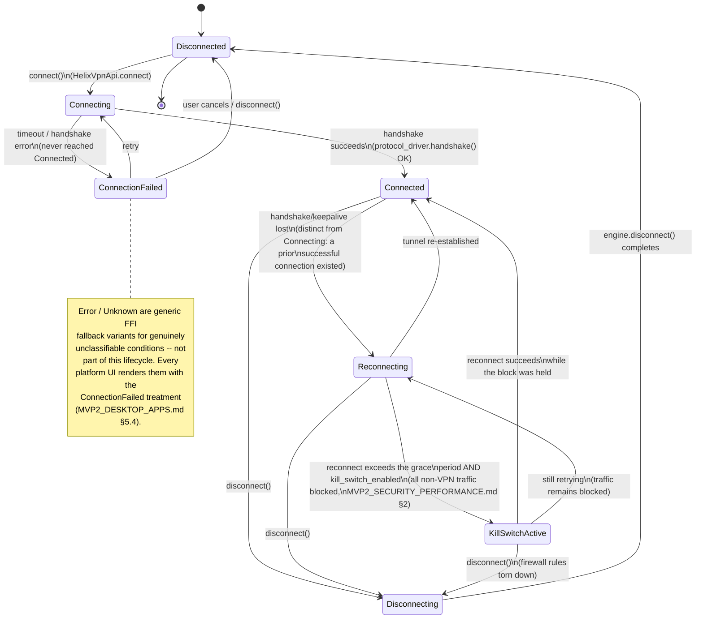
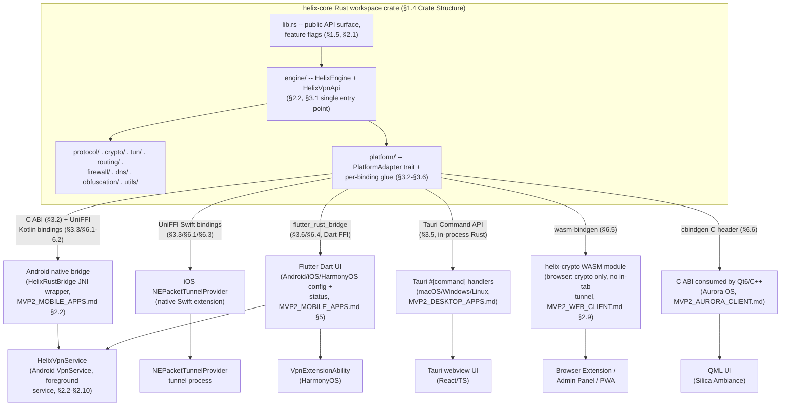

# MVP2 Shared Core Specification: `libhelix_core`

**Revision:** 3
**Last modified:** 2026-07-04T16:30:00Z

> **Revision 3 changelog:** added the two Mermaid diagrams this document
> previously had none of (`docs/research/CROSS_CUTTING_GAP_ANALYSIS.md`
> §3.2 named this the single most architecturally central mvp2/ document
> with the largest diagram gap): §3.1 gains a state-machine diagram for the
> canonical `ConnectionStatus` FSM directly below its enum definition; §6
> gains an architecture/FFI-boundary diagram showing the crate's module
> structure and how each platform binding (UniFFI Kotlin/Swift,
> flutter_rust_bridge, Tauri commands, wasm-bindgen, cbindgen C ABI) reaches
> it. No prose or code content changed.

> **Version**: 0.2.1-MVP2
> **Date**: 2026-01-21 (Revision 2: 2026-07-04)
> **Status**: Draft for Review
> **Classification**: Technical Architecture Specification

> **Revision 2 changelog:** reconciled the §5.1 minimum-OS-version column
> against the product-level minimums declared in `MVP2_ARCHITECTURE.md` §1.2
> and `MVP2_OVERVIEW.md` §4.1 (this document's target table previously stated
> a looser Rust-toolchain floor, not the shipped product's supported
> minimum); marked the `OpenVPN` protocol enum variant explicitly as a
> reserved/unimplemented placeholder; added §5.5 Supply-Chain & Build
> Integrity (reproducible builds + SBOM generation).

---

## Table of Contents

1. [Core Library Overview](#1-core-library-overview)
2. [Module Architecture](#2-module-architecture)
3. [Public API Design](#3-public-api-design)
4. [Protocol Implementation Details](#4-protocol-implementation-details)
5. [Cross-Compilation Configuration](#5-cross-compilation-configuration)
6. [FFI & Binding Generation](#6-ffi--binding-generation)
7. [Testing Strategy](#7-testing-strategy)
8. [Security Architecture](#8-security-architecture)
9. [Performance Budget](#9-performance-budget)
10. [Appendices](#10-appendices)

---

## 1. Core Library Overview

### 1.1 Purpose and Scope

`libhelix_core` is a Rust shared library that powers all Helix VPN platform clients. It encapsulates the complete VPN engine -- protocol implementations, cryptographic operations, TUN interface management, routing, firewall rules, DNS resolution, and traffic obfuscation -- behind a single, platform-agnostic public API.

### 1.2 Design Principles

| Principle | Rationale | Implementation |
|-----------|-----------|----------------|
| **Zero-copy packet processing** | Minimize CPU overhead and memory allocations per packet | `bytes::Bytes` for refcounted buffers; `zerocopy` for structured parsing |
| **Async-first** | Handle thousands of concurrent connections efficiently | Tokio runtime with work-stealing scheduler |
| **`no_std` where possible** | Support constrained environments (embedded, WASM) | Core crypto uses `heapless`; allocator-free path for packet parsing |
| **Single shared runtime** | FFI callers must not create runtimes per-call | Static `LazyLock<Runtime>` pattern |
| **Fail-closed security** | Default to dropping traffic on error | All firewall implementations block on error |
| **Memory safety** | Eliminate entire vulnerability classes | Rust ownership + `zeroize` for secrets |

### 1.3 Target Platforms and Cross-Compilation Targets

| Platform | Target Triple | Tier | Artifact | Code Reuse |
|----------|--------------|------|----------|------------|
| macOS (Intel) | `x86_64-apple-darwin` | Tier 2 | `.dylib` / `.a` | ~85% |
| macOS (Apple Silicon) | `aarch64-apple-darwin` | Tier 2 | `.dylib` / `.a` | ~85% |
| iOS (Device) | `aarch64-apple-ios` | Tier 2 | XCFramework | ~72% |
| iOS (Simulator) | `aarch64-apple-ios-sim` | Tier 2 | XCFramework | ~72% |
| Windows (x64) | `x86_64-pc-windows-msvc` | Tier 1 | `.dll` | ~80% |
| Windows (ARM64) | `aarch64-pc-windows-msvc` | Tier 2 | `.dll` | ~80% |
| Linux (x64) | `x86_64-unknown-linux-gnu` | Tier 1 | `.so` | ~85% |
| Linux (ARM64) | `aarch64-unknown-linux-gnu` | Tier 1 | `.so` | ~85% |
| Android (ARM64) | `aarch64-linux-android` | Tier 2 | `.so` | ~72% |
| Android (ARMv7) | `armv7-linux-androideabi` | Tier 2 | `.so` | ~72% |
| Android (x86_64) | `x86_64-linux-android` | Tier 2 | `.so` | ~72% |
| HarmonyOS | `aarch64-unknown-linux-ohos` | Tier 2 | `.so` | ~70% |
| Aurora OS | `aarch64-unknown-linux-gnu` | Tier 2 | `.so` | ~75% |
| Web/Browser | `wasm32-unknown-unknown` | Tier 2 | `.wasm` | ~45% |

> This table summarizes artifact type and code-reuse percentage per target;
> see §5.1 for the authoritative product-supported minimum OS version per
> target (kept in one place to avoid the two tables drifting out of sync).

### 1.4 Crate Structure

The core library is organized as a single Cargo workspace member for the MVP2 scope:

```
helix-core/
├── Cargo.toml          # Workspace member definition
├── uniffi.toml         # UniFFI binding configuration
├── cbindgen.toml       # C header generation config
├── build.rs            # Build script for FFI generation
└── src/
    ├── lib.rs          # Public API, feature flags
    ├── engine/         # VPN engine orchestration
    ├── protocol/       # VPN protocol implementations
    ├── crypto/         # Cryptographic primitives
    ├── tun/            # TUN/TAP interface abstraction
    ├── routing/        # Route management
    ├── firewall/       # Kill switch / firewall rules
    ├── dns/            # DNS management
    ├── obfuscation/    # Traffic obfuscation
    ├── platform/       # Platform abstraction & FFI
    └── utils/          # Logging, errors, helpers
```

### 1.5 Feature Flags

```toml
[features]
default = ["wireguard", "dns", "full-tunnel"]

# Protocol selection
wireguard = ["boringtun"]
shadowsocks = ["shadowsocks-rust"]
masque = ["quinn", "h3"]
openvpn = []                       # Placeholder for future

# Security features
kill-switch = ["firewall"]
split-tunnel = ["routing"]
post-quantum = ["ml-kem"]
daita = ["obfuscation/daita"]

# Platform targets
android = ["jni", "android-logger"]
ios = ["uniffi/ios"]
wasm = ["wasm-bindgen", "getrandom/js"]

# Build profiles
test-mock-tun = []               # Mock TUN for unit tests
integration-tests = []           # Extended integration test suite
```

---

## 2. Module Architecture

### 2.1 Top-Level Library (`src/lib.rs`)

```rust
//! libhelix_core - Shared VPN core for all Helix VPN platforms
//!
//! # Feature Flags
//! - `wireguard`: Enable WireGuard protocol support
//! - `shadowsocks`: Enable Shadowsocks obfuscation
//! - `masque`: Enable MASQUE/QUIC transport
//! - `kill-switch`: Enable firewall-based kill switch
//! - `split-tunnel`: Enable per-app/route split tunneling
//! - `post-quantum`: Enable ML-KEM hybrid key exchange

#![cfg_attr(feature = "wasm", no_std)]
#![deny(unsafe_code)]
#![warn(missing_docs)]

pub mod engine;
pub mod protocol;
pub mod crypto;
pub mod tun;
pub mod routing;
pub mod firewall;
pub mod dns;
pub mod obfuscation;
pub mod platform;
pub mod utils;

// Re-export core types for public API
pub use engine::{HelixEngine, EngineConfig, ConnectionState};
pub use protocol::{ProtocolType, ProtocolConfig};
pub use crypto::keymanager::KeyManager;
pub use utils::errors::{HelixError, Result};

use std::sync::Arc;

/// Version of the core library
pub const VERSION: &str = env!("CARGO_PKG_VERSION");

/// Initialize the core library with the given configuration.
/// Must be called exactly once before any other API usage.
pub fn initialize(config: EngineConfig) -> Result<Arc<HelixEngine>> {
    utils::logger::init_tracing(&config.log_filter);
    HelixEngine::new(config)
}
```

### 2.2 VPN Engine (`src/engine/`)

#### `src/engine/mod.rs`

```rust
use crate::protocol::{ProtocolDriver, ProtocolType};
use crate::tun::TunDevice;
use crate::routing::RouteManager;
use crate::firewall::Firewall;
use crate::dns::DnsResolver;
use crate::utils::errors::{HelixError, Result};
use std::sync::Arc;
use tokio::sync::{RwLock, broadcast};
use serde::{Deserialize, Serialize};

/// The central VPN engine orchestrating all subsystems.
pub struct HelixEngine {
    config: EngineConfig,
    state: RwLock<ConnectionState>,
    protocol_driver: Arc<dyn ProtocolDriver>,
    tun_device: Arc<dyn TunDevice>,
    route_manager: Arc<RouteManager>,
    firewall: Arc<dyn Firewall>,
    dns_resolver: Arc<DnsResolver>,
    event_tx: broadcast::Sender<EngineEvent>,
}

/// Configuration for the VPN engine.
#[derive(Debug, Clone, Deserialize, Serialize)]
pub struct EngineConfig {
    pub protocol: ProtocolType,
    pub server_address: String,
    pub server_port: u16,
    pub private_key: String,          // Base64-encoded WireGuard private key
    pub public_key: String,           // Server public key
    pub preshared_key: Option<String>,
    pub dns_servers: Vec<String>,
    pub mtu: u16,
    pub kill_switch: bool,
    pub split_tunnel: Option<SplitTunnelConfig>,
    pub log_filter: String,
    pub post_quantum: bool,
    pub obfuscation: Option<ObfuscationConfig>,
}

#[derive(Debug, Clone, Deserialize, Serialize)]
pub struct SplitTunnelConfig {
    pub included_apps: Vec<String>,   // Android package names
    pub excluded_apps: Vec<String>,
    pub included_routes: Vec<String>, // CIDR notation
    pub excluded_routes: Vec<String>,
}

#[derive(Debug, Clone, Deserialize, Serialize)]
pub struct ObfuscationConfig {
    pub method: ObfuscationMethod,
    pub settings: serde_json::Value,
}

#[derive(Debug, Clone, Deserialize, Serialize)]
pub enum ObfuscationMethod {
    Daita,
    Shadowsocks,
    Fragment,
}

/// Connection state machine states.
#[derive(Debug, Clone, Copy, PartialEq, Eq, Serialize)]
pub enum ConnectionState {
    Disconnected,
    Connecting,
    Connected,
    Disconnecting,
    Error(HelixError),
}

/// Events emitted by the engine.
#[derive(Debug, Clone, Serialize)]
pub enum EngineEvent {
    StateChanged(ConnectionState),
    StatsUpdated(ConnectionStats),
    ErrorOccurred(HelixError),
}

#[derive(Debug, Clone, Default, Serialize)]
pub struct ConnectionStats {
    pub bytes_sent: u64,
    pub bytes_received: u64,
    pub packets_sent: u64,
    pub packets_received: u64,
    pub latency_ms: u32,
    pub handshake_duration_ms: u32,
}
```

#### `src/engine/connection.rs`

```rust
use super::*;
use tokio::time::{timeout, Duration};

impl HelixEngine {
    /// Establish a VPN connection with the configured parameters.
    /// 
    /// # Lifecycle
    /// 1. Validate configuration
    /// 2. Apply firewall rules (kill switch) if enabled
    /// 3. Resolve DNS for server endpoint
    /// 4. Initialize protocol driver (handshake)
    /// 5. Create TUN interface
    /// 6. Configure routing
    /// 7. Set DNS servers
    /// 8. Start packet relay loop
    pub async fn connect(&self) -> Result<()> {
        let mut state = self.state.write().await;
        *state = ConnectionState::Connecting;
        self.event_tx.send(EngineEvent::StateChanged(*state)).ok();

        // Step 1: Apply kill switch before any network activity
        if self.config.kill_switch {
            self.firewall.enable_kill_switch().await?;
        }

        // Step 2: DNS resolution
        let endpoint = self.dns_resolver
            .resolve(&self.config.server_address)
            .await?;

        // Step 3: Protocol handshake (WireGuard, etc.)
        let tunnel_params = self.protocol_driver
            .handshake(endpoint, self.config.server_port)
            .await?;

        // Step 4: Create TUN device
        let tun = self.tun_device
            .create(tunnel_params.tunnel_address, tunnel_params.dns_addresses)
            .await?;

        // Step 5: Configure routes
        self.route_manager
            .setup_routes(&tunnel_params.allowed_ips, endpoint)
            .await?;

        // Step 6: Start packet relay
        self.start_relay_loop(tun, tunnel_params.mtu).await?;

        *state = ConnectionState::Connected;
        self.event_tx.send(EngineEvent::StateChanged(*state)).ok();

        Ok(())
    }

    /// Gracefully disconnect the VPN tunnel.
    pub async fn disconnect(&self) -> Result<()> {
        let mut state = self.state.write().await;
        *state = ConnectionState::Disconnecting;
        self.event_tx.send(EngineEvent::StateChanged(*state)).ok();

        // Restore routes
        self.route_manager.teardown_routes().await.ok();

        // Close TUN
        self.tun_device.destroy().await.ok();

        // Protocol cleanup
        self.protocol_driver.shutdown().await.ok();

        // Remove kill switch
        if self.config.kill_switch {
            self.firewall.disable_kill_switch().await.ok();
        }

        *state = ConnectionState::Disconnected;
        self.event_tx.send(EngineEvent::StateChanged(*state)).ok();

        Ok(())
    }

    /// Start the bidirectional packet relay loop.
    async fn start_relay_loop(&self, tun: Arc<dyn TunDevice>, mtu: u16) -> Result<()> {
        let (tun_tx, tun_rx) = tokio::sync::mpsc::channel::<bytes::Bytes>(1024);
        let (net_tx, net_rx) = tokio::sync::mpsc::channel::<bytes::Bytes>(1024);

        // TUN -> Network (encrypt and send)
        let tun_to_net = tokio::spawn(self.relay_tun_to_net(tun.clone(), net_tx));

        // Network -> TUN (decrypt and inject)
        let net_to_tun = tokio::spawn(self.relay_net_to_tun(tun, tun_rx));

        // Spawn protocol driver I/O
        self.protocol_driver
            .start_io(tun_tx, net_rx, mtu)
            .await?;

        // Store join handles for graceful shutdown
        tokio::try_join!(tun_to_net, net_to_tun).ok();

        Ok(())
    }

    async fn relay_tun_to_net(
        &self,
        _tun: Arc<dyn TunDevice>,
        _net_tx: tokio::sync::mpsc::Sender<bytes::Bytes>,
    ) -> Result<()> {
        // Implementation reads from TUN, encrypts via protocol driver
        todo!("TUN->Network relay")
    }

    async fn relay_net_to_tun(
        &self,
        _tun: Arc<dyn TunDevice>,
        _mut net_rx: tokio::sync::mpsc::Receiver<bytes::Bytes>,
    ) -> Result<()> {
        // Implementation receives from network, decrypts, writes to TUN
        todo!("Network->TUN relay")
    }
}
```

#### `src/engine/state_machine.rs`

```rust
/// Connection state machine with transition validation.
/// 
/// Valid transitions:
/// Disconnected -> Connecting
/// Connecting   -> Connected | Error
/// Connected    -> Disconnecting | Error
/// Disconnecting -> Disconnected
/// Error        -> Disconnected | Connecting
#[derive(Debug)]
pub struct ConnectionStateMachine {
    current: ConnectionState,
}

impl ConnectionStateMachine {
    pub fn new() -> Self {
        Self {
            current: ConnectionState::Disconnected,
        }
    }

    pub fn transition(&mut self, next: ConnectionState) -> Result<()> {
        let valid = match (&self.current, &next) {
            (ConnectionState::Disconnected, ConnectionState::Connecting) => true,
            (ConnectionState::Connecting, ConnectionState::Connected) => true,
            (ConnectionState::Connecting, ConnectionState::Error(_)) => true,
            (ConnectionState::Connected, ConnectionState::Disconnecting) => true,
            (ConnectionState::Connected, ConnectionState::Error(_)) => true,
            (ConnectionState::Disconnecting, ConnectionState::Disconnected) => true,
            (ConnectionState::Error(_), ConnectionState::Disconnected) => true,
            (ConnectionState::Error(_), ConnectionState::Connecting) => true,
            (same, other) if std::mem::discriminant(same) == std::mem::discriminant(other) => true,
            _ => false,
        };

        if valid {
            self.current = next;
            Ok(())
        } else {
            Err(HelixError::StateTransition {
                from: format!("{:?}", self.current),
                to: format!("{:?}", next),
            })
        }
    }
}
```

### 2.3 Protocol Implementations (`src/protocol/`)

#### `src/protocol/mod.rs`

```rust
use crate::utils::errors::Result;
use async_trait::async_trait;
use bytes::Bytes;
use serde::{Deserialize, Serialize};
use std::net::SocketAddr;
use tokio::sync::mpsc;

pub mod wireguard;
pub mod shadowsocks;
pub mod masque;

/// Trait for all protocol drivers.
#[async_trait]
pub trait ProtocolDriver: Send + Sync {
    /// Perform the cryptographic handshake.
    async fn handshake(
        &self,
        endpoint: SocketAddr,
        port: u16,
    ) -> Result<TunnelParams>;

    /// Start the I/O relay loop for this protocol.
    async fn start_io(
        &self,
        tun_tx: mpsc::Sender<Bytes>,
        net_rx: mpsc::Receiver<Bytes>,
        mtu: u16,
    ) -> Result<()>;

    /// Graceful shutdown.
    async fn shutdown(&self) -> Result<()>;
}

/// Parameters returned after successful handshake.
#[derive(Debug, Clone)]
pub struct TunnelParams {
    pub tunnel_address: String,       // e.g., "10.64.0.1/32"
    pub dns_addresses: Vec<String>,   // e.g., ["10.64.0.1"]
    pub allowed_ips: Vec<String>,     // CIDR ranges to route through tunnel
    pub mtu: u16,
    pub endpoint: SocketAddr,
}

#[derive(Debug, Clone, Copy, PartialEq, Eq, Deserialize, Serialize)]
pub enum ProtocolType {
    WireGuard,
    Shadowsocks,
    Masque,
    /// RESERVED for a post-MVP2 (MVP3+) protocol addition. There is no
    /// `helix-openvpn` crate, no OpenVPN entry in the multi-protocol support
    /// table (`MVP2_OVERVIEW.md` §7.1), and the `openvpn` Cargo feature flag
    /// (§1.5) is an empty placeholder (`openvpn = []`). Selecting this
    /// variant MUST return `HelixError::UnsupportedProtocol` in MVP2 builds.
    /// Reconciled in Revision 2 — earlier drafts of `README.md` listed
    /// OpenVPN alongside WireGuard/Shadowsocks/MASQUE as if fully supported;
    /// that line has been corrected.
    OpenVPN,
}

#[derive(Debug, Clone, Deserialize, Serialize)]
pub struct ProtocolConfig {
    pub protocol: ProtocolType,
    pub server_address: String,
    pub server_port: u16,
    pub extra: serde_json::Value,
}
```

### 2.4 Cryptographic Primitives (`src/crypto/`)

```rust
// src/crypto/mod.rs
pub mod chacha20poly1305;
pub mod x25519;
pub mod keymanager;

#[cfg(feature = "post-quantum")]
pub mod post_quantum;

use zeroize::{Zeroize, ZeroizeOnDrop};

/// A secret key that is automatically zeroed on drop.
#[derive(Clone, Zeroize, ZeroizeOnDrop)]
pub struct SecretKey(pub Vec<u8>);

impl SecretKey {
    pub fn new(bytes: Vec<u8>) -> Self {
        Self(bytes)
    }

    pub fn as_slice(&self) -> &[u8] {
        &self.0
    }
}
```

```rust
// src/crypto/x25519.rs
use x25519_dalek::{EphemeralSecret, PublicKey, StaticSecret};
use rand::rngs::OsRng;
use crate::utils::errors::Result;

/// Generate a new X25519 keypair (WireGuard static key).
pub fn generate_keypair() -> (StaticSecret, PublicKey) {
    let secret = StaticSecret::random_from_rng(OsRng);
    let public = PublicKey::from(&secret);
    (secret, public)
}

/// Derive shared secret from our private key and peer's public key.
pub fn derive_shared_secret(
    our_secret: &StaticSecret,
    their_public: &PublicKey,
) -> [u8; 32] {
    our_secret.diffie_hellman(their_public).to_bytes()
}
```

```rust
// src/crypto/post_quantum.rs (ML-KEM integration)
#[cfg(feature = "post-quantum")]
use aws_lc_rs::kem;

/// Hybrid X25519 + ML-KEM-768 key encapsulation.
pub struct HybridKem {
    classic_secret: x25519_dalek::StaticSecret,
    pq_decapsulation_key: Option<kem::DecapsulationKey<kem::AlgorithmId<'static>>>,
}

impl HybridKem {
    /// Generate a hybrid keypair combining classical and post-quantum security.
    pub fn generate_hybrid() -> Result<(Self, Vec<u8>)> {
        let (classic_secret, classic_public) = super::x25519::generate_keypair();
        
        // ML-KEM-768 encapsulation
        let kem_algorithm = kem::KYBER768_R3;
        let (decap_key, encapsulation_key_bytes) = 
            kem::DecapsulationKey::generate(&kem_algorithm)?;
        
        // Concatenate X25519 public key + ML-KEM encapsulation key
        let mut hybrid_public = Vec::with_capacity(32 + encapsulation_key_bytes.len());
        hybrid_public.extend_from_slice(&classic_public.as_bytes());
        hybrid_public.extend_from_slice(&encapsulation_key_bytes);
        
        Ok((Self {
            classic_secret,
            pq_decapsulation_key: Some(decap_key),
        }, hybrid_public))
    }
}
```

### 2.5 TUN Interface (`src/tun/`)

```rust
// src/tun/mod.rs
use async_trait::async_trait;
use crate::utils::errors::Result;

#[cfg(target_os = "macos")]
pub mod unix;
#[cfg(target_os = "linux")]
pub mod unix;
#[cfg(target_os = "windows")]
pub mod windows;
#[cfg(target_os = "android")]
pub mod android;
#[cfg(target_os = "ios")]
pub mod ios;

/// Abstract TUN device interface.
#[async_trait]
pub trait TunDevice: Send + Sync {
    /// Create the TUN device with the given IP configuration.
    async fn create(&self, address: String, dns: Vec<String>) -> Result<Arc<dyn TunDevice>>;
    
    /// Destroy the TUN device.
    async fn destroy(&self) -> Result<()>;
    
    /// Read a packet from the TUN device (non-blocking async).
    async fn read_packet(&self, buf: &mut [u8]) -> Result<usize>;
    
    /// Write a packet to the TUN device.
    async fn write_packet(&self, packet: &[u8]) -> Result<()>;
    
    /// Set the MTU.
    fn set_mtu(&self, mtu: u16) -> Result<()>;
    
    /// Get the file descriptor (Unix platforms).
    #[cfg(unix)]
    fn fd(&self) -> std::os::fd::RawFd;
}

/// Factory for creating platform-specific TUN devices.
pub fn create_tun_device() -> Result<Arc<dyn TunDevice>> {
    #[cfg(any(target_os = "macos", target_os = "linux"))]
    return Ok(Arc::new(unix::UnixTun::new()));
    
    #[cfg(target_os = "windows")]
    return Ok(Arc::new(windows::WinTunDevice::new()));
    
    #[cfg(target_os = "android")]
    return Ok(Arc::new(android::AndroidTun::new()));
    
    #[cfg(target_os = "ios")]
    return Ok(Arc::new(ios::IosTun::new()));
}
```

### 2.6 Firewall / Kill Switch (`src/firewall/`)

```rust
// src/firewall/mod.rs
use async_trait::async_trait;
use crate::utils::errors::Result;

#[cfg(target_os = "macos")]
pub mod pf;
#[cfg(target_os = "linux")]
pub mod iptables;
#[cfg(target_os = "windows")]
pub mod wfp;
#[cfg(target_os = "android")]
pub mod android;

#[async_trait]
pub trait Firewall: Send + Sync {
    /// Enable kill switch: block all outbound traffic except VPN tunnel.
    async fn enable_kill_switch(&self) -> Result<()>;
    
    /// Disable kill switch: restore normal traffic flow.
    async fn disable_kill_switch(&self) -> Result<()>;
    
    /// Add exception for the VPN server endpoint.
    async fn allow_endpoint(&self, address: std::net::SocketAddr) -> Result<()>;
    
    /// Block all IPv6 traffic to prevent IPv6 leaks.
    async fn block_ipv6(&self) -> Result<()>;
    
    /// Enforce DNS through VPN tunnel only.
    async fn enforce_dns(&self, dns_servers: &[String]) -> Result<()>;
}
```

### 2.7 DNS Management (`src/dns/`)

```rust
// src/dns/mod.rs
pub mod resolver;
pub mod doh;
pub mod dot;

use crate::utils::errors::Result;
use std::net::SocketAddr;

/// DNS resolver supporting plaintext, DoT, and DoH.
pub struct DnsResolver {
    method: DnsMethod,
    servers: Vec<SocketAddr>,
}

#[derive(Debug, Clone, Copy, PartialEq, Eq)]
pub enum DnsMethod {
    Plaintext,   // UDP/53
    DoT,         // DNS-over-TLS
    DoH,         // DNS-over-HTTPS
    DoH3,        // DNS-over-HTTP/3 (QUIC)
}

impl DnsResolver {
    /// Resolve a hostname to IP addresses.
    pub async fn resolve(&self, hostname: &str) -> Result<SocketAddr> {
        match self.method {
            DnsMethod::Plaintext => resolver::resolve_plaintext(hostname, &self.servers).await,
            DnsMethod::DoT => dot::resolve_dot(hostname, &self.servers).await,
            DnsMethod::DoH => doh::resolve_doh(hostname, &self.servers).await,
            DnsMethod::DoH3 => doh::resolve_doh3(hostname, &self.servers).await,
        }
    }
}
```

### 2.8 Obfuscation (`src/obfuscation/`)

```rust
// src/obfuscation/mod.rs
pub mod daita;
pub mod fragment;

use async_trait::async_trait;
use bytes::Bytes;
use crate::utils::errors::Result;

/// Trait for traffic obfuscation layers.
#[async_trait]
pub trait ObfuscationLayer: Send + Sync {
    /// Obfuscate outgoing packet data.
    async fn obfuscate(&self, packet: Bytes) -> Result<Bytes>;
    
    /// Deobfuscate incoming packet data.
    async fn deobfuscate(&self, data: Bytes) -> Result<Bytes>;
    
    /// Get the overhead bytes added per packet.
    fn overhead(&self) -> usize;
}
```

### 2.9 Platform Abstraction (`src/platform/`)

```rust
// src/platform/mod.rs
pub mod ffi;

#[cfg(feature = "uniffi")]
pub mod uniffi;

#[cfg(feature = "wasm")]
pub mod wasm;

/// Platform-specific key storage (Keychain, Keystore, etc.)
pub trait SecureStorage: Send + Sync {
    fn store_key(&self, key_id: &str, key_data: &[u8]) -> Result<()>;
    fn retrieve_key(&self, key_id: &str) -> Result<Vec<u8>>;
    fn delete_key(&self, key_id: &str) -> Result<()>;
}
```

---

## 3. Public API Design

### 3.1 Core API Traits and Structs

```rust
// src/engine/api.rs

use serde::{Deserialize, Serialize};
use std::sync::Arc;
use tokio::sync::broadcast;

/// Primary public API for all platform integrations.
/// 
/// This is the single entry point that all platform bindings (UniFFI,
/// flutter_rust_bridge, wasm-bindgen, C FFI) call into.
pub struct HelixVpnApi {
    engine: Arc<HelixEngine>,
}

impl HelixVpnApi {
    /// Create a new API instance with the given configuration.
    pub fn new(config: VpnConfig) -> Result<Self, HelixError> {
        let engine_config = config.into_engine_config()?;
        let engine = crate::initialize(engine_config)?;
        Ok(Self { engine })
    }

    /// Connect to the VPN.
    pub async fn connect(&self) -> Result<ConnectionStatus, HelixError> {
        self.engine.connect().await?;
        Ok(ConnectionStatus::Connected)
    }

    /// Disconnect from the VPN.
    pub async fn disconnect(&self) -> Result<ConnectionStatus, HelixError> {
        self.engine.disconnect().await?;
        Ok(ConnectionStatus::Disconnected)
    }

    /// Get current connection status.
    pub fn status(&self) -> ConnectionStatus {
        match *self.engine.state.try_read() {
            Ok(state) => state.into(),
            Err(_) => ConnectionStatus::Unknown,
        }
    }

    /// Subscribe to engine events.
    pub fn subscribe_events(&self) -> broadcast::Receiver<EngineEvent> {
        self.engine.event_tx.subscribe()
    }

    /// Get current connection statistics.
    pub fn stats(&self) -> ConnectionStats {
        // Returns last known stats
        ConnectionStats::default()
    }
}

/// Serializable VPN configuration (platform-agnostic).
#[derive(Debug, Clone, Deserialize, Serialize)]
pub struct VpnConfig {
    pub protocol: String,            // "wireguard", "shadowsocks", "masque"
    pub server_host: String,
    pub server_port: u16,
    pub private_key_b64: String,
    pub server_public_key_b64: String,
    pub preshared_key_b64: Option<String>,
    pub dns_servers: Vec<String>,
    pub mtu: Option<u16>,
    pub kill_switch_enabled: bool,
    pub split_tunnel_enabled: bool,
    pub split_tunnel_apps: Vec<String>,
    pub obfuscation: Option<String>, // "daita", "shadowsocks", "fragment"
    pub post_quantum: bool,
    pub log_level: String,           // "trace", "debug", "info", "warn", "error"
}

/// Wire-format connection status surfaced to every platform binding.
///
/// **Revision 2 fix**: this enum previously modeled only six coarse states
/// and collapsed "reconnecting after a keepalive timeout" and "kill switch
/// actively blocking traffic" into a generic `Error`/`Disconnecting` state —
/// a real UX gap, since a user cannot distinguish "temporarily blocked while
/// the tunnel silently re-establishes" from "something is broken" without a
/// dedicated state. This enum is now the literal wire representation of the
/// canonical state machine in `MVP2_ARCHITECTURE.md` §5.6 — every platform
/// UI's connection-state rendering (§UI_UX_SPEC "State Transitions") MUST
/// switch over exactly this set, with no platform-invented additional state.
#[derive(Debug, Clone, Copy, PartialEq, Eq, Serialize)]
pub enum ConnectionStatus {
    Disconnected,
    Connecting,
    Connected,
    /// Handshake or keepalive lost; attempting to re-establish. Distinct
    /// from `Connecting` (first connection) for UI messaging purposes.
    Reconnecting,
    /// Reconnect exceeded the grace period AND kill switch is enabled: all
    /// non-VPN traffic is being actively blocked at the platform firewall
    /// layer (see `MVP2_SECURITY_PERFORMANCE.md` §2).
    KillSwitchActive,
    Disconnecting,
    /// Initial connection attempt failed (timeout / handshake error), prior
    /// to ever reaching `Connected`. Distinct from `Reconnecting`, which
    /// implies a prior successful connection.
    ConnectionFailed,
    Error,
    Unknown,
}

/// Enterprise-managed policy pushed from the `helix-admin` control plane
/// (`MVP2_ARCHITECTURE.md` §10.2) via the MVP1 Admin API. Consumed by
/// `PlatformAdapter::apply_managed_policy` (`MVP2_ARCHITECTURE.md` §5.5).
/// A `None`/absent policy means the device is not MDM-enrolled and all
/// settings remain fully user-controlled.
#[derive(Debug, Clone, Deserialize, Serialize)]
pub struct ManagedPolicy {
    pub organization_id: String,
    pub allowed_protocols: Vec<ProtocolType>,
    pub force_kill_switch: bool,
    pub force_split_tunnel_rules: Option<SplitTunnelConfig>,
    pub forced_dns_servers: Vec<String>,
    pub require_sso_login: bool,
    /// Monotonically increasing version so a device can detect and log a
    /// stale/rolled-back policy push instead of silently reapplying it.
    pub policy_version: u64,
}
```

#### `ConnectionStatus` state machine (diagram)

The diagram below is the literal state machine the `ConnectionStatus` enum
above encodes — the same FSM every platform UI renders (`MVP2_ARCHITECTURE.md`
§5.6; `MVP2_DESKTOP_APPS.md` §5.4; `MVP2_MOBILE_APPS.md` §2.2). It adds no
transition not already described by the enum's own doc comments.



### 3.2 FFI Boundary Definitions (C ABI)

```rust
// src/platform/ffi.rs

use std::ffi::{c_char, c_int, CStr, CString};
use std::sync::Arc;
use once_cell::sync::Lazy;
use tokio::runtime::Runtime;

/// Static Tokio runtime for all FFI operations.
static RUNTIME: Lazy<Runtime> = Lazy::new(|| {
    Runtime::new_multi_thread()
        .worker_threads(4)
        .max_blocking_threads(8)
        .enable_all()
        .thread_name("helix-ffi")
        .build()
        .expect("Failed to create Tokio runtime")
});

thread_local! {
    static LAST_ERROR: std::cell::RefCell<Option<String>> = std::cell::RefCell::new(None);
}

/// Opaque handle to the Helix VPN engine.
pub struct HelixHandle {
    engine: Arc<super::HelixEngine>,
}

/// Initialize the VPN core with a JSON configuration string.
/// 
/// # Safety
/// `config_json` must be a valid null-terminated UTF-8 string.
/// The returned handle must be freed with `helix_free`.
#[no_mangle]
pub unsafe extern "C" fn helix_init(config_json: *const c_char) -> *mut HelixHandle {
    catch_panic(|| {
        let config_str = CStr::from_ptr(config_json).to_string_lossy();
        let config: VpnConfig = serde_json::from_str(&config_str)
            .map_err(|e| HelixError::ConfigParse(e.to_string()))?;
        let engine_config = config.into_engine_config()?;
        let engine = crate::initialize(engine_config)?;
        Ok(Box::into_raw(Box::new(HelixHandle { engine })))
    })
    .unwrap_or(std::ptr::null_mut())
}

/// Connect to the VPN server.
/// 
/// # Returns
/// 0 on success, non-zero error code on failure.
#[no_mangle]
pub unsafe extern "C" fn helix_connect(handle: *mut HelixHandle) -> c_int {
    if handle.is_null() {
        set_last_error("Null handle");
        return -1;
    }
    
    catch_panic(|| {
        let handle = &*handle;
        RUNTIME.block_on(handle.engine.connect())?;
        Ok(0)
    })
    .unwrap_or(-1)
}

/// Disconnect from the VPN server.
#[no_mangle]
pub unsafe extern "C" fn helix_disconnect(handle: *mut HelixHandle) -> c_int {
    if handle.is_null() {
        return -1;
    }
    
    catch_panic(|| {
        let handle = &*handle;
        RUNTIME.block_on(handle.engine.disconnect())?;
        Ok(0)
    })
    .unwrap_or(-1)
}

/// Get the current connection state as a string.
/// 
/// # Safety
/// The returned string must be freed with `helix_free_string`.
#[no_mangle]
pub unsafe extern "C" fn helix_get_state(handle: *mut HelixHandle) -> *mut c_char {
    if handle.is_null() {
        return std::ptr::null_mut();
    }
    
    let handle = &*handle;
    let state = handle.engine.status();
    let state_str = format!("{:?}", state);
    CString::new(state_str).map(|s| s.into_raw()).unwrap_or(std::ptr::null_mut())
}

/// Free a string returned by the FFI API.
#[no_mangle]
pub unsafe extern "C" fn helix_free_string(s: *mut c_char) {
    if !s.is_null() {
        let _ = CString::from_raw(s);
    }
}

/// Free a Helix handle.
#[no_mangle]
pub unsafe extern "C" fn helix_free(handle: *mut HelixHandle) {
    if !handle.is_null() {
        let _ = Box::from_raw(handle);
    }
}

/// Get the last error message.
/// 
/// # Safety
/// The returned string must be freed with `helix_free_string`.
#[no_mangle]
pub extern "C" fn helix_last_error() -> *mut c_char {
    LAST_ERROR.with(|e| {
        e.borrow()
            .as_ref()
            .and_then(|s| CString::new(s.as_str()).ok())
            .map(|s| s.into_raw())
            .unwrap_or(std::ptr::null_mut())
    })
}

fn set_last_error(msg: &str) {
    LAST_ERROR.with(|e| {
        *e.borrow_mut() = Some(msg.to_string());
    });
}

fn catch_panic<T, F>(f: F) -> Result<T, i32>
where
    F: FnOnce() -> Result<T, HelixError> + std::panic::UnwindSafe,
{
    match std::panic::catch_unwind(f) {
        Ok(Ok(val)) => Ok(val),
        Ok(Err(e)) => {
            set_last_error(&e.to_string());
            Err(-1)
        }
        Err(_) => {
            set_last_error("Panic in Rust code");
            Err(-2)
        }
    }
}
```

### 3.3 UniFFI Interface Definitions

```rust
// src/platform/uniffi.rs

use uniffi;
use crate::engine::api::{VpnConfig, ConnectionStatus, ConnectionStats};

#[derive(uniffi::Object)]
pub struct HelixVpnCore {
    api: crate::engine::api::HelixVpnApi,
}

#[uniffi::export]
impl HelixVpnCore {
    #[uniffi::constructor]
    pub fn new(config: VpnConfigUniffi) -> Result<Self, HelixError> {
        let api = crate::engine::api::HelixVpnApi::new(config.into())?;
        Ok(Self { api })
    }

    pub fn connect(&self) -> Result<ConnectionStatusUniffi, HelixError> {
        let rt = tokio::runtime::Handle::try_current()
            .or_else(|_| Ok(RUNTIME.handle().clone()))?;
        rt.block_on(self.api.connect())
            .map(|s| s.into())
    }

    pub fn disconnect(&self) -> Result<ConnectionStatusUniffi, HelixError> {
        let rt = tokio::runtime::Handle::try_current()
            .or_else(|_| Ok(RUNTIME.handle().clone()))?;
        rt.block_on(self.api.disconnect())
            .map(|s| s.into())
    }

    pub fn status(&self) -> ConnectionStatusUniffi {
        self.api.status().into()
    }

    pub fn stats(&self) -> ConnectionStatsUniffi {
        self.api.stats().into()
    }
}

// UniFFI-compatible config struct
#[derive(uniffi::Record)]
pub struct VpnConfigUniffi {
    pub protocol: String,
    pub server_host: String,
    pub server_port: u16,
    pub private_key_b64: String,
    pub server_public_key_b64: String,
    pub dns_servers: Vec<String>,
    pub kill_switch_enabled: bool,
}

#[derive(uniffi::Enum)]
pub enum ConnectionStatusUniffi {
    Disconnected,
    Connecting,
    Connected,
    Disconnecting,
    Error,
}

#[derive(uniffi::Record)]
pub struct ConnectionStatsUniffi {
    pub bytes_sent: u64,
    pub bytes_received: u64,
    pub latency_ms: u32,
}
```

### 3.4 UDL Definition File

```idl
// helix_core.udl
namespace helix_core {
    string version();
};

[Error]
enum HelixError {
    "ConfigParse",
    "ConnectionFailed",
    "AuthenticationFailed",
    "Timeout",
    "StateTransition",
    "CryptoError",
    "PlatformError",
    "NetworkError",
};

dictionary VpnConfig {
    string protocol;
    string server_host;
    u16 server_port;
    string private_key_b64;
    string server_public_key_b64;
    sequence<string> dns_servers;
    boolean kill_switch_enabled;
};

enum ConnectionStatus {
    "Disconnected",
    "Connecting",
    "Connected",
    "Disconnecting",
    "Error",
};

dictionary ConnectionStats {
    u64 bytes_sent;
    u64 bytes_received;
    u32 latency_ms;
};

interface HelixVpnCore {
    [Name=constructor, Throws=HelixError]
    constructor(VpnConfig config);

    [Throws=HelixError]
    ConnectionStatus connect();

    [Throws=HelixError]
    ConnectionStatus disconnect();

    ConnectionStatus status();

    ConnectionStats stats();
};
```

### 3.5 Tauri Command API

```rust
// src/platform/tauri.rs

use tauri::State;
use std::sync::Arc;
use tokio::sync::Mutex;

pub struct AppState {
    pub api: Arc<Mutex<crate::engine::api::HelixVpnApi>>,
}

#[tauri::command]
pub async fn vpn_connect(
    state: State<'_, AppState>,
    config: crate::engine::api::VpnConfig,
) -> Result<String, String> {
    let api = state.api.lock().await;
    match api.connect().await {
        Ok(status) => Ok(format!("{:?}", status)),
        Err(e) => Err(e.to_string()),
    }
}

#[tauri::command]
pub async fn vpn_disconnect(
    state: State<'_, AppState>,
) -> Result<String, String> {
    let api = state.api.lock().await;
    match api.disconnect().await {
        Ok(status) => Ok(format!("{:?}", status)),
        Err(e) => Err(e.to_string()),
    }
}

#[tauri::command]
pub async fn vpn_status(
    state: State<'_, AppState>,
) -> Result<String, String> {
    let api = state.api.lock().await;
    Ok(format!("{:?}", api.status()))
}

#[tauri::command]
pub async fn vpn_stats(
    state: State<'_, AppState>,
) -> Result<crate::engine::api::ConnectionStats, String> {
    let api = state.api.lock().await;
    Ok(api.stats())
}
```

### 3.6 Flutter Platform Channel API

```rust
// src/platform/flutter.rs

/// flutter_rust_bridge integration.
/// This module is only compiled when the `flutter` feature is enabled.

use flutter_rust_bridge::frb;

#[frb(init)]
pub fn init_app() {
    // Default flutter_rust_bridge initialization
}

#[frb(sync)]
pub fn helix_version() -> String {
    crate::VERSION.to_string()
}

#[frb]
pub async fn helix_connect(config_json: String) -> Result<String, String> {
    let config: crate::engine::api::VpnConfig = 
        serde_json::from_str(&config_json).map_err(|e| e.to_string())?;
    
    let api = crate::engine::api::HelixVpnApi::new(config)
        .map_err(|e| e.to_string())?;
    
    api.connect().await
        .map(|s| format!("{:?}", s))
        .map_err(|e| e.to_string())
}

#[frb]
pub async fn helix_disconnect() -> Result<String, String> {
    // Requires shared state management
    Ok("Disconnected".to_string())
}

#[frb]
pub fn helix_get_status() -> String {
    // Requires shared state management
    "Unknown".to_string()
}
```

---

## 4. Protocol Implementation Details

### 4.1 WireGuard via BoringTun

#### Architecture

```
+---------------------------------------------------+
|               WireGuard Protocol Driver             |
+---------------------------------------------------+
|  boringtun::noise::Tunn  (per-peer tunnel state)    |
|  + Noise Protocol handshake (IK pattern)            |
|  + ChaCha20-Poly1305 packet encryption              |
|  + Blake2s keyed hashing                            |
|  + Timers (keepalive, rekey, handshake retry)       |
+---------------------------------------------------+
|  UDP Socket (tokio::net::UdpSocket)                 |
|  + Async send/receive                               |
|  + Zero-copy buffer management (bytes crate)        |
+---------------------------------------------------+
```

#### Implementation (`src/protocol/wireguard/`)

```rust
// src/protocol/wireguard/mod.rs

use boringtun::noise::{Tunn, TunnResult};
use boringtun::noise::rate_limiter::RateLimiter;
use boringtun::x25519::{PublicKey, StaticSecret};
use bytes::{Bytes, BytesMut};
use std::net::SocketAddr;
use std::sync::Arc;
use tokio::net::UdpSocket;
use tokio::sync::mpsc;
use tokio::time::{interval, Duration};

pub mod handshake;
pub mod crypto;
pub mod transport;

const KEEPALIVE_INTERVAL: Duration = Duration::from_secs(25);
const HANDSHAKE_RETRY_INTERVAL: Duration = Duration::from_secs(5);
const MAX_HANDSHAKE_RETRIES: u32 = 5;

/// WireGuard protocol driver using boringtun.
pub struct WireGuardDriver {
    tunnel: Arc<parking_lot::Mutex<Tunn>>,
    socket: Arc<UdpSocket>,
    endpoint: std::sync::RwLock<Option<SocketAddr>>,
    stats: std::sync::atomic::AtomicU64,
}

impl WireGuardDriver {
    pub fn new(
        static_private: StaticSecret,
        peer_public: PublicKey,
        preshared_key: Option<[u8; 32]>,
    ) -> Result<Self, crate::utils::errors::HelixError> {
        let tunnel = Tunn::new(
            static_private,
            peer_public,
            preshared_key,
            Some(RateLimiter::new(&StaticSecret::default(), 1000)),
            0,
            None,
        ).map_err(|e| crate::utils::errors::HelixError::CryptoError(e.to_string()))?;

        Ok(Self {
            tunnel: Arc::new(parking_lot::Mutex::new(tunnel)),
            socket: Arc::new(UdpSocket::bind("0.0.0.0:0").await?),
            endpoint: std::sync::RwLock::new(None),
            stats: std::sync::atomic::AtomicU64::new(0),
        })
    }
}

#[async_trait::async_trait]
impl crate::protocol::ProtocolDriver for WireGuardDriver {
    async fn handshake(
        &self,
        endpoint: SocketAddr,
        _port: u16,
    ) -> Result<crate::protocol::TunnelParams, crate::utils::errors::HelixError> {
        *self.endpoint.write().unwrap() = Some(endpoint);

        // Initiate WireGuard handshake
        let mut buf = vec![0u8; 256];
        let packet = {
            let mut tun = self.tunnel.lock();
            match tun.format_handshake_initiation(&mut buf, false) {
                TunnResult::WriteToNetwork(packet) => packet.to_vec(),
                TunnResult::WriteToTunnelV4(_, _) => unreachable!(),
                TunnResult::WriteToTunnelV6(_, _) => unreachable!(),
                TunnResult::Done => return Err(crate::utils::errors::HelixError::ConnectionFailed(
                    "Handshake already complete or not needed".into()
                )),
                TunnResult::Err(e) => return Err(crate::utils::errors::HelixError::CryptoError(
                    e.to_string()
                )),
            }
        };

        // Send handshake initiation
        self.socket.send_to(&packet, endpoint).await?;

        // Wait for handshake response with retry logic
        let mut attempts = 0;
        let mut response_buf = vec![0u8; 256];
        
        while attempts < MAX_HANDSHAKE_RETRIES {
            match tokio::time::timeout(
                HANDSHAKE_RETRY_INTERVAL,
                self.socket.recv_from(&mut response_buf)
            ).await {
                Ok(Ok((len, src))) if src == endpoint => {
                    let mut dst = vec![0u8; 1500];
                    let mut tun = self.tunnel.lock();
                    match tun.decapsulate(None, &response_buf[..len], &mut dst) {
                        TunnResult::WriteToNetwork(reply) => {
                            // May need to send a reply (cookie response, etc.)
                            self.socket.send_to(reply, endpoint).await.ok();
                        }
                        TunnResult::Done => {
                            // Handshake complete
                            break;
                        }
                        TunnResult::Err(e) => {
                            return Err(crate::utils::errors::HelixError::CryptoError(
                                e.to_string()
                            ));
                        }
                        _ => {}
                    }
                }
                _ => {
                    // Timeout or error - retry
                    attempts += 1;
                    let mut buf = vec![0u8; 256];
                    let packet = {
                        let mut tun = self.tunnel.lock();
                        match tun.format_handshake_initiation(&mut buf, false) {
                            TunnResult::WriteToNetwork(packet) => packet.to_vec(),
                            _ => continue,
                        }
                    };
                    self.socket.send_to(&packet, endpoint).await?;
                }
            }
        }

        if attempts >= MAX_HANDSHAKE_RETRIES {
            return Err(crate::utils::errors::HelixError::Timeout);
        }

        Ok(crate::protocol::TunnelParams {
            tunnel_address: "10.64.0.1/32".to_string(), // Assigned by server
            dns_addresses: vec!["10.64.0.1".to_string()],
            allowed_ips: vec!["0.0.0.0/0".to_string(), "::/0".to_string()],
            mtu: 1420,
            endpoint,
        })
    }

    async fn start_io(
        &self,
        tun_tx: mpsc::Sender<Bytes>,
        mut net_rx: mpsc::Receiver<Bytes>,
        _mtu: u16,
    ) -> Result<(), crate::utils::errors::HelixError> {
        let tunnel = self.tunnel.clone();
        let socket = self.socket.clone();
        let endpoint = *self.endpoint.read().unwrap();

        // Keepalive timer
        let keepalive = tokio::spawn(async move {
            let mut interval = interval(KEEPALIVE_INTERVAL);
            loop {
                interval.tick().await;
                let mut buf = vec![0u8; 32]; // Keepalive is small
                let mut tun = tunnel.lock();
                match tun.format_timers(&mut buf) {
                    TunnResult::WriteToNetwork(packet) => {
                        if let Some(ep) = endpoint {
                            socket.send_to(packet, ep).await.ok();
                        }
                    }
                    _ => {}
                }
            }
        });

        // Network receive loop
        let net_recv = tokio::spawn(async move {
            let mut buf = vec![0u8; 65536];
            loop {
                match socket.recv_from(&mut buf).await {
                    Ok((len, _src)) => {
                        let mut dst = BytesMut::with_capacity(65536);
                        let mut tun = tunnel.lock();
                        match tun.decapsulate(None, &buf[..len], &mut dst) {
                            TunnResult::WriteToTunnelV4(packet, _addr) |
                            TunnResult::WriteToTunnelV6(packet, _addr) => {
                                tun_tx.send(Bytes::copy_from_slice(packet)).await.ok();
                            }
                            TunnResult::WriteToNetwork(reply) => {
                                if let Some(ep) = endpoint {
                                    socket.send_to(reply, ep).await.ok();
                                }
                            }
                            _ => {}
                        }
                    }
                    Err(_) => break,
                }
            }
        });

        tokio::try_join!(keepalive, net_recv).ok();
        Ok(())
    }

    async fn shutdown(&self) -> Result<(), crate::utils::errors::HelixError> {
        *self.endpoint.write().unwrap() = None;
        Ok(())
    }
}
```

#### WireGuard Keepalive Timer Configuration

| Parameter | Value | Description |
|-----------|-------|-------------|
| Persistent keepalive | 25s | Default interval for NAT hole punching |
| Rekey after time | 120s | Maximum time before initiating rekey |
| Rekey after messages | 2^64 | Message count threshold (practically infinite) |
| Rekey attempt time | 90s | Retry rekey if no response |
| Rekey timeout | 5s | Retry interval for rekey attempts |

### 4.2 Shadowsocks (SIP022 AEAD-2022)

```rust
// src/protocol/shadowsocks/mod.rs

/// Shadowsocks protocol driver using SIP022 AEAD-2022 ciphers.
/// 
/// SIP022 provides:
/// - Full replay protection (mandatory, using 64-bit unique session IDs)
/// - Session-based UDP proxying
/// - Session subkey derivation with BLAKE3
/// - TCP: length-chunk-payload-chunk model
/// - UDP: separate header encryption + AEAD body

use shadowsocks_crypto::v1::Cipher;
use bytes::{Bytes, BytesMut};

pub const METHOD_AES_256_GCM: &str = "aes-256-gcm";
pub const METHOD_CHACHA20_POLY1305: &str = "chacha20-ietf-poly1305";
pub const METHOD_2022_BLAKE3_AES_256_GCM: &str = "2022-blake3-aes-256-gcm";
pub const METHOD_2022_BLAKE3_CHACHA20_POLY1305: &str = "2022-blake3-chacha20-poly1305";

pub struct ShadowsocksDriver {
    method: String,
    key: [u8; 32],          // Master key derived from password
    server_addr: std::net::SocketAddr,
}

impl ShadowsocksDriver {
    /// Derive session subkey using BLAKE3 (SIP022).
    fn derive_session_subkey(&self, salt: &[u8]) -> Vec<u8> {
        use blake3::Hasher;
        let mut hasher = Hasher::new_keyed(&self.key.into());
        hasher.update(salt);
        hasher.finalize().as_bytes().to_vec()
    }
}
```

### 4.3 MASQUE/QUIC (RFC 9298)

```rust
// src/protocol/masque/mod.rs

/// MASQUE (Multiplexed Application Substrate over QUIC Encryption) driver.
/// 
/// RFC 9298: CONNECT-UDP proxying over HTTP/3
/// RFC 9297: HTTP Datagrams for Datagram Extensibility
/// RFC 9484: CONNECT-IP for IP packet proxying
/// 
/// Uses quinn for QUIC transport and h3 for HTTP/3.

use quinn::{ClientConfig, Endpoint};
use h3::{client, quic};
use rustls::ClientConfig as TlsConfig;
use bytes::Bytes;

pub struct MasqueDriver {
    endpoint: Endpoint,
    connect_url: String,
    tls_config: Arc<TlsConfig>,
}

impl MasqueDriver {
    pub async fn connect_udp_tunnel(
        &self,
        target: std::net::SocketAddr,
    ) -> Result<MasqueUdpTunnel, crate::utils::errors::HelixError> {
        // RFC 9298: Send CONNECT-UDP request
        // Template: ".well-known/masque/udp/{target_host}/{target_port}/"
        let path = format!(
            ".well-known/masque/udp/{}/{}/",
            target.ip(),
            target.port()
        );

        // Establish HTTP/3 connection with QUIC
        let connection = self.endpoint
            .connect(self.connect_url.parse()?, "masque.server")?
            .await?;

        // Send Extended CONNECT for UDP proxying
        let (mut request_stream, udp_capsule_stream) = h3::client::send_extended_connect(
            &connection,
            "connect-udp",
            &path,
        ).await?;

        // Wait for 2xx response
        let response = request_stream.recv_response().await?;
        if !response.status().is_success() {
            return Err(crate::utils::errors::HelixError::ConnectionFailed(
                format!("MASQUE CONNECT-UDP failed: {}", response.status())
            ));
        }

        Ok(MasqueUdpTunnel {
            capsule_stream: udp_capsule_stream,
            target,
        })
    }
}

/// A MASQUE UDP tunnel for proxying WireGuard packets.
pub struct MasqueUdpTunnel {
    capsule_stream: h3::client::UdpCapsuleStream,
    target: std::net::SocketAddr,
}
```

### 4.4 Multi-Hop Chaining Protocol

```rust
// src/protocol/multihop.rs

/// Multi-hop VPN chaining for entry-exit separation.
/// 
/// Architecture:
///   Client -> Entry Node (WireGuard) -> Exit Node (WireGuard) -> Internet
///   
/// Each hop is a separate WireGuard tunnel. The client creates:
/// 1. Tunnel to entry node (outer tunnel, visible to ISP)
/// 2. Tunnel to exit node (inner tunnel, encapsulated within outer)
/// 
/// Entry node sees client IP but not destination.
/// Exit node sees destination but not client IP.

pub struct MultiHopChain {
    entry_tunnel: Arc<wireguard::WireGuardDriver>,
    exit_tunnel: Arc<wireguard::WireGuardDriver>,
    entry_endpoint: SocketAddr,
    exit_endpoint: SocketAddr,
}

impl MultiHopChain {
    /// Route traffic through the multi-hop chain.
    /// 
    /// Packet flow:
    /// App -> TUN -> encrypt(exit) -> encrypt(entry) -> UDP -> Entry Node
    ///   -> decrypt(entry) -> encrypt(exit) -> UDP -> Exit Node
    ///   -> decrypt(exit) -> Internet
    pub async fn relay_packet(&self, packet: Bytes) -> Result<Bytes> {
        // First encrypt for exit node
        let mut buf = vec![0u8; packet.len() + 64]; // overhead for inner WG
        let inner_encrypted = {
            let mut tun = self.exit_tunnel.tunnel.lock();
            match tun.encapsulate(&packet, &mut buf) {
                TunnResult::WriteToNetwork(data) => Bytes::copy_from_slice(data),
                other => return Err(HelixError::ConnectionFailed(
                    format!("Exit tunnel encapsulate failed: {:?}", other)
                )),
            }
        };

        // Then encrypt for entry node (outer tunnel)
        let mut buf2 = vec![0u8; inner_encrypted.len() + 64]; // overhead for outer WG
        let outer_encrypted = {
            let mut tun = self.entry_tunnel.tunnel.lock();
            match tun.encapsulate(&inner_encrypted, &mut buf2) {
                TunnResult::WriteToNetwork(data) => Bytes::copy_from_slice(data),
                other => return Err(HelixError::ConnectionFailed(
                    format!("Entry tunnel encapsulate failed: {:?}", other)
                )),
            }
        };

        Ok(outer_encrypted)
    }
}
```

---

## 5. Cross-Compilation Configuration

### 5.1 Supported Targets Table

| Platform | Target Triple | Rust Tier | Min OS Version (product-supported) | Build Tool | Notes |
|----------|--------------|-----------|----------------|------------|-------|
| macOS Intel | `x86_64-apple-darwin` | Tier 2 | macOS 12+ | cargo | Universal binary with arm64 |
| macOS Apple Silicon | `aarch64-apple-darwin` | Tier 2 | macOS 12+ | cargo | Universal binary with x86_64 |
| iOS Device | `aarch64-apple-ios` | Tier 2 | iOS 15+ | cargo | XCFramework |
| iOS Simulator | `aarch64-apple-ios-sim` | Tier 2 | iOS 15+ | cargo | Apple Silicon sim |
| Windows x64 | `x86_64-pc-windows-msvc` | Tier 1 | Windows 10+ | cargo | MSVC toolchain |
| Windows ARM64 | `aarch64-pc-windows-msvc` | Tier 2 | Windows 11+ | cargo | Cross-compiled |
| Linux x64 | `x86_64-unknown-linux-gnu` | Tier 1 | Ubuntu 22.04+ / Fedora 39+ (kernel 5.4+) | cargo/cross | glibc target |
| Linux ARM64 | `aarch64-unknown-linux-gnu` | Tier 1 | Ubuntu 22.04+ / Fedora 39+ (kernel 5.4+) | cross | Server/embedded |
| Android ARM64 | `aarch64-linux-android` | Tier 2 | API 26+ (Android 8.0+) | cargo-ndk | Primary mobile |
| Android ARMv7 | `armv7-linux-androideabi` | Tier 2 | API 26+ (Android 8.0+) | cargo-ndk | Legacy devices |
| Android x86_64 | `x86_64-linux-android` | Tier 2 | API 26+ (Android 8.0+) | cargo-ndk | Emulators |
| HarmonyOS | `aarch64-unknown-linux-ohos` | Tier 2 | HarmonyOS NEXT 5.0+ (API 12+) | cross + OHOS SDK | OpenHarmony target |
| Aurora OS | `aarch64-unknown-linux-gnu` | Tier 1 | Aurora OS 4.x+ (Sailfish OS-derived) | cross | Standard Linux ARM |
| Web | `wasm32-unknown-unknown` | Tier 2 | Chrome 90+, Firefox 88+, Edge 90+, Safari 15+ | wasm-pack | Browser crypto only |

> **Reconciliation note (Revision 2):** this table previously stated a looser
> *Rust-toolchain* floor (e.g., macOS 11+, Android API 24+, "Sailfish 4+")
> that is technically buildable but does not match the *product-supported*
> minimum OS versions declared in `MVP2_ARCHITECTURE.md` §1.2 and
> `MVP2_OVERVIEW.md` §4.1 — the values a QA matrix, app-store listing, or
> support policy would actually use. The "Min OS Version" column now states
> the product-supported minimum; where the Rust toolchain can technically
> target an older OS, that is a build-system implementation detail, not a
> customer-facing commitment, and is not tracked here.

### 5.2 Cargo Configuration

```toml
# Cargo.toml
[package]
name = "helix-core"
version = "0.2.0"
edition = "2021"
rust-version = "1.78"
authors = ["Helix VPN Team"]
license = "MPL-2.0"
repository = "https://github.com/helixvpn/helix-core"

[lib]
crate-type = ["cdylib", "staticlib", "rlib"]

[[bin]]
name = "uniffi-bindgen"
path = "src/bin/uniffi-bindgen.rs"

[dependencies]
# Core async runtime
tokio = { version = "1.35", features = ["rt-multi-thread", "net", "io-util", "sync", "time", "macros"] }

# WireGuard implementation
boringtun = { version = "0.6", optional = true }

# QUIC/MASQUE
quinn = { version = "0.11", optional = true }
h3 = { version = "0.0.6", optional = true }

# TLS
rustls = { version = "0.23", default-features = false, features = ["ring", "std", "tls12"] }
rustls-pemfile = "2.0"

# Cryptography
ring = { version = "0.17", default-features = false }
x25519-dalek = { version = "2.0", features = ["static_secrets", "getrandom"] }
chacha20poly1305 = { version = "0.10", features = ["heapless", "reduced-round"] }
blake2 = "0.10"
sha2 = "0.10"
hkdf = "0.12"
zeroize = { version = "1.7", features = ["derive"] }
secrecy = "0.8"

# Post-quantum (optional)
aws-lc-rs = { version = "1.6", optional = true }

# TUN interface
tun-rs = { version = "2.0", features = ["async"] }

# DNS
hickory-resolver = { version = "0.24", features = ["dns-over-rustls", "dns-over-https-rustls"] }

# Serialization
serde = { version = "1.0", features = ["derive"] }
serde_json = "1.0"

# Networking
bytes = "1.5"
async-trait = "0.1"
futures = "0.3"

# Error handling
thiserror = "1.0"

# Logging
tracing = "0.1"
tracing-subscriber = { version = "0.3", features = ["env-filter"] }

# Platform bindings
uniffi = { version = "0.28", optional = true }
wasm-bindgen = { version = "0.2", optional = true }
js-sys = { version = "0.3", optional = true }

# Android
jni = { version = "0.21", optional = true }
android_logger = { version = "0.14", optional = true }

# Utilities
once_cell = "1.19"
parking_lot = "0.12"
ipnet = "2.9"
base64 = "0.22"
rand = "0.8"

[dev-dependencies]
tokio-test = "0.4"
proptest = "1.4"
criterion = "0.5"
mockall = "0.12"

[features]
default = ["wireguard", "dns", "kill-switch"]
wireguard = ["dep:boringtun"]
shadowsocks = []
masque = ["dep:quinn", "dep:h3"]
kill-switch = []
split-tunnel = []
post-quantum = ["dep:aws-lc-rs"]
daita = []
dns = []
android = ["dep:jni", "dep:android_logger"]
wasm = ["dep:wasm-bindgen", "dep:js-sys"]
uniffi = ["dep:uniffi"]
flutter = []
test-mock-tun = []

[profile.release]
opt-level = 3
lto = "thin"
codegen-units = 16
panic = "unwind"
strip = "debuginfo"

[profile.release-mobile]
inherits = "release"
opt-level = "z"
lto = true
codegen-units = 1
panic = "abort"
strip = true

[profile.release-wasm]
inherits = "release"
opt-level = "z"
lto = true
codegen-units = 1
panic = "abort"
strip = true
```

### 5.3 Per-Platform Build Configuration

```toml
# .cargo/config.toml

# macOS: Build universal binary
[target.aarch64-apple-darwin]
rustflags = ["-C", "link-arg=-Wl,-undefined,dynamic_lookup"]

[target.x86_64-apple-darwin]
rustflags = ["-C", "link-arg=-Wl,-undefined,dynamic_lookup"]

# iOS
[target.aarch64-apple-ios]
rustflags = ["-C", "link-arg=-Wl,-undefined,dynamic_lookup"]
linker = "clang"
ar = "ar"

[target.aarch64-apple-ios-sim]
rustflags = ["-C", "link-arg=-Wl,-undefined,dynamic_lookup"]

# Android
[target.aarch64-linux-android]
linker = "aarch64-linux-android33-clang"
ar = "llvm-ar"

[target.armv7-linux-androideabi]
linker = "armv7a-linux-androideabi33-clang"
ar = "llvm-ar"

[target.x86_64-linux-android]
linker = "x86_64-linux-android33-clang"
ar = "llvm-ar"

# Windows
[target.x86_64-pc-windows-msvc]
rustflags = ["-C", "target-feature=+crt-static"]

# Linux ARM64 (for cross-compilation)
[target.aarch64-unknown-linux-gnu]
linker = "aarch64-linux-gnu-gcc"

# HarmonyOS
[target.aarch64-unknown-linux-ohos]
linker = "/path/to/ohos-sdk/llvm/bin/aarch64-unknown-linux-ohos-clang.sh"
ar = "/path/to/ohos-sdk/llvm/bin/llvm-ar"
```

### 5.4 Binary Size Optimization Strategies

| Optimization | Desktop Profile | Mobile Profile | WASM Profile |
|-------------|-----------------|----------------|--------------|
| `opt-level` | 3 (speed) | "z" (size) | "z" (size) |
| `lto` | "thin" | true | true |
| `codegen-units` | 16 | 1 | 1 |
| `panic` | "unwind" | "abort" | "abort" |
| `strip` | "debuginfo" | true | true |
| **Expected size** | ~12-18 MB | ~5-8 MB | ~500 KB-1 MB |

```bash
# Build commands per platform

# macOS Universal Binary
cargo build --release --target x86_64-apple-darwin
cargo build --release --target aarch64-apple-darwin
lipo -create -output libhelix_core.dylib \
  target/x86_64-apple-darwin/release/libhelix_core.dylib \
  target/aarch64-apple-darwin/release/libhelix_core.dylib

# iOS XCFramework
cargo build --release --target aarch64-apple-ios --profile release-mobile
cargo build --release --target aarch64-apple-ios-sim --profile release-mobile
# (Followed by UniFFI binding generation and xcodebuild -create-xcframework)

# Android
cargo ndk --target aarch64-linux-android --android-platform 33 \
  -- build --profile release-mobile
cargo ndk --target armv7-linux-androideabi --android-platform 33 \
  -- build --profile release-mobile
cargo ndk --target x86_64-linux-android --android-platform 33 \
  -- build --profile release-mobile

# Linux
cross build --release --target x86_64-unknown-linux-gnu
cross build --release --target aarch64-unknown-linux-gnu

# Windows
cargo build --release --target x86_64-pc-windows-msvc

# WASM
wasm-pack build --target web --out-dir pkg/ --profile release-wasm
```

### 5.5 Supply-Chain & Build Integrity (New in Revision 2)

The previous draft specified *what* to build for each target but not how to
prove *what actually got built* — a genuine enterprise-readiness gap given
that a VPN client is exactly the kind of security-sensitive binary a
security-conscious customer (or their procurement/compliance team) will
demand provenance for. This subsection is the architectural contract; the
release-process detail (signing, attestation storage, canary gating) lives
in `MVP2_SECURITY_PERFORMANCE.md` §10.

**Reproducible builds.** Every one of the 14 target triples in §5.1 MUST
build deterministically from a pinned toolchain and lockfile:

```toml
# rust-toolchain.toml (repo root — pins the exact toolchain for every CI runner)
[toolchain]
channel = "1.78.0"
components = ["rustfmt", "clippy"]
targets = [
    "x86_64-apple-darwin", "aarch64-apple-darwin",
    "aarch64-apple-ios", "aarch64-apple-ios-sim",
    "x86_64-pc-windows-msvc", "aarch64-pc-windows-msvc",
    "x86_64-unknown-linux-gnu", "aarch64-unknown-linux-gnu",
    "aarch64-linux-android", "armv7-linux-androideabi", "x86_64-linux-android",
    "aarch64-unknown-linux-ohos", "wasm32-unknown-unknown",
]
```

- `cargo build --locked` is mandatory in CI (never `cargo update` inside a
  release build) — `Cargo.lock` is committed and treated as a release
  artifact, not a convenience file.
- `SOURCE_DATE_EPOCH` is pinned to the release-tag commit's author timestamp
  so embedded build timestamps do not vary run-to-run.
- A quarterly "reproducibility drill" rebuilds the last released tag from a
  clean checkout on a second, independent CI runner and diffs the resulting
  artifact hashes — this is the anti-bluff check for the reproducibility
  claim itself, not just a one-time assertion.

**Software Bill of Materials (SBOM).** Every release artifact ships a
companion SBOM generated in CI, never hand-maintained:

| Artifact class | SBOM Tool | Format |
|-----------------|-----------|--------|
| Rust core (all 14 targets) | `cargo-cyclonedx` | CycloneDX JSON |
| Tauri desktop bundles (npm + cargo deps) | `syft` (dir scan of the built `.app`/`.msi`/`.AppImage`) | CycloneDX JSON + SPDX |
| Flutter mobile bundles (pub + cargo deps) | `cyclonedx-flutter` plugin + `cargo-cyclonedx` merge | CycloneDX JSON |
| Browser extension (npm deps + WASM) | `syft` | CycloneDX JSON |

SBOMs are attached to the GitHub Release alongside the signed artifact and
its checksum file, and are diffed release-to-release in CI — a dependency
appearing in the diff that was not part of the reviewed PR set fails the
release gate (supply-chain injection detection). `cargo audit` and
`cargo vet` (already part of the CI pipeline per §7.5) remain the
vulnerability/provenance checks; SBOM generation is the disclosure artifact
enterprise customers request, not a replacement for those checks.

---

## 6. FFI & Binding Generation

The diagram below is the architecture overview this document previously
lacked (`docs/research/CROSS_CUTTING_GAP_ANALYSIS.md` §3.2): the
`helix-core` crate's internal module boundaries (§1.4, §2) on top, the
single `HelixVpnApi` public-API entry point (§3.1) all bindings call
through, and the concrete FFI mechanism (§3.2–§3.6, detailed per-target
below in §6.1–§6.6) each platform surface actually uses to reach it.



### 6.1 UniFFI Setup for Kotlin (Android) and Swift (iOS)

```toml
# uniffi.toml
[bindings.kotlin]
package_name = "com.helixvpn.core"
cdylib_name = "helix_core"

[bindings.swift]
module_name = "HelixCoreFFI"

[bindings.python]
module_name = "helix_core"
```

```bash
#!/bin/bash
# scripts/generate-bindings.sh

set -e

LIB_NAME="helix_core"
TARGET_DIR="target"

echo "=== Generating UniFFI Bindings ==="

# Generate for all languages from compiled library
cargo run --bin uniffi-bindgen generate \
  --library "${TARGET_DIR}/release/lib${LIB_NAME}.dylib" \
  --language kotlin \
  --out-dir bindings/android/

cargo run --bin uniffi-bindgen generate \
  --library "${TARGET_DIR}/release/lib${LIB_NAME}.dylib" \
  --language swift \
  --out-dir bindings/ios/

echo "=== Bindings Generated ==="
echo "Kotlin: bindings/android/${LIB_NAME}.kt"
echo "Swift:  bindings/ios/${LIB_NAME}.swift"
```

### 6.2 Kotlin Integration (Android)

```kotlin
// Android app integration
package com.helixvpn.app

import com.helixvpn.core.HelixVpnCore
import com.helixvpn.core.VpnConfig
import com.helixvpn.core.ConnectionStatus

class VpnService : android.net.VpnService() {
    private var core: HelixVpnCore? = null

    fun connect(config: VpnConfig) {
        core = HelixVpnCore(config)
        val status = core!!.connect()
        
        when (status) {
            ConnectionStatus.CONNECTED -> {
                // Establish TUN via VpnService.Builder
                establishTunnel()
            }
            else -> handleError(status)
        }
    }

    private fun establishTunnel() {
        val builder = Builder()
        builder.setSession("HelixVPN")
        builder.addAddress("10.64.0.1", 32)
        builder.addRoute("0.0.0.0", 0)
        builder.addDnsServer("10.64.0.1")
        builder.setMtu(1420)
        builder.setBlocking(true) // Kill switch
        
        val fd = builder.establish()
        // Pass fd to Rust core for TUN I/O
        passFdToCore(fd)
    }
}
```

### 6.3 Swift Integration (iOS)

```swift
// iOS app integration
import Foundation
import NetworkExtension
import HelixCoreFFI  // UniFFI-generated module

class PacketTunnelProvider: NEPacketTunnelProvider {
    private var core: HelixVpnCore?

    override func startTunnel(
        options: [String: NSObject]?,
        completionHandler: @escaping (Error?) -> Void
    ) {
        let config = VpnConfig(
            protocol: "wireguard",
            serverHost: "us-east.helix.vpn",
            serverPort: 51820,
            privateKeyB64: loadPrivateKey(),
            serverPublicKeyB64: serverPublicKey,
            dnsServers: ["10.64.0.1"],
            killSwitchEnabled: true
        )

        do {
            core = try HelixVpnCore(config: config)
            let status = try core!.connect()
            
            let settings = NEPacketTunnelNetworkSettings(tunnelRemoteAddress: config.serverHost)
            settings.ipv4Settings = NEIPv4Settings(
                addresses: ["10.64.0.1"],
                subnetMasks: ["255.255.255.255"]
            )
            settings.ipv4Settings?.includedRoutes = [
                NEIPv4Route(destinationAddress: "0.0.0.0", subnetMask: "0.0.0.0")
            ]
            settings.dnsSettings = NEDNSSettings(servers: ["10.64.0.1"])
            settings.mtu = NSNumber(value: 1420)

            setTunnelNetworkSettings(settings) { error in
                completionHandler(error)
            }
        } catch {
            completionHandler(error)
        }
    }
}
```

### 6.4 flutter_rust_bridge Configuration

```yaml
# pubspec.yaml dependencies
flutter_rust_bridge: ^2.0

# rust_builder/rust_builder.yaml
# Auto-generated by flutter_rust_bridge_codegen
```

```rust
// src/bin/flutter_bridge.rs (generated)
// flutter_rust_bridge_codegen generates this automatically.
```

### 6.5 WASM-bindgen for Web Target

```rust
// src/platform/wasm.rs

use wasm_bindgen::prelude::*;

#[wasm_bindgen]
pub struct WasmVpnCore {
    runtime: wasm_bindgen_futures::JsFuture,
}

#[wasm_bindgen]
impl WasmVpnCore {
    #[wasm_bindgen(constructor)]
    pub fn new() -> Self {
        console_error_panic_hook::set_once();
        Self { /* ... */ }
    }

    /// Initialize crypto module (usable in browser extension).
    #[wasm_bindgen]
    pub async fn generate_keypair(&self) -> Result<JsValue, JsValue> {
        let (secret, public) = crate::crypto::x25519::generate_keypair();
        let result = serde_json::json!({
            "private_key": base64::encode(secret.as_bytes()),
            "public_key": base64::encode(public.as_bytes()),
        });
        Ok(JsValue::from_str(&result.to_string()))
    }

    /// Encrypt a message (for proxy-based browser VPN).
    #[wasm_bindgen]
    pub async fn encrypt_message(
        &self,
        plaintext: &[u8],
        key_b64: &str,
    ) -> Result<JsValue, JsValue> {
        let key = base64::decode(key_b64)
            .map_err(|e| JsValue::from_str(&e.to_string()))?;
        // ChaCha20-Poly1305 encryption via RustCrypto
        let encrypted = crate::crypto::chacha20poly1305::encrypt(plaintext, &key)
            .map_err(|e| JsValue::from_str(&e.to_string()))?;
        Ok(JsValue::from_str(&base64::encode(&encrypted)))
    }
}
```

### 6.6 C Header Generation (cbindgen) for Qt/Aurora

```toml
# cbindgen.toml
language = "C"
cpp_compat = true
namespace = "helix"

[parse]
parse_deps = false

[export]
item_types = ["enums", "structs", "functions", "typedefs"]

[fn]
args = "horizontal"
rename_args = "None"

[struct]
rename_fields = "None"
```

```bash
# Generate C header
cbindgen --config cbindgen.toml --crate helix-core --output include/helix_core.h
```

---

## 7. Testing Strategy

### 7.1 Unit Test Coverage Targets

| Module | Target Coverage | Key Test Areas |
|--------|----------------|----------------|
| `crypto/` | 95%+ | X25519 key exchange, ChaCha20-Poly1305 roundtrip, HKDF, key zeroization |
| `engine/` | 90%+ | State machine transitions, config validation, error handling |
| `protocol/wireguard/` | 85%+ | Handshake simulation, packet encapsulate/decapsulate, timer logic |
| `routing/` | 80%+ | Route table manipulation, CIDR matching, split tunnel rules |
| `dns/` | 80%+ | DNS resolution, DoH/DoT parsing, cache behavior |
| `firewall/` | 75%+ | Kill switch rule generation, IPv6 blocking, DNS enforcement |
| `platform/` | 70%+ | FFI boundary safety, memory management, error propagation |

### 7.2 Integration Test Architecture

```
tests/
├── integration/
│   ├── wireguard_handshake.rs    # Full handshake with test server
│   ├── connection_lifecycle.rs    # Connect -> transfer -> disconnect
│   ├── kill_switch_test.rs       # Verify traffic blocked on disconnect
│   ├── dns_leak_test.rs          # Verify no DNS leaks
│   ├── ipv6_leak_test.rs         # Verify IPv6 blocked
│   ├── split_tunnel_test.rs      # Per-app routing verification
│   ├── reconnect_test.rs         # Network change handling
│   └── multihop_test.rs          # Multi-hop chain verification
├── property/
│   └── crypto_properties.rs      # Proptest for crypto operations
├── mock/
│   └── mock_tun.rs               # In-memory TUN for unit tests
└── bench/
    └── throughput.rs             # Criterion benchmarks
```

### 7.3 Property-Based Testing for Crypto

```rust
// tests/property/crypto_properties.rs

use proptest::prelude::*;
use helix_core::crypto::*;

proptest! {
    /// Property: ChaCha20-Poly1305 encryption is reversible.
    #[test]
    fn chacha20_roundtrip(plaintext in "[a-zA-Z0-9]{1,65536}", key in "[0-9a-f]{64}") {
        let key_bytes = hex::decode(&key).unwrap();
        let encrypted = chacha20poly1305::encrypt(plaintext.as_bytes(), &key_bytes).unwrap();
        let decrypted = chacha20poly1305::decrypt(&encrypted, &key_bytes).unwrap();
        prop_assert_eq!(plaintext.as_bytes(), &decrypted);
    }

    /// Property: X25519 key exchange produces identical shared secrets.
    #[test]
    fn x25519_key_agreement(
        a_secret in "[0-9a-f]{64}",
        b_secret in "[0-9a-f]{64}"
    ) {
        let a_bytes = hex::decode(&a_secret).unwrap();
        let b_bytes = hex::decode(&b_secret).unwrap();
        
        let (a_priv, a_pub) = x25519::keypair_from_seed(&a_bytes);
        let (b_priv, b_pub) = x25519::keypair_from_seed(&b_bytes);
        
        let shared_a = x25519::derive_shared(&a_priv, &b_pub);
        let shared_b = x25519::derive_shared(&b_priv, &a_pub);
        
        prop_assert_eq!(shared_a, shared_b);
    }

    /// Property: SecretKey zeroizes on drop.
    #[test]
    fn secret_key_zeroized(data in "[a-zA-Z0-9]{32}") {
        let mut key = SecretKey::new(data.as_bytes().to_vec());
        drop(key);
        // Memory should be zeroed ( verified via Miri in CI )
    }
}
```

### 7.4 Mock TUN Device for Testing

```rust
// tests/mock/mock_tun.rs

use helix_core::tun::TunDevice;
use tokio::sync::mpsc;
use bytes::Bytes;

/// A mock TUN device that channels packets through memory queues.
/// Used for unit testing the protocol and engine layers without
/// requiring root privileges or actual network interfaces.
pub struct MockTun {
    tx: mpsc::Sender<Bytes>,      // Packets "written" to TUN
    rx: mpsc::Receiver<Bytes>,    // Packets "read" from TUN
    mtu: std::sync::atomic::AtomicU16,
}

impl MockTun {
    pub fn new() -> (Self, MockTunHandle) {
        let (app_tx, tun_rx) = mpsc::channel(1024);
        let (tun_tx, app_rx) = mpsc::channel(1024);
        
        let tun = Self {
            tx: tun_tx,
            rx: tun_rx,
            mtu: std::sync::atomic::AtomicU16::new(1500),
        };
        
        let handle = MockTunHandle {
            tx: app_tx,
            rx: app_rx,
        };
        
        (tun, handle)
    }
}

#[async_trait::async_trait]
impl TunDevice for MockTun {
    async fn create(&self, _addr: String, _dns: Vec<String>) -> Result<Arc<dyn TunDevice>> {
        Ok(Arc::new(MockTun::new().0))
    }

    async fn destroy(&self) -> Result<()> {
        Ok(())
    }

    async fn read_packet(&self, buf: &mut [u8]) -> Result<usize> {
        match self.rx.recv().await {
            Some(packet) => {
                let len = packet.len().min(buf.len());
                buf[..len].copy_from_slice(&packet[..len]);
                Ok(len)
            }
            None => Ok(0),
        }
    }

    async fn write_packet(&self, packet: &[u8]) -> Result<()> {
        self.tx.send(Bytes::copy_from_slice(packet)).await
            .map_err(|_| HelixError::IoError("Mock TUN closed".into()))?;
        Ok(())
    }

    fn set_mtu(&self, mtu: u16) -> Result<()> {
        self.mtu.store(mtu, std::sync::atomic::Ordering::Relaxed);
        Ok(())
    }

    #[cfg(unix)]
    fn fd(&self) -> std::os::fd::RawFd {
        -1 // Not applicable for mock
    }
}

/// Handle for the test to inject and receive packets.
pub struct MockTunHandle {
    tx: mpsc::Sender<Bytes>,
    rx: mpsc::Receiver<Bytes>,
}

impl MockTunHandle {
    /// Inject a packet as if it came from the network.
    pub async fn inject_packet(&self, packet: Bytes) -> Result<()> {
        self.tx.send(packet).await
            .map_err(|_| HelixError::IoError("Mock TUN closed".into()))
    }

    /// Receive a packet that was written to the TUN device.
    pub async fn receive_packet(&mut self) -> Option<Bytes> {
        self.rx.recv().await
    }
}
```

### 7.5 CI Test Pipeline

```yaml
# .github/workflows/test.yml
name: Helix Core Tests

on: [push, pull_request]

jobs:
  unit-tests:
    runs-on: ubuntu-latest
    steps:
      - uses: actions/checkout@v4
      - uses: dtolnay/rust-toolchain@stable
      - uses: Swatinem/rust-cache@v2
      
      - name: Run unit tests
        run: cargo test --all-features --lib
      
      - name: Run property tests
        run: cargo test --all-features --test property
      
      - name: Run Miri (memory safety)
        run: |
          rustup component add miri
          cargo miri test --lib -- crypto::

  integration-tests:
    runs-on: ubuntu-latest
    steps:
      - uses: actions/checkout@v4
      - uses: dtolnay/rust-toolchain@stable
      
      - name: Run integration tests (mock TUN)
        run: cargo test --features test-mock-tun --test integration

  coverage:
    runs-on: ubuntu-latest
    steps:
      - uses: actions/checkout@v4
      - uses: dtolnay/rust-toolchain@stable
      - uses: taiki-e/install-action@cargo-tarpaulin
      
      - name: Generate coverage report
        run: cargo tarpaulin --all-features --out xml
      
      - name: Upload to Codecov
        uses: codecov/codecov-action@v3
        with:
          files: cobertura.xml
          fail_ci_if_error: true
```

---

## 8. Security Architecture

### 8.1 Threat Model Mitigations

| Threat | Mitigation | Implementation |
|--------|-----------|----------------|
| Memory exposure of private keys | `zeroize` + `secrecy` crates | All key material zeroed on drop |
| Traffic leak on disconnect | Kill switch (fail-closed) | Platform firewall rules block all non-VPN traffic |
| DNS leak | Custom DNS + firewall interception | All UDP/53 blocked except to VPN DNS |
| IPv6 leak | IPv6 blocking by default | Platform-specific IPv6 disable |
| Key extraction from memory | `mlock` on Linux/macOS | Prevent keys from being swapped to disk |
| Replay attacks | SIP022 AEAD-2022 (Shadowsocks), WireGuard nonce | Built-in replay windows |
| Quantum-computer harvesting | Hybrid X25519 + ML-KEM | `post-quantum` feature flag |
| Protocol fingerprinting | DAITA traffic morphing | Optional padding + timing randomization |

### 8.2 Secure Key Storage Per Platform

```rust
// src/platform/secure_storage.rs

/// Factory for platform-specific secure storage.
pub fn create_secure_storage() -> Result<Box<dyn SecureStorage>> {
    #[cfg(target_os = "ios")]
    return Ok(Box::new(ios::IosKeychainStorage::new()));
    
    #[cfg(target_os = "android")]
    return Ok(Box::new(android::AndroidKeystoreStorage::new()));
    
    #[cfg(target_os = "macos")]
    return Ok(Box::new(macos::MacKeychainStorage::new()));
    
    #[cfg(target_os = "windows")]
    return Ok(Box::new(windows::WindowsCredentialStorage::new()));
    
    #[cfg(target_os = "linux")]
    return Ok(Box::new(linux::LinuxSecretStorage::new()));
}
```

---

## 9. Performance Budget

### 9.1 Target Metrics

| Metric | Desktop Target | Mobile Target | Measurement Method |
|--------|---------------|---------------|-------------------|
| Throughput (WireGuard) | 500+ Mbps | 100+ Mbps | iperf3 over tunnel |
| Connection time | < 100 ms | < 200 ms | WireGuard handshake duration |
| CPU usage (idle) | < 1% | < 2% | Process monitoring |
| CPU usage (500 Mbps) | < 25% | < 40% | Process monitoring |
| Memory footprint | < 100 MB | < 50 MB | RSS measurement |
| Kill switch response | < 100 ms | < 200 ms | tcpdump + kernel timestamps |
| Binary size | < 20 MB | < 8 MB | `ls -la` of artifact |
| Battery impact (hourly) | N/A | < 5% | OS battery monitoring |

### 9.2 Profiling Strategy

```bash
# CPU profiling with flamegraph
cargo install flamegraph
cargo flamegraph --bin helix_core_test -- connect

# Memory profiling with valgrind (Linux)
valgrind --tool=massif target/release/helix_core_test

# Benchmark with Criterion
cargo bench --bench throughput
```

---

## 10. Appendices

### Appendix A: Dependency Crate Selection Rationale

| Crate | Purpose | Alternative | Why Chosen |
|-------|---------|-------------|------------|
| `boringtun` | WireGuard implementation | `wireguard-rs`, `gotatun` | Most mature, millions of devices, good FFI |
| `tokio` | Async runtime | `async-std` | Dominant ecosystem, best performance |
| `rustls` | TLS | `native-tls`, OpenSSL | Memory-safe, audited, ring-based |
| `x25519-dalek` | X25519 keys | `ring::agreement` | Audited, pure Rust, constant-time |
| `chacha20poly1305` | AEAD cipher | `ring::aead` | Pure Rust, `no_std`, NCC audited |
| `tun-rs` | TUN interface | `tun`, `tokio-tun` | Most platform support, OpenHarmony |
| `hickory-resolver` | DNS resolution | `trust-dns` | DoT/DoH/DoQ, pure Rust |
| `quinn` | QUIC | `quiche` | Better Rust integration, async-native |
| `uniffi` | Binding generation | Manual FFI, BoltFFI | Production at Mozilla, Kotlin+Swift |
| `bytes` | Zero-copy buffers | ` Vec<u8>` | Reference-counted, industry standard |

### Appendix B: Glossary

| Term | Definition |
|------|------------|
| **AEAD** | Authenticated Encryption with Associated Data |
| **BoringTun** | Cloudflare's Rust WireGuard implementation |
| **DAITA** | Defense Against AI-guided Traffic Analysis (Mullvad) |
| **DoH/DoT/DoQ** | DNS-over-HTTPS / DNS-over-TLS / DNS-over-QUIC |
| **FFI** | Foreign Function Interface |
| **KEM** | Key Encapsulation Mechanism |
| **MASQUE** | Multiplexed Application Substrate over QUIC Encryption |
| **ML-KEM** | Module-Lattice-based KEM (NIST post-quantum standard) |
| **Noise Protocol** | Framework for building crypto protocols (used by WireGuard) |
| **SIP022** | Shadowsocks AEAD-2022 cipher specification |
| **TUN** | Virtual network interface at Layer 3 (IP) |
| **UniFFI** | Mozilla's multi-language binding generator |
| **WFP** | Windows Filtering Platform |
| **XCFramework** | Apple's binary framework format for multi-architecture |

### Appendix C: References

| Document | Description |
|----------|-------------|
| `mvp2_wide03.md` | Protocol implementations research (WireGuard, Shadowsocks, MASQUE) |
| `mvp2_wide07.md` | Shared core architecture research (UniFFI, cross-compilation, build system) |
| `mvp2_wide08.md` | Security and performance research (kill switch, obfuscation, testing) |
| WireGuard Protocol | https://www.wireguard.com/protocol/ |
| BoringTun Repository | https://github.com/cloudflare/boringtun |
| UniFFI Documentation | https://mozilla.github.io/uniffi-rs/ |
| MASQUE RFC 9298 | https://datatracker.ietf.org/doc/html/rfc9298 |
| Shadowsocks SIP022 | https://shadowsocks.org/doc/aead.html |
| NIST Post-Quantum Standards | https://csrc.nist.gov/projects/post-quantum-cryptography |

---

*Specification Version: 0.2.0-MVP2*
*Last Updated: 2026-01-21*
*Status: Draft for Review*
