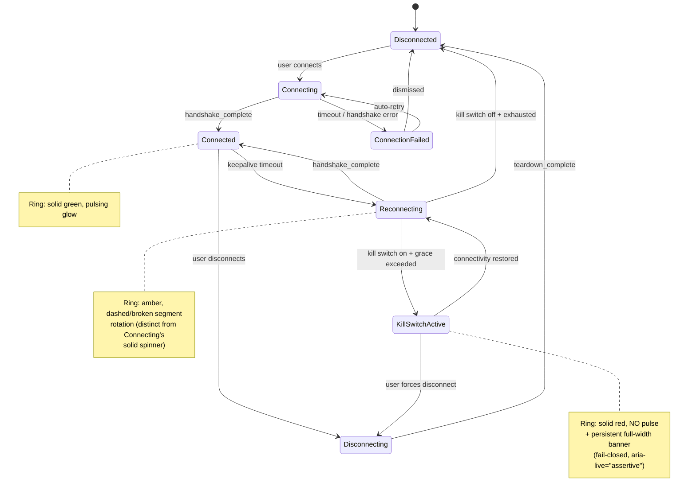
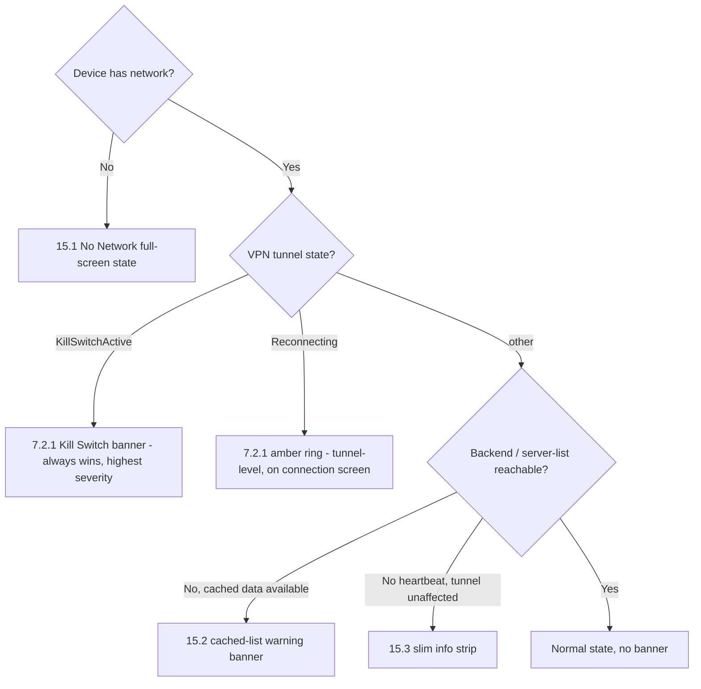

# MVP2 UI/UX Design System Specification

**Revision:** 1
**Last modified:** 2026-07-04T14:00:00Z

> **Revision 1 changelog:** Added the mandatory OpenDesign cross-reference and token
> reconciliation (§1.2/§1.3); extended §7.2 with the full canonical 7-state connection
> lifecycle visual treatment (`Reconnecting`, `KillSwitchActive`, `ConnectionFailed`) plus a
> `stateDiagram-v2` diagram; extended accessibility coverage with per-platform screen-reader
> bridge mechanics, dynamic type, and touch-target specs (§7.8–§7.11); added §11 Localization
> & i18n UX, §12 Biometric Auth Fallback UX, §13 Multi-Account/Profile Switching UX, §14
> Enterprise SSO Login UX, and §15 Offline & Degraded-Network UI States (with a `flowchart`
> precedence diagram); extended Appendix B with per-phase accessibility gates and a new Phase 6.

## Helix VPN Cross-Platform Design System

**Version:** 1.0.0  
**Date:** July 2025  
**Status:** Draft for Implementation  
**Scope:** Desktop (macOS, Windows, Linux), Mobile (Android, iOS, HarmonyOS), Web, Browser Extension  
**Frameworks:** Tauri v2 (Desktop), Flutter (Mobile), React (Web/Extension)  

---

## Table of Contents

1. [Design System Overview](#1-design-system-overview)
2. [Color System](#2-color-system)
3. [Typography](#3-typography)
4. [Layout Grid](#4-layout-grid)
5. [Component Library](#5-component-library)
6. [Screen Specifications](#6-screen-specifications)
7. [Interaction Patterns](#7-interaction-patterns)
8. [Iconography](#8-iconography)
9. [Animation & Motion](#9-animation--motion)
10. [Platform Adaptations](#10-platform-adaptations)
11. [Localization & Internationalization (i18n) UX](#11-localization--internationalization-i18n-ux)
12. [Biometric Authentication Fallback UX](#12-biometric-authentication-fallback-ux)
13. [Multi-Account / Profile Switching UX](#13-multi-account--profile-switching-ux)
14. [Enterprise SSO Login UX](#14-enterprise-sso-login-ux)
15. [Offline & Degraded-Network UI States](#15-offline--degraded-network-ui-states)

---

## 1. Design System Overview

### 1.1 Design Philosophy

The Helix VPN design system follows a **clean, minimal, security-focused** philosophy. The UI prioritizes clarity and trust, reflecting the app's core purpose: protecting user privacy. Every design decision serves the goal of making security feel effortless and approachable.

**Core Principles:**

| Principle | Description | Implementation |
|---|---|---|
| **Clarity** | Every element has a clear purpose | Minimal chrome, focused layouts, no decorative noise |
| **Trust** | Security should feel tangible | Color-coded states, clear visual feedback, transparent status |
| **Efficiency** | Primary actions are immediately accessible | One-tap connect, gesture shortcuts, contextual options |
| **Consistency** | Unified experience across all platforms | Shared design tokens, consistent interaction patterns |
| **Accessibility** | Usable by everyone | WCAG 2.1 AA compliance, screen reader support, keyboard navigation |

### 1.2 Design Tokens Approach

Design tokens are the single source of truth for all visual properties. They enable cross-platform consistency while allowing platform-specific adaptations.

```
tokens/
├── colors/                 # Color palette tokens
│   ├── primary.json       # Brand colors (teal/cyan)
│   ├── semantic.json      # Status/state colors
│   ├── surfaces.json      # Background/surface colors
│   └── text.json          # Text colors
├── typography/            # Type scale tokens
│   ├── scale.json         # Size ramp (Display -> Overline)
│   └── family.json        # Font family per platform
├── spacing/               # Spacing scale tokens
│   └── scale.json         # 4px base grid
├── elevation/             # Shadow/depth tokens
│   └── shadows.json
├── motion/                # Animation tokens
│   ├── duration.json
│   └── easing.json
└── radii/                 # Border radius tokens
    └── scale.json
```

**Token Format (JSON/CSS Variable):**
```css
/* Example: Primary token cascade */
--helix-primary-50:  #E0F2F1;   /* Teal tint */
--helix-primary-100: #B2DFDB;
--helix-primary-200: #80CBC4;
--helix-primary-300: #4DB6AC;
--helix-primary-400: #26A69A;
--helix-primary-500: #00897B;   /* Primary brand */
--helix-primary-600: #00796B;
--helix-primary-700: #00695C;
--helix-primary-800: #004D40;
--helix-primary-900: #00332C;
```

**OpenDesign is the mandatory token authority (not an inspirational reference).** The tokens shown in this document are a platform-mapping restatement of the canonical, already-built **OpenDesign** system at [`docs/design/README.md`](../../design/README.md) — specifically [`docs/design/opendesign/helix/DESIGN.md`](../../design/opendesign/helix/DESIGN.md) (9-section spec), [`docs/design/opendesign/helix/tokens.css`](../../design/opendesign/helix/tokens.css) (canonical compiled CSS custom properties, `--hx-*` prefix), [`docs/design/opendesign/helix/manifest.json`](../../design/opendesign/helix/manifest.json), and [`docs/design/opendesign/helix/components.html`](../../design/opendesign/helix/components.html). Every one of the 8 platforms' UI implementations MUST build on these tokens — this is not one option among several. This document's role is narrower and downstream: it describes **how** the `--hx-*` OpenDesign tokens map onto each platform's native UI framework (React/Tauri consumes `--hx-*` CSS custom properties directly; Flutter/Dart's `ThemeData`/`CupertinoThemeData` are generated from the same token source; QML binds `property` declarations to them for Silica; the browser extension uses the same CSS variables) and the platform-specific interaction/screen-layout decisions built on top — it does **not** re-derive token values independently. Where this document uses an unprefixed or `--helix-*`-prefixed name (a naming convention that predates the OpenDesign consolidation, e.g. `--helix-primary-500`, `--space-4`, `--radius-md`), resolve it to the canonical `--hx-*` name in `tokens.css` (`--helix-primary-500` → `--hx-primary-500`, `--space-4` → `--hx-space-4`, `--radius-md` → `--hx-radius-md`) — values are identical, only the prefix differs, and `tokens.css` is authoritative on any future drift.

**Token cross-check performed 2026-07-04:** every color hex code (§2), typography size/weight/line-height/letter-spacing value (§3), and spacing/border-radius value (§4.3/§4.5) in this document was diffed against `tokens.css` and `DESIGN.md`. Result: colors, typography, spacing, and border-radius are **consistent** (byte-identical). Two discrepancies were found and reconciled: (1) Appendix A's motion quick-sheet listed `Fast: 150ms` against the canonical `--hx-duration-fast: 100ms` — corrected there, see the inline note at Appendix A; (2) §2.2's "Semantic Opacity Variants" listed only the light-theme 0.12 alpha, omitting `tokens.css`'s distinct dark-theme 0.18 alpha override — noted inline at §2.2. No other mismatches found.

### 1.3 Cross-Platform Consistency Strategy

The design system employs a **"unified core with native skin"** approach:

- **Shared Design Tokens**: Colors, spacing, typography scales are consistent across all platforms
- **Platform-Native Components**: Widgets adapt to each platform's design language (Material 3, Cupertino, Fluent, Silica)
- **Unified Interaction Patterns**: Connection flows, state transitions, and gestures are consistent
- **Platform-Specific Chrome**: Navigation, menus, and system integration follow platform conventions

```
+-----------------------------------------------------+
|                    DESIGN SYSTEM                     |
+-----------------------------------------------------+
|  Core Layer (Shared)                                 |
|  - Color tokens, spacing, iconography               |
|  - Connection state semantics                       |
|  - Information architecture                         |
|  - Accessibility standards                          |
+----------+-------------+-------------+-------------+
|  Desktop |   Mobile    |    Web      |  Browser    |
|  (Tauri) |  (Flutter)  |   (React)   |  Extension  |
|          |             |             |             |
| - Web UI | - Material3 | - Tailwind  | - Popup UI  |
| - System | - Cupertino |   + shadcn  | - Options   |
|   tray   | - ArkUI     |             | - Content   |
| - Menu   | - Silica    |             |   script    |
+----------+-------------+-------------+-------------+
```

**OpenDesign is the Core Layer.** The "Core Layer (Shared)" box above — color tokens, spacing, iconography, connection-state semantics, accessibility standards — **is** the OpenDesign token system (`docs/design/README.md`, §1.2 above), not a parallel or duplicate abstraction maintained independently in this document. Every platform-specific "Design Adjustment" in §10 is layered strictly on top of unmodified OpenDesign tokens: a platform adaptation may change layout, chrome, density, or interaction convention, but MUST NOT redefine a color, spacing, typography, or motion token value — e.g. Windows's 8px spacing density (§10.2) or macOS's 16px card radius (§10.1) are *component-level* choices built from the same `--hx-space-*`/`--hx-radius-*` primitives, never a fork of the primitive itself.

### 1.4 Accessibility First (WCAG 2.1 AA)

All components and screens must meet **WCAG 2.1 Level AA** compliance:

**Requirements:**
- Color contrast ratio >= 4.5:1 for body text
- Color contrast ratio >= 3:1 for large text (18pt+) and UI components
- All interactive elements have visible focus indicators (`focus-visible`)
- All form inputs have associated `<label>` elements
- Dynamic content changes announced via `aria-live` regions
- Full keyboard navigation support (Tab order, Enter/Space activation)
- Touch targets minimum 44x44dp/dpx (mobile)
- `prefers-reduced-motion` respected for all animations
- Screen reader tested with NVDA (Windows), JAWS (Windows), VoiceOver (macOS/iOS), TalkBack (Android)

---

## 2. Color System

### 2.1 Primary Palette (Teal/Cyan)

The primary palette uses teal/cyan tones to evoke trust, security, and technological sophistication.

| Token | Hex | HSL | Usage |
|---|---|---|---|
| `--helix-primary-50` | #E0F2F1 | 174° 52% 91% | Lightest tint, backgrounds |
| `--helix-primary-100` | #B2DFDB | 174° 47% 78% | Hover states, light fills |
| `--helix-primary-200` | #80CBC4 | 174° 42% 65% | Secondary highlights |
| `--helix-primary-300` | #4DB6AC | 174° 38% 51% | Accent elements |
| `--helix-primary-400` | #26A69A | 174° 62% 40% | Links, active states |
| `--helix-primary-500` | #00897B | 174° 100% 27% | **Primary brand color** |
| `--helix-primary-600` | #00796B | 174° 100% 24% | Primary hover |
| `--helix-primary-700` | #00695C | 174° 100% 21% | Primary pressed |
| `--helix-primary-800` | #004D40 | 174° 100% 15% | Strong emphasis |
| `--helix-primary-900` | #00332C | 174° 100% 10% | Deepest shade |

**Secondary Cyan Accent:**

| Token | Hex | Usage |
|---|---|---|
| `--helix-accent-400` | #00BCD4 | Secondary accent, data viz |
| `--helix-accent-500` | #00ACC1 | Accent hover |
| `--helix-accent-600` | #0097A7 | Accent pressed |

### 2.2 Semantic Colors

Semantic colors convey meaning universally across all platforms.

| State | Token | Hex | RGBA | Usage |
|---|---|---|---|---|
| **Connected** | `--helix-connected` | #4CAF50 | rgba(76,175,80,1) | VPN connected, success states |
| **Connecting** | `--helix-connecting` | #FF9800 | rgba(255,152,0,1) | In-progress, warning states |
| **Disconnected** | `--helix-disconnected` | #F44336 | rgba(244,67,54,1) | VPN disconnected, offline |
| **Error** | `--helix-error` | #D32F2F | rgba(211,47,47,1) | Critical errors, destructive |
| **Warning** | `--helix-warning` | #F57C00 | rgba(245,124,0,1) | Caution, attention needed |
| **Info** | `--helix-info` | #1976D2 | rgba(25,118,210,1) | Informational messages |

**Semantic Opacity Variants:**
```css
--helix-connected-bg: rgba(76, 175, 80, 0.12);
--helix-connecting-bg: rgba(255, 152, 0, 0.12);
--helix-disconnected-bg: rgba(244, 67, 54, 0.12);
--helix-error-bg: rgba(211, 47, 47, 0.12);
--helix-warning-bg: rgba(245, 124, 0, 0.12);
--helix-info-bg: rgba(25, 118, 210, 0.12);
```

**Cross-checked against OpenDesign 2026-07-04 (§1.2):** these are the light-theme (default) alpha values and are consistent with `tokens.css`. The dark theme applies a distinct, intentionally higher alpha (**0.18**, not a re-inversion of 0.12) for these same six semantic backgrounds — see `tokens.css`'s `[data-theme="dark"]` block — for adequate visibility against dark surfaces. Implementers MUST reference `--hx-semantic-*-bg` (theme-aware) rather than hardcoding `0.12` in a dark-theme code path.

### 2.3 Latency Color Coding

Latency indicators use a traffic-light system:

| Latency Range | Color | Hex | Semantic |
|---|---|---|---|
| < 50ms | Green | #4CAF50 | Excellent |
| 50-100ms | Amber | #FF9800 | Good |
| 100-200ms | Orange | #F57C00 | Fair |
| > 200ms | Red | #F44336 | Poor |

### 2.4 Dark Theme Colors

```css
.dark {
  /* Surfaces */
  --helix-bg-primary: #0A1929;       /* Deepest background */
  --helix-bg-secondary: #132F4C;     /* Cards, panels */
  --helix-bg-tertiary: #1E4976;      /* Elevated surfaces */
  --helix-bg-elevated: #243B55;      /* Modals, dialogs */

  /* Text */
  --helix-text-primary: #F0F4F8;     /* Primary text */
  --helix-text-secondary: #8BA3B8;   /* Secondary/muted */
  --helix-text-tertiary: #5A7A94;    /* Placeholder, disabled */
  --helix-text-disabled: #3D5A80;    /* Disabled text */

  /* Borders */
  --helix-border-default: #1E4976;
  --helix-border-subtle: #132F4C;
  --helix-border-focus: #00897B;
}
```

### 2.5 Light Theme Colors

```css
.light {
  /* Surfaces */
  --helix-bg-primary: #F0F4F8;       /* Background */
  --helix-bg-secondary: #FFFFFF;     /* Cards, panels */
  --helix-bg-tertiary: #E8EDF2;     /* Elevated surfaces */
  --helix-bg-elevated: #FFFFFF;      /* Modals, dialogs */

  /* Text */
  --helix-text-primary: #0A1929;     /* Primary text */
  --helix-text-secondary: #4A6375;   /* Secondary/muted */
  --helix-text-tertiary: #8BA3B8;    /* Placeholder */
  --helix-text-disabled: #B0C4D4;    /* Disabled text */

  /* Borders */
  --helix-border-default: #C8D8E4;
  --helix-border-subtle: #E2EBF2;
  --helix-border-focus: #00897B;
}
```

### 2.6 Surface & Background Colors Summary

| Surface | Dark Theme | Light Theme |
|---|---|---|
| App background | #0A1929 | #F0F4F8 |
| Card/panel | #132F4C | #FFFFFF |
| Elevated (modal) | #1E4976 | #E8EDF2 |
| Input field | #0D2137 | #FFFFFF |
| Selected item | rgba(0,137,123,0.15) | rgba(0,137,123,0.10) |
| Hover overlay | rgba(255,255,255,0.05) | rgba(0,0,0,0.04) |
| Pressed overlay | rgba(255,255,255,0.08) | rgba(0,0,0,0.08) |
| Divider | #1E4976 | #E2EBF2 |
| Scrim (modal backdrop) | rgba(0,0,0,0.7) | rgba(0,0,0,0.5) |

---

## 3. Typography

### 3.1 Font Family Selection

| Platform | Font Stack | Fallback |
|---|---|---|
| **Desktop (Tauri)** | `system-ui, -apple-system, BlinkMacSystemFont, 'Segoe UI', Roboto, sans-serif` | sans-serif |
| **Android (Flutter)** | `Roboto` (Material 3 default) | Device sans-serif |
| **iOS (Flutter)** | `SF Pro Text/Display` (Cupertino) | Device sans-serif |
| **HarmonyOS** | `HarmonyOS Sans` | Device default |
| **Aurora OS** | `Sailfish Silica` | System font |
| **Web/Extension** | `Inter, system-ui, -apple-system, sans-serif` | sans-serif |

**Monospace (Technical Data):**
| Platform | Font | Usage |
|---|---|---|
| All | `JetBrains Mono, 'Fira Code', 'SF Mono', monospace` | IP addresses, connection stats, protocol info, keys |

### 3.2 Type Scale

The type scale follows a 1.25x ratio (major third) with a 14px base.

| Token | Size | Weight | Line Height | Letter Spacing | Usage |
|---|---|---|---|---|---|
| **Display** | 36px / 2.25rem | 300 (Light) | 1.2 | -0.5px | Connection status numbers |
| **Headline** | 28px / 1.75rem | 600 (SemiBold) | 1.3 | -0.25px | Screen titles (desktop) |
| **Title Large** | 22px / 1.375rem | 600 | 1.3 | 0 | Dialog titles, section headers |
| **Title Medium** | 18px / 1.125rem | 600 | 1.4 | 0.15px | Card titles, sub-screens |
| **Title Small** | 16px / 1rem | 500 (Medium) | 1.4 | 0.1px | List section headers |
| **Body Large** | 16px / 1rem | 400 (Regular) | 1.5 | 0.5px | Primary body text |
| **Body Medium** | 14px / 0.875rem | 400 | 1.5 | 0.25px | Default body, descriptions |
| **Body Small** | 12px / 0.75rem | 400 | 1.5 | 0.4px | Captions, metadata |
| **Caption** | 11px / 0.6875rem | 500 | 1.4 | 0.5px | Labels, timestamps |
| **Overline** | 10px / 0.625rem | 600 | 1.4 | 1.5px | Category labels, all-caps |

### 3.3 Font Weights

| Weight | Name | Usage |
|---|---|---|
| 300 | Light | Large display numbers, hero text |
| 400 | Regular | Body text, descriptions |
| 500 | Medium | Buttons, list items, emphasis |
| 600 | SemiBold | Headlines, titles, section headers |
| 700 | Bold | Critical labels, connection status |

### 3.4 Monospace Type Scale (Technical Data)

| Token | Size | Weight | Usage |
|---|---|---|---|
| Mono Large | 18px | 400 | Connection time, large stats |
| Mono Medium | 14px | 400 | IP addresses, server info |
| Mono Small | 12px | 500 | Protocol badges, key fragments |
| Mono Caption | 11px | 400 | Debug info, logs |

---

## 4. Layout Grid

### 4.1 Desktop Layout Grid

The desktop UI uses a responsive grid system with a minimum width of 360px and maximum of 1440px.

| Property | Value |
|---|---|
| Min width | 360px (small popups) |
| Max width | 1440px (full admin panel) |
| Main window | 420px (connection) / 520px (servers) / 640px (settings) |
| Gutter | 24px |
| Column count | 12 (fluid) |
| Margin | 24px (desktop), 16px (compact) |

**Desktop Window Sizes:**
| Screen | Width | Height | Purpose |
|---|---|---|---|
| Main (connected) | 420px | 600px | Primary interface |
| Main (disconnected) | 420px | 480px | Compact state |
| Server Selection | 520px | 700px | Full server list |
| Settings | 640px | 700px | Tabbed settings |
| Connection Details | 420px | 550px | Stats overlay |

### 4.2 Mobile Layout Grid

| Platform | System | Base Unit |
|---|---|---|
| Android | Material 3 | 8dp grid |
| iOS | Cupertino | 8pt grid |
| HarmonyOS | ArkUI | 4vp grid |

**Mobile Safe Areas:**
- Top: Respect `SafeArea` top inset (notch, status bar)
- Bottom: Respect `SafeArea` bottom inset (home indicator, nav bar)
- Horizontal: 16dp/dpx padding (mobile), 24dp (tablet)

### 4.3 Spacing Scale (4px Base)

All spacing uses a 4px base unit for consistency.

| Token | Value | Pixels | Usage |
|---|---|---|---|
| `--space-0-5` | 0.125rem | 2px | Icon gaps, hairline spacing |
| `--space-1` | 0.25rem | 4px | Tight component internal padding |
| `--space-2` | 0.5rem | 8px | Default component internal padding |
| `--space-3` | 0.75rem | 12px | Small component margin |
| `--space-4` | 1rem | 16px | Default padding, card gutters |
| `--space-5` | 1.25rem | 20px | Medium spacing |
| `--space-6` | 1.5rem | 24px | Section padding, dialog margins |
| `--space-8` | 2rem | 32px | Large section gaps |
| `--space-10` | 2.5rem | 40px | Section separators |
| `--space-12` | 3rem | 48px | Major section padding |
| `--space-16` | 4rem | 64px | Hero spacing, connection button margin |
| `--space-20` | 5rem | 80px | Large visual separation |

### 4.4 Responsive Breakpoints

| Token | Width | Target |
|---|---|---|
| `xs` | < 380px | Extension popup (minimum) |
| `sm` | 380-640px | Extension popup, mobile PWA |
| `md` | 640-768px | Tablet PWA, small panels |
| `lg` | 768-1024px | Tablet landscape, compact desktop |
| `xl` | 1024-1280px | Desktop standard |
| `2xl` | 1280px+ | Desktop wide, admin panel |

### 4.5 Border Radius Scale

| Token | Value | Usage |
|---|---|---|
| `--radius-none` | 0 | Sharp edges (tables, dividers) |
| `--radius-sm` | 4px | Small tags, badges |
| `--radius-md` | 8px | Buttons, inputs, small cards |
| `--radius-lg` | 12px | Cards, panels |
| `--radius-xl` | 16px | Large cards, bottom sheets |
| `--radius-2xl` | 24px | Modals, dialogs |
| `--radius-full` | 9999px | Pills, avatars, connection button |

---

## 5. Component Library

### 5.1 Desktop Components (Tauri/WebView)

#### 5.1.1 Button Variants

| Variant | Background | Text | Border | Hover | Pressed |
|---|---|---|---|---|---|
| **Primary** | #00897B | #FFFFFF | none | #00796B | #00695C |
| **Secondary** | transparent | #00897B | 1px #00897B | rgba(0,137,123,0.08) | rgba(0,137,123,0.16) |
| **Ghost** | transparent | #F0F4F8 | none | rgba(255,255,255,0.08) | rgba(255,255,255,0.12) |
| **Danger** | #D32F2F | #FFFFFF | none | #B71C1C | #9A0007 |
| **Disabled** | rgba(255,255,255,0.12) | rgba(255,255,255,0.38) | none | - | - |

**Button Specs:**
- Min height: 40px (standard), 32px (compact)
- Horizontal padding: 24px (standard), 16px (compact)
- Border radius: 8px (standard), 4px (compact)
- Font: Body Medium, 500 weight
- Icon + text gap: 8px

#### 5.1.2 Connection Toggle (Desktop)

```
+-------------------+
|  [Power Icon]     |
|                   |
|    CONNECTED      |
|  US East (23ms)   |
+-------------------+
```

- Size: 140px x 140px circular
- Connected: Fill #00897B with #4CAF50 glow pulse
- Connecting: Animated spinner on #FF9800 ring
- Disconnected: #F44336 with subtle shadow
- Border: 4px solid ring (color = state)
- Glow: 20px blur, state color at 30% opacity, pulsing
- Icon: 48px, white
- Label below: Body Large, 600 weight, state color

#### 5.1.3 Server List Item

```
+------------------------------------------+
| [FLAG]  US East - New York     [Fav] WG  |
|         23ms  * * * *  34% load          |
+------------------------------------------+
```

- Height: 64px
- Left: Flag icon (36x36px, 8px radius) + 12px gap
- Title: Body Large, 500 weight
- Subtitle: Body Small, secondary color
- Right: Favorite star + Protocol badge + Chevron
- Divider: 1px bottom border
- Selected state: Primary tint background (10% opacity)
- Hover: Hover overlay

#### 5.1.4 Protocol Badge

```
+------+
|  WG  |
+------+
```

- Size: auto-width x 20px
- Background: Primary at 10% opacity
- Text: Primary color, Caption weight 500
- Border radius: 4px
- Padding: 0 6px
- Variants: "WG" (WireGuard), "OV" (OpenVPN), "IK" (IKEv2)

#### 5.1.5 Latency Indicator

| Color | Size | Animation |
|---|---|---|
| Green (<50ms) | 8px circle | Static |
| Amber (50-100ms) | 8px circle | Subtle pulse |
| Orange (100-200ms) | 8px circle | Pulse |
| Red (>200ms) | 8px circle | Fast pulse |

- Displayed as colored dot + "23ms" label
- Dot has 4px colored glow (same color, 40% opacity)

#### 5.1.6 Settings Card/Section

- Background: bg-secondary
- Border radius: 12px
- Padding: 16px
- Section header: Title Small, primary color, uppercase
- Item height: 56px
- Divider between items: 1px border-subtle
- Left icon: 24px, primary or secondary color

#### 5.1.7 Input Fields

```
+-------------------------------+
| Label                         |
| +---------------------------+ |
| | Placeholder text       [] | |
| +---------------------------+ |
| Helper text                   |
+-------------------------------+
```

- Height: 48px
- Background: bg-primary (dark) / #FFFFFF (light)
- Border: 1px border-default
- Border radius: 8px
- Padding: 0 16px
- Font: Body Medium
- Focus: 2px border-focus outline
- Error: 2px #D32F2F outline + red helper text
- Disabled: 38% opacity

#### 5.1.8 Modal/Dialog

- Min width: 360px, Max: 560px
- Background: bg-elevated
- Border radius: 16px
- Shadow: 0 24px 48px rgba(0,0,0,0.4)
- Header: Title Large, 600 weight
- Content: Body Medium
- Actions: Right-aligned, Primary + Secondary buttons
- Backdrop: Scrim color with fade-in 150ms

#### 5.1.9 Toast Notification

```
+----------------------------------+
| [Icon]  Message              [X] |
+----------------------------------+
```

- Width: auto (max 400px)
- Height: 48px
- Background: bg-elevated
- Border left: 4px (semantic color)
- Border radius: 8px
- Shadow: 0 8px 24px rgba(0,0,0,0.3)
- Duration: 4000ms (auto-dismiss)
- Animation: Slide in from top-right, 300ms ease-out

#### 5.1.10 System Tray Menu (Desktop)

```
+----------------------------+
|  HelixVPN - Connected      |
|  US East (23ms)            |
|----------------------------|
|  [ICON] Connect            |
|  [ICON] Disconnect         |
|----------------------------|
|  [ICON] Select Server...   |
|  [ICON] Preferences...     |
|----------------------------|
|  [ICON] Quit               |
+----------------------------+
```

- Follows platform menu conventions
- macOS: NSStatusItem with template icon
- Windows: NotifyIcon with context menu
- Linux: AppIndicator/StatusNotifierItem
- Items: 28px height, 16px icon, 12px gap
- Separator: 1px line

---

### 5.2 Mobile Components (Flutter)

#### 5.2.1 Connection Button (Large Circular)

- Size: 140dp diameter
- Shape: Circle with radial gradient glow
- Connected: #00897B fill, #4CAF50 pulsing outer ring (20dp spread)
- Connecting: #FF9800 fill, rotating spinner overlay
- Disconnected: #F44336 fill, static
- Icon: 48dp, white, centered
- Shadow: 0 20px 40px state-color at 30%
- Animation: Pulse scale 1.0 -> 1.08, 1500ms ease-in-out (connected only)

#### 5.2.2 Server Selection Tile

- Height: 72dp (Material 3 ListTile)
- Leading: Country flag circle (40dp)
- Title: Body Large, 500 weight
- Subtitle: Body Small (latency dot + "23ms" + load %)
- Trailing: Protocol chips + favorite icon
- Selected: Primary tinted background
- Ripple: Platform default

#### 5.2.3 Bottom Sheet

- Initial height: 50% screen
- Max height: 90% screen
- Background: Surface color
- Top handle: 4dp x 32dp, #8BA3B8, 2dp radius
- Border radius: 24dp top corners
- Entry animation: Slide up 300ms, ease-out
- Drag to dismiss: Velocity threshold 300dp/s

#### 5.2.4 Tab Bar

- Height: 48dp (Android) / Cupertino navigation bar (iOS)
- Background: Surface color
- Indicator: 2dp height, Primary color
- Active text: Primary, 500 weight
- Inactive text: Secondary color, 400 weight
- iOS: Segmented control or bottom Cupertino tab bar

#### 5.2.5 Switch/Toggle (Platform-Adaptive)

- Android: Material 3 Switch with Primary track
- iOS: CupertinoSwitch with Primary active color
- Track: 32dp x 52dp (iOS) / 28dp x 48dp (Android)
- Thumb: 24dp (iOS) / 20dp (Android)
- Active: Primary color track
- Inactive: Surface variant track

#### 5.2.6 Text Field (Adaptive)

- Android: Material 3 OutlinedTextField with Primary focus
- iOS: CupertinoTextField with subtle border
- Height: 56dp (Android) / 44dp (iOS)
- Border radius: 8dp
- Focus: 2dp Primary outline
- Error: 2px #D32F2F outline

#### 5.2.7 Card

- Background: Surface color
- Border radius: 16dp
- Elevation: 0 (flat), shadow for elevated
- Padding: 16dp
- Content: Title + body + optional actions

#### 5.2.8 Speed Graph/Sparkline

- Height: 80dp
- Width: Parent full width
- Download line: #00897B, 2dp stroke
- Upload line: #00BCD4, 2dp stroke, dashed
- Fill: Gradient fade to transparent (line color 20%)
- Grid: Dotted horizontal lines at 25/50/75%
- Labels: Mono Caption, secondary color
- Update interval: 1000ms

#### 5.2.9 Data Usage Indicator

```
+----------------------------------+
| Download      |  Upload          |
| [==== 1.2 GB] | [==== 340 MB]   |
| 45% of limit  |                  |
+----------------------------------+
```

- Two-column layout
- Value: Mono Medium, 500 weight
- Bar: 4dp height, full border radius
- Fill: Primary (download), Accent (upload)
- Background: Surface variant

#### 5.2.10 Quick Settings Tile (Android)

- Size: 1x1 tile (standard QS tile)
- Active: Primary color background, white icon
- Inactive: Surface color, secondary icon
- Label: "Helix VPN" / "Helix VPN: ON"
- Toggle animation: Color crossfade 200ms
- Long-press: Opens app

---

### 5.3 Aurora OS Components (Silica)

#### 5.3.1 Pulley Menu

- Trigger: Pull down from top edge
- Background: Primary color, dark theme
- Items: 56px height, white text
- Icon: 24px left-aligned
- Selection highlight: rgba(255,255,255,0.15)
- Animation: Slide down from top, items stagger 50ms

#### 5.3.2 Context Menu

- Trigger: Long-press on list items
- Background: Elevated surface
- Items: 48px height, Body Medium
- Divider: 1px subtle
- Animation: Fade in 150ms + scale from anchor point

#### 5.3.3 List Item (Silica Style)

- Height: 80px (standard), 64px (compact)
- Background: Transparent
- Primary label: Body Large, text-primary
- Secondary label: Body Small, text-secondary
- Icon: 32px, left-aligned, 16px padding
- Divider: 1px bottom border-subtle
- Pressed: rgba(255,255,255,0.08) overlay

#### 5.3.4 Text Field (Silica Style)

- Background: Surface color
- Border: 1px border-default, no radius (Silica rectangular)
- Height: 48px
- Font: Body Medium
- Placeholder: text-tertiary
- Focus: 2px Primary underline
- Error: 2px #D32F2F underline

#### 5.3.5 Slider

- Track height: 4px
- Active track: Primary color
- Inactive track: Surface variant
- Thumb: 20px circle, Primary fill, 2px white border
- Value label: Floating tooltip above thumb

#### 5.3.6 Dialog (Silica)

- Width: 90% screen, max 480px
- Background: Elevated surface
- Border radius: 8px (Silica style)
- Header: Title Medium, 600 weight
- Content: Body Medium
- Actions: Full-width buttons stacked
- Entry: Fade 200ms + slight scale

#### 5.3.7 Cover Page

- Size: 1:1 square (app cover)
- Background: Gradient from Primary-800 to Primary-900
- Connection status: Centered large dot (12px) + state text
- Server: Caption text below status
- Animation: Dot pulse glow matching state color
- Ambiance: Respects system ambiance settings

---

## 6. Screen Specifications

### 6.1 Desktop Screens

#### 6.1.1 Main Window (Connected State)

```
+----------------------------------+
|  [TRAY]  Helix VPN         [_][X] |
+----------------------------------+
|                                  |
|  [Server Selector Bar]           |
|  [US Flag] US East - New York >  |
|                                  |
|         +----------+             |
|         | [POWER]  |  <- Large   |
|         | CONNECTED|    toggle   |
|         +----------+             |
|          (glowing ring)          |
|                                  |
|  Connected                       |
|  23ms latency                    |
|                                  |
|  IP: 203.0.113.45                |
|  Protocol: WireGuard             |
|  Duration: 02:34:18              |
|                                  |
|  [Speed graph sparkline]         |
|                                  |
|  Download: 1.2 GB  Upload: 340MB |
|                                  |
+----------------------------------+
```

**Specs:**
- Window: 420px x 600px
- Background: bg-primary
- Server selector: 64px height, bg-secondary, 12px radius
- Connection button: 140px circle, centered
- Status text: Title Medium, #4CAF50
- Info panel: bg-secondary card, 12px radius, Mono Small text
- Speed graph: 80px height, full width minus 32px padding
- Data usage: Two-column flex layout

#### 6.1.2 Main Window (Disconnected State)

- Window: 420px x 480px (compact)
- Connection button: 140px, #F44336 fill
- Status: "Disconnected", Title Medium, #F44336
- Info panel hidden
- Prompt: "Tap to connect securely", Body Small, secondary

#### 6.1.3 Server Selection

- Window: 520px x 700px
- Search bar: Sticky top, 48px height
- Quick connect: "Optimal Location" tile, 56px
- Section headers: "Favorites", "All Locations" - Overline style
- Server list: Scrollable, items 64px height
- Country groups: Collapsible accordion
- Latency sort: Default (ascending)
- Selected: Primary tint background + checkmark

#### 6.1.4 Settings (Tabbed)

- Window: 640px x 700px
- Tabs: General | Connection | Account | Advanced
- Tab height: 40px
- Content: Settings cards in vertical scroll
- Each card: bg-secondary, 12px radius, 16px padding
- Card title: Title Small, primary color
- Card items: 56px height rows

#### 6.1.5 Connection Details / Stats

- Overlay modal or separate tab
- Real-time: Download/upload speed (Display size)
- Connection time: Mono Large, counting up
- Protocol info: Badge + details
- Server info: Flag + name + IP
- Encryption: Cipher info in monospace
- Graphs: 5-minute rolling sparkline

---

### 6.2 Mobile Screens

#### 6.2.1 Connection (Home Screen)

```
+---------------------------+
| [Menu] Helix VPN  [Cog]   |
+---------------------------+
|                           |
|  [Server Bar]             |
|  [US] US East        23ms |
|                           |
|         +-----+           |
|         |  O  |           |
|         +-----+           |
|      CONNECTED            |
|                           |
|  [Connection Stats Card]  |
|  IP: 203.0.113.45         |
|  Time: 02:34:18           |
|  Protocol: WireGuard      |
|                           |
|  [Speed Sparkline]        |
|                           |
|  DL: 45 Mbps  UL: 12 Mbps |
|                           |
+---------------------------+
```

**Specs:**
- Full screen, SafeArea respected
- App bar: 56dp, transparent or surface
- Server bar: 72dp, tappable, navigates to server list
- Connection button: 140dp circle, centered vertically
- Status text: Title Medium below button
- Stats card: bg-secondary, 16dp radius, 16dp margin
- Bottom section: Speed + data, Body Small

#### 6.2.2 Server Selection

- Full screen with search AppBar
- Search field: 56dp, bg-secondary
- Quick connect: "Optimal Location" tile, 72dp
- Favorites section: Horizontal scroll chips
- Country groups: Expandable
- Items: 72dp ServerListTile
- Sort options: Latency (default), Load, Name, Distance
- Filter: Protocol, Streaming, P2P

#### 6.2.3 Settings

- Sections: Connection, Auto-Connect, Security, App, Account, About
- Section header: Overline, Primary color
- Items: Material ListTile, 56dp height
- Toggle items: Switch trailing
- Navigation items: Chevron trailing
- Sub-screens: Push navigation (slide in from right)

#### 6.2.4 Split Tunneling Configuration

- Tab bar: Off | Include | Exclude
- Mode explanation: Info banner at top
- App list: Checkbox tiles with app icons
- Search: Filter installed apps
- Save button: Bottom sticky, full width
- iOS limitation: Show warning about app enumeration restrictions

#### 6.2.5 Connection Stats

- Real-time speed: Display size, Mono
- Session duration: Mono Large, counting
- Total data: Download/Upload counters
- Graph: 5-minute sparkline, full width
- Protocol details: Expandable card
- Server info: Location, IP, load

#### 6.2.6 Support / Help

- Search FAQ at top
- Categories: Cards in grid (2 columns)
- Contact options: Chat, Email
- Diagnostics: "Send logs" button
- Version info: Caption at bottom

---

## 7. Interaction Patterns

### 7.1 Connection Flow Animation

```
DISCONNECTED -> CONNECTING -> CONNECTED
     |              |              |
   Red dot     Spinning ring   Green glow
   Static      Amber color     Pulse animation
                              Checkmark appears
```

**Phase 1: Initiate (0-500ms)**
- Button press: Scale to 0.95, 100ms
- Ring color transition: Red -> Amber, 200ms
- Spinner appears: Fade in + start rotation

**Phase 2: Handshake (500ms-2000ms)**
- Spinner: Continuous rotation (360deg/1500ms)
- Status text: "Connecting..." fade in
- Optional: Progress ring around button

**Phase 3: Success (2000ms+)**
- Ring color: Amber -> Green, 300ms
- Spinner fades out, checkmark scales in (0->1, 400ms bounce)
- Glow effect: 20px blur, Green at 30%, pulse loop begins
- Status: "Connected" text + server info slide up
- Stats panel: Slide in from bottom, 400ms

**Disconnect Flow:**
- Reverse of connect
- Green -> Red transition, 300ms
- Stats panel slides out
- Glow fades

### 7.2 State Transitions

| Transition | Duration | Easing | Visual |
|---|---|---|---|
| Button press | 100ms | ease-out | Scale 0.95 |
| Color change | 200ms | ease-in-out | Crossfade |
| Panel slide | 400ms | cubic-bezier(0.4, 0, 0.2, 1) | translateY |
| Fade in | 300ms | ease-out | opacity 0->1 |
| Scale in | 400ms | spring(1, 80, 10) | scale 0->1 |
| Page push (mobile) | 300ms | ease-in-out | translateX |
| Bottom sheet | 300ms | ease-out | translateY |

### 7.2.1 Full Connection-State Visual Treatment (Canonical 7-State Machine)

§7.1's Phase 1-3 connect animation and "Disconnect Flow" cover only 3 of the 7 states in the canonical connection lifecycle state machine owned by `helix-vpn-engine` (`MVP2_ARCHITECTURE.md` §5.6, mirrored in `MVP2_SHARED_CORE.md`'s `ConnectionStatus` enum, Revision 2). No platform UI may invent additional states or skip a distinct treatment for any of the following — every platform's connection button, status text, glow/ring, and screen-reader announcement MUST switch over exactly this set:

| State | Ring/Glow | Motion | Status Text | Screen-Reader Announcement | Notes |
|---|---|---|---|---|---|
| `Disconnected` | `--hx-semantic-disconnected` (#F44336), static, no glow | Static shield-off icon | "Disconnected" | "Disconnected. Not protected." | §6.1.2 / §6.2.1 |
| `Connecting` | `--hx-semantic-connecting` (#FF9800) ring, solid rotating spinner | 360°/1500ms | "Connecting…" | "Connecting to \<server\>…" | First-ever handshake attempt, §7.1 Phase 1-2 |
| `Connected` | `--hx-semantic-connected` (#4CAF50), pulsing glow | Checkmark scale-in, pulse loop | "Connected" | "Connected to \<server\>, \<n\> milliseconds latency" | §7.1 Phase 3 |
| `Reconnecting` | `--hx-semantic-connecting` (#FF9800) ring, **dashed/broken segment** rotation — deliberately distinct from `Connecting`'s solid spinner | Dashed ring segment rotates, no checkmark | "Reconnecting…" (never plain "Connecting…") | "Connection lost, reconnecting automatically. Your traffic is paused." | Distinguishing this from `Connecting` is the UX gap `MVP2_SHARED_CORE.md` Revision 2 closed at the engine layer; this row is its UI-layer close-out |
| `KillSwitchActive` | `--hx-semantic-error` (#D32F2F) solid ring, **no pulse** (deliberately static/alarming) + full-width banner | Static lock/shield-blocked icon | "Kill Switch Active — All traffic blocked" (persistent banner, never a toast) | "Kill switch active. All network traffic is blocked until the VPN reconnects." (`aria-live="assertive"`, interrupts other announcements) | MUST be visually distinct from generic `Error` — see banner spec below |
| `Disconnecting` | Transitional `--hx-semantic-connected` → `--hx-semantic-disconnected` crossfade, 300ms | Brief spinner or simple fade, no checkmark | "Disconnecting…" | Skip announcement if state is <300ms (avoids AT chatter) | §7.1 "Disconnect Flow" |
| `ConnectionFailed` | `--hx-semantic-error` (#D32F2F), static, one-time shake micro-interaction on entry (300ms, respects reduced-motion) | Alert-triangle icon | "Connection Failed" + inline retry button | "Connection failed. \<reason\>. Retry available." | Reached only from `Connecting` — never had a successful session yet; distinct from `Reconnecting` per `MVP2_SHARED_CORE.md` |

**Kill Switch banner (all platforms):** a full-width, non-dismissible-until-state-exits banner using `--hx-semantic-error` at full opacity (not the 12%/18% tint used for inline hints elsewhere in this system) — the one semantic state where the strong, non-tinted color is intentional, since it communicates an active traffic block rather than an informational hint. Desktop: banner docked below the title bar. Mobile: banner docked below the app bar, persists across navigation while the state holds. Aurora: banner replaces the pulley-menu label area (§5.3.1). See `MVP2_SECURITY_PERFORMANCE.md` §2 for the fail-closed firewall behavior this banner reports on.



This diagram is the UI-layer rendering companion to the authoritative engine state diagram in `MVP2_ARCHITECTURE.md` §5.6 — transition labels are abbreviated here for visual-treatment clarity; the engine document is authoritative for exact trigger conditions.

### 7.3 Pull-to-Refresh

- Trigger: Pull down past 64dp on scrollable lists
- Indicator: Circular progress, Primary color
- Release threshold: 80dp
- Animation: Rotation + arc sweep
- Haptic: Light impact at threshold (iOS)
- Completion: Snap back 200ms

### 7.4 Swipe Actions (Mobile)

| Direction | Action | Target |
|---|---|---|
| Swipe left (server) | Delete favorite | Server list item |
| Swipe right (server) | Quick connect | Server list item |
| Swipe left (setting) | Reset to default | Settings item |

- Action width: 72dp
- Background: Semantic color (green for connect, red for delete)
- Icon: 24dp, white
- Full swipe: Auto-execute action

### 7.5 Long-Press Menus

- Trigger: 500ms long press
- Menu: Context menu / Bottom sheet (adaptive)
- Items: Copy IP, View details, Quick actions
- Haptic: Medium impact on trigger
- Dismiss: Tap outside or back gesture

### 7.6 Keyboard Navigation (Desktop)

| Key | Action |
|---|---|
| Tab | Move focus forward |
| Shift+Tab | Move focus backward |
| Enter/Space | Activate focused element |
| Escape | Close modal/dialog/menu |
| Ctrl+K | Quick connect/disconnect |
| Ctrl+Shift+S | Open server selection |
| Ctrl+, | Open preferences |
| Ctrl+Q | Quit application |

- Focus ring: 2px Primary outline, 2px offset
- Focus visible: Only on keyboard navigation (not mouse click)

### 7.7 Screen Reader Support

- All interactive elements have descriptive `aria-label`
- Connection state changes announced via `aria-live="polite"`
- Server selection announces: "Connected to US East, 23 milliseconds latency"
- Status updates: "Connection lost, reconnecting"
- Landmark regions: `main`, `navigation`, `complementary`
- Skip links for main content

### 7.8 Per-Platform Screen-Reader Bridge Mechanics

§7.7 states the content-level requirements (`aria-label`, `aria-live`, landmarks). Five of this system's 8 platforms are **not** native-widget UI trees (Tauri = WebView-hosted HTML/CSS/JS, Flutter = Skia/Impeller-rendered widget tree, QML = Qt Quick scene graph), so the accessibility tree the OS screen reader walks is not automatically populated the way a native UIKit/AppKit/Win32 tree is — each framework requires an explicit bridge:

| Platform | UI Tree | OS Screen Reader | Bridge Mechanism |
|---|---|---|---|
| macOS / Windows / Linux (Tauri) | WKWebView / WebView2 / WebKitGTK (HTML DOM) | VoiceOver / Narrator / Orca | The DOM `role`/`aria-*` attributes from §7.7 are read directly by the WebView's built-in accessibility adapter (WKWebView exposes the DOM tree to VoiceOver via `AXWebArea`; WebView2 via UIA; WebKitGTK via AT-SPI) — no additional native bridge code needed, but a `<div>` with only a click handler and no `role`/`aria-label` is invisible to the OS tree regardless of platform. |
| Android / iOS / HarmonyOS (Flutter) | Skia/Impeller-rendered widget tree (not a native view hierarchy) | TalkBack / VoiceOver / HarmonyOS screen reader | Flutter's `Semantics` widget tree is compiled by the engine into the platform's native accessibility tree (`SemanticsNode` → Android `AccessibilityNodeInfo` / iOS `UIAccessibilityElement`). Every custom-painted widget (the connection toggle's glow ring, the speed-graph sparkline, §5.2.8) MUST be wrapped in an explicit `Semantics(label:, value:, button: true, liveRegion: true)` — Flutter does **not** infer semantics from pixels; an un-annotated `CustomPaint` is a silent accessibility hole. |
| Aurora OS (Qt6/QML) | Qt Quick scene graph | Orca (via AT-SPI, where Aurora exposes it) / Aurora's Silica accessibility layer | Each interactive QML `Item` MUST set the `Accessible` attached property (`Accessible.role`, `Accessible.name`, `Accessible.description`) — Qt Quick items have no accessibility representation by default; custom `Item` subclasses used for the connection toggle (§5.3) and cover page (§5.3.7) MUST implement `QAccessibleInterface` or set the attached properties explicitly. |
| Web Extension (React) | Browser DOM | NVDA / JAWS / VoiceOver / Orca (via the host browser) | Standard DOM ARIA, same mechanism as Tauri's WebView — the popup and options page ARE plain web pages read natively by the browser's own accessibility tree. |

**Verification note:** a bridge that is wired but never exercised is unverifiable — screen-reader coverage MUST be confirmed by actually running the platform's screen reader against the rendered build (VoiceOver/TalkBack/Orca/NVDA), never by code-reading the `Semantics`/`aria-*`/`Accessible` annotations alone.

### 7.9 Dynamic Type / Font-Scaling Support

All ten typography tokens (§3.2) and four monospace tokens (§3.4) MUST scale with the platform's user-controlled text-size setting — a fixed-px implementation that ignores OS-level scaling is a WCAG 2.1 AA 1.4.4 (Resize Text) failure:

| Platform | Mechanism | Scale Range | Layout Behavior at Max Scale |
|---|---|---|---|
| macOS / Windows / Linux (Tauri) | CSS `rem` units (already used throughout §3.2) respond to the OS/browser base font-size | Up to 200% (WCAG 1.4.4 minimum) | Server list item (§5.1.3) and settings row (§5.1.6) grow to accommodate wrapped labels rather than truncating; the 140px connection button does **not** scale — it is icon-only, text lives outside it |
| Android (Flutter) | `MediaQuery.textScaler` — every `Text` widget MUST read the ambient text scaler, never a hardcoded `fontSize` | Up to 200% (Android "Font size" + "Display size", compounding) | Bottom nav labels truncate to icon-only beyond 150% scale; server list switches to two-line subtitle layout |
| iOS (Flutter/Cupertino) | `MediaQuery.textScaler` mapped from `UIContentSizeCategory`, including the accessibility sizes (`AX1`-`AX5`, up to ~310%) | Up to ~310% (Dynamic Type accessibility range) | At `AX` sizes, `CupertinoListTile` rows support multi-line mode; the 140dp connection button remains fixed-size (icon+glow only) |
| HarmonyOS (Flutter+ArkUI) | `MediaQuery.textScaler`, HarmonyOS system font-scale setting | Up to 200% | Same reflow rules as Android |
| Aurora OS (QML/Silica) | Silica `Theme.fontSizeXXXXXX` tokens already scale with Aurora's system-wide "Font size" setting; QML text elements MUST bind to `Theme.fontSize*`, never a hardcoded `px` | Aurora's 5-step system font-size setting | Silica list items (§5.3.3) grow height automatically per Silica's own layout rules |

### 7.10 Minimum Touch Target Sizes (Mobile)

Per §1.4, all interactive elements on touch platforms (Android/iOS/HarmonyOS/Aurora) MUST provide a minimum hit target of **44×44dp/pt** (WCAG 2.1 AA 2.5.5), independent of the element's *visual* size:

- Server list favorite star (visually 20px, §8.2) → hit target padded to 44×44dp via invisible tap-area expansion, not a visually larger icon.
- Protocol badge (visually 20px tall, §5.1.4/§5.2.x) is informational-only, never itself a tap target — the entire server list row (64dp/72dp, already ≥44dp) is the tap target.
- Swipe-action buttons (§7.4, 72dp width) already exceed the floor.
- Connection toggle (140dp) exceeds the floor by a wide margin.
- Toast dismiss `[X]` (§5.1.9, visually 16px icon) → 44×44dp tap area required despite the toast's compact 48px height — pad the touch zone around the icon rather than shrinking the toast to fit a small icon.

### 7.11 Accessibility Testing Checklist (Per Phase)

Extends Appendix B with a dedicated per-phase accessibility gate — a phase does not exit "done" until its row here is checked (see Appendix B for the phase-by-phase checklist this table pairs with):

| Phase | Accessibility Gate |
|---|---|
| Phase 1 (Foundation) | Color contrast validated ≥4.5:1 body / ≥3:1 large-text + UI components, both themes, all custom palettes (§1.2 OpenDesign presets) |
| Phase 2 (Core Components) | Every component has a keyboard-operable equivalent (§7.6) + an `aria-label`/`Semantics`/`Accessible.name` equivalent (§7.8) |
| Phase 3 (Screen Layouts) | Landmark regions present (desktop/web); Flutter `Semantics` traversal order matches visual reading order; QML `Accessible` focus order matches visual order |
| Phase 4 (Interactions) | Reduced-motion fallback verified per animation (§9.5); dynamic-type reflow verified at 150%/200%/max-scale (§7.9) on every screen |
| Phase 5 (Polish) | Live screen-reader pass — VoiceOver (macOS+iOS), TalkBack (Android), NVDA + Orca (Linux), Narrator (Windows) — against the actual rendered build, not code inspection alone; 44×44dp touch-target audit (§7.10) on every tappable element |

---

## 8. Iconography

### 8.1 Icon Set Requirements

**Unified icon set across all platforms:**
- Style: Outlined (line weight 1.5px-2px), rounded caps
- Size variants: 16px, 20px, 24px, 32px, 48px
- Color: Inherits text color by default
- Platform icon libraries:
  - Desktop/Web: Lucide React (or Phosphor Icons)
  - Mobile (Android): Material Symbols Outlined
  - Mobile (iOS): SF Symbols
  - Aurora: Sailfish Silica icons

### 8.2 Core Icon Inventory

| Icon | Name | Usage | Platforms |
|---|---|---|---|
| Power | `power` / `power_settings_new` | Connection toggle | All |
| Shield | `shield` / `shield.checkered` | Security status | All |
| Shield Check | `shield-check` | Protected state | All |
| Globe | `globe` | Server/location | All |
| Server | `server` | Server list | All |
| Settings | `settings` / `gearshape` | Preferences | All |
| Chevron Right | `chevron-right` | Navigation | All |
| Chevron Down | `chevron-down` | Expand | All |
| Search | `search` / `magnifyingglass` | Search | All |
| Close | `x` / `xmark` | Close/dismiss | All |
| Check | `check` / `checkmark` | Selected | All |
| Star | `star` / `star.fill` | Favorite | All |
| Clock | `clock` | Duration/time | All |
| Speed | `gauge` / `speedometer` | Speed test | All |
| Download | `download` / `arrow.down` | Download data | All |
| Upload | `upload` / `arrow.up` | Upload data | All |
| Lock | `lock` | Secure/encrypted | All |
| Lock Open | `lock-open` | Unsecured | All |
| Wifi | `wifi` | Network | All |
| Wifi Off | `wifi-off` | No network | All |
| Alert | `alert-triangle` | Warning | All |
| Info | `info` | Information | All |
| Trash | `trash` | Delete | All |
| Refresh | `refresh-cw` | Refresh/retry | All |
| Menu | `menu` | Hamburger menu | All |
| Help | `help-circle` | Support | All |
| Log Out | `log-out` | Sign out | All |

### 8.3 Platform-Specific Icons

#### System Tray Icon (Desktop)

| State | macOS | Windows | Linux |
|---|---|---|---|
| Disconnected | Template PNG (B&W) | .ico 16x16 | PNG 22x22 |
| Connected | Template + green dot | .ico + overlay | PNG + badge |
| Connecting | Template + amber dot | .ico + overlay | PNG + badge |
| Error | Template + red dot | .ico + overlay | PNG + badge |

- macOS: Use template image for dark mode compatibility
- Badge dot: 8px diameter, bottom-right offset
- Tooltip: "HelixVPN - Connected (US East)"

#### App Icon (All Platforms)

- Primary: Teal (#00897B) shield/globe motif
- Format: SVG source, exported to all platform sizes
- Sizes: 16, 32, 48, 72, 96, 128, 144, 192, 256, 512, 1024px
- Shape: Adaptive (Android), Rounded corners (iOS), Square (desktop)
- Background: Transparent or Primary-900

#### Notification Icon

- Android: Monochrome vector drawable, white on notification background
- iOS: App icon with tinted overlay
- Desktop: Platform-native notification with app icon

#### Quick Settings Icon (Android)

- Size: 24dp (standard QS icon)
- Style: Monochrome, white fill
- States: Disconnected (outline), Connected (filled)
- Label: "Helix VPN"

#### Extension Icon (Browser)

- Toolbar: 16px, 32px (PNG)
- Extension page: 48px, 128px
- Manifest: 16, 32, 48, 128px
- Color: Follows connection state badge overlay

---

## 9. Animation & Motion

### 9.1 Connection Animation

**Button Pulse (Connected State):**
```
Animation: scale 1.0 -> 1.08 -> 1.0
Duration: 1500ms
Easing: ease-in-out
Iteration: Infinite
Target: Outer glow ring + shadow
```

**Ripple Effect (On Connect):**
```
Origin: Button center
Animation: Scale from 0 to 4x, opacity 0.5 -> 0
Duration: 600ms
Easing: ease-out
Color: Primary at 20%
```

**Status Glow:**
```
Connected: Green glow, 20px blur, pulse opacity 0.2 -> 0.4
Connecting: Amber glow, rotating sweep gradient
Disconnected: No glow, static red
Error: Red pulse, 800ms (faster than connected)
```

### 9.2 Page Transitions

**Desktop:**
- Modal: Fade in backdrop (200ms) + scale content (300ms, spring)
- Page switch: Crossfade 200ms
- Drawer: Slide from right, 300ms ease-out

**Mobile (Android):**
- Push: Slide in from right (enter) + fade out (exit), 300ms
- Pop: Slide out to right (exit) + fade in (enter), 300ms
- Bottom sheet: Slide up 300ms, drag dismiss with velocity

**Mobile (iOS):**
- Push: Slide in from right, 350ms, Cupertino transition
- Pop: Slide out to right, 350ms
- Modal: Cover vertical, 400ms

### 9.3 Loading States

**Skeleton Loading:**
- Background: Surface color
- Shimmer: Linear gradient sweep, 1200ms
- Shape: Rounded rectangles matching content
- Trigger: Data fetch > 300ms

**Spinner:**
- Size: 24px (small), 40px (medium), 56px (large)
- Stroke: 3px, Primary color
- Duration: 1000ms per rotation
- Track: Surface variant, 20% opacity

**Progress Bar:**
- Height: 4px (linear), 48px (circular)
- Fill: Primary gradient
- Track: Surface variant
- Animation: Smooth width transition, 300ms

### 9.4 Micro-Interactions

| Interaction | Trigger | Animation | Duration |
|---|---|---|---|
| Button hover | Mouse over | Scale 1.02, subtle lift | 150ms |
| Button press | Mouse down | Scale 0.98 | 100ms |
| Toggle switch | Tap | Thumb translateX + color | 200ms |
| Checkbox | Tap | Checkmark stroke draw | 200ms |
| Radio | Tap | Dot scale in (spring) | 200ms |
| Card hover | Mouse over | translateY -2px, shadow increase | 200ms |
| List item tap | Touch | Ripple from touch point | 400ms |
| Refresh | Pull | Rotation + arc sweep | 1000ms |
| Toast | Trigger | Slide in from top-right | 300ms |
| Copy feedback | Tap copy | Checkmark flash | 500ms |

### 9.5 Reduced Motion Support

All animations respect `prefers-reduced-motion: reduce`:

```css
@media (prefers-reduced-motion: reduce) {
  *, *::before, *::after {
    animation-duration: 0.01ms !important;
    animation-iteration-count: 1 !important;
    transition-duration: 0.01ms !important;
  }
}
```

**Reduced Motion Fallbacks:**
- Pulse -> Static glow (no animation)
- Page transitions -> Instant
- Spinners -> Static indicator + text "Loading..."
- Ripples -> Instant opacity change
- Graphs -> Static (no draw animation)

---

## 10. Platform Adaptations

### 10.1 macOS

**Aesthetic Principles:**
- Safari-style minimal chrome
- Translucent sidebar support (vibrancy)
- Rounded window corners (system default)
- System font: SF Pro

**Native Integration:**
- MenuBarExtra: Icon + status tooltip, click to show window
- Native menu bar: HelixVPN > About, Preferences, Services, Quit
- Window: Title bar with traffic lights, no custom chrome
- Keyboard shortcuts: Cmd+K (connect), Cmd+, (prefs), Cmd+Q (quit)
- Notifications: NSUserNotification with action buttons
- Auto-start: Login item via SMLoginItemSetEnabled

**Design Adjustments:**
- Increased border radius (16px cards vs 12px default)
- Subtle shadows (macOS design language)
- Sidebar navigation for settings (3-column layout optional)
- Translucent toolbar: `window.vibrancy = 'under-window'`

### 10.2 Windows

**Aesthetic Principles:**
- Fluent Design influence (Mica/Acrylic materials where supported)
- Segoe UI font family
- Corner radius: 8px (Windows 11) / 0px (Windows 10)
- System context menu styling

**Native Integration:**
- System tray: NotifyIcon with context menu
- Jump list: Connect, Disconnect, Recent servers
- Notifications: Windows Toast with inline actions
- Installer: MSI with WiX, UAC elevation
- Auto-start: Registry Run key

**Design Adjustments:**
- Snap layouts: Window supports Windows 11 snap zones
- Title bar: Custom with Mica material on Win11
- Settings: NavigationView-style left sidebar
- Density: Slightly more compact (8px spacing vs 12px)

### 10.3 Linux

**Aesthetic Principles:**
- Adaptable to GTK/Qt themes
- Respects system accent color where possible
- Follows freedesktop.org HIG
- Font: System default (usually Cantarell, Noto Sans)

**Native Integration:**
- System tray: AppIndicator3 / StatusNotifierItem
- Desktop file: Categories=Network;Security;VPN;
- Notifications: dbus notification server
- Auto-start: .desktop file in ~/.config/autostart
- Theming: Detect GTK theme, adapt colors

**Design Adjustments:**
- Respect `GTK_THEME` for color adaptation
- Flat design (no shadows) for GNOME compatibility
- Header bar: Integrate with CSD if available
- Density: Configurable (compact/comfortable)

### 10.4 Android (Material You)

**Aesthetic Principles:**
- Material 3 design system
- Dynamic color: Primary derived from wallpaper (Android 12+)
- Rounded shapes: 12dp cards, 24dp dialogs
- Elevation: Surface tint instead of shadows

**Native Integration:**
- Quick Settings tile: 1x1 toggle in notification shade
- Foreground service: Persistent notification with controls
- App shortcuts: Long-press launcher icon for connect/disconnect
- Widget: 4x1 home screen widget with status + toggle
- Biometric: Fingerprint/face unlock for app access
- Always-on VPN: `SUPPORTS_ALWAYS_ON` metadata

**Design Adjustments:**
- Dynamic color: Use `dynamicColorScheme()` when available
- Fallback: Static teal palette on Android <12
- Navigation: Bottom nav bar (3 items: Connect, Servers, Settings)
- Status bar: Transparent with dark/light icon adaptation
- Edge-to-edge: Extend content behind system bars

### 10.5 iOS (Cupertino Design)

**Aesthetic Principles:**
- Cupertino design language
- SF Symbols iconography
- Blur effects: System materials (systemThinMaterial, etc.)
- Rounded corners: System default radii
- Font: SF Pro Text/Display

**Native Integration:**
- Control Center: VPN toggle in Settings > VPN
- Widget: Small + medium home screen widgets
- Shortcuts: Siri Shortcuts for "Connect VPN"
- Biometric: Face ID / Touch ID gate
- Push: APNs for service alerts
- URL scheme: `helixvpn://connect`, `helixvpn://disconnect`

**Design Adjustments:**
- Navigation: CupertinoNavigationBar with blur
- Lists: CupertinoFormSection.insetGrouped for settings
- Buttons: CupertinoButton with system styling
- Switches: CupertinoSwitch (slimmer than Material)
- Pickers: CupertinoPicker / modal bottom picker
- Modals: CupertinoModalPopup with sheet presentation

### 10.6 HarmonyOS (ArkUI Design Language)

**Aesthetic Principles:**
- ArkUI design language
- Smooth rounded corners: 16vp cards, 24vp dialogs
- Subtle gradients and depth
- Font: HarmonyOS Sans

**Native Integration:**
- Service widget: Form card for home screen quick connect
- VpnExtensionAbility: System VPN integration
- Notification: HMS Push Kit for alerts
- Distributed capability: Cross-device sync (future)
- Biometric: System fingerprint/face

**Design Adjustments:**
- Colors: Teal primary with HarmonyOS accent adaptation
- Cards: Elevated with subtle shadow
- Typography: HarmonyOS Sans throughout
- Animations: Smooth spring physics (ArkUI default)
- Dialogs: Centered with blur backdrop

### 10.7 Aurora OS (Silica)

**Aesthetic Principles:**
- Silica UI design language
- Dark-first design (ambiance integration)
- Edge gestures: Swipe from edges for navigation
- Pulley menus: Pull down for context actions
- Transparency and blur effects
- Font: Sailfish Silica

**Native Integration:**
- Cover page: 1x1 app cover with connection status
- Pulley menu: Pull down for connect/disconnect/server
- Ambiance: Adapt UI tint to system ambiance
- Sailfish notifications: Platform-native alerts
- D-Bus: System integration for network state

**Design Adjustments:**
- Transparency: Silica glass effect for panels
- Navigation: No bottom nav, use page stack + gestures
- Input: Silica-styled text fields with underline focus
- Lists: Sailfish list items with press overlay
- Primary action: Often in pulley menu, not always visible
- Page transitions: Silica horizontal slide with depth

---

## 11. Localization & Internationalization (i18n) UX

### 11.1 RTL Layout Mirroring

Helix VPN ships RTL locale support (Arabic, Hebrew, Persian, Urdu) across all 8 platforms. RTL is a full layout mirror, not a text-direction-only change — the following components have an explicit RTL variant:

| Component | LTR Behavior | RTL Behavior |
|---|---|---|
| Navigation chevron (§8.2 `chevron-right`) | Points right (forward = deeper into hierarchy) | Points left — swap to a dedicated `chevron-left` icon asset, do **not** CSS-transform-mirror a right-pointing glyph (produces a visually "wrong" arrowhead on some icon sets) |
| Server list row (§5.1.3/§5.2.2) | Flag+name left, chevron+badges right | Full row mirror: flag+name right, chevron+badges left — `dir="rtl"` (Tauri/React) / `Directionality.rtl` (Flutter) / `LayoutMirroring.enabled` (QML) |
| Connection-flow animation (§7.1/§7.2.1) | N/A | Unchanged — the circular connect/disconnect ring is direction-agnostic by construction; explicitly exempted from RTL variants |
| Swipe actions (§7.4, mobile) | Swipe left = delete, swipe right = quick-connect | **Swapped**: swipe right = delete, swipe left = quick-connect (swipe-to-reveal direction follows reading direction, not a fixed screen-edge convention) |
| Push navigation transitions (§9.2) | Push slides in from right | Push slides in from left |
| Speed graph / sparkline (§5.2.8) | Time flows left→right (oldest→newest) | Time flows right→left (oldest→newest); axis labels re-anchor |
| Data usage indicator (§5.2.9) | Download left, Upload right | Download right, Upload left |
| Toast slide-in (§5.1.9) | Slides in from top-right | Slides in from top-left |

Numeric/monospace content (IP addresses, latency in ms, protocol badges "WG"/"OV"/"IK", key fragments) is **never mirrored** — digits and Latin-script protocol abbreviations retain LTR internal reading order even inside an RTL row, per the Unicode Bidi Algorithm's numeric-run handling. Wrap these spans in `dir="ltr"` (Tauri/React) or an explicit `TextDirection.ltr` override (Flutter) so the bidi algorithm doesn't reorder digit groups.

### 11.2 String Length Variance

English strings are the design baseline, but German and Finnish equivalents commonly run 30–50% longer (e.g. "Connection Failed" → "Verbindung fehlgeschlagen"; "Kill Switch Active" → "Tappokytkin aktiivinen"). The layout grid (§4) accommodates this — no string-bearing component may hard-clip text with `overflow: hidden` / `TextOverflow.clip` as its only behavior:

- **Buttons (§5.1.1):** width is content-driven (`min-width` floor only), not fixed-width; a translated label exceeding ~2× the English baseline wraps to two lines (`min-height: 40px` becomes a floor, not a ceiling) rather than truncating or overflowing.
- **Server list item title (§5.1.3/§5.2.2):** single-line ellipsis truncation is acceptable **only** for the city/region name; the state label ("Connected"/"Reconnecting"/etc., §7.2.1) is **never** ellipsis-truncated — a truncated safety-critical state word is a trust-defeating failure mode for a security product.
- **Settings rows (§5.1.6/§6.2.3):** the 56px row height is a floor, not a ceiling — rows with a wrapped two-line label grow to 72px, divider grows with it.
- **Toast notifications (§5.1.9):** `auto`-width up to 400px already; translations exceeding that wrap to a second line and grow height from 48px rather than truncating; auto-dismiss timing (4000ms) is held constant regardless of line count.
- **Kill Switch banner (§7.2.1):** the highest-stakes string in the system — explicitly exempted from any truncation; no max-height, wraps freely.

### 11.3 Locale-Aware Number & Date Formatting (Statistics Screens)

The Connection Stats / Connection Details screens (§6.1.5, §6.2.5) MUST format per the active locale, not per a hardcoded en-US convention:

- **Decimal/thousands separators:** "1.2 GB" (en-US) vs "1,2 GB" (de-DE, fr-FR) — resolved via the platform's locale-aware number formatter (`Intl.NumberFormat` for Tauri/React, `NumberFormat` from `intl`/`flutter_localizations` for Flutter, `Qt.locale().toString()` for QML) — never a hand-rolled string template with a hardcoded `.` or `,`.
- **Date/duration display:** session duration (`Mono Large`, "02:34:18") is locale-invariant and stays as-is; any *calendar date* shown (e.g. subscription renewal date in Settings > Account) MUST use the locale's date format (`DD.MM.YYYY` vs `MM/DD/YYYY` vs ISO 8601) via the platform's date formatter, never a fixed pattern.
- **RTL numeral note:** locales expecting Eastern Arabic numerals may render them via the platform's locale formatter; the monospace stat displays (§3.4) fall back to the platform's default numeral rendering for these glyphs, since the monospace technical font stack does not guarantee Eastern-Arabic-numeral coverage — verified per-locale during Phase 5 (§7.11) rather than assumed.

---

## 12. Biometric Authentication Fallback UX

Android, iOS, and HarmonyOS gate app access behind biometric auth (§10.4/§10.5/§10.6). This section specifies the on-screen flow those platform sections reference but do not detail: failure, unavailability, non-enrollment, and lockout.

### 12.1 First-Time Explainer Screen ("Why Is This Needed")

Shown once, before the first biometric prompt is ever issued (not on every app launch):

```
+---------------------------+
|  [Shield+Fingerprint       |
|      illustration]         |
|                             |
|   Protect your VPN app     |
|                             |
|  Face/Touch ID keeps your  |
|  connection settings and   |
|  account private if this   |
|  device is shared or lost. |
|                             |
|  [ Enable Face ID    ]     |
|  [ Not now            ]    |
+---------------------------+
```

- Title: Title Large. Body: Body Medium, secondary color.
- Primary button triggers the OS biometric prompt; "Not now" routes to the PIN/passcode fallback (§12.3) as the standing app-lock mechanism instead — never leaves the app entirely unlocked.
- Shown exactly once; the decision is persisted, never re-asked on cold start.

### 12.2 Biometric Prompt States

| State | Trigger | On-Screen Treatment |
|---|---|---|
| Prompting | App foreground after lock timeout | OS-native biometric sheet (Android `BiometricPrompt`, iOS `LAContext` Face/Touch ID sheet) — Helix VPN does **not** draw a custom biometric UI; a branded "waiting" screen (logo + "Unlock to continue") shows behind the OS sheet |
| Success | Match confirmed | OS sheet dismisses; app content fades in, 200ms |
| Failed (repeated) | No match / face not recognized | OS sheet shows its own native retry affordance; after 2 consecutive OS-reported failures, an inline hint appears: "Having trouble? Use PIN instead" → routes to §12.3 |
| Unavailable (hardware absent/disabled) | `canEvaluatePolicy` / `BiometricManager` reports no hardware or disabled at OS level | Skip the biometric sheet entirely, route straight to §12.3 — never show a prompt the OS has already reported as unusable |
| Not enrolled | `BIOMETRIC_ERROR_NONE_ENROLLED` / `LAError.biometryNotEnrolled` | One-time inline banner: "No Face ID/fingerprint set up on this device — using PIN" then route to §12.3; link to the OS enrollment settings page, never attempt to enroll biometrics from within Helix VPN |

### 12.3 PIN / Passcode Fallback Screen

```
+---------------------------+
|      Enter your PIN        |
|                             |
|     [ ][ ][ ][ ]           |
|                             |
|   1  2  3                  |
|   4  5  6                  |
|   7  8  9                  |
|      0  <-                 |
|                             |
|   Forgot PIN?              |
+---------------------------+
```

- 4-6 digit numeric keypad; digit dots fill left-to-right on entry.
- Incorrect PIN triggers a horizontal shake micro-interaction (§9.4-style, 300ms, respects `prefers-reduced-motion`) + dots clear + red flash on the dot row (`--hx-semantic-error`).
- "Forgot PIN?" routes to account recovery — never to a biometric-bypass shortcut.

### 12.4 Lockout Messaging After N Failed Attempts

| Failed Attempts | Treatment |
|---|---|
| 1-2 | Shake + clear only (§12.3), no additional messaging |
| 3 | Inline warning banner above the keypad: "2 attempts remaining before temporary lockout" (`--hx-semantic-warning`) |
| 5 | Keypad disables; full-screen lockout state replaces the PIN screen: "Too many attempts. Try again in 00:30." with a live countdown (Mono Medium); the timer is anchored server/OS-side, not a client-resettable timer |
| Countdown elapsed | Keypad re-enables automatically, warning clears, attempt counter resets |
| Repeated lockout cycles | Escalates to full account-level re-authentication rather than an indefinitely-repeating short lockout |

Lockout copy uses `--hx-semantic-warning`, never `--hx-semantic-error` (reserved for Kill Switch, §7.2.1) — lockout signals "temporary friction," not "critical failure."

---

## 13. Multi-Account / Profile Switching UX

Helix VPN supports switching between multiple accounts on one app instance (e.g. personal + work-issued accounts) without signing out and back in.

### 13.1 Entry Point

- **Desktop (§6.1.4 Settings):** avatar chip in the top-right of the Settings tab bar area, always visible once ≥1 account is signed in — tapping opens a dropdown/popover.
- **Mobile (§6.2.3 Settings):** avatar at the top of the Settings screen's "Account" section, a tappable row labeled with the active account's display name + a "Switch" chevron.
- **Aurora (§5.3.1 Pulley Menu):** "Switch account" pull-down item, since Aurora has no persistent settings-tab-bar chrome to anchor a corner avatar.

### 13.2 Account-Switcher Panel

```
+-------------------------------+
|  Switch account            [X]|
+-------------------------------+
| (*) [Avatar] Alex - Personal  |
|     Connected - US East       |
|                                |
| ( ) [Avatar] Alex - Acme Corp  |
|     Not connected             |
|                                |
| [+] Add another account       |
+-------------------------------+
```

- Active account: filled/selected row (`--hx-overlay-selected`), plus its own live connection-state dot (§7.2.1 state colors) inline — the panel doubles as an at-a-glance "which account is currently tunneling" view.
- Inactive accounts show their last-known state as a muted/desaturated dot, never the live color palette.
- "Add another account" routes to sign-in (email/password, social, or §14 SSO) as an *additional* login, never a replace-current-session action.

### 13.3 Switch Confirmation / Loading State

1. Tap target account row → row shows an inline spinner (24px, §9.3) replacing its radio dot, label changes to "Switching…".
2. If the currently active account has a live tunnel, the switch first runs the standard Disconnecting flow (§7.2.1) for it **before** loading the target profile — a switch never silently leaves an orphaned tunnel running for the account being switched away from.
3. On completion: full navigation reset to the target profile's home screen (§6.1.1/§6.2.1) — never a partial state merge between profiles' favorites, history, or settings.
4. Failure: revert to the previous account's panel with an inline error on the failed target row ("Couldn't switch — try again") — never leave the UI in an ambiguous "which account is this" state.

### 13.4 Per-Profile State Visual Distinction

- A persistent, small account-name/avatar chip appears in the connection screen's app bar whenever ≥2 accounts are signed in on the device — hidden entirely in the single-account case.
- Server favorites (§8.2 star), connection history, and split-tunneling config (§6.2.4) are strictly namespaced per account; switching swaps the entire favorites set and history — surfaced here because its *absence* is a privacy-relevant UX defect, not merely cosmetic.
- Each account MAY use a distinct, deterministic (hash-of-account-id) avatar tint from the OpenDesign custom-palette preset set (§1.2 — Ocean Blue/Forest/Ruby/Amethyst/Midnight) purely as a passive disambiguator in the switcher panel and app-bar chip; this is cosmetic only and MUST NOT replace the primary brand teal used for the actual connection-state UI, which stays teal regardless of which account is active.

---

## 14. Enterprise SSO Login UX

Organization-managed Helix accounts (provisioned via the MVP1 Admin API / MDM enrollment, `MVP2_ARCHITECTURE.md` §5.5/§10.2) authenticate via the organization's Identity Provider rather than Helix's own email/password or social login — MVP1's Authentication Service already supports OAuth2/OIDC, the protocol this flow drives.

### 14.1 Entry Point — "Sign In With Your Organization"

```
+-------------------------------+
|      Sign in to Helix VPN      |
|                                |
|  [ Email                    ]  |
|  [ Password                 ]  |
|  [       Sign In            ]  |
|                                |
|  -- or --                      |
|  [ G  Continue with Google  ]  |
|  [ A  Continue with Apple   ]  |
|                                |
|  ------------------------------ |
|  [ Sign in with your           |
|      organization           ]  |
+-------------------------------+
```

- The organization SSO button is visually separated (its own divider, not grouped with social buttons) since it is a categorically different flow (domain-routed OIDC discovery, not a fixed-provider OAuth button).
- Tapping it first prompts for the user's work email/organization identifier (to resolve which IdP to route to via OIDC discovery / registered domain), then performs the handoff below — never a generic "SSO" button with no routing step.

### 14.2 System-Browser Handoff (Security-Driven UX Constraint)

**This is a deliberate security constraint, not a missed polish opportunity:** the SSO flow MUST open the organization's IdP login page in the platform's system browser (`ASWebAuthenticationSession` on iOS, Chrome Custom Tabs on Android, the OS default browser process on desktop, `Qt.openUrlExternally` on Aurora) — **never an embedded WebView**. An embedded WebView under the app's own control could programmatically read the credential-entry DOM or intercept form submission; a system-browser session is isolated from the requesting app, shares the user's existing IdP session cookies (enabling silent SSO), and is the only surface that can satisfy an organization-mandated browser-based second factor (hardware-key prompts, device-trust checks).

```
+-------------------------------+
|      [Spinner]                 |
|                                |
|  Continuing in your browser…   |
|                                |
|  [ Cancel ]                    |
+-------------------------------+
```

- The app shows this holding screen (never a blank/frozen screen) the moment the system browser is invoked, with a visible "Cancel" returning to §14.1.
- The app is backgrounded/occluded on mobile while the system browser is foreground — expected OS behavior, not a bug.

### 14.3 Return-to-App State

- **Mobile:** the IdP redirects via a registered custom URL scheme / Universal Link / App Link, which the OS routes back into Helix VPN; the app resumes on the holding screen (§14.2), transitions to "Signing you in…" while exchanging the auth code for tokens, then lands on the connection home screen (§6.2.1) scoped to the SSO-provisioned account.
- **Desktop:** the IdP redirects to a local loopback URL (standard OAuth2 native-app loopback flow); the system-browser tab shows "You can close this window and return to Helix VPN," and the desktop holding screen auto-transitions the same way.
- **Failure / user cancels in browser:** return to §14.1 with a non-alarming inline message ("Sign-in was cancelled" — `--hx-semantic-info`, not `--hx-semantic-error`, since user-initiated cancellation is not a failure state).
- **Enterprise policy applied post-login:** any MDM-pushed `ManagedPolicy` (`MVP2_ARCHITECTURE.md` §5.5/§10.2 `apply_managed_policy`) takes visual effect immediately on first landing at the connection home screen — e.g. a locked server list shows a grayed-out picker with a "Managed by your organization" inline label rather than silently applying the policy with no visual acknowledgement.

---

## 15. Offline & Degraded-Network UI States

Three real-world network conditions are common enough to warrant first-class, purpose-built UI states rather than a generic error toast (§5.1.9) — a toast is transient and easy to miss; these are persistent conditions that shape what a user can and cannot do right now.

### 15.1 "No Network" (Device Has No Connectivity At All)

```
+---------------------------------+
| [Wifi-off icon]                  |
|                                   |
|   No internet connection          |
|   Helix VPN needs a network        |
|   connection to connect.           |
|                                   |
|   [ Retry ]                        |
+---------------------------------+
```

- Replaces the connection screen's primary content area; the connection toggle is shown disabled/grayed rather than hidden.
- Detected via the platform's native connectivity API (`NWPathMonitor`-class API on iOS, `ConnectivityManager` on Android, `navigator.onLine` + `online`/`offline` events for Tauri/React, Aurora's ConnMan D-Bus state) — never inferred solely from a failed connect attempt (that conflates "no network" with "server unreachable," §15.2).
- Auto-recovers the instant the OS reports connectivity restored; "Retry" remains as a manual override for flaky detection.
- Server list, favorites, and settings remain browsable (local/cached data) — only the connection toggle and network-dependent actions are disabled.

### 15.2 "Server Unreachable — Using Cached List"

```
+---------------------------------+
| Showing saved servers              |
| Couldn't refresh - using           |
| last known list (2 hours ago)      |
+---------------------------------+
| [Server list, unchanged layout]    |
+---------------------------------+
```

- A persistent banner (`--hx-semantic-warning`, not `--hx-semantic-error` — stale-but-usable data is degraded, not failed) docked above the server list (§6.1.3/§6.2.2), never a toast.
- States cache age using the locale-aware relative-time formatting from §11.3.
- The list renders normally from cache — latency/load figures are visually marked stale (latency dot, §5.1.5, at 50% opacity with a "cached" tooltip) rather than showing confidently-wrong live-looking numbers.
- Pull-to-refresh (§7.3) is the primary manual retry; the banner itself is also tappable and triggers the same refresh.

### 15.3 "Reconnecting" Banner (Distinct From the `Reconnecting` Connection State)

§7.2.1's `Reconnecting` is the VPN tunnel's own state (amber ring, dashed spinner) when a connected session's handshake drops. §15.3 covers a **different** case: the app's own background services (server-list refresh, account/session sync) losing connectivity to Helix's backend while the VPN tunnel itself may be in any state, including fully `Disconnected` — "the app can't reach Helix's servers" as opposed to "the VPN tunnel can't reach the destination network."

```
+---------------------------------+
| [Small spinner] Reconnecting to  |
| Helix services...                |
+---------------------------------+
```

- A slim, non-blocking top-of-screen strip — lighter-weight than §15.2's banner, using `--hx-semantic-info` (not warning/error), since this is an expected, usually-brief transient.
- Never appears simultaneously with the §7.2.1 `Reconnecting` tunnel-state ring in a way that could be misread as the same event — if both are true at once, the §15.1 "No Network" full-state treatment supersedes both.
- Auto-dismisses on successful reconnection with no persistent trace (unlike §15.2's cache-age banner, which persists until a fresh successful fetch).

### 15.4 State-Precedence Summary

When multiple degraded conditions could apply simultaneously, exactly one is shown — never stack multiple banners:



---

## Appendix A: Token Reference Quick Sheet

### Colors
```css
/* Primary */
#00897B (500), #00796B (600), #00695C (700)
/* Accent */
#00BCD4 (400), #00ACC1 (500)
/* Semantic */
#4CAF50 (connected), #FF9800 (connecting), #F44336 (disconnected)
#D32F2F (error), #F57C00 (warning), #1976D2 (info)
/* Dark theme bg */
#0A1929 (primary), #132F4C (secondary), #1E4976 (tertiary)
/* Light theme bg */
#F0F4F8 (primary), #FFFFFF (secondary), #E8EDF2 (tertiary)
```

### Spacing
```
4px, 8px, 12px, 16px, 20px, 24px, 32px, 40px, 48px, 64px
```

### Border Radius
```
4px (sm), 8px (md), 12px (lg), 16px (xl), 24px (2xl), 9999px (full)
```

### Animation
```
Fast: 100ms, Base: 200ms, Slow: 300ms, Page: 400ms
Easing: cubic-bezier(0.4, 0, 0.2, 1)
Spring: type-spring, damping: 20, stiffness: 300
```

> **Reconciled to OpenDesign token `--hx-duration-fast` (2026-07-04)** — was `150ms`, corrected to `100ms` to match `docs/design/opendesign/helix/tokens.css`. This also matches this document's own §7.2 "Button press" (100ms) and §9.4 "Button press" (100ms) entries, which were already correct. The `150ms` value survives only as the deliberately non-tokenized §9.4 "Button hover" duration, which is distinct from the named `fast` token and is unaffected by this fix.

---

## Appendix B: Implementation Checklist

Each phase below carries a companion accessibility gate from §7.11 — a phase is not "done" until both its own checklist and its §7.11 accessibility-gate row are green.

### Phase 1: Foundation
- [ ] Define all design tokens in JSON (sourced from OpenDesign `tokens.css` — §1.2, no independent re-derivation)
- [ ] Implement color system (dark + light themes)
- [ ] Set up typography scale per platform
- [ ] Configure spacing scale
- [ ] Implement border radius tokens
- [ ] §7.11 Phase 1 accessibility gate: contrast validated across both themes + all custom palettes

### Phase 2: Core Components
- [ ] Button variants (primary, secondary, ghost, danger)
- [ ] Connection toggle with animation
- [ ] Server list item
- [ ] Protocol badge
- [ ] Latency indicator
- [ ] Input fields
- [ ] Modal/dialog
- [ ] Toast notification
- [ ] §7.11 Phase 2 accessibility gate: keyboard + screen-reader-bridge equivalent (§7.8) per component

### Phase 3: Screen Layouts
- [ ] Desktop main window (connected/disconnected)
- [ ] Desktop server selection
- [ ] Desktop settings (tabbed)
- [ ] Mobile connection screen
- [ ] Mobile server selection
- [ ] Mobile settings
- [ ] Mobile split tunneling
- [ ] §7.11 Phase 3 accessibility gate: landmark regions + traversal/focus order verified

### Phase 4: Interactions
- [ ] Connection flow animation (full 7-state machine, §7.2.1 — not just connect/disconnect)
- [ ] State transitions
- [ ] Pull-to-refresh
- [ ] Swipe actions (incl. RTL-mirrored direction, §11.1)
- [ ] Long-press menus
- [ ] Keyboard navigation
- [ ] Screen reader support
- [ ] §7.11 Phase 4 accessibility gate: reduced-motion + dynamic-type reflow verified at 150%/200%/max-scale

### Phase 5: Polish
- [ ] Icon set implementation (incl. RTL-specific icon variants, §11.1)
- [ ] Animation system
- [ ] Reduced motion support
- [ ] Platform-specific adaptations
- [ ] Accessibility audit
- [ ] Cross-platform consistency review
- [ ] §7.11 Phase 5 accessibility gate: live screen-reader pass on rendered build (all 4 readers) + 44×44dp touch-target audit

### Phase 6: Localization, Auth Edge Cases & Network Resilience (Revision 1)
- [ ] RTL layout mirror implemented + verified for every component in §11.1's table (not CSS-transform-mirrored icons)
- [ ] String-length stress test with German/Finnish pseudo-translations (§11.2) — no clipped state labels
- [ ] Locale-aware number/date formatting on statistics screens (§11.3)
- [ ] Biometric first-time explainer + PIN/passcode fallback + lockout messaging (§12)
- [ ] Multi-account switcher entry point, panel, and per-profile state isolation (§13)
- [ ] Enterprise SSO system-browser handoff (never embedded WebView) + return-to-app state (§14)
- [ ] Offline / cached-list / reconnecting-banner states implemented with correct precedence (§15.4)

---

*Document generated: July 2025*  
*Version: 1.0.0-MVP2*  
*Classification: Design System Specification*  
*Total Platforms: 8 (macOS, Windows, Linux, Android, iOS, HarmonyOS, Aurora OS, Web Extension) — corrected from "7"; Web Extension is documented throughout this file (§5.1.10, §6, §8.3) and is platform #8 in the OpenDesign coverage matrix, `docs/design/README.md` §2.*
