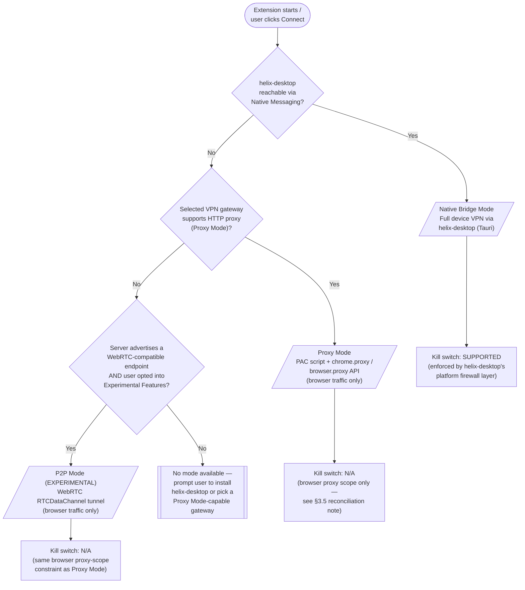
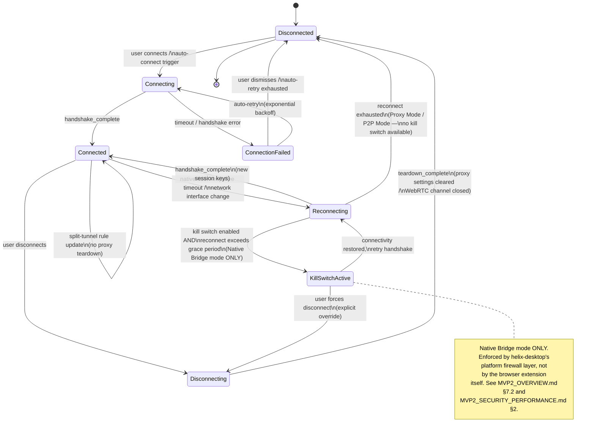
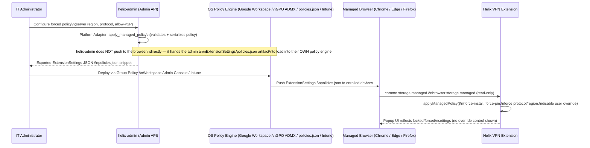

# MVP2: Web Client & Browser Extension Technical Specification

**Revision:** 3
**Last modified:** 2026-07-04T16:30:00Z

> **Revision 3 changelog:** added §10.6 "Roadmap Reconciliation Against
> `UNIFIED_PHASE_ROADMAP.md`" (the missing roadmap-reconciliation note flagged
> by the mid-session crash) and corrected §11.10's "MVP1, already complete"
> framing so this document does not perpetuate the inflated Phase-1-completion
> claim `docs/research/UNIFIED_PHASE_ROADMAP.md` §4.2 flags in
> `MVP2_OVERVIEW.md` §3.1; strengthened the §7.2 OpenDesign reconciliation
> note with the explicit canonical hex and the `docs/design/tokens/color.json`
> cross-reference (`docs/research/CROSS_CUTTING_GAP_ANALYSIS.md` §1.2).

> **Revision 2 changelog:** reconciled this document against the canonical
> cross-platform contracts in `MVP2_ARCHITECTURE.md` §2.2.5/§5.6 and
> `MVP2_SHARED_CORE.md`: named the three operating modes (Proxy Mode /
> Native Bridge / P2P Mode) explicitly with a new §1.5 and a Mermaid
> decision-flow diagram, documented the in-browser `helix-crypto` WASM
> module (§2.9 — crypto only, no in-browser WireGuard tunnel) and fixed the
> MV3 CSP snippets to permit it (`'wasm-unsafe-eval'`), corrected the
> Connection Lifecycle State Machine (§3.5) to the canonical state set with
> an explicit, honest reconciliation of why `KillSwitchActive` does not
> apply to Proxy/P2P Mode, removed three residual `OpenVPN`-as-supported
> mentions (§2.6, §3.3, §3.4 — OpenVPN is a reserved/unimplemented
> placeholder per `MVP2_SHARED_CORE.md`; the real protocol set is
> WireGuard/Shadowsocks/MASQUE), disambiguated this document's "Web Admin
> Panel" (§4) from the separate Tauri-based `helix-admin` fleet-management
> app, added a design-tokens reconciliation note (§7.2) pointing at the
> canonical OpenDesign `tokens.css`, reconciled the internal Phase 1-5 week
> numbering in §10 against the authoritative `MVP2_IMPLEMENTATION_ROADMAP.md`
> Phase 8 (calendar Weeks 28-34), and added a new §11 Enterprise Hardening
> & Production Readiness section (extension store review, auto-update,
> rollback honesty, crash/error telemetry, consent flow, offline/degraded-
> network behavior, enterprise policy push with a Mermaid sequence diagram,
> accessibility, i18n, license/entitlement checks, multi-account).

## Helix VPN - Hybrid Web Platform Architecture

**Document Version**: 1.0.0-MVP2
**Last Updated**: July 2025 (Revision 2: 2026-07-04)
**Status**: Technical Specification (DRAFT)
**Target Platforms**: Chrome 90+, Firefox 88+, Edge 90+, Safari 15+ | Web | PWA
**Platform Tier**: Tier 4 / P3 — lowest priority of all 8 MVP2 platforms; a companion for browser-level protection, NOT a full-device VPN replacement (`MVP2_OVERVIEW.md` §4.2)
**Code Reuse**: ~45% (lowest of any platform — browsers cannot create TUN interfaces or raw sockets)
**Bundle Target**: <5 MB (extension) / <3 MB (PWA)

---

## Table of Contents

1. [Web Strategy Overview](#1-web-strategy-overview)
2. [Browser Extension Architecture](#2-browser-extension-architecture)
3. [Native Messaging Protocol](#3-native-messaging-protocol)
4. [Web Admin Panel](#4-web-admin-panel)
5. [PWA Companion](#5-pwa-companion)
6. [Browser-Specific Considerations](#6-browser-specific-considerations)
7. [Web UI Design System](#7-web-ui-design-system)
8. [Security Considerations](#8-security-considerations)
9. [Build & Distribution](#9-build--distribution)
10. [Implementation Roadmap](#10-implementation-roadmap)
11. [Enterprise Hardening & Production Readiness](#11-enterprise-hardening--production-readiness)

---

## 1. Web Strategy Overview

### 1.1 The Fundamental Constraint

Web browsers operate within a strict security sandbox that makes full-device VPN functionality impossible from pure web technologies. Browsers cannot:

- Create TUN/TAP network interfaces
- Access raw sockets or packet-level networking
- Intercept system-wide traffic
- Modify OS-level routing tables
- Provide kill switch protection

> **Key Principle**: A pure web-based VPN cannot provide full-device protection. The browser sandbox blocks all mechanisms required for system-level traffic interception and tunneling.

### 1.2 Hybrid Approach: Three Web Products

Helix VPN deploys three complementary web products, each serving distinct use cases within the broader ecosystem:

```
+------------------------------------------------------------------+
|                     HELIX VPN WEB ECOSYSTEM                       |
+------------------------------------------------------------------+
|                                                                   |
|  +-------------------+  +-------------------+  +----------------+ |
|  | Browser Extension |  |   Web Admin Panel |  | PWA Companion  | |
|  |   (Product A)     |  |    (Product B)    |  |  (Product C)   | |
|  +-------------------+  +-------------------+  +----------------+ |
|  | - Proxy-based     |  | - Server mgmt     |  | - Installable  | |
|  |   browser traffic |  | - User analytics  |  |   web app      | |
|  |   protection      |  | - Config mgmt     |  | - Account mgmt | |
|  | - Quick connect   |  | - Logging/monitor |  | - Guides/Help  | |
|  | - Split tunneling |  | - Settings        |  | - Status view  | |
|  +-------------------+  +-------------------+  +----------------+ |
|           |                       |                      |        |
|  [Native Messaging]     [REST API + Auth]       [Service Worker] |
|           |                       |                      |        |
|  +-------------------+  +-------------------+  +----------------+ |
|  |  Tauri Desktop App|  |  Helix Backend    |  |  Web Frontend  | |
|  |  (WireGuard VPN)  |  |  (Go/Rust)        |  |  (Cached)      | |
|  +-------------------+  +-------------------+  +----------------+ |
|                                                                   |
+------------------------------------------------------------------+
```

### 1.3 Product Positioning Matrix

| Aspect | Browser Extension | Web Admin Panel | PWA Companion |
|--------|------------------|-----------------|---------------|
| **Primary User** | End user (daily) | Administrator | End user (fallback) |
| **VPN Function** | Proxy + Control plane | None (management) | Informational only |
| **Requires Native App** | No (standalone mode) | No | No |
| **Enhances Native App** | Yes (via Native Messaging) | N/A | No |
| **Network Traffic** | Proxies browser HTTP/HTTPS | API calls only | API calls only |
| **Offline Capability** | Limited | No | Yes (cached UI) |
| **Install Method** | Extension store | Web browser | "Add to Home Screen" |

### 1.4 Technical Foundation

Based on framework research (see `mvp2_wide01.md`), the web layer uses:

- **Frontend Framework**: React 18+ with TypeScript (shared component library)
- **Desktop Native App**: Tauri v2 (Rust backend + WebView frontend) - see `mvp2_wide01.md`
- **Extension UI**: Same React components as desktop app (shared library)
- **Admin Panel**: Next.js 14+ with SSR for SEO and performance
- **PWA**: React with Vite PWA plugin
- **Styling**: Tailwind CSS + shadcn/ui component primitives
- **State Management**: Zustand (lightweight, extension-friendly)

### 1.5 Three Operating Modes (Browser Extension)

Per the canonical cross-platform architecture (`MVP2_ARCHITECTURE.md`
§2.2.5), the Browser Extension product (Product A, §1.2 above) itself
operates in exactly three mutually-exclusive modes. This is a different
axis from the "three web products" positioning in §1.2 — both taxonomies
co-exist: §1.2 answers "which of our three web products is this?", §1.5
answers "how is the Browser Extension product currently getting VPN
protection?"

| Mode | Capability | Requirements | Where it's implemented in this document |
|------|-----------|---------------|-------------------------------------------|
| **Proxy Mode** | Routes browser traffic through a VPN gateway via a PAC script + `chrome.proxy` / `browser.proxy` API | VPN gateway with HTTP proxy support | §2.7, §2.8 |
| **Native Bridge** | Full device VPN by delegating to the `helix-desktop` Tauri app over the browser's Native Messaging API | `helix-desktop` installed on the same machine | §3 (entire section) |
| **P2P Mode** | WebRTC `RTCDataChannel`-based tunnel to a WebRTC-compatible VPN server (**experimental**) | A WebRTC-compatible VPN server endpoint | §1.5.1 below |



**Mode selection is automatic and re-evaluated on every connect attempt.**
The background service worker (§2.3) probes for `helix-desktop` first —
Native Bridge is strictly more capable (full-device coverage, kill switch
support per §3.5) — falls back to Proxy Mode, and only offers P2P Mode
when the user has explicitly opted into experimental features AND the
selected server advertises a WebRTC-compatible endpoint. A user may pin a
preferred mode in Options (§2.6) to skip the probe.

#### 1.5.1 P2P Mode (Experimental)

P2P Mode is the least mature of the three modes and is gated behind an
explicit "Experimental Features" opt-in toggle in Options (§2.6). It
establishes an `RTCDataChannel` to a WebRTC-compatible Helix VPN server,
using the same WASM crypto module (§2.9) for key exchange as the other two
modes. Known limitations, stated honestly rather than omitted:

- No kill switch (same architectural constraint as Proxy Mode — §3.5).
- No split tunneling below the domain-based PAC granularity Proxy Mode
  uses; P2P Mode is effectively all-or-nothing for the browser's traffic.
- WebRTC's own leak-prevention concerns (§2.5) apply doubly here since the
  tunnel itself is WebRTC-based — the content script's `WebRTCBlocker`
  (§2.5) is applied only to third-party page connections, NOT to the
  tunnel's own control-plane `RTCPeerConnection`.
- Not covered by the store-review "core VPN functionality" justification
  the same way Proxy Mode is (§11.1) — reviewers may ask additional
  questions about the experimental WebRTC tunnel; the store listing MUST
  disclose it as experimental.

---

## 2. Browser Extension Architecture

### 2.1 Manifest V3 Compliance

All browser extensions target **Manifest V3 (MV3)** for maximum compatibility and future-proofing.

```json
{
  "manifest_version": 3,
  "name": "Helix VPN",
  "version": "2.0.0",
  "description": "Secure browser traffic with Helix VPN proxy and desktop integration",
  "minimum_chrome_version": "109",
  "browser_specific_settings": {
    "gecko": {
      "id": "helix@helixvpn.io",
      "strict_min_version": "109.0"
    }
  },
  "permissions": [
    "proxy",
    "storage",
    "alarms",
    "nativeMessaging",
    "webRequest",
    "webRequestAuthProvider"
  ],
  "host_permissions": [
    "<all_urls>"
  ],
  "background": {
    "service_worker": "background.js",
    "type": "module"
  },
  "action": {
    "default_popup": "popup.html",
    "default_icon": {
      "16": "icons/icon-16.png",
      "32": "icons/icon-32.png",
      "48": "icons/icon-48.png",
      "128": "icons/icon-128.png"
    },
    "default_title": "Helix VPN"
  },
  "options_page": "options.html",
  "content_scripts": [
    {
      "matches": ["<all_urls>"],
      "js": ["content.js"],
      "run_at": "document_start",
      "all_frames": true
    }
  ],
  "web_accessible_resources": [
    {
      "resources": ["injected.js"],
      "matches": ["<all_urls>"]
    }
  ],
  "icons": {
    "16": "icons/icon-16.png",
    "32": "icons/icon-32.png",
    "48": "icons/icon-48.png",
    "128": "icons/icon-128.png"
  },
  "content_security_policy": {
    "extension_pages": "script-src 'self' 'wasm-unsafe-eval'; object-src 'self'; connect-src 'self' https://api.helixvpn.io wss://*.helixvpn.io;"
  }
}
```

**Note on `'wasm-unsafe-eval'`**: MV3's default extension-pages CSP
(`script-src 'self'`) does **not** permit `WebAssembly.instantiate()`.
Since Chrome 103 / equivalent Firefox and Edge releases, the
`'wasm-unsafe-eval'` keyword-source must be added explicitly to
`script-src` for any extension that loads a WASM module — required here
for the `helix-crypto` WASM module (§2.9). Omitting it does not fail
loudly at build time; it silently breaks WASM instantiation at runtime,
so this is called out explicitly rather than left implicit.

### 2.2 Cross-Browser Extension Architecture

```
+------------------------------------------------------------------+
|                 HELIX VPN BROWSER EXTENSION                       |
+------------------------------------------------------------------+
|                                                                   |
|  +-------------------+  +-------------------+  +----------------+ |
|  |   Popup UI        |  |   Options Page    |  |  Content Script | |
|  |   (React)         |  |   (React)         |  |  (injected)     | |
|  +-------------------+  +-------------------+  +----------------+ |
|         |                      |                      |           |
|         +----------+-----------+----------------------+           |
|                    |                                              |
|         +----------v-----------+                                  |
|         |  Shared State Store  |                                  |
|         |  (Zustand + Storage |                                  |
|         |   API sync)          |                                  |
|         +----------+-----------+                                  |
|                    |                                              |
|         +----------v-----------+                                  |
|         | Background Service   |                                  |
|         | Worker (MV3)         |                                  |
|         +----------+-----------+                                  |
|                    |                                              |
|         +----------+----------+-----------+                      |
|         |                     |           |                      |
|  +------v------+  +-----------v--+  +-----v------+               |
|  | Proxy Mgr   |  | Native Msg   |  | WebRTC     |               |
|  | (PAC/MV3)   |  | Host         |  | Leak Block |               |
|  +-------------+  +--------------+  +------------+               |
|                                                                   |
+------------------------------------------------------------------+
```

### 2.3 Background Service Worker (MV3)

The service worker is the extension's core controller. Under MV3, it is **event-driven and ephemeral** - it wakes up for events and terminates after idle.

```typescript
// background.ts - Core Service Worker
import { ProxyManager } from './proxy/ProxyManager';
import { NativeMessagingHost } from './native/NativeMessagingHost';
import { ConnectionStateMachine } from './state/ConnectionStateMachine';
import { WebRTCLeakPreventer } from './security/WebRTCLeakPreventer';

class HelixBackgroundService {
  private proxyManager: ProxyManager;
  private nativeHost: NativeMessagingHost;
  private stateMachine: ConnectionStateMachine;
  private webRTCGuard: WebRTCLeakPreventer;

  constructor() {
    this.proxyManager = new ProxyManager();
    this.nativeHost = new NativeMessagingHost();
    this.stateMachine = new ConnectionStateMachine();
    this.webRTCGuard = new WebRTCLeakPreventer();

    this.registerEventListeners();
  }

  private registerEventListeners(): void {
    // Extension lifecycle
    chrome.runtime.onStartup.addListener(() => this.onStartup());
    chrome.runtime.onInstalled.addListener((details) => this.onInstalled(details));

    // Proxy authentication (MV3)
    chrome.webRequest.onAuthRequired.addListener(
      (details) => this.onProxyAuthRequired(details),
      { urls: ['<all_urls>'] },
      ['asyncBlocking']
    );

    // Native messaging events
    this.nativeHost.on('status', (status) => this.onNativeStatusUpdate(status));
    this.nativeHost.on('error', (error) => this.onNativeError(error));
    this.nativeHost.on('disconnect', () => this.onNativeDisconnected());

    // Alarm for keepalive and status polling
    chrome.alarms.onAlarm.addListener((alarm) => this.onAlarm(alarm));

    // Message routing from popup/content scripts
    chrome.runtime.onMessage.addListener((msg, sender, sendResponse) => {
      this.handleMessage(msg, sender, sendResponse);
      return true; // Async response
    });
  }

  // Keep service worker alive during active connections
  private onAlarm(alarm: chrome.alarms.Alarm): void {
    switch (alarm.name) {
      case 'keepalive':
        if (this.stateMachine.isConnected()) {
          this.nativeHost.sendKeepalive();
        }
        break;
      case 'statusPoll':
        this.pollNativeStatus();
        break;
    }
  }

  // Startup: check if auto-connect is enabled
  private async onStartup(): Promise<void> {
    const config = await chrome.storage.local.get(['autoConnect', 'lastServer']);
    if (config.autoConnect && config.lastServer) {
      await this.connect(config.lastServer);
    }
  }

  // ... additional methods
}

// Instantiate - service worker runs on each event
const service = new HelixBackgroundService();
```

**MV3 Service Worker Constraints & Mitigations:**

| Constraint | Impact | Mitigation |
|------------|--------|------------|
| Ephemeral (terminates on idle) | State loss | Persist all state to `chrome.storage` |
| No persistent background page | Long-lived connections | Use `chrome.alarms` API for periodic wake-up |
| No blocking webRequest | Proxy auth broken | Use `webRequestAuthProvider` permission |
| 30-second extension lifetime | Service worker killed | Alarm-based keepalive during active VPN |
| No DOM/Window access | No XMLHttpRequest | Use `fetch()` API for all HTTP calls |

### 2.4 Popup UI Architecture

The popup is a lightweight React application that renders in a small browser window.

```
Popup Dimensions:
- Chrome/Edge: 380px x 520px (recommended max)
- Firefox: 400px x 540px
- Safari: 360px x 500px

Components:
+----------------------------+
| [Logo] Helix VPN    [Menu] |
+----------------------------+
|                            |
|   [Connection Toggle]      |
|   O----[====]----O         |
|                            |
|   Status: Connected        |
|   Server: US-East-1        |
|   IP: 203.0.113.45         |
|   Protocol: WireGuard      |
|                            |
+----------------------------+
| [Quick Select: v] [Settings|
+----------------------------+
| [Speed] [Latency] [Data]   |
+----------------------------+
```

```typescript
// popup/PopupApp.tsx
import React, { useEffect, useState } from 'react';
import { ConnectionToggle } from './components/ConnectionToggle';
import { ServerSelector } from './components/ServerSelector';
import { StatusPanel } from './components/StatusPanel';
import { useExtensionStore } from '../shared/store/useExtensionStore';
import { sendMessageToBackground } from '../shared/messaging';

const PopupApp: React.FC = () => {
  const { connection, servers, fetchStatus, connect, disconnect } = useExtensionStore();
  const [isLoading, setIsLoading] = useState(false);

  // Sync state with background on popup open
  useEffect(() => {
    fetchStatus();
  }, []);

  const handleToggle = async () => {
    setIsLoading(true);
    try {
      if (connection.isConnected) {
        await disconnect();
      } else {
        await connect(connection.selectedServer);
      }
    } finally {
      setIsLoading(false);
    }
  };

  return (
    <div className="helix-popup w-[380px] min-h-[480px] bg-background text-foreground">
      <header className="helix-popup__header">
        <HelixLogo size={28} />
        <h1 className="helix-popup__title">Helix VPN</h1>
        <MenuButton />
      </header>

      <main className="helix-popup__main">
        <ConnectionToggle
          isConnected={connection.isConnected}
          isConnecting={connection.isConnecting}
          onToggle={handleToggle}
        />

        <StatusPanel
          status={connection.status}
          server={connection.currentServer}
          ip={connection.assignedIP}
          protocol={connection.protocol}
          dataTransferred={connection.dataTransferred}
        />

        <ServerSelector
          servers={servers}
          selected={connection.selectedServer}
          onSelect={(server) => connect(server.id)}
        />
      </main>

      <footer className="helix-popup__footer">
        <LatencyIndicator latency={connection.latency} />
        <SpeedIndicator speed={connection.currentSpeed} />
      </footer>
    </div>
  );
};

export default PopupApp;
```

### 2.5 Content Script

The content script runs in every web page context for:
- WebRTC leak prevention (inject blocking configuration)
- Page-level feature detection (streaming service geo-detection)
- DOM-based split tunneling hints

```typescript
// content/content.ts
import { WebRTCBlocker } from './WebRTCBlocker';
import { StreamingDetector } from './StreamingDetector';

class ContentScriptController {
  private webRTCBlocker: WebRTCBlocker;
  private streamingDetector: StreamingDetector;

  constructor() {
    this.webRTCBlocker = new WebRTCBlocker();
    this.streamingDetector = new StreamingDetector();
    this.init();
  }

  private async init(): Promise<void> {
    // Check if WebRTC blocking is enabled
    const { webRTCBlockEnabled } = await chrome.storage.local.get('webRTCBlockEnabled');
    if (webRTCBlockEnabled !== false) {
      this.webRTCBlocker.inject();
    }

    // Detect streaming services for smart routing suggestions
    const streamingService = this.streamingDetector.detect();
    if (streamingService) {
      chrome.runtime.sendMessage({
        type: 'STREAMING_DETECTED',
        payload: { service: streamingService, url: window.location.href }
      });
    }
  }
}

// content/WebRTCBlocker.ts
class WebRTCBlocker {
  inject(): void {
    // Inject script into page context to intercept RTCPeerConnection
    // This runs in the page's JS context, not the content script isolated world
    const script = document.createElement('script');
    script.textContent = `
      (function() {
        // Override RTCPeerConnection to prevent public IP exposure
        const OriginalRTCPeerConnection = window.RTCPeerConnection ||
                                          window.webkitRTCPeerConnection ||
                                          window.mozRTCPeerConnection;

        if (!OriginalRTCPeerConnection) return;

        window.RTCPeerConnection = function(...args) {
          const pc = new OriginalRTCPeerConnection(...args);

          // Monitor and filter ICE candidates to remove public IP exposure
          const originalAddIceCandidate = pc.addIceCandidate.bind(pc);
          pc.addIceCandidate = async function(candidate) {
            if (candidate && candidate.candidate) {
              // Filter host candidates (local IP leak)
              if (candidate.candidate.includes('typ host')) {
                return Promise.resolve();
              }
              // Filter srflx candidates (public IP via STUN)
              if (candidate.candidate.includes('typ srflx')) {
                return Promise.resolve();
              }
            }
            return originalAddIceCandidate(candidate);
          };

          return pc;
        };

        // Copy static properties
        Object.keys(OriginalRTCPeerConnection).forEach(key => {
          window.RTCPeerConnection[key] = OriginalRTCPeerConnection[key];
        });
        window.RTCPeerConnection.prototype = OriginalRTCPeerConnection.prototype;
      })();
    `;
    (document.head || document.documentElement).appendChild(script);
    script.remove();
  }
}
```

### 2.6 Options Page

The full settings interface (opens in a dedicated tab):

```
Options Page (800px x 600px, responsive to full window)
+-----------------------------------------------------------+
| Helix VPN Settings                                    v2.0 |
+-----------------------------------------------------------+
| [General] [Servers] [Split Tunnel] [Security] [Advanced]  |
+-----------------------------------------------------------+
|                                                            |
| General Settings:                                          |
| ---------------------------------------------------------  |
| [x] Auto-connect on browser startup                        |
| [x] Auto-connect on untrusted networks                     |
| [ ] Show desktop notifications                             |
|                                                            |
| Protocol Preference:                                       |
| ( ) WireGuard    (*) Auto    ( ) Shadowsocks  ( ) MASQUE   |
|                                                            |
| Theme:                                                     |
| ( ) Light    (*) Dark    ( ) System                        |
|                                                            |
| Language: [English v]                                      |
|                                                            |
| [x] Collect anonymous analytics to improve service         |
|                                                            |
|                  [Save Changes] [Reset Defaults]           |
+-----------------------------------------------------------+
```

> **Protocol note**: `OpenVPN` intentionally does not appear as a
> selectable option. It is a reserved, unimplemented placeholder protocol
> enum variant in `helix-crypto`/`helix-vpn-engine` (see
> `MVP2_SHARED_CORE.md`) — there is no `helix-openvpn` crate and the
> `openvpn` Cargo feature flag is an empty placeholder. The real
> multi-protocol set is WireGuard, Shadowsocks, and MASQUE. Selecting a
> protocol here only affects Native Bridge mode's request to
> `helix-desktop` (§3.3 `CONNECT` command `protocol` field); Proxy Mode and
> P2P Mode (§1.5) are protocol-transparent from the browser's perspective —
> the VPN gateway/server, not the extension, terminates the tunnel
> protocol.

### 2.7 Proxy Configuration (Standalone Mode)

When the native desktop app is not installed, the extension operates in **standalone proxy mode** using the browser's proxy APIs.

#### Chrome/Edge Proxy Implementation

```typescript
// proxy/ChromeProxyManager.ts
class ChromeProxyManager implements ProxyManager {
  private pacScriptId: string | null = null;

  async connect(config: ProxyConfig): Promise<void> {
    // Generate PAC script for split tunneling
    const pacScript = this.generatePacScript(config);

    const proxyConfig: chrome.proxy.ProxyConfig = {
      mode: 'pac_script',
      pacScript: {
        data: pacScript,
        mandatory: true
      }
    };

    await chrome.proxy.settings.set({
      value: proxyConfig,
      scope: 'regular'
    });

    // Start keepalive alarm
    chrome.alarms.create('proxyKeepalive', { periodInMinutes: 5 });
  }

  async disconnect(): Promise<void> {
    // Clear proxy settings (revert to system)
    await chrome.proxy.settings.clear({ scope: 'regular' });
    chrome.alarms.clear('proxyKeepalive');
  }

  private generatePacScript(config: ProxyConfig): string {
    const bypassHosts = config.splitTunnelBypass
      .map(h => `    if (shExpMatch(host, "${h}")) return "DIRECT";`)
      .join('\n');

    return `
function FindProxyForURL(url, host) {
    // Local addresses - never proxy
    if (isPlainHostName(host) ||
        shExpMatch(host, "*.local") ||
        isInNet(host, "10.0.0.0", "255.0.0.0") ||
        isInNet(host, "172.16.0.0", "255.240.0.0") ||
        isInNet(host, "192.168.0.0", "255.255.0.0") ||
        isInNet(host, "127.0.0.0", "255.0.0.0") ||
        isInNet(host, "169.254.0.0", "255.255.0.0")) {
        return "DIRECT";
    }

    // Split tunnel bypass list
${bypassHosts}

    // Route through Helix proxy
    return "HTTPS ${config.proxyHost}:${config.proxyPort}";
}`;
  }

  // MV3 proxy authentication handler
  async handleAuthRequest(
    details: chrome.webRequest.WebAuthenticationChallengeDetails
  ): Promise<chrome.webRequest.BlockingResponse> {
    const credentials = await this.getSecureCredentials();
    return {
      authCredentials: {
        username: credentials.username,
        password: credentials.token
      }
    };
  }

  private async getSecureCredentials(): Promise<{ username: string; token: string }> {
    // Retrieve credentials from secure storage
    // NEVER store plaintext passwords in extension storage
    const { proxyToken } = await chrome.storage.local.get('proxyToken');
    return {
      username: 'helix-user',
      token: proxyToken || ''
    };
  }
}
```

#### Firefox Proxy Implementation (More Flexible)

```typescript
// proxy/FirefoxProxyManager.ts
class FirefoxProxyManager implements ProxyManager {
  async connect(config: ProxyConfig): Promise<void> {
    // Firefox supports per-request proxy decisions via onRequest
    browser.proxy.onRequest.addListener(
      (requestInfo) => this.proxyRequestHandler(requestInfo, config),
      { urls: ['<all_urls>'] }
    );
  }

  async disconnect(): Promise<void> {
    browser.proxy.onRequest.removeListener(this.proxyRequestHandler);
  }

  private proxyRequestHandler(
    requestInfo: browser.proxy._OnRequestDetails,
    config: ProxyConfig
  ): browser.proxy.ProxyInfo {
    const url = new URL(requestInfo.url);
    const host = url.hostname;

    // Direct for bypass list
    if (config.splitTunnelBypass.some(pattern => this.matchHost(host, pattern))) {
      return { type: 'direct' };
    }

    // Direct for local addresses
    if (this.isLocalAddress(host)) {
      return { type: 'direct' };
    }

    // Route through Helix proxy
    return {
      type: 'https',
      host: config.proxyHost,
      port: config.proxyPort,
      proxyAuthorizationHeader: `Bearer ${config.token}`,
      failoverTimeout: 5
    };
  }

  private matchHost(host: string, pattern: string): boolean {
    // Simple glob matching for split tunnel patterns
    const regex = new RegExp('^' + pattern.replace(/\*/g, '.*') + '$');
    return regex.test(host);
  }

  private isLocalAddress(host: string): boolean {
    // Check for local/private IP ranges
    // Implementation omitted for brevity
    return false;
  }
}
```

### 2.8 Split Tunneling Architecture

Split tunneling determines which traffic goes through the VPN and which goes direct.

```
+-----------------------------------------------------+
|               Split Tunneling Flow                   |
+-----------------------------------------------------+
|                                                      |
|  Browser Request                                      |
|       |                                              |
|       v                                              |
|  +------------------+                                |
|  | Match Bypass List |                                |
|  +------------------+                                |
|       |         |                                    |
|   MATCH    NO MATCH                                 |
|       |         |                                    |
|       v         v                                    |
|   DIRECT    +------------------+                     |
|             | Per-Protocol     |                     |
|             | Routing Decision |                     |
|             +------------------+                     |
|                    |                                 |
|            +-------+-------+                         |
|            |               |                         |
|            v               v                         |
|    [Browser Proxy]  [Native VPN Tunnel]              |
|    (Extension)      (Tauri App via NM)               |
|            |               |                         |
|            +-------+-------+                         |
|                    |                                 |
|                    v                                 |
|             [Helix Server]                           |
|                                                      |
+-----------------------------------------------------+
```

**Split Tunnel Configuration Schema:**

```typescript
interface SplitTunnelConfig {
  mode: 'whitelist' | 'blacklist' | 'all';
  bypassRules: Array<{
    type: 'domain' | 'ip' | 'cidr' | 'app';
    value: string;
    action: 'direct' | 'proxy';
    protocol?: 'tcp' | 'udp' | 'all';
  }>;
  streamingRules: Array<{
    service: 'netflix' | 'hulu' | 'bbc' | 'disney' | 'custom';
    requiredRegions: string[];
    autoRoute: boolean;
  }>;
  // Pre-configured domain lists
  presetLists: {
    streaming: boolean;      // Auto-detect streaming services
    banking: boolean;        // Direct for known banking sites
    social: boolean;         // Proxy social media
    gaming: boolean;         // Direct for game traffic
  };
}
```

### 2.9 WASM Crypto Module (`helix-crypto`)

**Critical scoping note**: the browser extension does **not** run a
WireGuard (or Shadowsocks/MASQUE) tunnel in-browser. Tunnel establishment
happens server-side (Proxy Mode's gateway, P2P Mode's server endpoint) or
inside the paired `helix-desktop` native app (Native Bridge mode, §1.5).
What DOES run in-browser is a WASM build of `helix-crypto` — the shared
Rust crypto-primitives crate — compiled via `wasm-bindgen` + `wasm-pack`
(per `MVP2_ARCHITECTURE.md` §2.2.5, target `wasm32-unknown-unknown`),
used for:

- X25519 keypair generation and Diffie-Hellman shared-secret derivation
  (client-side key material handed to `helix-desktop` for the Native
  Bridge handshake, and for P2P Mode's WebRTC DataChannel encryption
  layer).
- ChaCha20-Poly1305 AEAD encrypt/decrypt (payload confidentiality where
  the extension itself needs to encrypt/decrypt — e.g. P2P Mode's data
  channel).
- HKDF key derivation and BLAKE2s hashing (session key-schedule support).

```typescript
// crypto/wasmCrypto.ts
import init, {
  generate_keypair,
  derive_shared_secret,
  encrypt_chacha20poly1305,
  decrypt_chacha20poly1305,
} from '../wasm/helix_crypto_wasm';

let wasmReady: Promise<void> | null = null;

async function ensureWasmLoaded(): Promise<void> {
  if (!wasmReady) {
    // init() fetches and instantiates the .wasm binary bundled with the
    // extension (not a network fetch) — MUST be awaited before any
    // exported function is called, including on every MV3 service worker
    // cold start (§2.3 — the worker is ephemeral, so this runs often).
    wasmReady = init().then(() => undefined);
  }
  return wasmReady;
}

export async function generateSessionKeypair(): Promise<{ publicKey: Uint8Array; privateKey: Uint8Array }> {
  await ensureWasmLoaded();
  try {
    const kp = generate_keypair();
    return { publicKey: kp.public_key, privateKey: kp.private_key };
  } catch (err) {
    // WASM panics surface as JS exceptions via wasm-bindgen's panic hook.
    // Catch-and-report bridge feeds the error telemetry pipeline (§11.4).
    reportWasmPanic('generate_keypair', err);
    throw err;
  }
}
```

**Performance target**: key generation < 10ms in WASM (per
`MVP2_IMPLEMENTATION_ROADMAP.md` Phase 8, Week 31). **Honest limitation**:
the WASM module is subject to the same ephemeral MV3 service-worker
lifetime as the rest of the background context (§2.3) — it is
re-initialized (a fast, bundle-local re-fetch, not a network round-trip)
on every service-worker wake rather than held warm indefinitely.

---

## 3. Native Messaging Protocol

### 3.1 Protocol Overview

Native Messaging enables bidirectional JSON communication between the browser extension and the Tauri desktop application. The protocol follows the browser Native Messaging specification: UTF-8 encoded JSON messages prefixed with a 32-bit unsigned integer length (native byte order).

```
Message Format:
+--------+-------------------------------+
| Length | JSON Payload (variable)       |
| 4 bytes| UTF-8 encoded                 |
| uint32 | max 1MB                       |
+--------+-------------------------------+

Example:
Length: 0x00000054 (84 bytes)
Payload: {"cmd":"CONNECT","id":"req-001","payload":{"serverId":"us-east-1"}}
```

### 3.2 Native Host Registration

The Tauri desktop app registers itself as a Native Messaging host during installation.

**Chrome/Edge (Windows Registry):**
```
HKEY_CURRENT_USER\Software\Google\Chrome\NativeMessagingHosts\com.helix.vpn.host
  (Default) = "C:\Program Files\Helix VPN\native-host.json"

HKEY_CURRENT_USER\Software\Microsoft\Edge\NativeMessagingHosts\com.helix.vpn.host
  (Default) = "C:\Program Files\Helix VPN\native-host.json"
```

**Native Host Manifest (`native-host.json`):**
```json
{
  "name": "com.helix.vpn.host",
  "description": "Helix VPN Native Messaging Host",
  "path": "C:\\Program Files\\Helix VPN\\helix-native-host.exe",
  "type": "stdio",
  "allowed_origins": [
    "chrome-extension://AAAAAAAAAAAAAAAAAAAAAAAAAAAAAAAA/",
    "chrome-extension://BBBBBBBBBBBBBBBBBBBBBBBBBBBBBBBB/"
  ]
}
```

**Firefox (Manifest File):**
```json
{
  "name": "com.helix.vpn.host",
  "description": "Helix VPN Native Messaging Host",
  "path": "/Applications/Helix VPN.app/Contents/MacOS/helix-native-host",
  "type": "stdio",
  "allowed_extensions": ["helix@helixvpn.io"]
}
```

### 3.3 Message Specification

#### Message Envelope (All Messages)

```typescript
interface NativeMessage {
  id: string;          // Request ID (UUID v4) for correlation
  cmd: CommandType;    // Command identifier
  timestamp: number;   // Unix timestamp (ms)
  version: string;     // Protocol version: "2.0.0"
  payload: unknown;    // Command-specific payload
}

type CommandType =
  // Connection Management
  | 'CONNECT'
  | 'DISCONNECT'
  | 'RECONNECT'
  | 'GET_STATUS'
  // Server Management
  | 'GET_SERVERS'
  | 'SELECT_SERVER'
  | 'GET_SERVER_LATENCY'
  // Configuration
  | 'SET_CONFIG'
  | 'GET_CONFIG'
  | 'APPLY_SPLIT_TUNNEL'
  // Information
  | 'GET_LOGS'
  | 'GET_STATS'
  // Responses
  | 'RESPONSE'
  | 'ERROR'
  | 'EVENT';
```

#### Command: CONNECT

**Request (Extension -> Native):**
```json
{
  "id": "req-550e8400-e29b-41d4-a716-446655440000",
  "cmd": "CONNECT",
  "timestamp": 1720000000000,
  "version": "2.0.0",
  "payload": {
    "serverId": "us-east-1",
    "protocol": "wireguard",
    "options": {
      "port": "auto",
      "mtu": 1420,
      "dns": ["1.1.1.1", "8.8.8.8"]
    }
  }
}
```

**Response (Native -> Extension):**
```json
{
  "id": "req-550e8400-e29b-41d4-a716-446655440000",
  "cmd": "RESPONSE",
  "timestamp": 1720000000500,
  "version": "2.0.0",
  "payload": {
    "success": true,
    "connectionId": "conn-abc123",
    "server": {
      "id": "us-east-1",
      "name": "US East (New York)",
      "region": "us-east",
      "country": "US"
    },
    "assignedIP": "10.64.12.34",
    "publicIP": "203.0.113.45",
    "protocol": "wireguard",
    "connectedAt": "2025-07-01T12:00:00Z",
    "latency": 23
  }
}
```

#### Command: DISCONNECT

**Request:**
```json
{
  "id": "req-550e8400-e29b-41d4-a716-446655440001",
  "cmd": "DISCONNECT",
  "timestamp": 1720000100000,
  "version": "2.0.0",
  "payload": {
    "connectionId": "conn-abc123",
    "reason": "user_requested"
  }
}
```

**Response:**
```json
{
  "id": "req-550e8400-e29b-41d4-a716-446655440001",
  "cmd": "RESPONSE",
  "timestamp": 1720000100100,
  "version": "2.0.0",
  "payload": {
    "success": true,
    "duration": 100,
    "dataTransferred": {
      "uploaded": 1548321,
      "downloaded": 8923401
    }
  }
}
```

#### Command: GET_STATUS

**Request:**
```json
{
  "id": "req-550e8400-e29b-41d4-a716-446655440002",
  "cmd": "GET_STATUS",
  "timestamp": 1720000200000,
  "version": "2.0.0",
  "payload": {}
}
```

**Response (Connected State):**
```json
{
  "id": "req-550e8400-e29b-41d4-a716-446655440002",
  "cmd": "RESPONSE",
  "timestamp": 1720000200050,
  "version": "2.0.0",
  "payload": {
    "state": "connected",
    "connectionId": "conn-abc123",
    "server": {
      "id": "us-east-1",
      "name": "US East (New York)",
      "region": "us-east",
      "country": "US",
      "city": "New York"
    },
    "connectionInfo": {
      "protocol": "wireguard",
      "assignedIP": "10.64.12.34",
      "publicIP": "203.0.113.45",
      "dnsServers": ["1.1.1.1"],
      "mtu": 1420
    },
    "metrics": {
      "latency": 23,
      "downloadSpeed": 12500000,
      "uploadSpeed": 3200000,
      "totalDownloaded": 8923401,
      "totalUploaded": 1548321,
      "connectedSince": "2025-07-01T12:00:00Z"
    }
  }
}
```

#### Command: GET_SERVERS

**Request:**
```json
{
  "id": "req-550e8400-e29b-41d4-a716-446655440003",
  "cmd": "GET_SERVERS",
  "timestamp": 1720000300000,
  "version": "2.0.0",
  "payload": {
    "filters": {
      "regions": ["us-east", "us-west", "eu-west"],
      "protocols": ["wireguard", "shadowsocks", "masque"],  // NOT "openvpn" — reserved/unimplemented placeholder, see §2.6
      "capabilities": ["p2p", "streaming"]
    },
    "includeLatency": true
  }
}
```

#### Command: SELECT_SERVER

**Request:**
```json
{
  "id": "req-550e8400-e29b-41d4-a716-446655440004",
  "cmd": "SELECT_SERVER",
  "timestamp": 1720000400000,
  "version": "2.0.0",
  "payload": {
    "serverId": "eu-west-1",
    "autoConnect": true
  }
}
```

#### Command: APPLY_SPLIT_TUNNEL

**Request:**
```json
{
  "id": "req-550e8400-e29b-41d4-a716-446655440005",
  "cmd": "APPLY_SPLIT_TUNNEL",
  "timestamp": 1720000500000,
  "version": "2.0.0",
  "payload": {
    "mode": "blacklist",
    "rules": [
      { "type": "domain", "value": "*.bankofamerica.com", "action": "direct" },
      { "type": "domain", "value": "*.netflix.com", "action": "proxy" },
      { "type": "cidr", "value": "192.168.0.0/16", "action": "direct" }
    ],
    "applyTo": "native"  // "native" | "browser" | "both"
  }
}
```

#### Event: STATUS_CHANGE (Native -> Extension, unsolicited)

```json
{
  "id": "evt-660e8400-e29b-41d4-a716-556655440000",
  "cmd": "EVENT",
  "timestamp": 1720000600000,
  "version": "2.0.0",
  "payload": {
    "eventType": "STATUS_CHANGE",
    "previousState": "connecting",
    "newState": "connected",
    "details": {
      "serverId": "us-east-1",
      "publicIP": "203.0.113.45"
    }
  }
}
```

#### Error Response

```json
{
  "id": "req-550e8400-e29b-41d4-a716-446655440000",
  "cmd": "ERROR",
  "timestamp": 1720000001000,
  "version": "2.0.0",
  "payload": {
    "code": "CONNECTION_FAILED",
    "message": "Failed to establish WireGuard handshake",
    "details": {
      "serverId": "us-east-1",
      "attempt": 3,
      "errorType": "timeout"
    },
    "recoverable": true,
    "suggestedAction": "retry_with_fallback"
  }
}
```

### 3.4 Error Codes

| Code | Description | Recoverable | Suggested Action |
|------|-------------|-------------|------------------|
| `CONNECTION_FAILED` | General connection failure | Yes | Retry with different server |
| `AUTHENTICATION_ERROR` | Invalid credentials | No | Re-authenticate user |
| `SERVER_UNAVAILABLE` | Target server offline | Yes | Select different server |
| `PROTOCOL_ERROR` | WireGuard/Shadowsocks/MASQUE handshake or transport error (OpenVPN is a reserved, unimplemented placeholder — never returned here) | Yes | Switch protocol |
| `TIMEOUT` | Connection timed out | Yes | Retry |
| `RATE_LIMITED` | Too many connection attempts | Yes | Wait and retry |
| `TUNNEL_ERROR` | TUN interface creation failed | No | Restart desktop app |
| `DNS_RESOLUTION_FAILED` | Cannot resolve server hostname | Yes | Check DNS settings |
| `NATIVE_APP_NOT_FOUND` | Desktop app not installed | No | Prompt for installation |
| `VERSION_MISMATCH` | Protocol version mismatch | No | Update extension or app |

### 3.5 Connection Lifecycle State Machine

> **Reconciliation note (Revision 2, 2026-07-04):** the diagram below was
> previously a bespoke ad-hoc state machine (`IDLE` / `CONNECTING` /
> `CONNECTED` / `DISCONNECTING` / `ERROR`) that did not match the canonical
> state machine `helix-vpn-engine` exposes to every platform UI
> (`MVP2_ARCHITECTURE.md` §5.6). It is corrected here to the exact
> canonical state names — `Disconnected`, `Connecting`, `Connected`,
> `Reconnecting`, `Disconnecting`, `ConnectionFailed`, plus
> `KillSwitchActive` — because §5.6 explicitly states that "a platform UI
> introducing its own ad-hoc state ... is an architectural contract
> violation."
>
> **`KillSwitchActive` is a real state in the canonical machine but is
> architecturally inapplicable to this platform's Proxy Mode and P2P
> Mode** — per `MVP2_OVERVIEW.md` §7.2: "Web: N/A (browser extension
> operates in proxy scope only)." A browser extension cannot fail-closed
> the entire host's network stack; it can only stop proxying its own
> browser traffic. This document does NOT invent a fake kill-switch state
> to paper over that gap. Instead:
>
> - **Proxy Mode / P2P Mode** (§1.5): the popup/options UI renders ONLY the
>   subset of the canonical state machine meaningful in browser scope —
>   `Disconnected` → `Connecting` → `Connected` → `Reconnecting` →
>   `Disconnecting` → `Disconnected`, plus `ConnectionFailed`.
>   `KillSwitchActive` is never entered or rendered in these two modes.
> - **Native Bridge mode** (§1.5, §3 entire section): the FULL canonical
>   state machine applies, INCLUDING `KillSwitchActive`, because
>   `helix-desktop` (the paired native app) implements the real
>   platform-firewall-level kill switch described in
>   `MVP2_SECURITY_PERFORMANCE.md` §2. The extension's popup, in this
>   mode, is a thin renderer of the state `helix-desktop` reports over
>   Native Messaging (`GET_STATUS` / `STATUS_CHANGE`, §3.3) — it does not
>   decide the state itself.
> - **User-facing guidance**: a user who needs kill-switch guarantees from
>   the browser extension alone cannot get them from Proxy/P2P Mode; the
>   Options page (§2.6) and the PWA (§5) both surface this explicitly:
>   "Kill switch requires Native Bridge mode — install the Helix desktop
>   app for full-device kill-switch protection."



This is the same canonical state set as `MVP2_ARCHITECTURE.md` §5.6; the
only platform-specific addition is that the two outbound transitions from
`Reconnecting` (to `KillSwitchActive` vs. straight to `Disconnected`) are
conditioned on which operating mode (§1.5) is currently active.

### 3.6 Implementation: Native Host (Rust)

```rust
// native-host/src/main.rs
use serde::{Deserialize, Serialize};
use std::io::{self, Read, Write};
use std::time::{SystemTime, UNIX_EPOCH};

#[derive(Serialize, Deserialize, Debug)]
struct NativeMessage {
    id: String,
    cmd: String,
    timestamp: u64,
    version: String,
    payload: serde_json::Value,
}

fn main() {
    let mut stdin = io::stdin();
    let mut stdout = io::stdout();

    loop {
        // Read 4-byte length prefix (native endian)
        let mut len_buf = [0u8; 4];
        match stdin.read_exact(&mut len_buf) {
            Ok(()) => {},
            Err(_) => break, // EOF or error - exit
        }

        let msg_len = u32::from_ne_bytes(len_buf) as usize;
        if msg_len > 1_048_576 { // 1MB max
            eprintln!("Message too large: {} bytes", msg_len);
            break;
        }

        // Read JSON payload
        let mut msg_buf = vec![0u8; msg_len];
        if let Err(e) = stdin.read_exact(&mut msg_buf) {
            eprintln!("Failed to read message: {}", e);
            break;
        }

        let message: NativeMessage = match serde_json::from_slice(&msg_buf) {
            Ok(m) => m,
            Err(e) => {
                send_error(&mut stdout, "parse_error", &e.to_string());
                continue;
            }
        };

        // Dispatch command
        let response = handle_command(message);
        send_message(&mut stdout, &response);
    }
}

fn handle_command(msg: NativeMessage) -> NativeMessage {
    match msg.cmd.as_str() {
        "CONNECT" => handle_connect(msg),
        "DISCONNECT" => handle_disconnect(msg),
        "GET_STATUS" => handle_get_status(msg),
        "GET_SERVERS" => handle_get_servers(msg),
        "SELECT_SERVER" => handle_select_server(msg),
        "APPLY_SPLIT_TUNNEL" => handle_split_tunnel(msg),
        "SET_CONFIG" => handle_set_config(msg),
        "GET_CONFIG" => handle_get_config(msg),
        "GET_STATS" => handle_get_stats(msg),
        _ => create_error_response(&msg, "UNKNOWN_COMMAND", "Unknown command"),
    }
}

fn send_message(stdout: &mut io::StdoutLock, msg: &NativeMessage) {
    let json = serde_json::to_vec(msg).unwrap();
    let len = (json.len() as u32).to_ne_bytes();
    stdout.write_all(&len).unwrap();
    stdout.write_all(&json).unwrap();
    stdout.flush().unwrap();
}

fn create_response(req: &NativeMessage, payload: serde_json::Value) -> NativeMessage {
    NativeMessage {
        id: req.id.clone(),
        cmd: "RESPONSE".to_string(),
        timestamp: SystemTime::now()
            .duration_since(UNIX_EPOCH)
            .unwrap()
            .as_millis() as u64,
        version: "2.0.0".to_string(),
        payload,
    }
}

fn create_error_response(req: &NativeMessage, code: &str, message: &str) -> NativeMessage {
    NativeMessage {
        id: req.id.clone(),
        cmd: "ERROR".to_string(),
        timestamp: SystemTime::now()
            .duration_since(UNIX_EPOCH)
            .unwrap()
            .as_millis() as u64,
        version: "2.0.0".to_string(),
        payload: serde_json::json!({
            "code": code,
            "message": message,
            "recoverable": false
        }),
    }
}
```

### 3.7 Implementation: Extension Side (TypeScript)

```typescript
// native/NativeMessagingHost.ts
import { EventEmitter } from 'events';
import type { NativeMessage, CommandType, ProxyConfig } from '../types/native-messaging';

const NATIVE_HOST_NAME = 'com.helix.vpn.host';
const PROTOCOL_VERSION = '2.0.0';

export class NativeMessagingHost extends EventEmitter {
  private port: chrome.runtime.Port | null = null;
  private pendingRequests: Map<string, {
    resolve: (value: NativeMessage) => void;
    reject: (error: Error) => void;
    timer: ReturnType<typeof setTimeout>;
  }> = new Map();
  private reconnectAttempts = 0;
  private maxReconnectAttempts = 5;
  private requestTimeout = 30000; // 30 seconds

  async connect(): Promise<boolean> {
    try {
      this.port = chrome.runtime.connectNative(NATIVE_HOST_NAME);
      this.port.onMessage.addListener((msg: NativeMessage) => this.handleMessage(msg));
      this.port.onDisconnect.addListener(() => this.handleDisconnect());
      this.reconnectAttempts = 0;

      // Verify version compatibility
      const versionCheck = await this.sendCommand('GET_STATUS', {});
      return versionCheck.cmd !== 'ERROR';
    } catch (error) {
      this.emit('error', { code: 'NATIVE_APP_NOT_FOUND', error });
      return false;
    }
  }

  disconnect(): void {
    if (this.port) {
      this.port.disconnect();
      this.port = null;
    }
  }

  async sendCommand<T = unknown>(
    cmd: CommandType,
    payload: unknown
  ): Promise<NativeMessage & { payload: T }> {
    return new Promise((resolve, reject) => {
      if (!this.port) {
        reject(new Error('Native messaging port not connected'));
        return;
      }

      const id = this.generateRequestId();
      const message: NativeMessage = {
        id,
        cmd,
        timestamp: Date.now(),
        version: PROTOCOL_VERSION,
        payload
      };

      const timer = setTimeout(() => {
        this.pendingRequests.delete(id);
        reject(new Error(`Request ${id} timed out after ${this.requestTimeout}ms`));
      }, this.requestTimeout);

      this.pendingRequests.set(id, { resolve, reject, timer });
      this.port.postMessage(message);
    });
  }

  sendKeepalive(): void {
    this.sendCommand('GET_STATUS', {}).catch(() => {
      // Silently fail keepalive - disconnect handler will manage reconnection
    });
  }

  private handleMessage(msg: NativeMessage): void {
    // Handle responses to pending requests
    if (msg.cmd === 'RESPONSE' || msg.cmd === 'ERROR') {
      const pending = this.pendingRequests.get(msg.id);
      if (pending) {
        clearTimeout(pending.timer);
        this.pendingRequests.delete(msg.id);

        if (msg.cmd === 'ERROR') {
          pending.reject(new Error((msg.payload as any).message));
        } else {
          pending.resolve(msg);
        }
        return;
      }
    }

    // Handle unsolicited events
    if (msg.cmd === 'EVENT') {
      const eventType = (msg.payload as any)?.eventType;
      this.emit('event', msg);
      this.emit(eventType, msg.payload);
      return;
    }
  }

  private handleDisconnect(): void {
    const error = chrome.runtime.lastError;
    this.port = null;

    // Reject all pending requests
    this.pendingRequests.forEach(({ reject, timer }) => {
      clearTimeout(timer);
      reject(new Error('Native messaging port disconnected'));
    });
    this.pendingRequests.clear();

    this.emit('disconnect', error);

    // Auto-reconnect with backoff
    if (this.reconnectAttempts < this.maxReconnectAttempts) {
      const delay = Math.min(1000 * Math.pow(2, this.reconnectAttempts), 30000);
      this.reconnectAttempts++;
      setTimeout(() => this.connect(), delay);
    }
  }

  private generateRequestId(): string {
    return `req-${crypto.randomUUID()}`;
  }
}
```

---

## 4. Web Admin Panel

> **Disambiguation note (Revision 2):** this "Web Admin Panel" (Product B,
> §1.2/§1.3 — a browser-based Next.js application on Vercel) is a
> **separate, additional surface** from `helix-admin`, the Tauri-based
> fleet-management desktop app defined in `MVP2_ARCHITECTURE.md` §2.2.6.
> Both consume the same MVP1 Admin API (§4.5 below); administrators may
> use whichever surface fits their workflow (browser-only access vs. an
> installed desktop app). This is not an architectural conflict, but the
> similar naming is confusing without this note — do not assume "Web
> Admin Panel" and "`helix-admin`" are the same product when cross-
> referencing other MVP2 documents.

### 4.1 Purpose & Scope

The Web Admin Panel is a dedicated management interface for Helix VPN server administrators and support staff. It provides:

- Real-time server health monitoring and management
- User account administration and analytics
- Connection analytics and traffic reporting
- Configuration management across the server fleet
- Logging aggregation and alerting
- Support ticket management

### 4.2 Technology Stack

| Layer | Technology | Rationale |
|-------|-----------|-----------|
| Framework | Next.js 14 (App Router) | SSR for performance, API routes for BFF |
| Language | TypeScript 5.3 | Type safety across full stack |
| Styling | Tailwind CSS + shadcn/ui | Consistent with extension/desktop |
| State | TanStack Query + Zustand | Server + client state management |
| Charts | Tremor / Recharts | Dashboard visualizations |
| Tables | TanStack Table | Server-side sortable/filterable tables |
| Auth | NextAuth.js + Helix OAuth | Secure admin authentication |
| Forms | React Hook Form + Zod | Type-safe form validation |

### 4.3 Architecture

```
+--------------------------------------------------------+
|                  Web Admin Panel                        |
|                  (Next.js 14 App Router)                |
+--------------------------------------------------------+
|                                                         |
|  Client Layer:                                          |
|  +-------------+ +-------------+ +------------------+  |
|  | Dashboard   | | Servers     | | Users            |  |
|  | (Overview)  | | (Management)| | (Administration) |  |
|  +-------------+ +-------------+ +------------------+  |
|  +-------------+ +-------------+ +------------------+  |
|  | Analytics   | | Logs        | | Settings         |  |
|  | (Charts)    | | (Search)    | | (Config)         |  |
|  +-------------+ +-------------+ +------------------+  |
|                                                         |
|  API Layer (Next.js Route Handlers):                    |
|  /api/dashboard  - Aggregated metrics                  |
|  /api/servers    - CRUD for server fleet               |
|  /api/users      - User management                     |
|  /api/analytics  - Traffic and connection stats        |
|  /api/logs       - Log aggregation                     |
|  /api/settings   - Global configuration                |
|  /api/auth/*     - Authentication handlers             |
|                                                         |
|  BFF (Backend-for-Frontend) Layer:                      |
|  +--------------------------------------------------+  |
|  | Helix Admin API Client                            |  |
|  | (service account, internal network)               |  |
|  +--------------------------------------------------+  |
|                      |                                  |
+--------------------------------------------------------+
                       |
              +--------v---------+
              | Helix Backend    |
              | (Go/Rust APIs)   |
              +------------------+
```

### 4.4 Dashboard Design

```
+------------------------------------------------------------------+
| Helix VPN Admin                                        [User] [?] |
+------------------------------------------------------------------+
| [Dashboard] [Servers] [Users] [Analytics] [Logs] [Alerts] [Config|
+------------------------------------------------------------------+
|                                                                   |
|  +------------------+ +------------------+ +------------------+  |
|  | Total Users      | | Active Sessions  | | Server Health    |  |
|  | 12,847           | | 3,421            | | 47/50 Healthy    |  |
|  | +5.2% this week  | | Peak: 4,892      | | 2 Warning        |  |
|  +------------------+ +------------------+ +------------------+  |
|                                                                   |
|  +---------------------------+ +------------------------------+  |
|  | Traffic (Last 24h)        | | Connections by Region        |  |
|  |                           | |                              |  |
|  |    GB                     | |   US-East ████████████ 34%   |  |
|  |  800 |        ___         | |   EU-West ████████ 28%       |  |
|  |  600 |    ___/   \___     | |   APAC    ██████ 22%         |  |
|  |  400 |___/             \  | |   SA      ███ 10%            |  |
|  |  200 |                    | |   AF      ██ 6%              |  |
|  |    0 +----------------    | |                              |  |
|  |      00 06 12 18 00       | |                              |  |
|  +---------------------------+ +------------------------------+  |
|                                                                   |
|  +---------------------------+ +------------------------------+  |
|  | Server Status             | | Recent Alerts                |  |
|  |                           | |                              |  |
|  | [GREEN] us-east-1   23ms  | | [WARN] eu-west-2 high CPU   |  |
|  | [GREEN] us-east-2   19ms  | | [CRIT] apac-1 packet loss   |  |
|  | [YELLOW] eu-west-1  45ms  | | [INFO] sa-east-1 restarted  |  |
|  | [GREEN] eu-central  31ms  | | [WARN] us-west-1 latency    |  |
|  | [GREEN] apac-1      67ms  | |                              |  |
|  | [RED] sa-east-1    189ms  | |                              |  |
|  +---------------------------+ +------------------------------+  |
|                                                                   |
+------------------------------------------------------------------+
```

### 4.5 API Integration

```typescript
// lib/api/admin-client.ts
import { HelixAPIClient } from './helix-client';

export class AdminAPIClient {
  private client: HelixAPIClient;

  constructor(baseURL: string, serviceToken: string) {
    this.client = new HelixAPIClient(baseURL, serviceToken);
  }

  // Dashboard metrics
  async getDashboardMetrics(): Promise<DashboardMetrics> {
    return this.client.get('/admin/v1/dashboard');
  }

  // Server management
  async getServers(filters?: ServerFilters): Promise<PaginatedResult<Server>> {
    return this.client.get('/admin/v1/servers', { params: filters });
  }

  async updateServer(id: string, config: ServerConfig): Promise<Server> {
    return this.client.patch(`/admin/v1/servers/${id}`, config);
  }

  async restartServer(id: string): Promise<void> {
    return this.client.post(`/admin/v1/servers/${id}/restart`);
  }

  // User management
  async getUsers(filters?: UserFilters): Promise<PaginatedResult<User>> {
    return this.client.get('/admin/v1/users', { params: filters });
  }

  async suspendUser(id: string, reason: string): Promise<void> {
    return this.client.post(`/admin/v1/users/${id}/suspend`, { reason });
  }

  // Analytics
  async getTrafficStats(params: AnalyticsParams): Promise<TrafficStats> {
    return this.client.get('/admin/v1/analytics/traffic', { params });
  }

  async getConnectionStats(params: AnalyticsParams): Promise<ConnectionStats> {
    return this.client.get('/admin/v1/analytics/connections', { params });
  }

  // Logs
  async searchLogs(query: LogQuery): Promise<PaginatedResult<LogEntry>> {
    return this.client.post('/admin/v1/logs/search', query);
  }
}
```

### 4.6 Route Guarding & Authorization

```typescript
// middleware.ts (Next.js)
import { NextResponse } from 'next/server';
import type { NextRequest } from 'next/server';

export function middleware(request: NextRequest) {
  // Check admin authentication
  const token = request.cookies.get('helix-admin-token');

  if (!token) {
    return NextResponse.redirect(new URL('/auth/login', request.url));
  }

  // Role-based access control
  const path = request.nextUrl.pathname;
  const userRole = getRoleFromToken(token.value);

  // Super admin only routes
  if (path.startsWith('/admin/config') && userRole !== 'super_admin') {
    return NextResponse.redirect(new URL('/admin/dashboard', request.url));
  }

  return NextResponse.next();
}

export const config = {
  matcher: ['/admin/:path*', '/api/admin/:path*']
};
```

---

## 5. PWA Companion

### 5.1 Purpose & Positioning

The PWA Companion serves users who:
- Cannot install the native desktop app (corporate restrictions)
- Want quick account management without opening a full app
- Need troubleshooting guides and support resources
- Want to check server status before connecting

**Critical limitation**: The PWA cannot provide VPN functionality. It is an informational and management companion only.

### 5.2 PWA Manifest

```json
{
  "name": "Helix VPN Companion",
  "short_name": "Helix",
  "description": "Helix VPN account management and server status",
  "start_url": "/pwa",
  "display": "standalone",
  "background_color": "#0f172a",
  "theme_color": "#3b82f6",
  "orientation": "portrait-primary",
  "scope": "/pwa",
  "icons": [
    { "src": "/icons/icon-72.png", "sizes": "72x72", "type": "image/png", "purpose": "any maskable" },
    { "src": "/icons/icon-96.png", "sizes": "96x96", "type": "image/png", "purpose": "any maskable" },
    { "src": "/icons/icon-128.png", "sizes": "128x128", "type": "image/png", "purpose": "any maskable" },
    { "src": "/icons/icon-144.png", "sizes": "144x144", "type": "image/png", "purpose": "any maskable" },
    { "src": "/icons/icon-152.png", "sizes": "152x152", "type": "image/png", "purpose": "any maskable" },
    { "src": "/icons/icon-192.png", "sizes": "192x192", "type": "image/png", "purpose": "any maskable" },
    { "src": "/icons/icon-384.png", "sizes": "384x384", "type": "image/png", "purpose": "any maskable" },
    { "src": "/icons/icon-512.png", "sizes": "512x512", "type": "image/png", "purpose": "any maskable" }
  ],
  "screenshots": [
    { "src": "/screenshots/dashboard-mobile.png", "sizes": "390x844", "type": "image/png", "form_factor": "narrow" },
    { "src": "/screenshots/dashboard-desktop.png", "sizes": "1280x720", "type": "image/png", "form_factor": "wide" }
  ],
  "related_applications": [
    {
      "platform": "play",
      "url": "https://play.google.com/store/apps/details?id=io.helixvpn.android",
      "id": "io.helixvpn.android"
    },
    {
      "platform": "itunes",
      "url": "https://apps.apple.com/app/helix-vpn/id1234567890"
    }
  ],
  "prefer_related_applications": true
}
```

### 5.3 Service Worker Strategy

```typescript
// pwa/service-worker.ts
/// <reference lib="webworker" />

import { precacheAndRoute, cleanupOutdatedCaches } from 'workbox-precaching';
import { StaleWhileRevalidate, CacheFirst, NetworkFirst } from 'workbox-strategies';
import { registerRoute } from 'workbox-routing';
import { ExpirationPlugin } from 'workbox-expiration';

declare const self: ServiceWorkerGlobalScope;

// Precache build output (injected by workbox-build)
precacheAndRoute(self.__WB_MANIFEST);
cleanupOutdatedCaches();

// Runtime caching strategies

// API calls: Network first, cache fallback (for offline display)
registerRoute(
  ({ url }) => url.pathname.startsWith('/api/'),
  new NetworkFirst({
    cacheName: 'api-cache',
    plugins: [
      new ExpirationPlugin({
        maxEntries: 100,
        maxAgeSeconds: 5 * 60, // 5 minutes
      }),
    ],
  })
);

// Server status: Stale while revalidate (show quickly, update in background)
registerRoute(
  ({ url }) => url.pathname === '/api/servers/status',
  new StaleWhileRevalidate({
    cacheName: 'server-status-cache',
    plugins: [
      new ExpirationPlugin({
        maxEntries: 1,
        maxAgeSeconds: 60, // 1 minute freshness
      }),
    ],
  })
);

// Static assets: Cache first
registerRoute(
  ({ request }) =>
    request.destination === 'image' ||
    request.destination === 'font' ||
    request.destination === 'style',
  new CacheFirst({
    cacheName: 'static-cache',
    plugins: [
      new ExpirationPlugin({
        maxEntries: 200,
        maxAgeSeconds: 30 * 24 * 60 * 60, // 30 days
      }),
    ],
  })
);

// Push notification handling
self.addEventListener('push', (event) => {
  const data = event.data?.json() ?? {};
  event.waitUntil(
    self.registration.showNotification(data.title ?? 'Helix VPN', {
      body: data.body,
      icon: '/icons/icon-192.png',
      badge: '/icons/badge-72.png',
      tag: data.tag ?? 'helix-notification',
      requireInteraction: data.requireInteraction ?? false,
      data: data.url ? { url: data.url } : undefined,
      actions: data.actions ?? [],
    })
  );
});

// Notification click handler
self.addEventListener('notificationclick', (event) => {
  event.notification.close();
  const url = event.notification.data?.url ?? '/pwa';
  event.waitUntil(
    self.clients.openWindow(url)
  );
});

// Background sync for offline actions
self.addEventListener('sync', (event) => {
  if (event.tag === 'sync-preferences') {
    event.waitUntil(syncPreferences());
  }
});

async function syncPreferences(): Promise<void> {
  // Replay queued preference changes when back online
  const queue = await getQueuedChanges();
  for (const change of queue) {
    await fetch('/api/user/preferences', {
      method: 'PATCH',
      body: JSON.stringify(change),
      headers: { 'Content-Type': 'application/json' },
    });
  }
  await clearQueuedChanges();
}
```

### 5.4 PWA Screen Layout

```
PWA Screens (Mobile-first, 390px base):
+--------------------------------+
| Helix VPN          [Account v] |
+--------------------------------+
|                                |
|  [Connection Status Card]      |
|  +--------------------------+  |
|  |                          |  |
|  |   [Shield Icon]          |  |
|  |   System VPN Active      |  |
|  |   203.0.113.45           |  |
|  |                          |  |
|  |   [Open Desktop App]     |  |
|  +--------------------------+  |
|                                |
|  Quick Actions:                |
|  [Servers] [Account] [Support] |
|                                |
|  Server Status:                |
|  [US East] [EU West] [APAC]   |
|  [SA East] [AF North]         |
|                                |
|  Setup Guides:                 |
|  [Windows] [macOS] [Linux]    |
|  [iOS] [Android] [Router]     |
|                                |
|  Support:                      |
|  [Troubleshoot] [Contact]     |
|  [FAQ] [Status Page]          |
|                                |
+--------------------------------+
```

### 5.5 Push Notification Strategy

| Event Type | Trigger | Notification |
|------------|---------|-------------|
| `service_alert` | Server maintenance scheduled | "US-East-1 will undergo maintenance on Jul 5 at 02:00 UTC" |
| `security_advisory` | Security update available | "A security update is available. Please update your Helix VPN app." |
| `connection_warning` | Unusual login detected | "New login detected from IP 198.51.100.42" |
| `subscription_reminder` | Subscription expiring soon | "Your subscription expires in 7 days" |
| `outage_notification` | Service disruption | "We're investigating connectivity issues in the EU region" |

```typescript
// pwa/hooks/usePushNotifications.ts
import { useEffect, useCallback } from 'react';

const VAPID_PUBLIC_KEY = 'BLCdxH5Y8...'; // From Helix push server

export function usePushNotifications() {
  const subscribe = useCallback(async () => {
    const registration = await navigator.serviceWorker.ready;

    const subscription = await registration.pushManager.subscribe({
      userVisibleOnly: true,
      applicationServerKey: urlBase64ToUint8Array(VAPID_PUBLIC_KEY),
    });

    // Send subscription to Helix backend
    await fetch('/api/push/subscribe', {
      method: 'POST',
      headers: { 'Content-Type': 'application/json' },
      body: JSON.stringify(subscription),
    });
  }, []);

  const unsubscribe = useCallback(async () => {
    const registration = await navigator.serviceWorker.ready;
    const subscription = await registration.pushManager.getSubscription();

    if (subscription) {
      await subscription.unsubscribe();
      await fetch('/api/push/unsubscribe', {
        method: 'POST',
        headers: { 'Content-Type': 'application/json' },
        body: JSON.stringify({ endpoint: subscription.endpoint }),
      });
    }
  }, []);

  useEffect(() => {
    // Auto-subscribe on first visit if permission granted
    if (Notification.permission === 'granted') {
      subscribe();
    }
  }, [subscribe]);

  return { subscribe, unsubscribe, permission: Notification.permission };
}
```

---

## 6. Browser-Specific Considerations

### 6.1 Chrome / Edge

**Capabilities:**
- Full `chrome.proxy` API support with PAC script mode
- `webRequestAuthProvider` for proxy authentication in MV3
- `chrome.vpnProvider` API available (ChromeOS only, enterprise)
- Native Messaging fully supported
- Largest extension store (Chrome Web Store)

**MV3 Constraints:**
```typescript
// chrome-specific/ChromeProxyAdapter.ts
class ChromeProxyAdapter {
  // Chrome MV3: Proxy settings apply globally
  // No per-request proxy decision capability
  // Must use PAC script for split tunneling

  async applyProxy(config: ProxyConfig): Promise<void> {
    // Chrome requires PAC script for any routing logic
    const pacScript = this.generatePAC(config);

    await chrome.proxy.settings.set({
      value: {
        mode: 'pac_script',
        pacScript: {
          data: pacScript,
          mandatory: true
        }
      },
      scope: 'regular'
    });
  }

  // MV3 webRequestAuthProvider for proxy credentials
  setupAuthHandler(): void {
    chrome.webRequest.onAuthRequired.addListener(
      async (details) => {
        if (details.isProxy) {
          const creds = await this.getCredentials();
          return { authCredentials: creds };
        }
        return {}; // No auth for non-proxy requests
      },
      { urls: ['<all_urls>'] },
      ['asyncBlocking']
    );
  }

  // MV3: Service worker keepalive
  startKeepalive(): void {
    // Chrome MV3 service workers die after ~30s of inactivity
    // Use alarms API to keep alive during active connection
    chrome.alarms.create('keepalive', { periodInMinutes: 4 });
  }
}
```

### 6.2 Firefox

**Capabilities:**
- `browser.proxy.onRequest` API: dynamic per-request proxy decisions
- `proxyAuthorizationHeader` in ProxyInfo for auth
- Supports both background pages and service workers in MV3
- More flexible webRequest API (blocking still available)
- Mozilla Add-ons (AMO) distribution

```typescript
// firefox-specific/FirefoxProxyAdapter.ts
class FirefoxProxyAdapter {
  private proxyListener: ((requestInfo: browser.proxy._OnRequestDetails) => browser.proxy.ProxyInfo) | null = null;

  async applyProxy(config: ProxyConfig): Promise<void> {
    // Firefox: Can make per-request decisions
    this.proxyListener = (requestInfo) => {
      return this.decideProxy(requestInfo, config);
    };

    browser.proxy.onRequest.addListener(
      this.proxyListener,
      { urls: ['<all_urls>'] }
    );
  }

  private decideProxy(
    requestInfo: browser.proxy._OnRequestDetails,
    config: ProxyConfig
  ): browser.proxy.ProxyInfo {
    const url = new URL(requestInfo.url);

    // Check bypass rules
    if (this.shouldBypass(url.hostname, config)) {
      return { type: 'direct' };
    }

    // Return proxy with embedded auth header
    return {
      type: config.protocol as 'http' | 'https' | 'socks' | 'socks4',
      host: config.host,
      port: config.port,
      proxyAuthorizationHeader: `Bearer ${config.token}`,
      failoverTimeout: 5
    };
  }

  async clearProxy(): Promise<void> {
    if (this.proxyListener) {
      browser.proxy.onRequest.removeListener(this.proxyListener);
      this.proxyListener = null;
    }
  }
}
```

**Firefox Distribution via AMO:**

```bash
# Build Firefox extension
npm run build:firefox

# Package for AMO submission
web-ext build --source-dir dist/firefox --artifacts-dir artifacts/

# Lint before submission
web-ext lint --source-dir dist/firefox

# Submit to AMO (using web-ext)
web-ext sign --api-key $AMO_JWT_ISSUER --api-secret $AMO_JWT_SECRET \
  --source-dir dist/firefox --channel listed
```

### 6.3 Safari

**Capabilities (Most Limited):**
- No equivalent to `chrome.proxy` or `browser.proxy.onRequest`
- Safari uses system-wide proxy settings only
- WebRTC host candidates filtered by default (reduced leak risk)
- Safari Web Extensions: converted from Chrome extensions
- Requires native macOS/iOS app companion
- Distributed through App Store

**Safari Extension Conversion:**

```bash
# Convert Chrome extension to Safari Web Extension
xcrun safari-web-extension-converter \
  --project-location ./safari \
  --app-name "Helix VPN" \
  --bundle-identifier io.helixvpn.extension \
  --swift \
  --objc \
  --copy-resources \
  --force \
  ./dist/chrome
```

**Safari App Extension Structure:**
```
Helix VPN.app/
├── Contents/
│   ├── Info.plist
│   ├── MacOS/
│   │   └── Helix VPN (native app binary)
│   ├── Resources/
│   │   └── Helix VPN Extension.appex/
│   │       ├── Contents/
│   │       │   ├── Info.plist
│   │       │   ├── Resources/
│   │       │   │   ├── manifest.json
│   │       │   │   ├── background.js
│   │       │   │   ├── popup.html
│   │       │   │   └── ... (web extension files)
│   │       │   └── ...
```

**Safari-Specific Proxy Handling:**

Since Safari extensions cannot set proxy directly, the approach is:
1. Extension UI communicates with the native macOS app
2. Native app configures system proxy settings via `CFNetworkCopySystemProxySettings` / `SCDynamicStoreCopyProxies`
3. Changes apply system-wide (affecting Safari and other apps)

```objc
// SafariNativeBridge.m (macOS)
#import <SystemConfiguration/SystemConfiguration.h>

- (void)applyProxySettings:(NSDictionary *)config {
    NSString *proxyHost = config[@"host"];
    NSNumber *proxyPort = config[@"port"];

    NSMutableDictionary *newProxies = [NSMutableDictionary dictionary];
    newProxies[(NSString *)kCFNetworkProxiesHTTPEnable] = @YES;
    newProxies[(NSString *)kCFNetworkProxiesHTTPProxy] = proxyHost;
    newProxies[(NSString *)kCFNetworkProxiesHTTPPort] = proxyPort;
    newProxies[(NSString *)kCFNetworkProxiesHTTPSEnable] = @YES;
    newProxies[(NSString *)kCFNetworkProxiesHTTPSProxy] = proxyHost;
    newProxies[(NSString *)kCFNetworkProxiesHTTPSPort] = proxyPort;

    SCDynamicStoreRef store = SCDynamicStoreCreate(NULL, CFSTR("HelixVPN"), NULL, NULL);
    SCDynamicStoreSetValue(store, kSCPropNetProxies, (__bridge CFDictionaryRef)newProxies);
    CFRelease(store);
}
```

### 6.4 Feature Matrix by Browser

| Feature | Chrome | Firefox | Safari | Edge |
|---------|--------|---------|--------|------|
| Proxy API | `chrome.proxy` + PAC | `proxy.onRequest` (dynamic) | System proxy only | `chrome.proxy` + PAC |
| Split Tunneling | PAC script | Per-request dynamic | OS-level only | PAC script |
| Proxy Authentication | `webRequestAuthProvider` | `proxyAuthorizationHeader` | System proxy auth | `webRequestAuthProvider` |
| Native Messaging | Full | Full | Limited (macOS app req) | Full |
| Background Type | Service Worker | Service Worker / Event Page | Event Page | Service Worker |
| Extension Store | Chrome Web Store | AMO | App Store | Edge Add-ons |
| WebRTC Control | Content script override | Content script override | Limited (built-in filter) | Content script override |
| MV3 webRequest | onAuthRequired only | Full blocking | N/A | onAuthRequired only |

---

## 7. Web UI Design System

### 7.1 Shared Component Architecture

Components are shared across the extension popup, options page, admin panel, and PWA:

```
packages/
├── ui-components/              # Shared React component library
│   ├── src/
│   │   ├── components/
│   │   │   ├── Button/
│   │   │   ├── Card/
│   │   │   ├── Toggle/
│   │   │   ├── ServerList/
│   │   │   ├── ConnectionStatus/
│   │   │   ├── LatencyIndicator/
│   │   │   ├── DataUsage/
│   │   │   ├── Flag/
│   │   │   ├── Modal/
│   │   │   ├── Toast/
│   │   │   └── Skeleton/
│   │   ├── hooks/
│   │   │   ├── useConnection.ts
│   │   │   ├── useServerList.ts
│   │   │   ├── useTheme.ts
│   │   │   └── useStorage.ts
│   │   ├── styles/
│   │   │   ├── globals.css
│   │   │   └── theme.css
│   │   └── types/
│   │       └── index.ts
│   ├── package.json
│   └── tsconfig.json
│
├── extension/                  # Browser extension
│   ├── src/
│   ├── popup/
│   ├── options/
│   ├── background/
│   ├── content/
│   └── manifest.json
│
├── admin-panel/               # Next.js admin panel
│   ├── src/
│   └── next.config.js
│
└── pwa/                       # PWA companion
    ├── src/
    └── vite.config.ts
```

### 7.2 Design Tokens

> **Reconciliation note (Revision 2):** the CSS custom properties below
> are illustrative and predate the canonical OpenDesign token system now
> published at `docs/design/opendesign/helix/tokens.css` (see
> `docs/design/README.md`, mandatory per `MVP2_OVERVIEW.md` §7.8
> "Design-System Consistency"). Implementers MUST import the canonical
> `--hx-*` tokens (e.g. `--hx-primary-500`, `--hx-semantic-connected`,
> `--hx-semantic-connecting`, `--hx-semantic-disconnected`,
> `--hx-semantic-error`) from that file rather than reintroducing a
> parallel `--helix-*` brand-color palette as shown below — the brand seed
> color and exact hex values are owned by `docs/design/README.md`, not by
> this document (they differ: the canonical palette is teal/cyan, not the
> blue/purple shown here). **The canonical brand primary is teal
> `#00897B`** (`--hx-primary-500`), defined once in
> `docs/design/tokens/color.json` (`primary.500`) and compiled to
> `docs/design/opendesign/helix/tokens.css` — every platform-specific
> palette (this file's `--helix-primary`/`--helix-secondary` included)
> MUST derive from those two files, never invent its own brand hex
> (`docs/research/CROSS_CUTTING_GAP_ANALYSIS.md` §1.2 finding #1). The
> token *categories* below (semantic connection-state colors, spacing
> scale, radii, transitions) remain a valid reference for what the
> extension/PWA need; only the concrete `--helix-*` names/values are
> superseded.

```css
/* styles/theme.css */
@layer base {
  :root {
    /* Brand Colors */
    --helix-primary: 217 91% 60%;      /* #3B82F6 */
    --helix-primary-hover: 217 91% 55%;
    --helix-primary-active: 217 91% 50%;
    --helix-secondary: 262 83% 58%;    /* #8B5CF6 */

    /* Semantic Colors */
    --helix-success: 142 71% 45%;      /* #22C55E */
    --helix-warning: 38 92% 50%;       /* #F59E0B */
    --helix-danger: 0 84% 60%;         /* #EF4444 */
    --helix-info: 199 89% 48%;         /* #0EA5E9 */

    /* Connection States */
    --helix-connected: var(--helix-success);
    --helix-connecting: var(--helix-warning);
    --helix-disconnected: 215 16% 47%; /* #64748B */
    --helix-error: var(--helix-danger);

    /* Typography */
    --helix-font-sans: 'Inter', system-ui, -apple-system, sans-serif;
    --helix-font-mono: 'JetBrains Mono', 'Fira Code', monospace;

    /* Spacing Scale (4px base) */
    --helix-space-1: 4px;
    --helix-space-2: 8px;
    --helix-space-3: 12px;
    --helix-space-4: 16px;
    --helix-space-5: 20px;
    --helix-space-6: 24px;
    --helix-space-8: 32px;
    --helix-space-10: 40px;
    --helix-space-12: 48px;

    /* Border Radius */
    --helix-radius-sm: 6px;
    --helix-radius-md: 8px;
    --helix-radius-lg: 12px;
    --helix-radius-xl: 16px;
    --helix-radius-full: 9999px;

    /* Animation */
    --helix-transition-fast: 150ms cubic-bezier(0.4, 0, 0.2, 1);
    --helix-transition-base: 200ms cubic-bezier(0.4, 0, 0.2, 1);
    --helix-transition-slow: 300ms cubic-bezier(0.4, 0, 0.2, 1);
  }

  .dark {
    /* Dark theme overrides */
    --helix-background: 222 47% 11%;     /* #0F172A */
    --helix-foreground: 210 40% 98%;     /* #F8FAFC */
    --helix-card: 217 33% 17%;           /* #1E293B */
    --helix-card-foreground: 210 40% 98%;
    --helix-border: 217 33% 25%;         /* #334155 */
    --helix-muted: 217 33% 25%;
    --helix-muted-foreground: 215 20% 65%;
    --helix-accent: 217 33% 25%;
    --helix-accent-foreground: 210 40% 98%;
  }

  .light {
    /* Light theme overrides */
    --helix-background: 0 0% 100%;       /* #FFFFFF */
    --helix-foreground: 222 47% 11%;     /* #0F172A */
    --helix-card: 0 0% 100%;
    --helix-card-foreground: 222 47% 11%;
    --helix-border: 214 32% 91%;         /* #E2E8F0 */
    --helix-muted: 210 40% 96%;
    --helix-muted-foreground: 215 16% 47%;
    --helix-accent: 210 40% 96%;
    --helix-accent-foreground: 222 47% 11%;
  }
}
```

### 7.3 Responsive Breakpoints

| Breakpoint | Width | Target |
|------------|-------|--------|
| `xs` | < 380px | Extension popup (minimum) |
| `sm` | 380-640px | Extension popup (optimal), mobile PWA |
| `md` | 640-768px | Tablet PWA, small admin panels |
| `lg` | 768-1024px | Admin panel (compact) |
| `xl` | 1024-1280px | Admin panel (standard) |
| `2xl` | 1280px+ | Admin panel (wide), desktop PWA |

```typescript
// hooks/useBreakpoint.ts
const breakpoints = {
  xs: 380,
  sm: 640,
  md: 768,
  lg: 1024,
  xl: 1280,
  '2xl': 1536,
};

export function useBreakpoint() {
  const [width, setWidth] = useState(window.innerWidth);

  useEffect(() => {
    const handleResize = () => setWidth(window.innerWidth);
    window.addEventListener('resize', handleResize);
    return () => window.removeEventListener('resize', handleResize);
  }, []);

  return {
    width,
    isXs: width < breakpoints.sm,
    isSm: width >= breakpoints.sm && width < breakpoints.md,
    isMd: width >= breakpoints.md && width < breakpoints.lg,
    isLg: width >= breakpoints.lg && width < breakpoints.xl,
    isXl: width >= breakpoints.xl,
    isMobile: width < breakpoints.md,
    isDesktop: width >= breakpoints.lg,
  };
}
```

### 7.4 Accessibility (WCAG 2.1 AA)

All components meet WCAG 2.1 AA compliance:

```typescript
// components/Toggle/Toggle.tsx (accessible)
import React from 'react';

interface ToggleProps {
  checked: boolean;
  onChange: (checked: boolean) => void;
  label: string;
  description?: string;
  disabled?: boolean;
}

export const Toggle: React.FC<ToggleProps> = ({
  checked,
  onChange,
  label,
  description,
  disabled = false,
}) => {
  const toggleId = React.useId();
  const descId = description ? `${toggleId}-desc` : undefined;

  return (
    <div className="helix-toggle-wrapper flex items-start gap-3">
      <button
        id={toggleId}
        type="button"
        role="switch"
        aria-checked={checked}
        aria-describedby={descId}
        aria-label={label}
        disabled={disabled}
        onClick={() => onChange(!checked)}
        className={`
          helix-toggle relative inline-flex h-6 w-11 shrink-0 rounded-full
          transition-colors focus-visible:outline focus-visible:outline-2
          focus-visible:outline-offset-2 focus-visible:outline-primary
          ${checked ? 'bg-primary' : 'bg-muted'}
          ${disabled ? 'opacity-50 cursor-not-allowed' : 'cursor-pointer'}
        `}
      >
        <span
          className={`
            helix-toggle__thumb inline-block h-5 w-5 rounded-full
            bg-white shadow transition-transform
            ${checked ? 'translate-x-5' : 'translate-x-0.5'}
          `}
        />
      </button>
      <div className="helix-toggle__text">
        <label htmlFor={toggleId} className="helix-toggle__label text-sm font-medium">
          {label}
        </label>
        {description && (
          <p id={descId} className="helix-toggle__desc text-xs text-muted-foreground">
            {description}
          </p>
        )}
      </div>
    </div>
  );
};
```

**Accessibility Checklist:**
- [ ] All interactive elements have focus indicators (`focus-visible`)
- [ ] Color contrast ratio >= 4.5:1 for text, >= 3:1 for UI components
- [ ] All form inputs have associated `<label>` elements
- [ ] Dynamic content changes announced via `aria-live` regions
- [ ] Keyboard navigation works for all interactive elements (Tab order)
- [ ] `prefers-reduced-motion` respected for all animations
- [ ] Screen reader tested with NVDA, JAWS, and VoiceOver

---

## 8. Security Considerations

### 8.1 Content Security Policy

```typescript
// Extension CSP (set in manifest.json)
const extensionCSP = {
  "extension_pages": "default-src 'self'; " +
    "script-src 'self' 'wasm-unsafe-eval'; " +  // wasm-unsafe-eval required for the §2.9 helix-crypto WASM module
    "style-src 'self' 'unsafe-inline'; " +  // Tailwind requires unsafe-inline
    "connect-src 'self' https://api.helixvpn.io wss://*.helixvpn.io; " +
    "img-src 'self' data: https://cdn.helixvpn.io; " +
    "font-src 'self'; " +
    "object-src 'none'; " +
    "frame-ancestors 'none'; " +
    "base-uri 'self'; " +
    "form-action 'self'; " +
    "upgrade-insecure-requests;"
};

// Admin Panel CSP (Next.js headers)
// next.config.js
const nextConfig = {
  async headers() {
    return [
      {
        source: '/:path*',
        headers: [
          {
            key: 'Content-Security-Policy',
            value: [
              "default-src 'self'",
              "script-src 'self' 'unsafe-eval' 'unsafe-inline'",
              "style-src 'self' 'unsafe-inline'",
              "connect-src 'self' https://api.helixvpn.io",
              "img-src 'self' data: https://cdn.helixvpn.io",
              "font-src 'self'",
              "frame-ancestors 'none'",
              "base-uri 'self'",
              "upgrade-insecure-requests",
            ].join('; '),
          },
          { key: 'X-Frame-Options', value: 'DENY' },
          { key: 'X-Content-Type-Options', value: 'nosniff' },
          { key: 'Referrer-Policy', value: 'strict-origin-when-cross-origin' },
          { key: 'Permissions-Policy', value: 'camera=(), microphone=(), geolocation=()' },
        ],
      },
    ];
  },
};
```

### 8.2 Extension Permission Model

**Minimal Permission Principle:**

| Permission | Purpose | Justification |
|------------|---------|---------------|
| `proxy` | Configure browser proxy settings | Core functionality |
| `storage` | Persist user preferences and state | Required for settings |
| `alarms` | Service worker keepalive, status polling | MV3 requirement |
| `nativeMessaging` | Communicate with Tauri desktop app | Optional (VPN control) |
| `webRequest` | Proxy authentication interception | Required for proxy auth |
| `webRequestAuthProvider` | MV3 proxy credential handling | Chrome MV3 requirement |
| `host_permissions: <all_urls>` | Proxy all browser traffic | Required for proxy functionality |

**Justification for `<all_urls>`:**
The extension needs to proxy ALL browser traffic through the VPN. This is the core purpose of a VPN extension. The `proxy` permission combined with `<all_urls>` is the only way to achieve this in Chrome/Edge.

### 8.3 Secure Native Messaging Protocol

**Security Properties:**

1. **No credential storage in extension**: Auth tokens are stored in the native app's secure keychain. The extension only stores a session reference.

2. **Message integrity**: All messages include a timestamp. Messages older than 30 seconds are rejected to prevent replay attacks.

```typescript
// Validate message freshness
function isMessageFresh(timestamp: number): boolean {
  const now = Date.now();
  const age = Math.abs(now - timestamp);
  return age < 30000; // 30 second window
}
```

3. **Extension origin validation**: Native host manifest specifies `allowed_origins` - only the official Helix VPN extension can communicate with the native app.

4. **No network exposure**: Native Messaging uses stdin/stdout pipes. There is no network socket, no open port, no remote attack surface.

5. **Process isolation**: Native host process is spawned by the browser for each connection and terminates when the port disconnects.

### 8.4 Credential Management

```
+------------------+     +------------------+     +------------------+
| Extension        |     | Native App       |     | OS Keychain      |
| (No Credentials) |     | (Secure Storage) |     | (Encrypted)      |
+------------------+     +------------------+     +------------------+
|                  |     |                  |     |                  |
| Storage API:     |     | Keychain/        |     | Platform:        |
| - Settings       |     | Credential       |     | - macOS:         |
| - Server list    |     | Manager:         |     |   Keychain       |
| - UI state       |     | - Auth tokens    |     | - Windows:       |
| - Split tunnel   |     | - Private keys   |     |   Credential     |
|   rules          |     | - Certificates   |     |   Manager        |
|                  |     | - Passwords      |     | - Linux:         |
| NEVER:           |     |                  |     |   Secret Service |
| - Passwords      |     | NEVER stored     |     |                  |
| - Auth tokens    |     | in plain text    |     |                  |
| - Private keys   |     |                  |     |                  |
+------------------+     +------------------+     +------------------+
```

### 8.5 HTTPS-Only Communication

All network communication enforces HTTPS:

```typescript
// lib/api/client.ts
const API_BASE_URL = 'https://api.helixvpn.io';

class SecureAPIClient {
  async request(endpoint: string, options: RequestInit = {}): Promise<Response> {
    const url = new URL(endpoint, API_BASE_URL);

    // Enforce HTTPS
    if (url.protocol !== 'https:') {
      throw new SecurityError('Only HTTPS connections are allowed');
    }

    // Certificate pinning for API endpoints
    // (implemented at the native app level for desktop)

    const response = await fetch(url.toString(), {
      ...options,
      headers: {
        'Content-Type': 'application/json',
        'X-Helix-Client': 'extension/2.0.0',
        'X-Helix-Request-ID': crypto.randomUUID(),
        ...options.headers,
      },
    });

    return response;
  }
}
```

---

## 9. Build & Distribution

### 9.1 Build Pipeline

```yaml
# .github/workflows/build-extensions.yml
name: Build & Package Extensions

on:
  push:
    tags: ['v*']

jobs:
  build-chrome:
    runs-on: ubuntu-latest
    steps:
      - uses: actions/checkout@v4
      - uses: actions/setup-node@v4
        with:
          node-version: '20'
          cache: 'npm'
      - run: npm ci
      - run: npm run build:chrome
      - run: npm run package:chrome
      - uses: actions/upload-artifact@v4
        with:
          name: helix-vpn-chrome
          path: dist/helix-vpn-chrome-*.zip

  build-firefox:
    runs-on: ubuntu-latest
    steps:
      - uses: actions/checkout@v4
      - uses: actions/setup-node@v4
        with:
          node-version: '20'
          cache: 'npm'
      - run: npm ci
      - run: npm run build:firefox
      - run: npm run lint:firefox
      - run: npm run package:firefox
      - uses: actions/upload-artifact@v4
        with:
          name: helix-vpn-firefox
          path: dist/helix-vpn-firefox-*.zip

  build-safari:
    runs-on: macos-latest
    steps:
      - uses: actions/checkout@v4
      - uses: actions/setup-node@v4
        with:
          node-version: '20'
          cache: 'npm'
      - run: npm ci
      - run: npm run build:safari
      - run: npm run convert:safari
      - run: xcodebuild -project safari/Helix\ VPN.xcodeproj -scheme 'Helix VPN Extension' -configuration Release build
      - uses: actions/upload-artifact@v4
        with:
          name: helix-vpn-safari
          path: safari/build/Release/*.app
```

### 9.2 Extension Packaging Per Browser

```json
// package.json scripts
{
  "scripts": {
    "build:chrome": "cross-env TARGET=chrome vite build --config vite.extension.config.ts",
    "build:firefox": "cross-env TARGET=firefox vite build --config vite.extension.config.ts",
    "build:safari": "cross-env TARGET=safari vite build --config vite.extension.config.ts",
    "build:edge": "cross-env TARGET=edge vite build --config vite.extension.config.ts",

    "package:chrome": "web-ext build --source-dir dist/chrome --artifacts-dir artifacts --filename helix-vpn-chrome-{version}.zip",
    "package:firefox": "web-ext build --source-dir dist/firefox --artifacts-dir artifacts --filename helix-vpn-firefox-{version}.zip",
    "package:edge": "web-ext build --source-dir dist/edge --artifacts-dir artifacts --filename helix-vpn-edge-{version}.zip",

    "lint:firefox": "web-ext lint --source-dir dist/firefox",
    "convert:safari": "xcrun safari-web-extension-converter --project-location ./safari --app-name 'Helix VPN' --bundle-identifier io.helixvpn.extension --force dist/chrome",

    "submit:chrome": "node scripts/submit-chrome.js artifacts/helix-vpn-chrome-*.zip",
    "submit:firefox": "web-ext sign --api-key $AMO_JWT_ISSUER --api-secret $AMO_JWT_SECRET --source-dir dist/firefox",

    "build:admin": "next build apps/admin-panel",
    "build:pwa": "vite build apps/pwa"
  }
}
```

### 9.3 Distribution Channels

| Product | Channel | URL/Location |
|---------|---------|-------------|
| Chrome Extension | Chrome Web Store | https://chrome.google.com/webstore/detail/helix-vpn |
| Firefox Extension | AMO (addons.mozilla.org) | https://addons.mozilla.org/firefox/addon/helix-vpn |
| Edge Extension | Edge Add-ons | https://microsoftedge.microsoft.com/addons/detail/helix-vpn |
| Safari Extension | Mac App Store | Search "Helix VPN" |
| Admin Panel | Self-hosted / Vercel | https://admin.helixvpn.io |
| PWA | Web (installable) | https://app.helixvpn.io |

### 9.4 Chrome Web Store Submission

**Requirements:**
- Extension package (.zip, max 2GB)
- Store listing: description, screenshots (1280x800, 640x400), promotional images
- Privacy policy URL
- Single purpose description: "Browser proxy and VPN control extension"
- Justification for all requested permissions
- Developer account ($5 one-time fee)

**Review Checklist:**
- [ ] No remotely hosted code (all JS bundled)
- [ ] Permission justification provided for each permission
- [ ] Privacy policy discloses data collection practices
- [ ] No obfuscated code
- [ ] Minimum functionality requirement met
- [ ] Does not mimic Chrome system UI

### 9.5 Firefox AMO Submission

**Requirements:**
- Extension package (.zip or .xpi)
- Source code submission (if minified/transpiled)
- Build instructions for reproducible builds
- Privacy policy
- Review takes 1-5 business days

**Additional Notes:**
- AMO review is stricter about data collection
- Must disclose all third-party libraries
- Self-distribution possible but not recommended (unsigned warning)

### 9.6 Web App Hosting

```yaml
# Admin Panel (Next.js on Vercel)
# vercel.json
{
  "framework": "nextjs",
  "regions": ["iad1", "fra1", "sin1"],
  "headers": [
    {
      "source": "/(.*)",
      "headers": [
        { "key": "X-Content-Type-Options", "value": "nosniff" },
        { "key": "X-Frame-Options", "value": "DENY" },
        { "key": "Referrer-Policy", "value": "strict-origin-when-cross-origin" }
      ]
    }
  ]
}

# PWA (Static hosting on Cloudflare Pages)
# wrangler.toml
name = "helix-vpn-pwa"
compatibility_date = "2025-07-01"

[site]
bucket = "./dist"

[[headers]]
for = "/*"
[headers.values]
X-Frame-Options = "DENY"
X-Content-Type-Options = "nosniff"
Referrer-Policy = "strict-origin-when-cross-origin"
```

---

## 10. Implementation Roadmap

> **Reconciliation note (Revision 2, 2026-07-04):** the "Week N" labels in
> this section are **relative, dependency-ordered sprint numbers internal
> to the Web workstream** (Phase 1 through Phase 5 below, 17 relative
> weeks total) — they are NOT absolute calendar weeks of the overall MVP2
> program. The single authoritative absolute placement is
> `MVP2_IMPLEMENTATION_ROADMAP.md` **Phase 8: Web & Browser Extension**,
> scheduled at **calendar Weeks 28-34** (7 weeks, 1 Web Developer, ~5,000
> lines, 45% core reuse) of the 36-week expected-case program (30 weeks
> best case / 44 weeks worst case; see `MVP2_OVERVIEW.md` §2.4). The
> compression from 17 relative weeks to a 7-week calendar allocation is
> real, not a typo — it reflects (a) a single dedicated Web Developer
> working the whole track rather than the multi-phase, multi-engineer
> cadence implied by the Phase 1-5 breakdown below, (b) heavy reuse of the
> shared `ui-components` package and the canonical OpenDesign token system
> (§7.2) rather than building Admin Panel/PWA UI from scratch, and (c) the
> Web Admin Panel (§4, disambiguated from `helix-admin` above) sharing
> substantial groundwork with `helix-admin`'s own React/Tauri admin
> dashboard (`MVP2_ARCHITECTURE.md` §2.2.6). Treat the Phase 1-5 / Week
> 1-17 table below as the **internal task breakdown and dependency order**
> for sprint planning; defer to `MVP2_IMPLEMENTATION_ROADMAP.md` for
> calendar commitments.

### 10.1 Phase 1: Browser Extension - Standalone Proxy (MVP2-A)

**Timeline**: Weeks 1-4

| Week | Deliverable |
|------|-------------|
| 1 | Project scaffolding, build pipeline, shared component library |
| 2 | Background service worker, popup UI, options page |
| 3 | Chrome proxy integration, PAC script split tunneling, auth |
| 4 | Firefox proxy adapter, AMO submission prep, testing |

**Features:**
- [x] Chrome/Edge proxy mode (PAC script)
- [x] Firefox proxy mode (`proxy.onRequest`)
- [x] Popup UI with connect/disconnect
- [x] Server selection list
- [x] Basic split tunneling (domain list)
- [x] WebRTC leak prevention
- [x] Options page with settings

### 10.2 Phase 2: Native Messaging Integration (MVP2-B)

**Timeline**: Weeks 5-7

| Week | Deliverable |
|------|-------------|
| 5 | Native Messaging host (Rust), protocol implementation |
| 6 | Extension-side Native Messaging client, desktop app detection |
| 7 | Full integration testing, error handling, reconnection logic |

**Features:**
- [x] Native Messaging protocol (JSON, all commands)
- [x] Tauri desktop app detection
- [x] CONNECT/DISCONNECT/STATUS commands
- [x] Server list sync from desktop app
- [x] Connection status display (IP, protocol, data usage)
- [x] Split tunnel rule sync to native app
- [x] Auto-reconnect with backoff

### 10.3 Phase 3: Web Admin Panel (MVP2-C)

**Timeline**: Weeks 8-11

| Week | Deliverable |
|------|-------------|
| 8 | Next.js project, auth system, layout |
| 9 | Dashboard page, server management |
| 10 | User management, analytics pages |
| 11 | Logs, settings, testing, deployment |

**Features:**
- [x] Admin authentication (OAuth)
- [x] Dashboard with real-time metrics
- [x] Server CRUD operations
- [x] User management (view, suspend, search)
- [x] Traffic analytics and charts
- [x] Log aggregation and search
- [x] Global configuration management

### 10.4 Phase 4: PWA Companion (MVP2-D)

**Timeline**: Weeks 12-14

| Week | Deliverable |
|------|-------------|
| 12 | PWA scaffolding, service worker, manifest |
| 13 | Screens: status, account, guides, support |
| 14 | Push notifications, offline support, testing |

**Features:**
- [x] Installable PWA (all platforms)
- [x] Connection status display
- [x] Server status overview
- [x] Account management
- [x] Setup guides (per platform)
- [x] Support and troubleshooting
- [x] Push notifications for service alerts
- [x] Offline caching for guides and UI

### 10.5 Phase 5: Safari & Polish (MVP2-E)

**Timeline**: Weeks 15-17

| Week | Deliverable |
|------|-------------|
| 15 | Safari extension conversion, native macOS bridge |
| 16 | Cross-browser testing, performance optimization |
| 17 | Final QA, store submissions, documentation |

**Features:**
- [x] Safari Web Extension (converted from Chrome)
- [x] macOS native proxy configuration bridge
- [x] App Store packaging
- [x] Cross-browser QA (Chrome, Firefox, Safari, Edge)
- [x] Performance audit and optimization
- [x] Store submissions (all platforms)

### 10.6 Roadmap Reconciliation Against `UNIFIED_PHASE_ROADMAP.md`

**Reconciliation note (added this pass).** `docs/research/UNIFIED_PHASE_ROADMAP.md`
is the single canonical index reconciling all four `docs/research/` document
generations (`mvp/`, `mvp2/`, `mvp3/`, `mvp_final/`). Under its canonical
numbering (`UNIFIED_PHASE_ROADMAP.md` §1), this entire document — including
the internal "Phase 1" through "Phase 5" (MVP2-A…MVP2-E) breakdown in
§10.1–§10.5 above — sits *entirely inside* the unified roadmap's single
**Phase 2 — Client application suite** (depends on Phase 1 — Control-plane
MVP, precedes Phase 3 — Enterprise & Scale). Do not read this section's own
"Phase 1"/"Phase 2"/etc. labels as the same axis as the unified roadmap's
Phase 0–Final numbering — they are a purely-internal Web-workstream
sub-phasing, exactly as the Week-N-vs-calendar-week reconciliation note at
the top of §10 already establishes for the relative-vs-absolute-week axis.

`UNIFIED_PHASE_ROADMAP.md` §4.2 (open decision R-2, §5) also flags, as a
real and still-uncorrected inconsistency, that `docs/research/mvp2/
MVP2_OVERVIEW.md` §3.1–§3.2 describes "Phase 1 (MVP1): Server Infrastructure
& Admin Backend `[COMPLETED]`" — including a claimed "globally distributed
WireGuard server fleet" and a completed "Billing Integration" — a framing
that does **not** match the actual Phase 0/Phase 1 specification
(`docs/research/mvp/final/SPECIFICATION.md` §8.1): a single self-hostable
control-plane MVP that has not yet been built, with billing explicitly out
of scope until the Phase-3 "billing-optional" epic (`mvp/final/
09-phase3-reach-wbs.md`). That inconsistency belongs to `MVP2_OVERVIEW.md`
and stays out of this document's edit scope — `UNIFIED_PHASE_ROADMAP.md`'s
R-2 assigns the correction to the mvp2/ workstream owner as a standalone
fix, not something a sibling document should silently patch around.

What this document *does* do is make sure it does not itself repeat the
same inflated claim: the one place this file echoed that optimistic
framing — §11.10's former "Subscription/plan-tier check against the Client
API (MVP1, already complete)" — has been corrected below to describe the
Client API as an assumed backend *design contract/interface* this Web
client is built against, not a claim that the MVP1 backend has actually
shipped or that a global server fleet is already live.

---

## 11. Enterprise Hardening & Production Readiness

This section closes the enterprise-operations and production-hardening
gaps identified in the cross-document gap analysis (see
`MVP2_OVERVIEW.md` §7.8 and `MVP2_ARCHITECTURE.md` §10 for the
cross-platform summary tables this section fulfils for the Web
platform).

### 11.1 Extension Store Review Requirements

§9.4 and §9.5 already cover the core Chrome Web Store and Firefox AMO
submission mechanics. This subsection adds the remaining stores and the
review-scrutiny detail those two omitted.

**Chrome Web Store (MV3 policy compliance):**
- **No remote code execution**: all JS MUST be bundled in the package —
  `content_security_policy.extension_pages` (§2.1) enforces `script-src
  'self' 'wasm-unsafe-eval'`, which structurally forbids remotely hosted
  scripts. The WASM module (§2.9) is bundled, not fetched at runtime,
  which satisfies this even though WASM is technically "code" beyond the
  bundled JS.
- **`proxy` permission review scrutiny**: `proxy` (combined with
  `host_permissions: <all_urls>` and `webRequest`) is in Chrome Web
  Store's "powerful permissions" category and draws additional reviewer
  scrutiny and a mandatory permission-justification field per permission
  in the Developer Dashboard's Privacy Practices tab:

```json
{
  "proxy": "Helix VPN routes the user's browser traffic through a VPN gateway; this is the extension's single, core purpose (not incidental use).",
  "storage": "Persists user preferences (selected server, split-tunnel rules, theme) locally; never used for tracking.",
  "alarms": "MV3 service workers terminate after ~30s idle; alarms are the only mechanism to keep a proxy connection's keepalive/auth-refresh cycle running.",
  "nativeMessaging": "Optional bridge to the companion helix-desktop app for full-device VPN (Native Bridge mode, §1.5); the extension functions without it in Proxy Mode.",
  "webRequest": "Required to intercept HTTP 407 proxy-authentication challenges via webRequestAuthProvider — no request bodies are read or modified.",
  "host_permissions <all_urls>": "The VPN proxy must apply to all sites the user visits; a narrower host pattern would defeat the product's purpose."
}
```

**Firefox AMO (addons.mozilla.org):** §9.5 already covers the source-code
submission requirement for minified/bundled code and the 1-5 business day
review window; add that AMO reviewers specifically re-derive the
production build from the submitted source and diff it against the
uploaded artifact — the build MUST be reproducible (pinned
`package-lock.json`, documented `npm run build:firefox` command) or the
submission is rejected.

**Edge Add-ons store:** Edge is Chromium-based, so its review process
largely mirrors the Chrome Web Store's MV3 policy (same permission
scrutiny, same no-remote-code rule), but submission goes through
Microsoft Partner Center rather than the Chrome Web Store Developer
Dashboard, with its own certification queue (automated security/policy
scan plus manual review) and its own developer account registration —
fee schedule and exact turnaround change over time; verify current terms
in Partner Center at submission time rather than relying on a cached
figure (per the project's latest-source-verification discipline).

**Safari App Extension review** — architecturally different from the
other three: Safari Web Extensions ship **bundled inside a macOS/iOS
host app**, not as a standalone store listing. §6.3 already documents the
`safari-web-extension-converter` conversion tooling and the resulting
`.appex` bundle structure; the App Store review therefore applies to the
**whole host app**, not just the extension — the extension's
`manifest.json` permissions are reviewed as part of the general app
review (Apple's App Store Review Guidelines, not a separate
"extension policy" document), and the app MUST expose a way to enable the
extension from Safari Preferences per Apple's Safari Web Extension
guidelines. Turnaround follows standard App Store review timelines,
which vary and should be checked at submission time rather than assumed.

### 11.2 Auto-Update Mechanism

| Browser | Mechanism |
|---------|-----------|
| Chrome / Edge | Chrome Web Store / Edge Add-ons poll `update_url` + compare the manifest `version` field; the browser auto-installs newer versions on its own periodic check (user can force-check via `chrome://extensions`). |
| Firefox | AMO-listed extensions auto-update the same way; self-hosted (unlisted) extensions require a signed `update_manifest.json` referenced from `browser_specific_settings.gecko.update_url`. |
| Safari | Ships inside the host macOS/iOS app — the update mechanism IS the App Store's own app-update mechanism; there is no separate extension-only update channel. |

**Enterprise manual-sideload fallback** (for organizations not using the
public stores — see §11.7 for the policy-push side of this):

```xml
<!-- Self-hosted Chrome/Edge update manifest (update.xml) -->
<?xml version='1.0' encoding='UTF-8'?>
<gupdate xmlns='http://www.google.com/update2/response' protocol='2.0'>
  <app appid='helixvpnextensionid0000000000000'>
    <updatecheck codebase='https://updates.helixvpn.io/chrome/helix-vpn-2.1.0.crx' version='2.1.0' />
  </app>
</gupdate>
```

```json
// Self-hosted Firefox update manifest (update_manifest.json)
{
  "addons": {
    "helix@helixvpn.io": {
      "updates": [
        {
          "version": "2.1.0",
          "update_link": "https://updates.helixvpn.io/firefox/helix-vpn-2.1.0.xpi",
          "update_hash": "sha256:9f8b1c2d3e4f5061728394a5b6c7d8e9f0a1b2c3d4e5f60718293a4b5c6d7e8",
          "applications": { "gecko": { "strict_min_version": "109.0" } }
        }
      ]
    }
  }
}
```

### 11.3 Rollback / Staged Rollout (Honest Treatment)

**Extension stores generally do NOT support percentage-based staged
rollout** the way mobile app stores do (Google Play staged rollout,
Apple's phased release). Chrome Web Store, AMO, Edge Add-ons, and the Mac
App Store all publish a new version to essentially all auto-updating
users at once — the only "staging" that happens is the natural fuzz of
each client's own update-check polling interval, not a deliberate
percentage-based canary ring. This is a genuine capability gap against
the cross-platform expectation in `MVP2_OVERVIEW.md` §7.8 ("canary ring:
internal → 1% → 10% → 50% → 100%"), which Web cannot implement at the
store-distribution layer.

**Mitigation (two layers):**

1. **Feature-flag kill switch via the MVP1 Utils Service** — new/risky
   behavior ships behind a remotely-toggleable flag, fetched on startup
   and on the existing keepalive alarm cadence. A broken feature is
   disabled server-side without requiring a new extension version:

```typescript
// background/featureFlags.ts
import { UtilsServiceClient } from '../shared/UtilsServiceClient';

interface FeatureFlags {
  p2pModeEnabled: boolean;
  nativeBridgeAutoDetect: boolean;
  newSplitTunnelUI: boolean;
  [key: string]: boolean;
}

const DEFAULT_FLAGS: FeatureFlags = {
  p2pModeEnabled: false,       // fail safe: experimental mode OFF by default
  nativeBridgeAutoDetect: true,
  newSplitTunnelUI: false,
};

export async function loadFeatureFlags(): Promise<FeatureFlags> {
  try {
    const remote = await UtilsServiceClient.getFeatureFlags('extension');
    const flags = { ...DEFAULT_FLAGS, ...remote };
    await chrome.storage.local.set({ featureFlags: flags, flagsFetchedAt: Date.now() });
    return flags;
  } catch {
    // Utils Service unreachable — fall back to the last-known-good cached
    // flags, never silently assume "everything enabled".
    const cached = await chrome.storage.local.get('featureFlags');
    return { ...DEFAULT_FLAGS, ...(cached.featureFlags ?? {}) };
  }
}
```

2. **Rapid-response rollback** — if a shipped version is broken beyond
   what a feature flag can mask, publish a PATCH version immediately
   (each store supports an unlisted/private channel usable as an internal
   hotfix-validation ring before public listing) and, on Chrome Web
   Store, use the unpublish mechanism to halt further new installs while
   the fix ships. This does NOT retroactively downgrade already-updated
   users — it is a stop-the-bleeding action, not a true rollback.

### 11.4 Crash Reporting / Error Telemetry

A browser extension has no OS-level crash reporter — there is no
process for a native "crashlytics" agent to observe. The approach
instead: global error/`unhandledrejection` capture in the service worker,
plus a dedicated catch-and-report bridge for WASM panics from the §2.9
crypto module, feeding a privacy-scrubbed, opt-in endpoint that reports
into the MVP1 Utils Service.

```typescript
// background/errorReporting.ts
const ERROR_ENDPOINT = 'https://telemetry.helixvpn.io/v1/extension-errors';

interface ScrubbedError {
  message: string;       // scrubbed: no URLs, no IPs, no tokens
  stack?: string;        // scrubbed: extension-relative paths only
  context: string;       // 'service_worker' | 'popup' | 'wasm_panic'
  extensionVersion: string;
  browser: string;
}

function scrub(message: string): string {
  return message
    .replace(/https?:\/\/\S+/g, '[url]')
    .replace(/\b\d{1,3}(\.\d{1,3}){3}\b/g, '[ip]')
    .replace(/Bearer\s+\S+/gi, 'Bearer [redacted]');
}

export async function reportError(error: Error, context: string): Promise<void> {
  const { telemetryOptIn } = await chrome.storage.local.get('telemetryOptIn');
  if (!telemetryOptIn) return; // opt-in only — never phone home silently

  const payload: ScrubbedError = {
    message: scrub(error.message),
    stack: error.stack ? scrub(error.stack) : undefined,
    context,
    extensionVersion: chrome.runtime.getManifest().version,
    browser: navigator.userAgent.includes('Firefox') ? 'firefox' : 'chromium',
  };

  try {
    await fetch(ERROR_ENDPOINT, {
      method: 'POST',
      headers: { 'Content-Type': 'application/json' },
      body: JSON.stringify(payload),
    });
  } catch {
    // Endpoint unreachable — drop the report rather than queue
    // indefinitely; see §11.6 for the broader offline-behavior policy.
  }
}

self.addEventListener('error', (event) => reportError(event.error, 'service_worker'));
self.addEventListener('unhandledrejection', (event) => reportError(
  event.reason instanceof Error ? event.reason : new Error(String(event.reason)),
  'service_worker_promise'
));

// WASM panic bridge, referenced from §2.9's generateSessionKeypair()
export function reportWasmPanic(fn: string, err: unknown): void {
  reportError(err instanceof Error ? err : new Error(`WASM panic in ${fn}: ${String(err)}`), 'wasm_panic');
}
```

### 11.5 Telemetry / Privacy Consent

First-run opt-in with granular toggles (crash/error reporting, anonymized
usage analytics, performance metrics) — **never** a browsing-history or
per-site data collection option, none is offered. **Practical constraint**:
the popup is only 380x520px (§2.4) with essentially no room for a
multi-screen consent flow. The full consent screen is therefore shown
once, on install, in a dedicated onboarding **tab** (not the popup):

```typescript
// background.ts (excerpt) — first-run trigger
chrome.runtime.onInstalled.addListener((details) => {
  if (details.reason === 'install') {
    chrome.tabs.create({ url: chrome.runtime.getURL('onboarding.html') });
  }
});
```

```typescript
// onboarding/ConsentScreen.tsx
interface ConsentChoice {
  crashReporting: boolean;
  usageAnalytics: boolean;
  performanceMetrics: boolean;
}

async function saveConsent(choice: ConsentChoice): Promise<void> {
  await chrome.storage.local.set({
    telemetryOptIn: choice.crashReporting || choice.usageAnalytics || choice.performanceMetrics,
    telemetryGranular: choice,
    consentGivenAt: Date.now(),
    consentVersion: 1, // bump + re-prompt if the policy materially changes
  });
}
```

The popup's only persistent surface for this is the existing Options
page "[x] Collect anonymous analytics to improve service" checkbox
(§2.6), which links to a "Manage privacy settings" page reopening the
granular toggles. If a user closes the onboarding tab without choosing,
NO consent is recorded and NO telemetry is ever sent — opt-in by
recorded choice, never opt-out-by-omission.

### 11.6 Offline / Degraded-Network Behavior

Two distinct failure surfaces, handled differently:

**(a) Client API / auth server unreachable**: the extension shows the
cached last-known server list and connection state (from
`chrome.storage.local`) with a "Offline — showing cached data from
`<timestamp>`" banner; reconnect/auth actions queue and retry with the
same exponential backoff helper as `NativeMessagingHost` (§3.7). An
already-established Proxy Mode connection is NOT torn down just because
the control-plane API is unreachable — that is a separate reachability
concern, (b) below.

**(b) The PAC-configured proxy's VPN gateway becomes unreachable —
decision: fail-closed-with-clear-messaging, not fail-open.** This is a
genuine security/usability trade-off and is made explicit rather than
left implicit: a fail-open PAC script (silently falling back to
`"DIRECT"` when the proxy is unreachable) would send the user's browser
traffic unprotected with no announcement — the exact "user believes they
are protected, they are not" failure mode this extension exists to
prevent. The design instead:

1. A liveness prober (alarm-driven, reusing the §2.7 `proxyKeepalive`
   cadence) HEAD-checks the gateway's health endpoint and detects an
   outage within one keepalive interval.
2. On failure, it immediately clears the PAC proxy config
   (`chrome.proxy.settings.clear`) — the browser falls back to DIRECT —
   but ONLY together with a blocking, dismissible notification and a
   persistent popup banner: "Helix VPN gateway unreachable — your traffic
   is now UNPROTECTED (direct). Reconnecting..."
3. It auto-retries the gateway per the `Reconnecting` state (§3.5) and
   restores the PAC proxy the moment the gateway is healthy again.

**Why not true fail-closed** (silently blocking ALL browser requests
forever): a browser extension has no OS-level enforcement point — a user
can always disable or uninstall the extension to escape a stuck
"blocked" state, unlike an OS firewall rule (Native Bridge's real kill
switch, §3.5). Faking an inescapable fail-closed would create an
unrecoverable-looking "the extension is broken" support burden without
actually being unbypassable. The chosen design fails toward safety (loud
warning + fast auto-recovery) rather than toward silent insecurity or an
un-escapable dead end.

```typescript
// proxy/gatewayLivenessProbe.ts
const GATEWAY_HEALTH_TIMEOUT_MS = 4000;

async function probeGateway(healthUrl: string): Promise<boolean> {
  try {
    const controller = new AbortController();
    const timer = setTimeout(() => controller.abort(), GATEWAY_HEALTH_TIMEOUT_MS);
    const res = await fetch(healthUrl, { method: 'HEAD', signal: controller.signal });
    clearTimeout(timer);
    return res.ok;
  } catch {
    return false;
  }
}

export async function onGatewayLivenessAlarm(config: ProxyConfig): Promise<void> {
  const healthy = await probeGateway(config.healthCheckUrl);
  if (!healthy) {
    await chrome.proxy.settings.clear({ scope: 'regular' }); // fail back to DIRECT
    await notifyUnprotected(); // loud, dismissible — never silent
    scheduleReconnectAttempt(config);
  }
}
```

### 11.7 Enterprise Policy Push

Per the canonical architecture (`MVP2_ARCHITECTURE.md` §10, "Web:
Chrome `ExtensionSettings`/`ExtensionInstallForcelist`, Firefox
`policies.json`"), the natural transport for pushing forced-on /
forced-config extension state to managed browsers is each browser's OWN
enterprise policy mechanism — `helix-admin` (§4 disambiguation note)
does not, and cannot, push configuration directly to a browser; it
produces a policy artifact the ORGANIZATION's own policy engine deploys.

```json
// Chrome: HKEY_LOCAL_MACHINE\SOFTWARE\Policies\Google\Chrome\ExtensionSettings
// (Windows Group Policy ADMX) or the equivalent Google Workspace Admin
// Console "Chrome > Apps & extensions" policy.
{
  "helixvpnextensionid0000000000000": {
    "installation_mode": "force_installed",
    "update_url": "https://clients2.google.com/service/update2/crx",
    "toolbar_pin": "force_pinned",
    "runtime_allowed_hosts": ["*://*/*"],
    "policy": {
      "forcedServerRegion": "eu-west",
      "forceProtocol": "wireguard",
      "allowP2PMode": false,
      "allowUserProtocolOverride": false
    }
  }
}
```

```json
// Firefox: distribution/policies.json, or the equivalent GPO ADMX /
// Intune templates per Mozilla's enterprise policy documentation.
{
  "policies": {
    "ExtensionSettings": {
      "helix@helixvpn.io": {
        "installation_mode": "force_installed",
        "install_url": "https://updates.helixvpn.io/firefox/helix-vpn-latest.xpi",
        "updates_disabled": false
      }
    },
    "3rdparty": {
      "Extensions": {
        "helix@helixvpn.io": {
          "forcedServerRegion": "eu-west",
          "forceProtocol": "wireguard",
          "allowP2PMode": false
        }
      }
    }
  }
}
```

The extension reads the pushed policy via `chrome.storage.managed`
(Chrome/Edge) / `browser.storage.managed` (Firefox) — a READ-ONLY store
from the extension's perspective, matching the "decision engine, not
enforcement" split already established for kill switch/split-tunnel
logic (`MVP2_ARCHITECTURE.md` §5.6):

```typescript
// background/managedPolicy.ts
export async function loadManagedPolicy(): Promise<ManagedPolicy | null> {
  try {
    const policy = await chrome.storage.managed.get(null);
    return Object.keys(policy).length > 0 ? (policy as ManagedPolicy) : null;
  } catch {
    return null; // no enterprise policy configured — consumer/unmanaged install
  }
}

chrome.storage.onChanged.addListener((changes, areaName) => {
  if (areaName === 'managed') {
    applyManagedPolicy(changes); // re-applies forced settings live, no restart required
  }
});
```



### 11.8 Accessibility

§7.4 already covers WCAG 2.1 AA compliance for shared components
(the accessible `Toggle`, focus-visible outlines, `aria-live` regions,
screen-reader testing checklist). This subsection adds the enterprise-
readiness angle: enterprise procurement processes may request VPAT-style
accessibility conformance documentation, so the §7.4 checklist doubles
as that evidence trail. One addition not shown in §7.4 — a shared
`aria-live` status announcer used by both the popup AND the PWA (§5) so
connection-state changes (which happen without a page reload) are
announced to screen readers:

```typescript
// components/ConnectionStatusAnnouncer.tsx
export function ConnectionStatusAnnouncer({ status }: { status: ConnectionState }) {
  return (
    <div role="status" aria-live="polite" aria-atomic="true" className="sr-only">
      {status === 'connected' && 'Connected to Helix VPN'}
      {status === 'connecting' && 'Connecting to Helix VPN'}
      {status === 'reconnecting' && 'Reconnecting to Helix VPN'}
      {status === 'disconnected' && 'Disconnected from Helix VPN'}
      {status === 'connectionFailed' && 'Connection failed. Retrying.'}
    </div>
  );
}
```

Keyboard navigation follows standard web a11y practice: every
interactive popup/options/PWA element is a real `<button>` /
`role="switch"` / `<a>` (never a `<div onClick>`), Tab order follows
visual/DOM order, and modals (PWA, §5.4) trap focus per WCAG 2.1 SC
2.4.3.

### 11.9 Localization / i18n

Two distinct mechanisms, because the extension and PWA run in different
environments:

**Extension** — the standard WebExtension i18n mechanism:
`chrome.i18n.getMessage()` reading from a `_locales/<lang>/messages.json`
directory, referenced from `manifest.json` via `__MSG_extName__`
placeholders.

```
extension/
├── _locales/
│   ├── en/messages.json
│   ├── de/messages.json
│   ├── ja/messages.json
│   └── ...
├── manifest.json   // "name": "__MSG_extName__", "default_locale": "en"
```

```json
// _locales/en/messages.json
{
  "extName": { "message": "Helix VPN", "description": "Extension name" },
  "connectButton": { "message": "Connect", "description": "Popup connect button label" },
  "statusConnected": { "message": "Connected to $SERVER$", "placeholders": { "server": { "content": "$1" } } }
}
```

**PWA** — `chrome.i18n` does not exist outside an extension context, so
the PWA uses a standard web i18n library (`react-intl`, equally
`i18next` + `react-i18next`):

```typescript
// pwa/i18n/index.ts
import { createIntl, createIntlCache } from 'react-intl';
import en from './locales/en.json';
import de from './locales/de.json';

const cache = createIntlCache();
export function getIntl(locale: string) {
  const messages = { en, de }[locale] ?? en;
  return createIntl({ locale, messages }, cache);
}
```

String keys should stay conceptually aligned between
`_locales/*/messages.json` (extension) and `pwa/i18n/locales/*.json`
(PWA) even though the two mechanisms are structurally different, so
translators work from one shared glossary rather than two divergent
ones.

### 11.10 License / Entitlement Checks

Subscription/plan-tier check against the Client API — the MVP1 backend
design contract this Web client is built against, not a claim that MVP1
has actually shipped (see §10.6's roadmap-reconciliation note: per
`docs/research/UNIFIED_PHASE_ROADMAP.md`, Phase 1/MVP1 is still a
self-hostable control-plane spec, not yet built, and billing is explicitly
out of scope until Phase 3). The background service worker verifies
entitlement on connect and periodically (same alarm-driven cadence family
as keepalive, §2.3):

```typescript
// background/entitlement.ts
interface Entitlement {
  planTier: 'free' | 'premium' | 'team' | 'enterprise';
  expiresAt: number;
  allowedProtocols: string[];
  allowP2PMode: boolean;
}

async function checkEntitlement(): Promise<Entitlement> {
  try {
    const res = await fetch('https://api.helixvpn.io/v1/client/entitlement', {
      headers: { Authorization: `Bearer ${await getSessionToken()}` },
    });
    if (!res.ok) throw new Error(`entitlement check failed: ${res.status}`);
    const entitlement: Entitlement = await res.json();
    await chrome.storage.local.set({ entitlement, entitlementCheckedAt: Date.now() });
    return entitlement;
  } catch {
    // Offline-grace: honor the last-verified entitlement for a bounded
    // window rather than instantly disabling protection on a transient
    // API blip (same fail-safe posture as §11.6's offline handling).
    const { entitlement, entitlementCheckedAt } = await chrome.storage.local.get(['entitlement', 'entitlementCheckedAt']);
    const graceMs = 72 * 60 * 60 * 1000; // 72h offline grace
    if (entitlement && Date.now() - (entitlementCheckedAt ?? 0) < graceMs) {
      return entitlement;
    }
    throw new Error('Entitlement could not be verified and offline grace expired');
  }
}
```

Enforcement point: `connect()` in the background service (§2.3) calls
`checkEntitlement()` before applying the PAC proxy or initiating a
Native Messaging `CONNECT`; a `free` tier might cap `allowedProtocols`
to `['wireguard']` only, or restrict server-region selection. The
enforcement decision lives server-side (Client API decides) — the
extension only reflects it, the same "decision engine, not enforcement"
pattern used for §11.7's managed policy.

### 11.11 Multi-Account

**Honest assessment: low value for this platform**, stated explicitly
rather than forcing an elaborate design to match the native platforms.
The popup already has minimal persistent UI real estate (§2.4,
380x520px), and the extension's state is inherently scoped to a single
browser profile — Chrome/Firefox/Edge profiles are already the natural
"switch accounts" boundary. A user with two Helix accounts can simply
use two separate browser profiles, each running its own instance of the
extension with its own `chrome.storage.local`. Building an in-extension
account switcher would duplicate a capability the browser already
provides, at the cost of popup real estate and added state-management
complexity for what is a companion product (§1.1).

What IS worth supporting, and is simpler here than on native platforms
per `MVP2_OVERVIEW.md` §7.8: a plain **sign-out + re-auth** flow in the
Options "Account" tab — sign out clears `chrome.storage.local`'s cached
server list, entitlement (§11.10), and session token, after which the
user signs into a different Helix account within the same profile. There
is no isolated multi-profile state, no simultaneous-multi-account UI, and
no per-profile connection history in this document — that richer design
is `MVP2_DESKTOP_APPS.md` / `MVP2_MOBILE_APPS.md` Enterprise Hardening
territory; the Web platform's equivalent of "switch accounts" is "use a
different browser profile."

---

## Appendix A: Glossary

| Term | Definition |
|------|------------|
| **MV3** | Manifest V3 - the latest Chrome extension manifest format |
| **PAC** | Proxy Auto-Configuration - JavaScript-based proxy routing rules |
| **Native Messaging** | Browser API for extension-to-native-app communication |
| **TUN/TAP** | Virtual network interface types used by VPNs |
| **WebRTC** | Web Real-Time Communication - browser API for peer-to-peer communication |
| **PWA** | Progressive Web App - installable web application |
| **Split Tunneling** | Routing some traffic through VPN, other traffic direct |
| **Service Worker** | Browser script that runs in background, handles network requests |
| **Content Script** | Script injected into web pages by browser extensions |
| **SCP** | Service Control Point - system-level network configuration |

## Appendix B: File Structure Reference

```
helix-vpn-web/
├── packages/
│   ├── ui-components/         # Shared React components
│   ├── shared-types/          # Shared TypeScript types
│   └── shared-utils/          # Shared utility functions
│
├── apps/
│   ├── extension/             # Browser extension
│   │   ├── src/
│   │   │   ├── background/    # Service worker
│   │   │   ├── popup/         # Popup UI
│   │   │   ├── options/       # Options page
│   │   │   ├── content/       # Content scripts
│   │   │   ├── native/        # Native Messaging client
│   │   │   ├── proxy/         # Proxy managers (per-browser)
│   │   │   ├── state/         # State management
│   │   │   ├── security/      # WebRTC blocker, etc.
│   │   │   └── shared/        # Shared within extension
│   │   ├── public/
│   │   ├── manifest.json
│   │   └── vite.config.ts
│   │
│   ├── admin-panel/           # Next.js admin panel
│   │   ├── src/
│   │   │   ├── app/           # Next.js App Router
│   │   │   ├── components/    # Admin-specific components
│   │   │   ├── lib/
│   │   │   │   └── api/       # API clients
│   │   │   └── types/
│   │   └── next.config.js
│   │
│   └── pwa/                   # PWA companion
│       ├── src/
│       ├── public/
│       ├── manifest.json
│       └── vite.config.ts
│
├── native-host/               # Rust Native Messaging host
│   ├── src/
│   │   └── main.rs
│   └── Cargo.toml
│
├── scripts/                   # Build and deployment scripts
├── .github/
│   └── workflows/
├── package.json
├── turbo.json                 # Turborepo config
└── README.md
```

## Appendix C: References

- [Chrome Extension Proxy API](https://developer.chrome.com/docs/extensions/reference/api/proxy)
- [Firefox Proxy API](https://developer.mozilla.org/en-US/docs/Mozilla/Add-ons/WebExtensions/API/proxy)
- [Native Messaging MDN](https://developer.mozilla.org/en-US/docs/Mozilla/Add-ons/WebExtensions/Native_messaging)
- [Chrome vpnProvider API](https://developer.chrome.com/docs/extensions/reference/api/vpnProvider)
- [Manifest V3 Migration Guide](https://developer.chrome.com/docs/extensions/develop/migrate)
- [Safari Web Extensions](https://developer.apple.com/documentation/safariservices/safari_web_extensions)
- [Tauri v2 Documentation](https://v2.tauri.app/)
- [Next.js 14 Documentation](https://nextjs.org/docs)

---

*Document generated: July 2025*
*Version: 1.0.0-MVP2*
*Classification: Technical Specification*
