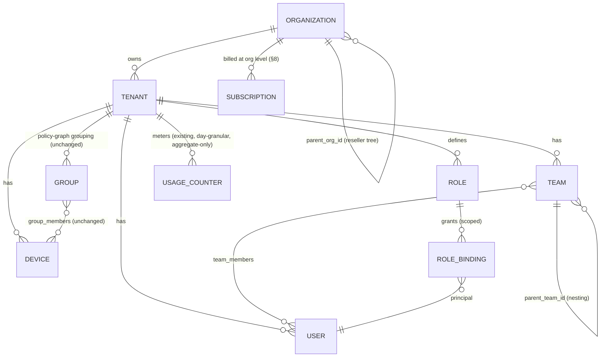
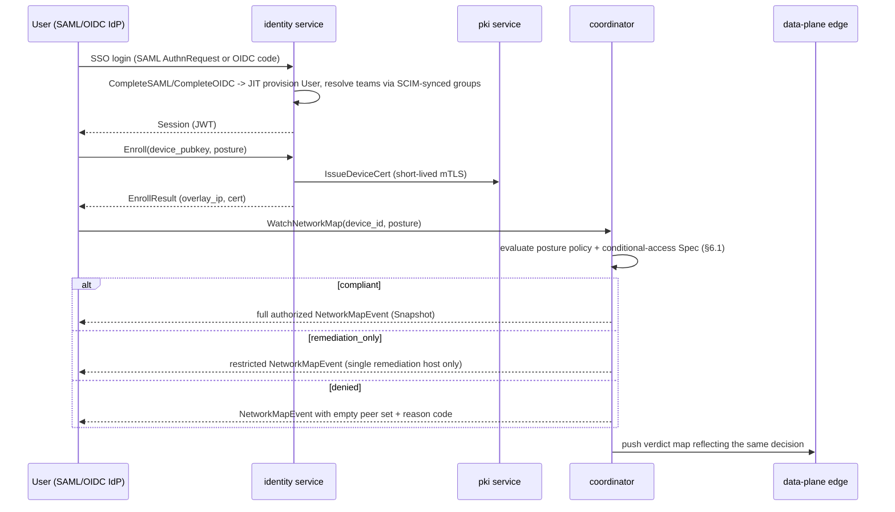
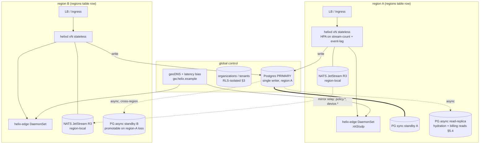
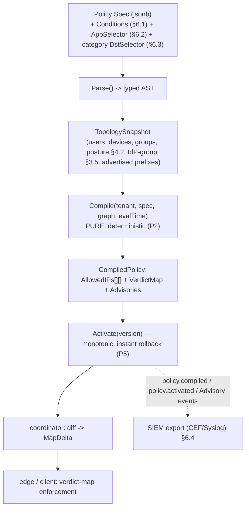
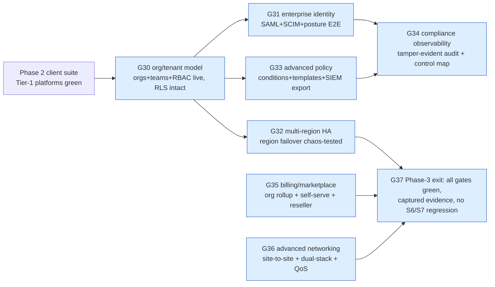

# HelixVPN — Phase 3: Enterprise & Scale (MVP3)

**Revision:** 1
**Last modified:** 2026-07-04T12:00:00Z
**Status:** draft specification — describes what to build, not the shipping product.

> **Scope of this document.** Phase 0 (spike) and Phase 1 (self-hostable control-plane MVP) —
> Go control plane (`helixd`), Postgres+RLS, Redis Streams, the Rust `helix-core` data plane,
> WireGuard/MASQUE/Shadowsocks/LWO transports, the policy compiler, `helixvpnctl`, Podman
> quadlets — are specified end-to-end under `docs/research/mvp/` (spine:
> `docs/research/mvp/final/SPECIFICATION.md`; architecture:
> `docs/research/mvp/04_VPN_CLD/HelixVPN-Architecture-Refined.md`). Phase 2 — the 8-platform
> client-application suite (Tauri v2 desktop, Flutter mobile/HarmonyOS, Qt6/QML Aurora, browser
> extension/PWA, all on the shared `helix-core` Rust library) — is specified under
> `docs/research/mvp2/` (entry point: `docs/research/mvp2/README.md`). **This document defines
> Phase 3**: the step that takes a working, single-tenant-capable MVP to an
> **enterprise-ready, horizontally-scalable, commercially deployable** platform —
> multi-tenant organizations, enterprise SSO/SCIM/device-trust, multi-region HA, an advanced
> policy engine, compliance-grade observability, marketplace/billing, and hardened advanced
> networking.
>
> **A pre-existing naming collision, disclosed honestly (constitution §11.4.6 no-guessing).**
> `docs/research/mvp/final/09-phase3-reach-wbs.md` **already exists** and is **already titled**
> "Phase 3 — Extended Reach & Hardening." That document's Phase 3 covers a *different* scope:
> HarmonyOS NEXT + Aurora OS native tunnel shims (epics `E21`/`E22`), an in-browser WASM MASQUE
> proxy (`E23`), a **billing-optional multi-tenant** foundation (`E24` — plans, subscriptions,
> aggregate-only usage counters, RLS), a third-party security audit (`E25`), and reproducible
> builds (`E26`). Those are genuinely Phase-2-adjacent *platform-completion and
> hardening* items, not organizational/enterprise-scale items. **This document does not
> duplicate or contradict that work — it explicitly extends `E24`'s billing schema (§8) and
> cross-references `E25`'s audit epic (§7.3, §10) rather than re-specifying them.** The full
> reconciliation of the two "Phase 3" labels, and the recommended resolution, is documented in
> `docs/research/UNIFIED_PHASE_ROADMAP.md` §4 — read it alongside this file. Until the operator
> makes a naming decision, this document's workable items use a **distinct ID namespace**
> (`HVPN-ENT-NNN`, epics `E30`+, gates `G30`+) so they never collide with the existing
> `HVPN-P3-NNN` / `G20`–`G26` rows if both land in the same `docs/workable_items.db` (§11.4.93).
>
> **Entry condition.** Phase 3 (this document) starts once Phase 2's 8-platform client suite has
> a working build on at least the Tier-1 platforms (macOS/Windows/Linux/Android per
> `docs/research/mvp2/MVP2_OVERVIEW.md` §4.2) **and** the Phase 0/1 control-plane Definition of
> Done (`docs/research/mvp/final/07-phase1-mvp-wbs.md`) is green on a clean baseline. Everything
> below is **additive** to that baseline — no invariant from the constitution's non-negotiable
> principles (`04_VPN_CLD/HelixVPN-Architecture-Refined.md` §2; restated in
> `mvp/final/SPECIFICATION.md` §4) is relaxed. In particular: **no-logging-as-code stays absolute**
> — every enterprise feature below that touches auditing, DLP, or QoS is designed to add
> *metadata-level, aggregate, or control-plane* observability, never a per-connection or
> per-content traffic log. Where a feature request would require breaking that invariant (full
> deep-packet-content DLP is the clearest example, §6.3), this document says so explicitly rather
> than hand-waving it.

---

## Table of contents

- [1. Executive summary](#1-executive-summary)
- [2. Architectural principles for Phase 3](#2-architectural-principles-for-phase-3)
- [3. Multi-tenancy & organizations](#3-multi-tenancy--organizations)
- [4. Enterprise identity](#4-enterprise-identity)
- [5. Global scale & HA](#5-global-scale--ha)
- [6. Advanced policy engine](#6-advanced-policy-engine)
- [7. Observability & compliance](#7-observability--compliance)
- [8. Marketplace/billing](#8-marketplacebilling)
- [9. Advanced networking](#9-advanced-networking)
- [10. Phased task/subtask WBS](#10-phased-tasksubtask-wbs)
- [11. Decision register (operator input needed)](#11-decision-register-operator-input-needed)
- [Sources](#sources)

---

## 1. Executive summary

Phase 3 does not add new cryptography, new transports, or new client platforms — those are
Phase 0/1/2 concerns and stay untouched. Phase 3 adds the **organizational, identity,
scale, and commercial machinery** an MSP, a mid-size company, or a regulated enterprise needs
before they will run HelixVPN for hundreds or thousands of users across many sites. Concretely,
that machinery is:

1. An **organization** layer above the existing `tenant` (§3) so an MSP/reseller can operate
   several isolated tenants under one billing/reporting umbrella without weakening per-tenant
   RLS isolation.
2. **Enterprise SSO** (SAML, alongside the OIDC already specified) + **SCIM** user-lifecycle
   provisioning + **device-trust/posture** checks + **conditional access** (§4).
3. **Multi-region HA** hardening of the control plane already designed to be stateless
   (§5) — this section resolves the `UNVERIFIED` items left open in
   `mvp/final/v06-deploy/ha-and-multiregion.md` §9 (read-replica routing, NATS JetStream
   replication factor).
4. An **advanced policy engine** — time/context-aware conditions, per-app split-tunnel
   templates, destination/category-based egress controls, and SIEM export — built as an
   additive extension of the existing pure/deterministic policy compiler (§6).
5. **Compliance-grade observability** — tracing, tamper-evident audit retention, and an
   explicit SOC2/ISO27001/GDPR control-mapping table that is honest about what is
   mechanically enforced today versus what requires an external audit engagement (§7).
6. A **marketplace/billing** layer built directly on the existing aggregate-only usage-metering
   schema (§8).
7. **Advanced networking** — site-to-site mesh, dual-stack IPv6, QoS, and enterprise-grade
   DPI-resistance hardening of the already-specified transport ladder (§9).

None of this is aspirational marketing language: every subsection below cites the concrete Go
interface, Postgres table, protobuf message, or event name it extends, and every WBS task in
§10 carries a falsifiable, evidence-based acceptance criterion in the same style as
`mvp/final/06-phase0-spike-wbs.md` / `07-phase1-mvp-wbs.md`.

---

## 2. Architectural principles for Phase 3

Phase 3 inherits all 9 non-negotiable principles from `04_VPN_CLD/HelixVPN-Architecture-Refined.md`
§2 / `mvp/final/SPECIFICATION.md` §4 unchanged, and adds three enterprise-specific ones:

10. **Enterprise features are additive and optional.** A single self-hoster running one tenant
    with no organization, no SSO, no billing must see **zero behavioral change**. Every
    mechanism in this document is opt-in per tenant/organization (mirrors the existing "billing
    OFF by default" invariant from `mvp/final/09-phase3-reach-wbs.md` `HVPN-P3-E24`).
11. **Organizational hierarchy never weakens tenant isolation.** RLS stays keyed on `tenant_id`
    (unchanged, §3.1). An organization or a reseller admin gets **rollup visibility** (aggregate
    usage, billing, compliance posture) across the tenants it owns — never row-level access to
    another tenant's devices, policy, or audit log, unless a tenant's own admin explicitly grants
    a cross-tenant policy relationship (site-to-site mesh, §9.1).
12. **No-logging-as-code is a ceiling, not a starting point.** Every new observability,
    audit-retention, DLP-style, or QoS mechanism in this document adds only **control-plane
    metadata or aggregate counters** — the S6/S7 invariants
    (`mvp/final/v05-security/audit-and-compliance.md` §0) are never relaxed to accommodate an
    enterprise ask. Where an ask structurally requires per-flow content data, this document
    states that plainly instead of quietly designing around the conflict (§6.3).

---

## 3. Multi-tenancy & organizations

### 3.1 Data model — `organizations` above `tenants`, `teams` refining `groups`

The Phase-1 schema already has tenant-level multi-tenancy with RLS
(`mvp/final/04_VPN_CLD/HelixVPN-Architecture-Refined.md` §4.5; deepened in
`v03-control-plane/data-model-ddl.md`):

```sql
tenants(id, name, created_at)
users(id, tenant_id, email, oidc_sub, role)
devices(id, tenant_id, user_id, kind, pubkey, overlay_ip, last_seen, enrolled_at, revoked_at)
groups(id, tenant_id, name)  group_members(group_id, device_id)
```

`tenant` is, and remains, the **RLS isolation boundary** — that does not change. What Phase 3
adds is a purely **organizational/billing grouping layer above it**, for the MSP/reseller and
multi-brand-enterprise case where one commercial entity legitimately owns several isolated
tenants (e.g. one tenant per client network, or per business unit, that must never share a
policy or device graph):

```sql
-- Phase-3 addition. Additive: no existing column changes type or meaning.
CREATE TABLE organizations (
    id            uuid PRIMARY KEY DEFAULT gen_random_uuid(),
    name          text NOT NULL,
    parent_org_id uuid REFERENCES organizations(id),   -- reseller/MSP hierarchy (§8.4)
    kind          text NOT NULL DEFAULT 'direct'
                  CHECK (kind IN ('direct','reseller','sub_org')),
    created_at    timestamptz NOT NULL DEFAULT now()
);

-- tenants gain an optional owning organization. NULL org_id == today's behaviour
-- (a lone self-hosted tenant with no org layer at all) -- principle 10.
ALTER TABLE tenants ADD COLUMN org_id uuid REFERENCES organizations(id);

-- teams promote `groups` to a first-class, nestable structure used by both
-- policy `src_group` resolution (unchanged, group_members still authoritative)
-- and the new permission-scoped RBAC (§3.5).
CREATE TABLE teams (
    id         uuid PRIMARY KEY DEFAULT gen_random_uuid(),
    tenant_id  uuid NOT NULL REFERENCES tenants(id),
    parent_team_id uuid REFERENCES teams(id),   -- nesting, e.g. "Engineering" > "SRE"
    name       text NOT NULL
);
CREATE TABLE team_members (
    team_id   uuid NOT NULL REFERENCES teams(id),
    user_id   uuid NOT NULL REFERENCES users(id),
    PRIMARY KEY (team_id, user_id)
);
-- `groups`/`group_members` (device-reachability grouping, consumed by the policy
-- compiler's TopologySnapshot) are UNCHANGED and remain the policy-graph primitive;
-- `teams` is the human-org-chart primitive RBAC binds to. A migration MAY populate
-- one team per existing group 1:1 for tenants that want them to track, but the
-- compiler never reads `teams` directly (P6/P8 of svc-policy.md are preserved).
ALTER TABLE organizations  ENABLE ROW LEVEL SECURITY;
ALTER TABLE organizations  FORCE  ROW LEVEL SECURITY;   -- org-scoped visibility, not tenant RLS
ALTER TABLE teams          ENABLE ROW LEVEL SECURITY;
ALTER TABLE teams          FORCE  ROW LEVEL SECURITY;   -- tenant_id-keyed, same policy as `groups`
```



### 3.2 Per-org policy isolation

The policy compiler's governing invariant **P6** (`v03-control-plane/svc-policy.md` §0.1 —
"every DB touch runs through `store.WithTenant` under `FORCE ROW LEVEL SECURITY`") is unchanged
and is the mechanism that makes cross-tenant policy leakage structurally impossible even for an
organization-level admin. An org-admin's Console session carries an `org_id` claim used **only**
to compute rollup views (§3.4, §8); every policy read/write still runs through the existing
`Principal{TenantID, Role}` path (`v03-control-plane/svc-identity.md` §1.2) unmodified. Explicit
cross-tenant reachability (two tenants under one org wanting to talk to each other) is **not**
an organization feature — it is the site-to-site mesh in §9.1, which is an explicit, auditable,
per-policy grant between two named tenants, never an implicit consequence of shared `org_id`.

### 3.3 Delegated admin roles (RBAC)

The Phase-1 `Role` enum (`member | operator | admin`, `v03-control-plane/svc-identity.md` §1.2)
is too coarse for enterprise delegation (a billing contact should not be able to revoke devices;
a security auditor should read audit logs but change nothing). Phase 3 replaces the fixed enum
with a **permission-based RBAC** that keeps the old 3 roles as seeded defaults so nothing already
built breaks:

```sql
CREATE TABLE roles (
    id          uuid PRIMARY KEY DEFAULT gen_random_uuid(),
    tenant_id   uuid REFERENCES tenants(id),   -- NULL == system-defined built-in role
    name        text NOT NULL,                 -- 'owner','admin','operator','member','auditor','billing_admin', or custom
    permissions jsonb NOT NULL DEFAULT '[]',    -- e.g. ["device.revoke","policy.write","audit.read","billing.read"]
    is_builtin  boolean NOT NULL DEFAULT false
);
CREATE TABLE role_bindings (
    id         uuid PRIMARY KEY DEFAULT gen_random_uuid(),
    tenant_id  uuid NOT NULL REFERENCES tenants(id),
    principal_id uuid NOT NULL,                 -- users.id (device principals keep using policy, not RBAC)
    role_id    uuid NOT NULL REFERENCES roles(id),
    scope_type text NOT NULL CHECK (scope_type IN ('tenant','team','network')),
    scope_id   uuid,                            -- team_id or a network/connector-group id; NULL for scope_type='tenant'
    granted_by uuid NOT NULL,
    granted_at timestamptz NOT NULL DEFAULT now()
);
ALTER TABLE roles         ENABLE ROW LEVEL SECURITY; ALTER TABLE roles         FORCE ROW LEVEL SECURITY;
ALTER TABLE role_bindings ENABLE ROW LEVEL SECURITY; ALTER TABLE role_bindings FORCE ROW LEVEL SECURITY;
```

```go
// internal/identity/rbac.go — extends identity.Authorize (svc-identity.md §1.1), pure, no I/O
// beyond the pre-loaded binding set already fetched at Authenticate() time.
type Permission string // "device.revoke", "policy.write", "audit.read", "billing.read", ...

func (p Principal) HasPermission(perm Permission, scope Scope) bool {
    // Union of every role_binding whose scope covers `scope` (tenant-wide binding
    // covers every team/network scope beneath it). Built-in roles pre-seed the
    // OLD 3-value enum's exact permission sets so a Phase-1 tenant with no RBAC
    // rows configured behaves byte-identically to before (principle 10).
}
```

Seeded built-in roles preserve backward compatibility exactly: `admin` = every permission,
`operator` = every permission except `user.role.change` and `org.*`, `member` = read-only on
own devices. New enterprise-only built-ins: `auditor` (audit.read + billing.read only, no
write permission of any kind — the compliance-review persona) and `billing_admin`
(billing.read + billing.write, no device/policy permission).

### 3.4 Per-org billing/usage metering

Builds directly on the existing aggregate-only `usage_counter` table
(`mvp/final/09-phase3-reach-wbs.md` `HVPN-P3-240` — day-granular, `(tenant_id, device_id, day)`,
`rx_bytes`/`tx_bytes` only, **no** src/dst/port/flow columns, the no-log CI lint already rejects
any table shaped like a traffic log). Phase 3 adds a pure **rollup view**, no new
traffic-adjacent column:

```sql
-- Read-only aggregation across every tenant an org owns. Never joins to anything
-- finer-grained than the existing day-bucket; still no per-connection data exists
-- anywhere in the chain (S6 preserved).
CREATE VIEW org_usage_rollup AS
SELECT t.org_id, uc.day, SUM(uc.rx_bytes) AS rx_bytes, SUM(uc.tx_bytes) AS tx_bytes,
       COUNT(DISTINCT uc.device_id) AS active_devices
FROM usage_counter uc JOIN tenants t ON t.id = uc.tenant_id
WHERE t.org_id IS NOT NULL
GROUP BY t.org_id, uc.day;
```

### 3.5 SCIM provisioning

A SCIM 2.0 server (`/scim/v2/Users`, `/scim/v2/Groups`) is a thin adapter in front of the
existing `identity.Identity` interface — it introduces **no new identity model**, only a
standards-compliant lifecycle wire format:

```go
// internal/identity/scim/handler.go — SCIM 2.0 (RFC 7643/7644) adapter.
// Every SCIM operation maps 1:1 onto an EXISTING identity.Identity method; SCIM never
// bypasses Authorize() or the audit path.
//   POST   /scim/v2/Users        -> identity.CompleteOIDC-equivalent JIT-provision path,
//                                    but IdP-push rather than user-initiated login
//   PATCH  /scim/v2/Users/{id}   -> identity.SuspendUser (active:false) / role change
//   DELETE /scim/v2/Users/{id}   -> identity.SuspendUser (SCIM "deprovision" = suspend,
//                                    never a hard delete -- preserves audit trail, S7)
//   POST   /scim/v2/Groups       -> teams.Create + team_members sync from SCIM group members
```

Every SCIM-driven mutation emits the **same** `user.created`/`user.suspended`/`user.role.changed`
events already in the taxonomy (`04_VPN_CLD/HelixVPN-Architecture-Refined.md` §4.3), so the
coordinator's revoke-cascade (Phase-1 MVP DoD criterion 6: revoke enforced < 1 s) applies to a
SCIM-deactivated user identically to a Console-driven suspend — enterprise IdP-triggered
offboarding gets the same sub-second edge enforcement as a manual admin action, for free.

---

## 4. Enterprise identity

### 4.1 SAML 2.0 SSO alongside existing OIDC

`identity` already speaks OIDC to any IdP (Keycloak, Authentik, or a generic OIDC provider) via
`BeginOIDC`/`CompleteOIDC` with JIT (just-in-time) user provisioning
(`v03-control-plane/svc-identity.md` §1.1). Many enterprise IdPs (Okta, Azure AD/Entra ID, Ping,
ADFS) are SAML-first for VPN/SSO integrations. Phase 3 adds a second provider type using the
identical JIT-provisioning shape:

```go
// internal/identity/iface.go — additive methods, same package, same Principal/User types.
BeginSAML(ctx context.Context, tenantID uuid.UUID, providerID uuid.UUID) (SAMLAuthnRequest, error)
CompleteSAML(ctx context.Context, in SAMLResponse) (Session, User, error) // validates signed
    // assertion, maps NameID + attribute statements -> User (JIT, same as CompleteOIDC),
    // reuses the SAME `providers` table with `protocol='saml'|'oidc'` discriminator.
```

```sql
ALTER TABLE identity_providers ADD COLUMN protocol text NOT NULL DEFAULT 'oidc'
    CHECK (protocol IN ('oidc','saml'));
ALTER TABLE identity_providers ADD COLUMN saml_metadata_xml text; -- IdP metadata (cert, ACS binding)
```

### 4.2 Device-trust / posture checks before connect

Extends the existing `Enroll` RPC (`svc-identity.md` §1.1) and the periodic status the client
core already reports. A device posture attestation is collected at enroll time and refreshed on
every `WatchNetworkMap` reconnect:

```protobuf
// helix.coordinator.v1 — additive field on the existing WatchRequest (02-control-plane.md §4, "Agent contract — protobuf" — corrected 2026-07-04, was mis-cited as §7.2 which is the policy-compiler section)
message DevicePosture {
  bool disk_encrypted = 1;
  bool screen_lock_enabled = 2;
  string os_patch_level = 3;      // free-form per-OS version string, compared to a tenant policy
  bool edac_agent_present = 4;    // EDR/MDM agent heartbeat present (platform-specific check)
  bool jailbroken_or_rooted = 5;  // best-effort per-platform detection
}
message WatchRequest {
  string device_id = 1;
  uint64 known_version = 2;
  DevicePosture posture = 3;      // Phase-3 addition; absent (zero-value) on Phase-1/2 agents
}
```

A tenant-configured **posture policy** (a new, small, tenant-scoped table, evaluated by the
coordinator before it grants a network map) classifies posture into `compliant` /
`remediation_only` / `denied`. A `remediation_only` device receives a network map restricted to a
single remediation host (e.g. an internal patch-management portal) rather than the full
authorized set — the compiler's existing need-to-know graph (`svc-policy.md` P1) already supports
"this device may reach exactly one host," so posture gating is a **policy input**, not a new
enforcement mechanism.

### 4.3 Conditional access policies

Conditional access combines **identity context** (IdP group membership, which SSO session,
geo-IP of the enrollment/connect attempt) with **device posture** (§4.2) as additional inputs to
the policy compiler's `Spec` (extended in §6.1). This section supplies the identity-side inputs;
§6.1 is the compiler mechanism that evaluates them.



---

## 5. Global scale & HA

Phase 2 already establishes the HA thesis that makes this section cheap: coordinators are
stateless on disk (`v06-deploy/ha-and-multiregion.md` §0 — "coordinators are cattle"), Postgres
is the one store whose HA is a correctness requirement, and the event bus is ephemeral by design.
Phase 3 **resolves the `UNVERIFIED` items** that document left open (its §9) and formalizes
"region" and "organization-aware routing" as first-class control-plane concepts.

### 5.1 Multi-region Gateway/Connector mesh as a first-class concept

```sql
-- Phase-3 addition: regions become addressable rows, not just deployment topology.
CREATE TABLE regions (
    id           text PRIMARY KEY,          -- 'us-east', 'eu-west', 'ap-south', ...
    display_name text NOT NULL,
    edge_endpoint text NOT NULL             -- the region's public gateway endpoint (host:443/udp)
);
ALTER TABLE devices ADD COLUMN home_region text REFERENCES regions(id); -- connectors: where they're deployed
```

The coordinator's existing `GatewayInfo` field (`svc-coordinator.md` §1.2 "Graph data structures" — corrected 2026-07-04, was mis-cited as §2.1 which is the buildMap snapshot section — already used for
per-node gateway selection, D-GW-SELECT) now resolves against this table instead of static
config, so adding a region is a data change (`INSERT INTO regions ...` + deploy an edge
`DaemonSet` there), not a code change.

### 5.2 Geo-routing / latency-based server selection

Resolves `mvp/final/v06-deploy/ha-and-multiregion.md` decision **D-GW-SELECT** for the enterprise
tier: Phase 3 ships **(a) geoDNS as the default** (as recommended there) **plus (c) client-side
override from the network map** — the coordinator now actively measures inter-region RTT from
each connector's advertised prefixes (a lightweight periodic probe, metadata only) and biases
`GatewayInfo.endpoint` toward the lowest-latency region for that device's typical peers, not just
the device's own geo-IP. Anycast (option b) remains available for fleets with BGP capability but
is not required for GA.

### 5.3 Horizontal autoscaling of the control plane

`helixd` replicas are already HPA-ready (stateless, `v06-deploy/kubernetes.md` §5). Phase 3 pins
the concrete scaling signal: HPA on **(a)** open `WatchNetworkMap` stream count per replica and
**(b)** event-consumer lag (`svc-events.md` §7), not raw CPU — CPU is a poor proxy for a
mostly-I/O-bound streaming server. Target: scale out when a replica holds > N streams (N
tenant-tunable, default 5,000) or consumer lag exceeds the convergence SLO budget.

### 5.4 Postgres HA — resolving the read-replica question

`ha-and-multiregion.md` §9 flags **U2** ("hydration reads routed to regional read-replicas") as
`UNVERIFIED`/Phase-2-optimization. Phase 3 resolves it: coordinator **boot hydration** and all
**reporting/billing rollup queries** (§3.4, §8) read from a regional async standby;
**every write and every policy-compile snapshot read** (`TopologySnapshot`, `svc-policy.md` §1.1
— must be read-consistent within one transaction) still goes to the single primary (C2
invariant unchanged). This split is safe specifically because hydration and billing reads are
tolerant of a few seconds of replication lag; policy compilation is not, and never reads from a
replica.

### 5.5 Redis Streams clustering → NATS JetStream at defined replication factor

Resolves **U3** (`ha-and-multiregion.md` §9 — "NATS JetStream replication factor / multi-region
placement... a Phase-2 capacity decision, not resolved"). Phase 3's concrete answer: **R3
JetStream clustering per region**, with **cross-region stream mirroring** (not a single
cross-region cluster — WAN RAFT consensus latency would blow the < 1 s convergence budget).
Each region's `helixd` replicas publish/consume against their local R3 cluster; a lightweight
mirror relay forwards `policy.*`/`device.*` events cross-region for global consistency of the
Postgres-backed truth, while `presence.*` (ephemeral, region-local by nature — a device is
connected to *one* region's edge) never crosses regions at all.

### 5.6 Disaster recovery — concrete RPO/RTO targets

Building on `v06-deploy/disaster-recovery.md`'s existing runbook (RPO≈0 via sync-committed
Postgres + Git-tracked policy-as-code, RTO 15–30 min for a single-node self-host):

| Scenario | RPO target | RTO target | Mechanism |
|---|---|---|---|
| Single `helixd` replica loss | 0 (stateless) | seconds | agent reconnect + `known_version` resume (§6, `ha-and-multiregion.md`) |
| Postgres primary loss (single region) | 0 for sync-committed txns | < 60 s | Patroni/CNPG promotion (already spec'd) |
| Whole-region loss (Phase 3 new) | 0 for the surviving region's data; up to the async-replication lag (target < 30 s) for the lost region's very-latest writes | < 15 min automated (geoDNS health-check removes the region; surviving regions' coordinators already serve from the cross-region-replicated primary/promoted-standby) | automated region-failover runbook (§10 `HVPN-ENT-5xx`), replacing the Phase-2 manual DR drill for the enterprise tier |

### 5.7 Zero-downtime rolling upgrades

Because coordinators are stateless and the `WatchNetworkMap` protocol already carries a
monotonic `version` field (`02-control-plane.md` §4, "Agent contract — protobuf" — corrected 2026-07-04, was mis-cited as §7.2), a rolling upgrade adds one field to
negotiate protocol compatibility during the rollout window:

```protobuf
message WatchRequest {
  string device_id = 1;
  uint64 known_version = 2;
  DevicePosture posture = 3;
  uint32 client_protocol_version = 4; // Phase-3: coordinator refuses only on a KNOWN-breaking bump
}
```

A standard Kubernetes rolling `Deployment` update mixes old/new `helixd` pods during rollout;
because both understand the currently-shipping wire contract (protocol version bumps are
additive-only within a phase per the existing schema-first/zero-drift principle, §4 clause 8 of
`SPECIFICATION.md`), an agent reconnecting mid-rollout to either an old or a new pod gets a
correct network map — no maintenance window, no forced client disconnect.



---

## 6. Advanced policy engine

The Phase-1 compiler (`v03-control-plane/svc-policy.md`) is a **pure, deterministic,
versioned** function `Compile(tenant, spec, graph) → (AllowedIPs, VerdictMap, Advisories)`
(invariant P2). Every extension below adds an **explicit input parameter** to that function
rather than a hidden side effect, which is the only way to add context-awareness without
breaking purity/determinism/testability.

### 6.1 Time-based / context-aware access policies

```go
// internal/policy/spec.go — additive Spec fields. The compiler signature becomes
// Compile(ctx, tenant, spec, graph, evalTime) — evalTime is an EXPLICIT parameter,
// never time.Now() read inside Compile, preserving P2 (pure + deterministic: identical
// (tenant, spec, graph, evalTime) still yields a byte-identical CompiledPolicy).
type Condition struct {
    TimeWindow   *TimeWindow // e.g. Mon-Fri 08:00-18:00 in a named tz
    GeoCountries []string    // ISO-3166 allow-list, sourced from enrollment/connect geo-IP
    PostureTier  *string     // "compliant" | "remediation_only" (§4.2)
    IdPGroup     *string     // SAML/OIDC group claim, synced via SCIM (§3.5)
}
type Rule struct {
    SrcGroup    string
    DstSelector string
    Ports       []PortRange
    Action      string      // "accept" (P1: absence is denial, unchanged)
    Conditions  []Condition // Phase-3 addition; empty == unconditional (Phase-1/2 behaviour, unchanged)
}
```

A background scheduler emits a `policy.recompile` event at every condition boundary a tenant's
active policy has (e.g. at 08:00 and 18:00 local time for a time-window rule) so the **existing**
`policy.compiled` → coordinator-recompute → push-delta pipeline (`04_ARCH` §8, the
"policy change propagation" sequence) handles the transition with **zero new mechanism** — a
time-boundary firing looks, to the coordinator, exactly like an admin editing the policy at that
moment. This is the concrete reason `evalTime` is passed explicitly: `Compile` at 07:59 and
`Compile` at 08:00 with the identical stored `spec` legitimately produce different
`CompiledPolicy` artifacts, and that difference is driven by one auditable scheduler tick, never
by an ambient clock read buried in the compiler.

### 6.2 Per-app split-tunneling policy templates

`Rule` gains an optional `AppSelector` (bundle ID / package name / process name, platform
capability already noted for Android/desktop in `mvp2/MVP2_SECURITY_PERFORMANCE.md`'s per-app
kill-switch scoping). A **template** is a named, reusable `[]Rule` an org can apply across many
tenants/teams (e.g. "Finance app must always route through the tunnel; general browsing may
split-tunnel") — templates are stored once at the org level and referenced by tenant policy
`Spec`s, so updating a template and re-activating cascades through the existing monotonic-version
+ instant-rollback machinery (P5) unchanged.

### 6.3 DLP-style egress controls — and the honest boundary

An enterprise buyer's first ask here is usually "block egress to categories of destinations" or
"stop sensitive data leaving via the tunnel." HelixVPN can honestly deliver the **first** without
touching the no-logging invariant; it explicitly **cannot** deliver the second at the platform
level without contradicting the entire product's privacy architecture, and this document says so
rather than hand-waving a feature that would not survive the S6 CI schema-lint:

- **In scope (metadata/destination-level, S6-compatible):** destination **category** and
  **reputation** allow/deny lists (malware, known-C2, adult-content categories, etc., sourced
  from a pluggable feed), evaluated at the **same** compile step as any other `DstSelector`
  match — this is structurally identical to an existing policy rule, just with a
  category-to-CIDR/FQDN-set resolver feeding `Resolve()` (`svc-policy.md` §1). SNI/FQDN-based
  matching for MASQUE/TLS traffic uses the **unencrypted ClientHello SNI only** (metadata,
  never decrypted payload) — enforced at the edge verdict-map layer, counted (aggregate only,
  §7.4), never logged per-connection.
- **Explicitly out of scope, with reason (§11.4.112-class structural boundary):** payload-level
  content inspection (scanning file contents, matching regex against decrypted traffic,
  keyword/PII detection *inside* the tunnel) is **structurally incompatible** with invariant S6
  (`audit-and-compliance.md` §0 — "no durable connection/traffic log... by construction") and
  with the WireGuard-encrypted, zero-trust data-plane architecture (`04_ARCH` §2 principle 7 —
  "no-logging by construction... a build property, not a config toggle"). Implementing it would
  require either terminating and inspecting decrypted traffic at the gateway (a MITM the
  architecture explicitly does not do — the gateway relays encrypted WireGuard datagrams, it
  does not decrypt user payloads) or an on-device content scanner outside `helix-core`'s scope
  entirely (a separate, customer-deployed DLP/CASB product, not a HelixVPN feature). This
  boundary is a **decision register item** (§11) for the operator to confirm as final product
  positioning, not an engineering gap to be silently closed later.

### 6.4 SIEM / audit export hooks

Extends the existing export path already scoped in `v05-security/audit-and-compliance.md` §9:
`policy.compiled`, `policy.activated`, and the new `Advisory` stream (route conflicts,
unreachable/shadowed rules) are shipped to an external SIEM in **CEF** (Common Event Format) or
as a **Syslog** stream, in addition to the existing webhook export. No new data is invented for
export — it is the same audit/advisory events the Console already renders, reformatted for
ingestion by Splunk/Elastic/QRadar-class tooling.



---

## 7. Observability & compliance

### 7.1 Centralized structured logging / metrics / tracing

Extends the existing Prometheus exposition (`svc-telemetry.md`, `04_ARCH` §9) with OpenTelemetry
distributed tracing across **control-plane operations only**: `WatchNetworkMap` open→snapshot→
delta round-trips, policy compile latency, enroll-flow spans, SSO login spans. Trace spans carry
`tenant_id`/`org_id`/`device_id` as attributes for filtering — never a destination, byte count,
or any data shaped like a flow record (the same shape-based CI schema-lint from
`audit-and-compliance.md` §1.2 applies to trace-attribute schemas too, extended in this phase).

### 7.2 Audit-log retention & tamper-evidence

`audit_events` (`v05-security/audit-and-compliance.md` §3) is already append-only and RLS-scoped.
Phase 3 adds:

- **Per-org configurable retention** (default 400 days, enterprise tiers may configure longer)
  enforced by a scheduled partition-drop, never a row-level `DELETE` (preserves append-only
  semantics up to the retention boundary).
- **Hash-chain tamper evidence**: each `audit_events` row stores `prev_hash` = SHA-256 of the
  previous row's canonical serialization for that tenant; a verification job periodically
  re-walks the chain and raises an alert (itself an audited, SIEM-exported event) on any
  mismatch. This is a genuinely new mechanism (not present in Phase 1/2) and is the concrete
  answer to "how do we prove the audit log wasn't edited after the fact."

```sql
ALTER TABLE audit_events ADD COLUMN prev_hash bytea;   -- sha256(canonical(previous row)), per tenant chain
ALTER TABLE audit_events ADD COLUMN row_hash  bytea;   -- sha256(canonical(this row) || prev_hash)
```

### 7.3 SOC2 / ISO27001 / GDPR control mapping

An honest mapping table — column 4 states plainly which controls are **mechanically enforced
today** by the architecture versus which require an **external audit/certification engagement**
(cross-referenced to the GA-readiness security-audit item, `docs/research/mvp_final/MVP_FINAL_GA_READINESS.md`
§2, so this document does not duplicate that gate):

| Control family | Example control | HelixVPN mechanism | Status |
|---|---|---|---|
| SOC2 CC6 (logical access) | least-privilege access to production data | RBAC (§3.3), RLS-forced tenant isolation | Mechanically enforced |
| SOC2 CC7 (monitoring) | detect and respond to anomalies | audit_events + tamper-evidence (§7.2) + SIEM export (§6.4) | Mechanically enforced |
| ISO 27001 A.8 (asset mgmt) | device inventory + lifecycle | `registry` service device table + revoke-cascade | Mechanically enforced |
| ISO 27001 A.9 (access control) | joiner/mover/leaver process | SCIM lifecycle (§3.5) | Mechanically enforced |
| GDPR Art. 5(1)(c) data minimisation | collect no more than necessary | no-logging-as-code (S6) — architecturally the strongest claim in this table | Mechanically enforced by construction |
| GDPR Art. 17 (erasure) | user can request data deletion | anonymous-account model (no PII by default); OIDC/SAML-linked accounts require an erasure runbook (Console "purge user" removes `users`/`audit_events` PII fields, retains anonymized audit skeleton) | Partially mechanized — erasure **runbook** is a GA-readiness deliverable, not yet built |
| SOC2 / ISO27001 (certification itself) | an accredited third party attests to the above | — | **Not mechanically achievable by code.** Requires an actual auditor engagement — tracked as a decision item (§11) and as a GA-readiness gate, never claimed here as "done." |

### 7.4 Usage/billing analytics

Reporting views over `usage_counter` (§3.4) and `subscription`/`plan` (§8.1), exposed in Console
for org-admins and billing-admins (§3.3): daily/monthly bandwidth per tenant/device, active-device
counts vs. plan entitlement, near-limit alerts. All derived from data that already exists;
no new metering mechanism.

### 7.5 SLA definitions & status-page tooling

Concrete, measurable SLA targets (final numbers are a business decision, §11):

| Tier | Control-plane API availability | Data-plane (gateway) availability | Measured via |
|---|---|---|---|
| Self-host (no SLA) | best-effort | best-effort | operator's own monitoring |
| Managed — Team | 99.5% monthly | 99.5% per-region | `/readyz`/`/healthz` uptime (`svc-telemetry.md` §8.2) |
| Managed — Enterprise | 99.9% monthly | 99.9% per-region, multi-region failover counted | same, + region-failover chaos-test evidence (§5.6, §10) |

A public status page (self-hosted Upptime/Cachet-class static page, or a hosted status-page
provider) surfaces the same `/healthz` signal already emitted by every `helixd` replica — no new
health-check mechanism, just a public-facing aggregation of an existing one.

---

## 8. Marketplace/billing

### 8.1 Subscription tiers on the existing `plan` schema

Directly extends `HVPN-P3-240`'s `plan`/`subscription` tables
(`mvp/final/09-phase3-reach-wbs.md` §9) — this document does not re-define billing schema, it
adds organization-level rollup and tier examples:

| Tier | `max_devices` | `max_networks` | `max_bytes_mo` | Positioning |
|---|---|---|---|---|
| Self-Host (Free) | unlimited (operator's own hardware) | unlimited | NULL (unlimited) | homelab / single self-hoster, billing OFF |
| Team | 25 | 5 | 500 GB | small company, self-serve |
| Business | 250 | 25 | 5 TB | mid-size, self-serve or sales-assisted |
| Enterprise | negotiated | negotiated | negotiated | sales-assisted, multi-region, SLA-backed |

Exact price points are explicitly **not** specified here — that is a go-to-market decision, not
an engineering one (§11, and cross-referenced in `MVP_FINAL_GA_READINESS.md` §3.1).

### 8.2 Usage-based billing hooks

```go
// internal/billing/report.go — a daily rollup job over the EXISTING usage_counter table
// (no new per-flow data). Emits one event per tenant per day; the payment-processor
// adapter is pluggable and OFF by default (preserves E24's "billing OFF by default").
type UsageReporter interface {
    // ReportDaily reads yesterday's usage_counter rows, aggregates per subscription,
    // and emits billing.usage.reported{tenant_id, day, rx_bytes, tx_bytes, device_count}.
    ReportDaily(ctx context.Context, day time.Time) error
}
type PaymentAdapter interface { // Stripe-class adapter; swappable, never mandatory
    ReportUsage(ctx context.Context, subscriptionID string, ev UsageEvent) error
}
```

### 8.3 Self-serve vs. enterprise-sales-assisted signup

- **Self-serve**: Console signup flow, SAML/OIDC or anonymous-account creation, payment adapter
  charges a card on file for Team/Business tiers — same enrollment path already specified
  (`CreateAccount`/`LoginAccount`, `svc-identity.md` §1.1), with a `plan_id` selected at signup.
- **Enterprise-sales-assisted**: `helixvpnctl org create --plan enterprise --contract-ref <id>`
  provisions the `organizations` row + tenant(s) + a negotiated `subscription` row with no
  self-serve payment step; identical schema underneath, different provisioning entry point.

### 8.4 Partner/reseller model

`organizations.parent_org_id` (§3.1) lets a reseller org own several `sub_org`-kind
organizations, each with its own tenants. A reseller admin's RBAC scope (§3.3) is bound to
`scope_type='tenant'` rows **only within tenants belonging to its own sub-orgs' billing rollup**
— it sees `org_usage_rollup` and `subscription` rows for its sub-orgs, never those sub-orgs'
device/policy/audit data (principle 11, §2). This mirrors exactly how a real MSP contract works:
the reseller is accountable for billing and provisioning, the end-customer keeps operational
control and privacy of their own network.

---

## 9. Advanced networking

### 9.1 Site-to-site mesh

The policy compiler already resolves arbitrary `src_group → dst_selector` grants across the
topology graph (`svc-policy.md` §1, P1 "default-deny, need-to-know"), and connectors are already
just devices in that graph that advertise prefixes. **Site-to-site mesh requires no new compiler
mechanism** — it is the Console UX + a policy `Rule` whose `SrcGroup` resolves to Connector-A's
device set and whose `DstSelector` resolves to Connector-B's advertised prefixes (and the
symmetric rule the other direction), which the existing engine already compiles into
`AllowedIPs`/`VerdictMap` unchanged. Phase 3's actual deliverable here is the **Console workflow**
that makes cross-network access grants a first-class, auditable, two-click operation instead of
requiring hand-written policy JSON — and, where the two sites are in an org's different tenants
(§3.2), an explicit **cross-tenant grant object** that both tenant admins must approve (never an
implicit consequence of shared `org_id`).

### 9.2 IPv6 / dual-stack support

The overlay is already IPv6-native (`ULA /48` per tenant, `04_ARCH` §3.4). Phase 3 adds: **(a)**
dual-stack privacy-exit egress — a client using the gateway as a full-tunnel internet exit gets
both an IPv6 and an IPv4 egress path (today's spec is silent on whether the exit itself is
dual-stack; Phase 3 makes it explicit and required for the enterprise tier); **(b)** native
(non-4via6) IPv6 LAN advertisement for connectors whose private network is already IPv6-addressed
— `advertised_prefixes.cidr` already accepts any CIDR, so this is a validation-and-UX change
(don't force a v6-native LAN through the 4via6 v4-collision-avoidance path meant for overlapping
RFC1918 ranges), not a schema change.

### 9.3 QoS / traffic shaping

Per-plan bandwidth ceilings (`plan.max_bytes_mo`, already in the schema) are complemented by
**per-tenant rate limiting at the edge** (token-bucket shaping in the Rust data-plane edge,
consistent with the existing "counters only, never content" telemetry stance) so tenants sharing
a gateway get fair queueing rather than one noisy tenant starving others. This is a rate/metadata
mechanism only — no packet content is inspected to classify traffic; shaping is per-tenant and
optionally per-connector, never per-application-content.

### 9.4 DPI-resistance hardening

Extends the existing obfuscation ladder (plain UDP → LWO → MASQUE/QUIC → Shadowsocks → UDP-over-TCP,
`04_ARCH` §3.2) with enterprise-specific hardening: **(a)** per-org custom MASQUE SNI /
domain-fronting profiles so an enterprise's traffic can mimic a specific, operator-chosen web
property rather than a generic default; **(b)** scheduled automatic rotation of the edge's MASQUE
TLS fingerprint/SNI set, reducing the window a censor's DPI signature has to become effective;
**(c)** DAITA (already specified for Phase 2, `v02-data-plane/daita.md`) becomes **default-on**
for the enterprise tier rather than opt-in, since enterprise buyers in censorship-affected regions
are exactly the customers most likely to need constant-size/cover-traffic shaping.

### 9.5 Redundant transport failover, hardened

The existing auto-escalation ladder already handles automatic MASQUE↔WireGuard↔Shadowsocks
fallback (`04_ARCH` §3.2, and `mvp/final/08-phase2-parity-wbs.md`'s "per-network memory +
regional priors" enhancement). Phase 3 adds **enterprise-configurable fallback policy**: a
compliance-sensitive org can pin a specific transport (e.g. "MASQUE only, never silently fall
back to a less-obfuscated transport") and receive an **alert** instead of a silent escalation —
because for some regulated enterprises a loud failure that gets a human's attention is strictly
preferable to a silent downgrade in obfuscation posture.

---

## 10. Phased task/subtask WBS

### 10.1 ID namespace and field dictionary

Mirrors the schema used in `mvp/final/06-phase0-spike-wbs.md` / `07-phase1-mvp-wbs.md` /
`09-phase3-reach-wbs.md`, with a **distinct ID prefix** (`HVPN-ENT-NNN`, epics `HVPN-ENT-E3n`,
gates `G30`–`G39`) to avoid collision with the existing `HVPN-P3-NNN`/`G20`–`G26` rows from the
"Extended Reach" WBS (see the naming-collision note at the top of this document). Every row is
`§11.4.93`-DB-ready (same `items`/`gates` table shape as the existing WBS documents — not
repeated here for brevity; see `06-phase0-spike-wbs.md` §3 for the canonical DDL).

| Field | Meaning |
|---|---|
| `id` | `HVPN-ENT-NNN[.k]`, stable, monotonic, never reused |
| `parent` | owning epic `HVPN-ENT-E3n` |
| `gate` | which of `G30`–`G39` this advances |
| `depends_on` | upstream ids that must be `complete` first |
| `acceptance` | falsifiable, evidence-based PASS condition |
| `est_effort` | engineer-days, wide error bars, not a calendar commitment |
| `test_types` | §11.4.169 closed-set codes (UNIT/INT/E2E/FA/SEC/PERF/CHAOS/STRESS/UI/UX/REC/CHAL, as in the existing WBS docs) |

### 10.2 Gates G30–G39



### 10.3 Epics

**`HVPN-ENT-E30` — Organizations, teams, and permission-based RBAC** `epic · module: helix-go/identity,store`
Gate **G30**. Delivers §3 in full.
- **HVPN-ENT-300 — `organizations`/`teams` DDL + RLS + migration from `groups`.** `M(5) · deps: — · tests: UNIT,INT,SEC`
  Acceptance: existing tenants with `org_id IS NULL` behave byte-identically (regression suite from Phase 1 still green); a new org with 2 tenants shows correct rollup isolation (cross-tenant read denied by RLS, proven by a planted cross-org read attempt that must fail).
- **HVPN-ENT-301 — `roles`/`role_bindings` + built-in-role seed matching the old 3-value enum.** `L(7) · deps: HVPN-ENT-300 · tests: UNIT,INT,SEC`
  Acceptance: a Phase-1 tenant with zero RBAC configuration authorizes identically to the pre-Phase-3 `Role` enum (parity test suite diffing old vs. new `Authorize()` decisions across the full Phase-1 permission matrix).
- **HVPN-ENT-302 — SCIM 2.0 server (`/Users`, `/Groups`).** `L(8) · deps: HVPN-ENT-301 · tests: UNIT,INT,E2E,SEC`
  Acceptance: an IdP-driven SCIM deprovision reaches device revoke-cascade in < 1 s (reuses the existing Phase-1 revoke SLO test harness against a SCIM-triggered suspend).
- **HVPN-ENT-303 — G30 certification.** `S(3) · deps: HVPN-ENT-300..302 · tests: FA,CHAL`

**`HVPN-ENT-E31` — Enterprise identity: SAML, device posture, conditional access** `epic · module: helix-go/identity,helix-core`
Gate **G31**.
- **HVPN-ENT-310 — SAML 2.0 provider type + JIT provisioning parity with OIDC.** `L(8) · deps: HVPN-ENT-301 · tests: UNIT,INT,E2E,SEC`
  Acceptance: a SAML login against a test IdP (e.g. a self-hosted SimpleSAMLphp/Keycloak-SAML instance) JIT-provisions a user with the correct team/role mapping; captured login transcript.
- **HVPN-ENT-311 — `DevicePosture` protobuf field + posture-policy evaluation in the coordinator.** `M(6) · deps: HVPN-ENT-310 · tests: UNIT,INT,E2E`
  Acceptance: a device reporting `jailbroken_or_rooted=true` against a tenant policy denying that posture receives a restricted/denied network map, proven by a captured `NetworkMapEvent` diff vs. a compliant device.
- **HVPN-ENT-312 — Conditional-access Spec extension (IdP-group + geo + posture as `Condition`).** `M(5) · deps: HVPN-ENT-311,HVPN-ENT-E33-300 · tests: UNIT,INT`
- **HVPN-ENT-313 — G31 certification.** `S(3) · deps: HVPN-ENT-310..312 · tests: E2E,FA,CHAL`

**`HVPN-ENT-E32` — Multi-region HA hardening** `epic · module: helix-go/coordinator,deploy`
Gate **G32**.
- **HVPN-ENT-320 — `regions` table + `GatewayInfo` resolution from region data.** `M(5) · deps: — · tests: UNIT,INT`
- **HVPN-ENT-321 — Latency-biased gateway selection (resolves D-GW-SELECT option c for enterprise).** `L(7) · deps: HVPN-ENT-320 · tests: UNIT,INT,PERF`
- **HVPN-ENT-322 — Postgres read-replica routing for hydration + billing reads (resolves U2).** `M(6) · deps: HVPN-ENT-320 · tests: UNIT,INT,PERF`
  Acceptance: policy-compile snapshot reads are proven (via a query-source assertion in the integration test) to NEVER hit a replica; hydration/billing reads are proven to use the replica under normal operation.
- **HVPN-ENT-323 — NATS JetStream R3 clustering + cross-region mirror relay (resolves U3).** `L(8) · deps: HVPN-ENT-320 · tests: UNIT,INT,CHAOS`
- **HVPN-ENT-324 — Automated region-failover runbook + chaos test.** `L(8) · deps: HVPN-ENT-321,HVPN-ENT-322,HVPN-ENT-323 · tests: CHAOS,STRESS,REC`
  Acceptance: a chaos test kills region A's edge + coordinator replicas entirely; clients re-home to region B within the target RTO (§5.6 table); captured before/after connectivity transcript, zero data-plane packet-content loss claim (only convergence-pause per the honest §6 semantics in `ha-and-multiregion.md`).
- **HVPN-ENT-325 — Zero-downtime rolling upgrade proof (protocol-version field).** `M(5) · deps: HVPN-ENT-320 · tests: INT,E2E,CHAOS`
  Acceptance: a rolling `Deployment` update runs while agents are connected; zero forced disconnects, captured connection-continuity transcript across the rollout window.
- **HVPN-ENT-326 — G32 certification.** `S(3) · deps: HVPN-ENT-320..325 · tests: FA,CHAL`

**`HVPN-ENT-E33` — Advanced policy engine** `epic · module: helix-go/policy`
Gate **G33**.
- **HVPN-ENT-330 — `Condition`/`evalTime` compiler extension, purity-preserving.** `L(8) · deps: — · tests: UNIT,PERF`
  Acceptance: a property test asserts `Compile(t, spec, graph, evalTime)` is byte-identical across repeated calls with identical inputs (P2 preserved) and differs ONLY when `evalTime` crosses a declared window boundary.
- **HVPN-ENT-331 — `AppSelector` + org-level policy templates.** `M(6) · deps: HVPN-ENT-330 · tests: UNIT,INT`
- **HVPN-ENT-332 — Destination-category egress lists (DLP-lite, S6-compatible).** `M(6) · deps: HVPN-ENT-330 · tests: UNIT,INT,SEC`
  Acceptance: a category-blocked destination is denied; the schema-lint from `audit-and-compliance.md` still passes (no new flow-shaped table introduced) — proven by re-running that lint against this feature's migration.
- **HVPN-ENT-333 — SIEM export (CEF/Syslog) for policy + advisory events.** `M(5) · deps: HVPN-ENT-330 · tests: UNIT,INT,SEC`
- **HVPN-ENT-334 — G33 certification.** `S(3) · deps: HVPN-ENT-330..333 · tests: FA,CHAL`

**`HVPN-ENT-E34` — Compliance-grade observability** `epic · module: helix-go/telemetry`
Gate **G34**.
- **HVPN-ENT-340 — OpenTelemetry tracing across control-plane operations.** `M(6) · deps: — · tests: UNIT,INT,PERF`
- **HVPN-ENT-341 — Hash-chain tamper-evidence on `audit_events` + verification job.** `M(6) · deps: — · tests: UNIT,INT,SEC`
  Acceptance: a planted out-of-band row edit is detected by the verification job on its next run; captured alert + SIEM-exported tamper event.
- **HVPN-ENT-342 — SOC2/ISO27001/GDPR control-mapping doc + erasure runbook.** `M(5) · deps: HVPN-ENT-341 · tests: UNIT,FA`
- **HVPN-ENT-343 — G34 certification.** `S(3) · deps: HVPN-ENT-340..342 · tests: FA,CHAL`

**`HVPN-ENT-E35` — Marketplace / billing** `epic · module: helix-go/billing`
Gate **G35**.
- **HVPN-ENT-350 — `org_usage_rollup` view + Console billing dashboard.** `M(5) · deps: HVPN-ENT-300 · tests: UNIT,INT`
- **HVPN-ENT-351 — `UsageReporter` daily job + pluggable `PaymentAdapter`.** `L(7) · deps: HVPN-ENT-350 · tests: UNIT,INT,SEC`
  Acceptance: billing stays OFF (zero adapter calls, zero behavioral change) when a tenant has no `subscription` row — regression-tested against the Phase-1/2 self-host baseline.
- **HVPN-ENT-352 — Reseller (`parent_org_id`) provisioning + scoped RBAC.** `M(6) · deps: HVPN-ENT-301,HVPN-ENT-350 · tests: UNIT,INT,SEC`
- **HVPN-ENT-353 — G35 certification.** `S(3) · deps: HVPN-ENT-350..352 · tests: FA,CHAL`

**`HVPN-ENT-E36` — Advanced networking** `epic · module: helix-go/policy,helix-edge`
Gate **G36**.
- **HVPN-ENT-360 — Site-to-site Console workflow + cross-tenant grant object.** `M(6) · deps: HVPN-ENT-300 · tests: UNIT,INT,E2E`
- **HVPN-ENT-361 — Dual-stack privacy-exit egress + native IPv6 LAN advertisement.** `M(6) · deps: — · tests: UNIT,INT,E2E`
- **HVPN-ENT-362 — Per-tenant token-bucket QoS shaping at the edge.** `M(6) · deps: — · tests: UNIT,INT,PERF,STRESS`
- **HVPN-ENT-363 — Per-org MASQUE SNI/fingerprint rotation + DAITA-default-on enterprise tier.** `L(7) · deps: — · tests: UNIT,INT,SEC`
- **HVPN-ENT-364 — Pin-and-alert transport-fallback policy.** `M(5) · deps: — · tests: UNIT,INT,CHAOS`
- **HVPN-ENT-365 — G36 certification.** `S(3) · deps: HVPN-ENT-360..364 · tests: FA,CHAL`

**`HVPN-ENT-E37` — Phase-3 exit certification** `epic · module: —`
Gate **G37**. All prior gates green + a full-suite retest from the Phase-2 baseline
(constitution §11.4.40) + no S6/S7 (no-logging-as-code) regression proven by re-running the
existing schema-lint against the entire Phase-3 migration set in one pass.

---

## 11. Decision register (operator input needed)

| # | Decision | Options | Recommendation | Resolved by |
|---|---|---|---|---|
| D-ENT-1 | Reconcile the two "Phase 3" labels (this doc vs. `mvp/final/09-phase3-reach-wbs.md`) | (a) rename the existing platform-reach WBS to "Phase 2.5" or "Phase 2c"; (b) rename this document's scope to "Phase 4"; (c) keep both labeled "Phase 3" as parallel sub-tracks, cross-referenced (current state) | (c) for now — see `UNIFIED_PHASE_ROADMAP.md` §4 — but this is a genuine naming decision, not silently resolved | operator, before the numbering is used in external communication |
| D-ENT-2 | Pricing for the tiers in §8.1 | exact $/tier, usage overage pricing | not specified — business decision | operator + go-to-market (cross-ref `MVP_FINAL_GA_READINESS.md` §3.1) |
| D-ENT-3 | Which compliance certification to pursue first (§7.3) | SOC2 Type II first (common enterprise-buyer gate) vs. ISO 27001 first (common EU-buyer gate) vs. neither until customer-demanded | not specified — depends on target market | operator |
| D-ENT-4 | Whether an organization layer above tenant is needed at all for the initial enterprise launch, or whether it can be deferred (many enterprise buyers are a single tenant) | ship §3.1's org layer in the first Phase-3 release vs. defer to a later Phase-3 increment, shipping RBAC/SSO/HA first | ship RBAC+SSO+HA first (G31/G32/G33 have no dependency on G30's org layer beyond the shared `roles` table); org/reseller layer (G30, G35) can trail if it de-risks the critical path | operator, informs WBS sequencing in §10 |
| D-ENT-5 | DLP posture (§6.3) — confirm the "no payload inspection" boundary as final product positioning | accept the metadata/category-only boundary vs. explicitly scope a separate, clearly-labeled non-HelixVPN-core CASB/DLP integration product | recommend accepting the boundary — payload inspection contradicts the product's core privacy promise | operator |
| D-ENT-6 | SLA numbers in §7.5 | exact percentages, credit/refund policy on breach | not specified — business/legal decision | operator (cross-ref `MVP_FINAL_GA_READINESS.md` §2) |

---

## Sources

- `docs/research/mvp/final/SPECIFICATION.md` — architectural spine, non-negotiable principles, phase roadmap, decision register.
- `docs/research/mvp/04_VPN_CLD/HelixVPN-Architecture-Refined.md` — refined architecture (transports, control plane, security, deployment).
- `docs/research/mvp/final/09-phase3-reach-wbs.md` — the pre-existing "Phase 3 — Extended Reach" WBS (HarmonyOS/Aurora/WASM/billing-optional/audit/reproducible-builds); source of the naming-collision disclosure and the `E24` billing schema this document extends.
- `docs/research/mvp/final/v06-deploy/ha-and-multiregion.md` — HA thesis, reference multi-region topology, `UNVERIFIED` register (U2, U3) resolved in §5 above.
- `docs/research/mvp/final/v03-control-plane/svc-identity.md` — identity service interface, `Role` enum, OIDC JIT-provisioning, extended in §3.3/§4.
- `docs/research/mvp/final/v03-control-plane/svc-policy.md` — policy compiler invariants P1–P8, extended in §6.
- `docs/research/mvp/final/v05-security/audit-and-compliance.md` — S6/S7 no-logging-as-code invariants, `audit_events` schema, extended in §7.
- `docs/research/mvp2/README.md`, `docs/research/mvp2/MVP2_OVERVIEW.md` — Phase 2 client-suite platform matrix and scope (entry condition for this document).
- `docs/research/UNIFIED_PHASE_ROADMAP.md` — full phase reconciliation, read alongside this document.

*End of Phase 3 (Enterprise & Scale) specification.*
