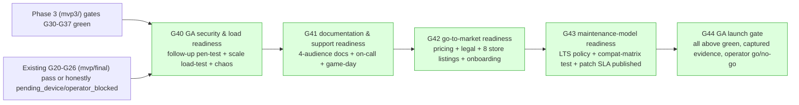

# HelixVPN — Final Phase: General Availability (GA) Readiness

**Revision:** 1
**Last modified:** 2026-07-04T12:00:00Z
**Status:** draft specification — describes what to build/verify, not the shipping product.

> **Scope of this document.** This is the **last phase before General Availability** — the
> hardening, launch-readiness, and go-to-market phase that sits **after** Phase 3's
> enterprise/scale features are built (`docs/research/mvp3/MVP3_ENTERPRISE_SCALE.md`) and after
> the 8-platform client suite (`docs/research/mvp2/`) and the control-plane MVP
> (`docs/research/mvp/`) are feature-complete. This document does **not** re-specify any
> feature — it specifies the **checklist, gates, and long-term operating model** that must be
> satisfied before HelixVPN is offered to the general public as a supported, paid product.
>
> **Entry condition.** GA readiness work starts once every gate in
> `docs/research/mvp3/MVP3_ENTERPRISE_SCALE.md` §10.2 (`G30`–`G37`) is green, **and** the
> pre-existing Phase-3 "Extended Reach" gates already scoped in
> `docs/research/mvp/final/09-phase3-reach-wbs.md` (`G20`–`G26` — HarmonyOS/Aurora native
> shims, WASM browser proxy, billing-optional foundation, third-party security audit,
> reproducible builds) are at least `pass` or an honestly-tracked `pending_device`/
> `operator_blocked` state, per that document's own anti-bluff discipline. **This document does
> not duplicate the third-party security audit (`HVPN-P3-E25`) or reproducible-builds
> (`HVPN-P3-E26`) epics already scoped there** — it treats their outcomes as **inputs** to the
> GA launch checklist (§2.1, §2.2) and extends them to GA-specific scope (load testing at
> commercial scale, chaos-testing the *enterprise* HA topology from Phase 3, not just the
> single-region Phase-2 topology).
>
> **Why this phase exists as its own document.** "Feature-complete" and "ready to sell to the
> general public with a support contract" are different bars. A product can pass every
> functional gate in Phase 0–3 and still be unsafe to launch if there is no on-call rotation, no
> pen-test sign-off at the *current* (post-Phase-3) attack surface, no finalized ToS/DPA, or no
> plan for what happens to a paying customer's FFI-dependent integration when `helix-core`'s API
> changes. This document is that missing bar, made concrete and falsifiable.

---

## Table of contents

- [1. Executive summary](#1-executive-summary)
- [2. Production launch readiness checklist](#2-production-launch-readiness-checklist)
- [3. Go-to-market readiness](#3-go-to-market-readiness)
- [4. Long-term maintenance model](#4-long-term-maintenance-model)
- [5. Phased task/subtask WBS](#5-phased-tasksubtask-wbs)
- [6. Reconciliation with the existing audit/reproducible-builds epics](#6-reconciliation-with-the-existing-auditreproducible-builds-epics)
- [7. Decision register (operator input needed)](#7-decision-register-operator-input-needed)
- [Sources](#sources)

---

## 1. Executive summary

GA readiness has three cooperating strands, each with its own gate:

1. **Production launch readiness** (§2) — is the *system* safe and observably correct to run
   at commercial scale, under real failure conditions, with a real human on-call rotation
   behind it?
2. **Go-to-market readiness** (§3) — is the *business* ready: pricing, legal, distribution
   (8 app-store listings), marketing, and a working onboarding funnel?
3. **Long-term maintenance model** (§4) — once GA happens, what is the *contract* HelixVPN
   makes with its integrators and customers about versioning, deprecation, backward
   compatibility, and security-patch turnaround?

None of these three strands is "done" by writing documentation — each has a falsifiable
acceptance criterion in the WBS (§5), in the same evidence-based style as every other phase's
WBS in this project (`mvp/final/06-phase0-spike-wbs.md`, `07-phase1-mvp-wbs.md`,
`09-phase3-reach-wbs.md`, `mvp3/MVP3_ENTERPRISE_SCALE.md` §10).

---

## 2. Production launch readiness checklist

### 2.1 Security audit / pen-test sign-off

`mvp/final/09-phase3-reach-wbs.md`'s epic `HVPN-P3-E25` already scopes a **third-party security
audit** (crypto, control plane, shims, WASM proxy) with gate **G25** ("zero unresolved
Critical/High"). GA readiness **extends** that engagement rather than repeating it:

- The Phase-3 audit (`G25`) covers the system as it existed at the *end of the platform-reach
  work* (HarmonyOS/Aurora/WASM proxy). By the time GA readiness starts, `mvp3/`'s enterprise
  surface (SAML/SCIM endpoints, the SCIM-to-identity bridge, the billing/payment adapter
  boundary, the multi-region control plane) did not exist yet when `G25` closed.
- **GA-specific requirement:** a **follow-up penetration test scoped specifically to the new
  Phase-3 enterprise attack surface** — SSO/SAML assertion validation, SCIM endpoint
  authentication, the payment-adapter boundary (even though billing is off by default, the code
  path exists and must be tested), and the multi-region control-plane's inter-region trust
  boundary (does a compromised region-B `helixd` replica gain anything beyond region-B's own
  RLS-scoped tenants?).
- **Acceptance:** an independent report (same third-party auditor or a new one) with **zero
  unresolved Critical/High findings** against the Phase-3-complete system, remediation loop
  closed per the constitution's iterate-to-clean-GO discipline. `UNCONFIRMED:`/`PENDING_FORENSICS:`
  is the honest state for any finding still in remediation — GA does not ship over an open
  Critical/High.

### 2.2 Load/performance testing at target scale

Extends the existing per-leg SLO budgets (data-plane throughput vs. bare-link,
`mvp/final/06-phase0-spike-wbs.md` gate G1: "≥80% of bare-link throughput"; control-plane
convergence, `<1s` p99) to **commercial scale**:

- Target scale is defined per subscription tier (`mvp3/MVP3_ENTERPRISE_SCALE.md` §8.1): the
  Enterprise tier's HA topology (§5 of that document) must sustain the concurrent-device count
  and per-region throughput the sales/pricing model (§3.1 below) commits to, with headroom.
- Concrete load-test scenarios: (a) sustained enrollment burst (N devices enrolling
  concurrently — proves `pki`/`ipam` don't serialize badly under a real onboarding wave); (b)
  sustained `WatchNetworkMap` stream count per `helixd` replica at the HPA scale-out threshold
  (`mvp3/` §5.3); (c) policy-recompile storm (many tenants' time-boundary conditions,
  `mvp3/` §6.1, firing in the same minute) — proves the coordinator's diff-and-push stays inside
  the convergence SLO under a realistic worst case, not just a single-tenant test.
- **Acceptance:** captured p50/p95/p99 latency + throughput evidence at the committed scale,
  for every scenario above, with the SLO budget from `mvp3/` §7.5 met or exceeded.

### 2.3 Chaos/failure-injection testing of the control plane and transport failover

Extends the chaos-test evidence already required by `mvp/final/v06-deploy/ha-and-multiregion.md`
§8 (single-replica loss, Postgres failover, bus loss, gateway failover, split-brain) to the
**Phase-3 multi-region topology with real regions, real HPA, and enterprise-pinned transport
policy**:

- Re-run every chaos scenario from `ha-and-multiregion.md` §8 against the Phase-3 topology
  (§5 of `mvp3/`), not the single-region Phase-2 reference topology it was originally written
  against — the acceptance bar is unchanged (no tunnel drop on control-plane failure, bounded
  convergence pause, no silent corruption), but the evidence must be captured on the actual
  production-shaped deployment.
- New GA-specific chaos scenario: **transport-fallback-under-censorship simulation** — inject a
  DPI-style UDP block (as already done for gate G2 in Phase 0) against an **enterprise tenant
  configured to pin a transport with alert-not-fallback** (`mvp3/` §9.5,
  `HVPN-ENT-364`) and confirm the alert fires and reaches the SIEM export path
  (`mvp3/` §6.4) rather than the tunnel silently degrading its obfuscation posture.
- **Acceptance:** captured before/after transcripts for every scenario, no scenario producing a
  data-plane content loss (only bounded, honestly-scoped convergence pauses per the existing
  `ha-and-multiregion.md` §6 semantics).

### 2.4 Documentation completeness

Four audiences, each with a completeness bar:

| Audience | Document set | Completeness bar |
|---|---|---|
| End users | per-platform quick-start + FAQ + troubleshooting, for all 8 platforms in `mvp2/MVP2_OVERVIEW.md` §4 | every platform has a published guide; no "coming soon" placeholder pages |
| Admins | Console guide covering org/tenant/team setup, SSO/SCIM configuration, policy authoring, billing | every Phase-3 admin-facing feature (`mvp3/` §3–§9) has a corresponding admin-doc section |
| API integrators | OpenAPI-generated REST reference + protobuf-generated agent-contract reference (schema-first, zero-drift per `SPECIFICATION.md` §4 clause 8) | reference docs are generated from the same schemas that generate the Dart/Go/Rust clients — never hand-written and liable to drift |
| Operations | runbooks: region failover (`mvp3/` §5.6/§10 `HVPN-ENT-324`), Postgres failover, key rotation, incident response (§2.5) | every chaos scenario in §2.3 has a matching runbook a human on-call engineer can execute without reading source code |

### 2.5 Support / on-call rotation and incident-response process

- A defined on-call rotation (schedule mechanism is an operational decision, §7) with escalation
  policy tied to the SLA tiers already defined in `mvp3/MVP3_ENTERPRISE_SCALE.md` §7.5.
- An incident-response runbook: detect (via the observability pipeline, `mvp3/` §7.1) → declare →
  communicate (status page, §2.6) → mitigate → postmortem — with the postmortem template
  requiring a root-cause statement in the constitution's no-guessing vocabulary (no "probably",
  "likely" — either a proven cause or an explicit `UNCONFIRMED:` with a follow-up tracked item).
- **Acceptance:** a **game-day exercise** — a real, scheduled incident simulation run against a
  staging deployment, on-call engineer pages, executes the runbook, writes the postmortem — with
  the full transcript captured as evidence.

### 2.6 Status page + public changelog

- Extends `mvp3/MVP3_ENTERPRISE_SCALE.md` §7.5's status-page mechanism (aggregating the existing
  `/healthz` signal) to a **public-facing** page with historical uptime + incident history.
- A public changelog is generated from the same tracked-item / release-tag discipline the
  project already uses internally (workable-items DB, `§11.4.93`) — filtered to user-visible
  entries only (internal refactors, gate/test additions are not customer-facing changelog
  entries).

---

## 3. Go-to-market readiness

### 3.1 Pricing finalized

The subscription tiers are already schema-ready (`mvp3/MVP3_ENTERPRISE_SCALE.md` §8.1 — Self-Host
Free / Team / Business / Enterprise, keyed on `plan.max_devices`/`max_networks`/`max_bytes_mo`).
**Exact price points, billing cadence (monthly vs. annual), and overage pricing are explicitly
not decided by this document** — this is the single most consequential open decision blocking
GA (§7, D-GA-1) and it gates the self-serve signup flow (§3.4) directly: the Console's signup UI
cannot render a price it does not have.

### 3.2 Legal (ToS / privacy policy / DPA)

- **Terms of Service** and **Privacy Policy**: drafted against the architecture's actual
  data-handling reality — critically, the Privacy Policy can make an unusually strong, literally
  true claim (**"we cannot see what you connect to"**) because that is a *build property* (S6,
  `mvp/final/v05-security/audit-and-compliance.md` §0), not a policy promise — legal review
  should be instructed to verify the policy text against the actual schema (no
  `connections`/`traffic` table exists) rather than draft generic VPN-industry boilerplate that
  overclaims or underclaims relative to what the architecture actually does.
- **Data Processing Agreement (DPA)** for enterprise/GDPR-scoped customers: must reference the
  concrete mechanisms in `mvp3/MVP3_ENTERPRISE_SCALE.md` §7.3's GDPR row (data minimisation by
  construction, the erasure runbook) rather than generic template language.
- **Acceptance:** legal counsel sign-off, with the sign-off record citing which architectural
  documents were reviewed (this is a documentation-completeness check, not a legal-content
  check this document is qualified to make).

### 3.3 App-store listings finalized for all 8 client platforms

Directly enumerates the platform matrix from `mvp2/MVP2_OVERVIEW.md` §4.1:

| Platform | Distribution channel | GA listing requirement |
|---|---|---|
| macOS | Mac App Store + direct `.dmg` (notarized) | listing copy, screenshots, notarization, privacy-nutrition-label accuracy (must match the "we cannot see your traffic" claim) |
| Windows | Microsoft Store + direct `.msi`/`.exe` (code-signed) | listing copy, screenshots, EV code-signing cert |
| Linux | `.AppImage`/`.deb`/`.rpm` direct download + distro repos where feasible | package repo listing (if pursued), reproducible-build attestation link (cross-ref `HVPN-P3-E26`) |
| Android | Google Play + direct `.apk` | Play Data Safety form accuracy (again, must match the architectural privacy claim), listing copy |
| iOS | Apple App Store | App Privacy details, TestFlight beta completed before GA submission |
| HarmonyOS | Huawei AppGallery | requires `HVPN-P3-E21`'s HarmonyOS gate `G21` green (device-proven tunnel) before a listing can honestly claim the app works |
| Aurora OS | Aurora enterprise/government app channel (Russian-hosted, per `mvp2/` platform notes) | enterprise-SKU distribution process, requires `HVPN-P3-E22`'s gate `G22` green |
| Web (browser extension) | Chrome Web Store, Firefox Add-ons, Edge Add-ons | listing copy explicitly stating the browser-scoped-proxy limitation (`mvp/final/09-phase3-reach-wbs.md` `HVPN-P3-232` — "not a system VPN") so the store listing never overclaims |

**Acceptance:** every row above has a submitted (not merely drafted) listing, and every listing's
privacy/data-safety disclosure has been checked against the actual schema by an engineer, not
copy-pasted from a competitor's listing.

### 3.4 Marketing site

Out of engineering scope beyond one hard requirement: **any technical claim on the marketing
site must be traceable to an architectural document or a captured-evidence gate** in this
project's specification set — the same anti-overclaim discipline as §3.2/§3.3. A marketing claim
of "we don't log your traffic" is uniquely defensible here because it is architecturally true by
construction (S6); a marketing claim should never be permitted to say more than that (e.g.
"military-grade encryption" marketing fluff not tied to a concrete, cited mechanism is
out of place next to a codebase this specific).

### 3.5 Customer onboarding flow

- **Self-serve** path: signup (§3.1 pricing-dependent) → SSO or anonymous-account creation
  (`svc-identity.md` §1.1, unchanged) → first-device enrollment wizard → connect. This is a
  Console/client-app UX deliverable, not a backend change — every backend call it makes already
  exists (`CreateAccount`/`BeginOIDC`/`Enroll`).
- **Enterprise-sales-assisted** path: `helixvpnctl org create` (`mvp3/MVP3_ENTERPRISE_SCALE.md`
  §8.3) → SSO/SCIM configuration wizard → bulk device-enrollment-token distribution → admin
  Console walkthrough.
- **Acceptance:** a first-time user (internal dogfood tester with no prior product knowledge)
  completes each path end-to-end without engineer assistance, timed, with friction points logged
  as tracked UX items — not a subjective "looks fine" sign-off.

---

## 4. Long-term maintenance model

### 4.1 LTS / versioning policy

- HelixVPN adopts semantic versioning for every independently-releasable artifact: the
  control-plane API (`helix-proto`-generated), the client-core FFI (`helix-ffi`), and each
  client application's own release train (per-platform store versioning conventions layered on
  top of the shared semver).
- **LTS cadence**: a concrete cadence (e.g. "every 4th minor is an LTS line, supported N months")
  is a decision this document flags rather than invents (§7, D-GA-2) — but whatever cadence is
  chosen, it is published in the same place the public changelog (§2.6) lives, and every LTS
  line's end-of-support date is announced at least one full support-window in advance, never
  silently.

### 4.2 Deprecation policy

- Any protobuf field, REST endpoint, or FFI function marked for removal follows: **(1)** marked
  deprecated in the schema (protobuf `[deprecated = true]`, OpenAPI `deprecated: true`, a Rust
  `#[deprecated]` attribute on the FFI symbol) in one release; **(2)** a minimum deprecation
  window (tied to the LTS cadence, §4.1) during which the old and new surface coexist; **(3)**
  removal only in a major version bump, never a minor/patch.
- This is a **direct extension** of the schema-first, zero-drift principle already in
  `SPECIFICATION.md` §4 clause 8 — because clients are *generated* from the schema, a deprecation
  is visible to every language binding simultaneously, with no risk of one platform's generated
  client silently drifting from another's.

### 4.3 Backward-compatibility guarantees

- **Client-core FFI** (`helix-ffi`, `mvp/final/v04-client/ffi-surface.md`): within an LTS line,
  the exported symbols (`helix_start`, `helix_stop`, `helix_status_stream`, etc., extended in
  Phase 3 with posture/conditional-access-aware fields per `mvp3/` §4.2) are additive-only —
  new optional fields, never a changed meaning or removed symbol. A third-party integrator
  building against `helix-core` at LTS version N can rebuild against any N.x without a source
  change.
- **Control-plane API**: the `WatchNetworkMap` protocol's `version` field and the Phase-3-added
  `client_protocol_version` negotiation (`mvp3/MVP3_ENTERPRISE_SCALE.md` §5.7) are the concrete
  mechanism that already makes this guarantee mechanically testable — a compatibility test suite
  runs an **old-version agent against a new-version coordinator** (and vice versa within the
  supported window) and asserts correct behavior, not just "the code compiles."
- **Acceptance:** a compatibility-matrix test (old client × new server, new client × old server,
  across the declared support window) is part of the standing regression suite, not a one-time
  manual check.

### 4.4 Security-patch SLA

| Severity | Patch SLA (time to fix released, from confirmed report) | Applies to |
|---|---|---|
| Critical (remote compromise, key-material exposure, auth bypass) | 72 hours | control plane, `helix-core`, every client platform |
| High | 2 weeks | same |
| Medium/Low | next scheduled minor release | same |

This table's exact numbers are a policy commitment the operator should confirm before publishing
(§7, D-GA-3) — the structure (severity-tiered, time-bound, publicly stated) is the concrete
deliverable; the specific hour/day counts are the negotiable part.

---

## 5. Phased task/subtask WBS

### 5.1 ID namespace

`HVPN-GA-NNN`, epics `HVPN-GA-E4n`, gates `G40`–`G49` — a namespace distinct from both
`HVPN-P3-NNN`/`G20`–`G26` (existing platform-reach WBS) and `HVPN-ENT-NNN`/`G30`–`G39`
(`mvp3/MVP3_ENTERPRISE_SCALE.md`), so all three WBS sets can coexist in one
`docs/workable_items.db` (§11.4.93) without ID collision.

### 5.2 Epics

**`HVPN-GA-E40` — Security & load readiness** `epic · module: security,perf`
Gate **G40**. Delivers §2.1–§2.3.
- **HVPN-GA-400 — Follow-up penetration test scoped to the Phase-3 enterprise surface.** `L(10) · deps: mvp3 G30-G37 green · tests: SEC`
  Acceptance: independent report, zero unresolved Critical/High, remediation loop closed.
- **HVPN-GA-401 — Commercial-scale load test (enrollment burst, stream-count HPA threshold, policy-recompile storm).** `L(9) · deps: HVPN-GA-400 · tests: PERF,STRESS`
  Acceptance: captured p50/p95/p99 latency + throughput at committed scale, SLO met (`mvp3/` §7.5).
- **HVPN-GA-402 — Re-run HA chaos suite against the Phase-3 multi-region topology.** `L(8) · deps: HVPN-GA-401 · tests: CHAOS,REC`
- **HVPN-GA-403 — Transport-fallback-under-censorship + pin-and-alert GA scenario.** `M(5) · deps: HVPN-GA-402 · tests: CHAOS,SEC,REC`
- **HVPN-GA-404 — G40 certification.** `S(3) · deps: HVPN-GA-400..403 · tests: FA,CHAL`

**`HVPN-GA-E41` — Documentation & support readiness** `epic · module: docs,ops`
Gate **G41**. Delivers §2.4–§2.6.
- **HVPN-GA-410 — Four-audience documentation completeness audit.** `M(6) · deps: — · tests: FA`
  Acceptance: the completeness table in §2.4 has zero missing rows; verified against the actual
  shipped feature set (`mvp3/` §3–§9), not just a checklist self-report.
- **HVPN-GA-411 — On-call rotation + incident-response runbook + game-day exercise.** `L(7) · deps: HVPN-GA-410 · tests: FA,REC`
  Acceptance: captured game-day transcript (page → runbook execution → postmortem).
- **HVPN-GA-412 — Public status page + public changelog generator.** `M(5) · deps: — · tests: UNIT,INT,FA`
- **HVPN-GA-413 — G41 certification.** `S(3) · deps: HVPN-GA-410..412 · tests: FA,CHAL`

**`HVPN-GA-E42` — Go-to-market readiness** `epic · module: gtm,legal,console`
Gate **G42**. Delivers §3.
- **HVPN-GA-420 — Pricing finalized + Console signup pricing UI wired.** `M(6) · deps: D-GA-1 resolved (§7) · tests: UI,UX,FA`
- **HVPN-GA-421 — ToS/Privacy Policy/DPA drafted + legal sign-off citing architectural review.** `M(5) · deps: — · tests: FA`
- **HVPN-GA-422 — 8 app-store listings submitted, privacy disclosures verified against schema.** `L(10) · deps: mvp/final G21,G22 green (HarmonyOS/Aurora) · tests: FA,REC`
- **HVPN-GA-423 — Onboarding-flow dogfood test (self-serve + enterprise-assisted), timed, frictions logged.** `M(6) · deps: HVPN-GA-420 · tests: UX,REC,FA`
- **HVPN-GA-424 — G42 certification.** `S(3) · deps: HVPN-GA-420..423 · tests: FA,CHAL`

**`HVPN-GA-E43` — Maintenance-model readiness** `epic · module: helix-proto,helix-core`
Gate **G43**. Delivers §4.
- **HVPN-GA-430 — LTS/versioning policy published (cadence per D-GA-2, §7).** `S(3) · deps: D-GA-2 resolved · tests: FA`
- **HVPN-GA-431 — Deprecation-policy tooling (schema annotations + lint that blocks a non-major removal).** `M(6) · deps: — · tests: UNIT,INT`
- **HVPN-GA-432 — Backward-compatibility matrix test (old client x new server, new client x old server).** `L(8) · deps: HVPN-GA-431 · tests: INT,E2E,FA`
  Acceptance: added to the standing regression suite; a deliberately-introduced breaking change
  in a test branch makes this test FAIL (paired-mutation proof it actually catches drift).
- **HVPN-GA-433 — Security-patch SLA published (numbers per D-GA-3, §7).** `S(3) · deps: D-GA-3 resolved · tests: FA`
- **HVPN-GA-434 — G43 certification.** `S(3) · deps: HVPN-GA-430..433 · tests: FA,CHAL`

**`HVPN-GA-E44` — GA launch gate** `epic · module: —`
Gate **G44**. All of `G40`–`G43` green, full-suite retest from the Phase-3 baseline
(constitution §11.4.40), operator explicit go/no-go decision recorded.

---

## 6. Reconciliation with the existing audit/reproducible-builds epics

To avoid any ambiguity about ownership:

| Item | Owning epic | What GA readiness adds |
|---|---|---|
| Third-party security audit | `HVPN-P3-E25` (`mvp/final/09-phase3-reach-wbs.md`), gate `G25` | GA adds a **follow-up, narrower** pen-test scoped to the enterprise surface `G25` predates (§2.1) — it does not re-run or replace `G25` |
| Reproducible builds | `HVPN-P3-E26` (same document), gate `G26` | GA **requires** `G26` as an entry condition (public reproducible-build attestation is referenced from the Linux/`.AppImage` app-store listing, §3.3) but does not re-specify the reproducible-build mechanism itself |
| Billing-optional multi-tenant foundation | `HVPN-P3-E24` (same document) | Superseded in practice by the fuller organization/billing model in `mvp3/MVP3_ENTERPRISE_SCALE.md` §3, §8 — GA readiness's pricing/legal work (§3.1, §3.2) operates on the `mvp3/` model, which is additive on top of `E24`'s schema, not a replacement of it |

---

## 7. Decision register (operator input needed)

| # | Decision | Options | Recommendation | Resolved by |
|---|---|---|---|---|
| D-GA-1 | Exact pricing (§3.1) | per-tier $ amounts, monthly vs. annual, overage pricing | not specified — the single highest-priority open business decision blocking GA | operator + go-to-market, before `HVPN-GA-420` starts |
| D-GA-2 | LTS cadence (§4.1) | e.g. "every 4th minor," calendar-based ("every 6 months"), or no formal LTS (rolling support only) | recommend calendar-based (simpler to communicate publicly) but not decided here | operator, before `HVPN-GA-430` |
| D-GA-3 | Security-patch SLA numbers (§4.4) | the 72h/2wk/next-release table as drafted, or tighter/looser per legal & insurance requirements | draft table proposed; confirm before publishing | operator + legal |
| D-GA-4 | Which compliance certification (if any) to have completed *before* GA vs. pursued post-GA | SOC2 Type II before GA (slower, stronger enterprise signal) vs. after GA (faster launch, retrofit risk) | cross-references `mvp3/MVP3_ENTERPRISE_SCALE.md` D-ENT-3 — same underlying decision, restated here because it also gates the enterprise app-store/legal claims in §3 | operator |
| D-GA-5 | Launch sequencing across the 8 platforms (§3.3) — simultaneous GA on all 8, or staged (Tier-1 first per `mvp2/MVP2_OVERVIEW.md` §4.2 priority tiers, HarmonyOS/Aurora once `G21`/`G22` are genuinely device-proven) | simultaneous vs. staged | recommend staged, gated by `mvp/final` `G21`/`G22` device-proof status (avoids the honest `PENDING_DEVICE` items in that WBS blocking the entire GA date) | operator |

---

## Sources

- `docs/research/mvp3/MVP3_ENTERPRISE_SCALE.md` — the immediately-preceding phase this document depends on; entry condition, org/billing/SLA schema this document's go-to-market section builds on.
- `docs/research/mvp/final/09-phase3-reach-wbs.md` — pre-existing third-party audit (`E25`/`G25`) and reproducible-builds (`E26`/`G26`) epics, reconciled in §6.
- `docs/research/mvp/final/v06-deploy/ha-and-multiregion.md` — chaos-test discipline extended to commercial scale in §2.3.
- `docs/research/mvp/final/SPECIFICATION.md` — schema-first/zero-drift principle (§4 clause 8), the basis for §4.2/§4.3's deprecation and compatibility guarantees.
- `docs/research/mvp/final/v04-client/ffi-surface.md` — the `helix-ffi` surface whose backward-compatibility guarantee is specified in §4.3.
- `docs/research/mvp2/MVP2_OVERVIEW.md` — the 8-platform matrix and priority tiers enumerated in §3.3.
- `docs/research/UNIFIED_PHASE_ROADMAP.md` — full phase reconciliation, read alongside this document.

*End of Final Phase (GA Readiness) specification.*
